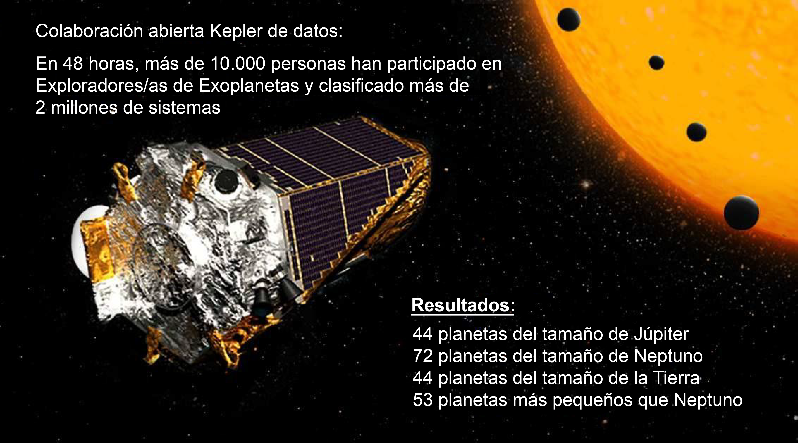

# Lección 1: ¿Qué es la Ciencia Abierta?

## Contenidos

- [Motivación por la ciencia abierta](#motivation-for-open-science)
- [¿Qué es la ciencia abierta?](#what-is-open-science)
- [¿Quién realiza ciencia abierta?](#¿-who-does-open-science?)
- [Lección 1: Resumen](#lesson-1-summary)
- [Lección 1: Evaluación](#lesson-1-knowledge-check)

## Descripción General

En esta lección vas a ver con más detalle lo que significa la ciencia abierta, así como los objetivos y los resultados que se persiguen al adoptarla tanto de forma individual o como parte de una comunidad más amplia. A continuación, revisarás ejemplos de ciencia abierta en acción. Finalmente, la lección concluye con un análisis más detallado de por qué es necesario adoptar la ciencia abierta.

## Objetivos del aprendizaje

Después de completar este módulo, deberías poder:

- Explicar cuáles son los motivos y los objetivos para hacer ciencia abierta.
- Definir qué es la ciencia abierta.
- Enumerar diferentes grupos que practican ciencia abierta.

## Motivación por la ciencia abierta

¡Bienvenido al primer módulo del programa 101 de Ciencia Abierta de TOPS! El Módulo 1 tiene cinco lecciones que presentan información sobre el Ethos de la Ciencia Abierta. Esto se refiere por un lado a las motivaciones y por el otro a las mejores prácticas para hacer la ciencia más abierta. Este curso ha sido posible gracias al trabajo del equipo de Transfórmate a la Ciencia Abierta (TOPS) de la NASA, a los expertos en Ciencia Abierta (SMEs) y a toda la comunidad de TOPS (más de 3100 personas). Todas las imágenes se citan al final de cada módulo.

¡Estamos muy contentos de que esté aquí!

Esta es la primera lección del módulo sobre el Ethos de la Ciencia Abierta. Comencemos explicando la palabra "ethos".

"Ethos es el carácter distintivo, el sentimiento, la naturaleza moral o las creencias rectoras de una persona, grupo,"

**Merriam Webster**

---

Esta lección describe y muestra lo que hace que la Ciencia Abierta sea única y se distinga de otros enfoques científicos, a partir de la forma de producción del conocimiento.

Note que «ethos» no es lo mismo que «ética», sin embargo es un término lo suficientemente amplio que permite incluir las actitudes morales de las personas o instituciones que practican ciencia abierta. Para delimitar el aspecto moral de este asunto, hablaremos en adelante de "ciencia abierta responsable".

La lección introduce el concepto de ciencia abierta en su conjunto explicando su motivación, definición y funcionamiento. A continuación, se repasan los distintos componentes de la ciencia y los pilares que los conforman. En este módulo, habremos explorado cómo la ética en la ciencia abierta nos guía para compartir, otorgar crédito adecuadamente y colaborar. "Practica la regla de oro" - trata a los demás como te gustaría que te trataran a ti en su situación.

El programa de este curso está basado en el trabajo realizado por diferentes personas alrededor del mundo y de distintos campos de investigación que prepararon el camino hacia la ciencia abierta. Este reconocimiento de la ciencia abierta como un paso necesario para igualar el acceso al conocimiento y acelerar la investigación ha inspirado a la NASA a contribuir. Las mejores prácticas, los indicadores de rendimiento y los principios básicos establecidos por la comunidad mundial de ciencia abierta son la base de nuestro actual enfoque.

### Ciencia abierta en la NASA

La NASA financia algunas de las investigaciones más diversas de cualquier agencia federal y tiene un historial de intercambio de investigaciones y resultados que se remontan al Programa Apolo en los años sesenta. El programa Transformación a la Ciencia Abierta de la NASA comparte directrices y buenas prácticas para la ciencia abierta que son aplicables y beneficiosas en toda su gama de esfuerzos de investigación.

La NASA financia la investigación en campos desde la Astrobiología hasta la Física, pasando por la ciencia básica hasta la Ingeniería aplicada. Los conjuntos de datos de la NASA incluyen biología, química, ciencias ambientales, geología, y otros campos relacionados con la exploración planetaria, ya sea robótica como humana, la evolución estelar y la búsqueda de la vida extraterrestre.

Las prácticas y principios de la ciencia abierta que desempeñan un papel fundamental en el éxito de las misiones de la NASA son igualmente relevantes para otras agencias e instituciones gubernamentales. En diversos contextos científicos se necesitan criterios, enfoques y comportamientos similares. Las herramientas para los marcos y los flujos de trabajo basados en la ciencia abierta siguen, por lo general, modelos similares.

Las prácticas y principios de la ciencia abierta pueden aplicarse a todas las fases del proceso de investigación. Uno de los primeros ejemplos de los esfuerzos de la NASA por implicar a más personas en la ciencia es [<u>el proyecto de ciencia ciudadana de búsqueda de exoplanetas</u>](https://exoplanets.nasa.gov/citizen-science/). El proyecto de [Búsqueda de exoplanetas](https://www.zooniverse.org/projects/ianc2/exoplanet-explorers) planteaba las siguientes preguntas:

- ¿Los planetas pequeños (como Venus) son más comunes que los grandes (como Saturno)?
- ¿Son más comunes los planetas de órbitas más cortas (como Mercurio) que los de órbitas más largas (como Marte)?
- ¿Es más frecuente que haya planetas alrededor de estrellas como el Sol o alrededor de las enanas rojas, que son más numerosas, frías y pequeñas?

"Stargazing Live", fue un programa de televisión emitido en vivo, durante tres noches consecutivas en 2017. Los conductores invitaban a los televidentes a participar en la investigación clasificando sistemas solares a partir de un conjunto de datos de acceso público. En las 48 horas posteriores al estreno del programa
del programa, más de 10.000 personas participaron en la [búsqueda de exoplanetas](https://www.zooniverse.org/projects/ianc2/exoplanet-explorers) y clasificaron más de 2 millones de sistemas.

Tras la primera noche del programa, los investigadores observaron los resultados mientras los ciudadanos ayudaban a analizar los datos. La segunda noche, el número de participantes fue el suficiente para que los investigadores pudieran compartir los datos de los planetas candidatos que ya habían sido marcados y que estaban siendo objeto de un análisis adicional: 44 planetas del tamaño de Júpiter, 72 planetas del tamaño de Neptuno, 44 planetas del tamaño de la Tierra y 53 subneptunos (mayores que la Tierra pero menores que Neptuno).

¡Las comunidades, trabajando juntas en un problema, pueden encontrar rápidamente nuevos resultados! La ciencia abierta permite esto y mucho más.

### Internet facilita el intercambio de la información

Históricamente, factores como el tiempo, el acceso a suficientes herramientas y datos, y la proximidad física limitada que podría estar involucrada en la ciencia, así como la facilidad con la que podría llevarse a cabo la colaboración dentro de la comunidad científica. Pero, más recientemente, recursos digitales como lo es Internet han aumentado la participación al eliminar las barreras de acceso y ofrecer una plataforma para una colaboración digital a escala mundial. Internet permitió a la población acceder a la infraestructura adecuada para desarrollar una ciencia abierta, al mismo tiempo que las prácticas de ciencia abierta hicieron posible que más personas se involucraran con los resultados producidos por la investigación. Por desgracia, aún quedan desafíos por superar para quienes no disponen de las herramientas informáticas adecuadas o no dominan determinados idiomas.

Internet genera numerosos espacios públicos para albergar archivos y acceder de forma gratuita a datos e investigaciones. Estos espacios, junto con los avances informáticos, permiten que casi cualquier persona pueda realizar análisis de datos complejos. Ahora es posible conectar a participantes, partes interesadas junto con los resultados de la ciencia abierta en Internet para que los procesos y productos científicos sean más fáciles de encontrar y acceder.

### ¿Por qué deberíamos hacer ciencia abierta ahora?

La ciencia y la comunicación científica se enfrentan cada vez más al rechazo público debido a las inadecuadas condiciones de reproducibilidad de los resultados y a la difusión de información engañosa, que respectivamente propician la falta de confianza. Las prácticas de ciencia abierta combaten esta situación a través de la colaboración de la comunidad a fin de validar los resultados de una manera más sólida, así como también, combate la desinformación al permitir que los resultados estén a disposición del público.

**Reproduce resultados**

La ciencia es más sólida y precisa cuando los científicos validan los resultados de sus colegas. Sin embargo, el rápido crecimiento del conjunto de investigaciones publicadas supone un reto abrumador para la replicación:

Fuente: [https://www.pnas.org/doi/full/10.1073/pnas.1708290115](https://www.pnas.org/doi/full/10.1073/pnas.1708290115)

- En 2011, la Asociación Americana para el Avance de la Ciencia (AAAS), editora de la revista Science, comenzó a exigir a los autores de trabajos de investigación computacional que compartieran sus datos y programas informáticos si así se les solicitaba
- En 2018, se llevó a cabo una [investigación](https://www.pnas.org/doi/full/10.1073/pnas.1708290115) que analizó la reproductibilidad de 204 artículos que fueron publicados en la revista Science a partir de 2011. Se descubrió que solo el 26 % de los artículos podían reproducirse, y las dos principales causas fueron la imposibilidad de acceder tanto a los datos o al software, y el hecho de que los métodos no se describieron con el detalle suficiente.

**¿Cuántos estudios se reprodujeron?**

 **No  Si**

**Los resultados abiertos permiten la iteración y mejoran la detección de errores**

En esta sección, veremos un ejemplo de cómo la ciencia que se mantiene cerrada puede restringir el impacto de una investigación [que persigue el resultado](https://digitalcommons.unl.edu/cgi/viewcontent.cgi?article=1318\&context=usdeptcommercepub), en este caso de un artículo muy citado de una revista. Esto nos permitirá entender cómo funciona la ciencia a la hora de informar sobre el estado de la investigación en un campo, cuáles son las decisiones de los responsables políticos y las acciones de la sociedad.

En 1990, un análisis de los datos de los satélites sobre la temperatura del clima de la tierra concluyó que la atmósfera superior no había experimentado ningún calentamiento, lo que contradecía las predicciones de los primeros modelos climáticos. Los legisladores políticos dedujeron de este resultado que los investigadores no comprendían los modelos climáticos lo suficiente como para justificar cambios en la política medioambiental. Los datos procesados de este estudio se hicieron de libre acceso pero, como era común en ese momento, tanto los datos originales como el código utilizado para procesarlos y analizarlos no fueron compartidos por el equipo inicial de la investigación. Ocho años después de la publicación del artículo, otros científicos se dieron cuenta de que los autores originales no habían tenido en cuenta varios efectos importantes. Este descuido introdujo errores en el conjunto de los datos y produjo falsamente una disminución artificial en las mediciones de temperatura. Hicieron falta otros cinco años y financiación adicional para reproducir el código y realizar un nuevo análisis. Trece años después de ese primer artículo, se confirmó que la atmósfera superior se estaba calentando y coincidía con las predicciones de los modelos climáticos.

La imposibilidad de que la comunidad científica acceda al código y a los datos originales del artículo ralentizó el ritmo de los descubrimientos, trece años en este caso, y obligó a otros equipos de investigación a repetir el trabajo (el código) en lugar de pasar a nuevos proyectos. Este no es el ritmo en el que deseamos que avance la ciencia, con un paso adelante y dos atrás para iterar y resolver problemas.

Las intenciones del grupo inicial de investigadores no era ocultar o impedir el acceso a sus datos y métodos; simplemente, las normas de la comunidad de la época no incluían compartir abiertamente los datos y el software. Esto se debe, en parte, a que permite a los investigadores mantener una ventaja competitiva a la hora de buscar oportunidades de financiación. En este caso, el grupo de investigación se limitó a seguir esta práctica habitual. Hay que cambiar esta cultura de la ciencia cerrada porque la práctica de retener código (o datos u otros componentes de la investigación) puede frustrar el progreso científico. En el ejemplo del cambio climático, un estudio erróneo podría haberse corregido de inmediato, mediante las criticas constructivas y abiertas entre colegas, pero en lugar de ello, se perjudicó la credibilidad de los científicos del clima. El impacto en el progreso de la investigación sobre el cambio climático y el beneficio que se prevée para la sociedad es enorme. Es imperativo cambiar todo el ecosistema científico, las políticas y las incentivos para dar prioridad a la apertura, si se quieren obtener todos los beneficios inmediatos de la investigación a realizar.

**La publicación tradicional limita la participación**

Históricamente, los editores científicos han cobrado tarifas de suscripción para acceder a las publicaciones y, a menudo, cargos por publicación de artículos (APC, por sus siglas en inglés) para cubrir los costos de preparación de un artículo para la impresión (incluso cuando los revisores ofrecían voluntariamente su tiempo). Estas prácticas limitan no sólo a quién puede leer los documentos sino también a quién puede publicar resultados.

La publicación de acceso abierto ha aumentado significativamente el número de artículos que están disponibles como copias electrónicas en línea. Un número cada vez mayor de gobiernos y agencias de financiación están comenzando a establecer que la investigación que es financiada por los contribuyentes debe ser accesible al público luego de su publicación. Sin embargo, el actual sistema híbrido sigue siendo deficiente a la hora de asignar los gastos de forma equitativa a lo largo del proceso de publicación de los trabajos de investigación (más información al respecto en el módulo 5).

La posibilidad de saber quién tiene acceso a los artículos publicados también motiva la ciencia abierta. [Por ejemplo](https://www.unesco.org/en/articles/can-science-be-more-equitable-so-everyone-enjoys-benefits-open-science-answer), a pesar de que hay más investigaciones con acceso abierto sobre el clima disponibles que en otros campos científicos, la mayoría de los artículos de investigación sobre el clima, incluidos muchos de los más importantes, siguen siendo de pago. La incorrecta información sobre el clima está al alcance de cualquiera en Internet, pero los resultados científicos sobre el clima se ocultan al público tras barreras de pago. Esta práctica no incrementa la confianza en la ciencia.

Fuente: [https://www.unesco.org/en/articles/can-science-be-more-equitable-so-everyone-enjoys-benefits-open-science-answer](https://www.unesco.org/en/articles/can-science-be-more-equitable-so-everyone-enjoys-benefits-open-science-answer)

## ¿Qué es la Ciencia Abierta?

Pero, ¿qué es exactamente la ciencia abierta? Para ilustrar, primero presentaremos una definición de ciencia abierta que fue desarrollada en 2023 por los Estados Unidos. [federal government](https://open.science.gov/).

«La ciencia abierta es el principio y la práctica de poner a disposición de todos, los resultados y procesos de investigación, respetando las diversas culturas, manteniendo la seguridad, la privacidad y fomentando las colaboraciones, la reproducibilidad y la equidad.»

**Memorándum de la Oficina de Política Científica y Tecnología de la Casa Blanca, 2022 (adaptado)**

---

Esta definición fue desarrollada por un equipo de Estados Unidos. organismos federales. Revisaron muchas definiciones diferentes de ciencia abierta, tanto de Estados Unidos como de otros países. y en el resto del mundo. Estas definiciones han cambiado con el tiempo a medida que la comprensión de la ciencia abierta fue madurando y enriqueciéndose. Vamos a desglosar la definición un poco más:

- Los resultados y procesos de investigación deben estar al alcance de todas las personas, no sólo de un pequeño grupo de personas expertas, sobre todo si se financian con fondos públicos.
- Los resultados y procesos de investigación deben "respetar las diversas culturas", fomentando un diálogo abierto entre personas investigadoras, pueblos originarios y comunidades locales. Esto también significa que la investigación debe respetar la diversidad de leyes y costumbres de los distintos países y/o su aplicación a los distintos tipos de investigación.
- Mientras que la ciencia abierta es nuestro objetivo, la seguridad y la privacidad siguen siendo preocupaciones importantes. Por lo tanto, debe protegerse la información sensible seleccionada.
- De los principios enunciados, "Incentivo a las colaboraciones, reproducibilidad y equidad", los dos primeros son normas de investigación, mientras que el último se refiere a la inclusión de personas que de otro modo podrían quedar al margen.

La ciencia abierta es una cultura que pretende promover la ciencia y su impacto social. La ciencia abierta crea nuevas oportunidades para distintas partes interesadas, como investigadores, responsables políticos y público en general. La ciencia abierta aumenta la transparencia, repetibilidad, reproducibilidad y confirmación de los resultados de los estudios. A lo largo de este módulo y más adelante en los módulos Open Science 101, explicaremos qué significan estos términos y por qué son importantes.

### ¿Cómo se abre la ciencia?

El Ethos de la Ciencia Abierta es un término amplio que engloba a las actitudes morales y éticas de las personas e instituciones y sus prácticas ‘abiertas’ en ciencia. Compartir los nuevos conocimientos como los procesos utilizados para obtenerlos, tiene un componente ético. Es importante señalar que no existe una única forma de practicar o desarrollar la ciencia abierta.

La diversidad de prácticas, hipótesis y objetivos forma parte de la complejidad de la ciencia abierta. También hay principios morales dispares que guían a las comunidades de ciencia abierta. Estos principios se enuncian en los «códigos de conducta». Un código de conducta es un instrumento de gestión comunitaria que define los principios y prácticas que se esperan de los miembros de una determinada comunidad de investigación, así como el procedimiento para investigar y sanción de los que incumplan el código.

En cierto sentido, un código de conducta constituye la columna vertebral moral de una comunidad de investigación. Sin embargo, al igual que ocurre con las numerosas escuelas de pensamiento, existen muchos códigos de conducta similares. En otras palabras, no existe un único conjunto de principios universales a los que se atengan todos los profesionales de la ciencia abierta. Por ejemplo, considera cómo [OLS](https://openlifesci.org/code-of-conduct),  [INOSC](https://osf.io/6gsye), [allea](https://allea.org/deeio-item/the-european-code-of-conduct-for-research-integrity-2/), [AGU](https://www.agu.org/Plan-for-a-Unioning/AGUcollectings/meetings-Resources/paramings-code-of-conduct) y [Ethical Source](https://ethicalsource.dev/community-code-of-conduct/) tienen diferentes códigos de conducta y principios de guía.

Esta gran diversidad responde a la creciente proliferación de iniciativas de ciencia abierta y al gran uso que podemos hacer de los enfoques científicos abiertos del conocimiento.

El objetivo de TOPS es impulsar a la comunidad en su conjunto, hacia la ciencia abierta como responsabilidad ética de compartir el conocimiento.

| Ética                                                                     | Moral                                                                      |
| ------------------------------------------------------------------------- | -------------------------------------------------------------------------- |
| Consenso comunitario sobre el comportamiento "apropiado". | Conjunto personal de estándares sobre la "buena" conducta. |

Puede que hayas oído hablar o nó, del término «ciencia abierta» antes de este curso. Si lo has hecho, es probable que tengas alguna idea preconcebida de la ciencia abierta y de cómo es en la práctica. Analicemos de forma conjunta esas distintas concepciones.

### Actividad 1.1: Pensemos Sobre el Qué y el Cómo de la Ciencia Abierta

En esta actividad, reflexiona sobre tus respuestas a las preguntas y luego compara tus ideas con las conclusiones clave.

- ¿Cómo es el acto de la ciencia abierta? ¿El científico utiliza o crea algo específico que caracterice su investigación como un caso de investigación abierta? ¿Qué se te ocurre?
- Describe cómo compartes actualmente tus recursos (datos, código, resultados)?
- ¿Cómo podrías compartir tus recursos de una forma más abierta en el futuro?
- ¿Qué te impide hacerlo?

**Conclusiones Clave:**

Hay muchas maneras de hacer ciencia abierta. Una de las mejores maneras de comenzar tu camino en ciencia abierta es pensar en cómo haces ciencia y cómo podrías hacer tu ciencia más abierta.

**Objetivos de la Ciencia Abierta**

Los aspectos de la implementación de la ciencia abierta requieren tiempo y experiencia. Este curso proporciona pasos prácticos y ejemplos valiosos para hacer que la ciencia abierta suceda.

Los objetivos de la ciencia abierta incluyen:

- Facilitar el beneficio colectivo.
- Alcanzar el desarrollo y la innovación inclusivas.
- Producir resultados equitativos.
- Garantizar un control adecuado de los datos que utilices, elabores o compartas a lo largo de tu proceso de investigación, y cumplir las directrices normativas, reglamentarias y legales sobre su divulgación.
- Fomentar relaciones respetuosas con las comunidades culturalmente diversas que puedan proveer o interactuar con tus datos, software y resultados.
- Comprometerse activamente con las comunidades interesadas en aumentar la representación y la interacción a lo largo de sus investigaciones. Las personas que formen parte de cualquier comunidad que provea datos deben ser quienes determinen los beneficios, daños y futuros usos potenciales, basándose en los valores y prioridades de su comunidad.

### Fomentar Colaboraciones, Reproducibilidad y Equidad

La IDEA de la Ciencia Abierta: Inclusiva, Diversa, Equitativa y Accesible.

Utilizar, crear y compartir abiertamente los resultados de la investigación, el software o los conjuntos de datos permite a todos reconocer el mérito de tu trabajo.

Compartir se basa en la creencia de que el acceso a la información y la capacidad de colaboración es esencial para promover la comprensión científica y resolver problemas complejos.

El intercambio abierto permite una mayor transparencia en el proceso científico, facilita la reproducibilidad, permite la colaboración y la inclusión de perspectivas y conocimientos más diversos y hace que el conocimiento científico sea más accesible al público.

El compartir de manera abierta no sólo ayuda a la sociedad, sino que también puede beneficiarnos a cada una de las personas que investigamos. Puede dar una mayor visibilidad, repercusión y crédito a sus resultados, datos y programas informáticos; puede facilitar el acceso a nuevas colaboraciones e ideas, y puede cumplir responsabilidades éticas y sociales.

### Actividad 1.2: Definición de Ciencia Abierta

#### Relacione las partes de la definición de OSTP con el concepto relevante de IDEA/Respetando diversidad cultural.

<table>
  <tbody><tr>
    <td>Colabora con comunidades interesadas para aumentar los esfuerzos de investigación</td>
    <td>Respetando la representación de la diversidad cultural en el proceso</td>
  </tr>
  <tr>
    <td>Fomentar inclusión, diversidad, equidad y accesibilidad</td>
    <td>IDEA</td>
  </tr>
</tbody></table>

#### Completa la palabra faltante en la definición de ciencia abierta.

"La Ciencia Abierta es el principio y práctica de hacer los resultados y procesos de investigación _____ para todas las personas, respetando culturas diversas, manteniendo la seguridad, privacidad, y fomentando colaboraciones, reproducibilidad y equidad"

\- La Oficina de Ciencia y
Política de Tecnología (OSTP) Memo, 2022

#### Según la Oficina de Ciencia y Tecnología de la Casa Blanca, la apertura de la ciencia promueve...

Seleccione todas las opciones que correspondan.

- Colaboración
- Competición
- Equidad
- Accesibilidad limitada
- Reproducibilidad

### Ejemplos de Ciencia Abierta en acción

<table>
  <thead>
    <tr>
        <th>EJEMPLO 1: LAS PERSONAS CIUDADANAS DEDICADAS A LA CIENCIA IMPULSAN NUEVOS MÉTODOS DE INVESTIGACIÓN</th>
        <th>EJEMPLO 2 : DATOS DE RADAR PARA VIGILAR EL CAMBIO CLIMÁTICO</th>
    </tr>
  </thead>
  <tbody>
    <tr>
        <td colspan="2">
            
JunoCam es una cámara/telescopio que está a bordo de la nave espacial Juno que orbita alrededor de Júpiter. Se añadió a Juno específicamente para personas ciudadanas científicas y fines de divulgación pública.

            
El propósito original de la cámara no era hacer ciencia, sólo observar. Sin embargo, se dio acceso a personas ciudadanas científicas, quiénes procesaron las fotografías ensamblando las distintas series de imágenes de JunoCam. La participación de la comunidad científica ciudadana ayudó a incrementar la utilidad de la cámara y <a href="https://www.nasa.gov/missions/europa-clipper/citizen-scientists-enhance-new-europa-images-from-nasas-juno/">llevó a un éxito imprevisto</a>. Las icónicas imágenes de Júpiter y Europa creadas por estas personas ciudadanas científicas, han intrigado e inspirado a personas de todo el mundo.

            
Los datos recogidos también beneficiaron a la ciencia tradicional.

            
"Prácticamente todo lo que estamos aprendiendo sobre las estructuras y la dinámica de las nubes de Júpiter procede de imágenes publicadas", afirma Candice Hansen, científica planetaria y responsable de JunoCam. Hansen explica: "El equipo está procesando algunas imágenes por sí mismo, pero al no disponer de personal para ello, el equipo de investigación confía en el trabajo de la ciudadanía científica"

            
El equipo de la nave espacial Juno hizo posible una ciencia nueva e inesperada gracias a unos datos abiertos y de fácil acceso. La participación pública aportó nuevas perspectivas y amplió la capacidad del equipo para llevar a cabo valiosas investigaciones.

            
Créditos:

            
Datos de la imagen: NASA/JPL-Caltech/SwRI/MSSS

            
Procesamiento de imágenes: Navaneeth Krishnan S ©️ CC BY

            

        </td>
    </tr>
  </tbody>
</table>

<table>
  <thead>
    <tr>
        <th>EJEMPLO 1: LA CIUDADANÍA DEDICADA A LA CIENCIA IMPULSA NUEVOS MÉTODOS DE INVESTIGACIÓN</th>
        <th>EJEMPLO 2: DATOS DE RADAR PARA VIGILAR EL CAMBIO CLIMÁTICO☑</th>
    </tr>
  </thead>
  <tbody>
    <tr>
        <td colspan="2">
            
¿Alguna vez has visto imágenes del pronóstico del tiempo para tu ubicación? Esos datos proceden de las estaciones de radar NEXRAD, muchas de las cuales llevan funcionando más de 30 años. Los datos siempre se han puesto a disposición del público, pero pueden resultar difíciles de utilizar. Se utilizaba, principalmente, para información sobre la lluvia, por lo que las estaciones no veían la necesidad de hacerla fácilmente accesible después de 24 horas. Las personas que querían los datos históricos de NEXRAD tenían que seguir arduos pasos:

            <ul>
            <li>Ir al sitio web.</li>
            <li>Realizar una solicitud (pero no una demasiado extensa).</li>
            <li>Esperar a que un robot lea los datos de la cinta de almacenamiento y los copie en línea.</li>
            <li>Recibir un correo electrónico con instrucciones sobre dónde descargar los datos de la persona usuaria.</li>
            <li>Descargar los datos.</li>
            </ul>
            
El enorme tamaño del conjunto de datos, más de 250 TB, hacía prácticamente imposible realizar análisis a gran escala. Nadie tenía tiempo para hacer estas solicitudes y descargar los datos poco a poco.

            
<strong>Sin embargo, en 2015, todos los datos de NEXRAD se trasladaron a la nube y se pusieron a disposición libremente. El uso del conjunto de datos aumentó casi de inmediato</strong>

            
Las personas investigadoras empezaron a utilizar los datos del NEXRAD para otros tipos de ciencia. Por ejemplo, utilizaron las lecturas del radar <a href="https://aws.amazon.com/blogs/publicsector/the-birds-in-the-cloud-how-the-university-of-oklahoma-uses-nexrad-data-to-study-birds/">NEXRAD de las aves para controlar los patrones de vuelo.</a> ¡En particular, de los martines pescadores! Los martines pescadores forman enormes colonias de hasta 50.000 aves que pueden rastrearse utilizando el radar. Los martines pescadores realizan impresionantes espectáculos aéreos que pueden seguirse con la misma tecnología antes reservada a las mediciones de la lluvia.

            
En otro ejemplo de los nuevos usos del NEXRAD, un estudio dirigido por la NASA relacionó la variabilidad <a href=https://climate.nasa.gov/news/3201/climate-patterns-thousands-of-miles-away-affect-us-bird-migration/?s2=P1382021636_1683417608248277265>ben la migración de las aves con patrones climáticos a gran escala que se originan a miles de kilómetros</a>. Cuanto mejor comprendan las personas que gestionan el territorio las pautas migratorias actuales y prevean los cambios de comportamiento de estas aves debido al cambio climático, mejor podrán dirigir sus esfuerzos de conservación y restauración del hábitat. Los datos de radar recientemente accesibles proporcionan una visión valiosa necesaria para lograr sus objetivos. Este estudio fue financiado por la NASA, utiliza los datos de NOAA NEXRAD, y está completamente disponible por primera vez por el programa de datos públicos de AWS (AWS Public data program).

            
La ciencia del futuro hace que los datos sean tan fáciles de usar que permite hacer nuevas preguntas, y responderlas rápidamente para beneficiar a la sociedad y a la política.

        </td>
    </tr>
  </tbody>
</table>

### Puntos clave: Definición de Ciencia Abierta

La ciencia abierta es multifacética y puede significar cosas diferentes para diferentes personas. Algunas personas que investigan pueden pensar en la ciencia abierta como publicaciones de acceso abierto o como ciencia ciudadana. En este módulo, y más ampliamente en este plan de estudios, dejamos claro que la ciencia abierta engloba todos estos diversos aspectos. Ahora mismo, puede que te sientas más cómodo con algunos aspectos de la ciencia abierta que con otros, ¡y eso está bien! Esperamos que entiendan mejor el alcance y los matices de la ciencia abierta al final de este plan de estudios, y también comprendan las ventajas de hacer ciencia abierta, como hemos empezado a comentar en esta sección. Específicamente, la creciente cantidad de información sobre procesos y productos científicos disponible en línea permite el acceso de un abanico mucho más amplio de personas y comunidades para utilizar, realizar y compartir investigaciones y resultados científicos.

## ¿Quién hace Ciencia Abierta?

Como se discutió brevemente en lecciones anteriores, la ciencia abierta no sólo involucra a quienes investigan; muchos otras partes interesadas se ven afectadas por los resultados de la ciencia abierta. Las partes interesadas incluyen a cualquier persona que pueda afectar o verse afectada por proyectos de ciencia abierta.

La investigación científica debería beneficiar a la humanidad. Aunque la ciencia abierta tiene muchas partes interesadas, la interacción ventajosa entre la ciencia y la sociedad tiene lugar entre tres grupos principales: las personas científicas que investigan, los responsables políticos y el público. Quienes investigan hacen ciencia y comparten sus resultados con las personas responsables de la política y el público en general para informar de sus decisiones y mejorar sus vidas. El público ayuda a financiar la investigación a través de impuestos y puede hacer aportes a futuras áreas de estudio. Las personas decisoras de la política ayudan a implementar medidas que se basan en resultados científicos para mejorar la salud, el ambiente y la vida de la sociedad.

Estos tres grupos de interés siguen siendo fundamentales para el mundo de la ciencia abierta. Sin embargo, la naturaleza inclusiva de la ciencia abierta exige la participación del público en general. El crecimiento en la participación pública en la ciencia puede ocurrir eliminando las barreras para aquellas personas históricamente excluidas y ampliando la comunidad de personas que apoyan la investigación científica en sí misma.

A continuación enumeramos algunos de los principales grupos que consideramos que participan en la ciencia abierta o se benefician de ella, siendo plenamente conscientes de que esta lista no es exhaustiva y de que las categorías que elegimos aquí tienen límites muy difusos.

_Selecciona cada pestaña para obtener más información._

<table>
  <thead>
    <tr>
        <th>PERSONAS INVESTIGADORAS ☑</th>
        <th>DECISORES DE POLÍTICAS</th>
        <th>PÚBLICO GENERAL</th>
    </tr>
  </thead>
  <tbody>
    <tr>
        <td colspan="3">
            
A menudo se considera a quienes investigan como quienes hacen ciencia abierta para beneficiar a otras personas. Sin embargo, las propias personas investigadoras también pueden beneficiarse considerablemente de la ciencia abierta. Su trabajo puede lograr una mayor visibilidad entre colegas y el público, reciben reconocimiento por toda una serie de actividades relacionadas con su ciencia (incluido el tiempo dedicado a compartir datos y código, por ejemplo) y tienen más acceso a los conjuntos de datos.

            
Un equipo de promoción y colaboración permite que esta investigación se lleve a cabo. La ciencia abierta pretende incluir a estos miembros de apoyo en el proceso científico y garantizar que se les reconozca su contribución a la mejora de la ciencia.

        </td>
    </tr>
  </tbody>
</table>

<table>
  <thead>
    <tr>
        <th>INVESTIGADORES</th>
        <th>DECISORES DE POLÍTICAS ☑</th>
        <th>PÚBLICO GENERAL</th>
    </tr>
  </thead>
  <tbody>
    <tr>
        <td colspan="3">
            
Quienes se avocan a la confección de políticas representan a otra comunidad clave en el entorno científico. Las personas responsables de las políticas pueden hacer referencia a los hallazgos científicos para sustentar sus decisiones en pos de mejorar la sociedad. Quienes contribuyen a la comprensión y difusión de estas políticas (incluidos el sector educativo y del periodismo científico) son cruciales en este proceso. Las personas responsables de la formulación de políticas también pueden desempeñar papeles importantes a la hora de asegurar y facilitar la ciencia abierta, estableciendo procesos de gestión de datos, fomentando la legislación sobre acceso abierto, y desarrollando pautas éticas para los experimentos. Las personas responsables de la formulación de políticas pueden beneficiarse de la ciencia abierta al obtener un mejor acceso a la producción científica mediante el intercambio abierto de los resultados de investigación.

        </td>
    </tr>
  </tbody>
</table>

<table>
  <thead>
    <tr>
        <th>INVESTIGADORES</th>
        <th>DECISORES DE POLÍTICAS</th>
        <th>PÚBLICO GENERAL ☑</th>
    </tr>
  </thead>
  <tbody>
    <tr>
        <td colspan="3">
            
El público desempeña hoy un papel crucial en la ciencia como consumidor de resultados científicos que toma decisiones basadas en resultados científicos, y adhiere a políticas modeladas por éstos. La ciencia abierta puede hacer que los resultados científicos, los datos y los flujos de trabajo sean más accesibles al público reforzando las vías de acceso a fuentes de información fiables, lo que a su vez aumenta la confianza en la ciencia. El público también puede formar parte de la ciencia abierta a través de proyectos de ciencia comunitaria, por ejemplo, voluntariamente para recolectar o administrar datos. Como resultado, quienes participan aumentan su comprensión de la ciencia y se sienten empoderados mediante oportunidades para ejercer influencia.

        </td>
    </tr>
  </tbody>
</table>

La ciencia abierta puede fortalecer la conexión entre todos estos grupos. La comunicación entre quienes investigan profesionalmente y el público y quienes son responsables de la formulación de políticas puede mejorar drásticamente con un conocimiento científico más transparente y accesible.

### Actividad 1.2: Pensar sobre Ciencia Abierta

En esta actividad, reflexiona sobre tus respuestas a las preguntas y luego compara tus ideas con las conclusiones clave.

- En tu área, ¿qué medidas se están adoptando para aumentar la apertura, y qué se interpone en ese camino?
- ¿Qué podría ayudar a aumentar la apertura?
- ¿Qué se interpone en el camino?

**Principales Conclusiones: Cómo la Ciencia cerrada te afecta**

Algunos informes de observación son difíciles de replicar debido a la singularidad de las observaciones o a consideraciones éticas (por ejemplo, eventos astronómicos únicos y observaciones ecológicas a largo plazo, o experimentos accidentales como choques y liberaciones involuntarias de contaminantes).

Aquí, nos gustaría que consideraras las limitaciones generadas por el software, datos o métodos que no se describen o no se hacen accesibles de forma completa.

## Lección 1: Resumen

En esta lección, has aprendido:

- La motivación para la ciencia abierta, así como sus metas y resultados.
- Por qué deberíamos hacer ciencia abierta ahora y cómo la tecnología la ha hecho más factible.
- La definición de la ciencia abierta.
- Diferentes grupos que hacen ciencia abierta.

## Lección 1: Evaluación

Responde las siguientes preguntas para poner a prueba lo que ha aprendido hasta ahora.

_Pregunta_

**01/04**

¿Qué es la ciencia abierta?

- Compartir toda la información para que cualquiera pueda acceder a ella.
- Una definición legal de ciencia libre.
- Una forma matizada de compartir el proceso y los productos de la ciencia.

_Pregunta_

**02/04**

¿Por qué la ciencia abierta está sucediendo ahora?

- Comunicar los resultados de investigación es un aspecto integral de la ciencia.
- Internet y la creciente disponibilidad de computadoras permiten el acceso a una porción mucho más amplia de la sociedad.
- Quienes investigan tienen la obligación por ley de compartir todos sus hallazgos y datos brutos inmediatamente después de llevar a cabo sus experimentos.
- La ciencia abierta está ocurriendo ahora debido a una escasez global de profesionales académicos, lo que requiere un involucramiento del público generalizado.

_Pregunta_

**03/04**

Selecciona todas las acciones de ciencia que fomenten la colaboración, la reproducibilidad y la equidad.

- Compartir abiertamente datos, software y resultados.
- Priorizar la velocidad de publicación más rápida posible para asegurar que los resultados se difundan velozmente.
- Asegurar que la mayor parte de los recursos se asignen a los campos de investigación más populares y ampliamente informados.

_Pregunta_

**04/04**

¿Qué problemas sociales puede ayudar a encarar la ciencia abierta? Selecciona todos los que correspondan.

- Crisis de reproducibilidad científica.
- Difusión de desinformación
- Aumento del uso de papel debido a la impresión de revistas y artículos científicos.
- La superpoblación de determinadas especies animales usadas en ensayos de laboratorio.
- La cuestión del interés decreciente en los estudios artísticos y culturales debido al énfasis en la investigación científica.
- Los crecientes costos de los bienes de consumo de lujo se ven influidos por los avances tecnológicos.
