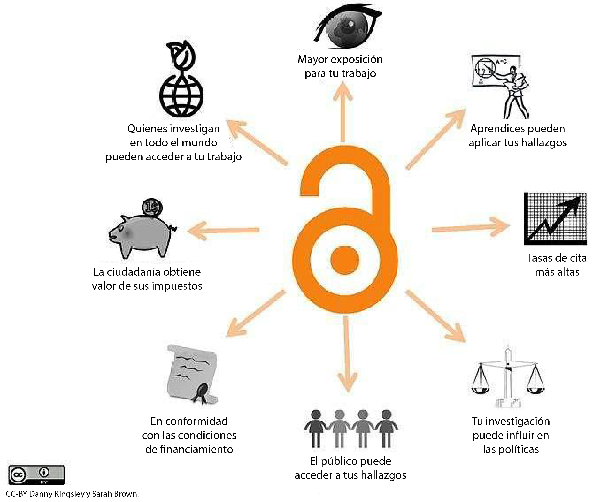
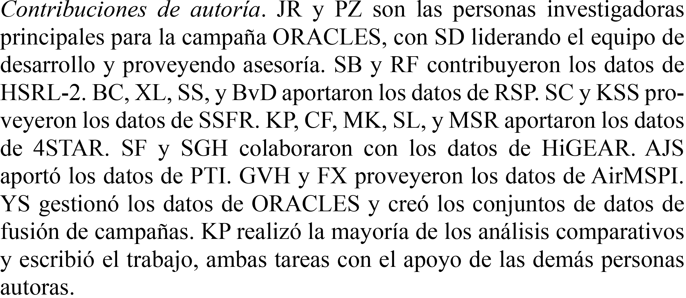

# Lección 2: ¿Por qué es importante la Ciencia Abierta?

## Contenidos

- [La Ciencia Abierta rompe barreras y promueve la innovación](#la-ciencia-abierta-rompe-barreras-y-promueve-la-innovacion)
- [Beneficios individuales](#beneficios-individuales)
- [Beneficios para la ciencia](#beneficios-para-la-ciencia)
- [Beneficios para la sociedad](#beneficios-para-la-sociedad)
- [Lección 2: Resumen](#leccion-2-resumen)
- [Lección 2: Evaluación](#leccion-2-evaluacion)

## Resumen

En esta lección aprenderás cómo la adopción de la Ciencia Abierta beneficia a la sociedad y a ti en la investigación. También aprenderemos sobre algunos de los desafíos y obstáculos que se presentan al utilizar los principios de la Ciencia Abierta y cómo superarlos.

## Objetivos de aprendizaje

Al finalizar esta lección deberías ser capaz de:

- Describir las maneras en que la Ciencia Abierta beneficia tu carrera con atribuciones, alcance y más colaboraciones.
- Describir las formas en que la Ciencia Abierta puede promover la ciencia.
- Listar los beneficios que la sociedad obtiene cuando se adoptan los principios de la Ciencia Abierta.

## La Ciencia Abierta rompe barreras e impulsa la innovación

"Necesitamos más ciencia colectiva que ciencia individual".

**Harlan Krumholz,**

**Escuela de Medicina de Yale, Reunión CZI, 2022.**

---

A medida que la NASA mira hacia el exterior, nos enfrentamos a desafíos conocidos e inesperados. Estos retos dinámicos exigirán un nuevo enfoque de la ciencia, que logren el éxito a través de un ecosistema científico receptivo e inclusivo. Esto requiere equipos más diversos: equipos con más manos, ojos y cerebros que tengan diversas experiencias para participar.

En la lección anterior, aprendimos sobre conceptos fundacionales que definen la Ciencia Abierta -su importancia, su propósito y sus éxitos probados. En esta lección, abordamos los beneficios y retos clave de la implementación de principios de la Ciencia Abierta en las actividades de investigación.

Esta lección presenta una perspectiva sobre el desarrollo de la ciencia centrada en la intersección de los resultados científicos, el proceso de creación y las partes interesadas que constituyen la comunidad.

Además, destaca los beneficios de la Ciencia Abierta en una amplia gama de grupos de interesados, junto con ejemplos que invitan a los lectores a investigar más. La lección explora también los desafíos más usuales a la hora de adoptar prácticas en Ciencia Abierta.

Imagen: Existen muchos beneficios en la Ciencia Abierta. Adaptación de [CC-BY Danny Kingsley y Sarah Brown](https://blogs.uef.fi/ueflibrary-bors/benefits-and-challenges-of-open-science/).

## Beneficios para ti

### ¡Eres tu mejor colaborador futuro!

Hacer Ciencia Abierta no sólo permite que otras personas entiendan y reproduzcan tus resultados, sino que también te permite hacerlo a tí! Implementar principios de Ciencia Abierta, tales como buena documentación y control de versiones, ayuda a colaboradores potenciales y a cualquier otra persona que se interese en entender tus resultados.

Si tu trabajo se comparte públicamente, nunca perderás el acceso incluso si cambias de institución o de empleo. Muchas personas investigadoras rotan por instituciones y organizaciones. Al tener sus datos, software y resultados en repositorios, siempre tienen acceso a ellos.

La implementación de buenas prácticas de Ciencia Abierta en una investigación no sólo te ayuda a documentar, sino que puede fortalecer tus propuestas de financiación. Las agencias de financiación han comenzado a darse cuenta de que compartir abiertamente productos de investigación puede aumentar sus citas recibidas y aplicadas, lo que resulta en un mejor rendimiento de la inversión.

Los productos de investigación bien documentados también demuestran la calidad de tu trabajo, lo que ayuda en los esfuerzos de comunicación pública y también puede atraer mejores colaboradores. La fiabilidad y una ética de trabajo fuerte motivan a las demás personas a querer trabajar contigo.

### Dar y obtener crédito al usar los resultados de otras personas

Además de documentar tus propias investigaciones, la práctica de dar crédito a todos quienes han contribuido fortalecerá tu reputación en la comunidad científica y actualizará los valores compartidos de la Ciencia Abierta. A medida que las personas ganen confianza en los beneficios de la investigación cooperativa, también comenzarán a dar crédito a más contribuciones que antes podrían no haber sido reconocidas. Las diferentes tareas realizadas en un artículo pueden detallarse en una Declaración de Contribución como la del ejemplo compartido aquí.

La ilustración del proyecto Turing Way de Scriberia. Utilizada bajo una licencia CC-BY 4.0. DOI: 10.5281/zenodo.3332807.

---

### Más visibilidad e impacto

Además de mejorar la precisión científica, adherirse a las prácticas científicas abiertas potencialmente ofrece beneficios personales para quienes 
investigan. La investigación publicada de forma abierta tiene mucho más visibilidad y potencial de impacto con grandes audiencias a través de Internet, que puede llevar a más citas, colaboradores de ideas afines y oportunidades de carrera/financiación, de acuerdo con un [estudio](https://pubmed.ncbi.nlm.nih.gov/27387362/) de 2016.

#### Evidencia emergente de que algunos aspectos de la Ciencia Abierta pueden aumentar sus citas.

Publicar como Acceso Abierto incrementa el número de citas en un 18%, según un [estudio](https://www.ncbi.nlm.nih.gov/pmc/articles/PMC7176083/) de 2018.

Los artículos que hacen que sus datos sean abiertamente accesibles a través de un enlace directo a un repositorio consiguen aproximadamente 25% más de impacto en la cita, de acuerdo con un estudio de 2020.

Publicar como Acceso Abierto puede tener costos prohibitivos para quienes investigan dependiendo del lugar. A menudo hay otras opciones que permiten a los autores y autoras compartir su trabajo libre y abiertamente. En el Módulo 5 sobre Resultados Abiertos, discutimos algunas de estas otras opciones incluyendo preimpresiones y Acceso Abierto diamante.

Hay muchos resultados de investigación diferentes que se pueden compartir abiertamente y hacer citables:

- Código
- Datos
- Diapositivas de charlas de investigación
- Clases
- Entradas de blog
- ¡Y más!

¡Todos estos son resultados científicos concretos! Gran parte de nuestro tiempo como personas que investigamos se dedica a escribir código, recopilar datos, preparar clases y no \*solo\* publicaciones. Compartir públicamente materiales hace más probable recibir una cita.

### Más colaboraciones

Las prácticas de Ciencia Abierta también pueden hacer posibles colaboraciones más fuertes, tanto dentro como entre disciplinas, como lo demuestra un [estudio]
(https://liberquarterly.eu/article/view/10819) de 2016. La facilidad de acceso a los datos abiertos suma nuevos agentes al paisaje que permiten una participación más amplia y diversa. A través de prácticas de Ciencia Abierta, como el pre-registro en el que las personas investigadoras documentan su plan de investigación al comienzo de un estudio, se permite un diseño de investigación más fuerte porque es posible solicitar la retroalimentación de distintos colaboradores y partes interesadas antes de que comience la recolección de datos. De igual forma, las preimpresiones permiten una retroalimentación más rápida sobre las conclusiones extraídas de los datos una vez que son recopilados.

### Actividad 2.1: Beneficios para ti

En esta actividad, reflexiona sobre tus respuestas a las preguntas y luego compara tus pensamientos con las conclusiones clave.

- ¿Puedes encontrar tu propio trabajo previo, post publicación y/o prepublicación? ¿Puedes llevar tus materiales de investigación (datos, código, resultados) contigo si cambias de institución?
- ¿Puedes encontrar el trabajo de tus colaboradores? ¿De colegas de otros campos que encuentras interesante? ¿Te has acercado a otras personas para colaborar con ellas después de encontrar resultados interesantes?
- ¿Las personas de tu campo están dando y obteniendo crédito por el trabajo realizado?

**Conclusiones clave: Beneficios para ti**

- La apertura fomenta mejores prácticas de investigación y te facilita desarrollar tu trabajo.
- Los resultados abiertos tienen más visibilidad e impacto.
- La Ciencia Abierta fomenta más ciencia colaborativa.

## Beneficios a la ciencia

### La ciencia transparente es ciencia reproducible

Cuando las computadoras se utilizan para producir investigaciones científicas, el código producido se considera un "método". Al igual que un entorno de investigación de laboratorio, un conjunto de instrucciones para trabajar con células o placas de agar puede considerarse un método. Los métodos de revisión por pares son un paso esencial en el proceso científico. Cuando estos pasos no se comparten, nadie más puede reproducir el trabajo o construir sobre él para futuros esfuerzos científicos. Los métodos abiertos permiten que las personas juzguen si estos son o no dignos de confianza. En la Lección 1, la historia del "Error del enfriamiento global" presentó un ejemplo conmovedor de ciencia que no era reproducible debido a la falta de transparencia de los datos.

### La Ciencia Abierta puede mejorar la precisión

Un [estudio](https://www.nature.com/articles/s41562-021-01193-7) de 2022 encontró que las personas investigadoras que practican la transparencia y promueven la verificabilidad se benefician de lectores e interesados que juzgan si los resultados presentados son exactos y, de acuerdo a un [estudio](https://www.cmu.edu/dietrich/sds/docs/loewenstein/MeasPrevalQuestTruthTelling.pdf) relacionado, si no fueron producidos por prácticas de investigación cuestionables que conducen a resultados engañosos o poco fiables.

La Ciencia Abierta también permite a otros examinar las decisiones analíticas de quienes investigan, por ejemplo si el análisis fue planificado antes o después de observar los datos, de acuerdo a un [estudio](https://www.pnas.org/doi/full/10.1073/pnas.1708274114) de 2018.

Esto permite a otros comprobar si pueden llegar a la misma conclusión que el equipo de investigación original y facilita una mayor confianza y apoyo del público, de acuerdo con un [reporte](https://unesdoc.unesco.org/ark:/48223/pf0000379949_spa) de la UNESCO de 2021.

Aquí hay un ejemplo de Ciencia Abierta que fue capaz de corregir errores en un estudio de salud rápidamente, ¡salvando vidas! En 2021, se publicó un [estudio](https://www.nature.com/articles/s41598-021-84092-1) que descubrió que las políticas de "quedarse en casa" no detuvieron la transmisión del virus de Covid. El estudio fue destacado por los prominentes escépticos del aislamiento y los sitios de noticias, lo que rápidamente aumentó la atención de muchas personas en un momento crítico de la pandemia. ¡Había un artículo de investigación científica que decía que los bloqueos no funcionan! Los autores del estudio publicaron el código fuente y los datos con su artículo. Esto permitió que otros examinaran rápidamente cómo llegaron a su conclusión. Casi inmediatamente, se plantearon preguntas sobre el documento y en nueve meses, dos documentos [aquí](https://www.nature.com/articles/s41598-021-02461-2) y [aquí](https://www.nature.com/articles/s41598-021-02096-3) señalaron errores importantes en el método de análisis. El documento original fue retirado. Todos cometemos errores. En este caso, el documento tenía importantes implicaciones políticas y, debido a que los autores originales habían practicado la Ciencia Abierta, ¡el error se corrigió rápidamente!

### Abrir la ciencia conduce a más descubrimientos

El Observatorio Solar y Heliosférico (SOHO, por sus siglas en inglés) ha estado enviando imágenes de nuestro sol dinámico, abriendo una nueva era de observación solar. Fue diseñado para la heliofísica. Sin embargo, científicos planetarios encontraron que SOHO es útil por su habilidad para detectar cometas que pasan muy cerca del sol, conocidos como cometas rasantes solares. Hasta la fecha, SOHO es una de las mejores fuentes de imágenes de las gigantescas explosiones superficiales producidas regularmente por el Sol, denominadas eyecciones de masa coronal o CMEs (por sus siglas en inglés), que pueden lanzar al espacio un millón de toneladas de partículas solares. Este campo de visión es lo suficientemente grande como para ver un cometa rozando el sol mientras gira a su alrededor.

El gran éxito de SOHO como buscador de cometas depende, por supuesto, de las personas que examinan los datos de SOHO, una tarea que se abrió al mundo al hacer públicos los datos en tiempo real.

Un grupo de astrónomos voluntarios aficionados se dedica a buscar estos datos a través del Proyecto Sungrazer, financiado por la NASA. Mientras que los las personas científicas suelen buscar en las imágenes acontecimientos muy concretos, varios miembros de la comunidad astronómica optan por analizar con detalle todas las imágenes disponibles. Más de 2.300 cometas han sido encontrados, el 75% de ellos por personas que hacen Ciencia Ciudadana. Esto creó un gran conjunto de datos que sirven de entrenamiento para algoritmos. Los científicos y científicas de la NASA disponían de algoritmos para encontrar cometas que consideraban suficientemente precisos.

Sin embargo, en 2022, la NASA decidió financiar un desafío abierto al público para desarrollar nuevos algoritmos y, ¿adivina qué? ¡Dos nuevos algoritmos fueron descubiertos juntos con dos cometas nuevos!

### Calidad y diversidad de las comunicaciones académicas

Además, la Ciencia Abierta mejora la situación de la literatura científica. Según un [estudio](https://pubmed.ncbi.nlm.nih.gov/30523135/) de 2018, las revistas científicas han enfrentado el grave problema del sesgo de publicación, donde los artículos en las revistas presentan una cantidad abrumadora de resultados novedosos y positivos. Sumado a ello según un estudio de 2011 y 2016, esto lleva a que los resultados científicos publicados en ciertas disciplinas pueden reportar efectos exagerados, o incluso ser “falsos positivos” (afirmar de forma errónea que existe un efecto) dificultando la evaluación de la fiabilidad de los mismos. Las prácticas de la Ciencia Abierta, tales como registrar informes, mitigan el sesgo de la publicación y mejoran la fiabilidad de la literatura científica. Los informes registrados son formatos de publicación en los que la revisión y aceptación de los artículos toma lugar antes de que se lleve a cabo la recopilación de datos, de esta manera se elimina la presión para distorsionar los resultados de acuerdo a un [estudio](https://www.nature.com/articles/s41562-021-01193-7) publicado en 2022. Otras prácticas de Ciencia Abierta, como el pre-registro, permiten una vista parcial a proyectos que por diversas razones (como la falta de financiación, problemas logísticos o cambios en las prioridades organizacionales) no han sido completados o difundidos, según reporta un estudio de 2023 (https://pubmed.ncbi.nlm.nih.gov/34396837/), dando a estos proyectos una manera de publicar resultados disponibles que puede ayudar a informar sobre el estado actual de la investigación.

Al utilizar herramientas libremente disponibles y haciendo más accesibles nuestros procesos y productos científicos, podemos garantizar que todos los que lo deseen puedan participar en la comunidad científica mundial.

### Conclusiones clave: Beneficios para la ciencia

- La Ciencia Abierta puede acelerar los descubrimientos científicos. El conocimiento colectivo no sólo es más rápido, sino que es además más eficaz que los esfuerzos individuales.
- La Ciencia Abierta permite que los errores sean corregidos rápidamente, lo que hace que la ciencia sea más precisa.
- Las prácticas de Ciencia Abierta, como los informes registrados, mitigan el sesgo de publicación y mejoran la fiabilidad de la literatura científica.

## Beneficios para la sociedad

El uso generalizado de la Ciencia Abierta comenzó hace relativamente poco. Los beneficios potenciales de la Ciencia Abierta se extienden más allá de la investigación a través de contribuciones a la sociedad y las políticas.

La colaboración, la innovación, la educación, el avance tecnológico y las políticas públicas basadas en la ciencia mejoran gracias a la disponibilidad de los productos de investigación. Compartir todos los productos derivados de la investigación (datos, códigos, resultados, etc.) hace más transparente el proceso científico, lo que puede contribuir a aumentar la confianza del público en la ciencia. Además, la Ciencia Abierta fomenta IDEA (Inclusión, Diversidad, Equidad, Accesibilidad) y aumenta la participación de ciudadanos y personas no expertas en el proceso de investigación. La inclusión de diversos puntos de vista de una comunidad abierta invita a perspectivas únicas que contribuyen a un resultado científico más sólido y, a menudo, más preciso.

Las personas científicas estudian cuestiones que afectan a todos los aspectos de la vida. Sin embargo, el interés del público general por la ciencia sigue siendo bajo debido a la falta de confianza, comprensión y factores socioculturales. ¿Cómo pueden esperar quienes investigan que el público general confíe en la ciencia sobre cuestiones complejas y a menudo polémicas -como el desarrollo de vacunas, la llegada a la luna, etcétera- si no permiten que el público vea el proceso y los resultados obtenidos? Generar confianza en la ciencia es esencial para una sociedad bien informada. La Ciencia Abierta ofrece una vía para lograrlo.

El público general que financia la investigación gubernamental a través de los impuestos debería tener derecho a sus resultados y acceso a sus datos, siempre que la seguridad y la protección no sean un problema. La ciencia debe ser más abierta para garantizar que el conocimiento generado beneficie al público que la hace posible.

La Ciencia Abierta incrementa el escrutinio en la investigación lo que ayuda a garantizar la precisión y fomenta la eficiencia a través del discurso abierto. Este enfoque acelera el ritmo de los descubrimientos y, posteriormente, la difusión de los resultados al público y a los responsables de las políticas.

### La Ciencia Abierta puede acelerar el ritmo al que avanza la ciencia

Las prácticas de Ciencia Abierta aceleran el ritmo de los descubrimientos científicos al introducir ideas y el trabajo de la comunidad en general. La respuesta rápida a la [pandemia de Covid-19 mostró a la Ciencia Abierta en acción para acelerar los descubrimientos](https://www.nejm.org/doi/full/10.1056/NEJMp2034518).

En enero de 2020, las personas investigadoras hicieron pública la secuencia inicial del genoma del SARS-CoV-2 a través de una base de datos de libre acceso, creando así un precedente de intercambio de datos y metadatos que más tarde permitiría conocer nuevas variantes de Covid-19. En el NIH crearon una plataforma específica para compartir herramientas de investigación para Covid-19 y animaron a los quienes investigaban estos temas a acelerar el registro en ClinicalTrials.gov antes de lo requerido. Los acuerdos de publicación de Ciencia Abierta que apoyan la difusión de pruebas han complementado estas prácticas y políticas. Un día después de que la Organización Mundial de la Salud declarara el Covid-19 emergencia de salud pública, más de 50 editoriales académicas emitieron una declaración conjunta en la que se comprometían a aplicar políticas de Acceso Abierto a la investigación sobre el Covid-19. El apoyo a los servidores de pre-impresión ha fomentado el conocimiento de los éxitos y fracasos de la investigación, y las revistas han contribuido a acelerar la distribución de información procesable, entre otras cosas mediante páginas web dedicadas a Covid-19, la aprobación de artículos pre-impresos y el énfasis en compartir datos con las autoridades de salud pública.

### La Ciencia Abierta es una ciencia eficiente

La Ciencia Abierta beneficia recíprocamente a quienes investigan y a las comunidades a las que estas personas esperan servir. Los datos de una observación o un experimento científico pueden tener usos imprevistos. En la Lección 1, analizamos un ejemplo en el que el uso de datos de radar para rastrear el efecto del cambio climático se utilizaba para seguir la migración de las aves.

Según un [informe](https://op.europa.eu/en/publication-detail/-/publication/6bc538ad-344f-11eb-b27b-01aa75ed71a1) de la Comisión Europea de 2020, gracias a las prácticas de Ciencia Abierta se puede evitar el desperdicio en la investigación, tal como la repetición involuntaria y costosa de estudios anteriores. En las ciencias humanas, a largo plazo esto también reduce el cansancio de quienes participan. Al maximizar lo que se aprende de los datos disponibles públicamente, no es necesario realizar pruebas repetidamente, especialmente en comunidades ya vulnerables. Al "donar" la ciencia, los individuos, las comunidades y las organizaciones pueden adoptar más fácilmente los resultados de la investigación para fundamentar las intervenciones a sus propias necesidades sin que los conocimientos queden en manos de las personas investigadoras originales y las organizaciones implicadas. De este modo, la Ciencia Abierta puede reforzar el impacto social y económico de los resultados científicos.

### La Ciencia Abierta atrae a un conjunto diverso de participantes

Crédito de la imagen: Andy Brunning/Compound Interest. **CC BY-NC-ND 4.0 DEED**

---

El intercambio abierto de productos y procesos científicos pone la ciencia al alcance de todas las personas. Esto permite la plena participación y también maximiza el número de personas que pueden beneficiarse del trabajo.

La mejor manera de incluir a un grupo diverso de profesionales y partes interesadas en la Ciencia Abierta es eliminar las barreras existentes y diseñar para la inclusión. Más allá de esto, es importante aprender a comunicarse eficazmente con diversas personas que colaboran, con distintos niveles de formación, carreras, antecedentes y áreas de especialización. La capacidad de crear equipos diversos es una habilidad que todo el mundo puede aprender.

### Conclusiones principales: Beneficios para la ciencia

- El público general que financia la investigación gubernamental a través de los impuestos debería tener derecho a sus resultados y sus datos, siempre que la seguridad y la protección no sean un problema.
- La Ciencia Abierta permite que los errores sean corregidos rápidamente y que otros se basen en resultados precisos que impacten en las políticas publicas.
- La Ciencia Abierta disminuye la repetición involuntaria y costosa de estudios anteriores, acelerando la ciencia que beneficia a la sociedad.

## Lección 2: Resumen

A continuación se exponen las conclusiones clave de esta lección:

- Citar el trabajo de otras personas científicas en el que basamos nuestro trabajo o que reutilizamos apoya la práctica de la Ciencia Abierta basada en comunidad y orientada a usar, hacer y compartir.
- Hacer ciencia de forma abierta puede aumentar la visibilidad de la investigación y dar lugar a colaboraciones más significativas.
- La calidad y la eficiencia de la ciencia mejoran cuando se siguen las mejores prácticas de la Ciencia Abierta.
- La Ciencia Abierta ayuda a la sociedad al permitir que más personas participen en la ciencia, lo que aumenta la precisión y el impacto de los resultados.

## Lección 2: Evaluación

Responde a las siguientes preguntas para comprobar lo que has aprendido hasta ahora.

_Pregunta_

**01/03**

¿Qué beneficios obtienen quienes investigan al practicar la Ciencia Abierta?

Selecciona todas las opciones que correspondan.

- Documentar el trabajo
- Recibir crédito
- Buscar colaboraciones
- Acceso prioritario a conferencias científicas internacionales
- Asegurarse una posición más alta en la jerarquía académica independientemente de su historial de publicaciones

_Pregunta_``

**02/03**

¿Cómo la ciencia mejora al volverse abierta?

Selecciona todas las opciones que correspondan.

- Ritmo acelerado de la ciencia
- Mayor precisión
- Menor sesgo de publicación
- Menos descubrimientos

_Pregunta_

**03/03**

¿Qué beneficios aporta a la sociedad la Ciencia Abierta?

Selecciona todas las opciones que correspondan.

- Un uso más amplio de los resultados aumenta las inversiones en ciencia.
- La distribución abierta de resultados precisos reduce la desinformación.
- La Ciencia Abierta facilita una mayor comprensión y aceptación de las teorías pseudocientíficas.
- Crea más oportunidades de empleo en campos relacionados con la ciencia, independientemente de la relevancia o la calidad de la investigación.
- Promueve la comercialización de la investigación académica, lo que conduce a un aumento de la publicidad de productos en la literatura científica.
