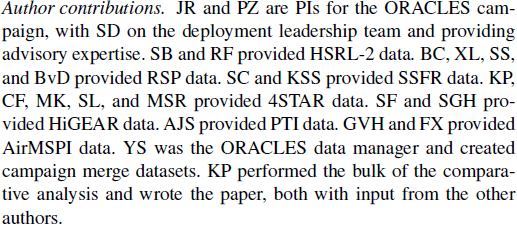
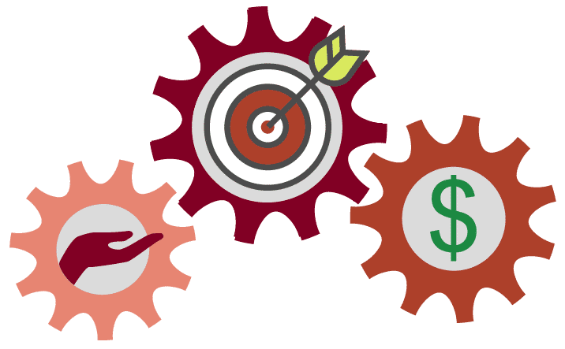

# Lección 2: ¿ Por qué es importante la Ciencia Abierta?

## Contenidos

- [La Ciencia Abierta Rompe Barreras y Promueve la Innovación](#la-ciencia-abierta-rompe-barreras-y-promueve-la-innovación)
- [Beneficios Personales](#beneficios-personales)
- [Beneficios Para La Ciencia](#beneficios-para-la-ciencia)
- [Beneficios Para La Sociedad](#beneficios-para-la-sociedad)
- [Lección 2: Resumen](#lección-2-resumen)
- [Lección 2: Revisión De Conocimientos](#lección-2-revisión-de-conocimientos)

## Resumen

En esta lección aprendes cómo la adopción de la ciencia abierta te beneficia como investigador y sociedad. También aprenderemos sobre algunos de los desafíos y obstáculos que se presentan al utilizar los principios de la ciencia abierta y cómo superarlos.

## Objetivos de aprendizaje

Al finalizar esta lección deberías ser capaz de:

- Describir las maneras en que la ciencia abierta beneficia su carrera con atribuciones, alcance y más colaboraciones.
- Describir las formas en que la ciencia abierta puede promover la ciencia.
- Listar los beneficios que la sociedad obtiene cuando se adoptan principios científicos abiertos.

## La Ciencia Abierta Rompe Barreras e Impulsa la Innovación

"Necesitamos más ciencias "Nosotros" en lugar de ciencia "Yo".

**Harlan Krumholz,**

\*\*Colegio de Medicina de Yale, Reunión CZI, 2022 \*\*

---

A medida que la NASA mira hacia el exterior, nos enfrentamos a desafíos conocidos e inolvidables. Estos desafíos dinámicos exigirán un nuevo enfoque de la ciencia que logre el éxito a través de un ecosistema científico receptivo e inclusivo. Esto requiere equipos más diversos: equipos con más manos, ojos y cervezas que tengan diversas experiencias para participar.

En la lección anterior, aprendimos sobre conceptos fundacionales que definen la ciencia abierta -su importancia, su propósito y sus éxitos probados-. En esta lección, abordamos los beneficios y retos clave de la implementación de principios científicos abiertos en las actividades de investigación.

Esta lección presenta una perspectiva sobre el desarrollo de la ciencia que se centra en la intersección de los resultados científicos, el proceso de creación y las partes interesadas que constituyen la comunidad.

Esta lección destaca los beneficios de la ciencia abierta a una amplia gama de grupos de interesados, junto con ejemplos que invitan a los lectores a investigar más. Adicionalmente, esta lección explora los retos comunes para adoptar prácticas científicas abiertas.

Imagen: Existen muchos beneficios en la Ciencia Abierta. [CC-BY Danny Kingsley y Sarah Brown](https://blogs.uef.fi/ueflibrary-bors/benefits-and-challenges-of-open-science/).

## Beneficios para ti

### ¡Eres tu Mejor Colaborador Futuro!

Hacer ciencia abierta no sólo permite que otras personas entiendan y reproduzcan tus resultados, sino que también te permite hacerlo! Implementar principios de ciencia abierta, tales como buena documentación y control de versiones, le ayuda, colaboradores potenciales y cualquier otra persona a entender sus resultados.

Si tu trabajo se comparte públicamente, nunca perderás el acceso incluso si tu te mueves de institución o cambias de empleo. Muchos investigadores se mueven por instituciones y organizaciones. Al tener sus datos y software y resultados en los repositorios, siempre tendrá acceso a ellos.

La implementación de las mejores prácticas para la ciencia abierta en su trabajo no sólo le ayuda a documentar, sino que podría fortalecer sus propuestas de financiación. Las agencias de financiación han comenzado a darse cuenta de que compartir abiertamente productos de investigación puede aumentar sus citas recibidas y aplicadas, lo que resulta en un mejor rendimiento de la inversión.

Los productos de investigación bien documentados también demuestran la calidad de su trabajo, lo que ayuda en los esfuerzos de comunicación pública y también puede atraer mejores colaboradores. La fiabilidad y una ética de trabajo fuerte motivan a los demás a querer trabajar contigo.

### Dar y obtener crédito al usar los resultados de otros

Además de documentar tus propias investigaciones, la práctica de dar crédito a todos los que han contribuido fortalecerá su reputación en la comunidad científica y actualizará los valores compartidos de la ciencia abierta. A medida que las personas ganen confianza en los beneficios de la investigación cooperativa, también comenzarán a dar crédito a más contribuciones que antes podrían no haber sido reconocidas. Se puede dar un trabajo diferente como parte de un artículo en una declaración de contribución del autor como el ejemplo que se comparte aquí.

La ilustración del proyecto Turing Way de Scriberia. Utilizada bajo una licencia CC-BY 4.0. DOI: 10.5281/zenodo.3332807.

---

### Más visibilidad e impacto

Además de mejorar la precisión científica, adherirse a las prácticas científicas abiertas potencialmente ofrece beneficios personales para los investigadores. La investigación publicada abiertamente tiene mucho más visibilidad y potencial de impacto con grandes audiencias a través de Internet, que puede llevar a más citas, colaboradores de ideas afines y oportunidades de carrera/financiación, de acuerdo con un [estudio](https://pubmed. cbi.nlm.nih.gov/27387362/) del 2016.

#### Emergente evidencia de que algunos aspectos de la ciencia abierta pueden aumentar sus citas.

Publicar acceso abierto incrementa el número de citas en un 18%, según un [estudio](https://www.ncbi.nlm.nih.gov/pmc/articles/PMC7176083/) del 2018.

Los artículos que hacen que sus datos sean abiertamente accesibles a través de un enlace directo a un depósito hace aproximadamente 25% más de impacto en la cita, de acuerdo con un estudio de 2020.

Publicar como acceso abierto puede tener costes prohibitivos para algunos investigadores dependiendo del lugar. A menudo hay otras opciones que permiten a los autores compartir su trabajo libre y abiertamente. En el Módulo 5 sobre Resultados Abiertos, discutimos algunas de estas otras opciones incluyendo preimpresiones y acceso abierto diamante.

Hay muchos resultados de investigación diferentes que se pueden compartir abiertamente y hacer cítables:

- Código
- Datos
- Diapositivas de charlas de investigación
- Clases
- Entradas de blog
- ¡Y más!

¡Todo esto son resultados concretos y científicos! Gran parte de nuestro tiempo como investigadores se dedica a escribir código, recopilar datos, reunir clases y no solo publicaciones. Compartir públicamente materiales hace más probable recibir una cita.

### Más colaboraciones

Las prácticas de ciencias abiertas también pueden permitir colaboraciones más fuertes, tanto dentro como entre disciplinas, como lo demuestra un [estudio]
(https://liberquarterly.eu/article/view/10819) del 2016. La facilidad de acceso a los datos abiertos trae nuevos agentes al paisaje que permiten una participación más amplia y diversa. A través de prácticas científicas abiertas, como el pre-registro en el que los investigadores documentan su plan de investigación al comienzo de un estudio uno permite un diseño de investigación más fuerte porque se puede solicitar la retroalimentación de varios colaboradores y partes interesadas antes de que comience la recolección de datos. Similarmente, las preimpresiones permiten una retroalimentación más rápida sobre las conclusiones extraídas de los datos una vez que se recogen.

### Actividad 2.1: Beneficios para ti

En esta actividad, reflexiona sobre tus respuestas a las preguntas y luego compara tus pensamientos con las claves para llevarlos.

- ¿Puedes encontrar tu propio trabajo, post publicación y/o prepublicación? ¿Puedes llevar tus materiales de investigación (datos, código, resultados) contigo si cambias de institucion?
- ¿Puedes encontrar el trabajo de tus colaboradores? ¿De científicos de otros campos que usted encuentra interesante? ¿Te has acercado a otros para colaborar con ellos después de encontrar resultados interesantes?
- ¿Están las personas en su campo dando y obteniendo crédito por el trabajo realizado?

**Claves para llevarse: Beneficios para ti**

- Ser más abierto fomenta las mejores prácticas de investigación y te facilita desarrollar tu trabajo.
- Los resultados abiertos tienen más visibilidad e impacto.
- La ciencia abierta fomenta más ciencia colaborativa.

## Beneficios a la ciencia

### La ciencia transparente es ciencia reproducible

Cuando las computadoras se utilizan para producir investigaciones científicas, el código se considera un "método". Al igual que un entorno de investigación de laboratorio, un conjunto de instrucciones para trabajar con células o placas de agar puede considerarse un método. Los métodos de revisión por pares son un paso esencial en el proceso científico. Cuando estas medidas no se compartan, nadie más puede reproducir el trabajo o construir sobre él para futuros esfuerzos científicos. Los métodos abiertos permiten que la gente juzgue si los métodos son o no dignos de confianza. En la lección 1, la historia del "Global Cooling Error" presentó un ejemplo conmovedor de ciencia que no era reproducible debido a la falta de transparencia de los datos.

### La ciencia abierta puede mejorar la precisión

Un [estudio](https://www.nature. om/articles/s41562-021-01193-7) de 2022 descubrió que los investigadores que practican la transparencia y promueven la verificabilidad se benefician de lectores e interesados que juzgan si los resultados presentados son exactos y, de acuerdo a un [estudio] relacionado (https://www. mu.edu/dietrich/sds/docs/loewenstein/MeasPrevalQuestTruthTelling.pdf), que los resultados no son producidos por prácticas de investigación cuestionables que conducen a resultados engañosos o poco fiables.

La ciencia abierta también permite a otros examinar las decisiones analíticas de los investigadores, por ejemplo si el análisis fue planeado antes o después de observar los datos, de acuerdo a un [estudio](https://www. nas.org/doi/full/10.1073/pnas.1708274114) del 2018.

Esto permite a otros comprobar si pueden llegar a la misma conclusión que el equipo de investigación original, y facilita una mayor confianza y apoyo del público, de acuerdo con un [reporte](https://unesdoc. nesco.org/ark:/48223/pf0000379949) de la UNESCO de 2021.

He aquí un ejemplo de ciencia abierta que fue capaz de corregir errores en un estudio de salud rápidamente, salvando vidas! En 2021, se publicó un [estudio](https://www.nature.com/articles/s41598-021-84092-1) que descubrió que las políticas de Covid "quedarse en casa" no detuvieron la transmisión del virus. El estudio fue destacado por los prominentes escépticos y los sitios de noticias de bloqueo, lo que rápidamente aumentó la atención de muchas personas en un momento crítico en el pandemia. Aquí estaba un artículo de investigación científica que dijo que los bloqueos no funcionan! Los autores del estudio publicaron el código fuente y los datos con su artículo. Esto permitió que otros examinaran rápidamente cómo llegaron a su conclusión. Casi inmediatamente, se plantearon preguntas sobre el documento y en nueve meses, dos documentos [aqui](https://www.nature.com/articles/s41598-021-02461-2) y [aqui](https://www.nature.com/articles/s41598-021-02096-3) señalaron errores importantes en el método de análisis. El documento original fue retirado. Todos cometemos errores. En este caso, el documento tenía importantes implicaciones políticas y debido a que los autores originales habían practicado la ciencia abierta, el error se corrigió rápidamente!

### Abrir la ciencia conduce a más descubrimientos

El Observatorio Solar y Heliosférico (SOH) ha estado enviando imágenes de nuestro sol dinámico, abriendo una nueva era de observación solar. Fue diseñada para la heliofísica. Sin embargo, científicos planetarios encontraron que SOHO es útil por su habilidad para detectar cometas que pasan muy cerca del sol, conocidos como pastores solares. Hasta hoy SOHO es una de las mejores fuentes de vista de las extensiones de superficie gigante producidas regularmente por el sol llamado eyecciones de masa coronal, o CMEs, que pueden tener un millón de toneladas de partículas solares en el espacio. Este campo de visión es lo suficientemente grande como para ver un cometa rozando el sol mientras gira alrededor del sol.

El gran éxito de SOHO como buscador de cometas depende, por supuesto, de las personas que examinan los datos de SOHO - una tarea que se abrio al mundo a través hacer publicos los datos en tiempo real.

Un grupo de astrónomos voluntarios aficionados se dedican a buscar estos datos a través del Proyecto Sungrazer, financiado por la NASA. Mientras que los científicos suelen buscar en las imágenes acontecimientos muy concretos, varios miembros de la comunidad astronómica optan por analizar con detalle todas las imágenes disponibles. Mas de 2.300 cometas han sido encontrados, 75% por ciudadanos científicos. Esto creó un gran conjunto de datos que sirven de entrenamiento para algoritmos. Los científicos de la NASA disponían de algoritmos para encontrar cometas que consideraban suficientemente precisos.

Sin embargo, en 2022, la NASA decidió financiar un desafío abierto al público para desarrollar nuevos algoritmos y, ¿adivina qué? Dos nuevos algoritmos fueron descubiertos juntos con dos cometas nuevos!

### Calidad y diversidad de las comunicaciones académicas

Además, la ciencia abierta mejora la situación de la literatura científica. Según un estudio del 2018, las revistas científicas han enfrentado el grave problema del sesgo en la publicación, donde los artículos de revistas abrumadoramente presentan resultados novedosos y positivos. Según un estudio de 2011 y 2016, esto da como resultado una situación en la que los resultados científicos publicados en ciertas disciplinas pueden reportar efectos exagerados, o incluso ser “falsos positivos” (erróneamente afirmar que existe un efecto) dificultando la evaluación de la fiabilidad de los mismos. Open science practices, such as registered reports, mitigate publication bias and improve the trustworthiness of the scientific literature. Registered reports are journal publication formats that peer-review and accept articles before data collection is undertaken, eliminating the pressure to distort results, according to a 2022 [study](https://www.nature.com/articles/s41562-021-01193-7). Other open science practices, such as pre-registration, also allows a partial look into projects that for various reasons (such as lack of funding, logistical issues or shifts in organizational priorities) have not been completed or disseminated, according to a 2023 [study](https://pubmed.ncbi.nlm.nih.gov/34396837/), giving these projects a publicly available output that can help inform about the current state research.

By using openly available tools and making our scientific process and products more openly available, we can ensure that all who wish to involve themselves can take part in the global scientific community.

### Key Takeaways: Benefits to Science

- Open science can accelerate scientific discovery. Collective knowledge is not only faster, but more effective than individual efforts.
- Open science allows for errors to be quickly corrected, making science more accurate.
- Open science practices, such as registered reports, mitigate publication bias and improve the trustworthiness of scientific literature.

## Benefits to Society

The mainstream adoption of open science began relatively recently. The potential benefits of open science extend beyond research through contributions to society and policy.

Collaboration, innovation, education, technology advancement, and science-based public policy are all improved by the open availability of research products. Sharing all research products (eg. data, code, results) makes the scientific process more transparent which may help increase public trust in science. Also, open science encourages IDEA (Inclusion, Diversity, Equity, Accessibility), and increases involvement of citizen-scientists and non-experts in the research process. The inclusion of diverse perspectives from an open community invites unique perspectives that contribute to a more robust and often more accurate scientific outcome.

Scientists study issues that affect every aspect of life. Yet, public interest in science remains low due to a lack of trust, understanding, and sociocultural factors. How can scientists expect the public to trust science about complex and often contentious issues, whether it is vaccine development or landing on the moon, if they don’t allow the public to see the process and results? Building trust in science is essential to a well-informed society. Open science provides a pathway to do this.

The public who funds government research through taxes should be entitled to its results and data, as long as safety and security are not an issue. Science should be more open to ensure its insights benefit the public who enables it.

Open science introduces more scrutiny into research that helps ensure accuracy and encourages efficiency through open discourse. This approach accelerates the pace of discovery and subsequently the dissemination of results to the public and policymakers.

### Open Science Can Accelerate the Pace of Science

Open science practices accelerate the pace of scientific discovery by involving ideas and labor from the broader community. The rapid response to the
[Covid-19 Pandemic showed Open Science in action to accelerate discovery.](https://www.nejm.org/doi/full/10.1056/NEJMp2034518)

Researchers uploaded the initial genome sequence of SARS-CoV-2 into an open-access database in January 2020, creating a data-sharing precedent and metadata that would later enable insights about new Covid-19 variants. The NIH developed a dedicated platform for sharing research tools for Covid-19 and encouraged investigators to expedite reporting to ClinicalTrials.gov ahead of requirements. Open-science publishing agreements that support evidence dissemination have complemented these practices and policies. One day after the World Health Organization declared Covid-19 a public health emergency, more than 50 academic publishers issued a joint statement committing to open-access policies for Covid-19 research. Support for preprint servers has promoted awareness of research successes and failures, and journals have helped accelerate the distribution of actionable information, including by means of dedicated Covid-19 web pages, endorsement of preprints, and an emphasis on sharing data with public health authorities.

### Open Science is Efficient Science

Open science reciprocates the benefits it provides to researchers onto the communities that scientists hope to serve. Data from one observation or science experiment can have unanticipated uses. In Lesson 1, we discussed an example where the use of radar data for tracking the effect of climate change was used to track bird migration.

Through open science practices, research waste can be avoided, such as unintentional and costly repetition of previous studies, according to a 2020 European Commission [report](https://op.europa.eu/en/publication-detail/-/publication/6bc538ad-344f-11eb-b27b-01aa75ed71a1). In the human sciences, this also reduces participant fatigue in the long term. By maximizing what is learned from publicly available data, one does not need to test repeatedly, especially on already vulnerable communities. By “giving away” science, individuals, communities and organizations can more easily adopt research results to inform interventions for their own needs without the knowledge being gatekept by the original researchers and organizations involved. In this way, open science can strengthen the social and economic impacts of scientific results.

### Open Science Attracts a Diverse Set of Participant

Image credit: Andy Brunning/Compound Interest. **CC BY-NC-ND 4.0 DEED**

---

The open sharing of scientific products and processes makes science accessible to everyone. This allows full participation from everyone, and also maximizes the number of people who can benefit from the work.

The best ways to include a diverse group of open science practitioners and stakeholders are to remove existing barriers and design for inclusion. Beyond this, it is important to learn how to communicate effectively with diverse collaborators, people at different skill levels, career levels, backgrounds, and areas of expertise. The ability to build diverse teams is a skill that everyone can learn.

### Key Takeaways: Benefits to Society

- The public who funds government research through taxes should be entitled to its results and data, as long as safety and security are not an issue.
- Open science allows for errors to be quickly corrected and accurate results to be built upon by others, impacting policies.
- Open science decreases the unintentional and costly repetition of previous studies, accelerating science that benefits society.

## Lesson 2: Summary

The following are the key takeaways from this lesson:

- Citing the work of other scientists whose work you build upon or reuse supports the community-minded open science practice of using, making, and sharing.
- Doing science openly can boost the visibility of research and lead to more meaningful collaborations.
- Science quality and efficiency is improved when open science best practices are followed.
- Open science helps society by allowing more people to participate in science, which increases the accuracy and impact of results.

## Lesson 2: Knowledge Check

Answer the following questions to test what you have learned so far.

_Question_

**01/03**

What benefits do the individual researchers gain when practicing open science?

Select all that apply.

- Documenting work
- Receiving credit
- Finding collaborators
- Priority access to international scientific conferences
- Securing a higher position in the academic hierarchy irrespective of their publication record

_Question_

**02/03**

How does openness improve science?

Select all that apply.

- Accelerated pace of science
- Improved accuracy
- Reduced publication bias
- Fewer discoveries

_Question_

**03/03**

What benefits to society does open science bring?

Select all that apply.

- Wider use of results increases return on investments in science.
- Open distribution of accurate results reduces misinformation.
- Open Science facilitates a greater understanding and acceptance of pseudoscientific theories.
- It creates more job opportunities in science-related fields, irrespective of the relevance or quality of the research.
- Promotes the commercialization of academic research, leading to increased product advertisements in scientific literature.
