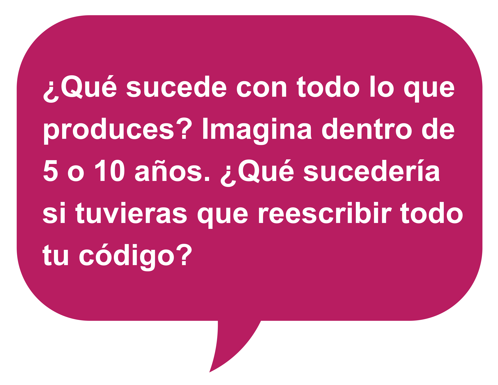
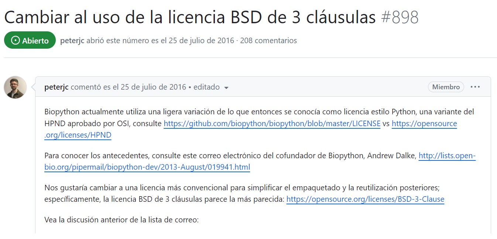
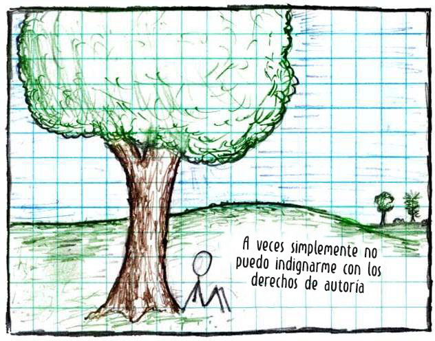

# Lección 3: Cómo hacer Ciencia Abierta

## Contenidos

- [Mantener la seguridad y proteger la privacidad](#mantener-la-seguridad-y-proteger-la-privacidad)
- [La propiedad intelectual](#la-propiedad-intelectual)
- [Políticas y Prácticas en torno a la Ciencia Abierta](#politicas-y-practicas-en-torno-a-la-ciencia-abierta)
- [Lección 3: Resumen](#leccion-3-resumen)
- [Lección 3: Evaluación](#Lección-3-evaluacion)

## Descripción general

La capacidad de discernir cuándo y cómo compartir información de forma adecuada es una habilidad esencial de la Ciencia Abierta. Las personas que mantienen prácticas en Ciencia Abierta deben equilibrar su búsqueda entre la máxima apertura, el respeto a las diversas culturas, el mantenimiento de la seguridad, la privacidad, y el cumplimiento de las políticas y prácticas institucionales.

Esta lección explica aspectos importantes de seguridad y privacidad para las personas que hacen ciencia al momento de compartir información. Luego, la lección explica cómo el intercambio de información puede impactar en diferentes comunidades. A continuación, explica el concepto de propiedad intelectual, cómo puede protegerse y los distintos tipos de licencias disponibles para facilitar el intercambio, garantizando al mismo tiempo que las personas propietarias de la información reciban el reconocimiento por su trabajo. Por último, se trata el impacto de las normas y reglamentos establecidos por una organización, subvención o editorial sobre las posibilidades que tiene una persona de hacer que su investigación sea de acceso abierto.

## Objetivos de aprendizaje

Al finalizar esta lección, deberías ser capaz de:

- Enumerar las razones por las qué no debe compartirse la información debido a problemas de seguridad o privacidad.
- Definir qué es la propiedad intelectual y recordar las distintas formas en que puede compartirse abiertamente mediante licencias de uso o de dominio público.
- Reconocer las políticas y procedimientos de divulgación de su departamento, organización, organismo de financiación y publicación para tomar las decisiones más responsables en materia de divulgación científica.

En los siguientes párrafos de esta sección se esbozan aspectos clave a tener en cuenta, para determinar si conviene o no poner tus datos a disposición del público.

## Mantener la seguridad y proteger la privacidad

Las lecciones anteriores han mostrado una amplia gama de casos de éxito de la Ciencia Abierta pero reconocemos que todavía hay muchas preocupaciones válidas y desafíos inexplorados en su aplicación. La Ciencia Abierta exige la valiosa pero compleja práctica de respetar las diversas culturas, manteniendo la seguridad y protegiendo la privacidad. Esta lección presenta un enfoque estratégico para tomar decisiones sobre cómo hacer Ciencia Abierta en escenarios comunes. Para aquellos escenarios que no podemos anticipar, esta lección ofrece estrategias de mitigación para ayudar a superar dificultades particulares, con una preparación juiciosa y el apoyo de la comunidad.

**Escenario: Secretos militares de un país o violación de intereses nacionales**

Cuando la divulgación de datos o investigaciones puede plantear problemas de seguridad nacional, existen restricciones adicionales a la hora de compartir esta información. En Estados Unidos, el intercambio de este tipo de información suele estar sujeto a las normativas de control ITAR (International Traffic in Arms Regulations) y EAR (Export Administration Regulations). Compartir datos, equipos, recursos o investigaciones regulados por el ITAR/EAR sin autorización para ello, puede poner en peligro la seguridad nacional del país y acarrear graves sanciones penales y administrativas.

**Privacidad de la persona que es paciente**

_La NASA ha recopilado datos biomédicos de los vuelos espaciales tripulados desde el inicio del Apolo..._

_... pero los únicos datos humanos del Archivo de Datos de Ciencias de la Vida proceden de astronautas que firmaron autorizaciones para que sus datos fueran públicos._

En Estados Unidos, los datos sanitarios están protegidos por la Ley de Portabilidad y Responsabilidad de los Seguros Sanitarios de 1996 (US-HIPAA, por sus siglas en inglés) y no está permitido compartirlos sin el consentimiento expreso y por escrito de quienes son pacientes. Por ello, la NASA protege cuidadosamente la información sanitaria de astronautas, tratando de equilibrar la publicidad del trabajo con la normativa y las mejores prácticas de privacidad médica, al tiempo que permite la investigación biomédica supervisada por expertos.

Mira este ejemplo y otros en [Open Science Data Repository](https://osdr.nasa.gov/bio/repo/data/studies/OSD-530/) de la NASA.

**Respecto a la diversidad cultural**

La Ciencia Abierta promueve la divulgación de la investigación, pero también reconoce que hay muchas razones por las que cierta información no debe publicarse, y estas decisiones deben tomarse con la participación de las personas que han contribuido a ella o que podrían verse perjudicadas por las consecuencias de su publicación.

**Aspectos indígenas, culturales y de conservación**

Al considerar las repercusiones de la divulgación de datos, es importante reconocer si los afectados están equitativamente representados en el debate. Por ejemplo, las comunidades históricamente excluidas, el ambiente, la fauna y flora silvestres no suelen tenerse en cuenta a la hora de decidir si la investigación es de libre acceso.

[Por ejemplo](https://www.nature.com/articles/s41576-019-0161-z), aunque la investigación genómica suele basarse en el consentimiento individual, a menudo se utiliza para tomar decisiones que afectan a las comunidades indígenas sin su consentimiento.

Otro [ejemplo](https://www.theguardian.com/us-news/2023/feb/23/lidar-technology-archeology-radical-thinking) de cómo los datos pueden afectar de forma inadvertida a comunidades vulnerables es el uso de LiDAR (metodología de detección y medición de luz) por arqueólogos para estudiar zonas remotas. Este tipo de datos tiene el potencial de hacer visibles los lugares indígenas vulnerables desprotegidos que necesitan protección.

 

**Principios CARE**

Los [Principios CARE de Soberanía de Datos Indígenas](https://www.gida-global.org/care) están orientados a las personas y los objetivos, y se establecieron originalmente para utilizar los datos de forma tal que se fomente la gobernanza de la información y la autodeterminación de los pueblos indígenas. Los principios CARE pueden aplicarse involucrando a las comunidades o grupos locales y deben contemplarse al inicio de un proyecto de investigación.

**Justicia medioambiental**

Cuando se comparten los resultados, ¿se hace con los grupos más impactados de forma que les resulte accesible? Cuando se estudia el impacto o el efecto en una comunidad específica, es importante incluir a esa comunidad en el diseño del trabajo, asegurando que los resultados del mismo sean accesibles -tanto de libre acceso como comprensibles- para las comunidades implicadas.

La justicia ambiental es el trato justo y la participación real de todas las personas, independientemente de su origen, nacionalidad o ingresos, en el desarrollo, aplicación y cumplimiento de las leyes, normativas y políticas ambientales. Más información sobre cómo [los datos de la Tierra de la NASA se hacen más accesibles a las comunidades más afectadas](https://www.earthdata.nasa.gov/learn/backgrounders/environmental-justice).

**Protección de las especies en peligro**

Los humanos no son el único grupo que puede verse afectado negativamente por el intercambio de datos. Las especies raras y amenazadas también pueden verse afectadas. Por [ejemplo](https://www.rspb.org.uk/birds-and-wildlife/crane), el hecho de invadir los lugares de reproducción de las poblaciones silvestres en extinción puede agravar aún más la disminución de la población. Por esta razón, los lugares de cría de animales en peligro de extinción se deben mantener en secreto.

## La propiedad intelectual

### ¿Qué es la propiedad intelectual?

La propiedad intelectual es el reconocimiento de los derechos asociados a los contenidos creados por el intelecto humano. Existen varios tipos diferentes de propiedad intelectual y la forma en que se reconocen varía según el país, el tipo y los plazos.

Es importante saber quién tiene los derechos sobre los contenidos que creas. Esto puede depender de distintos factores. El trabajo que creas puede pertenecer a tu empleador, puede ser de dominio público, puede depender de la licencia del trabajo subyacente, puede pertenecer al editor de tu trabajo o puede ser de tu propia propiedad intelectual. La propiedad intelectual puede afectar a la forma en que tu trabajo puede compartirse.

Esta sección ofrece una introducción a algunos de los problemas comunes a los que se enfrentan los investigadores en torno a la propiedad intelectual. Para obtener instrucciones específicas de tu institución, ponte en contacto con el asesor de propiedad intelectual de tu institución para que te explique cómo pueden afectar a la divulgación de tu trabajo científico.

### Modalidades más comunes de protección de la propiedad intelectual

**Derechos de autoría**

Los derechos de autoría protegen las obras originales. Puede tratarse de obras artísticas o literarias, y también de software. En general, y si corresponde, los derechos de autoría se aplican automáticamente en el momento de la creación sin necesidad de más registro.

La mayoría de las licencias abiertas dependen de los derechos de autoría. La(s) persona(s) que posee(n) los derechos de autoría tiene(n) derecho a solicitar una licencia.

Ejemplo: Una imagen de una revista científica o tomada de la web. En términos generales, el uso de imágenes con derechos de autoría para la enseñanza y la educación se considera un uso justo. Sin embargo, si esto incluye publicar imágenes en un sitio web, podría considerarse una publicación y, por lo tanto, una infracción de los derechos de autoría.

**Marca Registrada**

Una marca registrada puede ser aplicada a cualquier contenido, incluyendo palabras, frases, símbolos, diseños o una combinación de estas cosas que identifique tu producto. Las marcas registradas, en general, no son relevantes para fines científicos.

**Patentes**

Una patente es un derecho exclusivo otorgado para una invención, la cual es un producto o un proceso que proporciona, en general, una nueva forma de hacer algo, u ofrece una nueva solución técnica a un problema. Las patentes son otra forma de hacer que tu trabajo sea abierto mientras proteges tu propiedad intelectual.

Muchas organizaciones cuentan con grupos que apoyarán el desarrollo y la comercialización de invenciones. [La Oficina de Transferencia de Tecnología de la NASA](https://technology.nasa.gov/) es un ejemplo de ello, ya que pone a disposición de las personas usuarias gran parte de las invenciones de la NASA para la concesión de licencias como parte del [Portofolio de Patentes de NASA](https://technology.nasa.gov/patents).

**Dominio Público**

En algunos casos, la propiedad intelectual no está protegida en absoluto. Dominio público hace referencia a cuando una obra creativa no tiene derechos de propiedad intelectual asociados a ella. Algunos tipos de propiedad intelectual caducan después de cierto tiempo. Algunos tipos de obras, como las creadas por el funcionariado público en Estados Unidos, no están cubiertas por derechos de autoría y pueden aparecer inmediatamente en el dominio público. En otros casos, la persona que crea dona la obra al dominio público o no se aplican los derechos de propiedad intelectual.

### ¿Por qué deben importarte las políticas de propiedad intelectual?

¿Por qué, como persona científica, debería preocuparme por esto? Piensa en lo que ocurriría con la propiedad de tu investigación si cambias de institución:

- ¿Puedes llevarte los borradores de tus trabajos, presentaciones y ejemplares de publicaciones?
- ¿Puedes llevarte tus datos?
- ¿Puedes llevarte tu software?

Comprender estas cuestiones es importante para practicar la Ciencia Abierta y garantizar que tu propiedad intelectual pueda compartirse ampliamente. Revisa la imagen de la derecha como ejemplo.

Al principio, preocuparse por la propiedad intelectual y los derechos de autoría puede parecer un detalle innecesario. Sin embargo, anticiparse a los cambios en tu situación asegurando la propiedad permanente de tu trabajo en la fase de planificación de tu investigación, te puede ayudar a evitar problemas legales e institucionales más adelante.

Si envías tu manuscrito a una editorial que exige ser la dueña de los derechos de la obra, ¿Podrás acceder a esa publicación cuando cambies de trabajo y ya no tengas una suscripción a esa obra? ¿Puedes cumplir los mandatos de tu organismo de financiación para compartir abiertamente tu trabajo? ¿Puedes reutilizar las figuras que has hecho en obras derivadas? ¿Podrán otras personas acceder a tu trabajo? Aunque parezcan cuestiones por las que no deberías preocuparte, pueden resultar muy difíciles de afrontar luego.

Ejemplo: En los escenarios en los que se solicita el consentimiento antes de compartir (o se modifican las condiciones para compartir), puede resultar complejo aplicar los cambios. Biopython, un conjunto de herramientas de biología de Código Abierto, comenzó a licenciar su código de nuevo en 2016, y [siguen trabajando en él en 2023, colaborador individual por colaborador individual](https://github.com/biopython/biopython/issues/898).

### Licenciar

El licenciamiento es una forma de ayudar a los demás a reutilizar tu trabajo legalmente. Es una forma de especificar en qué condiciones, si las hay, otras personas pueden utilizar, desarrollar o distribuir tu trabajo. También es un método para garantizar que tu trabajo reciba el crédito adecuado. Por lo general, reutilizar contenidos sin licencia es ilegal y puede constituir una falta de ética académica, aunque éstos puedan encontrarse en Internet. Esta ley protege a las personas que crean contenido al igual que protege tu trabajo de ser utilizado sin un permiso explícito. Afortunadamente, es fácil permitir que otras personas reutilicen tu trabajo.

"Al aplicar una licencia a tu trabajo, dejas claro qué pueden hacer los demás con las cosas que compartes y también estableces las condiciones en las que las proporcionas (como citarte)."

**Base de Conocimientos de Ciencia Abierta [_Open Science Knowledge Base_]**

---

Crédito de la imagen: XKCD: CC BY-NC 2.5 DEEX

[https://xkcd.com/14/](https://xkcd.com/14/)

---

Si no licencias tu trabajo, otras personas no pueden o no deberían reusarlo, incluso aunque quisieras.

Las licencias pueden aplicarse a datos, código e informes, o publicaciones y a casi cualquier otro producto "creativo". También existen diferentes tipos de licencias y casos en el que no es necesario solicitar licencia:

<table>
  <thead>
    <tr>
        <th>LICENCIAS PERMISIVAS ☑</th>
        <th>LICENCIAS PROTECTORAS</th>
        <th>DOMINIO PÚBLICO</th>
    </tr>
  </thead>
  <tbody>
    <tr>
        <td colspan="3">
            
Las licencias permisivas permiten a las personas usuarias una amplia gama de derechos, incluyendo la capacidad de utilizar, modificar y distribuir el trabajo sin o con muy pocas restricciones. Ejemplos de licencia permisiva serían licencias de software de código abierto como Apache 2.0 o licencia MIT o licencias Creative Commons como <a href="https://creativecommons.org/licenses/by/4.0/">Creative Commons Attribution (CC-BY)</a>.

        </td>
    </tr>
  </tbody>
</table>

<table>
  <thead>
    <tr>
        <th>LICENCIAS PERMISIVAS</th>
        <th>LICENCIAS PROTECTORAS ☑</th>
        <th>DOMINIO PÚBLICO</th>
    </tr>
  </thead>
  <tbody>
    <tr>
        <td colspan="3">
            
Las licencias de protección son una técnica legal para conceder ciertas libertades sobre copias de obras protegidas por derechos de autoría, al mismo tiempo que incluyen algunas limitaciones. Esto puede incluir licencias de _copyleft_, licencias comerciales u otras restricciones.

        </td>
    </tr>
  </tbody>
</table>

<table>
  <thead>
    <tr>
        <th>LICENCIAS PERMISIVAS</th>
        <th>LICENCIAS PROTECTORAS</th>
        <th>DOMINIO PÚBLICO ☑</th>
    </tr>
  </thead>
  <tbody>
    <tr>
        <td colspan="3">
            
El dominio público no es una licencia, pero es una indicación de que no hay restricciones de reutilización en la obra. <a href="https://creativecommons.org/publicdomain/zero/1.0/">Creative Common Zero</a> es una marca de dominio público mundial que indica que el material es libre de ser usado sin restricciones.

        </td>
    </tr>
  </tbody>
</table>

En módulos posteriores encontrarás más detalles sobre la concesión de licencias para cada uno de estos tipos de productos, incluidos los distintos tipos de licencias, cuándo aplicar una licencia y las herramientas para aplicar licencias. _Creative Commons_ y la _Open Source Initiative_ son dos recursos con más información sobre licencias abiertas.

### Actividad 3.1: Compartir o No Compartir

Coloca las siguientes actividades en las casillas Compartir o No compartir:

<table style="width:100%">
  <tbody><tr>
    <th colspan="23">Compartir</th>
  </tr>
  <tr>
    <td>Datos del genoma vegetal de los experimentos en la Estación Espacial Internacional.</td>
    <td>Software que identifica las erupciones solares.</td>
    <td>Modelo de Inteligencia Artificial entrenado a partir de observaciones de Marte.</td>
  </tr>
</tbody></table>

<table style="width:100%">
  <tbody><tr>
    <th colspan="23">No compartir</th>
  </tr>
  <tr>
    <td>Documentación de diseño con control de exportaciones para una cámara de alta resolución.</td>
    <td>Datos sanitarios no anonimizados de astronautas.</td>
    <td>Software que contiene claves de acceso a ordenadores de alto rendimiento.</td>
  </tr>
</tbody></table>

## Políticas y prácticas en torno a la Ciencia Abierta

Hasta ahora hemos hablado de las situaciones en las que compartir puede no ser apropiado o debe hacerse con cuidado, así como de las protecciones de la propiedad intelectual que debes tener en cuenta antes de compartir tu trabajo. A continuación, exploraremos la importancia de las políticas y prácticas para practicar la Ciencia Abierta establecidas por tu organización, agencia de financiación y revista académica. La decisión de no publicar ciertos resultados científicos puede ser una opción moral y/o legal. La siguiente sección de esta lección es una introducción sobre lo que debes tener en cuenta.

### Prepararse para usar y hacer investigación controlada

Es importante planificar la publicación de tus datos y resultados desde el principio de tu proyecto de investigación. Investiga y obtén todos los permisos, aprobaciones y/o certificados necesarios para asegurar que puedas compartir tus productos de investigación.

**Recuerda:** ¡Las revistas y los repositorios respetables rechazarán los envíos si los requerimientos no se pueden documentar!

<table>
  <thead>
    <tr>
        <th>MATERIALES - ACUERDOS DE PRODUCTOS COMERCIALES Y DISTRIBUCIÓN</th>
        <th>COMITÉS DE ÉTICA HUMANA Y ANIMAL DE LA INSTITUCIÓN</th>
        <th>RECOLECTANDO PERMISOS</th>
    </tr>
  </thead>
  <tbody>
    <tr>
        <td colspan="3">
            <ul>
            <li>Pueden ser permisivos o restrictivos.</li>
            <li>Muchas versiones disponibles.</li>
            </ul>
        </td>
    </tr>
  </tbody>
</table>

<table>
  <thead>
    <tr>
        <th>MATERIALES - ACUERDOS DE PRODUCTOS COMERCIALES Y DISTRIBUCIÓN</th>
        <th>COMITÉS DE ÉTICA HUMANA Y ANIMAL DE LA INSTITUCIÓN ☑</th>
        <th>RECOLECTANDO PERMISOS</th>
    </tr>
  </thead>
  <tbody>
    <tr>
        <td colspan="3">
            <ul>
            <li>Comprueba los requisitos específicos del experimento con antelación.</li>
            <li>Asegúrate de cumplir con todos los aspectos de la revisión en curso.</li>
            </ul>
        </td>
    </tr>
  </tbody>
</table>

<table>
  <thead>
    <tr>
        <th>MATERIALES - ACUERDOS DE PRODUCTOS COMERCIALES Y DISTRIBUCIÓN</th>
        <th>COMITÉS DE ÉTICA HUMANA Y ANIMAL DE LA INSTITUCIÓN</th>
        <th>RECOLECTANDO PERMISOS ☑</th>
    </tr>
  </thead>
  <tbody>
    <tr>
        <td colspan="3">
            <ul>
            <li>No asumas que la recolección está permitida sólo porque un lugar de muestreo parece no administrado.</li>
            <li>Involúcrate y consulta con las comunidades locales para asegurarte de que sus preocupaciones sean atendidas.</li>
            </ul>
        </td>
    </tr>
  </tbody>
</table>

### Compartir la investigación controlada

Como ya hemos visto, diferentes tipos de propiedad intelectual se concretan utilizando diferentes estructuras formales. Por ejemplo, los productos tales como textos y medios de comunicación se publican bajo copyright y el software se suministra bajo una licencia.

Es importante consultar con comunidades especializadas cuando prepares tu plan de investigación. Los métodos para compartir resultados pueden seguir diferentes estándares/prácticas o pueden requerir un formato de datos especial para su distribución o envío a repositorios comunes.

<table>
  <thead>
    <tr>
        <th>CREATIVE COMMONS VS. CÓDIGO ABIERTO VS. LICENCIAS DE DOMINIO PÚBLICO ☑</th>
        <th>REPOSITORIOS</th>
        <th>GUÍA DE ELEMENTOS PARA SELECCIONAR ENTRE OPCIONES</th>
    </tr>
  </thead>
  <tbody>
    <tr>
        <td colspan="3">
            <ul>
            <li>Pueden ser permisivos o restrictivos.</li>
            <li>Muchas versiones disponibles.</li>
            </ul>
        </td>
    </tr>
  </tbody>
</table>

<table>
  <thead>
    <tr>
        <th>CREATIVE COMMONS VS. CÓDIGO ABIERTO VS. LICENCIAS DE DOMINIO PÚBLICO</th>
        <th>REPOSITORIOS ☑</th>
        <th>GUÍA DE ELEMENTOS PARA SELECCIONAR ENTRE OPCIONES</th>
    </tr>
  </thead>
  <tbody>
    <tr>
        <td colspan="3">
            <ul>
            <li>Opciones generales y específicas de la disciplina.</li>
            <li>Verifica los requisitos de envío con antelación.</li>
            <li>A menudo tiene comunidades de práctica dispuestas a ayudar.</li>
            </ul>
        </td>
    </tr>
  </tbody>
</table>

<table>
  <thead>
    <tr>
        <th>CREATIVE COMMONS VS. CÓDIGO ABIERTO VS. LICENCIAS DE DOMINIO PÚBLICO</th>
        <th>REPOSITORIOS</th>
        <th>GUÍA DE ELEMENTOS PARA SELECCIONAR ENTRE OPCIONES ☑</th>
    </tr>
  </thead>
  <tbody>
    <tr>
        <td colspan="3">
            <ul>
            <li>Elige versiones que tengan soporte con comunidades activas y amigables.</li>
            <li>Toma precauciones para reducir riesgos en la seguridad.</li>
            </ul>
        </td>
    </tr>
  </tbody>
</table>

¿Cuáles son las reglas para la ciencia? Antes de compartir, comprueba que tienes los derechos para hacerlo:

1. ¿Qué dice tu supervisor o investigador principal?
2. ¿Qué dice tu subsidio/contrato?
3. ¿Qué dice tu organización?
4. ¿Qué dice tu agencia de financiación?
5. Si tienes previsto publicar, ¿qué dice el editor?

Recuerda, a veces lo que digan puede entrar en conflicto, por ejemplo:

- Si tu subsidio/patrocinador indica que los resultados deben ser públicos, normalmente tu instituto te permitirá compartirlos incluso si normalmente son más restrictivos.
- Diferentes tipos de resultados pueden tener diferentes tipos de restricciones. (ej. software o hardware pueden tener una expectativa, mientras que los datos pueden tener otras).

Las universidades y otras instituciones pueden contar con oficinas de política de código abierto (OSPO, por sus siglas en inglés) u oficinas de comercialización. La mayoría de los institutos contarán con consejos asesores en propiedad intelectual para ayudar a responder preguntas. Las personas responsables de las bibliotecas son otro buen recurso para consultar a la hora de buscar consejos para compartir. Teniendo en cuenta estas políticas antes en tu investigación puedes ahorrar tiempo y energía en el camino, por todo esto...

### Temprano es mejor

Es importante considerar qué políticas pueden afectar tus resultados de investigación tan pronto como sea posible, de modo que cuando desees compartirlos, ya hayas obtenido las aprobaciones necesarias o sepas dónde solicitarlas. Esto asegura que no compartas inadvertidamente (o dejes de compartir) algo que pueda afectar tu carrera, impactar negativamente a otras personas o plantear problemas legales.

**Recuerda:** ¡No puedes dejar de compartir algo que ya está compartido! Del mismo modo, si tu investigación requiere aprobación ética o consentimiento para ser compartida, podría ser más difícil obtenerlo después de haber completado el estudio.

Esto también ayuda a estructurar tu investigación, datos y métodos de manera que te resulte más fácil compartirlos cuando llegue el momento.

### Reutilizar éticamente en ciencia - ¡Da crédito!

Como mencionamos anteriormente, las licencias ayudan a facilitar el compartir tu trabajo, pero también garantiza que conserves el crédito. Siempre es importante citar la fuente correctamente de cualquier contenido que uses y recordar compartir solo contenido con licencias adecuadas. Aunque una licencia no exija atribución, proporcionar la fuente ayuda a aumentar la reproducibilidad al señalar la procedencia de tu trabajo. Esta es la norma en la comunidad científica.

Al reutilizar la ciencia recuerda:

- La Ciencia Abierta es una colaboración y dar reconocimiento es fundamental para que funcione.
- Considera citar todos los recursos utilizados: conjuntos de datos, software, infraestructura, etc.
- Es de esperar que otras personas actúen de igual manera al utilizar tu trabajo (la ética científica dicta que deberían hacerlo).

Pararse sobre hombros de gigantes (Dominio Público)

Crédito de la imagen: [Biblioteca del Congreso](https://commons.wikimedia.org/wiki/File:Library_of_Congress,_Rosenwald_4,_Bl._5r_cropped.jpg), Rosenwald. CC-BY

---

Además de documentar tu propia investigación, dar crédito a quienes colaboraron fortalece las prácticas y a la comunidad de la Ciencia Abierta. A medida que las personas investigadoras adquieran confianza en los beneficios de la investigación cooperativa, reconocerán -a su vez- a quienes colaboraron, personas que de otro modo podrían haber pasado desapercibidos.

### Otras Razones Para No Compartir

Esta lección sólo ha cubierto escenarios comunes de cuándo y cómo compartir la ciencia. Sea cual sea la situación, es importante considerar las implicancias de compartir información y a aquellas personas que podrían verse afectadas negativamente antes de decidir si la información debe ser compartida o cómo.

Para practicar una Ciencia Abierta responsable se debe prestar especial atención a cómo se mantiene el anonimato en los datos y cómo se elimina la información sensible de estos, con el fin de proteger la identidad de las personas y prevenir violaciones a la privacidad. El uso indebido de datos privados y su obtención por medios de recolección ilícitos son problemas que afectan a todos los sectores, no solo a la ciencia.

### Actividad 3.2: No toda la ciencia puede, o debe, ser abierta todo el tiempo

En esta actividad reflexiona sobre tus respuestas a las siguientes preguntas:

- ¿Cuáles son algunas razones por las que NO querrías que tu investigación sea abierta?
- ¿Cómo equilibrarías la apertura con la privacidad/seguridad/control?

## Lección 3: Resumen

En esta lección aprendiste:

- Situaciones cuando puede ser inapropiado o perjudicial compartir tus datos o investigación. Estas incluyen el mantenimiento de la seguridad, la protección de la intimidad y el respeto de comunidades diversas.
- Qué es la propiedad intelectual, quién la posee, y cómo se protege a través de licencias.
- Diversas organizaciones dentro del ámbito científico (ej. universidades, editoriales, agencias de financiación, etc.) pueden tener sus propias políticas individuales sobre compartir que es mejor considerar al inicio de un proyecto de investigación para evitar posibles obstáculos en el camino.

## Lección 3: Evaluación

Responde las siguientes preguntas para poner a prueba lo que has aprendido hasta ahora.

_Pregunta_

**01/03**

¿Qué tipo de protección de propiedad intelectual necesitarías para una imagen generada a partir de tus propios datos para mostrar tus resultados?

- Patente
- Marca registrada
- Derechos de autoría

_Pregunta_

**02/03**

¿Cuál de las siguientes NO es un tipo de licencia común?

- Derechos de autoría
- Licencia permisiva
- Creative Commons

_Pregunta_

**03/03**

¿Cuál de los siguientes aspectos debería considerarse al compartir información?

- ¿Qué dice tu agencia de financiación?
- ¿Qué dice tu organización?
- ¿Cuál es el impacto en las comunidades involucradas debido a la divulgación de la información?
- Todas las anteriores
