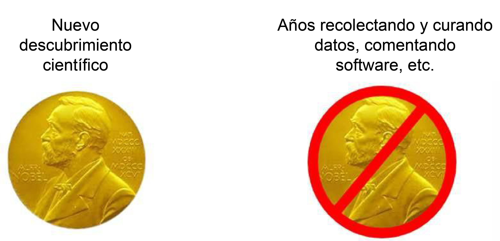
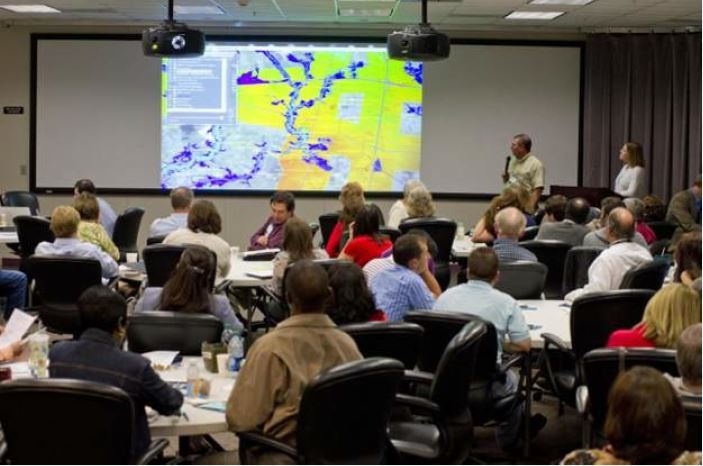
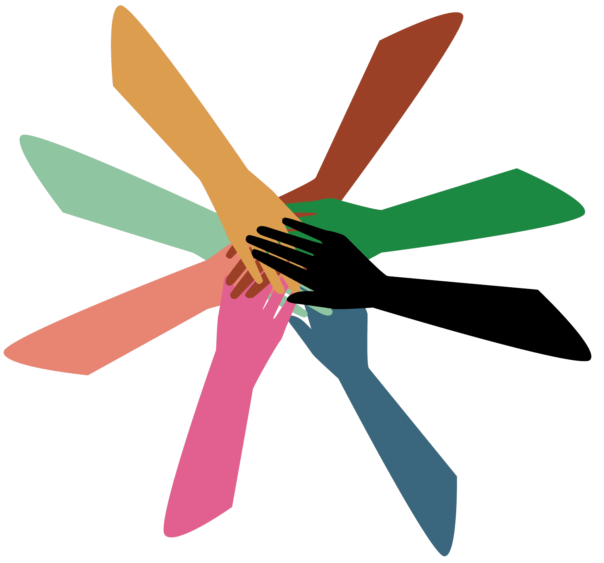

# Lección 4: Cuando no se debe abrir

## Contenidos

- [Temores usuales en torno a la Apertura](./Lección_4#temores-usuales-en-torno-a-la-apertura)
- [Incentivos mal alineados](./Lesson_4#incentivos-mal-alineados)
- [Barreras sociales](./Lección_4#barreras-sociales)
- [Barreras Institucionales y de Infraestructuras](./Lesson_4#barreras-institucional-y-de-infraestructura)
- [Lección 4: Resumen](./Lesson_4#lesson-4-resumen)
- [Lección 4: Evaluación](#lección-4-Evaluación)

## Resúmen

En esta lección, se considerarán las posibles barreras para adoptar prácticas de ciencia abierta. Estas barreras pueden manifestarse en forma de miedos personales, como resultado de desafíos sociales desalineados, o barreras institucionales/infraestructurales. Se comenzará con un ejercicio para identificar las propias preocupaciones o miedos respecto a adoptar la ciencia abierta. Esto conducirá a un debate sobre barreras comunes y estrategias de mitigación.

## Objetivos de Aprendizaje del Módulo

Al completar la lección, deberías ser capaz de:

- Reconocer temores propios y preocupaciones en torno a adoptar la ciencia abierta y enumerar las estrategias de mitigación para superarlas.
- Listar las barreras comunes a la práctica de la ciencia abierta que surgen de incentivos mal alineados, y las estrategias de mitigación correspondientes.
- Listar varios desafíos sociales que pueden surgir al practicar la ciencia abierta y las estrategias para comunicar eficazmente para superar las diferencias de perspectiva.
- Listar varias barreras institucionales e infraestructurales para hacer estrategias científicas y de mitigación abiertas cuando estén disponibles.

## Temores comunes alrededor de la ciencia abierta

### Actividad 4.1: Reflexión personal sobre las preocupaciones de la ciencias abierta

Tómese un momento para pensar en los temores o preocupaciones que genera adoptar la ciencia abierta. Estas podrían ser preocupaciones que ha experimentado en su trabajo o temores sobre ser más abiertos en el futuro. No existen respuestas equivocadas aquí: este es un momento para reflexionar sobre lo que podría estar impidiendo que se haga ciencia abierta.

**Algunos temores alrededor de adoptar prácticas de ciencia abierta**

Luego de reflexionar sobre algunas preocupaciones o temores en torno a la ciencia abierta, a continuación hemos enumerado algunos temores comunes a la hora de hacer ciencia abierta y algunas posibles estrategias de mitigación. Aunque no se trate de un miedo personal, puede ser útil pensar en las distintas preocupaciones que pueden tener los demás para comprenderlas mejor e incluso ayudarles a abordarlas.

**Mesa:** Temores Comunes Sobre la Ciencia Abierta

<table>
<colgroup>
    <col style="width: 33%" />
    <col style="width: 66%" />
</colgroup>
<thead>
    <tr>
        <th>Miedo</th>
        <th>Discusión/Mitigación</th>
    </tr>
</thead>
<tbody>
    <tr>
        <td><strong>Errores:</strong> Que ocurre si mi trabajo es incorrecto?</td>
        <td>
            
Puede resultar intimidante compartir públicamente el material de investigación, dado que alguien podría encontrar un error. Pero, ¿no es mejor para la ciencia si podemos encontrar y corregir rápidamente errores? La revisión por pares es un pilar básico del método científico y un mecanismo para que otros ayuden a encontrar y corregir errores. Para que esto funcione, debemos estar más abiertos a encontrar y corregir errores. Es cierto que en muchas comunidades científicas un error se considera un fracaso. Sin embargo, las políticas de la ciencia abierta pretenden que los errores dejen de percibirse como un fracaso y se conviertan en una etapa del proceso de descubrimiento que puede verse favorecida por la retroalimentación abierta de la comunidad.

        </td>
    </tr>
    <tr>
        <td><strong>Apropiación:</strong> ¿Qué ocurre si alguien utiliza mi trabajo y obtiene el crédito?</td>
        <td>
            
Si, esto puede ocurrir.

            
Depositar un trabajo de manera temprana y hacerlo citable son formas de establecer ese trabajo como suyo.

            
Esto sirve como evidencia de cuándo se ha empezado a trabajar en él y facilita que otros lo citen. Los detalles de cómo hacerlo se proporcionan en los siguientes módulos.

            
Sin embargo, en muchos campos, si está claro que alguien está trabajando activamente en un tópico, la decisión de otro de robarlo puede significar una ganancia a corto pero una pérdida a largo plazo. En ciencia, la reputación es muy importante y la colaboración generalmente conduce a éxitos profesionales mayores. Lea más sobre la apropiación <a href="https://datascience.codata.org/articles/10.5334/dsj-2017-029">aquí</a>.

        </td>
    </tr>
    <tr>
        <td><strong>Interpretación incorrecta de mi trabajo.</strong></td>
        <td>
            
Esto puede ocurrir independientemente de la forma o la apertura del trabajo; muchas publicaciones han terminado siendo malinterpretadas.

            
La apertura ayuda a dar un contexto más amplio al trabajo. La documentación del plan de investigación y de las prácticas de gestión de software permite a los demás comprender el trabajo en su totalidad y, por tanto, ayuda a reducir el riesgo de que otros lo malinterpreten. Por ejemplo, si se comparte código, se puede incluir una descripción de lo que hace el código, junto con breves instrucciones de uso y ejemplos. En el módulo 4, hablaremos de la documentación adecuada de los datos y el código, que puede ayudar a reducir las interpretaciones erróneas.

        </td>
    </tr>
    <tr>
        <td><strong>Mi trabajo será usado, pero no citado.</strong></td>
        <td>
            
La ética de la ciencia dicta que todo trabajo utilizado debe ser citado. Parte de la ciencia abierta consiste en valorar todos los pasos del flujo de trabajo científico y animar a los investigadores a citar el código, los datos u otros artículos no publicados. Se puede facilitar que otros citen un trabajo añadiendo un identificador de objeto digital (DOI, del que hablaremos más adelante en el curso) al producto de investigación. Es importante recordar citar los materiales de otros, y de esta manera no sumar a el problema.

        </td>
    </tr>
    <tr>
        <td><strong>Los datos son demasiado sensibles para compartir.</strong></td>
        <td>
            
Una anonimización adecuada o el uso de un acceso controlado pueden resolver este problema.

        </td>
    </tr>
    <tr>
        <td><strong>No quiero mantener o actualizar mi trabajo.</strong></td>
        <td>
            
Compartir lo hecho permite a otros reproducir, reduplicar y construir sobre el trabajo. Esto no significa que sea necesario mantenerlo para el resto de la vida, o simplemente mantenerlo. Si no se planea mantener un código, se recomienda compartir el código públicamente y archivarlo. Añadiendo las pautas de las licencias, documentación y contribución apropiadas, se puede dejar claro cuánto tiempo se planea mantener el material actualizado (si es que lo hace). De hecho - ¡otros podrían ayudar a mantenerlo!

        </td>
    </tr>
    <tr>
        <td><strong>Mi trabajo no será útil para nadie más.</strong></td>
        <td>
            
Nunca se sabe cómo se pueden utilizar los materiales. Hay personas que aportaron una amplia variedad de proyectos de software, sin relación aparente entre ellos, y terminaron ayudando a la NASA a aterrizar un vehículo en Marte!

        </td>
    </tr>
</tbody>
</table>

Parcialmente extraído de [las "Diez Lecciones contra la Ciencia Abierta que puedes ganar"](https://www.software.ac.uk/blog/2020-12-17-diez argumentos-against-open-science-you-can-win)

Algunos de los temores mencionados anteriormente no son exclusivos de la ciencia abierta y pueden ocurrir en sistemas científicos cerrados. Por ejemplo, la apropiación y la reutilización sin citaciones son dos ejemplos de mala conducta científica que pueden ocurrir en escenarios científicos cerrados. Las prácticas de la ciencia abierta pueden ofrecer más recursos, como poner a disposición un artículo preimpreso o dar a sus datos o código un DOI y una licencia. El hecho de que más trabajos tuyos se compartan de forma citable te da más poder para demostrar cuándo se ha producido una conducta indebida.

Otro ejemplo del miedo que se produce tanto en espacios abiertos como cerrados es el compromiso de mantener tu trabajo abierto incluso luego de la publicación. El mantenimiento es un punto a tener en cuenta independientemente de si el trabajo se ha compartido: se debe decidir durante cuánto tiempo se almacenarán los datos y el código para poder reproducir el trabajo, en caso de que surja alguna duda incluso después de la publicación (tratamos el tema de compartir y archivar datos y código en los módulos posteriores, Datos Abiertos y Código Abierto). Al compartir los materiales de investigación, se puede aumentar la longevidad y el impacto de lo realizado, si otros consideran que los materiales son útiles y ayudan a mantener y construir sobre los mismos.

Reconocemos que ésta no es una lista exhaustiva de preocupaciones y temores hacia la adopción de la ciencia abierta. La NASA ha desarrollado este módulo del plan de estudios TOPS para proporcionar orientación e infundir confianza a los investigadores que tienen la intención de hacer su trabajo más abiertamente de aquí en adelante.

## Incentivos Mal Alineados

Anteriormente, debatimos algunos temores y preocupaciones de adoptar la ciencia abierta. En esta sección, discutiremos barreras que bloquean la participación en la ciencia abierta que se derivan de estructuras de incentivos mal alineadas. Dichas estructuras se refieren a incentivos científicos para individuos y organizaciones, y no están alineadas con valores abiertos.

Distinguimos entre preocupaciones y temores; por un lado, aquellos asociados a cambiar la cultura de cómo hacemos ciencia, y por otro, aquellos vinculados a las barreras estructurales que bloquean la capacidad de los investigadores para adoptar prácticas de ciencia abierta. Reconocemos que estas categorías se solapan, pero el encuadre puede ser útil para entender qué es lo que controlamos como individuos, y en qué aspectos debemos fomentar cambios más estructurales en nuestro ecosistema científico.

### Descripción General: Alineamiento Erróneo de Incentivos

Los incentivos pueden llegar en muchas formas, pero la mayoría de los científicos buscan financiación de propuestas y promoción profesional. En ambos casos, las métricas se utilizan para medir el éxito científico (por ejemplo, la publicación y el recuento de citas, como se ha comentado anteriormente en este curso). Estas mediciones actuales no reflejan todo el impacto de las actividades que llevan adelante los científicos. A continuación, presentamos algunos ejemplos de incentivos mal alineados. Aunque todavía no hay respuestas perfectas para superarlas, agencias como la NASA e iniciativas como [DORA](https://sfdora.org/) y [COARA](https://coara.eu/) están trabajando activamente para actualizar estas métricas que definen lo que significa el éxito en la ciencia, y será necesaria la acción de la comunidad para garantizar que las prácticas abiertas e inclusivas reciban el mérito que merecen.

#### Desafío: Sobrevalorar la Novedad

Los reconocimientos (por ejemplo, premios o financiación) suelen concederse a quienes hacen un gran descubrimiento científico o crean una herramienta nueva e interesante. Esta práctica pasa por alto a la comunidad que escribió código, seleccionó conjuntos de datos, mantuvo herramientas fundamentales existentes y muchos otros pasos importantes que permitieron la emergencia de dichas novedades.

Los premios a menudo desacreditan a un equipo, ya que sólo uno o un grupo pequeño pueden recibir un premio (por ejemplo, un Premio Nobel puede ser concedido a un máximo de 3 personas). Este énfasis en la novedad y el individuo están empezando a cambiar, ofreciendo premios a grupos (por ejemplo, la Oficina de Política Científica y Tecnológica de la Casa Blanca y el [Desafío de Reconocimiento de Ciencia Abierta](https://www.challenge.gov/?challenge=ostp-year-of-open-science-recognition-challenge)) y la adición de solicitudes de financiación ofrecidas para el mantenimiento de herramientas e infraestructuras. Sin embargo, estos cambios llevarán tiempo convertirse en la norma.

#### Desafío: Se Necesita Más Tiempo Para Estar Abierto

Hacer ciencia abierta a menudo requiere más tiempo y esfuerzo de los investigadores tanto para el comienzo como para el mantenimiento. Por ejemplo, puede llevar mucho más tiempo documentar y limpiar el código en un grado que el público pueda entender y utilizarlo fácilmente. Por el momento, el sistema científico no siempre recompensa esfuerzos adicionales como éste, algo que puede dificultar a las personas la dedicación a las actividades abiertas, ya que les quita tiempo para comenzar su próximo documento. Después de todo, los documentos publicados son la principal moneda del sistema científico actual.

Las mediciones actualizadas de éxito pueden ayudar a fomentar que las personas hagan su trabajo abiertamente. La comunidad científica se encuentra actualmente en una fase de transición en la que se están desarrollando nuevas métricas, pero las antiguas métricas siguen dominando en muchos campos y organizaciones. Es importante que quienes investigan reconozcan que tal vez no sean capaces de lograr una total apertura hasta que el sistema y la cultura cambien.

### Actividad 4.2: Ser Abierto o No Ser...

En esta actividad, reflexiona sobre tus respuestas a las preguntas y luego compara tus ideas con las conclusiones clave.

Crédito de la imagen: NASA 2023 @ Stennis Space Center.

---

Las conferencias son lugares abiertos – la mayoría de las veces. Piensa en quién puede asistir a una conferencia. ¿Qué tan abierto/cerrado está?

Las publicaciones pueden tener elementos abiertos y cerrados. ¿De qué manera está abierto?

## Barreras Sociales

### Desafío: Colaboración y Comunidad - Los miembros de la comunidad abierta no siempre están de acuerdo entre sí

Las colaboraciones conjuntas en diversas comunidades pueden requerir más tiempo y esfuerzo para coordinar entre grupos y abordar conflictos. Mientras que interactuar con la comunidad puede ser una de las cosas más satisfactorias sobre la Ciencia Abierta, también podría ser una fuente de desacuerdos sobre la dirección del proyecto o cómo debe ser utilizado. Ahí es donde entran en juego las licencias y los códigos de conducta. Las reglas claras para las interacciones y el uso de los recursos comunitarios proporcionan un marco para tomar decisiones de una manera justa y acordada. Todo esto puede llevar más tiempo, especialmente al inicio de un proyecto de investigación, pero puede ahorrar tiempo y dolores de cabeza en el camino.

### Estrategias para Promover las Diferencias

Estas son las maneras en que puedes fomentar la apertura en tus debates sobre la investigación. Para las sesiones en persona, es bueno fomentar la discusión de estas estrategias:

- Presumir que todo con quien trabajas está haciendo lo mejor que puede en ese momento.
- Intentar la colaboración antes del conflicto.
- Escuchar atentamente y activamente.
- Animar a otras personas a escuchar tanto como hablan.
- Practicar empatía y humildad.
- Hacer preguntas que busquen comprender el contexto de sus compañías.
- Participar de una manera auténtica y activa que apoye la salud y la longevidad de tu comunidad.
- Prestar atención y respeto en su discurso y sus acciones.
- Tratar las identidades y culturas de otras personas con respeto: por ejemplo, hacer un esfuerzo para decir correctamente los nombres de las personas y referirse a ellas por sus pronunciamientos elegidos.
- Tenga en cuenta su entorno y sus compañeros participantes, y tome medidas si se da cuenta de una situación peligrosa o de alguien que se encuentra en desamparo.

## Barrera institucional e infraestructura

### Barreras institucionales: instituciones a menudo se mueven lentamente

Las barreras institucionales para el investigador o el practicante representan un reto adicional para adoptar prácticas científicas abiertas. Los investigadores interesados en adoptar prácticas científicas abiertas podrían carecer del apoyo de su departamento o supervisores de proyectos. El presupuesto, los recursos o el tiempo en un ciclo de proyectos podrían ser insuficientes para practicar la ciencia abierta. Las instituciones podrían no reconocer prácticas científicas abiertas en la contratación, capacitación o promoción en la organización. Incluso si las organizaciones muestran interés en avanzar hacia la ciencia abierta, pueden moverse lentamente cuando establecen nuevos sistemas de apoyo.

En estas situaciones, no siempre hay una estrategia de mitigación obvia. Si bien alentamos a las personas a practicar la ciencia abierta, puede haber aspectos que simplemente no sean factibles en este momento sin dedicar mucho tiempo y esfuerzo extra, tiempo que tal vez no sea reconocido o apoyado por su institución. Es mejor trabajar dentro de los límites del sistema en el que está, y mientras toda la comunidad científica se encuentra en una fase de transición a ser más abierta, puede ser que no tenga sentido estar abierto de todas formas hasta que se reduzcan las barreras institucionales. Dicho esto, cuanto más personas presionen por la apertura, más se convertirá en parte de la mentalidad científica. y lo más probable es que nuestras organizaciones reconozcan y apoyen nuestros esfuerzos.

### Herramientas e Infraestructura

#### ¿Existen las herramientas y la infraestructura adecuadas para apoyar mi trabajo?

Hay muchas herramientas y recursos para hacer nuestro código, datos y resultados más abiertos, pero todavía se está construyendo la infraestructura necesaria, y puede que todavía no esté disponible para apoyar la ciencia abierta en cada disciplina. Aquí es donde la contribución de la comunidad puede ser útil. Tal vez ya exista una comunidad trabajando en la implementación de la infraestructura que usted necesita. Si no, usted puede comenzar las discusiones en conferencias o en foros abiertos en línea para ayudar a organizar la creación de las herramientas y la infraestructura que usted y su comunidad necesitan para hacer efectivamente ciencia abierta.

#### ¿Cómo puedo arreglar la infraestructura específica del instituto cuando intento colaborar con personas fuera de mi organización?

Algunas de nuestras infraestructuras (como nuestras plataformas informáticas) son específicas del instituto, lo que puede ser una barrera a la colaboración fuera de nuestra organización. Sin embargo, planificando una colaboración abierta desde el principio, puede minimizar estas barreras. Por ejemplo, puede utilizar herramientas libremente disponibles como GitHub y Google Docs para la comunicación y la coordinación, incluso si las herramientas de computación son específicas del instituto.

### ¡La ciencia abierta vale la pena!

Si bien hay muchos desafíos para la adopción de la ciencia abierta, Creemos que sus beneficios y su imperativo ético para el yo y para las comunidades científicas, los ciudadanos y los responsables de la formulación de políticas superan el costo de las barreras. Además, el reconocimiento de barreras y ámbitos de precaución constituye un primer paso para resolverlos.

## Lección 4: Resumen

A continuación se exponen las conclusiones principales de esta lección:

- Existen preocupaciones y temores válidos en torno a la apertura de nuestra ciencia, pero a menudo hay prácticas científicas abiertas específicas que pueden ayudar a mitigar estos temores.
- El mal ajuste de los incentivos crea desafíos del mundo real que actúan como obstáculos para adoptar prácticas científicas abiertas. Hay formas en que los individuos pueden minimizar o trabajar con estas barreras, así como organizaciones y grupos que están trabajando activamente para actualizar la estructura de incentivos.
- Trabajar abierta y colaborativamente tiene sus retos, pero hay algunas estrategias para comunicarse entre diferencias.
- También existen barreras institucionales e infraestructurales para adoptar prácticas abiertas, pero utilizando herramientas e infraestructuras generales podemos minimizar algunos de estos desafíos.

## Lección 4: Validación de conocimientos

Responde las siguientes preguntas para poner a prueba lo que ha aprendido hasta ahora.

_Pregunta_

**01/05**

Compare la preocupación científica abierta con una estrategia de mitigación potencial.

<table>
  <tbody><tr>
    <td>Comparte tu trabajo temprano y hazlo fácilmente citable</td>
    <td>Alguien podría reutilizar mi trabajo y obtener el crédito</td>
  </tr>
  <tr>
    <td>Añadir directrices claras de licencias, documentación y contribución</td>
    <td>Alguien podría malinterpretar mi trabajo</td>
  </tr>
  <tr>
    <td>Proporcione la documentación apropiada para sus productos de investigación</td>
    <td>No quiero mantener mi trabajo</td>
  </tr>
</tbody></table>

_Pregunta_

**02/05**

Lea esta declaración antes de decidir si es verdadera o falsa.

_Las ciencias abiertas pueden tomar más tiempo y recursos._

- Verdadero
- Falso

_Pregunta_

**03/05**

¿Cuáles son las siguientes estrategias para fomentar la apertura en sus debates?

Selecciona todos los que correspondan.

- Intentar la colaboración antes del conflicto.
- Hablar en voz alta.
- Escuchar atentamente y activamente.
- Presumir que todo con quien trabajas está haciendo lo mejor que puede en ese momento.
- Utiliza jerga específica para su disciplina.

_Pregunta_

**04/05**

Lea esta declaración antes de decidir si es verdadera o falsa.

_Toda la infraestructura necesaria está en marcha para apoyar la ciencia abierta en todas las disciplinas._

- Verdadero
- Falso

_Pregunta_

**05/05**

Hay momentos en los que la ciencia abierta puede ser una fuente de desacuerdos sobre la dirección del proyecto o cómo debe ser utilizada. ¿Qué factores deberían considerar los creadores de proyectos para superar esos obstáculos?

Selecciona todos los que correspondan.

- Gobernanza
- Planificación
- Licencias
- Código de conducta
- Establecer expectativas para las interacciones comunitarias
