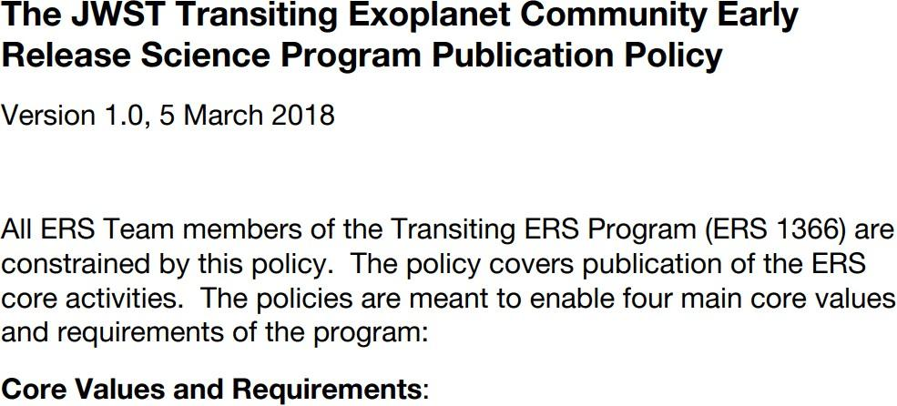
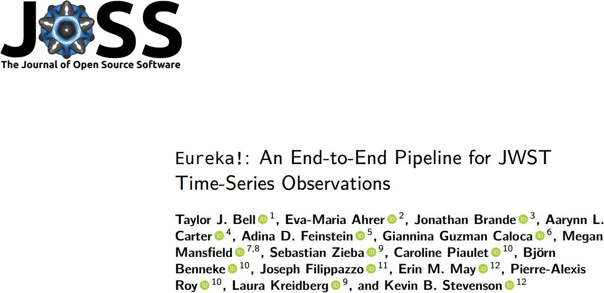

# Lección 5: Planificando para la Ciencia Abierta: De la teoría a la práctica

## Contenidos

- [Planificando para la Ciencia Abierta](#planificando-para-la-ciencia-abierta)
- [Diseñando para la Apertura](#diseñando-para-la-apertura)
- [Caso de Estudio: Los Resultados de un Plan Abierto](#caso-de-estudio-los-resultados-de-un-plan-abierto)
- [Pasos para Continuar con tu Viaje en Ciencia Abierta](#pasos-para-continuar-con-tu-viaje-en-ciencia-abierta)
- [Lección 5: Resumen](#leccion-5-resumen)
- [Lección 5: Revisión De Conocimientos](#leccion-5-revision-de-conocimientos)
- [Resumen de El Ethos de la Ciencia Abierta](#resumen-de-el-ethos-de-la-ciencia-abierta)

## Resumen

Este módulo está casi terminado pero hay mucha más información disponible sobre la ciencia abierta, así que nuestra última lección es para quienes quieran aprender más. En esta lección revisaremos formas de comenzar nuestro viaje con la ciencia abierta, incluyendo una lista de recursos que se pueden usar ahora.

## Objetivos de aprendizaje

Al finalizar esta lección deberías ser capaz de:

- Reconocer los temas a incluir en una planificación para ciencia abierta y definir un plan de ciencia abierta y gestión de datos (PCAGD) (en inglés, open science and data management plan, OSDMP).
- Describir las distintas partes del flujo de un trabajo científico y cómo la ciencia abierta puede integrarse a él.
- Diferenciar ejemplos del mundo real sobre cómo un equipo puede usar ciencia abierta.
- Enumerar cuatro pasos que cualquiera puede tomar para tener un enfoque más abierto.

## Planificando para Ciencia Abierta

Es importante pensar, discutir y planificar los productos y procesos deseados cuando comiences tu investigación. Investiga cuáles son los mejores repositorios para tus materiales, discute sobre créditos y autorías para cada uno de los productos y comienza a usar herramientas de ciencia abierta para organizar tu trabajo. Ponte en contacto con repositorios de tu área e institución (como la biblioteca) en caso de que necesites ayuda. Si incluyes esta información en tus planes tendrás más probabilidades de recibir fondos.

Planificar con anticipación los productos de tu trabajo implica:

- Hablar sobre estos productos y organizarlos con tu grupo de investigación
- Decidir qué herramientas usar
- Pensar en autorías y créditos
- Ponerse en contacto con las partes interesadas y equipos de investigación relevantes para la ciencia abierta como, por ejemplo, la industria
- Identificar repositorios de software y datos
- Identificar revistas (u otros medios) para publicaciones
- Resaltar estos elementos en tus presentaciones y mucho más

A fines prácticos, existe una fase exploratoria en la que compartir el producto puede no formar parte de tu plan. Durante la investigación activa y exploración de datos, datos, código e ideas pueden ser creados y borrados cotidianamente. Tal vez no sea eficiente dedicar tiempo a hacer que todos estos materiales sean completamente abiertos (por ejemplo, crear DOIs o escribir documentación) porque sólo estás explorando. Aún así, puedes decidir publicar tu código a través de este proceso; si de cualquier manera debe estar en un repositorio con control de versiones, no hace daño que sea público. Parte de esta planificación consiste en empezar a pensar qué sería valioso para la ciencia y descubrir la mejor manera de compartirlo.

Es importante discutir regularmente sobre ciencia abierta con tu equipo de investigación, laboratorio o grupo de trabajo. Puede parecer que gran parte de la ciencia abierta responsable está relacionada a los productos, como datos, software o publicaciones, pero preparar y organizar el trabajo con anticipación es un proceso clave. Es mucho más difícil aplicar las buenas prácticas de la ciencia abierta al final de una investigación, reorganizando los productos cuando ya están terminados. La ciencia abierta es tanto una mentalidad como una cultura que empieza junto con tu proyecto.

### Ciencia Abierta y Planes de Gestión de Datos

Los organismos de financiamiento y patrocinadores consideran que la gestión de los datos es crucial para la ciencia abierta porque asegura que los datos de la investigación están bien organizados, accesibles y conservados. Durante los últimos años, muchos han incluído un Plan de Ciencia Abierta y Gestión de Datos (PCAGD) como requerimiento para las presentaciones de proyectos. El PCAGD incluye una descripción de los recursos que se van a utilizar, los productos que se van a crear, cómo se compartirán y quién/quiénes serán las personas responsables. Estos planes pueden incluir datos, software, publicaciones y proyectos de gobernanza.

Los planes de ciencia abierta y gestión de datos son esenciales porque mejoran la credibilidad y reproducibilidad de la investigación al garantizar que los datos están bien documentados, organizados y conservados en el tiempo. Los PCAGD bien hechos pueden traer beneficios como:

<table>
<colgroup>
    <col style="width: 33%" />
    <col style="width: 66%" />
</colgroup>
<tbody>
    <tr>
        <td>Transparencia</td>
        <td>No sólo genera confianza en los descubrimientos científicos, sino que también permite que otras personas que investigan los validen y construyan sobre ellos, fomentando una cultura de apertura y cooperación.</td>
    </tr>
    <tr>
        <td>Eficiencia</td>
        <td>La gestión de datos puede llevar a procesos de investigación más eficientes y económicamente eficaces. Al reducir el tiempo que se gasta en buscar y organizar los datos, las personas que investigan pueden dedicar más tiempo al análisis y la interpretación, acelerando potencialmente el ritmo de descubrimiento e innovación.</td>
    </tr>
    <tr>
        <td>Reproducibilidad</td>
        <td>Un principio clave del método científico es la reproducibilidad y un PCAGD bien desarrollado facilita que otras personas puedan validar tus resultados.</td>
    </tr>
    <tr>
        <td>Conservación</td>
        <td>La investigación producida por fondos públicos representa una gran inversión y es importante que esa investigación se conserve para que las generaciones futuras puedan acceder a ella y comprenderla.</td>
    </tr>
    <tr>
        <td>Inclusividad</td>
        <td>Los PCAGD pueden incluir herramientas y procesos que mejoren significativamente los productos de la investigación a través de colaboraciones.</td>
    </tr>
</tbody>
</table>

Aprende más sobre los PCAGD en el Módulo 2.

### Una Estrategia Abierta

Hoy en día, cada vez son más las fundaciones y agencias que esperan que las propuestas para subsidios de investigación incluyan una estrategia de ciencia abierta. Al incluir un documento de estrategia de ciencia abierta en tu proyecto, aseguras la accesibilidad y apertura en cada paso de tu flujo de trabajo. Concluye tu plan integral con pasos claros para que tus productos de investigación se encuentren fácilmente accesibles y abiertamente disponibles. Los pasos definidos en tu estrategia deberían estar integrados en tus procesos y prácticas científicas cotidianas.

#### Requerimientos

Cada gran fundación para la investigación y agencia gubernamental actualmente requiere que las personas solicitantes envíen un plan de gestión de datos (PGD) junto con su proyecto científico y plan de investigación. Algunas piden detalles adicionales sobre software/código y publicaciones.

#### Incluye Detalles de los Flujos de Trabajo de Datos en el Plan

Describe tu gesitón de flujo de trabajo para datos e investigación relacionada. Otros elementos, como código o una publicación, tienen su propio ciclo de vida y flujo de trabajo que debe estar presente en el plan.

#### Incluye Terminología y Conceptos Abiertos

Los planes exitosos tipicamente incluyen terminología clara sobre cómo la información se hace encontrable, accesible, interoperable y reutilizable. Esto puede incluir licencias, repositorios, formatos y la gobernanza del proyecto.

#### Conservación

Los materiales de investigación son valiosos y reutilizables por un largo período de tiempo luego de que el apoyo financiero del proyecto termina. La reutilización puede extenderse más allá de nuestra vida. Por lo tanto, las personas que investigan deben tomar medidas para la conservación y accesibilidad que aseguren que el trabajo no se pierda cuando termine la interacción con una investigación.

## Diseñando para la Apertura

### La Ciencia Abierta Aplica a Todo el Flujo de Trabajo

Fuente para las Fases del Flujo de Trabajo de la Ciencia Abierta: Opensciency

---

Independientemente de tu disciplina científica o de la metodología que utilices, el flujo de trabajo sigue siendo relativamente el mismo. Cuenta con una fase de planificación, una fase de implementación y una fase de lanzamiento. Dentro de estas fases, hay hitos que varían en función del flujo de trabajo que sigas. Para el propósito de nuestra discusión en esta lección, y los otros módulos en este programa, hemos adoptado el flujo de trabajo científico con hitos generales descritos en el programa de [Opensciency](https://opensciency. ithub.io/sprint-content/). Los detalles de tu flujo de trabajo pueden variar, pero los conceptos generales son los mismos. Lo importante aquí es que cuando se adopta la ciencia abierta, ésta impregna todas las etapas del flujo de trabajo. Te preparas para ello en la fase de planificación, pero luego continúa integrando los principios de la misma a lo largo de las fases de implementación y de lanzamiento.

Los productos creados a lo largo del proceso científico son necesarios para que otros puedan reproducir los hallazgos. Quienes investigan y deseen hacer que sus resultados sean reproducibles deben poner los elementos clave de su estudio abiertamente a disposición de los demás.

Fuente para las Fases del Flujo de Trabajo de la Ciencia Abierta: Opensciency

---

Continuando con el flujo de trabajo, este diagrama actualizado muestra ahora los tipos de productos científicos que son creados en cada hito. Los productos especializados que usted crea pueden variar o ser completamente diferentes, pero el foco en el descubrimiento para el público sigue siendo el mismo. Cualquier tipo de productos que crees puede ser modificado para apoyar los principios y los conceptos de la ciencia abierta. Dónde y cómo integrar conceptos de ciencia abierta en tus productos es el propósito de este programa "Open Science 101".

### Usar, Hacer, Compartir

La idea de que la ciencia abierta puede afectar a todo tu flujo de trabajo científico puede parecer abrumadora e inalcanzable, pero recuerda, la ciencia abierta se da a través de todo un espectro –incluso los pequeños pasos hacia la apertura conducen a una ciencia más accesible, inclusiva y reproducible. Y el programa Open Science 101 está aquí para ayudarte a atravesar este proceso.

En esta sección, presentamos el sistema "Usar, Hacer, Compartir" que puede empezar a aumentar gradualmente tu adopción de la ciencia abierta dependiendo de la naturaleza y el alcance de tu proyecto. ¡A lo largo del curso, exploraremos cómo puede ser utilizado este marco para hacer tu ciencia más abierta!

### ¿Qué recursos utilizarás?

¡Ya existen muchos recursos de ciencia abierta para que los utilices! La ciencia abierta cuenta ya con una larga historia. Por ejemplo, el acto que creó la NASA estipula el compartir sus descubrimientos con toda la humanidad y la NASA ha estado compartiendo sus datos abiertamente en Internet desde la década de 1980. Ahora, ya hay más de 100 Petabytes de datos de la NASA abiertamente disponibles para que busques, descargues, y utilices, y ejemplos de estos servicios se proporcionan en el Módulo 3. Se han desarrollado tecnologías y prácticas alrededor del código que facilitan la colaboración en la construcción de soluciones complejas, y se dan ejemplos en el Módulo 4. Una serie de servicios facilitan el intercambio y el descubrimiento de publicaciones con acceso abierto, y que son discutidos en el Módulo 5.

En el Módulo 2, te presentaremos algunas de las herramientas que no sólo hacen posible la ciencia abierta, sino que también son fáciles.

### ¿Qué resultados obtendrás?

A lo largo del proceso de investigación, habrá diferentes productos y resultados obtenidos. Estos pueden variar desde conjuntos de datos (en inglés, data sets), muestras, código, informes, manuscritos, actas de conferencia, entradas de blog y videos. Cada uno de ellos tiene diferentes consideraciones sobre cómo hacerlas incluyendo cómo pueden hacerse de formas abiertas y colaborativas.

También hay diferentes maneras de dirigir un proyecto científico. ¿Su proyecto va a ser abierto desde el comienzo o abierto en la publicación? Hay razones válidas para ambas actitudes, pero generalmente lo antes que abras los datos, el código y los resultados, más oportunidades hay para hacer crecer las redes de colaboración y construir con otros (lo que es bastante divertido). A menudo los investigadores eligen ser abiertos dentro de sus equipos de proyecto durante el desarrollo, el intercambio de datos, el código, y los resultados, pero luego sólo comparten con el mundo una vez que sienten que tienen un resultado en que pueden confiar. Si bien este enfoque ha sido la “norma” cultural dentro de muchas comunidades, esto está cambiando a medida que los grupos se sienten más cómodos con la apertura temprana en los proyectos y experimentan contribuciones valiosas de otras personas y se construyen nuevas redes de colaboración.

Los módulos 3, 4 y 5 abordarán cómo generar tus datos, código y resultados abiertos.

### ¿Cómo compartirás?

Crédito de la imagen: Freepik.com

Where you choose to share your research materials and results will have a large influence on its impact – how easy it is for others to find it, how long it is available, and how easy it is to reuse.

Will you share data in a file filled with columns of unlabelled numbers without any units or explanations or will it be in an open, standard format and following the  [Findable, Accessible, Interoperable, Reusable (FAIR) principles](https://www.go-fair.org/fair-principles/)? Module 3 has more details to help you better understand how to share your data and explains ideas like FAIR and best practices in sharing data. This includes different considerations for where to share your data as well so that it is both accessible and preserved.

For software, since it is often updated and changed, many researchers first share it on a version control platform like GitHub or GitLab but then archive a version of it in a repository that has long-term preservation capabilities – more on this in Module 4!

For results, open access publications and preprint servers are common locations to share. Module 5 discusses all these options.

### Activity 5.1: Use, Make, Share

Take a moment, to answer the following questions on your current research or on research that you would like to do:

- What data, software, or publications do you currently use or would like to use? Are they open or closed?
- What are the tools and processes that you currently use? Is it easy to include others in collaboration?
- How is your work shared or planned to be shared? Can anyone access your results?

## Case Study: The Outcomes of an Open Plan

Los principios rectores de ciencia abierta de la NASA están centrados en nuestro trabajo de lanzamiento temprano de la ciencia (Early Release Science), apoyando un proceso científico inclusivo, transparente y colaborativo

**Coautora Dra. Natasha Batalha**

---

Uno de los primeros [descubrimientos del telescopio espacial James Webb
fue la primera detección de dióxido de carbono en la atmósfera de un planeta que orbitaba a otra estrella](https://www. asa.gov/feature/goddard/2022/nasa-s-webb-detects-carbon-dioxide-in-exoplanet-atmosphere). Este descubrimiento fue posible gracias a los principios ciencia abierta adoptados tanto por el proyecto como por el equipo.

Crédito de la imagen: @AdobeStock 2023, dimazel

Crédito de la Figura: NASA, ESA, CSA, Joseph Olmsted (STScI)

---

Esto se llevó a cabo como parte del Programa JWST Early Release Science (ERS) como parte del programa JWST ERS Exoplanet Transiting Community program (ERS-TRANSIT). Se trata de algunos de los primeros datos científicos que se tomaron con las instalaciones
y que se pusieron disponibles de forma abierta. Sin embargo, el equipo comenzó su trabajo años antes de las observaciones e incluyó la ciencia abierta en cada etapa del proceso. El equipo trabajó en un formato abierto desde la ideación hasta el análisis, pasando por la publicación y la comunicación.

Veamos qué resultados abiertos fueron producidos , y mientras lo hacemos, echemos un vistazo a las ventajas de hacerlo en cada etapa.

### Planificando para hacer Ciencia Abierta

<table>
    <table>
    <colgroup>
        <col style="width: 50%" />
        <col style="width: 50%" />
    </colgroup>
    <tbody>
        <tr>
            <td>Oportunidad</td>
            <td>Crear un Plan de "Gobernanza": Un código abierto de conducta y una política de publicación que resalten las reglas de compromiso con el resultado final.</td>
        </tr>
        <tr>
            <td>Beneficios</td>
            <td>Incorporación de nuevos miembros y facilitación de la colaboración.</td>
        </tr>
        <tr>
            <td>Resultados</td>
            <td>Código de conducta y política de publicación.</td>
        </tr>
        <tr>
            <td>Disponibilidad</td>
            <td>
                
En la página web del equipo y GitHub.

                

            </td>
        </tr>
    </tbody>
</table>

Una de las partes más importantes de la puesta en marcha de un proyecto es pensar quién va a trabajar en él y cómo trabajarán juntos los participantes. Antes de que se recojan las muestras, antes de que se descarguen los datos, antes de que se escriba el código - ¿cómo trabajarán todos juntos, cuáles son los roles y responsabilidades, y cómo y cuándo se compartirán los materiales. Esa fue una parte clave que acertó. este proyecto del JWST.

El equipo inicial, durante la fase de planificación, desarrolló y publicó abiertamente información en forma del [código de conducta](https://ers-transit.github.io/code-of-conduct.html) y la [política de publicación](https://ers-transit.github.io/documents/publication-policy-v1.0.pdf).

Básicamente, pueden trabajar con nosotros, pero aquí están nuestras normas. Y luego los científicos líderes hablaron de esto regularmente con el equipo, especialmente a medida que este se expandió para que todo el mundo supiera lo que se esperaba de ellos y lo que obtendrían a cambio (¡crédito!).

El resultado y el beneficio de publicar esta información fue la adición de nuevos miembros al equipo, y una cultura colaborativa e inclusiva acordada y establecida entre el equipo.

El equipo creció hasta casi 400 personas, todos trabajando juntos, todos sabiendo qué esperar y esto creó confianza.

**Lee más sobre documentos de colaboración y reconocimiento de autoría en OpenSciency**

[HAZ CLIC PARA APRENDER MÁS](https://opensciency.github.io/sprint-content/open-results/lesson4-opportunities-and-credits.html)

### Software de Código Abierto\*\*

<table>
    <table>
    <colgroup>
        <col style="width: 50%" />
        <col style="width: 50%" />
    </colgroup>
    <tbody>
        <tr>
            <td>Oportunidad</td>
            <td>Colaboración en una cadena de producción de software abierto para procesamiento de datos</td>
        </tr>
        <tr>
            <td>Beneficios</td>
            <td>Disminución de esfuerzos duplicados, los colaboradores reciben reconocimiento por su trabajo y se acelera el proceso de preparación de datos</td>
        </tr>
        <tr>
            <td>Resultados</td>
            <td>Cadena de producción de procesamiento de datos</td>
        </tr>
        <tr>
            <td>Disponibilidad</td>
            <td>
                
Código en <i>GitHub</i>, lanzamiento en <i>Zenodo</i>, documentos publicados en <i>Journal of Open Source Software</i> (una revista de acceso abierto)

                

            </td>
        </tr>
    </tbody>
</table>

Como la mayoría de los datos, JWST es complicado y necesita procesamiento y cadenad de producción de datos. La precisión necesaria para lograr este tipo de detección requiere un análisis detallado de las observaciones y una amplia gama de conocimientos.

Durante la fase de implementación, el equipo colaboró en la creación del software de procesamiento de datos, para que todos se beneficiaran. Imagínese el esfuerzo malgastado si las 400 personas hubieran escrito el software ellos mismos. El beneficio y el resultado fue que gracias a este esfuerzo de colaboración, el equipo disminuyó los esfuerzos duplicados, los colaboradores obtuvieron crédito por su trabajo, el software fue más preciso, y se aceleró el proceso de generación de datos. ¡EUREKA!, el software fue [creado de forma abierta](https://github.com/kevin218/Eureka)
con [documentación](https://eurekadocs.readthedocs.io/en/latest/) y publicado con una [revision por pares del paquete de software.](https://joss.theoj.org/papers/10.21105/joss.04503)

¡Pero no tuvieron que empezar de cero! The ERS-TRANSIT team was able to build on the work of others. The software built on the [JWST pipeline software](https://github.com/spacetelescope/jwst) developed openly by the JWST mission team. Furthermore, they were able to build on a much larger open source software ecosystem using python and Astropy.

### Open Access to Results

<table>
    <table>
    <colgroup>
        <col style="width: 50%" />
        <col style="width: 50%" />
    </colgroup>
    <tbody>
        <tr>
            <td>Opportunity</td>
            <td>Research products recorded in public archives and made openly available</td>
        </tr>
        <tr>
            <td>Benefit</td>
            <td>Allows collaborators to receive individual credit for their contributions, which provided greater incentive for participation</td>
        </tr>
        <tr>
            <td>Result</td>
            <td>Intermediate products, models, and final data</td>
        </tr>
        <tr>
            <td>Availability</td>
            <td>
                
All aggregated into <a href="https://zenodo.org/communities/ers-transit">Zenodo Community</a> with individual contributing authors and DOIs

                

            </td>
        </tr>
    </tbody>
</table>

During the release phase, the team labeled research products adequately for reuse and reproducibility and published in public forums/repositories. The outcome and benefits included collaborators receiving credit for data, software, and other digital research products that benefit the scientific community. Data and software were archived openly on the general data repository [Zenodo](https://zenodo.org/communities/ers-transit) and the publication was made available as a [preprint](https://arxiv.org/abs/2208.11692) and an [open access publication](https://www.nature.com/articles/s41586-022-05269-w).

Making your results open also opens you up to clearer ways of receiving credit and can also reduce the risk of scooping (each result can be individually referenced as soon as it is made available). Applying reproducibility practices separately on different parts of the project such as preparation documents, datasets, software, and reporting allows other researchers to test and reuse your work in their research, and your research will be cited more often, thus bringing fair recognition for your work. Collaborators can get more motivated to contribute because they can easily get recognition in terms of authorship for their contributions made for each one of the research outputs generated.

**Read more about making results open throughout the research process on OpenSciency.**

[CLICK TO LEARN](https://opensciency.github.io/sprint-content/open-results/lesson2-results-and-open-science.html#what-are-the-advantages-of-making-results-open-throughout-the-research-process)

## Steps to Continue Your Open Science Journey

Here we will explore the next steps to open science that everybody can take. The thought that open science can impact your entire scientific workflow may seem overwhelming and unachievable, but this is not the case. You can start slowly and gradually increase your adoption depending on the nature and scope of your project. Here are a few immediate ways that you can start engaging in open science.

### Where to Go From Here

- Get involved: Become part of an open science community in your sector.
- Start using/sharing the open science tools of your community.
- Learn how to use/archive data in repositories and community tools and resources.
- Concise statement of the Ethos of Open Science: Find, collaborate, and share!

### Identify Your Open Science Communities

Here are the steps you can take to find your own science community:

- Talk with your colleagues.
- Read your field’s literature.
- Run searches, in general and discipline-specific areas.
- Investigate online communities encouraging open science, such as:
  - The EU's '[Foster Open Science](https://www.fosteropenscience.eu/)' program
  - [The Turing Way online manual](https://the-turing-way.netlify.app/index.html)
  - [FORRT](https://forrt.org/)

Join open science communities. There are generic ones as listed here or you can seek out communities that are not only within your domain but also within your geographical area.

- [TOPS GitHub discussion board](https://github.com/nasa/Transform-to-Open-Science/discussions)
- Opensciency online open science [community list](https://opensciency.github.io/sprint-content/open-tools-resources/lesson5-open-science-communities.html#communities-of-practice-list)

### Explore Open Repositories

There are many repositories that host open data, software, and results. We share many of these resources in the later modules, but here are two NASA repositories that allow you to search for existing data collections that might be relevant to your interests.

- [Science Discovery Engine](http://science.data.nasa.gov/search)
- [https://data.nasa.gov/](https://data.nasa.gov/)

### Four Steps to Open Science that Anyone Can Take

1. Keep seeking best practices for open science, and develop plans to be more open in your science or research.
2. Think about all the different types of reviews you are involved with, and how to improve them with a goal of openness.
3. Ask colleagues about open science activities, and award credit for them in evaluations.
4. Engage with underrepresented communities to ensure science encourages a more equitable, impactful, and positive future.

### Continue Taking TOPS Open Science 101

The TOPS Open Science 101 curriculum is a good place to go for a more in-depth introduction to the various elements of Open Science – each of the next 4 modules provides details and practical exercises to help participants develop a better understanding of that specific topic.

But, if you want to also do an in-person or virtual workshop, we got you!

<table>
    <table>
    <colgroup>
        <col style="width: 33%" />
        <col style="width: 33%" />
    </colgroup>
    <tbody>
        <tr>
            <td></td>
            <td></td>
            <td></td>
        </tr>
         <tr>
            <td>Self-Paced Online Course</td>
            <td>Online Workshops</td>
            <td>In-person Workshops</td>
        </tr>
    </tbody>
</table>

Images Credit: freepik.com

NASA TOPS is coordinating online and in-person open science workshops!

These events provide an opportunity for you to take Open Science 101 with others and engage with members of the open science community! To learn more go [here](https://nasa.github.io/Transform-to-Open-Science/)!

### Additional Resources

In addition to the resources listed elsewhere in this training, the below community resources are excellent sources of information about Open Software.

**References and Guides**

- [OpenSciency](https://opensciency.github.io/sprint-content/)
- NASA SMD's [Open-Source Science Guidance for researchers](https://smd-cms.nasa.gov/wp-content/uploads/2023/08/smd-open-source-science-guidance-v2-20230407.pdf)
- Turing [Way handbook to reproducible, ethical and collaborative data science](https://the-turing-way.netlify.app/index.html)

## Lesson 5: Summary

There is no one way of doing open science, and any steps you take to make your science more open are extremely valuable, especially as we transition to a more open scientific ecosystem in the future. We want people to be able to identify the most important things they "can" openly share, but with the ultimate goal of complete openness.

### What Have We Covered in this Module?

- Preparing and organizing in advance are crucial components for ensuring the effectiveness of open science work.
- Open Science and Data Management Plans (OSDMP) provide a plan for how open science is integrated into a project including the sharing of data, software, and results.
- Designing for openness is a critical aspect of making sure that open science is integrated into the entire scientific workflow from start to finish. This includes resources that can be used, products that will be made, and how the science will be shared.
- Open Science is already happening - there are already teams conducting their research openly and many resources that can be used to make your research more open.
- There are more opportunities to participate and learn about Open Science – this is just the start!

## Lesson 5: Knowledge Check

Answer the following questions to test what you have learned so far.

_Question_

**01/04**

Applying reproducibility practices separately on different parts of the project allows other researchers to do what?

Select all that apply.

- Expand research focus
- Consider opportunities for more collaborative advantage
- Test and reuse your work in their research
- Cite your research more often to bring fair recognition to your work
- Understand new discoveries

_Question_

**02/04**

Read the statement and decide whether it's true or false.

_The Open Science and Data Management Plan (OSDMP) describes how the scientific information that will be produced from scientific activities will be managed and made openly available._

- True
- False

_Question_

**03/04**

Read the statement and decide whether it's true or false.

_Before starting a project, it is important for researchers to consider how they will collaborate with other researchers, what are the roles and responsibilities, and how and when they will share any materials._

- True
- False

_Question_

**04/04**

Which item is NOT one of the four steps to open science that anyone can take?

Select all that apply.

- Engage with underrepresented communities to ensure  science encourages a more equitable, impactful, and
  positive future.
- Ask colleagues about open science activities, and award credit for them in evaluations.
- Think about all the different types of reviews you are involved with, and how to improve them with a goal of openness.
- Create a new journal that requires an expensive subscription to read.
- Keep seeking best practices for open science, and develop plans to be more open in your science or research.

## The Ethos of the Open Science Summary

Congratulations! Now you should be able to:

- Explain what open science is, why it's a good thing to do, and list some of the benefits and challenges of open science adoption.
- Describe the practice of open science, including considerations when writing a management plan and the tasks in the "Use, Make, Share" framework.
- Evaluate available options when determining whether research products should or should not be open.
- List ways to connect with others who are part of the open science community.

### Further Resources

**Masuzzo and Martens (2017). Do you speak Open Science? Resources and tips to learn the language**

[CLICK TO LEARN](https://peerj.com/preprints/2689v1/)

**Guiding Principles for Findable, Accessible, Interoperable and Re-usable Data. Publishing version B1.0, Force 11**

[CLICK TO LEARN](https://www.force11.org/fairprinciples)

**Fecher and Friesike (2014). Open Science: One Term, Five Schools of Thought**

[CLICK TO LEARN](http://doi.org/10.1007/978-3-319-00026-8_2)

**EC Working Group on Education and Skills under Open Science (2017). Providing researchers with the skills and competencies they need to practise Open Science**

[CLICK TO LEARN](http://ec.europa.eu/)

**"What is Open Science"**

[CLICK TO LEARN](https://blog.f1000.com/2014/11/11/what-is-open-science/)

**Resources for Earth Science**

[CLICK TO LEARN](https://www.earthdatascience.org/)
