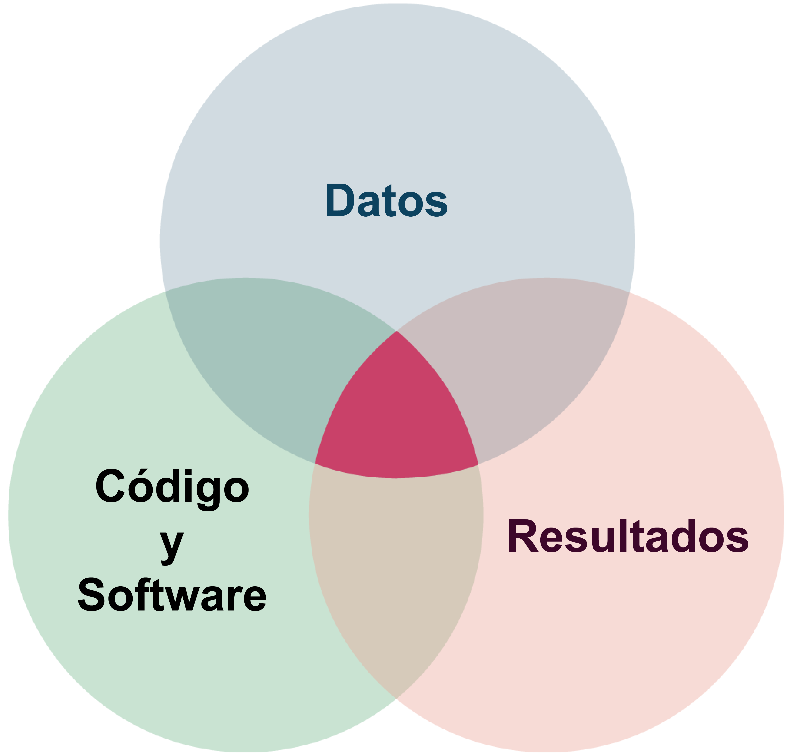
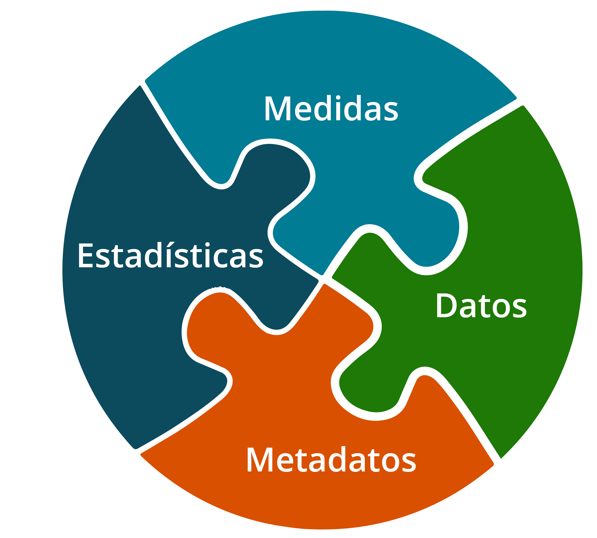
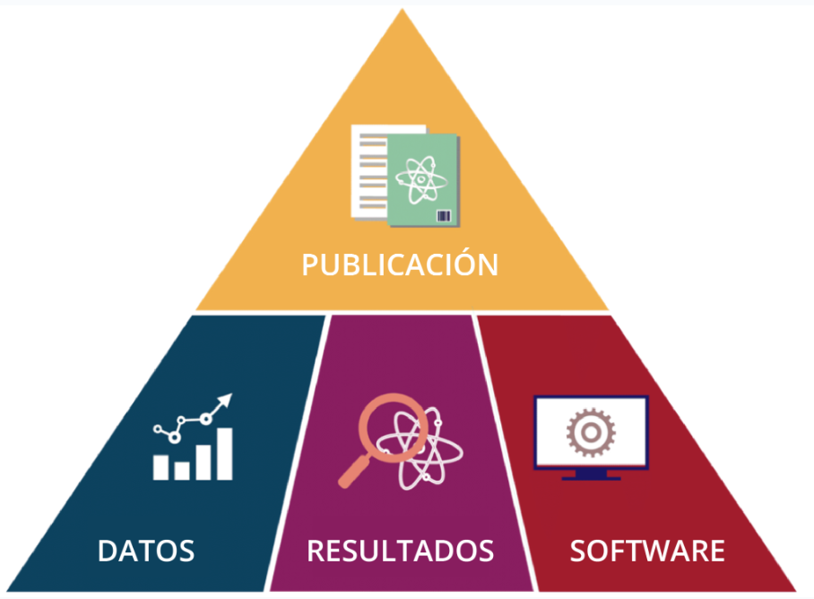
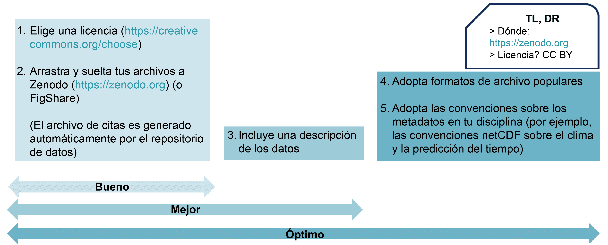
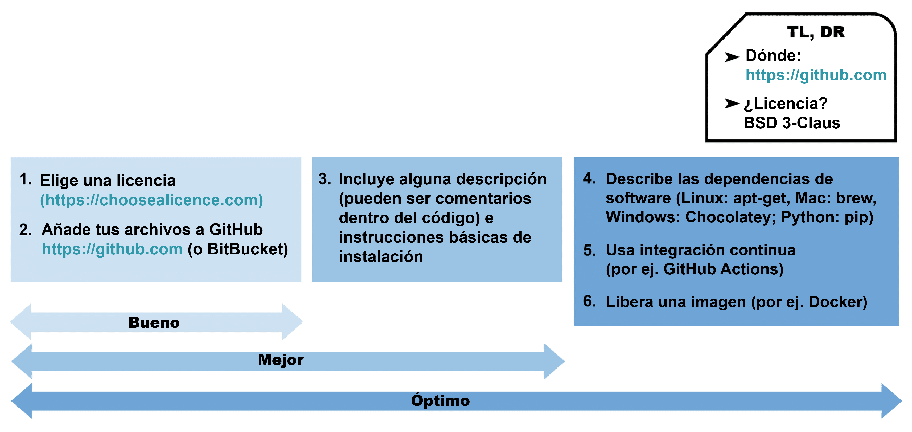
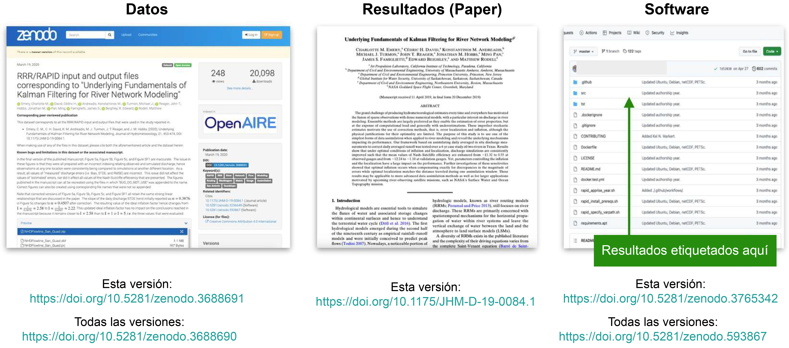
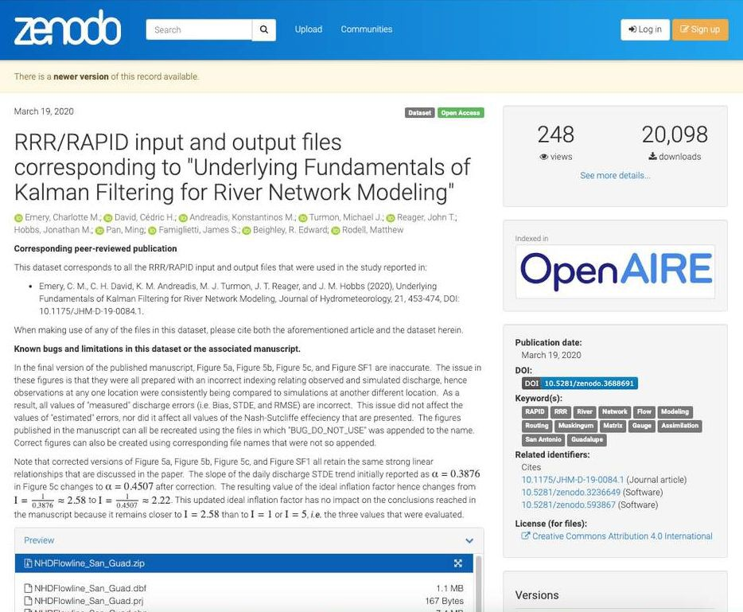

# Lección 1: Introducción al proceso de la Ciencia Abierta

## Contenidos

-   [Definición de Ciencia Abierta y productos de investigación](#definici%C3%B3n-de-ciencia-abierta-y-productos-de-investigaci%C3%B3n)
-   [Utilizar herramientas para la Ciencia Abierta en la práctica](#utilizar-herramientas-para-la-ciencia-abierta-en-la-pr%C3%A1ctica)
-   [Lección 1: Resumen](#lecci%C3%B3n-1-resumen)
-   [Lección 1: Evaluación](#lecci%C3%B3n-1-evaluaci%C3%B3n)

## Descripción general

En esta lección revisaremos la definición de Ciencia Abierta y algunos otros términos comunes, incluyendo productos de investigación, datos, software y resultados. Además, veremos ejemplos que muestran cómo se usan estas herramientas de Ciencia Abierta en la práctica. La lección concluye con un ejemplo de cómo un grupo compartió sus datos, resultados, software y artículos de forma abierta.

## Objetivos de aprendizaje

Al finalizar esta lección deberías ser capaz de:

-   Definir los tipos comunes de productos de investigación incluyendo datos, software y resultados.
-   Enumerar formas comunes de compartir datos, código y resultados al practicar la Ciencia Abierta.

## Definición de Ciencia Abierta y productos de investigación

### ¿Qué es la Ciencia Abierta?

"La Ciencia Abierta es el principio y la práctica que se llevan adelante para que tanto los procesos de la investigación científica como sus productos estén disponibles para todas las personas, respetando las diversas culturas, manteniendo la seguridad y la privacidad, y fomentando colaboraciones, reproducibilidad y equidad."

**La Oficina de la Casa Blanca para Políticas de Ciencia y Tecnología (OSTP, por sus siglas en inglés) y el Consejo Nacional de Ciencia y Tecnología (NSTC, por sus siglas en inglés)**

------------------------------------------------------------------------

### Productos de investigación abiertos

El conocimiento científico, o los productos de investigación, toman la forma de:

### ¿Qué son los datos?

En general, los datos son fragmentos de información sobre un tema, incluidas verdades teóricas, mediciones en bruto o valores altamente procesados.

Incluso puede haber datos sobre los datos, denominados metadatos. En nuestras lecciones, cuando hablamos de datos nos referimos a información científica o técnicamente relevante que puede almacenarse digitalmente y a la que se puede acceder electrónicamente, como por ejemplo:

-   Información producida por misiones y experimentos, incluidas calibraciones, coeficientes y documentación
-   Información necesaria para validar las conclusiones científicas de las publicaciones revisadas por pares

Los datos abiertos pueden tener muchas características, incluyendo metadatos nutridos y sólidos, y estar disponibles en una variedad de formatos. Estas características se detallan más adelante en este módulo y se desarrollan aún más en el módulo sobre Datos Abiertos.

### ¿Qué es el código?

Muchas personas que hacen ciencia escriben código fuente para producir software con el que analizar datos o modelar observaciones. El código es un lenguaje que los seres humanos pueden escribir y entender. El software suele ser un conjunto de programas, datos y otra información que un sistema informático utiliza para realizar tareas específicas. Las personas científicas escriben y utilizan muchos tipos distintos de software en el marco de sus investigaciones.

**Software de propósito general** - Software producido para un uso generalizado, no para fines científicos especializados. Esta clasificación alcanza  tanto al software comercial tradicional como al de Código Abierto.

**Software Operativo y de Infraestructura** - Software utilizado por centros de datos y grandes instalaciones de tecnología de la información para proporcionar servicios de datos.

**Librería**  también llamada biblioteca.  Una colección de códigos y rutinas, previamente realizadas por quienes desarrollan y reutilizables para facilitar procesos comunes en la producción de software y así ahorrar tiempo y esfuerzo.

**Software de modelación y simulación** -- Software que implementa soluciones a ecuaciones matemáticas a partir de datos de entrada y condiciones límite, o bien infiere modelos a partir de datos.

**Software de análisis** -- Software desarrollado para manipular mediciones o resultados de modelos, para visualizarlos o comprenderlos.

**Software de un solo uso** - Software escrito para usarse en casos únicos, como por ejemplo hacer un gráfico para un artículo o manipular datos de una manera específica.

Algunas de las herramientas que se pueden utilizar para desarrollar software se presentan en la Lección 4. Comprender cómo encontrar y utilizar el código de otras personas, crear el propio y compartirlo, son partes importantes del avance de la ciencia y se tratan en el módulo sobre Código Abierto.

### ¿Qué son los resultados?

Los resultados capturan los distintos productos de investigación del proceso científico. Las publicaciones son el tipo más común de resultados, pero se pueden incluir otros tipos de productos. Aunque los datos y los programas informáticos pueden considerarse un tipo de resultado, aquí nos centraremos en otras clases de resultados. Estos pueden incluir:

-   Publicaciones revisadas por pares
-   *Notebooks* (cuadernos virtuales de programación)
-   Entradas de blog
-   Vídeos y podcasts
-   Publicaciones en redes sociales
-   Resúmenes y presentaciones en congresos
-   Foros de debate

Puede que estemos familiarizados con el ciclo de vida de la investigación, pero aún desconozcamos los tipos de resultados que pueden compartirse abiertamente a lo largo de este proceso. Al compartir resultados, es importante ser lo más abiertos posible, con el objetivo de aumentar la reproducibilidad, la accesibilidad y la inclusión de nuestra ciencia. A lo largo del ciclo de vida de la investigación existen múltiples oportunidades para compartir abiertamente diferentes resultados, y estos pueden dar lugar a nuevas colaboraciones y líneas de investigación. En el Módulo 5 - Resultados Abiertos, se ofrecen más detalles sobre el alcance de los resultados abiertos.

## Utilizar herramientas para la Ciencia Abierta en la práctica 

Las siguientes lecciones de este módulo exploran diferentes herramientas y recursos a disposición de quienes investigan para utilizar, crear y compartir la Ciencia Abierta. Como ya se ha dicho, es importante pensar en cómo integrar los principios de la Ciencia Abierta en todas las fases del proceso de investigación. Aquí daremos un panorama general de cómo podrían funcionar juntas las distintas piezas.

### Los componentes de la Ciencia Abierta

Los cuatro componentes principales de la Ciencia Abierta pueden organizarse en una pirámide de productos de investigación compartidos abiertamente.

El artículo de investigación, estrechamente vinculado a los resultados, se sitúa en la cúspide de la pirámide y resume cómo se han combinado el software y los datos para producir los resultados.

La práctica de compartir estos componentes puede darse en distintos grados de exhaustividad. Para las siguientes orientaciones sobre cómo compartir componentes de Ciencia Abierta, simplificamos el rango de exhaustividad a "bueno", "mejor" y "óptimo". Esta gama refleja nuestro compromiso de compartir la ciencia en todas las etapas del proceso de investigación y en todos sus productos.

### Compartir los Datos Abiertos

Los datos pueden compartirse fácilmente a través de muchos servicios diferentes. La mejor forma de compartirlos suele ser a través de un repositorio de datos a largo plazo que los preserve y los haga accesibles. La imagen ofrece algunas consideraciones a la hora de compartir datos a través de [Zenodo](https://zenodo.org/), un repositorio de datos generalista. Estas consideraciones serían similares para otros repositorios de datos. Ver el Módulo 3 - Datos Abiertos, para obtener más detalles sobre cómo compartir datos abiertos.

### Compartir Código Abierto

Cuando se comparte Código Abierto, con frecuencia se hace a través de una plataforma en línea de control de versiones que permite a quienes tengan interés contribuir al software y proporciona un historial de cambios en el mismo. Por ejemplo, muchas veces quienes investigan optan por publicar archivos de código en [GitHub](https://github.com/) con una licencia BSD (de 3 cláusulas). Esto permite a otras personas contribuir y reutilizar el software. Los pasos para preservar el código y hacerlo accesible se tratan en el Módulo 4 - Código Abierto.

### Compartir un artículo abierto

Las personas investigadoras pueden optar por publicar en una revista con licencia de Acceso Abierto. Para ello, puede utilizarse el Directorio de Revistas de Acceso Abierto (DOAJ, por sus siglas en inglés) y encontrar revistas que ofrecen esta opción (ver el Módulo 5 - Resultados Abiertos).

### Compartir resultados abiertos

Cuando compartimos resultados es conveniente incluir la metodología utilizada para producirlos (es decir, la "procedencia") directamente con nuestro software. El software tiende a evolucionar con el tiempo, mientras que sus resultados pueden mantener cierta coherencia. Por lo tanto, compartir la metodología ayuda a otras personas a reproducir nuestros antiguos resultados con software más reciente, aunque los métodos para producirlos puedan variar a medida que el software evoluciona.

### Un ejemplo de proyecto científico abierto

A continuación veremos un ejemplo de cómo un grupo de investigación compartió abiertamente sus datos, resultados y software tanto como el artículo resultante; todo esto con sus propios identificadores únicos. Hay que tener en cuenta que los datos y el software pueden tener varios identificadores, lo que permite que estos sean citados en todas las versiones o una única versión.

Aquí se pueden revisar los distintos elementos de la imagen anterior, seleccionando los botones "\<" y "\>" para navegar.

**Datos**

Captura de pantalla de Zenodo donde figuran lo archivos de ingreso y salida del análisis de datos correspondiente al trabajo "Underlying Fundamentals of Kalman Filtering for River Network Modeling" (Fundamentos subyacentes del filtrado de Kalman para el modelado de redes fluviales).

Esta versión: <https://doi.org/10.5281/zenodo.3688691>
Todas las versiones: <https://doi.org/10.5281/zenodo.3688690>

**Resultados**

DOI del trabajo publicado "Underlying Fundamentals of Kalman Filtering for River Network Modeling" (Fundamentos subyacentes del filtrado de Kalman para el modelado de redes fluviales): <https://doi.org/10.1175/JHM-D-19-0084.1>

**Software**

Repositorio del software utilizado:

Esta versión: <https://github.com/c-h-david/rapid>

Todas las versiones: <https://doi.org/10.5281/zenod>

## Lección 1: Resumen

Conclusiones principales de esta lección:

-   El conocimiento científico o los productos de la investigación adoptan la forma de: datos, software y resultados.
-   En general, los datos son partes de información acerca de un tema, incluidas verdades teóricas, mediciones en bruto (información sin ningún procesamiento) o valores altamente procesados.

## Lección 1: Evaluación 

Responde las siguientes preguntas para poner a prueba lo que has aprendido hasta ahora.

*Pregunta*

**01/03**

Lee esta afirmación y decide si es verdadera o falsa.

*La Ciencia Abierta es el principio y la práctica de lograr que los productos y procesos de investigación estén disponibles para todas las personas, mientras se respeta a las diversas culturas, manteniendo la seguridad, privacidad, fomentando la colaboración, la reproducibilidad y la equidad.*

-   Verdadero
-   Falso

*Pregunta*

02/03

¿Cuáles son los cuatro productos principales de la Ciencia Abierta? Selecciona todos las que correspondan.

-   Presupuestos
-   Resultados
-   Inclusión
-   Datos
-   Código
-   Artículo científico

*Pregunta*

**03/03**

¿Cuál de los siguientes es un tipo de software? Selecciona todas las que correspondan.

-   Propósito general
-   Operacional y de Infraestructura
-   Modelado y Simulación
-   Análisis
-   Material
