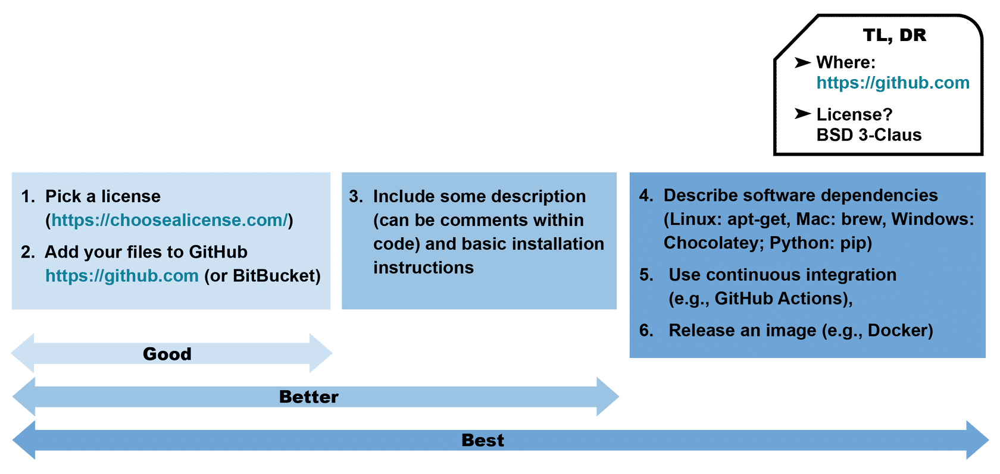
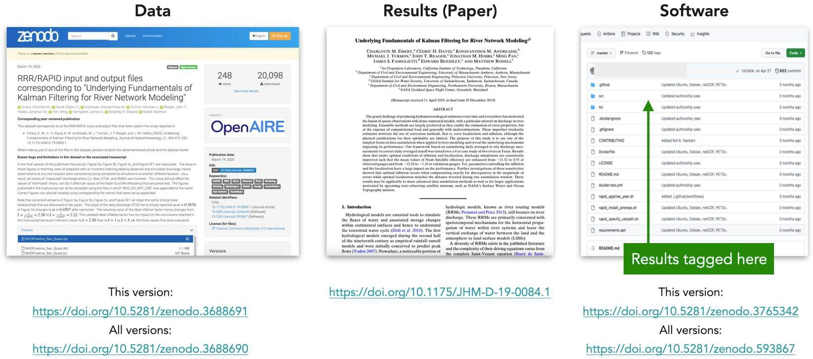
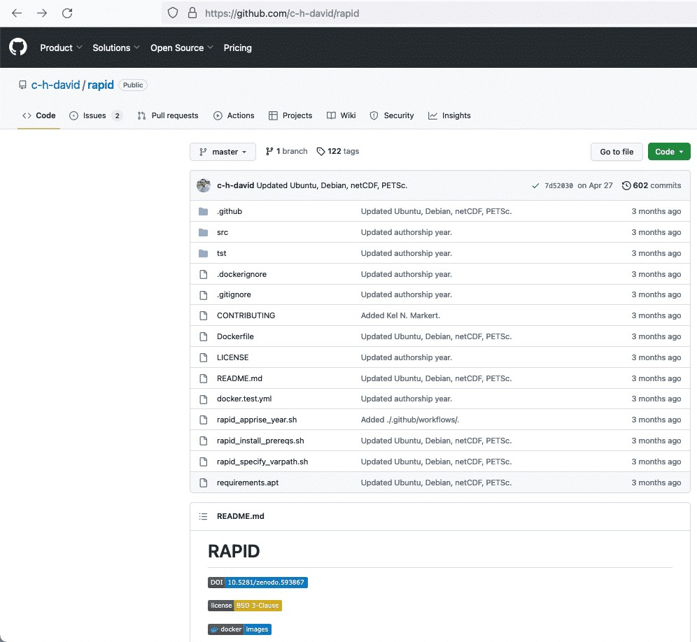

# Lección 1: Introducción al Proceso de la Ciencia Abierta

## Contenidos

- [Definición de Ciencia Abierta y Productos de Investigación](#definición-de-ciencia-abierta-y-productos-de-investigación)
- [Utilizando Herramientas para Ciencia Abierta en la Práctica](#usando-herramientas-para-ciencia-abierta-en-la-práctica)
- [Lección 1: Resumen](#lección-1-resumen)
- [Lección 1: Revisión De Conocimientos](#lección-1-revisión-de-conocimientos)

## Descripción general

En esta lección revisaremos la definición de ciencia abierta y algunos otros términos comunes, incluyendo productos de investigación, datos, software y resultados. Además, veremos ejemplos del uso en la práctica estas herramientas científicas abiertas. Para terminar, veremos el ejemplo de un grupo que compartió abiertamente sus datos, resultados, software y publicación científica.

## Objetivos de aprendizaje

Al completar este módulo, serás capaz de:

- Definir los tipos comunes de productos de investigación incluyendo datos, software y resultados.
- Enumerar formas comunes de compartir datos, código y resultados al practicar la ciencia abierta.

## Definición de Ciencia Abierta y Productos de Investigación

### ¿Qué es la Ciencia Abierta?

"La Ciencia Abierta es el principio y la práctica que se llevan adelante para que tanto los procesos de la investigación científica como sus productos estén disponibles para todas las personas, respetando las diversas culturas, manteniendo la seguridad y la privacidad, y fomentando colaboraciones, reproducibilidad y equidad."

**La Oficina de Política de Ciencia y Tecnología de la Casa Blanca (OSTP) y el Consejo Nacional de Ciencia y Tecnología (NSTC)**

---

### Productos de Investigación Abiertos

El conocimiento científico, o los productos de investigación, toman la forma de:

 

### ¿Qué son los Datos?

En general, los datos son fragmentos de información sobre un tema, incluidas verdades teóricas, mediciones en bruto o valores muy procesados.

Incluso puede haber datos sobre los datos, denominados metadatos. En nuestras clases, cuando hablamos de datos nos referimos a información científica o técnicamente relevante que puede almacenarse digitalmente y a la que se puede acceder electrónicamente, como por ejemplo:

- Información producida por misiones y experimentos, incluidas calibraciones, coeficientes y documentación
- Información necesaria para validar las conclusiones científicas de las publicaciones revisadas por pares

Los datos abiertos pueden tener muchas características, como metadatos ricos y sólidos, y estar disponibles en diversos formatos. Estas características se detallan más adelante en este módulo, y se desarrollan más en el módulo sobre Datos Abiertos.

### ¿Qué es el Código?

Muchos científicos escriben código fuente para producir software con el que analizar datos o modelar observaciones. El código es un lenguaje que los seres humanos pueden escribir y entender. El software suele ser un conjunto de programas, datos y otra información que un sistema informático utiliza para realizar tareas específicas. Los científicos escriben y utilizan muchos tipos distintos de software en el marco de sus investigaciones.

**Software de propósito general** - Software producido para un uso generalizado, no para fines científicos especializados. Esto incluye tanto el software comercial como el de código abierto.

**Software Operativo y de Infraestructura** - Software utilizado por centros de datos y grandes instalaciones de tecnología de la información para proporcionar servicios de datos.

**Bibliotecas** - Ningún proceso creativo está realmente completo hasta que se manifiesta en una realidad tangible. Tanto si nuestra idea es una acción como si es una creación física, es probable que darle vida implique un duro trabajo de iteración, pruebas y perfeccionamiento.

Se debe desconfiar del perfeccionismo y animarnos a compartir nuestras creaciones con los demás. Al mantener una postura abierta, podremos aprender de los comentarios de otras personas. Sus respuestas pueden considerarse como nuevo material que podemos aprovechar la próxima vez que nos embarquemos en una tarea creativa.

**Software de modelación y simulación** – Software que implementa soluciones a ecuaciones matemáticas a partir de datos de entrada y condiciones límite, o bien infiere modelos a partir de datos.

**Software de análisis** – Software desarrollado para manipular mediciones o resultados de modelos, para visualizarlos o comprenderlos.

**Software de un solo uso** - Software escrito para usarse en casos únicos, como por ejemplo hacer un gráfico para un artículo o manipular datos de una manera específica.

Algunas de las herramientas que se pueden utilizar para desarrollar software se presentan en la Lección 4. Comprender cómo encontrar y utilizar el código de otros, crear el propio y compartirlo, son partes importantes del avance de la ciencia y se tratan en el módulo sobre Código Abierto.

### ¿Qué son los Resultados?

Los resultados capturan los distintos productos de investigación del proceso científico. Las publicaciones son el tipo más común de resultados, pero se pueden incluir otros tipos de productos. Aunque los datos y los programas informáticos pueden considerarse un tipo de resultado, aquí nos centraremos en otras clases de resultados. Estos pueden incluir:

- Publicaciones revisadas por pares
- _Notebooks_  (cuadernos virtuales de programación)
- Entradas de blog
- Vídeos y podcasts
- Publicaciones en redes sociales
- Resúmenes y presentaciones de la conferencias
- Foros de debate

Puede que estemos familiarizados con el ciclo de vida de la investigación, pero aún desconozcamos los tipos de resultados que pueden compartirse abiertamente a lo largo de este proceso. Al compartir resultados, es importante ser lo más abiertos posible, con el objetivo de aumentar la reproducibilidad, la accesibilidad y la inclusión de nuestra ciencia. A lo largo del ciclo de vida de la investigación existen múltiples oportunidades para compartir abiertamente diferentes resultados, y estos pueden dar lugar a nuevas colaboraciones y líneas de investigación. En el Módulo 5 - Resultados abiertos se ofrecen más detalles sobre el alcance de los resultados abiertos.

## Usando herramientas para la Ciencia Abierta en la práctica

Las siguientes lecciones de este módulo exploran diferentes herramientas y recursos a disposición de los investigadores para utilizar, crear y compartir la ciencia abierta. Como ya se ha dicho, es importante pensar en cómo integrar los principios de la ciencia abierta en todas las fases del proceso de investigación. Aquí daremos un panorama general de cómo podrían funcionar juntas las distintas piezas.

### Los componentes de la Ciencia Abierta

Los cuatro componentes principales de la ciencia abierta pueden organizarse en una pirámide de productos de investigación compartidos abiertamente.

El artículo de investigación, estrechamente vinculado a los resultados, se sitúa en la cúspide de la pirámide y resume cómo se han combinado el software y los datos para producir los resultados.

La práctica de compartir estos componentes puede darse en distintos grados de exhaustividad. Para las siguientes orientaciones sobre cómo compartir componentes de ciencia abierta, simplificamos el rango de exhaustividad a "bueno", "mejor" y "óptimo". Esta gama refleja nuestro compromiso de compartir la ciencia en todas las etapas del proceso de investigación y en todos sus productos.

### Compartir los Datos Abiertos

Los datos pueden compartirse fácilmente a través de muchos servicios diferentes. La mejor forma de compartir datos científicos suele ser a través de un repositorio de datos a largo plazo que preserve los datos y los haga accesibles. La imagen ofrece algunas consideraciones a la hora de compartir los datos a través de [Zenodo](https://zenodo.org/), un repositorio de datos generalista. Estas consideraciones serían similares para otros repositorios de datos. En el Módulo 3 - Datos abiertos se brinda más información sobre la puesta en común de datos abiertos.

### Compartir Código Abierto

Cuando se comparte código abierto, con frecuencia se hace a través de una plataforma en línea de control de versiones que permite a otros contribuir al software y proporciona un historial de cambios en el mismo. Por ejemplo, muchos investigadores optan por publicar archivos de código en [GitHub](https://github.com/) con una licencia BSD de 3 cláusulas. Esto permite a otros contribuir y reutilizar el software. Los pasos para preservar el código y hacerlo accesible se tratan en el Módulo 4 - Código Abierto.

 

### Compartir un Artículo Abierto

Los investigadores pueden optar por publicar en una revista con licencia de acceso abierto. Para ello, puede utilizarse el Directorio de Revistas de Acceso Abierto (DOAJ) y encontrar revistas que ofrezcan esta opción. (Véase el Módulo 5 - Resultados Abiertos)

### Compartir Resultados Abiertos

Cuando compartimos resultados, es conveniente incluir la metodología utilizada para producirlos (es decir, la "procedencia") directamente con nuestro software. El software tiende a evolucionar con el tiempo, mientras que sus resultados pueden mantener cierta coherencia. Por lo tanto, compartir la metodología ayuda a otros a reproducir nuestros antiguos resultados con software más reciente, aunque los métodos para producirlos puedan variar a medida que el software evoluciona.

### Un ejemplo de Proyecto Científico Abierto

A continuación veremos un ejemplo de cómo un grupo de investigación compartió abiertamente sus datos, resultados y software tanto como el artículo resultante; todo esto con sus propios identificadores únicos. Hay que tener en cuenta que los datos y el software pueden tener varios identificadores, lo que permite a otros citar todas las versiones o una única versión.

Aquí se pueden revisar los distintos elementos de la imagen anterior,  seleccionando los botones "\<" y "\>" para navegar.

**Datos**

Esta versión: [https://doi.org/10.5281/zenodo.3688691](https://doi.org/10.5281/zenodo.3688691)

Todas las versiones: [https://doi.org/10.5281/zenodo.3688690](https://doi.org/10.5281/zenodo.3688690)

**Resultados**

[https://doi.org/10.1175/JHM-D-19-0084.1](https://doi.org/10.1175/JHM-D-19-0084.1)

 

Software

Esta versión: [https://github.com/c-h-david/rapid](https://github.com/c-h-david/rapid)

Todas las versiones: [https://doi.org/10.5281/zenod](https://doi.org/10.5281/zenod)

## Lección 1: Resumen

En esta lección hemos aprendido:

- El conocimiento científico o los productos de la investigación adoptan la forma de: datos, software y resultados.
- In general, data are pieces of information about a subject, including theoretical truths, raw measurements, or highly processed values.

## Lesson 1: Knowledge Check

Answer the following questions to test what you have learned so far.

_Question_

**01/03**

Read the statement below and decide whether it's true or false:

_Open Science is the principle and practice of making research products and processes available to all, while respecting diverse cultures, maintaining security and privacy, and fostering collaborations, reproducibility, and equity._

- True
- False

_Question_

**02/03**

What are the four principal outputs of open science? Select all that apply.

- Budgets
- Results
- Inclusion
- Data
- Code
- Paper

_Question_

**03/03**

Which of the following is a type of software? Select all that apply.

- General purpose
- Operational and Infrastructure
- Modeling and Simulation
- Analysis
- Material
