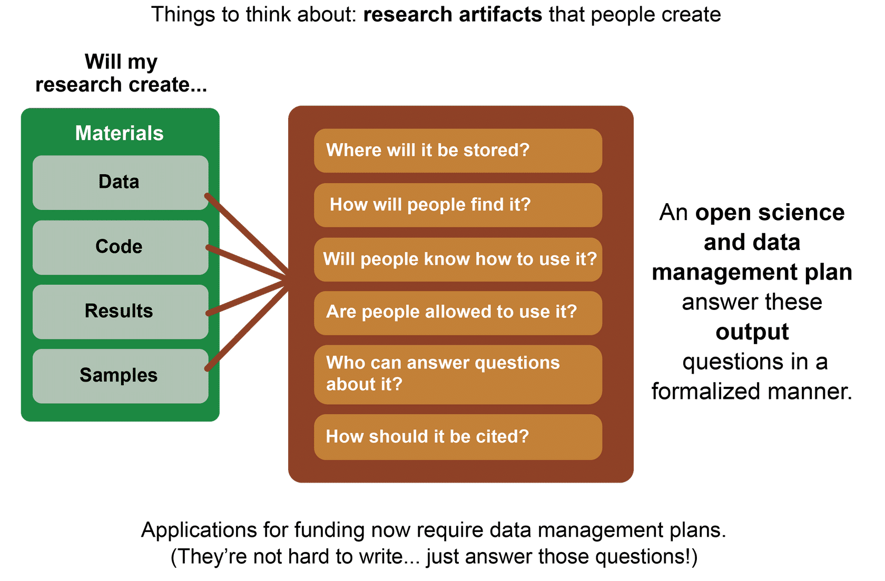

# Lesson 2: General Tools for Open Science

## Navigation

- [Introduction to Open Science Tools](#introduction-to-open-science-tools)
- [Persistent Identifiers](#persistent-identifiers)
- [Useful Open Science Tools](#useful-open-science-tools)
- [Open Science and Data Management Plans](#open-science-and-data-management-plans)
- [Lesson 2: Summary](#lesson-2-summary)
- [Lesson 2: Knowledge Check](#lesson-2-knowledge-check)

## Overview

This lesson introduces you to the commonly used tools in open science. It starts out by providing a brief introduction to open science tools and describes persistent identifiers - one of the most common open science tools in use that ensures reproducibility, accessibility, and recognition of scientific products. This is followed by descriptions of other common open science tools that are applicable regardless of your field of study. The lesson wraps up with a description of open science and data management plans that is a key component to sharing your science throughout the research process.

## Learning Objectives

After completing this lesson, you should be able to:

- Recall the definition of open science tools.
- Describe what a persistent identifier is and state an example.
- List a few commonly used open science tools that support research.
- List the components of an Open Science and Data Management Plan and what they include.

## Introduction to Open Science Tools

The word "tools" refers to any type of resource or instrument that can be used to support your research. In this sense, tools can be a collection of useful resources that you might consult during your research, software that you could use to create and manage your data, or even human infrastructure such as a community network that you join to get more guidance and support on specific matters.

In this context, open science tools are any tools that enable and facilitate openness in research, and support responsible open science practices. It is important to note that open science tools are often open source and/or free to use, but not always.

Open science tools can be used for:

- **Discovery** - Tools for finding content to use in your research.
- **Analysis** - Tools to process your research output, e.g. tools for data analysis and visualization.
- **Writing** - Tools to produce content, such as Data Management Plans, presentations, and preprints.
- **Publications** - Tools to use for sharing and/or archiving research.
- **Outreach** - Tools to promote your research.

In this lesson, we introduce you to some of the most general open science tools such as persistent identifiers, metadata, documentation, and open science and data management plans. Regardless of the field of study, these tools and practices are some of the things that you will encounter as you use, make, or share your research. Read more about open science tools on [OpenSciency](https://opensciency.github.io/sprint-content/open-tools-resources/lesson1-intro-open-science-tools.html).

## Persistent Identifiers

A digital persistent identifier (or "PID") is a “long-lasting reference to a digital resource” that is machine-readable and uniquely points to a digital entity, according to [ORCID](https://support.orcid.org/hc/en-us/articles/360006971013-What-are-persistent-identifiers-PIDs-) examples of persistent identifiers used in science are described below.

### ORCID

An "Open Researcher and Contributor Identifier" (ORCID) provides valid information about a person. Following are some key details about ORCIDs.

A free, nonproprietary numeric code that is:

- Uniquely and persistently identifies authors and contributors of scholarly communication.
- Similar to tax ID numbers for tax purposes.

ORCIDs are used to link Used to link researchers to their research and research-related outputs. It is a 16-digit number that uniquely identifies researchers and is integrated with certain organizations (like some publishers) that will add research products (such as a published paper) to an individual's ORCID profile. ORCIDs are meant to last throughout ones career, and helps to avoid confusion when information about a researcher changes over time (e.g. career change or name change). (cite: [https://orcid.org/](https://orcid.org/))

Many publishers, academic institutes, and government bodies support ORCID. In 2023, ORCID reported over 1,300 member organizations and over 9 million yearly live accounts. You can connect it with your professional information (affiliations, grants, publications, peer review, and more).

### Digital Object Identifiers (DOI)

A DOI is a persistent identifier used to cite data, software, journal articles, and other types of media (including presentation slides, blog posts, videos, logos, etc.).

Unlike dynamic transient URLs, DOIs are static pointers to documents on the internet. Since a DOI is static, each new version of data or software that you want to cite will need a new DOI. Some DOI providers allow for one DOI to point to "all versions" and a series of individual DOIs for each specific version. Individuals cannot typically request a DOI themselves, but rather have to go through an authorized organization that can submit the request.

Making a DOI for your product ensures its longevity! This means, if you cite a DOI in a research paper, you can be confident that future readers will be able to follow that citation to its source, even if websites have completely changed in the meantime.

For example, the DOI: [10.5067/TERRA-AQUA/CERES/EBAF-TOA_L3B004.1](https://doi.org/10.5067/TERRA-AQUA/CERES/EBAF-TOA_L3B004.1) will always resolve to a web page that explains what the CERES_EBAF-TOA_Edition4.1 data set is and how to download it. (See the screenshot below if you’re curious what this dataset actually is!)

DOIs are provided and maintained by the International Organization for Standardization ([I SO](https://www.iso.org/home.html)): [https://www.doi.org/](https://www.doi.org/).

### Citations Using DOIs

 

DOIs make citing research products easier and more useful.

Data repositories will typically instruct you on the exact way to cite their data, which includes the correct DOI. For example, let’s take a look at the CERES_EBAF-TOA_Edition4.1 data set mentioned above. This is an [example from the Atmospheric Science Data Center’s (ASDC) website](https://asdc.larc.nasa.gov/project/CERES/CERES_EBAF-TOA_Edition4.1/citation).

### Activity 2.1: Find and Resolve a DOI

In this activity, you will search for a DOI for a data set or piece of software that you use, and you will then use the DOI website to “resolve” the DOI name. By "resolving", this means that you will be taken to the information about the product designated by that particular DOI.

1. Find the DOI for a dataset or software you use often.
   1. This should be listed either in the citation file, or in the website where that data/software is published.
   2. If you can’t find a DOI, you can instead locate the DOI listed on this page: https://asdc.larc.nasa.gov/project/CERES/CERES_EBAF-TOA_Edition4.1
2. Go to https://www.doi.org/ and scroll down to the bottom of the page to "TRY
   RESOLVING A DOI NAME".
3. Copy and paste the DOI you found into the form called "TRY RESOLVING A DOI
   NAME".
4. Click Submit.
5. The page should automatically redirect you to a page that explains and contains the cited data.

**Activity Takeaways: Find and Resolve a DOI**

This activity will vary depending on which DOI you choose to use. However, if you used the example presented, you should find the DOI: 10.5067/TERRA-AQUA/CERES/EBAF-TOA_L3B004.1

And after step 5, you should end up back on the page https://asdc.larc.nasa.gov/project/CERES/CERES_EBAF-TOA_Edition4.1

This is how easy it should be for your readers to find and use your citation information.

### Examples of PIDs in Action

<table>
  <thead>
    <tr>
        <th>Example 1 ☑</th>
        <th>Example 2</th>
        <th>Example 3</th>
    </tr>
  </thead>
  <tbody>
    <tr>
        <td colspan="3">
            
The necessity for a persistent identifier (PID) begins when a researcher writes code. To make the code searchable, the researcher uploads their code to a repository and registers a DOI for their script. Now others can review and use the code, and cite it properly.

        </td>
    </tr>
  </tbody>
</table>

<table>
  <thead>
    <tr>
        <th>Example 1</th>
        <th>Example 2 ☑</th>
        <th>Example 3</th>
    </tr>
  </thead>
  <tbody>
    <tr>
        <td colspan="3">
            
A workshop planning committee collaboratively authors a paper that summarizes the results of a workshop. They collect the ORCIDs of everyone who participated in the workshop, and include them in the paper. Finally, they publish in an academic journal that automatically assigns the paper a DOI.

        </td>
    </tr>
  </tbody>
</table>

<table>
  <thead>
    <tr>
        <th>Example 1</th>
        <th>Example 2</th>
        <th>Example 3 ☑</th>
    </tr>
  </thead>
  <tbody>
    <tr>
        <td colspan="3">
            
A community scientist attends an online conference and gives a short talk. They deposit their slides in an online repository, then create a DOI to enable easy sharing with colleagues and straightforward citation.

        </td>
    </tr>
  </tbody>
</table>

## Useful Open Science Tools

### Metadata

Metadata are data that describe your data, either accompanying your data as a separate file or embedded in your data file. A menudo se utilizan para proporcionar un conjunto estándar de información general sobre un conjunto de datos (por ejemplo, cobertura temporal/espacial de datos o información del proveedor de datos) para permitir un fácil uso e interpretación de los datos.

Los metadatos son esenciales para la implementación de los principios FAIR porque permiten que los datos se puedan buscar en un archivo, proporcionan contexto para uso futuro y presentan un vocabulario estándar.

Los metadatos se pueden compartir más fácilmente que los datos: normalmente no contienen información restringida y son mucho más pequeños que el conjunto de datos completo.

### Propósito de los Metadatos

Los metadatos pueden facilitar la evaluación de la calidad del conjunto de datos y el intercambio de datos respondiendo preguntas clave, como información sobre:

- Cómo se recolectaron y procesaron los datos.
- Qué variables/parámetros se incluyen en el conjunto de datos.
- Qué variables son y con qué variables están relacionadas.
- Quién recolectó los datos (equipo científico, organización, etc.).
- Cómo y dónde encontrar los datos (por ejemplo, DOI).
- Cómo citar los datos.
- Qué región espacio-temporal / tiempo cubren los datos.
- Toda información legal, pauta o estándar sobre los datos.

Los metadatos mejoran la búsqueda y la accesibilidad de los datos permitiendo potencialmente que otras máquinas lean e interpreten los conjuntos de datos.

De acuerdo con [La Universidad de Pittsburgh](https://pitt.libguides. om/metadatadiscovery/metadata-standards), "Un estándar de metadatos es un documento de alto nivel que establece una manera común de estructurar y entender los datos, e incluye principios y problemas de implementación para utilizar el estándar."

Existen muchos estándares para los campos y estructuras de metadatos para describir la información general de los datos. Es una buena práctica usar un estándar que se utiliza comúnmente en tu dominio, cuando sea aplicable, o que sea solicitado por su repositorio de datos. Algunos ejemplos de estándares de metadatos para diferentes dominios incluyen:

- [Convenciones de metadatos de CF](https://cfconventions.org/)
- [Organización Meteorológica Mundial WIS 2.0](https://community.wmo.int/es/activity-areas/wis/wis2-implementation)
- [Grupo de trabajo de GeneLab](https://genelab.nasa.gov/awg/members)

### Tipos de Metadatos

Hay diferentes tipos/categorías de metadatos que abordan diferentes propósitos:

 <table>
  <thead>
    <tr>
        <th>Metadatos Descriptivos ☑</th>
        <th>Metadatos Estructurales</th>
        <th>Metadatos Administrativos</th>
    </tr>
  </thead>
  <tbody>
    <tr>
        <td colspan="3">
            
Los metadatos descriptivos pueden contener información sobre el contexto y el contenido de sus datos, tales como la definición de variables, limitación de datos, descripción de medición/muestreo, resumen, título y palabras claves del tema.

        </td>
    </tr>
  </tbody>
</table>

 <table>
  <thead>
    <tr>
        <th>Metadatos Descriptivos</th>
        <th>Metadatos estructurales ☑</th>
        <th>Metadatos Administrativos</th>
    </tr>
  </thead>
  <tbody>
    <tr>
        <td colspan="3">
            
Los metadatos estructurales se utilizan para describir la estructura de los datos (por ejemplo, el formato de archivo, la jerarquía de datos y las dimensiones).

        </td>
    </tr>
  </tbody>
</table>

 <table>
  <thead>
    <tr>
        <th>Metadatos Descriptivos</th>
        <th>Metadatos Estructurales</th>
        <th>Metadatos Administrativos ☑</th>
    </tr>
  </thead>
  <tbody>
    <tr>
        <td colspan="3">
            
Los metadatos administrativos explican la información utilizada para administrar los datos (p. ej. cuándo y cómo fue creado, qué software y la versión del software utilizado en la creación de datos).

        </td>
    </tr>
  </tbody>
</table>

### Documentación

Documentar la producción y gestión de tu ciencia beneficia tanto a ti como a aquellos que puedan usar tus datos, código o resultados en el futuro. Tú eres tu mejor colaborador. La documentación puede salvarle de un dolor de cabeza si necesita hacer referencia o reutilizar su trabajo en seis meses o intentar recordar detalles meticulosos sobre su proceso más adelante. Los productos de investigación debidamente documentados incrementan su usabilidad.

Los tipos de documentación incluyen (muchos de los cuales serán ampliados más adelante en este currículo):

 <table>
  <thead>
    <tr>
        <th>Datos ☑</th>
        <th>Software</th>
        <th>Resultados</th>
    </tr>
  </thead>
  <tbody>
    <tr>
        <td colspan="3">
        
Resumen de los datos (por ejemplo, como un archivo LEEME o guía de usuario) que responde preguntas como:

        <ul>
            <li>¿Cuáles son los errores conocidos para estos datos?</li>
            <li>¿Cómo se pueden utilizar estos datos?</li>
            <li>¿Cómo se recolectaron los datos?</li>
        </ul>
        
Publicaciones asociadas – ¿cómo utilizaron otros estos datos?

        </td>
    </tr>
  </tbody>
</table>

<table>
  <thead>
    <tr>
        <th>Datos</th>
        <th>Software ☑</th>
        <th>Resultados</th>
    </tr>
  </thead>
  <tbody>
    <tr>
        <td colspan="3">
            
Archivos LEEME: Instrucciones básicas de instalación y uso.

            
Comentarios en línea en el código: Anotaciones sobre componentes de código.

            
Notas de la versión: ¿Qué hay de nuevo en esta versión?

            
Publicaciones asociadas: ¿Cómo utilizaron otros este software?

        </td>
    </tr>
  </tbody>
</table>

<table>
  <thead>
    <tr>
        <th>Datos</th>
        <th>Software</th>
        <th>Resultados ☑</th>
    </tr>
  </thead>
  <tbody>
    <tr>
        <td colspan="3">
            
Publicaciones asociadas: ¿Cuál fue el proceso de investigación?

            
Paquetes de datos y software para la regeneración de resultados.

        </td>
    </tr>
  </tbody>
</table>

### Repositorios

Los repositorios son lugares de almacenamiento de datos, resultados, código y software compilado, proporcionando la forma más común de compartir y encontrar cada uno de estos componentes. En general, se desea utilizar un repositorio a largo plazo que alojará y almacenará sus datos de forma independiente, asegurándose de que se comparten y conservan. Los diferentes tipos de repositorios sirven para diferentes propósitos. Por ejemplo, Zenodo actúa como un repositorio de archivos para versiones individuales de datos, software y publicaciones.

Diferentes tipos de repositorios:

- Repositorios generales
- Repositorios específicos de dominios
- Repositorios institucionales
- Repositorios nacionales

Los usuarios deben seleccionar los repositorios basados en sus necesidades. Vea las lecciones del resto de este módulo y los módulos 3-5 para más detalles.

### Pre-registro

El Pre-registro es el proceso mediante el cual un investigador documenta sus planes de investigación en un formato de acceso abierto antes del inicio de un proyecto. Esto proporciona una prueba bloqueada y fechada del origen de un concepto. En la actualidad, el preregistro es más ampliamente adoptado por ciertas disciplinas, en particular las ciencias sociales.

Los tipos de Pre-Registro incluyen:

<table>
  <thead>
    <tr>
        <th>Pre-registro estándar ☑</th>
        <th>Reportes Registrados</th>
        <th>Reporte de Replicación Registrado</th>
        <th>Compartiendo Propuestas de Subsidios</th>
    </tr>
  </thead>
  <tbody>
    <tr>
        <td colspan="4">
            
El equipo investigador documenta sus planes por escrito y los envía a un servicio de pre-registro. Esto documenta los planes del equipo investigador antes de llevar a cabo la investigación, y proporciona tanto a los equipos de investigadores como revisores, una manera de distinguir entre las hipótesis a priori y los análisis exploratorios post-hoc. El documento puede mantenerse privado durante algún tiempo, pero normalmente se hace público cuando se envía el manuscrito para su publicación.

        </td>
    </tr>
  </tbody>
</table>

<table>
  <thead>
    <tr>
        <th>Pre-registro Estándar</th>
        <th>Reportes Registrados ☑</th>
        <th>Reporte de Replicación Registrado</th>
        <th>Compartiendo Propuestas de Subsidios</th>
    </tr>
  </thead>
  <tbody>
    <tr>
        <td colspan="4">
            
El equipo investigador escribe un manuscrito que describe la motivación para un estudio y una descripción detallada de los métodos, y lo envía a una revista para la revisión por pares antes de emprender la investigación. El manuscrito es revisado en base a la importancia de la pregunta de investigación y la calidad de los métodos. Si se acepta, la revista acuerda publicar el artículo sin importar los resultados, suponiendo que no haya problemas con la implementación de los métodos.

        </td>
    </tr>
  </tbody>
</table>

<table>
  <thead>
    <tr>
        <th>Pre-registro Estándar</th>
        <th>Reportes Registrados</th>
        <th>Reporte de Replicación Registrado ☑</th>
        <th>Compartiendo Propuestas de Subsidios</th>
    </tr>
  </thead>
  <tbody>
    <tr>
        <td colspan="4">
            
Un tipo de reporte registrado en el que el equipo investigador desea intentar replicar un hallazgo publicado en particular, generalmente involucrando múltiples sitios de investigación.

        </td>
    </tr>
  </tbody>
</table>

<table>
  <thead>
    <tr>
        <th>Pre-registro Estándar</th>
        <th>Reportes Registrados</th>
        <th>Reporte de Replicación Registrado</th>
        <th>Compartiendo Propuestas de Subsidios ☑</th>
    </tr>
  </thead>
  <tbody>
    <tr>
        <td colspan="4">
            
Otra forma de documentar y fechar los planes de investigación y conceptos es compartir públicamente las propuestas de subsidios financiadas. Esto tiene el beneficio añadido de hacer que el proceso de financiación sea más transparente, y ofreciendo ejemplos de propuestas de subsidios exitosas para otros equipos investigadores, en particular los que se encuentran en su fase temprana de la carrera.

        </td>
    </tr>
  </tbody>
</table>

### ¿Por qué es importante el pre-registro?

- Forza al equipo investigador a planificar y considerar detalladamente tanto por qué y cómo están llevando a cabo su pregunta de investigación.
- Proporciona a la persona que investiga una manera de determinar si una hipótesis realmente se celebró a priori frente a confiar en la memoria.
- Forza al equipo investigador a reflexionar sobre su plan de análisis con más detalle, potencialmente surgiendo cuestiones que podrían influir en el diseño del estudio.
- Ayuda a prevenir la manipulación no ética de los análisis de datos y el diseño de proyectos para obtener resultados estadísticamente relevantes.
- Ayuda a evitar la notificación selectiva de medidas.

### Cuándo Uno Puede/Debe Pre-Regristar Sus Investigaciones?

Una actividad de investigación planificada puede ser pre-registrada en cualquier momento, siempre y cuando la actividad particular que se registra no haya comenzado. Sin embargo, existen varios puntos en los que el registro es más común:

- Antes de la recolección de datos para un proyecto
- Antes del analisis de un conjunto de datos existente o abiertamente disponible

Fuente: [ Registration — Guía de Psicología de Stanford para Doing Open Science (poldrack.github.io)](https://poldrack.github.io/psych-open-science-guide/1_pregistration.html)[video]

[Encuesta sobre Naturaleza de 2023](https://www.nature. om/articles/s41467-023-41111-1) sobre actitudes de las personas que investigan hacia las prácticas científicas abiertas determinó que alrededor del 88% de las personas encuestadas están a favor de compartir datos o código en línea, mientras que sólo el 58% apoya el pre-registro. Este apoyo moderado al pre-registro entre las personas encuestadas sugiere que la conciencia de sus beneficios y preocupaciones persistentes sigue siendo un problema. En la siguiente sección, introducimos un método para elaborar estrategias sobre cómo implementar mejor la ciencia abierta desde el comienzo de un estudio hasta su fin.

## Ciencia Abierta y Planes de Gestión de Datos

Para usar, hacer y compartir con éxito la ciencia abiertamente, necesitamos un plan abierto de ciencia y gestión de datos (PACGD).

- Desde el día 1, establezca un plan para la gestión, conservación y publicación de datos, software y resultados.
- Este plan es tu plano para la ciencia abierta - consulta tu plan a menudo para asegurarte de tener éxito en tu objetivo de apertura.

Discutiremos cada componente (datos, software y resultados) cuando cubramos cada tema.

**Nota: Muchas oportunidades de financiación (por ejemplo, NASA ROSES) requieren un PACGD como parte de su propuesta. Para obtener más información sobre las políticas del Directorio de Misión de Ciencia de la NASA (SMD's), por favor [vea la Guía de la NASA sobre Planes de Administración](https://smd-cms.nasa.gov/wp-content/uploads/2023/07/smd-open-source-science-guidance-v2-20230407.pdf) y [Guía de Ciencia de Código Abierto para Investigadores.](https://smd-cms.nasa.gov/wp-content/uploads/2023/07/smd-open-source-science-guidance-v2-20230407.pdf)**

### Diseña Tu Ciencia para que sea Abierta

Las organizaciones y agencias de financiación de todo el mundo están empezando a requerir planes científicos abiertos. En este plan de estudios, nos centraremos en el Plan de Ciencia Abierta y Gestión de Datos de la NASA (PCAGD) (en inglés, Open Science and Data Management Plan, OSDMP). Los planes de ciencia abierta no son exclusivos de la NASA. Sin embargo, saber cómo escribir uno para esta agencia debería prepararte para casi cualquier oportunidad de financiamiento.

El PCAGD describe cómo se gestionará y se pondrá a disposición abiertamente la información que se producirá a partir de actividades científicas. Específicamente, un plan de estas características debe incluir secciones sobre gestión de datos, gestión de software y compartición de publicaciones. Si tu estudio tiene otros tipos de salidas, como muestras físicas, hardware o cualquier otra cosa, también debes incluirlas en el plan. Un PCAGD ayuda a los investigadores a pensar en los detalles de planificación para compartir resultados.

¡Un PCAGD bien escrito puede ayudarte a obtener financiamiento porque demuestra tus habilidades para hacer ciencia abierta!

 

Secciones de ejemplo para incluir en un PCAGD:

1. Plan de Gestión de Datos (PGD) (en inglés, Data Managemente Plan, DMP)
2. Plan de Gestión de Software (PGS) (en inglés, Software Management Plan, SMP)
3. Publicaciones compartidas
4. Otras actividades de ciencia abierta
5. Roles y responsabilidades

Los pasos para cada una de estas secciones deben incluir:

- ¿Qué?
  - Descripción de los tipos de materiales que se producirán
- ¿Cuando?
  - El cronograma para archivar y compartir
- ¿Dónde?
  - Los repositorios y archivos que se utilizarán para compartir materiales
- ¿Cómo?
  - Los detalles de permiso para la reutilización de materiales (por ejemplo, licencias, documentación, metadatos)
- ¿Quién?
  - Roles y responsabilidades de los miembros del equipo

### Plan de Gestión de Datos

Las principales fundaciones y agencias de gobierno exigen en la actualidad que los científicos presenten un Plan de Gestión de Datos (PGD) junto con la propuesta de su plan de investigación. Los datos y otros elementos, como el código y las publicaciones, tienen su propio ciclo de vida y flujo de trabajo, que deben estar incluidos en el plan. Los PGD son un aspecto crítico de la ciencia abierta y ayudan a mantener a otros investigadores informados y encaminados durante todo el ciclo de vida de la gestión de datos.

Los PGD que tienen éxito suelen incluir una terminología clara sobre los principios FAIR y CARE y cómo se aplicarán.

El ciclo de vida de la gestión de datos es típicamente circular. Los datos de la investigación son valiosos y reutilizables mucho después de que finaliza el apoyo financiero del proyecto. La reutilización de datos puede extenderse más allá de nuestra propia vida. Por lo tanto, al diseñar un proyecto o respaldar un corpus de datos existente, debemos ser conscientes de lo que sucede con los datos una vez finalizada nuestra propia interacción de investigación.

Los planes de gestión de datos suelen incluir lo siguiente:

- Descripciones de los datos que se esperan producir a partir de las actividades propuestas, incluidos los tipos de datos que se producirán, la cantidad aproximada de cada tipo de datos esperado, el formato legible por máquina de los datos, el formato del archivo de datos y cualquier estándar aplicable a los datos o metadatos asociados.
- El repositorio (o repositorios) que se utilizará para archivar los datos y metadatos que surjan de las actividades y el cronograma para ponerlos a disposición del público.
- Descripción de los tipos de datos que están sujetos a leyes, regulaciones o políticas relevantes que los excluyen de los requisitos de intercambio.
- Roles y responsabilidades del personal del proyecto que garantizará la implementación de los planes de gestión de datos.

### Plan de Gestión de Software

Los planes de gestión de software describen cómo se gestionará, publicará y preservará el software como parte del proceso científico. Esto ayuda a garantizar la transparencia y la reproducibilidad en el proceso científico. El Módulo 4 sobre Código Abierto incluye más detalles sobre la importancia de compartir código como parte del proceso científico.

Componentes generales de un plan de gestión de software:

- Descripción del software.
- Repositorio(s) y archivo(s) en los que se compartirá el software.
- Pautas para compartir.
- Roles y responsabilidades del personal.
- Cualquier información destacable específica de la comunidad.

Como mínimo, un plan de gestión de software para investigaciones financiadas debe incluir:

- Descripción del software que se espera producir a partir de las actividades propuestas, incluidos los tipos de software que se producirán, cómo se desarrollará el software y el agregado de nuevas funciones o actualizaciones al software existente. Esto puede incluir las plataformas utilizadas para el desarrollo, la gestión de proyectos y las mejores prácticas basadas en la comunidad, como documentación, pruebas, dependencias y control de versiones.
- El(los) repositorio(s) que se utilizarán para archivar el software que surja de las actividades y el cronograma para ponerlo a disposición del público.
- Descripción del software que está sujeto a leyes, regulaciones o políticas relevantes que los excluyen de los requisitos para ser compartido.
- Roles y responsabilidades del personal del proyecto que garantizará la implementación del plan de gestión de software.

### Plan de Ciencia Abierta

El PCAGD también debe describir otros procesos abiertos. Esto incluye los tipos de publicaciones que se esperan producir a partir de las actividades, incluidos manuscritos revisados por pares, informes técnicos, materiales de conferencias y libros. Además, debe especificar los métodos que se esperan utilizar para hacer las publicaciones accesibles al público.

Asimismo, esta sección también puede incluir una descripción de actividades de ciencia abierta adicionales asociadas con el proyecto. Esto puede comprender:

- Celebrar talleres y reuniones científicas de forma abierta para permitir una amplia participación.
- Prerregistro de planes de investigación con antelación a la realización de actividades científicas.
- Proporcionar al personal del proyecto capacitación o entrenamiento en ciencia abierta (si no se describe en otra parte de la propuesta).
- Implementar prácticas que apoyen la inclusión de comunidades amplias y diversas en el proceso científico lo más cerca posible del inicio de las actividades de investigación (si no se describen en otra parte de una propuesta).
- Integrar prácticas de ciencia abierta en las actividades de ciencia ciudadana.
- Contribuir o participar en comunidades de ciencia abierta.

### Plan de Publicaciones

El plan de publicaciones es una pieza crucial del PCAGD. Dicho plan posee las siguientes características:

- Describe cómo se gestionarán, publicarán y conservarán los resultados; en otras palabras, cómo se comunicarán los hallazgos.
- Incluye planes para charlas en conferencias, documentos técnicos, artículos de revistas revisados por pares, libros y otros documentos similares.
- Está escrito de conformidad con las normas y reglamentos de su organización, así como de su fuente de financiación.
- Al igual que los planes de datos y software, sirve como marco fundamental para el proyecto de principio a fin.

### Ejemplos de Requerimientos para Planes de Gestión de Ciencia Abierta

Las organizaciones y agencias a nivel mundial están avanzando hacia la ciencia abierta y comienzan a exigir planes como requerimiento para el financiamiento. Aquí se presentan algunos de ellos:

**Estados Unidos**

- NASA
  - [Plan de Ciencia Abierta y Gestión de Datos](https://science.nasa.gov/researchers/sara/faqs/osdmp/)
- **NSF**
  - [Plan de Gestión de Datos](https://new.nsf.gov/funding/data-management-plan#%3A~%3Atext%3DThe%20two-page%20data%20management%20plan%20is%20a%20required%2Coverview%20of%20requirements%20for%20the%20data%20management%20plan)
- **NIH**
  - [Plan de Gestión e Intercambio de Datos](https://sharing.nih.gov/data-management-and-sharing-policy/planning-and-budgeting-for-data-management-and-sharing/writing-a-data-management-and-sharing-plan)
- **NOAA**
  - [Plan de Intercambio de Datos e Información](https://oceanexplorer.noaa.gov/about/funding-opps/media/fy23-data-management-plan.pdf)

INSTITUTOS GLOBALES

- Consejo Australiano de Investigación
  - [Plan de Gestión de Datos](https://www.arc.gov.au/about-arc/strategies/research-data-management)
- Requerimientos de Ciencia Abierta de la Unión Europea
  - [Ciencia Abierta en Horizonte Europeo](https://openscience.eu/Open-Science-in-Horizon-Europe)
- Fideicomiso de Bienvenida del Reino Unido
  - [Plan de Gestión de Resultados](https://wellcome.org/grant-funding/guidance/how-complete-outputs-management-plan)
- Fundación Nacional de Investigación de Corea
  - [Guía DMP](https://www.nrf.re.kr/cms/board/general/view?nts_no=124731&amp;menu_no=53&amp;nts_no&amp;search_type=ALL&amp;search_keyword=%EC%97%B0%EA%B5%AC%EB%8D%B0%EC%9D%B4%ED%84%B0&amp;page=90)
- Agencia Japonesa de Ciencia y Tecnología
  - [Acceso Abierto a Publicaciones de Investigación y Gestión de Datos de Investigación](https://www.jst.go.jp/EN/about/openscience/guideline_openscience_en_r4.pdf)

Y recuerda, ¡la ciencia abierta tiene matices! Aunque uno de los principios de la ciencia abierta es compartir sus productos, no todos los productos pueden o deben compartirse. La organización o agencia de financiación puede especificar cómo los comparte. Al embarcarte en la adopción de la ciencia abierta para un proyecto, considera si el tema y el enfoque de tu proyecto permitirán compartirlo. Piensa en las siguientes preguntas:

- ¿Se pueden compartir los productos de la investigación?
- ¿Quién te ayudó a obtener tus datos?
- ¿Ellos se beneficiarán de la liberación?
- ¿Quién tiene la responsabilidad y autoridad de lo que sucede con los datos?
- ¿Deberían compartirse los productos de la investigación?

En los siguientes módulos encontrarás más detalles sobre cómo escribir estos planes para datos, código y resultados.

## Lección 2: Resumen

En esta lección aprendimos:

- La definición de herramientas científicas, ejemplos comunes y qué parte del flujo de trabajo científico pueden respaldar.
- La definición y el propósito de los identificadores persistentes. La utilidad de ORCID y DOI en el proceso científico.
- Ejemplos de herramientas científicas abiertas útiles y comunes, como metadatos, documentación, repositorios y prerregistro.
- Los pasos para redactar un plan de gestión de datos y ciencia abierta.

## Lección 2: Evaluación

Responde las siguientes preguntas para poner a prueba lo que has aprendido hasta ahora.

_Pregunta_

**01/03**

¿En qué pueden ayudar las herramientas de ciencia abierta?

- Descubrimiento
- Escritura
- Divulgación
- Todas las anteriores

_Pregunta_

**02/03**

Completa la afirmación:

_Bien, metadatos claros _____._

Selecciona todas las que correspondan.

- Mejoran la capacidad de búsqueda
- Mejoran la accesibilidad
- Mejoran la interoperabilidad
- Mejoran la reutilización
- Son una pérdida de tiempo

_Pregunta_

**03/03**

¿Cuáles son los componentes de un Plan de Gestión de Software? Selecciona todas las que correspondan.

- Descripción del Software
- Repositorio(s) en el que se archivará el software
- Pautas para compartir
- Roles y responsabilidades del personal
- Cualquier información destacable específica de la comunidad
- Creación de un logo
