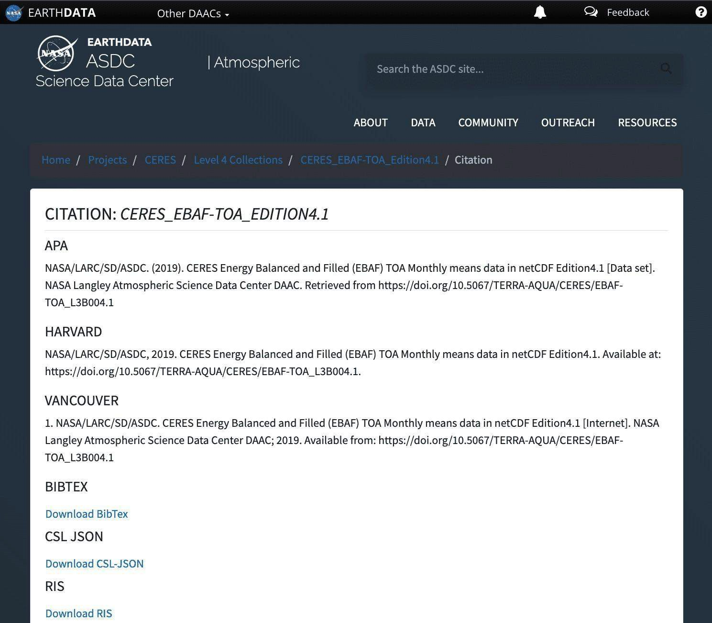

# Lesson 2: General Tools for Open Science

## Navigation

- [Introduction to Open Science Tools](#introduction-to-open-science-tools)
- [Persistent Identifiers](#persistent-identifiers)
- [Useful Open Science Tools](#useful-open-science-tools)
- [Open Science and Data Management Plans](#open-science-and-data-management-plans)
- [Lesson 2: Summary](#lesson-2-summary)
- [Lesson 2: Knowledge Check](#lesson-2-knowledge-check)

## Overview

This lesson introduces you to the commonly used tools in open science. It starts out by providing a brief introduction to open science tools and describes persistent identifiers - one of the most common open science tools in use that ensures reproducibility, accessibility, and recognition of scientific products. This is followed by descriptions of other common open science tools that are applicable regardless of your field of study. The lesson wraps up with a description of open science and data management plans that is a key component to sharing your science throughout the research process.

## Learning Objectives

After completing this lesson, you should be able to:

- Recall the definition of open science tools.
- Describe what a persistent identifier is and state an example.
- List a few commonly used open science tools that support research.
- List the components of an Open Science and Data Management Plan and what they include.

## Introduction to Open Science Tools

The word "tools" refers to any type of resource or instrument that can be used to support your research. In this sense, tools can be a collection of useful resources that you might consult during your research, software that you could use to create and manage your data, or even human infrastructure such as a community network that you join to get more guidance and support on specific matters.

In this context, open science tools are any tools that enable and facilitate openness in research, and support responsible open science practices. It is important to note that open science tools are often open source and/or free to use, but not always.

Open science tools can be used for:

- **Discovery** - Tools for finding content to use in your research.
- **Analysis** - Tools to process your research output, e.g. tools for data analysis and visualization.
- **Writing** - Tools to produce content, such as Data Management Plans, presentations, and preprints.
- **Publications** - Tools to use for sharing and/or archiving research.
- **Outreach** - Tools to promote your research.

In this lesson, we introduce you to some of the most general open science tools such as persistent identifiers, metadata, documentation, and open science and data management plans. Regardless of the field of study, these tools and practices are some of the things that you will encounter as you use, make, or share your research. Read more about open science tools on [OpenSciency](https://opensciency.github.io/sprint-content/open-tools-resources/lesson1-intro-open-science-tools.html).

## Persistent Identifiers

A digital persistent identifier (or "PID") is a “long-lasting reference to a digital resource” that is machine-readable and uniquely points to a digital entity, according to [ORCID](https://support.orcid.org/hc/en-us/articles/360006971013-What-are-persistent-identifiers-PIDs-) examples of persistent identifiers used in science are described below.

### ORCID

An "Open Researcher and Contributor Identifier" (ORCID) provides valid information about a person. Following are some key details about ORCIDs.

A free, nonproprietary numeric code that is:

- Uniquely and persistently identifies authors and contributors of scholarly communication.
- Similar to tax ID numbers for tax purposes.

ORCIDs are used to link Used to link researchers to their research and research-related outputs. It is a 16-digit number that uniquely identifies researchers and is integrated with certain organizations (like some publishers) that will add research products (such as a published paper) to an individual's ORCID profile. ORCIDs are meant to last throughout ones career, and helps to avoid confusion when information about a researcher changes over time (e.g. career change or name change). (cite: [https://orcid.org/](https://orcid.org/))

Many publishers, academic institutes, and government bodies support ORCID. In 2023, ORCID reported over 1,300 member organizations and over 9 million yearly live accounts. You can connect it with your professional information (affiliations, grants, publications, peer review, and more).

### Digital Object Identifiers (DOI)

A DOI is a persistent identifier used to cite data, software, journal articles, and other types of media (including presentation slides, blog posts, videos, logos, etc.).

Unlike dynamic transient URLs, DOIs are static pointers to documents on the internet. Since a DOI is static, each new version of data or software that you want to cite will need a new DOI. Some DOI providers allow for one DOI to point to "all versions" and a series of individual DOIs for each specific version. Individuals cannot typically request a DOI themselves, but rather have to go through an authorized organization that can submit the request.

Making a DOI for your product ensures its longevity! This means, if you cite a DOI in a research paper, you can be confident that future readers will be able to follow that citation to its source, even if websites have completely changed in the meantime.

For example, the DOI: [10.5067/TERRA-AQUA/CERES/EBAF-TOA_L3B004.1](https://doi.org/10.5067/TERRA-AQUA/CERES/EBAF-TOA_L3B004.1) will always resolve to a web page that explains what the CERES_EBAF-TOA_Edition4.1 data set is and how to download it. (See the screenshot below if you’re curious what this dataset actually is!)

DOIs are provided and maintained by the International Organization for Standardization ([I SO](https://www.iso.org/home.html)): [https://www.doi.org/](https://www.doi.org/).

### Citations Using DOIs

 

DOIs make citing research products easier and more useful.

Data repositories will typically instruct you on the exact way to cite their data, which includes the correct DOI. For example, let’s take a look at the CERES_EBAF-TOA_Edition4.1 data set mentioned above. This is an [example from the Atmospheric Science Data Center’s (ASDC) website](https://asdc.larc.nasa.gov/project/CERES/CERES_EBAF-TOA_Edition4.1/citation).

### Activity 2.1: Find and Resolve a DOI

In this activity, you will search for a DOI for a data set or piece of software that you use, and you will then use the DOI website to “resolve” the DOI name. By "resolving", this means that you will be taken to the information about the product designated by that particular DOI.

1. Find the DOI for a dataset or software you use often.
   1. This should be listed either in the citation file, or in the website where that data/software is published.
   2. If you can’t find a DOI, you can instead locate the DOI listed on this page: https://asdc.larc.nasa.gov/project/CERES/CERES_EBAF-TOA_Edition4.1
2. Go to https://www.doi.org/ and scroll down to the bottom of the page to "TRY
   RESOLVING A DOI NAME".
3. Copy and paste the DOI you found into the form called "TRY RESOLVING A DOI
   NAME".
4. Click Submit.
5. The page should automatically redirect you to a page that explains and contains the cited data.

**Activity Takeaways: Find and Resolve a DOI**

This activity will vary depending on which DOI you choose to use. However, if you used the example presented, you should find the DOI: 10.5067/TERRA-AQUA/CERES/EBAF-TOA_L3B004.1

And after step 5, you should end up back on the page https://asdc.larc.nasa.gov/project/CERES/CERES_EBAF-TOA_Edition4.1

This is how easy it should be for your readers to find and use your citation information.

### Examples of PIDs in Action

<table>
  <thead>
    <tr>
        <th>Example 1 ☑</th>
        <th>Example 2</th>
        <th>Example 3</th>
    </tr>
  </thead>
  <tbody>
    <tr>
        <td colspan="3">
            
The necessity for a persistent identifier (PID) begins when a researcher writes code. To make the code searchable, the researcher uploads their code to a repository and registers a DOI for their script. Now others can review and use the code, and cite it properly.

        </td>
    </tr>
  </tbody>
</table>

<table>
  <thead>
    <tr>
        <th>Example 1</th>
        <th>Example 2 ☑</th>
        <th>Example 3</th>
    </tr>
  </thead>
  <tbody>
    <tr>
        <td colspan="3">
            
A workshop planning committee collaboratively authors a paper that summarizes the results of a workshop. They collect the ORCIDs of everyone who participated in the workshop, and include them in the paper. Finally, they publish in an academic journal that automatically assigns the paper a DOI.

        </td>
    </tr>
  </tbody>
</table>

<table>
  <thead>
    <tr>
        <th>Example 1</th>
        <th>Example 2</th>
        <th>Example 3 ☑</th>
    </tr>
  </thead>
  <tbody>
    <tr>
        <td colspan="3">
            
A community scientist attends an online conference and gives a short talk. They deposit their slides in an online repository, then create a DOI to enable easy sharing with colleagues and straightforward citation.

        </td>
    </tr>
  </tbody>
</table>

## Useful Open Science Tools

### Metadata

Metadata are data that describe your data, either accompanying your data as a separate file or embedded in your data file. A menudo se utilizan para proporcionar un conjunto estándar de información general sobre un conjunto de datos (por ejemplo, cobertura temporal/espacial de datos o información del proveedor de datos) para permitir un fácil uso e interpretación de los datos.

Los metadatos son esenciales para la implementación de los principios FAIR porque permiten que los datos se puedan buscar en un archivo, proporcionan contexto para uso futuro y presentan un vocabulario estándar.

Los metadatos se pueden compartir más fácilmente que los datos: normalmente no contienen información restringida y son mucho más pequeños que el conjunto de datos completo.

### El propósito de los metadatos

Los metadatos pueden facilitar la evaluación de la calidad del conjunto de datos y el intercambio de datos respondiendo preguntas clave, como información sobre:

- How data were collected and processed.
- What variables/parameters are included in the dataset.
- What variables are and what variables are related to.
- Who collected the data (science team, organization, etc.).
- How and where to find the data (e.g., DOI).
- How to cite the data.
- Which spatio-temporal region/time the data covers.
- Any legal, guideline, or standard information about the data.

Metadata enhances searchability and findability of the data by potentially allowing other machines to read and interpret datasets.

According to  [The University of Pittsburgh](https://pitt.libguides.com/metadatadiscovery/metadata-standards), "A metadata standard is a high level document which establishes a common way of structuring and understanding data, and includes principles and implementation issues for utilizing the standard."

Many standards exist for metadata fields and structures to describe general data information. It is a best practice to use a standard that is commonly used in your domain, when applicable, or that is requested by your data repository. Examples of metadata standards for different domains include:

- [CF Metadata Conventions](https://cfconventions.org/)
- [World Meteorological Organization WIS 2.0](https://community.wmo.int/en/activity-areas/wis/wis2-implementation)
- [GeneLab Working Group](https://genelab.nasa.gov/awg/members)

### Types of Metadata

There are different types/categories of metadata addressing different purposes:

 <table>
  <thead>
    <tr>
        <th>Descriptive Metadata ☑</th>
        <th>Structural Metadata</th>
        <th>Administrative Metadata</th>
    </tr>
  </thead>
  <tbody>
    <tr>
        <td colspan="3">
            
Descriptive metadata can contain information about the context and content of your data, such as variable definition, data limitation, measurement/ sampling description, abstract, title, and subject keywords.

        </td>
    </tr>
  </tbody>
</table>

 <table>
  <thead>
    <tr>
        <th>Descriptive Metadata</th>
        <th>Structural Metadata ☑</th>
        <th>Administrative Metadata</th>
    </tr>
  </thead>
  <tbody>
    <tr>
        <td colspan="3">
            
Structural metadata are used to describe the structure of the data (e.g., file format, the dataset hierarchy, and dimensions).

        </td>
    </tr>
  </tbody>
</table>

 <table>
  <thead>
    <tr>
        <th>Descriptive Metadata</th>
        <th>Structural Metadata</th>
        <th>Administrative Metadata ☑</th>
    </tr>
  </thead>
  <tbody>
    <tr>
        <td colspan="3">
            
Administrative metadata explains the information used to manage the data (e.g., when and how it was created, which software and the version of the software used in data creation).

        </td>
    </tr>
  </tbody>
</table>

### Documentation

Documenting the production and management of your science benefits both you and those that might use your data, code, or results in the future. You are your own best collaborator. Documentation can save you from a headache should you need to reference or reuse your work in six months or attempt to recall meticulous details about your process later on. Properly documented research products increase their usability.

Types of documentation include (many of which will be expanded upon later in this curriculum):

 <table>
  <thead>
    <tr>
        <th>Data ☑</th>
        <th>Software</th>
        <th>Results</th>
    </tr>
  </thead>
  <tbody>
    <tr>
        <td colspan="3">
        
Summary of the data (e.g., as a README file or user guide) that answers questions such as:

        <ul>
            <li>What are known errors for these data?</li>
            <li>How can this data be used?</li>
            <li>How were the data collected?</li>
        </ul>
        
Associated publications – how did others use these data?

        </td>
    </tr>
  </tbody>
</table>

<table>
  <thead>
    <tr>
        <th>Data</th>
        <th>Software ☑</th>
        <th>Results</th>
    </tr>
  </thead>
  <tbody>
    <tr>
        <td colspan="3">
            
README files: Basic installation and usage instructions.

            
Inline comments in code: Annotations on code components.

            
Release notes: What is new in this version?

            
Associated publications: How did others use this software?

        </td>
    </tr>
  </tbody>
</table>

<table>
  <thead>
    <tr>
        <th>Data</th>
        <th>Software</th>
        <th>Results ☑</th>
    </tr>
  </thead>
  <tbody>
    <tr>
        <td colspan="3">
            
Associated publications: What was the research process?

            
Packages of data and software for regenerating results.

        </td>
    </tr>
  </tbody>
</table>

### Repositories

Repositories are storage locations for data, results, code and compiled software, providing the most common way to share and find each of these components. In general, you want to use a long term repository that will independently host and store your data making sure that it is both shared and preserved. Different kinds of repositories serve different purposes. For example, Zenodo acts as an archiving repository for individual version releases of data, software, and publications.

Different types of repositories:

- General repositories
- Domain-specific repositories
- Institutional repositories
- National repositories

Users should select repositories based on their needs. See the lessons in the rest of this module and Modules 3-5 for more details.

### Pre-registration

Pre-registration is the process by which a researcher documents their research plans in an open access format prior to the start of a project. This provides a locked, time-stamped proof of the origin of a concept. Pre-registration is currently more widely adopted by certain disciplines, particularly the social sciences.

Types of Pre-Registration Include:

<table>
  <thead>
    <tr>
        <th>Standard Pre-registration ☑</th>
        <th>Registered Reports</th>
        <th>Registered Replication Report</th>
        <th>Sharing Grant Proposals</th>
    </tr>
  </thead>
  <tbody>
    <tr>
        <td colspan="4">
            
An investigator documents their plans in writing and submits them to a pre-registration service. This documents the researcher’s plans prior to undertaking the research, and provides investigators and reviewers with a way to distinguish a priori hypotheses from post-hoc exploratory analyses. The document may be kept private for some period of time, but is usually made public upon submission of the manuscript for publication.

        </td>
    </tr>
  </tbody>
</table>

<table>
  <thead>
    <tr>
        <th>Standard Pre-registration</th>
        <th>Registered Reports ☑</th>
        <th>Registered Replication Report</th>
        <th>Sharing Grant Proposals</th>
    </tr>
  </thead>
  <tbody>
    <tr>
        <td colspan="4">
            
An investigator writes a manuscript describing the motivation for a study and a detailed description of the methods, and submits it to a journal for peer review prior to undertaking the research. The manuscript is reviewed based on the importance of the research question and the quality of the methods. If accepted, the journal agrees to publish the paper regardless of the results, assuming that there are no problems with the implementation of the methods.

        </td>
    </tr>
  </tbody>
</table>

<table>
  <thead>
    <tr>
        <th>Standard Pre-registration</th>
        <th>Registered Reports</th>
        <th>Registered Replication Report ☑</th>
        <th>Sharing Grant Proposals</th>
    </tr>
  </thead>
  <tbody>
    <tr>
        <td colspan="4">
            
A type of registered report in which the investigators wish to attempt to replicate a particular published finding, usually involving multiple research sites.

        </td>
    </tr>
  </tbody>
</table>

<table>
  <thead>
    <tr>
        <th>Standard Pre-registration</th>
        <th>Registered Reports</th>
        <th>Registered Replication Report</th>
        <th>Sharing Grant Proposals ☑</th>
    </tr>
  </thead>
  <tbody>
    <tr>
        <td colspan="4">
            
Another way to document and timestamp research plans and concepts is to share funded grant proposals publicly. This has the added benefit of making the funding process more transparent, and providing examples of successful grant proposals for other researchers, particularly those in their early career stage.

        </td>
    </tr>
  </tbody>
</table>

### Why is Pre-Registration Important?

- It forces the researcher to plan and think through both why and how they are pursuing their research question.
- It provides the researcher with a way to determine whether a hypothesis was truly held a priori, versus relying upon memory.
- It forces the researcher to think through their analysis plan in more detail, potentially surfacing issues that could influence the design of the study.
- It helps prevent unethical manipulation of data analyses and project design to yield statistically relevant results.
- Helps prevent selective reporting of measures.

### When Can/Should One Pre-Register Their Research?

A planned research activity can be pre-registered at any point, as long as the particular activity being registered has not started. However, there are several points at which registration is most common:

- Prior to the collection of data for a project
- Prior to analysis of an existing or openly available dataset

Source: [ Registration — Stanford Psychology Guide to Doing Open Science (poldrack.github.io)](https://poldrack.github.io/psych-open-science-guide/1_preregistration.html)

A 2023 [Nature survey](https://www.nature.com/articles/s41467-023-41111-1) on researcher attitudes towards open science practices found that about 88% of respondents favor sharing data or code online while only 58% support pre-registration. This moderate support for pre-registration among respondents suggests that awareness of its benefits and lingering concerns remain issues. In the next section, we introduce a method to strategize how to best implement open science from the beginning of a study to its end.

## Open Science and Data Management Plans

To successfully use, make, and share science openly, we need an open science and data management plan (OSDMP).

- From day 1, establish a plan for management, preservation, and release of data, software, and results.
- This plan is your blueprint for open science - refer to your plan often to ensure you succeed in your goal of openness.

We'll discuss each component (data, software, & results) when we cover each topic.

**Note: Many funding opportunities (e.g., NASA ROSES) require an OSDMP as part of your proposal. For more information on NASA Science Mission Directorate’s (SMD's) policies, please [see NASA Guidance on Management Plans](https://smd-cms.nasa.gov/wp-content/uploads/2023/07/smd-open-source-science-guidance-v2-20230407.pdf) and [Open Source Science Guidance for Researchers.](https://smd-cms.nasa.gov/wp-content/uploads/2023/07/smd-open-source-science-guidance-v2-20230407.pdf)**

### Design Your Science to be Open

Funding organizations and agencies around the world are beginning to require open science plans. En este plan de estudios, nos centraremos en el Plan de Ciencia Abierta y Gestión de Datos de la NASA (PCAGD) (en inglés, Open Science and Data Management Plan, OSDMP). Los planes de ciencia abierta no son exclusivos de la NASA. Sin embargo, saber cómo escribir uno para esta agencia debería prepararte para casi cualquier oportunidad de financiamiento.

El PCAGD describe cómo se gestionará y se pondrá a disposición abiertamente la información científica que se producirá a partir de actividades científicas. Específicamente, un plan debe incluir secciones sobre gestión de datos, gestión de software y compartición de publicaciones. Si tu estudio tiene otros tipos de salidas, como muestras físicas, hardware o cualquier otra cosa, también debes incluirlas en el plan. Un PCAGD ayuda a los investigadores a pensar en los detalles de planificación para compartir resultados.

¡Un PCAGD bien escrito puede ayudarte a obtener financiación porque demuestra tus habilidades para hacer ciencia abierta!

 

Secciones de ejemplo para incluir en un PCAGD:

1. Plan de Gestión de Datos (PGD) (en inglés, Data Managemente Plan, DMP)
2. Plan de Gestión de Software (PGS) (en inglés, Software Management Plan, SMP)
3. Compartir publicaciones
4. Otras actividades de ciencia abierta
5. Roles y responsabilidades

Los pasos para cada una de estas secciones deben incluir:

- ¿Qué?
  - Descripción de los tipos de materiales que se producirán
- ¿Cuando?
  - El cronograma para archivar y compartir
- ¿Dónde?
  - Los repositorios y archivos que se utilizarán para compartir materiales
- ¿Cómo?
  - Los detalles de permiso para la reutilización de materiales (por ejemplo, licencias, documentación, metadatos)
- ¿Quién?
  - Roles y responsabilidades de los miembros del equipo

### Plan de Gestión de Datos

Las principales fundaciones y agencias de gobierno exigen en la actualidad que los científicos presenten un Plan de Gestión de Datos (PGD) junto con la propuesta de su plan de investigación. Los datos y otros elementos, como el código y las publicaciones, tienen su propio ciclo de vida y flujo de trabajo, que deben estar incluidos en el plan. Los PGD son un aspecto crítico de la ciencia abierta y ayudan a mantener a otros investigadores informados y encaminados durante todo el ciclo de vida de la gestión de datos.

Los DMP que tienen éxito suelen incluir una terminología clara sobre los principios FAIR y CARE y cómo se aplicarán.

El ciclo de vida de la gestión de datos es típicamente circular. Los datos de la investigación son valiosos y reutilizables mucho después de que finaliza el apoyo financiero del proyecto. La reutilización de datos puede extenderse más allá de nuestra propia vida. Por lo tanto, al diseñar un proyecto o respaldar un corpus de datos existente, debemos ser conscientes de lo que sucede con los datos una vez finalizada nuestra propia interacción de investigación.

Los planes de gestión de datos suelen incluir lo siguiente:

- Descripciones de los datos que se esperan producir a partir de las actividades propuestas, incluidos los tipos de datos que se producirán, la cantidad aproximada de cada tipo de datos esperado, el formato legible por máquina de los datos, el formato del archivo de datos y cualquier estándar aplicable a los datos o metadatos asociados.
- El repositorio (o repositorios) que se utilizará para archivar los datos y metadatos que surjan de las actividades y el cronograma para poner los datos a disposición del público.
- Descripción de los tipos de datos que están sujetos a leyes, regulaciones o políticas relevantes que los excluyen de los requisitos de intercambio de datos.
- Roles y responsabilidades del personal del proyecto que garantizará la implementación de los planes de gestión de datos.

### Plan de Gestión de Software

Los planes de gestión de software describen cómo se gestionará, preservará y publicará el software como parte del proceso científico. Esto ayuda a garantizar la transparencia y la reproducibilidad en el proceso científico. El Módulo 4 sobre Código Abierto incluye más detalles sobre la importancia de compartir código como parte del proceso científico.

Componentes generales de un plan de gestión de software:

- Descripción del software.
- Repositorio(s) y archivo(s) en los que se compartirá el software.
- Pautas para compartir.
- Roles y responsabilidades del personal.
- Cualquier información destacable específica de la comunidad.

Como mínimo, un plan de gestión de software para investigaciones financiadas debe incluir:

- Description of the software expected to be produced from the proposed activities, including types of software to be produced, how the software will be developed, and the addition of new features or updates to existing software. This can include the platforms used for development, project management, and community-based best practices to be included such as documentation, testing, dependencies, and versioning.
- The repository(ies) that will be used to archive software arising from the activities and the schedule for making the software publicly available.
- Description of software that are subject to relevant laws, regulations, or policies that exclude them from software sharing requirements.
- Roles and responsibilities of project personnel who will ensure implementation of the software management plan.

### Open Science Plan

The OSDMP should also describe other open processes as part of the plan. This includes the types of publications that are expected to be produced from the activities, including peer reviewed manuscripts, technical reports, conference materials, and books. The plan should also outline the methods expected to be used to make the publications publicly accessible.

This section may also include a description of additional open science activities associated with the project. This may include:

- Holding scientific workshops and meetings openly to enable broad participation.
- Pre-registering research plans in advance of conducting scientific activities.
- Providing project personnel with open science training or enablement (if not described elsewhere in a proposal).
- Implementing practices that support the inclusion of broad, diverse communities in the scientific process as close to the start of research activities as possible (if not described elsewhere in a proposal).
- Integrating open science practices into citizen science activities.
- Contributions to or involvement in open-science communities.

### Publications Plan

A plan for publications is a crucial piece of the OSDMP. A publications plan should include the following features:

- Describes how results will be managed, preserved, and released - in other words, how you will communicate your findings.
- Includes plans for conference talks, whitepapers, peer reviews journal articles, books, and other such documents.
- Written in compliance with any rules and regulations within your organization, as well as from your funding source.
- As with the data and software plans, it serves as a foundational framework for your project from start to finish.

### Examples of Requirements for Open Science Management Plans

Globally, organizations and agencies are moving towards open science and beginning to require plans as part of funding. Here are just some of them:

**USA**

- **NASA**
  - [Open Science and Data Management Plan](https://science.nasa.gov/researchers/sara/faqs/osdmp/)
- **NSF**
  - [Data Management Plan](https://new.nsf.gov/funding/data-management-plan#%3A~%3Atext%3DThe%20two-page%20data%20management%20plan%20is%20a%20required%2Coverview%20of%20requirements%20for%20the%20data%20management%20plan)
- **NIH**
  - [Data Management and Sharing Plan](https://sharing.nih.gov/data-management-and-sharing-policy/planning-and-budgeting-for-data-management-and-sharing/writing-a-data-management-and-sharing-plan)
- **NOAA**
  - [Data and Information Sharing Plan (DISP)](https://oceanexplorer.noaa.gov/about/funding-opps/media/fy23-data-management-plan.pdf)

**GLOBAL INSTITUTES**

- **Australian Research Council**
  - [Data Management Plan](https://www.arc.gov.au/about-arc/strategies/research-data-management)
- **EU Open Science Requirements**
  - [https://openscience.eu/Open-Science-in-Horizon-Europe](https://openscience.eu/Open-Science-in-Horizon-Europe)
- **UK Wellcome Trust**
  - [(Output Management Plan)](https://wellcome.org/grant-funding/guidance/how-complete-outputs-management-plan)
- **Korea's National Research Foundation (NRF)**
  - [DMP Guideline](https://www.nrf.re.kr/cms/board/general/view?nts_no=124731&amp;menu_no=53&amp;nts_no&amp;search_type=ALL&amp;search_keyword=%EC%97%B0%EA%B5%AC%EB%8D%B0%EC%9D%B4%ED%84%B0&amp;page=90)
- **Japan Science & Technology Agency (JST)**
  - [Open Access to Research Publications and Research Data Management](https://www.jst.go.jp/EN/about/openscience/guideline_openscience_en_r4.pdf)

And remember, open science is nuanced! Although one of the tenants of open science is to share your products, not all products can or should be shared. How you share them may be specified by your organization or funding agency. As you embark on adopting open science for a project, consider if the subject and approach to your project will allow for sharing. Think about the following questions:

- Can the research products be shared?
- Who helped you obtain your data?
- Will they benefit from release?
- Who has responsibility and/authority for what happens with the data?
- Should the research products be shared?

More details on how to write these plans for data, code, and results are in the following modules.

## Lesson 2: Summary

In this lesson, we learned:

- The definition of science tools, common examples, and which part of the scientific workflow they can support.
- The definition and purpose of persistent identifiers. The usefulness of ORCIDs and DOIs in the scientific process.
- Examples of useful and common open science tools such as metadata, documentation, repositories, and pre-registration.
- The steps for writing an open science and data management plan.

## Lesson 2: Knowledge Check

Answer the following questions to test what you have learned so far.

_Question_

**01/03**

What can open science tools help with?

- Discovery
- Writing
- Outreach
- All of above

_Question_

**02/03**

Complete the statement:

_Good, clear Metadata _____._

Select all that apply.

- Improves findability
- Improves accessibility
- Improves interoperability
- Improves reusability
- Is a waste of time

_Question_

**03/03**

Which are the components of a Software Management Plan? Select all that apply.

- Description of the software
- Repository(ies) in which software will be archived
- Sharing guidelines
- Personnel roles and responsibilities
- Any community-specific information of note
- Creating a logo
