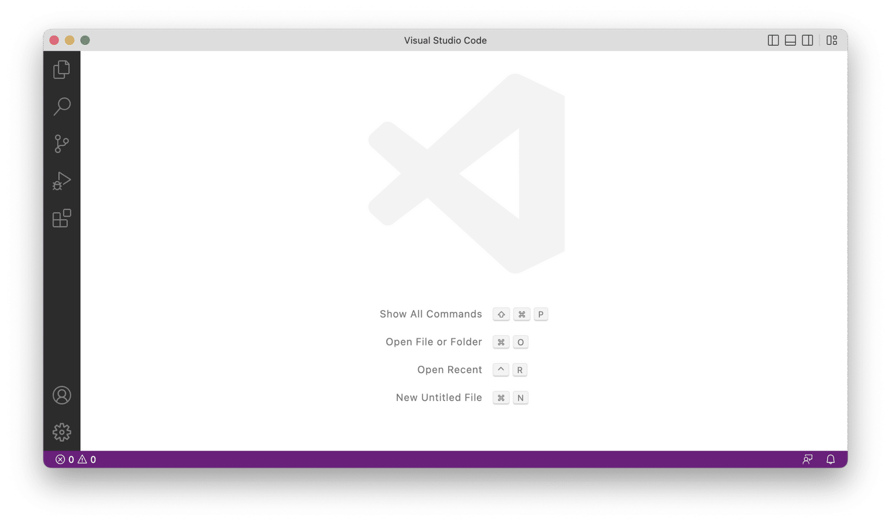
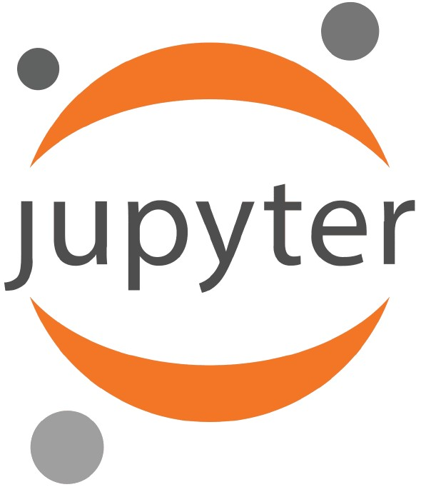
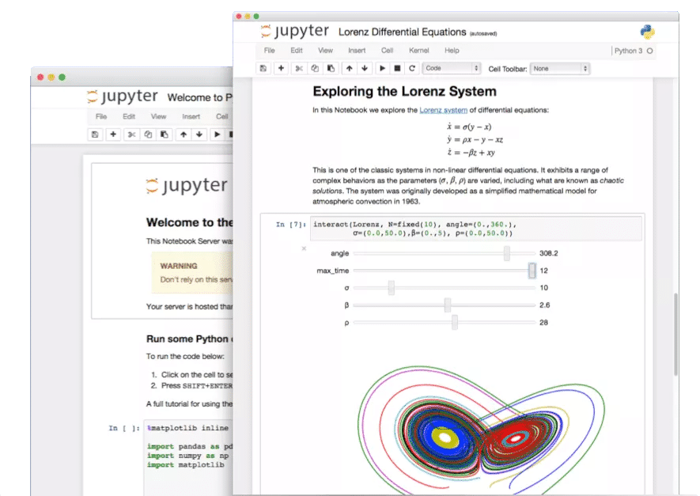
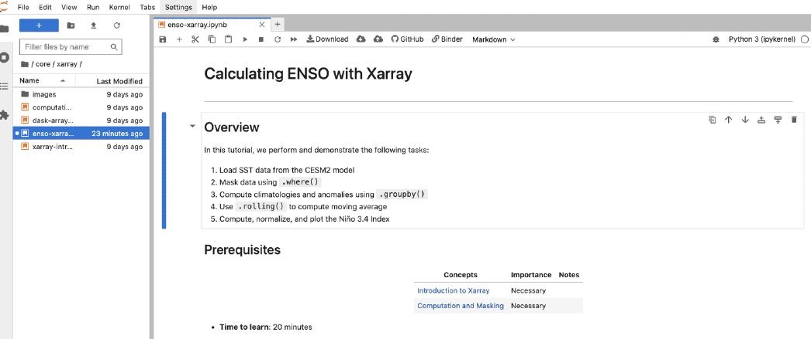

# Lección 4: Herramientas para código abierto

## Contenidos

-   [Introducción al código abierto](#introduccion-codigo-abierto)
-   [Herramientas para el control de versiones](#herramientas-control-versiones)
-   [Herramientas para editar código](#herramientas-editar-codigo)
-   [Herramientas adicionales](#herramientas-adicionales)
-   [Lección 4: Resumen](#leccion-4-resumen)
-   [Lección 4: Evaluación](#leccion-4-evaluacion)

## Descripción general

Esta lección nos presenta algunas herramientas útiles para trabajar con código abierto. Aprenderemos acerca de las diversas herramientas disponibles para desarrollar, almacenar y compartir código abierto, desde el control de versiones hasta software de edición de código hasta contenedores.

## Objetivos de aprendizaje

Al completar esta lección, deberías poder:

-   Explicar los beneficios del uso de herramientas para el desarrollo de código abierto.
-   Definir el control de versiones y comprender cómo favorece la colaboración en el desarrollo y la gestión del código.
-   Listar algunas herramientas para editar software y algunas de sus características.
-   Distinguir entre repositorios de software y archivos de software.

## Introducción al código abierto {#introduccion-codigo-abierto}

En la lección 3 aprendimos sobre herramientas útiles para trabajar con datos científicos. Ahora, proporcionaremos una visión general de las herramientas comúnmente utilizadas que nos ayudan a escribir y ejecutar código informático para explorar, analizar, y visualizar nuestros datos científicos. Más adelante en el Módulo 4, de Código Abierto, discutiremos en mayor detalle lo que significa hacer nuestro código abierto, y recorreremos los pasos para poder encontrar, crear y compartir código abierto.

Entender cómo trabajar con código científico es esencial en el panorama moderno de la investigación basada en datos. Las herramientas presentadas en esta lección abarcan una amplia gama de recursos diseñados para agilizar, mejorar y optimizar el proceso de desarrollo, mantenimiento y colaboración en el desarrollo de código para la investigación científica. Permiten crear código robusto y eficiente, en muchas ocasiones aprovechando el conocimiento colectivo de la comunidad de código abierto. En la búsqueda de la reproducibilidad y la transparencia, estas herramientas también pueden facilitar el intercambio y la difusión del código científico, fomentando la colaboración y asegurando que los fundamentos de la investigación científica permanezcan abiertos y accesibles para todas las personas.

### Precedente histórico para crear código abierto: sistema operativo Linux

¿La idea de escribir código abierto es un nuevo concepto? ¡No!

#### Contexto: Desarrollo del sistema operativo Linux

[HAZ CLIC PARA CONOCER MÁS](https://es.wikipedia.org/wiki/Historia_de_Linux)

-   Comenzado en 1991 por Linus Torvalds.
-   Casi inmediatamente liberado para ser examinado.
-   Muchos ojos → Muchos errores encontrados → Muchas correcciones.

## Herramientas para control de versiones

### Control de versiones {#herramientas-control-versiones}

El control de versiones es la práctica de rastrear y gestionar los cambios realizados en el código u otro tipo de archivos. Puede que nos resulte familiar si lo asociamos con el "Seguimiento de cambios" en programas como Microsoft Word. Esta es una forma de control de versiones, aunque no la más adecuada para trabajar con código. El control de versiones se considera una práctica estándar en la comunidad de desarrollo de software, y simplifica la gestión de código a través del tiempo.

La forma general de utilizar el control de versiones comienza inicializando una carpeta en tu plataforma informática con el sistema de control de versiones que estés utilizando. Un sistema de control de versiones rastrea automáticamente todos los cambios realizados por las personas que colaboran, y les permite trabajar sin conexión y volver más tarde con actualizaciones. Escribe el código como lo haces habitualmente en el editor de código que elijas. Una vez que se ha escrito código o se han realizado actualizaciones en el existente, se introducen los cambios en el sistema de control de versiones para crear una especie de "punto de control" al que se puede volver más tarde si es necesario. Luego agrega o actualiza más código, y vuelve a confirmar los cambios. Cada confirmación requiere que se añada un mensaje breve que permita describir resumidamente qué cambios se han hecho. Estos mensajes sirven como metadatos que aseguran que las personas colaboradoras y usuarias, e inclusive tú en el futuro, entiendan su proceso de desarrollo en un momento dado.

Esto puede sonar como un proceso simple y ¡en muchos sentidos lo es! Entonces, ¿por qué es tan importante? Especialmente cuando se trata de programar, la posibilidad de crear una captura en el tiempo de un fragmento de código puede resultar muy útil. Por ejemplo, puedes tener un fragmento de código que produce el resultado previsto, pero luego deseas añadir una nueva función. Se puede optar por copiar ese archivo de código para no perder el estado actual, y luego trabajar en un archivo nuevo. Esto puede resultar engorroso bastante rápido cuando existen varios archivos que son diferentes versiones de la misma pieza de código. O en lugar de crear un nuevo archivo, se puede escribir código para la nueva función directamente en el archivo original, pero ahora éste arroja errores cuando se intenta ejecutarlo, y es difícil recordar qué líneas se añadieron desde la última vez que el código se ejecutó sin errores. Usando el control de versiones, estos problemas se resuelven porque podemos volver al punto de control cuando el código se ejecutó correctamente, y así evitar la necesidad de crear múltiples copias para guardar el trozo de código original.

Hay muchas otras características de los sistemas de control de versiones, tales como el concepto de crear "ramas" que te permiten trabajar en nuevas actualizaciones de un trozo de código de forma independiente y paralela a la pieza original de código. Una rama es una desviación del código original, pero puede ser fusionada de nuevo en el código original cuando se desee. Todos estos conceptos son aún más útiles cuando se colabora con otras personas utilizando plataformas de control de versiones, una práctica de colaboración que veremos más adelante en esta lección.

### Tipos de control de versiones de software

Hay dos estilos principales de sistemas de control de versiones de software:

+-------------------------------------------------+---------------------------+
| CENTRALIZADO ☑                                  | DISTRIBUIDO (MÁS POPULAR) |
+=================================================+===========================+
| -   Copia única "principal" del código base     |                           |
|                                                 |                           |
| -   Debe interactuar con el servidor específico |                           |
|                                                 |                           |
| -   Ejemplo: Subversion (SVN)                   |                           |
+-------------------------------------------------+---------------------------+

+---------------------------------------------------------------------------------------+-----------------------------+
| CENTRALIZADO                                                                          | DISTRIBUIDO (MÁS POPULAR) ☑ |
+=======================================================================================+=============================+
| Control:                                                                              |                             |
|                                                                                       |                             |
| El sistema de cada persona que desarrolla puede conservar una copia del código base.\ |                             |
| Ejemplos:                                                                             |                             |
|                                                                                       |                             |
| -   Git                                                                               |                             |
|                                                                                       |                             |
| -   Mercurial                                                                         |                             |
+---------------------------------------------------------------------------------------+-----------------------------+

Utilizar un sistema distribuido de control de versiones como Git te da más flexibilidad.

**Ejemplo: Git**

El sistema de control de versiones más popular para el desarrollo de software es Git. Git es de código abierto y se utiliza habitualmente junto con sitios web de alojamiento de software como GitHub y GitLab (más información sobre ellos en la siguiente sección), que permiten colaborar y compartir código. También puede usarse en una computadora local cuando se escribe código propio. Git suele ejecutarse en la línea de comandos, pero también existen otras interfaces para utilizar Git, como *GitHub Desktop* y algunos editores de código que incluyen integración con Git (más información sobre esto más adelante).

Adaptación de <https://xkcd.com/1597/>

------------------------------------------------------------------------

Git es muy potente y ampliamente utilizado (según [una encuesta de Stack Overflow](https://survey.stackoverflow.co/2022), más del 87% de las personas que se dedican a desarrollar usan Git), pero eso no significa que sea fácil de aprender. Hay muchos buenos recursos para aprender Git (ver más abajo). Si al principio Git te resulta confuso, ¡es importante saber que muchas personas tienen dificultad para entenderlo! (¡incluso hay un cómic XKCD al respecto!). Para una formación en profundidad en Git, por favor mira la lección de *Software Carpentry* (en inglés), que se menciona a continuación: [Control de versiones con Git: Resumen y configuración (swcarpentry.github.io)](https://swcarpentry.github.io/git-novice/)

### Plataformas de control de versiones

Las plataformas de control de versiones, normalmente plataformas de alojamiento de software en la web, amplían la utilidad del control de versiones al permitir una ubicación centralizada para almacenar y colaborar en el código, junto con muchas otras funciones útiles para el desarrollo y el intercambio de código.

Algunos ejemplos de plataformas de control de versiones:

-   GitHub: plataforma basada en Git que permite la colaboración y el seguimiento del historial del código. Propiedad de Microsoft.
-   GitLab: una plataforma basada en Git que también ofrece funcionalidades DevOps y CI/CD.
-   BitBucket: una plataforma que puede alojar repositorios Git y Mercurial. Propiedad de Atlassian.

GitHub es una de las plataformas más populares, por lo que en el resto de esta sección daremos ejemplos de cómo utilizar GitHub. Es importante destacar que GitHub es donde se encuentran la mayoría de los paquetes de software de código abierto, por lo que, para aquellas personas que están interesadas en involucrarse más con la comunidad de software de código abierto, ¡GitHub es una herramienta esencial para aprender a usar!

**Ejemplo: GitHub**

GitHub es un repositorio de software en línea basado en la nube que se integra con Git y ofrece muchas otras características que ayudan en el desarrollo de código en colaboración, su evaluación y publicación. Antes de avanzar en algunas de estas características, es importante entender cómo GitHub actúa como un repositorio remoto cuando utiliza sistemas de control de versiones como Git.

Si volvemos a la idea general de utilizar sistemas de control de versiones, GitHub puede incorporarse como un repositorio remoto que aloja código. Después de crear un "punto de control" (*checkpoint*) en Git, es posible cargar a GitHub una copia de la fotografía actual del código. Hay varias razones para hacerlo:

-   Para que funcione como copia de seguridad de tu trabajo (ahora se almacena en un servidor remoto al que puedes acceder incluso si tu computadora muere).
-   Para compartir tu código con otra personas (más sobre esto más adelante en este curso).
-   Para que otros colaboren con tu código. Subiendo a GitHub, tu código puede ser accesible para otros que quieran añadir características.

Vamos a ampliar algunas de las herramientas de colaboración de GitHub. Algunas de estas características incluyen:

+------------------------------------+---------------------------------------------------------------------------------------------------------------------------------------------------------------------------------------------------------------------------------------------------------------------------------------------------------------------------------------------------------+
| Términos                           | Descripción/Definición                                                                                                                                                                                                                                                                                                                                  |
+====================================+=========================================================================================================================================================================================================================================================================================================================================================+
| Rastreo de problemas (*issues*)    | Realizar un seguimiento de las solicitudes de funciones, errores y otros tipos de actualizaciones a través de *GitHub Issues*. GitHub también permite utilizar etiquetas y asignar personas a las tareas para ayudar a organizarlas.                                                                                                                    |
+------------------------------------+---------------------------------------------------------------------------------------------------------------------------------------------------------------------------------------------------------------------------------------------------------------------------------------------------------------------------------------------------------+
| Foros de discusión del proyecto    | GitHub permite un foro de discusión en línea donde es posible hacer y responder preguntas y mantener discusiones comunitarias.                                                                                                                                                                                                                          |
+------------------------------------+---------------------------------------------------------------------------------------------------------------------------------------------------------------------------------------------------------------------------------------------------------------------------------------------------------------------------------------------------------+
| Seguimiento de contribuciones      | GitHub tiene una forma sencilla de llevar un registro de las contribuciones de código sugeridas (llamadas "*Pull Requests*") por diferentes personas.                                                                                                                                                                                                   |
+------------------------------------+---------------------------------------------------------------------------------------------------------------------------------------------------------------------------------------------------------------------------------------------------------------------------------------------------------------------------------------------------------+
| Herramientas de revisión de código | GitHub dispone de un amplio conjunto de herramientas para revisar y aceptar (o rechazar) las contribuciones de otros (o las tuyas propias), como los comentarios en línea y los cambios fácilmente visibles en archivos individuales.                                                                                                                   |
+------------------------------------+---------------------------------------------------------------------------------------------------------------------------------------------------------------------------------------------------------------------------------------------------------------------------------------------------------------------------------------------------------+
| Permisos personalizados            | Elige quién tiene autorización para actualizar el código. Esto ayuda a que tengas la seguridad de que solo quienes tienen permiso pueden actualizar el código que compartiste en GitHub, y también a que otras personas se sientan seguras para sugerir actualizaciones sin preocuparse de que puedan sobrescribir accidentalmente el código existente. |
+------------------------------------+---------------------------------------------------------------------------------------------------------------------------------------------------------------------------------------------------------------------------------------------------------------------------------------------------------------------------------------------------------+

Todas estas funciones son excelentes para permitir la colaboración asíncrona entre equipos. La mayoría de los paquetes científicos de código abierto utilizan GitHub para el desarrollo de su código principal. Ten en cuenta que hay muchas más funciones de GitHub en las que no profundizamos aquí y que permiten la colaboración, así como flujos de trabajo automatizados y mucho más. Para aprender más sobre GitHub, echa un vistazo a estas referencias:

-   [Cómo usar Git y GitHub -- Introducción para principiantes (freecodecamp.org)](https://www.freecodecamp.org/news/introduction-to-git-and-github/)
-   [Empezando con GitHub --- Pythia Foundations (projectpythia.org)](https://foundations.projectpythia.org/foundations/getting-started-github.html)

[Cita al Proyecto Pythia: <https://foundations.projectpythia.org/preamble/how-to-cite.html>]

### Resumen de las ventajas de utilizar el control de versiones y las plataformas de control de versiones

-   Posibilidad de retrotraer los cambios hasta cualquier punto
-   Facilita la colaboración con otras personas
-   Mantiene un directorio ordenado, sin necesidad de hacer varias copias de los archivos.
-   Proporciona un sistema de copia de seguridad específico para tu trabajo

## Herramientas para editar código {#herramientas-editar-codigo}

### Entornos de Desarrollo Integrado (IDEs)

Un Entorno de Desarrollo Integrado (IDE, por sus siglas en inglés) desempeña un papel importante en el desarrollo de código abierto ofreciendo un conjunto de herramientas a los investigadores, científicos, y desarrolladores para editar código. Se trata de una aplicación informática que agiliza todo el proceso de creación, comprobación y gestión de código para la investigación científica y el análisis de datos. Al proporcionar una plataforma todo en uno, un IDE permite a los investigadores escribir, depurar y optimizar el código de forma más eficiente, fomentando la colaboración y la reproducibilidad en proyectos científicos de código abierto.

En la ciencia abierta, donde la transparencia y la accesibilidad son primordiales, los IDEs suelen incorporar sistemas de control de versiones como Git para facilitar la colaboración y garantizar que un código base de investigación esté disponible para que otras personas lo utilicen y mejoren. Además, muchos IDEs se integran con herramientas de análisis y visualización de datos. Esto facilita el análisis y la interpretación de datos, contribuyendo en última instancia, al avance de las prácticas científicas de código abierto.

Si estuvieras en una sala con 10 personas que trabajan en desarrollo de software y le preguntaras a cada una cuál es su editor de código favorito, obtendrías muchas respuestas diferentes. En esta lección, repasaremos algunas de las opciones más conocidas.

**Edición de código fuente y kernels -- El valor de los IDEs y los kernels**

Los IDEs pueden aportar muchas herramientas útiles a tus trabajos. Ya no se trata únicamente de editar código. Los IDEs modernos y robustos pueden hacer la mayoría de las cosas que se listan aquí, y aún más. Se puede usar un IDE sin ejecutar en un kernel; se puede usar un kernel sin haber desarrollado código en un IDE. Sin embargo, pueden trabajar de la mano.

+-----------------------------------------+---------------+
| Entorno de Desarrollo Integrado (IDE) ☑ | Kernel        |
+=========================================+===============+
| Edición del código fuente:              |               |
|                                         |               |
| -   Resaltado sintáctico                |               |
|                                         |               |
| -   Avisos de error/*bugs*              |               |
|                                         |               |
| Extensiones                             |               |
|                                         |               |
| -   Depuradores (*debuggers*)           |               |
|                                         |               |
| -   Gestión de memoria                  |               |
|                                         |               |
| -   Control de versiones                |               |
|                                         |               |
| -   Creación de automatizaciones        |               |
+-----------------------------------------+---------------+

+----------------------------------------+---------------+
| Entorno de Desarrollo Integrado (IDEs) | Kernel ☑      |
+========================================+===============+
| -   Entorno de ejecución               |               |
|                                        |               |
| -   Como una máquina virtual           |               |
|                                        |               |
| -   Aísla el área de trabajo           |               |
|                                        |               |
|     -   Ajustes a medida               |               |
|                                        |               |
|     -   Fácilmente replicable          |               |
+----------------------------------------+---------------+

**Ejemplo de IDE: Visual Studio Code**

Visual Studio Code (o VS Code), el IDE más popular en la actualidad, ofrece numerosas funciones sin resultar engorroso.

Imagen: pantalla de inicio del VS Code donde se muestran las principales combinaciones de teclas para las funciones de "Mostrar todos los comandos"; "Abrir archivo o carpeta"; "Abrir reciente" y "Crear un nuevo archivo sin título".

-   Dispone de una opción de "modo oscuro" que es más agradable a la vista para largas sesiones de codificación.
-   Proporciona el resaltado de sintaxis y una ventana de terminal integrada.
-   También cuenta con una gran cantidad de complementos para conectarse a servidores, sistemas de control de versiones y resolución de problemas. Dispone de varios complementos que pueden analizar el código en busca de fallas, errores y contribuyen a que el equipo codifique con un "estilo" consistente. Esto facilita el mantenimiento del código en el futuro.
-   Si la línea de código contiene un error obvio, el IDE mostrará una marca roja, igual a como si se hubiera escrito algo mal en un documento de Word.

A continuación se muestra un ejemplo de un desarrollador que accidentalmente escribió un signo igual cuando debería haber escrito dos puntos. La captura de pantalla muestra que Visual Studio Code (*VS Code*) detectó el error, y cuando el desarrollador pasó el cursor sobre la línea roja ondulada, VS Code explicó cuál era el error (*colon expected*) y ofreció llevarlo a una documentación adicional.

Otra característica útil en VS Code (así como en muchos otros editores de código) es Git Integration. En lugar de usar una ventana de Terminal, ¡puedes hacer unos pocos clics e integrar fácilmente Git en tu flujo de trabajo!

Desde el VS Code puedes:

-   Ver fácilmente las modificaciones en tu código.
-   Crear una rama.
-   Subir tus cambios directamente a GitHub.
-   Descargar cambios de otros miembros del equipo a tu sistema local.

**Ejemplo de IDE: Rstudio -- IDE**

Mientras que VS Code es un entorno de desarrollo integrado (en inglés, *Integrated Development Environment, IDE*) más genérico donde puedes utilizar complementos para especializarlo, también existen IDEs, como RStudio, que tienen características especializadas para lenguajes específicos desde el principio.

Los investigadores que realizan análisis estadísticos tienden a utilizar los lenguajes de programación de R y Python. RStudio tiene herramientas integradas para ese mismo propósito, incluyendo la visualización de datos.

### Editores de texto plano para programar

La mayoría de los ordenadores portátiles o de escritorio que ejecutan sistemas operativos estándar (Windows, MacOS, Linux) tienen múltiples editores de texto plano preinstalados que se pueden utilizar para programar. Es beneficioso saber cómo utilizar al menos uno, porque hace que la edición de programas y archivos sea un proceso rápido.

+---------------------------------------------------------------------+----------------------------------------------------------------------+
| **VENTAJAS**                                                        | **DESVENTAJAS**                                                      |
+=====================================================================+======================================================================+
| -   Lígeros                                                         | -   No hay complementos que ayuden a encontrar fallas, errores, etc. |
|                                                                     |                                                                      |
| -   Muchos se distribuyen nativamente con el sistema operativo (SO) | -   Pueden no tener resaltado de sintaxis                            |
+---------------------------------------------------------------------+----------------------------------------------------------------------+

### Cuadernos Computacionales

Un cuaderno computacional se refiere a un entorno de computación virtual e interactivo que combina la ejecución de código, la documentación y la visualización de datos en una sola interfaz. Estos cuadernos son ampliamente utilizados en los campos de ciencias de datos y programación. Ejemplos populares son Jupyter Notebooks y R Notebooks. Permiten a los usuarios escribir y ejecutar código paso a paso, proporcionando una plataforma eficiente para el análisis de datos, la investigación y la programación colaborativa, con el beneficio añadido de integrar texto enriquecido (incluyendo ecuaciones), imágenes y gráficos para una documentación y comunicación claras.

**Ejemplo: Jupyter Notebook y JupyterLab**

Jupyter Notebook es una aplicación web de código abierto ampliamente utilizada para la creación de documentos computacionales. Pero antes de sumergirnos en Jupyter Notebook, queremos dejar en claro que Jupyter Notebook es una de las muchas plataformas del ecosistema de Jupyter:

-   Jupyter Notebook -- un intérprete de comandos de lenguaje contenido para programación interactiva, que muestra la salida en línea con las entradas
-   JupyterLab -- una interfaz de usuario integrada en el navegador que muestra múltiples ventanas para cuadernos de notas, terminales y edición de código
-   JupyterHub -- software intermediario (*middleware*) para ejecutar entornos de computación interactivos compartidos, incluyendo JupyterLab y Jupyter Notebook, en infraestructura de computación compartida (como en la Nube)

Usaremos Jupyter Notebook como un ejemplo de cuaderno computacional y discutiremos cómo JupyterLab está relacionado con Jupyter Notebook. La siguiente sección sobre plataformas de computación discutirá sobre JupyterHub.

Esta captura de pantalla muestra un ejemplo de un Jupyter Notebook que integra texto enriquecido (con encabezados y enlaces), ecuaciones, código y la salida interactiva de esas líneas de código, incluyendo un gráfico. Esta captura de pantalla deja claro por qué se llama cuaderno computacional - se asemeja a un cuaderno de laboratorio que puedes haber escrito manualmente en la escuela.

[Proyecto Jupyter \| Inicio](https://jupyter.org/)

------------------------------------------------------------------------

Jupyter admite muchos lenguajes de programación. Un dato curioso: el nombre "Jupyter" se refiere a los tres idiomas principales admitidos por Jupyter: Julia, Python, y R.

JupyterLab es un entorno de desarrollo interactivo basado en un navegador compatible con Jupyter Notebook y esta diseñado en un entorno más flexible que permite muchas características útiles. Una de estas características es la integración con Git, como vimos para otros IDEs como Visual Studio Code.

Dado que Jupyter Notebook permite integrar código con visualizaciones y texto, puede servir como herramienta para llevar a cabo proyectos de investigación y crear documentos computacionales fácilmente compartibles para la educación, la colaboración o la comunicación científica. Con capacidades de texto enriquecido, como el uso de encabezados, cursivas, enlaces y muchas más, puedes crear un documento legible que contenga código ejecutable. Estas son sólo algunas de las razones por las que JupyterLab y Jupyter Notebook son ampliamente utilizados en muchas disciplinas, incluyendo investigación computacional y ciencias de datos.

#### Para más información sobre los productos de Jupyter y su comunidad, consulta su sitio web.

[HAZ CLIC PARA APRENDER MÁS (*en inglés*)](https://jupyter.org/)

Si quieres sumergirte en el tema, consulta la lección "Primeros pasos con Jupyter" del Proyecto Pythia, orientada a científicos sin conocimientos previos de programación.

### Actividad 4.1: Ejecuta Jupyter Notebook desde tu navegador

Usemos un ejemplo del Proyecto Pythia para mostrar cómo los cuadernos computacionales pueden ser usados en la ciencia. Proyecto Pythia es un centro educativo para la comunidad geocientifica. Tienen algunos grandes recursos de aprendizaje y ejemplos de cuadernos de investigación, desarrollados y mantenidos por la comunidad y de libre acceso.

En esta actividad, ejecutarás código Python ya escrito en un Jupyter Notebook desde tu navegador para hacer gráficos relacionados con el fenómenos El Niño-Oscilación del Sur (o ENOS). Utilizarás el paquete de software de código abierto llamado Xarray para leer los datos de temperatura de la superficie del mar de un modelo climático global (Modelo Comunitario del Sistema Tierra, en ingles *Community Earth System Model, CESM*), y crear algunas visualizaciones de eventos ENOS a lo largo de los últimos 20 años. El objetivo es recrear el gráfico siguiente para aproximadamente los últimos 20 años. Esta figura muestra los años y la magnitud de los eventos de El Niño en rojo y de los eventos de La Niña en azul.

Fuente: Adaptado de <https://climatedataguide.ucar.edu/climate-data/nino-sst-indices-nino-12-3-34-4-oni-and-tni>

------------------------------------------------------------------------

Sigue estos pasos:

1.  Navega a la lección "[Calculating ENSO with Xarray (Calculando ENOS con Xarray)](https://foundations.projectpythia.org/core/xarray/enso-xarray.html)"
2.  En la esquina superior derecha, pasa el ratón sobre el icono del cohete y haz clic en "Binder". Esto abrirá la lección como un Jupyter Notebook ejecutable que corre en la Nube. Ten en cuenta que el Cuaderno Computacional puede tardar varios minutos en configurarse. 
3.  Después de cargar el Cuaderno Computacional, deberías ver algo como lo siguiente. Nota -- ¡Esto realmente utiliza la vista de JupyterLab! 
4.  Puedes tomarte un poco de tiempo para repasar el texto y el código del Cuaderno Computacional, pero ten en cuenta que esta lección presupone muchos conocimientos previos, por lo que está bien si no lo entiendes todo. ¡Aún puedes apreciar los bonitos gráficos que estás a punto de hacer!
5.  ¡Ahora estás listo para ejecutar el Cuaderno Computacional! Para hacer eso, puedes ir al menú "Run" (*Ejecutar*) en la parte superior izquierda de la ventana de JupyterLab y elegir "Run All Cells" (*Ejecutar todas las celdas*): 
6.  Esto solo debería tomar unos pocos segundos, y si te desplazas hacia abajo, puedes ver un par de visualizaciones bonitas que acabas de crear: *Usa los botones "\<" y "\>" para navegar entre las imágenes.*

7.  Tómate algo de tiempo para mirar un poco más de cerca el Cuaderno Computacional. Verás que hay texto (incluyendo encabezados, enlaces ¡e incluso una tabla justo al principio!), código y figuras integradas de manera conjunta. Este es sólo un ejemplo de cómo los científicos utilizan cuadernos computacionales para su investigación.

Puedes examinar más recursos de aprendizaje del Proyecto Pythia Python a través de su [Libro de Fundamentos](https://foundations.projectpythia.org/landing-page.html), puedes ver ejemplos más avanzados de flujos de trabajo de investigación en geociencias que utilizan Cuadernos Computacionales (que ellos llaman "[CookBooks o Guías Rapidas](https://cookbooks.projectpythia.org/)") para ver más ejemplos de cómo se utilizan los Jupyter Notebooks en la ciencia. Si te interesan las geociencias, ¡puedes contribuir con tu propio Jupyter Notebook, en el caso de que tengas uno que quieras compartir!

### Plataformas de cómputo

Usamos el término "plataforma de cómputo" para referirnos a la infraestructura computacional utilizada para ejecutar código. Existen muchas plataformas de cómputo diferentes para elegir, cada una con sus ventajas y desventajas. A continuación se ofrece una descripción general de tres opciones de plataformas:

#### Computadora personal (por ejemplo, una computadora portátil)

Ventajas:

-   Conveniente - puede ejecutar cálculos cuando y donde tu elijas
-   Puedea adaptar el entorno de software para que sea exactamente lo que necesitas
-   No tienes que compartir tus recursos informáticos

Desventajas:

-   Tiene potencia computacional limitada
-   Requiere descargar datos y software

#### Computación de alto rendimiento (HPC, por sus siglas en inglés)

Ventajas:

-   Alto poder computacional

Desventajas:

-   Por lo general, es propiedad de una institución en particular y está administrada por ella; es posible que debas estar afiliado a esa institución para obtener acceso a su HPC
-   Es posible que tengas que esperar mucho tiempo para ejecutar el código, ya que normalmente se comparte entre muchas personas y grupos
-   Se necesita fondos considerables para construir una HPC

#### Computación en la nube (Cloud Computing)

Ventajas:

-   Potencia computacional extremadamente alta
-   Tiempos de espera mínimos para ejecutar el código
-   Normalmente accesible para cualquier persona con conexión a Internet
-   Opciones de precios bajo demanda: solo tienes que pagar por lo que usas

Desventajas:

-   Alto costo por cálculo
-   Falta de transparencia en los costos - Por ejemplo leer datos de diferentes regiones de la nube puede costar mucho dinero, pero no siempre está claro en qué región se encuentran los datos y se realizn los cálculos
-   Puede requerir algún conocimiento adicional sobre cómo funciona el cómputo en la nube

Ejemplos de proveedores en la Nube:

-   Amazon Web Services (AWS)
-   Google Cloud
-   Microsoft Azure

Muchos proveedores de datos, especialmente de grandes conjuntos de datos, están migrando sus datos a la Nube para aumentar la accesibilidad y aprovechar la gran capacidad de almacenamiento que ésta proporciona. Por ejemplo, NASA Earthdata (que alberga todos los datos de ciencias terrestres de la NASA) ahora utiliza AWS para almacenar la mayoría de sus datos. Muchos proveedores de Nube también tienen una serie de conjuntos de datos disponibles públicamente, incluidos [Google Cloud](https://cloud.google.com/storage/docs/public-datasets?hl=es-419#%3A~%3Atext%3DAvailable%20public%20datasets%20on%20Cloud%20Storage%201%20ERA5%3A%2Cfrom%202015%20through%20the%20present.%20...%20More%20items) y [AWS](https://registry.opendata.aws/).

Al elegir una plataforma de cómputo, es importante considerar dónde se guardan los conjuntos de datos y que tan grandes pueden ser. Por ejemplo, cuando se trabaja con conjuntos de datos pequeños, suele ser preferible utilizar una computadora personal, ya que la descarga de datos llevará un tiempo mínimo y probablemente no se necesiten grandes recursos informáticos. Sin embargo, cuando se trabaja con grandes conjuntos de datos, es mejor minimizar la cantidad de descarga y carga de datos ya que esto puede consumir cantidades significativas de tiempo y ancho de banda de internet. Si tus grandes conjuntos de datos ya están almacenados en la nube, es mejor utilizar recursos de la nube, al igual que para el cálculo y el uso de HPC.

## Herramientas adicionales {#herramientas-adicionales}

### Repositorios de software vs archivos

Los repositorios y archivos de software proporcionan ubicaciones centralizadas para almacenar y compartir software. Existen algunas diferencias clave importantes entre ellos, los cuales analizaremos en esta sección.

Un repositorio de software es un espacio dinámico y colaborativo donde los desarrolladores trabajan en el código más reciente, lo que lo convierte en el corazón del desarrollo continuo del software y del control de versiones. Alberga bases de código mantenidas activamente, lo que fomenta la colaboración y la mejora continua, a menudo impulsada por la comunidad.

Por el contrario, un archivo de software es un almacenamiento estático donde se guardan versiones de software estables y minuciosamente probadas. Los usuarios acceden a estos archivos para obtener versiones confiables de software, asegurando estabilidad y confiabilidad en sus aplicaciones. Comprender la diferencia entre estos dos es crucial para un desarrollo y distribución de software eficaces.

Git/GitHub y Bitbucket son opciones populares para repositorios de software.

+------------------------------------------------------------------------------------------------------------------------------------------------------------------------------------------------------------------------------------------------------------------------------------------------------------------------------------------------------------------------------------------------------------------------------------------------------------------------------------------------------------------------------------------------------------------------------------------------------------------------------------------------------------------------------------------------------------------------------------------------------------------------------------------------------------------------------------------------------------------------------------------------------------------------------------------------------------------------------------------------------------------------------------------------------------------------------------------------------------------------------------------------------------------------------------------------------------------------------------------------------------------------------------------------------+
| Repositorio ☑ \| Archivo \| ====================================================================================================================================================================================================================================================================================================================================+=========+ - Es una ubicación para compartir código. \| \| \| \| - A menudo utiliza sistemas de control de versiones como Git, Mercurial y Subversion para realizar un seguimiento de los cambios \| \| \| \| - Por lo general, contiene la última versión de desarrollo (a veces denominada "maestra", *master*, o "troncal", *trunk*) de un proyecto de software, en la que los desarrolladores pueden trabajar activamente. \| \| \| - Se utiliza para el desarrollo colaborativo de software y para compartir código entre un equipo o una comunidad de desarrolladores. \| \| \| \| **Nota importante:** Un repositorio no es más que un lugar para alojar código. Hoy en día, un sistema de control de versiones y un repositorio suelen ser la misma cosa. Es importante entender la distinción. Sin embargo, algunos sitios web son puramente buzones (*dropboxes*) para archivos ejecutables o zip de código fuente. \| \| |
+------------------------------------------------------------------------------------------------------------------------------------------------------------------------------------------------------------------------------------------------------------------------------------------------------------------------------------------------------------------------------------------------------------------------------------------------------------------------------------------------------------------------------------------------------------------------------------------------------------------------------------------------------------------------------------------------------------------------------------------------------------------------------------------------------------------------------------------------------------------------------------------------------------------------------------------------------------------------------------------------------------------------------------------------------------------------------------------------------------------------------------------------------------------------------------------------------------------------------------------------------------------------------------------------------+

+--------------------------------------------------------------------------------------------------------------------------------------------------------+-----------+
| Repositorio                                                                                                                                            | Archivo ☑ |
+========================================================================================================================================================+===========+
| -   A menudo se utiliza para la distribución y conservación a largo plazo de software.                                                                 |           |
|                                                                                                                                                        |           |
| -   Un sistema de almacenamiento que contiene versiones estables y específicas de software, paquetes binarios compilados o versiones de código fuente. |           |
|                                                                                                                                                        |           |
| -   Los usuarios suelen descargar software de un archivo para instalarlo y utilizarlo en sus sistemas.                                                 |           |
+--------------------------------------------------------------------------------------------------------------------------------------------------------+-----------+

**Contenedores**

Un contenedor (*container*) de software es un paquete independiente y ejecutable que incluye todo lo necesario para ejecutar una pieza de software, e incluye el código, el tiempo de ejecución, las herramientas del sistema, la configuración del entorno y las bibliotecas. Los contenedores son entornos aislados que contienen la aplicación y todo lo necesario para ejecutarla, lo que garantiza coherencia y portabilidad entre diferentes entornos informáticos. Un contenedor es una herramienta útil que puede proporcionar eficiencia, escalabilidad y facilidad de implementación. Algunos ejemplos de herramientas de contenedores ampliamente utilizadas son Kubernetes, Docker, y Apache Mesos.

### Actividad 4.2: Relaciona las herramientas

Relaciona cada elemento con su descripción:

+---------------------------------------+--------------------------------------------------------------------------------------------------------------------+
| Entorno de desarrollo integrado (IDE) | Editor de texto mejorado para código. Ayuda a identificar la sintaxis y las construcciones o desarrollos de código |
+---------------------------------------+--------------------------------------------------------------------------------------------------------------------+
| Archivo de software                   | Almacenamiento estático donde se guardan versiones de software estables y completamente probadas.                  |
+---------------------------------------+--------------------------------------------------------------------------------------------------------------------+
| Plataforma de control de versiones    | Herramienta que ayuda a los desarrolladores de software a gestionar y realizar un seguimiento de los cambios     |
+---------------------------------------+--------------------------------------------------------------------------------------------------------------------+

## Lección 4: Resumen {#leccion-4-resumen}

En esta lección has aprendido:

-   La utilidad de las herramientas digitales que gestionan, fomentan la colaboración y albergan código abierto.
-   Cómo los sistemas de control de versiones como Git y plataformas como GitHub pueden aumentar la colaboración y la gestión del código.
-   Algunas herramientas comunes para editar código abierto, incluidos entornos de desarrollo integrados (IDEs) como Visual Studio Code y Jupyter Notebooks.
-   La diferencia entre repositorios y archivos de software, y también cómo los contenedores de software pueden ayudar a compartir y reproducir código.

## Lección 4: Evaluación {#leccion-4-evaluacion}

Responde las siguientes preguntas para poner a prueba lo que has aprendido hasta ahora.

*Pregunta*

**01/03**

¿Cuál de las siguientes NO es una ventaja de utilizar plataformas de control de versiones?

-   Capacidad para realizar un seguimiento de los cambios que se han realizado
-   No se puede volver hacia atrás para hacer cambios
-   Facilidad de colaboración en el código, con otros
-   Directorio limpio y ordenado: no es necesario realizar varias copias de archivos
-   Un sistema de respaldo muy específico para tu trabajo

*Pregunta*

**02/03**

Un entorno informático interactivo que combina ejecución de código, documentación y visualización de datos en una única interfaz se conoce como:

-   Plataforma de control de versiones
-   Repositorio de software
-   Cuaderno computacional
-   Contenedor (*container*)

*Pregunta*

**03/03**

Un repositorio de software y un archivo de software son lo mismo.

-   Verdadero
-   Falso
