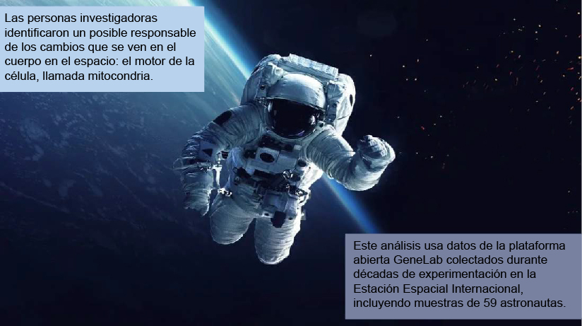
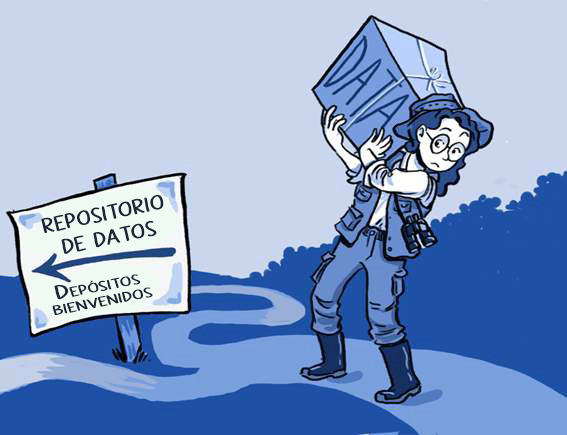
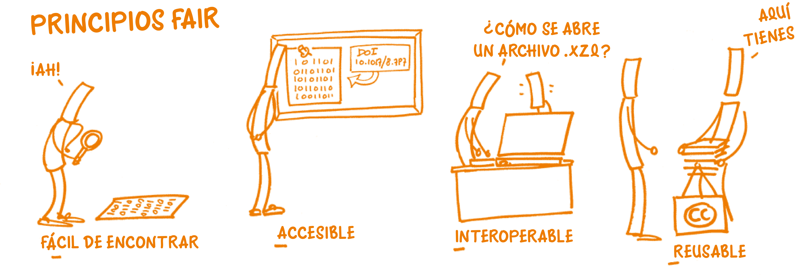
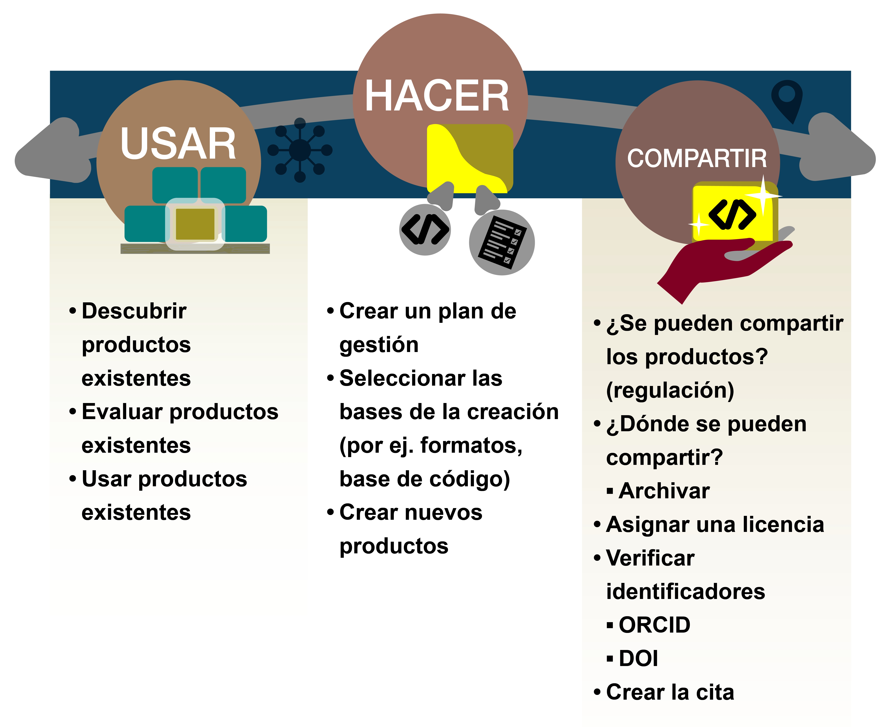

# Lección 1: Introducción a los Datos Abiertos

## Contenidos

- [Descripción general](#descripci%C3%B3n-general)
- [Objetivos de aprendizaje](#objetivos-de-aprendizaje)
- [Introducción](#introducci%C3%B3n)
- [Definición y Consideraciones de Datos Abiertos](#definici%C3%B3n-y-consideraciones-de-datos-abiertos)
- [Beneficios de los Datos Abiertos](#beneficios-de-los-datos-abiertos)
- [Desafíos de los Datos Abiertos](#desaf%C3%ADos-de-los-datos-abiertos)
- [Aplicar los principios FAIR](#aplicar-los-principios-fair)
- [Planificar la apertura: El sistema Usar, Hacer, Compartir para los Datos Abiertos](#planificar-la-apertura-el-sistema-usar-hacer-compartir-para-los-datos-abiertos)
- [Lección 1: Resumen](#lecci%C3%B3n-1-resumen)
- [Lección 1: Evaluación](#lecci%C3%B3n-1-evaluaci%C3%B3n)

## Descripción general

En esta lección se definen los Datos Abiertos, sus beneficios y las prácticas que permiten que los datos sean abiertos. Además, la lección profundiza en el modo en que los principios FAIR se aplican a los Datos Abiertos, así como el papel crítico de los metadatos. Concluye con una breve discusión sobre cómo planificar los Datos Abiertos en el flujo de trabajo científico, y las tareas guiadas por el sistema «usar, hacer, compartir».

## Objetivos de aprendizaje

Al finalizar esta lección deberías ser capaz de:

- Definir qué son los Datos Abiertos y cómo los principios FAIR y CARE se utilizan para guiar las prácticas de Datos Abiertos
- Enumerar los beneficios de los Datos Abiertos
- Explicar cómo el sistema «usar, hacer y compartir» puede ser usado para modificar el plan científico para Datos Abiertos

## Introducción

Los datos hacen avanzar a la ciencia. Estos se almacenan electrónicamente para permitir su posterior análisis e investigación. Las tecnologías digitales integradas en cada aspecto de la investigación científica moderna han llevado a la producción de grandes cantidades de datos.

Los Datos Abiertos son un pilar esencial de la Ciencia Abierta. En muchos sentidos, los Datos Abiertos son una expansión natural de la Ciencia Abierta más allá de las publicaciones académicas, para incluir los resultados digitales de la investigación. Así se han convertido en una parte integral del movimiento de la Ciencia Abierta ya que los Datos Abiertos permiten que todas las personas vean, usen y verifiquen resultados publicados. Los Datos Abiertos hacen que la ciencia sea más accesible, inclusiva y reproducible. Para que esto funcione, es necesario que los datos estén disponibles en formatos que otras personas puedan usar, incluir metadatos que describan a los datos y contar con documentación útil. Una vez disponibles, los Datos Abiertos facilitan nuevos descubrimientos y usos.

### Ejemplo: ¿Cómo vivirán los humanos en la Luna o viajarán a Marte si el entorno espacial amenaza la salud humana de múltiples maneras?

Pérdida de tejido óseo, vértigo, anemia, atrofia muscular, mayor riesgo de cáncer; estos son solo algunos de los efectos secundarios de viajar al espacio para los humanos. Para estudiar estos riesgos de viajar al espacio para la salud humana, las personas que investigan en el mundo usan la plataforma GeneLab de Código Abierto de la NASA. GeneLab recopila grandes cantidades de datos de biología espacial sobre muestras humanas y de organismos modelo expuestos a condiciones de viajes espaciales. Sus repositorios digitales y físicos incluyen información celular, sobre ADN, ARN y proteínas. Al ser una plataforma abierta, los datos de GeneLab son públicamente accesibles y sin ningún costo.

**Ejemplo:** Usando datos biológicos de astronautas de GeneLab, [la comunidad científica recientemente encontró](https://www.nature.com/articles/s41576-020-00322-8) cuál puede ser el motivo de muchos de los efectos secundarios del viaje al espacio: el estrés mitocondrial.

[Mira el Video](https://www.youtube.com/watch?v=BPVSErzNtME\&embeds_referring_euri=https%3A%2F%2Fopenscience101.org%2F\&feature=emb_imp_woyt)

Las mitocondrias son componentes de nuestras células que afectan a la función respiratoria y energética. Este descubrimiento podría ser crucial para superar los problemas relacionados a la salud humana en el espacio. Comprender el origen de este problema podría ayudar a la comunidad científica a desarrollar soluciones y terapias para mantener a las personas sanas en el espacio durante períodos de tiempo más largos.

## Definiciones y consideraciones de los Datos Abiertos

### ¿Qué son los datos?

La Comunidad _The Turing Way_. Esta ilustración fue creada por Scriberia junto con la comunidad de _The Turing Way_, utilizada bajo una licencia CC-BY 4.0. DOI: 10.5281/zenodo.3332807

---

Los datos son cualquier tipo de información que se recolecte, observe o cree en el contexto de una investigación. Hoy en día, los datos se almacenan cada vez más en formato digital.

Los datos incluyen:

**Datos primarios (crudos)**: Los datos primarios son los recolectados o creados directamente por las personas que investigan. Las preguntas de investigación guían la recopilación de los datos. Por lo general, quien investiga formulará una pregunta, desarrollará una metodología y comenzará a recopilar los datos. Algunos ejemplos de datos primarios incluyen:

- Respuestas a entrevistas, cuestionarios y encuestas.
- Datos adquiridos a partir de mediciones registradas, incluyendo datos de teledetección.
- Los datos obtenidos a partir de muestras físicas y especímenes, que constituyen la base de muchos estudios.
- Los datos generados a partir de modelos y simulaciones.

**Datos secundarios y procesados**: Los datos secundarios son los que utiliza una persona distinta de la que los recopiló o generó. A menudo, esto puede incluir datos que han sido procesados a partir de su estado bruto para ser más fácilmente utilizables por otras personas.

**Datos Publicados**: Los datos publicados son aquellos compartidos para abordar un estudio científico en particular y/o para uso general. Aunque los datos publicados pueden coincidir con los tipos de datos primarios y secundarios, hemos incluido los «datos publicados» como categoría propia para destacar que lo ideal es que estos conjuntos de datos estén bien documentados y sean fáciles de utilizar.

**Metadatos**: los metadatos son un tipo especial de datos que describen otros datos u objetos (por ejemplo, muestras). Normalmente se utilizan para proporcionar información estándar sobre un conjunto de datos con el fin de facilitar su uso e interpretación.

El término "Datos Abiertos" se define en el manual de Datos Abiertos de la Open Knowledge Foundation (Fundación Conocimiento Abierto):

"Los Datos Abiertos son datos que cualquiera puede usar, reusar y redistribuir libremente, sujetos únicamente y como máximo al requisito de atribuir y compartir por igual".

**Manual de Datos Abiertos de la Open Knowledge Foundation**

---

Al hablar de datos en el contexto de este módulo, nos centramos en los datos que estás preparando para compartir, como los asociados a una publicación científica, sin importar de qué tipo de datos se trate. Si bien podrías compartir (y muchas personas lo hacen) libretas de laboratorio, análisis preliminares, productos de datos intermedios, borradores de publicaciones científicas, planes para investigaciones futuras y otras cosas similares, estos normalmente no son requeridos por agencias o instituciones financiadoras y por lo tanto no serán el foco de este módulo.

Según un [artículo publicado sobre reuso de datos](https://www.ncbi.nlm.nih.gov/pmc/articles/PMC9542848/), quienes investigan buscan sobre todo datos "completos, fáciles de obtener, fáciles de manipular y creíbles". Para que se cumplan estos criterios los datos deberían:

- Estar suficientemente descritos con los metadatos adecuados, lo que afecta en gran medida su reuso. No hay una estructura única para los metadatos ya que su recopilación estará guiada por tus datos.
- Disponer de la información adecuada sobre licencias, derechos de autor y citas.
- Tener información de acceso apropiada.
- Ser fáciles de encontrar en una fuente acreditada o de confianza.
- Estar acompañados con un historial de cambios y versiones.
- Incluir detalles de todos los pasos de su procesamiento.

No todos los datos pueden compartirse o compartirse con toda esta información. Hay diferentes razones por las que puede no ser posible. Sin embargo, cuanta más información se comparta sobre los datos, mayor será su fiabilidad y reuso.

## Beneficios de los Datos Abiertos

Los datos son la base de casi toda la ciencia. Compartir abiertamente los datos con otras personas facilita la reproducibilidad, la transparencia, la validación, el reuso y las colaboraciones. Los datos juegan un rol muy importante en nuestro día a día. Los Datos Abiertos, en particular, tienen un papel clave. Estos datos son comunes en nuestra sociedad y probablemente ya te hayas beneficiado de ellos en algún momento. Los impactos de los Datos Abiertos incluyen facilitar:

---

**Un bien mayor**: Los datos desempeñan un papel importante en nuestra vida cotidiana. Los Datos Abiertos, en particular, juegan un rol clave. Si hace una pausa y piensa en ello, puede darse cuenta de que los Datos Abiertos no solo son comunes en nuestra sociedad, sino que tú mismo te hayas beneficiado y hayas usado Datos Abiertos.

Cada país o territorio a menudo proporciona Acceso Abierto a una variedad de información socioeconómica sobre la población, la comunidad y los negocios en su jurisdicción. Estos datos a menudo se llaman datos de encuestas censales y pueden incluir estadísticas agregadas de género, etnicidad, educación, ingresos y datos de salud de una comunidad. Muchas veces, estos datos se utilizan para entender la composición de un vecindario local y son críticos para las decisiones informadas sobre la asignación de recursos para asegurar la calidad de vida de la comunidad.

#### Ejemplo: los Datos Abiertos ayudan a proporcionar información que salva vidas frente al cambio climático

El cambio climático plantea un riesgo importante para nuestra vida diaria y ha sido responsable de la intensificación de las sequías, el aumento de las inundaciones y los devastadores incendios en todo el mundo. Por lo tanto, los Datos Abiertos son fundamentales para proporcionar información vital para adaptarse al cambio climático y ayudar a evaluar los riesgos climáticos en el lugar donde vivimos. Las agencias gubernamentales han estado proporcionando acceso público a información meteorológica y climática a largo plazo durante décadas. Por ejemplo, la Administración Nacional Oceánica y Atmosférica (National Oceanic and Atmospheric Administration, NOAA) en los Estados Unidos, la Oficina Meteorológica del Reino Unido (Met Office) y el Centro Europeo para Predicciones Meteorológicas a Plazo Medio (ECMWF). Un ejemplo reciente es el riesgo de inundación e incendio en los Estados Unidos desarrollado por una organización sin fines de lucro [First Street Foundation.](https://firststreet.org/)

**Cambio de políticas**

#### Ejemplo: Predicción de los efectos del cambio climático en las comunidades árticas

Los Datos Abiertos pueden llevar al cambio de políticas que impacten directamente en la vida de las comunidades, como aquellas destinadas a sufrir primero los lentos cambios en el Ártico. [Un estudio (en inglés)](https://www.nature.com/articles/s41467-018-07557-4) publicado en Nature empleó [OpenStreetMap](https://www.openstreetmap.org/about) datos para ayudar a producir mapas de los cambios ambientales proyectados en el Ártico. Estos mapas ayudaron a enfatizar la necesidad de políticas basadas en la adaptación a nivel comunitario y regional para evitar el estancamiento del cambio a la luz de una situación que empeora repentina y dramáticamente impulsada por el cambio climático.

**Respuesta global de emergencia**

#### Ejemplo: COVID-19

La pandemia COVID-19 demostró al mundo, en tiempo real, cómo el movimiento colectivo de las personas que investigan compartiendo sus datos, [como el intercambio de datos del genoma del coronavirus](https://www.nature.com/articles/d41586-021-00305-7#:~:text=Other%20researchers%20say%20that%20restrictions,while%20protecting%20data%20providers), puede conducir a una cantidad sin precedentes de descubrimientos en un período de tiempo relativamente corto. Esto afectó directamente los esfuerzos radicales de desarrollo de vacunas y al control oportuno de la infección COVID-19. Estos conocimientos seguirán dando sus frutos y esta investigación estimulará desarrollos futuros.

El intercambio de datos tiene muchos beneficios y puede ayudar al acceso al conocimiento. Sin embargo, es importante considerar de dónde proceden los datos, quién debería tener voz y voto en su interpretación y uso, y cómo los datos pueden ser compartidos de forma responsable.

**Ciencia Ciudadana**

#### Ejemplo: Pruebas de calidad del agua en Beirut

Una persona que hace ciencia ciudadana es una  persona (que puede ser aficionada a la ciencia) que colabora con investigaciones profesionales para ayudar a recopilar o interpretar datos en una escala espacial y temporal más amplia de la que el equipo investigador podría lograr sin colaboración. Esta externalización de la responsabilidad favorece que el público en general participe en actividades científicas que, en última instancia, los benefician y permiten que la investigación se realice en una escala mayor de la que podría ser posible con solo con personas investigadoras. La Ciencia Ciudadana está ganando popularidad y reconocimiento como una valiosa contribución a los avances científicos.

Por ejemplo, se reclutaron personas voluntarias en Beirut de 50 aldeas para ayudar a probar la calidad del agua, fuente: capítulo 5 de [Contextualizando la apertura: situando la Ciencia Abierta (en inglés)](https://idrc-crdi.ca/en/book/contextualizing-openness-situating-open-science).

Estas personas voluntarias se formaron para realizar las pruebas. No solo se recogieron datos para informar los avances científicos, sino que quienes participaron en este proyecto de Ciencia Ciudadana tuvieron la oportunidad de aprender a gestionar mejor sus recursos hídricos y pudieron mejorar las condiciones, creando una interacción mutuamente beneficiosa. 

**Datos Abiertos e intercambio equitativo de conocimientos**

La libre distribución del conocimiento aumenta la participación en la ciencia. Los Datos Abiertos son fundamentales para fomentar una ciencia inclusiva y diversa, con beneficios directos y relevantes para las personas y las comunidades afectadas. Esta integración con las comunidades es particularmente importante en la misión de compartir el conocimiento de manera equitativa.

En un ecosistema de investigación donde el conocimiento es una mercancía, cuya principal moneda son los artículos publicados y conjuntos de datos acaparados, la exclusión de la investigación puede limitar el progreso científico y afectar negativamente los resultados de la comunidad. Las personas excluidas de los recursos científicos tradicionales suelen pertenecer a países de ingresos medios bajos y bajos. Abrir nuestros datos de una manera inclusiva y fácilmente reusable es un paso hacia la inclusión intencionada de grupos subrepresentados en la ciencia.

#### Ejemplo: reconocimiento y compensación por el trabajo del equipo investigador africano del ébola

Durante el brote de ébola en África Occidental entre 2014 y 2016, el equipo de investigación de África Occidental trabajó activamente para recolectar datos de muestras de sangre con el fin de comprender mejor el virus del ébola y ayudar a detener su rápida propagación. Sin embargo, la mayoría de las muestras de sangre se enviaron al extranjero, a EE. UU. y Europa, donde los grupos de investigación utilizaron esas muestras de datos para escribir artículos sobre el ébola. Según [el artículo](https://www.nature.com/articles/d41586-019-02258-4) "Ciencia bajo fuego: el equipo investigador del ébola lucha por probar drogas y vacunas en una zona de guerra" (en inglés), "Esto frustró a las personas que investigan de los países devastados por el virus, que esperaban que el estudio de aspectos de la epidemia fortaleciera su capacidad para responder a futuros brotes de enfermedades infecciosas".

Al fomentar una cultura de investigación global de transparencia y validación, en la que el trabajo de los grupos subrepresentados sea celebrado y compensado, crearemos un modelo sostenible que garantice que las comunidades subrepresentadas (como las mujeres, las personas indígenas, y quienes no son anglófonos) una voz sobre cómo se desarrolla la narrativa global y matizada de la ciencia.

---

Los Datos Abiertos que son deliberadamente inclusivos y abiertos al escrutinio benefician la innovación científica al permitir un proceso científico más diverso y sólido que se basa en múltiples perspectivas. Esta apertura también permite la identificación temprana de las ideas erróneas así como la intervención temprana en caso de daños imprevistos a las comunidades afectadas.

Los Datos Abiertos permiten a los equipos de investigación no tradicionales contribuir al desarrollo científico y aportar sus conocimientos únicos. Con estos beneficios en mente, siempre debemos tener presente que los Datos Abiertos requieren una cuidadosa consideración de sus posibles desventajas que resultan de no brindar el debido crédito y consulta a comunidades potencialmente vulnerables y/o marginadas. La siguiente lección “Uso de Datos Abiertos” analiza consideraciones importantes para la gestión, recopilación y uso responsable de Datos Abiertos por parte de todas las partes interesadas.

### Beneficios para ti

Los Datos Abiertos también benefician a tu investigación y tu carrera. Para empezar, ¡eres quién colaborará contigo en el futuro!

Hacer Ciencia Abierta no sólo permite que otras personas entiendan y reproduzcan tus resultados, ¡sino que también te lo permite a tí! Implementar principios de Ciencia Abierta como la buena documentación y el control de versiones te ayuda a tí, a potenciales colaboradores y al resto de las personas a entender tus resultados. En 2 horas, 2 semanas, o 2 años, todavía podrás entender lo que hiciste.

Beneficios específicos que tendrás si tus datos son abiertos:

- Nunca perderás el acceso a tu trabajo anterior, sin importar el instituto al que pertenezcas. Muchos investigadores se mueven por instituciones y organizaciones y, al tener sus datos accesibles públicamente en repositorios, siempre tendrá acceso a ellos.
- Cuando tus datos sean citados obtendrás el crédito correspondiente.
- Las publicaciones que incluyen enlaces a datos se citan más, según un [estudio (en inglés)](https://journals.plos.org/plosone/article?id=10.1371/journal.pone.0230416) de 2020.

La implementación de buenas prácticas para la Ciencia Abierta puede fortalecer tus solicitudes de financiación. Las agencias de financiación se están dando cuenta de que compartir abiertamente la investigación proporciona un mayor retorno de su inversión. Los productos de investigación bien documentados también demuestran la calidad de tu trabajo, lo que ayuda con la comunicación pública y también puede atraer colaboradores de calidad. Todo el mundo prefiere trabajar con personas confiables y que hagan un buen trabajo.

### Actividad 1.1 Revisión de Datos Abiertos

Tómate un momento para reflexionar sobre lo que significa para tí compartir datos.

Fuente de la imagen: CC-by [openaire](https://www.openaire.eu/blogs/open-research-data-the-fairest-data-is-the-future-of-science-estonia-national-openaire-event-1) 

La nube de palabras (en inglés) muestra mayor presencia de términos como FAIR (principios FAIR), Datos Abiertos de investigación (_Open Research Data_), Ciencia Abierta (_Open Science_), Datos Abiertos (_Open Data_),  Planes de Gestión de Datos (_Data Management Plans_), DOI (identificador de objeto digital), almacenamiento (_storage_) y reuso (_reuse_). También, con menor presencia, personas investigadoras (researchers), repositorio (_repository_), archivo (_archiving_), publicación (_publishing_), DataCite y OpenAire, entre otras. 

---

La nube de palabras muestra la variedad de significados e interpretaciones que tiene la gente sobre los Datos Abiertos. ¿Cuántos términos de la nube de palabras reconoces? ¿Alguno de ellos es nuevo para ti?

## Desafíos de los Datos Abiertos

Si bien los Datos Abiertos tienen muchos beneficios, su creación y uso también pueden plantear desafíos. A lo largo de este módulo analizaremos muchos de estos desafíos y sus posibles soluciones. En esta sección, abordamos algunas de las preocupaciones más comunes junto con acciones para mitigarlas.

**Ejemplo: ¿Existen riesgos para los Datos Abiertos?**

Se ha demostrado que los Datos Abiertos marginan o explotan aún más las iniciativas de pequeña escala impulsadas por la comunidad, como en [el caso (en inglés)](https://thebulletin.org/2022/05/how-a-dispute-over-sharing-coronavirus-genomes-is-threatening-a-vital-tool-for-tracking-variants/) de personas investigadoras africanas que no recibieron el debido crédito ni compensación por la secuenciación de su genoma durante la pandemia de COVID-19. Esto se explora más a fondo en la siguiente sección, en la que presentamos formas de mitigar los daños que podrían ocurrir como consecuencia del intercambio de datos irreflexivo e irresponsable.

### Restricciones para compartir datos

Algunos datos sólo deben compartirse con mucho cuidado o no compartirse en absoluto. Las razones para no compartir pueden incluir:

- Los datos incluyen secretos militares de un país o violaciones de los intereses nacionales.
- Los datos incluyen información médica privada o datos de identificación personal de un individuo.
- Asuntos indígenas/culturales/de conservación.
- Los datos incluyen propiedad intelectual.

Es importante estar familiarizado con las políticas que rigen el intercambio de datos y las políticas de tu agencia de financiación, institución o legislación en materia de protección de datos. Esto se analiza con más detalle en módulos posteriores.

### Temores comunes a la hora de compartir datos

####  NOTA: Analizaremos muchos de los conceptos que se mencionan en la columna de discusión/mitigación más adelante en este módulo.

|                                                                                                                                                         |                                                                                                                                                                                                                                                                                                                                                                                                                                                                                                                                                                                                                                                                                                                                                                                                 |
| ------------------------------------------------------------------------------------------------------------------------------------------------------- | ----------------------------------------------------------------------------------------------------------------------------------------------------------------------------------------------------------------------------------------------------------------------------------------------------------------------------------------------------------------------------------------------------------------------------------------------------------------------------------------------------------------------------------------------------------------------------------------------------------------------------------------------------------------------------------------------------------------------------------------------------------------------------------------------- |
| Miedo: Apropiación: ¿Qué pasa si alguien reusa mis datos para publicar un resultado en el que yo estaba trabajando? | Sí, esto puede suceder. Pero en muchos ámbitos, si está claro que alguien está trabajando activamente en un problema, la decisión de otro de sacar provecho puede tener una ganancia a corto plazo pero una pérdida a largo plazo. En ciencia, la reputación es muy importante y la colaboración generalmente conduce a mayores éxitos profesionales. Si compartes tus datos, asegúrate de que tengan un identificador de objeto digital (DOI). Esto no impide que alguien use tus datos sin atribución, pero ayuda a que otros puedan citar tus datos más fácilmente. Hay un buen artículo (en inglés) sobre esto [aquí](https://datascience.codata.org/articles/10.5334/dsj-2017-029). |
| Miedo: Mala Interpretación o Mal Uso                                                                                                    | Para reducir este riesgo, puedes proporcionar suficiente información contextual (documentación) que permita a los demás comprender plenamente tus datos.                                                                                                                                                                                                                                                                                                                                                                                                                                                                                                                                                                                                     |
| Miedo: Mis datos serán utilizados pero no citados                                                                                       | Si bien no es común que las personas en investigación citen datos, la ética científica dicta que se debe citar si se utiliza tu trabajo. ¡Y recuerda citar los datos de los demás para no contribuir al problema!                                                                                                                                                                                                                                                                                                                                                                                                                                                                                                                                                               |
| Miedo: los datos son demasiado sensibles para compartirlos                                                                              | Puedes utilizar el acceso controlado para ayudar a mantener la confidencialidad y la seguridad.                                                                                                                                                                                                                                                                                                                                                                                                                                                                                                                                                                                                                                                                                 |
| Miedo: Mis datos no serán útiles para nadie más                                                                                         | ¡Nunca se sabe cómo se pueden utilizar los materiales! [¡Los marineros del siglo XIX recogieron datos de temperatura](https://www.npr.org/templates/story/story.php?storyId=113916471) que hoy son una parte importante de nuestro registro climático oceánico! (Artículo en inglés).                                                                                                                                                                                                                                                                                                                                                                                                                                                                                                                                 |

Todas estas son preocupaciones válidas cuando se comparten datos abiertamente, pero como lo muestra el movimiento global hacia la Ciencia Abierta, los beneficios generales superan las preocupaciones.

En última instancia, eres libre de implementar los principios y recursos de los Datos Abiertos en tu investigación para maximizar su impacto y cumplir con las expectativas de quienes te patrocinan y de la comunidad, mientras reduces los costos.

## Aplicación de los principios FAIR

Imagen de Patrick Hochstenbach, CC0 1.0; La imagen ilustra cada principio FAIR.

---

### FAIR: Fácil de encontrar, Accesible, Interoperable, Reusable

La gran mayoría de los datos actuales se comparten en línea. Los principios FAIR ayudan a las personas investigadoras a hacer un mejor uso de sus datos científicos y a interactuar con una audiencia más amplia de lo que permitirían las técnicas obsoletas. Los datos FAIR son más valiosos para la ciencia porque son más fáciles de usar. Los datos pueden ser FAIR independientemente de si se comparten abiertamente o no. Si los datos se comparten abiertamente, ser FAIR ayuda con el reuso y amplía el impacto científico de los datos.

Los principios FAIR no abarcan instrucciones de aplicación exhaustivas para cada tipo de datos, pero ofrecen ideas generales para mejorar la capacidad de compartir y reusar. A veces se necesita un esfuerzo grupal y/o un largo proceso de producción para que los datos y los resultados sean FAIR. El proceso comienza en la etapa de planificación de un proyecto de investigación. A menudo se necesita un plan de gestión de datos y Ciencia Abierta bien coordinado para cumplir plenamente con FAIR, dependiendo del tamaño y el tipo de proyecto para el que se utilizan los datos.

**Puede encontrar información actualizada sobre los principios FAIR en el sitio web de la iniciativa GO FAIR**

[CLICK PARA APRENDER, en inglés](https://www.go-fair.org/)

Repasemos cómo hacer que los datos sean FAIR para tu comunidad.

_Selecciona cada pestaña para obtener más información._

<table>
  <thead>
    <tr>
        <th>FÁCIL DE ENCONTRAR ☑</th>
        <th>ACCESIBLE</th>
        <th>INTEROPERABLE</th>
        <th>REUSABLE</th>
    </tr>
  </thead>
  <tbody>
    <tr>
        <td colspan="4">
            
Para garantizar que los miembros de tu comunidad puedan encontrar los datos:

            <ul>
            <li>Deposita datos en repositorios, para preservarlos a lo largo del tiempo.</li>
            <li>Asigna a tu conjunto de datos un identificador persistente (PID, por sus siglas en inglés), como por ejemplo un identificador de objeto digital (DOI).</li>
            <li>Agrega metadatos enriquecidos y autodescriptivos en tus archivos de datos, y registra los metadatos en un catálogo de metadatos que permitirá que estos se seleccionen adecuadamente.</li>
                <ul>
                <li>Ten en cuenta que algunas imágenes o archivos binarios no se pueden indexar ni buscar fácilmente y necesitarán archivos de metadatos o diccionarios complementarios para garantizar que se puedan descubrir en una búsqueda.</li>
                </ul>
            <li>Automatiza el intercambio de tus metadatos con comunidades específicas, si corresponde.</li>
            </ul>
        </td>
    </tr>
  </tbody>
</table>

<table>
  <thead>
    <tr>
        <th>FÁCIL DE ENCONTRAR</th>
        <th>ACCESIBLE ☑</th>
        <th>INTEROPERABLE</th>
        <th>REUSABLE</th>
    </tr>
  </thead>
  <tbody>
    <tr>
        <td colspan="4">
            
Para garantizar que los miembros de tu comunidad puedan acceder a los datos:

            <ul>
                <li>Archiva en un repositorio de datos/centro de datos con protocolos de acceso estandarizados.</li>
                <li>Los protocolos de acceso al repositorio deben estar bien definidos e idealmente deberían admitir el acceso de máquina a máquina.</li>
                <li>Provee información sobre cómo pueden acceder los usuarios a tus datos, idealmente de forma automatizada y computacional.</li>
                <li>Si el contenido completo no puede estar disponible abiertamente por algún motivo (sensibilidad de los datos, acceso poco frecuente a los datos, problemas de almacenamiento de los archivos), los metadatos pueden ponerse a disposición del público para que los usuarios puedan averiguar a quién deben contactar para solicitar los datos (de ser posible).</li>
            </ul>
        </td>
    </tr>
  </tbody>
</table>

<table>
  <thead>
    <tr>
        <th>FÁCIL DE ENCONTRAR</th>
        <th>ACCESIBLE</th>
        <th>INTEROPERABLE ☑</th>
        <th>REUSABLE</th>
    </tr>
  </thead>
  <tbody>
    <tr>
        <td colspan="4">
            
Para garantizar que los datos sean interoperables en tu comunidad:

            <ul>
                <li>Reporta los datos en formato estándar comunitario.</li>
                <li>Utiliza metadatos estandarizados existentes, si están disponibles, para minimizar los problemas generados por mala comunicación de la informacion y para respaldar la legibilidad automática.</li>
                <li>El uso de terminologías controladas, vocabularios y ontologías es necesario para respaldar la interoperabilidad, pero puede que aún no estén disponibles en todos los campos de investigación.</li>
            </ul>
        </td>
    </tr>
  </tbody>
</table>

<table>
  <thead>
    <tr>
        <th>FÁCIL DE ENCONTRAR</th>
        <th>ACCESIBLE</th>
        <th>INTEROPERABLE</th>
        <th>REUSABLE ☑</th>
    </tr>
  </thead>
  <tbody>
    <tr>
        <td colspan="4">
            
Para garantizar que los datos sean reusables por los miembros de tu comunidad:

            <ul>
                <li>Asegúrate de que los metadatos describan con precisión los datos y sus variables, así como cualquier particularidad o limitación.</li>
                <li>Especifica licencias de uso claras para tus datos.</li>
                <li>Proporciona información precisa sobre la procedencia en tus metadatos.</li>
                <li>Agrega suficiente información en los metadatos para que tus datos puedan ser citados correctamente cuando se utilicen.</li>
            </ul>
        </td>
    </tr>
  </tbody>
</table>

### El papel central de los metadatos en la aplicación de los principios FAIR

Los metadatos son importantes para que los motores de búsqueda encuentren datos y para que las personas puedan comparar fácilmente lo que se devuelve.

- Los metadatos son esenciales para la aplicación de los Principios FAIR y permiten que los datos sean utilizados por las máquinas de forma automatizada.
- Cuanto más ricos y autodescriptivos sean los metadatos, mejor serán manejados por cualquiera que esté interesado en tus datos.

### Licencias de datos

Una licencia es un documento legal que indica a los usuarios cómo pueden utilizar un conjunto de datos en particular. Si no licencias tu trabajo, otros no podrán o no deberían reusarlo, ¡aunque lo quieras! Es imprescindible conocer las condiciones de licencia de un conjunto de datos antes de reusarlos. Sin una buena comprensión de lo que permite una licencia, los usuarios de los datos pueden enfrentarse a problemas de infracción de derechos de autor u otros problemas de propiedad intelectual.

Para asegurar el reuso libre de tus datos, puedes recurrir a una licencia abierta. Una licencia abierta contiene un texto que describe la capacidad del usuario para acceder, reusar y redistribuir el conjunto de datos. Hay muchos tipos de licencias de datos que tienen distintos grados de apertura, y que se tratarán con más detalle en la lección 3 de este mismo módulo "Hacer de Datos Abiertos".

## Planificar la apertura: El sistema "Usar, hacer, compartir" para los Datos Abiertos

### Planificar proyectos de Ciencia Abierta y gestión de datos

La mayoría de las agencias y organismos de financiamiento científico solicitan un plan de difusión de los resultados cuando se propone un proyecto de investigación. Un ejemplo de un plan de Ciencia Abierta es el Plan de Ciencia Abierta y Gestión de Datos ([OSDMP por sus siglas en inglés](https://science.nasa.gov/researchers/sara/faqs/osdmp)) de la Dirección de Misión de Ciencia de la NASA (SMD por sus siglas en inglés) que describe cómo se gestionará y pondrá a disposición del público la información producida a partir de las actividades científicas. El OSDMP incluye secciones sobre gestión de datos, gestión de software e intercambio de publicaciones; estas dos últimas se tratarán en los próximos módulos. Si tu estudio tiene otros tipos de resultados, como muestras físicas, hardware o cualquier otra cosa, también debes incluirlos en el plan. Puedes encontrar más información y modelos [aquí](https://github.com/nasa/smd-open-science-guidelines/blob/main/OSS_Guidance/OSDMP.md#osdmp-templates) (en inglés).

Una buena práctica al comenzar tu viaje hacia los Datos Abiertos es crear un Plan de Gestión de Datos (PGD). En él se describe cómo se gestionarán, preservarán y publicarán los datos durante y después de un proyecto de investigación. Los elementos comunes a todos los Planes de Gestión de Datos (PGD) relevantes para Datos Abiertos incluyen una descripción teniendo en cuenta lo siguiente:

|           |                                                                                                                     |
| --------- | ------------------------------------------------------------------------------------------------------------------- |
| ¿Qué?     | Tipos, volumen, formato y (si es relevante) estándares de datos.                 |
| ¿Cuándo?  | El cronograma para archivar y compartir.                                                            |
| ¿Dónde?   | Los repositorios destinados a datos archivados.                                                     |
| ¿Cómo?    | Manera en que el plan permite la conservación a largo plazo de los datos.                                    |
| ¿Quiénes? | Roles y responsabilidades de las personas que forman parte del equipo en la implementación del PGD. |

Consulta si tu institución o tu organismo de financiación dispone de pautas, normas o modelos para PGDs. Sino, hay entidades que también disponen de guías y muestras de PGD, como ser:

- [USGS](https://www.usgs.gov/data-management/data-management-plans) (en inglés)
- [NOAA](https://marinedebris.noaa.gov/sites/default/files/DataManagementPlanGuidance%26Sample.pdf) (en inglés)
- [NSF](https://new.nsf.gov/funding/data-management-plan)  (en inglés)

Se proporcionarán más detalles sobre cómo crear estos planes en la lección 5 de este mismo módulo "De la teoría a la práctica".

### Flujo de trabajo científico

Hay una variedad de modelos de flujo de trabajo científico que aclaran y facilitan la comprensión de los principios y prácticas de la Ciencia Abierta. Los datos juegan un papel central en el flujo de trabajo, donde los usuarios pueden proponer crear nuevos datos, recopilar y empaquetar sus datos durante su proyecto, y luego archivarlos para su almacenamiento/uso/reuso a largo plazo.

Para este plan de estudios, utilizamos el modelo de flujo de trabajo de [Opensciency](https://opensciency.github.io/sprint-content/open-results/lesson1-research-process-and-results.html#what-research-objects-are-commonly-associated-with-research-stages) (en inglés). Se utiliza para ilustrar que, independientemente del modelo de flujo de trabajo que se utilice, la adopción de Datos Abiertos se realiza durante todo el flujo de trabajo y la producción de entregables asociados.

Si tu proyecto ya está en curso, es una buena idea actualizar futuras publicaciones de datos para adherirse a los principios de Datos Abiertos en la medida de lo posible. Para nuevos proyectos, tus propuestas deberían incluir la creación de Datos Abiertos desde el inicio de su proyecto.

En este plan de estudios, el contenido se organiza según cómo podrías usarlo, crearlo y compartirlo. Una parte de la Ciencia Abierta consiste en construir sobre los materiales de otros (usar), crear materiales tú mismo (hacer) y compartirlos para que otros puedan usar esos resultados (compartir). Las lecciones se organizan en torno a estos pasos del flujo de trabajo científico.

El sistema "Usar, Hacer, Compartir" clasifica las tareas más habituales en la práctica de la Ciencia Abierta.

### Roles a la hora de usar, hacer, compartir

Las personas que interactúan con los datos en varios puntos del flujo de trabajo científico pueden asumir diferentes roles. Es posible que estos roles se superpongan según los requisitos del proyecto, el tamaño de su equipo e incluso la financiación. Todos deben utilizar principios de Datos Abiertos para realizar sus tareas. Por lo general, los roles incluyen:

_Seleccione cada pestaña para obtener más información_

<table>
  <thead>
    <tr>
        <th> QUIENES USAN DATOS ☑</th>
        <th> QUIENES CREAN DATOS (PROVEEN DATOS)</th>
        <th> QUIENES SON RESPONSABLES DE COMPARTIR LOS DATOS (EDITAR DATOS)</th>
    </tr>
  </thead>
  <tbody>
    <tr>
        <td colspan="3">
            
Las personas usuarias de datos principalmente descubren, evalúan y utilizan datos en proyectos de investigación.

        </td>
    </tr>
  </tbody>
</table>

<table>
  <thead>
    <tr>
        <th> QUIENES USAN DATOS</th>
        <th> QUIENES CREAN DATOS (PROVEEN DATOS) ☑</th>
        <th> QUIENES SON RESPONSABLES DE COMPARTIR LOS DATOS (EDITAR DATOS)</th>
    </tr>
  </thead>
  <tbody>
    <tr>
        <td colspan="3">
            
Las personas creadoras de datos suelen procesar los datos recogidos por un proyecto/actividad y empaquetarlos según los principios de la Ciencia Abierta.

        </td>
    </tr>
  </tbody>
</table>

<table>
  <thead>
    <tr>
        <th> QUIENES USAN DATOS</th>
        <th> QUIENES CREAN DATOS (PROVEEN DATOS)</th>
        <th> QUIENES SON RESPONSABLES DE COMPARTIR LOS DATOS (EDITAR DATOS) ☑</th>
    </tr>
  </thead>
  <tbody>
    <tr>
        <td colspan="3">
            
Las personas que comparten los datos tienen la responsabilidad de difundirlos y darlos a conocer al público.

        </td>
    </tr>
  </tbody>
</table>

Hacer que los datos sean abiertos (y que cumplan con los principios FAIR) es un esfuerzo grupal: todos en la cadena de datos tienen un papel que desempeñar.

## Lección 1: Resumen

En esta lección has aprendido: 

- Los Datos Abiertos son un pilar esencial de la Ciencia Abierta. Compartir abiertamente los datos con otras personas permite la reproducibilidad, la transparencia, la validación, el reuso y las colaboraciones.
- Hay varios retos para la creación de Datos Abiertos, pero la mayoría tienen medidas sencillas de solución.
- Los principios FAIR se pueden aplicar a los datos para hacerlos más abiertos.
- Los principios y tareas relacionados con los Datos Abiertos se utilizan a lo largo de todo el flujo del trabajo científico.

## Lección 1: Evaluación

Responde las siguientes preguntas para poner a prueba lo que has aprendido hasta ahora.

_Pregunta_

**01/04**

Lee la siguiente afirmación y decide si es Verdadera o Falsa.

_Los Datos Abiertos pueden ser libremente utilizados, reusados y redistribuidos por cualquiera, sujeto, como mucho, al requisito de atribuir y compartir por igual._

- Verdadero
- Falso

_Pregunta_

**02/04**

Termina la frase:

Hacer que los datos estén abiertos te ayuda porque _____._

- tus datos pueden ser citados y se te dará credito
- no perderás el acceso a tus datos, incluso si cambias de institución
- tus publicaciones tienen más probabilidades de ser citadas cuando se vinculan a Datos Abiertos
- todas las anteriores

_Pregunta_

**03/04**

Seleccione los principios FAIR de la siguiente lista. Selecciona todos los que correspondan.

- Reproducibilidad
- Reusable
- Responsable
- Fácil de encontrar
- Interactivo
- Interoperable
- Interpolado
- Accesible
- Autorizable

_Pregunta_

**04/04**

¿Cuál de las siguientes opciones puede ayudar a que tus datos sean FAIR? Selecciona todas los que correspondan.

- Obtener una licencia para tus datos
- Desarrollar tus propios metadatos
- Obtener un PID para tus datos
