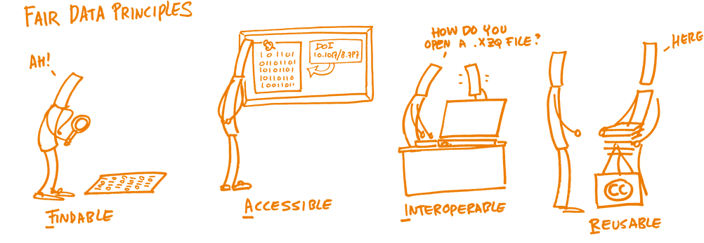
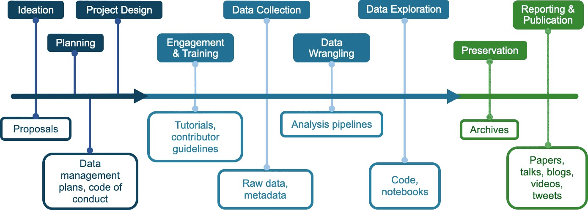

# Lección 1: Introducción a los Datos Abiertos

## Contenidos

- [Resumen](#resumen)
- [Objetivos de Aprendizaje](#objetivos-de-aprendizaje)
- [Introducción](#introduccion)
- [Definición y Consideraciones de Datos Abiertos](#definicion-y-consideraciones-de-datos-abiertos)
- [Beneficios de los Datos Abiertos](#beneficios-de-los-datos-abiertos)
- [Desafíos de los Datos Abiertos](#desafios-de-los-datos-abiertos)
- [Aplicando Principios FAIR](#aplicando-principios-fair)
- [Planificando la Apertura: Usando el Sistema Usar, Hacer, Compartir para los Datos Abiertos](#planificando-la-apertura-usando-el-sistema-usar-hacer-compartir-para-los-datos-abiertos)
- [Lección 1: Resumen](#leccion-1-resumen)
- [Lección 1: Revisión De Conocimientos](#leccion-1-revision-de-conocimientos)

## Resumen

Esta lección define los datos abiertos, sus beneficios y las prácticas que permiten que los datos sean abiertos. Además, la lección analiza más de cerca cómo los principios FAIR aplican a los datos abiertos así como al papel crítico de los metadatos. Finaliza con una breve discusión sobre cómo planificar para datos abiertos en el flujo de trabajo científico y tareas basadas en el marco de usar, hacer y compartir.

## Objetivos de Aprendizaje

Después de completar este módulo, deberías poder:

- Definir qué son los datos abiertos y cómo los principios FAIR y CARE se utilizan para guiar las prácticas de datos abiertos
- Enumerar los beneficios de los datos abiertos
- Explicar cómo el marco de usar, hacer y compartir puede ser utilizado para modificar el plan científico para datos abiertos

## Introducción

Los datos hacen avanzar a la ciencia. Los datos se guardan de manera electrónica para permitir más análisis e investigación. Las tecnologías digitales integradas en cada aspecto de la investigación científica moderna han llevado a la producción de grandes cantidades de datos.

Los datos abiertos son un pilar esencial de la ciencia abierta. En muchos sentidos, los datos abiertos son una extensión natural de la ciencia abierta más allá de las publicaciones científicas que incluyen los resultados digitales de la investigación. Así se han convertido en una parte integral del movimiento de la ciencia abierta ya que los datos abiertos permiten que todas las personas vean, usen y verifiquen resultados publicados. Los datos abiertos hacen que la ciencia sea más accesible, inclusiva y reproducible. Para que esto funcione, es necesario que los datos se disponibilicen en formatos que otras personas puedan usar, incluyendo metadatos que describan a los datos, y con documentación útil. Una vez disponibles, los datos abiertos facilitan nuevos descubrimientos y usos.

### Example: How Will Humans Live on the Moon or Travel to Mars When the Space Environment Threatens Human Health in Multiple Ways?

Bone loss, vertigo, anemia, muscle atrophy, increased risk for cancer - these are just some of the human side effects of space travel. To study these human health risks of space travel, scientists around the world use NASA's open-source GeneLab platform. GeneLab aggregates large volumes of space biology data on human and model organism samples exposed to spaceflight conditions. Their digital and physical repositories include cell info as well as DNA, RNA, and proteins. As an open-source platform, GeneLab data are publicly accessible at no cost.

**Example:** Using astronaut biological data from GeneLab, [scientists recently found](https://www.nature.com/articles/s41576-020-00322-8) what may be the culprit behind many of the side effects from travel to space: mitochondrial stress.

[Watch Video](https://www.youtube.com/watch?v=c9moR-KQpDQ\&embeds_referring_euri=https%3A%2F%2Fopenscience101.org%2F\&feature=emb_imp_woyt)

Mitochondria are components within our cells that affect respiratory and energy function. This discovery could be crucial to overcoming human health- related problems in space. Understanding the source of this issue could help scientists develop countermeasures and therapies to keep people healthy in space for longer periods of time.

## Definition and Considerations of Open Data

### What is Data?

The Turing Way Community. This illustration is created by Scriberia with The Turing Way community, used under a CC-BY 4.0 licence. DOI: 10.5281/zenodo.3332807

---

Data are any type of information that is collected, observed, or created in the context of research. Today, data are increasingly stored electronically in a digital format.

Data includes:

**Primary (raw) data** – Primary data refers to data that are directly collected or created by researchers. Research questions guide the collection of the data. Typically, a researcher will formulate a question, develop a methodology and start collecting the data. Some examples of primary data include:

- Responses to interviews, questionnaires, and surveys.
- Data acquired from recorded measurements, including remote sensing data.
- Data acquired from physical samples and specimens form the base of many studies.
- Data generated from models and simulations.

**Secondary & Processed data** – Secondary data typically refers to data that is used by someone different than who collected or generated the data. Often, this may include data that has been processed from its raw state to be more readily usable by others.

**Published data** – Published data are the data shared to address a particular scientific study and/or for general use. While published data can overlap with primary and secondary data types, we have "published data" as its own category to emphasize that such datasets are ideally well-documented and easy to use.

**Metadata** – Metadata are a special type of data that describe other data or objects (e.g. samples). They are often used to provide a standard set of information about a dataset to enable easy use and interpretation of the data.

The term open data are defined in the open data handbook from the Open Knowledge Foundation:

"Open data are data that can be freely used, reused and redistributed by anyone – subject only, at most, to the requirement to attribute and share alike."

**Open Data Handbook from the Open Knowledge Foundation**

---

When talking about data in the context of this module, we focus on the data that you are preparing to share, such as data affiliated with a scientific publication, regardless of what type that is. While you could share (and many do) laboratory notebooks, preliminary analyses, intermediate data products, drafts of scientific papers, plans for future research and similar items, these aren't usually required by funding agencies or institutions and thus won’t be in focus for this module.

To quote from a [published paper about data reuse](https://www.ncbi.nlm.nih.gov/pmc/articles/PMC9542848/), researchers are mostly looking for data which is "comprehensive, easy to obtain, easy to manipulate, and believable." For these criteria to be fulfilled, the data should:

- Be sufficiently described with appropriate metadata, which greatly affects open data reusability. There is no one size fits all for metadata as its collection is guided by your data.
- Have the appropriate license, copyright, and citation information.
- Have appropriate access information.
- Be findable in an accredited or trustworthy resource.
- Be accompanied with history of changes and versioning.
- Include details of all processing steps.

Not all data may be shared or shared with all this information. There are different reasons why it might not be possible. However, the more information shared about data helps increase the reliability and reusability of the information.

## Benefits of Open Data

Data underpins almost all of science. Openly sharing data with others enables reproducibility, transparency, validation, reuse, and collaborations. Data plays a significant role in our day-to-day lives. Open data, in particular, plays a key role. Open data are only common in our society and you have likely already benefited from this form in some way. The impacts of open data include facilitating:

---

**Greater Good** – Data plays a significant role in our day-to-day lives. Open data, in particular, has played a key role. Si hace una pausa y piensa en ello, puede darse cuenta de que los datos abiertos no solo son comunes en nuestra sociedad, sino que usted mismo podría haberse beneficiado y utilizado los datos abiertos.

Cada país o territorio a menudo proporciona acceso abierto a una variedad de información socioeconómica sobre la población, la comunidad y los negocios en su jurisdicción. Estos datos a menudo se llaman datos de encuestas censales y pueden incluir estadísticas agregadas de género, raza, etnicidad, educación, ingresos y datos de salud de una comunidad. Estos datos se utilizan a menudo para entender la composición de un vecindario local y son críticos para las decisiones informadas sobre la asignación de recursos para asegurar la calidad de vida de la comunidad.

#### Ejemplo: los datos abiertos ayudan a proporcionar información que salva vidas frente al cambio climático

El cambio climático plantea un riesgo importante para nuestra vida diaria y ha sido responsable de la intensificación de las sequías, el aumento de las inundaciones y los devastadores incendios en todo el mundo. Por lo tanto, los datos abiertos son fundamentales para proporcionar información que salve vidas para adaptarse al cambio climático y ayudar a evaluar los riesgos climáticos donde vivimos. Las agencias gubernamentales han estado proporcionando acceso público a información meteorológica y climática a largo plazo durante décadas (p.ej. National Oceanic Atmospheric Administration in the U.S., UK Met Office, European Centre for Medium-Range Weather Forecasts). Una iniciativa más reciente surge de organizaciones que desarrollan productos de datos abiertos con valor agregado para asesorar a la sociedad sobre el riesgo de un clima cambiante. Un ejemplo reciente es el riesgo de inundación e incendio en los Estados Unidos desarrollado por una organización sin fines de lucro [First Street Foundation.](https://firststreet.org/)

**Cambio de Política**

#### Ejemplo: Predicción de los efectos del cambio climático en las comunidades árticas

Los datos abiertos pueden llevar al cambio de políticas que impacten directamente en las vidas de las comunidades, como aquellas destinadas a sufrir primero los lentos cambios en el Ártico. Un estudio (https://www.nature.com/articles/s41467-018-07557-4) publicado en Nature empleó [OpenStreetMap](https://www.openstreetmap.org/about) datos para ayudar a producir mapas de los cambios ambientales proyectados en el Ártico. Estos mapas ayudaron a enfatizar la necesidad de políticas basadas en la adaptación a nivel comunitario y regional para evitar el estancamiento del cambio a la luz de una situación que empeora repentina y dramáticamente impulsada por el cambio climático.

**Respuesta global de emergencia**

#### Ejemplo: COVID-19

La pandemia COVID-19 demostró al mundo, en tiempo real, cómo el movimiento colectivo de las personas que investigan compartiendo sus datos como el intercambio de datos del genoma del coronavirus
(https://www.nature.com/articles/d41586-021-00305-7#:~:text=Other%20researchers%20say%20that%20restrictions,while%20protecting%20data%20providers) puede conducir a una cantidad sin precedentes de descubrimientos en un período de tiempo relativamente corto. Esto afectó directamente los esfuerzos radicales de desarrollo de vacunas y al control oportuno de la infección COVID-19. Estos conocimientos seguirán dando sus frutos y esta investigación estimulará desarrollos futuros.

El intercambio de datos tiene muchos beneficios y puede ayudar al acceso al conocimiento. Sin embargo, es importante considerar de dónde proceden los datos, quién debería tener voz y voto en su interpretación y uso, y cómo los datos pueden ser compartidos de forma responsable.

**Ciencia Ciudadana**

#### Ejemplo: Pruebas de calidad del agua en Beirut

La persona que realiza ciencia ciudadana es ciudadana o cientítica amateur, que colabora con el equipo investigador profesional para ayudar a recopilar o interpretar datos a una escala espacial y temporal más amplia de lo que el equipo podrían lograr por sí solo. Esta subcontratación de la responsabilidad ayuda a los miembros del público a emprender actividades científicas que les beneficien en última instancia y permiten la investigación a gran escala, lo que podría únicamente llevarse a cabo con profesionales de la investigación. La ciencia ciudadana está ganando popularidad y reconocimiento como una contribución valiosa a los avances científicos.

Por ejemplo, personas voluntarias científicas ciudadanas de Beirut fueron reclutados de 50 aldeas para ayudar a probar la calidad del agua[cito: capítulo 5 de [Contextualizar
Abierta: Situación de Open Science](https://idrc-crdi. /es/libro/contextualizing-openness-situating-open-science)]. Estas personas voluntarias fueron formadas para poder llevar a cabo las pruebas y, a su vez, no sólo los datos fueron recogidos para informar de los avances científicos, sino que las personas científicas ciudadanas tuvieron la oportunidad de aprender a gestionar mejor sus recursos hídricos y pudieron mejorar las condiciones, creando una interacción mutuamente beneficiosa.

**Datos abiertos e intercambio equitativo de conocimientos**

La libre distribución del conocimiento aumenta la participación en la ciencia. Los datos abiertos son fundamentales para fomentar la ciencia que es inclusiva y diversa, con beneficios directos y relevantes para las personas y las comunidades afectadas. Esta integración con las comunidades es particularmente importante en la misión de compartir el conocimiento de manera equitativa.

En un ecosistema de investigación donde el conocimiento es una mercancía, cuya principal moneda son los artículos publicados y conjuntos de datos acaparados, la exclusión de la investigación puede limitar el progreso científico y afectar negativamente los resultados de la comunidad. Las personas excluidas de los recursos científicos tradicionales suelen pertenecer a países de ingresos medios bajos y bajos. Abrir nuestros datos de una manera inclusiva y fácilmente reutilizable es un paso hacia la inclusión intencionada de grupos subrepresentados en la ciencia.

#### Ejemplo: reconocimiento y compensación por el trabajo del equipo investigador africano del ébola

Durante el brote de ébola en África Occidental entre 2014 y 2016, el equipo de investigación de África Occidental trabajó activamente para recolectar datos de muestras de sangre con el fin de comprender mejor el virus del ébola y ayudar a detener la rápida propagación del virus. Sin embargo, la mayoría de las muestras de sangre se enviaron al extranjero, a EE. UU. y Europa, donde los investigadores utilizaron esas muestras de datos para escribir artículos sobre el ébola. Según el artículo ["Ciencia bajo fuego: el equipo investigador del ébola lucha por probar drogas y vacunas en una zona de guerra",](https://www.nature.com/artículos/d41586-019-02258-4) "Esto frustró a las personas que investigan de los países devastados por el virus, que esperaban que el estudio de aspectos de la epidemia fortaleciera su capacidad para responder a futuros brotes de enfermedades infecciosas"

Al fomentar una cultura de investigación global de transparencia y validación, donde el trabajo de los grupos subrepresentados sea celebrado y compensado, crearemos un modelo sostenible que garantice que las comunidades subrepresentadas (como las mujeres, las comunidades subrepresentadas, las eruditas indígenas, las eruditas no anglófonas) una voz sobre cómo se desarrolla la narrativa global y matizada de la ciencia.

---

Los datos abiertos que son deliberadamente inclusivos y abiertos al escrutinio benefician la innovación científica al permitir un proceso científico más diverso y sólido que se basa en múltiples perspectivas. Esta apertura también permite la identificación temprana de las ideas erróneas así como la intervención temprana para daños imprevistos a las comunidades afectadas.

Los datos abiertos permiten a los equipos de investigacón no tradicionales a contribuir al desarrollo científico y poner sus ideas únicas sobre la mesa. Con estos beneficios en mente, siempre debemos tener presente que los Datos Abiertos requieren una cuidadosa consideración de sus posibles desventajas que resultan de no brindar el debido crédito y consulta a comunidades potencialmente vulnerables y/o marginadas. La siguiente lección “Uso de datos abiertos” analiza consideraciones importantes para la gestión responsable, recopilación y uso de datos abiertos por parte de todas las partes interesadas.

### Beneficios para ti

Los datos abiertos también benefician a tu investigación y tu carrera. Para empezar, ¡eres tu propio futuro colaborador!

Hacer ciencia abierta no sólo permite que otras personas entiendan y reproduzcan tus resultados, ¡sino que también te permite hacerlo! Implementar principios de ciencia abierta como la buena documentación y el control de versiones le ayudan, a potenciales colaboradores y al resto de las personas a entender sus resultados. En 2 horas, 2 semanas, o 2 años, todavía podrá entender lo que hizo.

Beneficios específicos de la apertura de datos para usted como persona:

- Nunca perderás el acceso a tu trabajo anterior, sin importar el instituto al que estés afiliado. Muchos investigadores se mueven por instituciones y organizaciones y, al tener sus datos accesibles públicamente en repositorios, siempre tendrás acceso a ellos.
- Tus datos pueden ser citados y obtendrás crédito.
- Las publicaciones que incluyen enlaces a datos se citan más, según un [estudio](https://journals.plos.org/plosone/article?id=10.1371/journal.pone.0230416) de 2020

La implementación de buenas prácticas para la ciencia abierta puede fortalecer las propuestas de financiación. Las agencias de financiación se están dando cuenta de que compartir abiertamente la investigación proporciona un mayor retorno de su inversión. Los productos de investigación bien documentados también demuestran la calidad de su trabajo, lo que ayuda con la comunicación pública y también puede atraer colaboradores de calidad. Todo el mundo prefiere trabajar con personas fiables y que hagan un buen trabajo.

### Actividad 1.1 Revisión de Datos Abiertos

Toma un momento para reflexionar sobre lo que significa para tí compartir datos.

Fuente de la imagen: CC-by [openaire](https://www.openaire.eu/blogs/open-research-data-the-fairest-data-is-the-future-of-science-estonia-national-openaire-event-1)

---

La nube de palabras muestra la variedad de significados e interpretaciones que la gente tiene sobre los datos abiertos. ¿Cuántos términos en la nube de palabras reconoces? ¿Alguno de ellos es nuevo para ti?

## Desafíos de los Datos Abiertos

Si bien los datos abiertos tienen muchos beneficios, su creación y uso también pueden plantear desafíos. A lo largo de este módulo, analizamos muchos de estos desafíos y posibles soluciones. En esta sección, analizamos algunas de las preocupaciones más comunes junto con acciones para mitigarlas.

**Ejemplo: ¿Hay algún perjuicio para los Datos Abiertos?**

Se ha demostrado que los datos abiertos marginan o explotan aún más las iniciativas de pequeña escala impulsadas por la comunidad, como en [el caso](https://thebulletin.org/2022/05/how-a-dispute-over-sharing-coronavirus-genomes-is-threatening-a-vital-tool-for-tracking-variants/) de investigadores africanos que no recibieron el debido crédito ni compensación por la secuenciación de su genoma durante la pandemia de COVID-19. Esto se explora más a fondo en la siguiente sección a medida que presentamos formas de mitigar los daños que podrían ocurrir a través del intercambio de datos irreflexivo e irresponsable.

### Restricciones al Compartir Datos

Algunos datos sólo deben compartirse con mucho cuidado o no compartirse en absoluto. Las razones para no compartir pueden incluir:

- Los datos incluyen secretos militares de un país o violaciones de los intereses nacionales.
- Los datos incluyen información médica privada o datos de identificación personal de un individuo.
- Asuntos indígenas/culturales/de conservación.
- Los datos incluyen propiedad intelectual.

Es importante estar familiarizado con las políticas sobre el intercambio de tus datos y las políticas de tu agencia de financiación, institución o las leyes sobre protección de datos. Esto se analiza con más detalle en módulos posteriores.

### Miedos Comunes en el Intercambio de Datos Abiertos

####  NOTA: Analizaremos muchos de los conceptos mencionados en la columna de discusión/mitigación más adelante en este módulo.

|                                                                                                                                                   |                                                                                                                                                                                                                                                                                                                                                                                                                                                                                                                                                                                                                                                                                                                                                                                                 |
| ------------------------------------------------------------------------------------------------------------------------------------------------- | ----------------------------------------------------------------------------------------------------------------------------------------------------------------------------------------------------------------------------------------------------------------------------------------------------------------------------------------------------------------------------------------------------------------------------------------------------------------------------------------------------------------------------------------------------------------------------------------------------------------------------------------------------------------------------------------------------------------------------------------------------------------------------------------------- |
| Miedo: Scooping: ¿Qué pasa si alguien reutiliza mis datos para publicar un resultado en el que estaba trabajando? | Sí, esto puede suceder. Pero, en muchos campos, si está claro que alguien está trabajando activamente en un problema, la decisión de otro de sacar provecho puede tener una ganancia a corto plazo pero una pérdida a largo plazo. En ciencia, la reputación es muy importante y la colaboración generalmente conduce a mayores éxitos profesionales. Si compartes tus datos, asegúrate de que tengan un identificador de objeto digital (DOI). Esto no impide que alguien use tus datos sin atribución, pero ayuda a que otros puedan citar tus datos más fácilmente. Hay un buen artículo sobre esto [aquí](https://datascience.codata.org/articles/10.5334/dsj-2017-029). |
| Miedo: Mala Interpretación o Mal Uso                                                                                              | Proporciona suficiente información contextual (documentación) para permitir que otros comprendan tus datos completamente para reducir este riesgo.                                                                                                                                                                                                                                                                                                                                                                                                                                                                                                                                                                                                           |
| Miedo: Mis datos serán utilizados pero no citados                                                                                 | Si bien no es común que los investigadores citen datos, la ética científica dicta que se debe citar si se utiliza tu trabajo. ¡Y recuerda citar los datos de otras personas para no agravar el problema!                                                                                                                                                                                                                                                                                                                                                                                                                                                                                                                                                                        |
| Miedo: los datos son demasiado sensibles para compartirlos                                                                        | Utilice el acceso controlado para ayudar a mantener la sensibilidad y la seguridad.                                                                                                                                                                                                                                                                                                                                                                                                                                                                                                                                                                                                                                                                                             |
| Miedo: Mis datos no serán útiles para nadie más                                                                                   | ¡Nunca se sabe cómo se pueden utilizar los materiales! [¡Los marineros del siglo XIX recogieron datos de temperatura](https://www.npr.org/templates/story/story.php?storyId=113916471) que hoy son una parte importante de nuestro registro climático oceánico!                                                                                                                                                                                                                                                                                                                                                                                                                                                                                                                                 |

Todas estas son preocupaciones válidas cuando se comparten datos abiertamente, pero como lo indica el movimiento global hacia la ciencia abierta, los beneficios generales superan las preocupaciones.

En última instancia, tú eres libre de implementar los principios y recursos de datos abiertos en tu investigación para maximizar su impacto y cumplir con las expectativas de tus patrocinadores y la comunidad mientras administras los costos.

## Aplicar Principios FAIR

Imagen de Patrick Hochstenbach, CC0 1.0; La imagen ilustra cada principio FAIR.

---

### FAIR: Encontrable, Accesible, Interoperable, Reutilizable

La gran mayoría de los datos actuales se comparten en línea. Los principios FAIR ayudan a los investigadores a hacer un mejor uso de sus datos científicos y a interactuar con una audiencia más amplia de lo que permitirían las técnicas obsoletas. Los datos FAIR son más valiosos para la ciencia porque son más fáciles de usar. Los datos pueden ser FAIR independientemente de si se comparten abiertamente o no. Si los datos se comparten abiertamente, ser FAIR ayuda con la reutilización y amplía el impacto científico de los datos.

Los principios FAIR no abarcan instrucciones de implementación integrales para cada tipo de datos, pero ofrecen información general para mejorar la capacidad de compartir y reutilizar. A veces se necesita un esfuerzo grupal y/o un largo proceso de producción para que los datos y los resultados sean FAIR. El proceso comienza en la etapa de planificación de un proyecto de investigación. A menudo se necesita un plan de gestión de datos y ciencia abierta bien coordinado para cumplir plenamente con FAIR, dependiendo del tamaño y el tipo de proyecto para el que se utilizan los datos.

**Puede encontrar información actualizada sobre los principios FAIR en el sitio web de la iniciativa GO FAIR**

[CLICK PARA APRENDER](https://www.go-fair.org/)

Repasemos cómo hacer que los datos sean FAIR para tu comunidad.

_Seleccione cada pestaña para obtener más información._

<table>
  <thead>
    <tr>
        <th>ENCONTRABLE ☑</th>
        <th>ACCESIBLE</th>
        <th>INTEROPERABLE</th>
        <th>REUTILIZABLE</th>
    </tr>
  </thead>
  <tbody>
    <tr>
        <td colspan="4">
            
Para garantizar que los miembros de tu comunidad puedan encontrar los datos:

            <ul>
            <li>Deposita datos en repositorios para preservarlos a lo largo del tiempo.</li>
            <li>Asigne a tu conjunto de datos un identificador persistente (PID), como un identificador de objeto digital (DOI).</li>
            <li>Agregue metadatos enriquecidos y autodescriptivos en tus archivos de datos y registre los metadatos en un catálogo de metadatos que permitirá que tus datos se seleccionen adecuadamente.</li>
                <ul>
                <li>Ten en cuenta que algunas imágenes o archivos binarios no se pueden indexar ni buscar fácilmente y necesitarán archivos de metadatos o diccionarios complementarios para garantizar que se puedan descubrir en una búsqueda.</li>
                </ul>
            <li>Automatiza el intercambio de sus metadatos con comunidades específicas, si corresponde.</li>
            </ul>
        </td>
    </tr>
  </tbody>
</table>

<table>
  <thead>
    <tr>
        <th>ENCONTRABLE</th>
        <th>ACCESIBLE ☑</th>
        <th>INTEROPERABLE</th>
        <th>REUTILIZABLE</th>
    </tr>
  </thead>
  <tbody>
    <tr>
        <td colspan="4">
            
Para garantizar que los miembros de tu comunidad puedan acceder a los datos:

            <ul>
                <li>Archivar en un repositorio de datos/centro de datos con protocolos de acceso estandarizados.</li>
                <li>Los protocolos de acceso al repositorio deben estar bien definidos e idealmente deberían admitir el acceso de máquina a máquina.</li>
                <li>Proporciona información sobre cómo los usuarios pueden acceder a tus datos, idealmente de forma automatizada y basada en máquinas.</li>
                <li>Si el contenido completo no puede estar disponible abiertamente por algún motivo (sensibilidad de los datos, acceso poco frecuente a los datos, problemas de almacenamiento de archivos), los metadatos aún pueden estar disponibles abiertamente para que los usuarios puedan averiguar a quién deben contactar para solicitar los datos (de ser posible).</li>
            </ul>
        </td>
    </tr>
  </tbody>
</table>

<table>
  <thead>
    <tr>
        <th>ENCONTRABLE</th>
        <th>ACCESIBLE</th>
        <th>INTEROPERABLE ☑</th>
        <th>REUTILIZABLE</th>
    </tr>
  </thead>
  <tbody>
    <tr>
        <td colspan="4">
            
Para garantizar que los datos sean interoperables para aquellos en tu comunidad:

            <ul>
                <li>Reporta los datos en formato estándar comunitario.</li>
                <li>Utiliza metadatos estandarizados existentes, si están disponibles, para minimizar los problemas de "pérdida en la traducción" y respaldar la legibilidad automática.</li>
                <li>El uso de terminologías controladas, vocabularios y ontologías es necesario para respaldar la interoperabilidad, pero puede que aún no estén disponibles en todos los campos de investigación.</li>
            </ul>
        </td>
    </tr>
  </tbody>
</table>

<table>
  <thead>
    <tr>
        <th>LOCALIZABLE</th>
        <th>ACCESIBLE</th>
        <th>INTEROPERABLE</th>
        <th>REUTILIZABLE ☑</th>
    </tr>
  </thead>
  <tbody>
    <tr>
        <td colspan="4">
            
Garantizar que los datos sean reutilizables por los miembros de tu comunidad:

            <ul>
                <li>Asegúrate de que los metadatos describan con precisión los datos y sus variables, así como cualquier particularidad o limitación.</li>
                <li>Especifica licencias de uso claras para tus datos.</li>
                <li>Proporciona información precisa sobre la procedencia en tus metadatos.</li>
                <li>Agrega suficiente información en los metadatos para que tus datos puedan ser citados correctamente cuando se utilicen.</li>
            </ul>
        </td>
    </tr>
  </tbody>
</table>

### El papel central de los metadatos en la aplicación de los principios FAIR

Los metadatos son importantes para que los motores de búsqueda encuentren datos y para que las personas puedan comparar fácilmente lo que se devuelve.

- Los metadatos son esenciales para la aplicación de los Principios FAIR y permiten que los datos sean utilizados por las máquinas de forma automatizada.
- Cuanto más ricos y autodescriptivos sean los metadatos, mejor serán manejados por cualquiera que esté interesado en tus datos.

### Licencias de datos

Una licencia es un documento legal que indica a los usuarios cómo pueden utilizar un conjunto de datos en particular. Si no licencias tu trabajo, otros no podrán o no deberían reutilizarlo, ¡aunque lo quieras! Es imprescindible conocer las condiciones de licencia de un conjunto de datos antes de reutilizarlos. Sin una buena comprensión de lo que permite una licencia, los usuarios de datos pueden enfrentarse a problemas de infracción de derechos de autor u otros problemas de propiedad intelectual.

Para asegurar la reutilización libre de tus datos, puedes recurrir a una licencia abierta. Una licencia abierta contiene un lenguaje que describe la capacidad del usuario para acceder, reutilizar y redistribuir el conjunto de datos. Hay muchos tipos de licencias de datos que tienen distintos grados de apertura, y que se tratarán con más detalle en la lección "Creación de datos abiertos".

## Planificar la apertura: Utilización del marco "Usar, hacer, compartir" para Código Abierto

### Planificar proyectos de ciencia abierta y gestión de datos

La mayoría de las agencias y organismos de financiamiento científico solicitan un plan de difusión de los resultados cuando se propone un proyecto de investigación. Un ejemplo de un plan de ciencia abierto es el Plan de Ciencia Abierta y Gestión de Datos ([OSDMP](https://science.nasa. ov/investigadores/sara/faqs/osdmp)) de la Dirección de Misión de Ciencia de la NASA (SMD) que describe cómo se gestionará y pondrá a disposición del público la información producida a partir de las actividades científicas. El OSDMP incluye secciones sobre gestión de datos, gestión de software e intercambio de publicaciones; estas dos últimas se tratarán en futuros módulos. Si tu estudio tiene otros tipos de resultados, como muestras físicas, hardware o cualquier otra cosa, también debes incluirlos en el plan. Puedes encontrar más información y modelos [aquí](https://github.com/nasa/smd-open-science-guidelines/blob/main/OSS_Guidance/OSDMP.md#osdmp-templates).

Una buena práctica al comenzar tu viaje con datos abiertos es crear un Plan de Gestión de Datos (PGD). En él se describe cómo se gestionarán, preservarán y publicarán los datos durante y después de un proyecto de investigación. Los elementos comunes a todos los Planes de Gestión de Datos (PGD) relevantes para datos abiertos incluyen una descripción teniendo en cuenta lo siguiente:

|           |                                                                                                                     |
| --------- | ------------------------------------------------------------------------------------------------------------------- |
| ¿Qué?     | Formato y (si es relevante) estándares de datos.                                 |
| ¿Cuando?  | El cronograma para archivar y compartir.                                                            |
| ¿Dónde?   | Los repositorios destinados a datos archivados.                                                     |
| ¿Cómo?    | Cómo el plan permite la conservación a largo plazo de los datos.                                    |
| ¿Quiénes? | Roles y responsabilidades de las personas que forman parte del equipo en la implementación del PGD. |

Consulta si tu institución o tu organismo de financiación dispone de pautas, normas o modelos para PGDs. Sino, hay entidades que también disponen de guías y muestras de PGD, como ser:

- [USGS](https://www.usgs.gov/data-management/data-management-plans)
- [NOAA](https://marinedebris.noaa.gov/sites/default/files/DataManagementPlanGuidance%26Sample.pdf)
- [NSF](https://new.nsf.gov/funding/data-management-plan)

Se proporcionarán más detalles sobre cómo crear estos planes en la lección "De la teoría a la práctica".

### Scientific Workflow

There are a variety of scientific workflow models that explain open science. Data plays a central role in the scientific workflow, where users can propose to create new data, collect and package their data during their project, then archive it for long term storage/use/reuse.

For this curriculum, we use the workflow model from [Opensciency](https://opensciency.github.io/sprint-content/open-results/lesson1-research-process-and-results.html#what-research-objects-are-commonly-associated-with-research-stages). It is used to illustrate that regardless of the workflow model you use, the adoption of open data is performed throughout the entire workflow and production of associated deliverables.

If your project is already in progress, it is a good idea to update future data releases to adhere to open data principles as much as possible. For new projects, your proposals should include creating open data from the start of your project.

In this curriculum, content is organized by how you might use it, make it, and share it. Part of doing open science is building on others’ materials (using), creating materials yourself (making), and sharing those so others can use those results (sharing). The lessons are all organized around these steps in the scientific workflow.

The "Use, Make, Share" framework categorizes the tasks commonly used in the practice of open science.

### Roles in Use, Make, Share

Individuals interacting with data at various points in the scientific workflow can take on different roles. It is possible that these roles can overlap depending on project requirements, the size of your team, and even funding. All should be using open data principles to perform their tasks. Generally, roles include:

_Select each tab to find out more information._

<table>
  <thead>
    <tr>
        <th>DATA USERS ☑</th>
        <th>DATA MAKERS (DATA PROVIDERS)</th>
        <th>DATA SHARERS (DATA PUBLISHERS)</th>
    </tr>
  </thead>
  <tbody>
    <tr>
        <td colspan="3">
            
Data users primarily discover, assess, and utilize data in research projects.

        </td>
    </tr>
  </tbody>
</table>

<table>
  <thead>
    <tr>
        <th>DATA USERS</th>
        <th>DATA MAKERS (DATA PROVIDERS) ☑</th>
        <th>DATA SHARERS (DATA PUBLISHERS)</th>
    </tr>
  </thead>
  <tbody>
    <tr>
        <td colspan="3">
            
Data makers often process data collected by a project/activity and package it according to open science principles.

        </td>
    </tr>
  </tbody>
</table>

<table>
  <thead>
    <tr>
        <th>DATA USERS</th>
        <th>DATA MAKERS (DATA PROVIDERS)</th>
        <th>DATA SHARERS (DATA PUBLISHERS) ☑</th>
    </tr>
  </thead>
  <tbody>
    <tr>
        <td colspan="3">
            
Data sharers bear the responsibility of disseminating and building awareness of the data to the public.

        </td>
    </tr>
  </tbody>
</table>

Making data open (and FAIR) is a group effort – everybody in the data pipeline has a role to play.

## Lección 1: Resumen

En esta lección, aprendiste:

- Los datos abiertos son un pilar esencial de la ciencia abierta. Compartir abiertamente los datos con otros permite la reproducibilidad, la transparencia, la validación, la reutilización y colaboraciones.
- Hay varios retos para la creación de datos abiertos, pero la mayoría tienen medidas sencillas de solución.
- Los principios FAIR se pueden aplicar a los datos para hacerlos más abiertos.
- Los principios y tareas relacionados con los datos abiertos se utilizan en todo el flujo del trabajo científico.

## Lección 1: Evaluación

Responde las siguientes preguntas para poner a prueba lo que ha aprendido hasta ahora.

_Pregunta_

**01/04**

Lee la siguiente afirmación e indica si es Verdadera o Falsa.

_Los datos abiertos pueden ser libremente utilizados, reutilizados y redistribuidos por cualquiera, sujeto, como mucho, al requisito de atribuir y compartir por igual._

- Verdadero
- Falso

_Pregunta_

**02/04**

Termina esa frase:

_Hacer que los datos estén abiertos te ayuda porque _____._

- tus datos pueden ser citados y se te reconocerá el mérito
- no perderás el acceso a tus datos, incluso si cambias de institución
- tus publicaciones tienen más probabilidades de ser citadas cuando se vinculan a datos abiertos
- todas las anteriores

_Pregunta_

**03/04**

Seleccione los principios FAIR de la siguiente lista. Selecciona todos los que correspondan.

- Reproducibilidad
- Reutilizable
- Responsable
- Localizable
- Interactivo
- Interoperable
- Interpolado
- Accesible
- Autorizable

_Pregunta_

**04/04**

¿Cuál de las siguientes opciones puede ayudar a que tus datos sean FAIR? Selecciona todos los que correspondan.

- Obtener una licencia para tus datos
- Desarrollar tus propios metadatos
- Obtener un PID para tus datos
