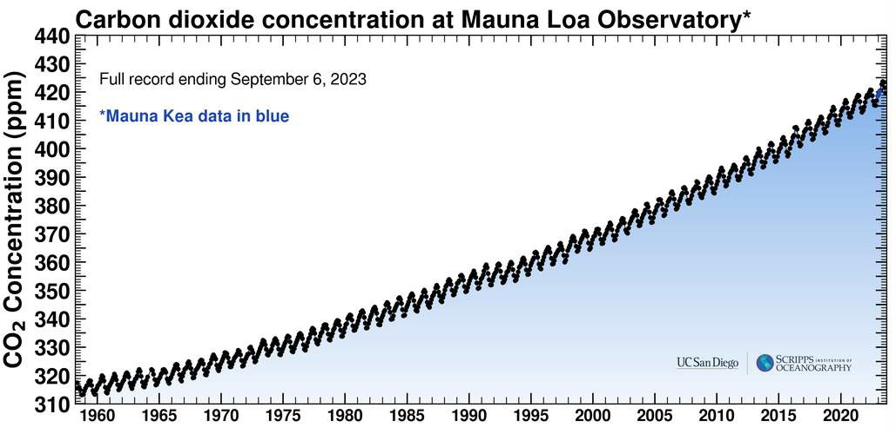
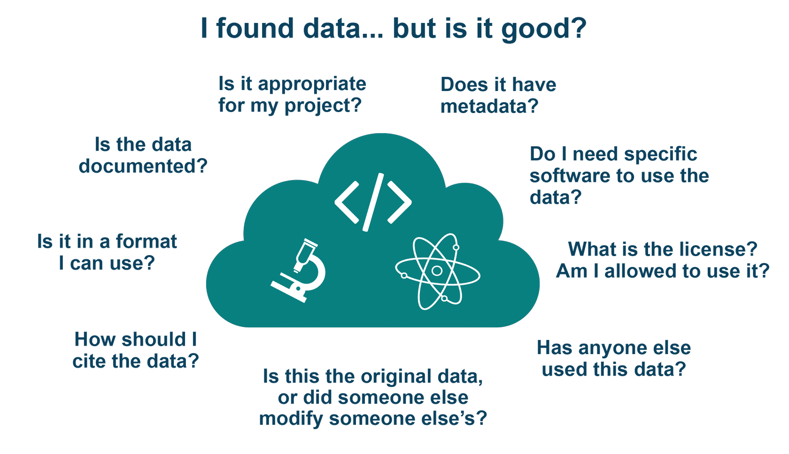

# Lesson 2: Using Open Data

## Navigation

- [Overview](#overview)
- [Learning Objectives](#learning-objectives)
- [Introduction](#introduction)
- [Discovering Open Data](#discovering-open-data)
- [Assessing Open Data](#assessing-open-data)
- [Using Open Data](#using-open-data)
- [Lesson 2: Summary](#lesson-2-summary)
- [Lesson 2: Knowledge Check](#lesson-2-knowledge-check)

## Overview

In this lesson you learn how to discover, assess, and cite an open data set. You start by exploring repositories and learning about the issues and considerations for searching datasets. You then learn how to determine if the dataset is suitable for your use by learning what to review in documentation, licenses, and file formats. The lesson wraps up with a discussion about the importance of citing the datasets and how to read and follow citation instructions.

## Learning Objectives

After completing this lesson, you should be able to:

- Select data sources and use search techniques to discover open data.
- Assess if a dataset incorporates open access elements that ensure easy reusability.
- Explain the importance of citing open data, and find and follow citation instructions.

## Introduction

Open data isn't always simple to use in your research. Sometimes there are multiple versions of the same dataset, so learning how to discover and assess and then use open data will help you save time.

As an example, look at the monthly average carbon dioxide data from Mauna Loa Observatory in Hawaii. This is a foundational dataset for climate change. Not only is it one of the first observational datasets that clearly showed anthropogenic impacts on the Earth's atmosphere, it constitutes the longest record of direct measurements of carbon dioxide in the atmosphere. These observations were started by C. David Keeling of the Scripps Institution of Oceanography in March of 1958 at a facility of the National Oceanic and Atmospheric Administration \[Keeling, 1976\].

If you want to make this figure yourself, or use the data for some other purpose, first you will want to find the data. If you search for this dataset, or any data, chances are that you will find a number of different sources. How do you decide which data to use?

If you start with Google and search for "Mauna Loa carbon dioxide data" you will find a lot of results. Here are just some of them:

How do you decide which one to use? In this lesson we will cover how to find, assess relevance, and use open data.

---

## Discovering Open Data

Open data can be discovered by accessing data repositories, search portals, and publications. A wide variety of these resources are available. A key step is identifying the appropriate search terms for your application. Learning community-specific nomenclature and standards can accelerate your search.

### Where to Start Your Search

There are multiple pathways to find research data, and you should be practiced in all of them.

### People You Know (Online or In-person!)

When we show up to the present moment with all of our senses, we invite the world to fill us with joy. The pains of the past are behind us. The future has yet to unfold. But the now is full of beauty simply waiting for our attention.

What is the first and best way to find research data? Ask your community, including your research advisor, colleagues, team members, and people online. Knowing where to find reliable, good data is as much a skill and art as any lab technique. You learn this skill set by working with professionals in your field. There is no one source, no one method.

Image source: NASA, Dominic Hart 2023

---

### Publications

Datasets are often attached to scholarly publications in the form of supplementary material. Publication search engines can enable the discovery of relevant publications that you can then use to find data from a particular publication.

### Data Search Portals

Data can also be found utilizing a wide variety of search portals including:

_Select each tab to find out more information._

<table>
  <thead>
    <tr>
        <th>GENERIC DATA SEARCH PORTALS ☑</th>
        <th>DISCIPLINE-SPECIFIC DATA SEARCH PORTALS</th>
        <th>NATIONAL AND INTERNATIONAL DATA SEARCH PORTALS</th>
    </tr>
  </thead>
  <tbody>
    <tr>
        <td colspan="3">
            
Generic data search portals enable discovery of a wide variety of data. Not built for specific disciplines, they serve a broader audience. This type of search portal collects and makes data findable. They are not sources of scientific data. These are aggregation services that emphasize quantity, not necessarily quality. This is where citizen scientists often go to find data, and it’s a great way for non-professionals to get involved in science.

            
Examples include:

            <ul>
                <li><a href="https://datasetsearch.research.google.com/">Google</a></li>
                <li><a href="https://www.kaggle.com/datasets">Kaggle</a></li>
                <li><a href="https://www.wikidata.org/wiki/Wikidata:Main_Page">Wikidata</a></li>
                <li><a href="https://www.opendatanetwork.com/">Open Data Network</a></li>
                <li><a href="https://github.com/awesomedata/awesome-public-datasets#readme">Awesome Public Datasets</a></li>
            </ul>
        </td>
    </tr>
  </tbody>
</table>

<table>
  <thead>
    <tr>
        <th>GENERIC DATA SEARCH PORTALS</th>
        <th>DISCIPLINE-SPECIFIC DATA SEARCH PORTALS ☑</th>
        <th>NATIONAL AND INTERNATIONAL DATA SEARCH PORTALS</th>
    </tr>
  </thead>
  <tbody>
    <tr>
        <td colspan="3">
            
Discipline-specific data search portals enable the discovery of specific types of data. They generally are tailored to meet their community’s needs.

            
Examples include:

            <ul>
                <li><a href="https://www.earthdata.nasa.gov/">NASA Earthdata</a></li>
                <li><a href="https://opendata.cern.ch/">CERN</a></li>
                <li><a href="https://www.ncbi.nlm.nih.gov/">NCBI National Center for Biotechnology Information</a></li>
                <li><a href="https://www.ebi.ac.uk/">EMBL's European Bioinformatics Institute</a></li>
                <li><a href="https://www.icpsr.umich.edu/web/pages">ISPCR</a></li>
                <li><a href="https://www.ncdc.noaa.gov/cdo-web/datasets">NOAA Climate Data Online</a></li>
                <li><a href="https://earthexplorer.usgs.gov/">USGS EarthExplorer</a></li>
                <li><a href="https://www.opensciencedatacloud.org/">Open Science Data Cloud (OSDC)</a></li>
                <li><a href="https://pds.nasa.gov/">NASA Planetary Data System</a></li>
            </ul>
        </td>
    </tr>
  </tbody>
</table>

<table>
  <thead>
    <tr>
        <th>GENERIC DATA SEARCH PORTALS</th>
        <th>DISCIPLINE-SPECIFIC DATA SEARCH PORTALS</th>
        <th>NATIONAL AND INTERNATIONAL DATA SEARCH PORTALS ☑</th>
    </tr>
  </thead>
  <tbody>
    <tr>
        <td colspan="3">
            
National and international data search portals enable discovery of data produced by or funded by national and international organizations.

            
Examples include:

            <ul>
            <li><a href="https://data.gov/">US Federal data</a></li>
            <li><a href="https://data.europa.eu/en">EU Data Portal</a></li>
            <li><a href="https://apps.who.int/gho/data/node.home">WHO</a></li>
            <li><a href="https://data.worldbank.org/">The World Bank</a></li>
            <li><a href="https://www.data.gov.uk/">data.gov.uk</a></li>
            <li><a href="https://data.unicef.org/">UNICEF</a></li>
            <li><a href="https://www.data.gouv.fr/en/">data.gouv.fr</a> - Open Platform for French Public Data</li>
            </ul>
        </td>
    </tr>
  </tbody>
</table>

### Repositories

A common way to share and find open data is through data repositories. Many repositories host open data with persistent identifiers, clear licenses and citation guidelines, and standard metadata.

Note that some of our example search portals are also repositories, but not always. Some of the search portals are simply catalogs of information about the data, rather than storage locations for the data themselves.

_Select each tab to find out more information._

<table>
  <thead>
    <tr>
        <th>GENERAL REPOSITORIES ☑</th>
        <th>DOMAIN-SPECIFIC REPOSITORIES</th>
        <th>INSTITUTIONAL REPOSITORIES</th>
        <th>NATIONAL REPOSITORIES</th>
    </tr>
  </thead>
  <tbody>
    <tr>
        <td colspan="4">
            
General repositories are not designed for a specific community and are accessible to everyone.

            
Examples include:

            <ul>
            <li><a href="https://zenodo.org/">Zenodo</a></li>
            <li><a href="https://data.mendeley.com/">Mendeley Data</a></li>
            <li><a href="https://figshare.com/">Figshare</a></li>
            <li><a href="https://datadryad.org/stash">Dryad</a></li>
            </ul>
            
See the <a href="https://fairsharing.org/collection/GeneralRepositoryComparison">Generalist Repository Comparison Chart</a> – a tool for additional repositories and guidance. Dataverse también ha publicado una <a href="https://dataverse.org/blog/comparative-review-various-data-repositories">revisión comparativa</a> de ocho repositorios de datos.

        </td>
    </tr>
  </tbody>
</table>

<table>
  <thead>
    <tr>
        <th>REPOSITORIOS GENERALES</th>
        <th>REPOSITORIOS DE DOMINIO ESPECÍFICO ☑</th>
        <th>REPOSITORIOS INSTITUCIONALES</th>
        <th>REPOSITORIOS NACIONALES</th>
    </tr>
  </thead>
  <tbody>
    <tr>
        <td colspan="4">
            
Los repositorios especializados (típicamente para asuntos específicos de datos) proporcionan soporte e información sobre los estándares requeridos para metadatos y más.

            
Algunos ejemplos son:

            <ul>
                <li>Astronomía: <a href="https://archive.stsci.edu/">Datos del telescopio Hubble</a></li>
                <li>Biología del espacio: <a href="https://genelab.nasa.gov/">NASA GeneLab: Ciencia abierta para la vida en el espacio</a></li>
                <li><a href="https://heliophysicsdata.gsfc.nasa.gov/websearch/dispatcher">Física espacial: Portal de Datos de Heliofísica - Buscador de productos de física solar espacial (nasa.gov)</a></li>
            </ul>
        </td>
    </tr>
  </tbody>
</table>

<table>
  <thead>
    <tr>
        <th>REPOSITORIOS GENERALES</th>
        <th>REPOSITORIOS DE DOMINIO ESPECÍFICO</th>
        <th>REPOSITORIOS INSTITUCIONALES ☑</th>
        <th>REPOSITORIOS NACIONALES</th>
    </tr>
  </thead>
  <tbody>
    <tr>
        <td colspan="4">
            
Muchas universidades y organizaciones apoyan la gestión de datos y de software de investigación con repositorios, conocidos como repositorios institucionales, para ayudar a sus investigadores con los requisitos de cumplimiento.

        </td>
    </tr>
  </tbody>
</table>

<table>
  <thead>
    <tr>
        <th>REPOSITORIOS GENERALES</th>
        <th>REPOSITORIOS DE DOMINIO ESPECÍFICO</th>
        <th>REPOSITORIOS INSTITUCIONALES</th>
        <th>REPOSITORIOS NACIONALES ☑</th>
    </tr>
  </thead>
  <tbody>
    <tr>
        <td colspan="4">
            
Los repositorios nacionales recopilan datos y los ponen a disposición del público.

            
Los datos almacenados en estos repositorios a menudo son producidos por el gobierno.

            
Los ejemplos incluyen:

            <ul>
                <li><a href="https://data.gov/">https://data.gov/</a></li>
                <li><a href="https://data.europa.eu/en">https://data.europa.eu/en</a></li>
            </ul>
        </td>
    </tr>
  </tbody>
</table>

### Desafíos de los repositorios de datos

- Ningún repositorio único, motor de búsqueda o buscador de publicaciones tendrá acceso a todos los datos abiertos disponibles.
- Los términos de búsqueda pueden no ser consistentes en todas las fuentes o campos de la ciencia.
- Es esencial familiarizarse con las nomenclaturas estándar y los términos de metadatos apropiados para la aplicación.
- No existe una receta infalible. Es posible que sea necesario probar numerosos términos y fuentes de datos antes de encontrar datos relevantes.

### Actividad 2.1: Descubrir los datos abiertos</strong>

Unir el tipo de repositorio con la definición correcta.

|                                     |                                                                            |
| ----------------------------------- | -------------------------------------------------------------------------- |
| Repositorios generales              | Diseñados para todas las comunidades y accesibles a todos                  |
| Repositorios específicos de dominio | Repositorios que son típicamente diseñados para temas específicos de datos |
| Repositorios institucionales        | Repositorios gestionados por universidades y organizaciones                |
| Repositorios nacionales             | Repositorios financiados por el gobierno                                   |

## Evaluando datos abiertos

El uso de datos abiertos para un proyecto depende de una serie de factores, como la calidad de los datos, las condiciones de acceso y reutilización, la posibilidad de encontrar los datos, etc. Algunos elementos esenciales que permiten evaluar la pertinencia y utilidad de los conjuntos de datos son (adaptado del [curso GODAN Action Open Data](https://aims.gitbook.io/open-data-mooc/unit-3-using-open-data/lesson-2.2-quality-and-provenance)):

**Preguntas prácticas**

- ¿Están bien descritos los datos?
- ¿Es clara la razón por la que se recogen los datos? ¿Es claro el uso que hace el editor de los datos?
- ¿Existen otros usos de los datos descritos?
- ¿Son accesibles los datos?
- ¿Los datos están actualizados o tienen fecha?
- ¿Estarán disponibles los datos durante al menos un año?
- ¿Se actualizarán los datos periódicamente?
- ¿Existe un proceso de control de calidad?

**Preguntas técnicas**

- ¿Están disponibles los datos en un formato adecuado al contenido?
- ¿Se dispone de los datos desde una ubicación consistente?
- ¿Están los datos bien estructurados y son comprensibles para las máquinas?
- ¿Están definidos los términos y acrónimos complejos de los datos?
- ¿Utilizan los datos un esquema o estándar de datos?
- ¿Hay alguna API disponible para acceder a los datos?
- ¿Qué herramientas o programas informáticos se necesitan para utilizar estos datos?

**Preguntas Sociales**

- ¿Existe una comunidad de usuarios de los datos?
- ¿Se trata de datos en los que ya confía un gran número de personas?
- ¿Están los datos respaldados oficialmente?
- ¿Existen acuerdos de nivel de servicio para los datos?
- ¿Está claro quién mantiene los datos y quién puede ser contactado sobre los mismos?

[[cite: https://aims.gitbook.io/open-data-mooc/unit-3-using-open-data/lesson-2.2-quality-and-provenance](https://aims.gitbook.io/open-data-mooc/unit-3-using-open-data/lesson-2.2-quality-and-provenance)]

Muchas de estas preguntas pueden responderse consultando la documentación y los metadatos de un conjunto de datos, así como su formato y licencia, aspectos que se tratarán con más detalle en la próxima lección "Cómo hacer que los datos sean abiertos".

## Utilizando datos abiertos

### La importancia de la cita

Los agradecimientos y las citas contribuyen a fomentar una cultura de intercambio de datos sin temor a que se roben ideas o reconocimientos. Si un investigador puede confiar en que su trabajo será citado y utilizado para impulsar el desarrollo de la ciencia, la idea de abrir los datos resulta más atractiva y beneficiosa para ambas partes. Se recomienda el uso de prácticas de citación estándar para garantizar el debido reconocimiento.

Citar los datos también contribuye a la transparencia del uso que se hace de ellos. Al citar los datos, los autores originales y los nuevos investigadores pueden seguir fácilmente cómo se utilizan los datos para responder a diferentes preguntas.

### Revisar las pautas para citar

Muchos conjuntos de datos y repositorios explican cómo prefieren que se les cite. La cita suele incluir:

- Los autores y sus instituciones
- Título
- ORCiD
- DOI
- Versión
- URL
- Fecha de creación
- También se pueden especificar campos adicionales

Este es un ejemplo de un archivo CITATION.cff sencillo. Fuente: [GitHub](https://github.com/)

---

La mayoría de los conjuntos de datos exigen (como mínimo) que al citarlos se indique el productor de los datos, el nombre del archivo que los alberga, el nombre del conjunto de datos, la fecha del conjunto de datos y el DOI.

### Citar datos abiertos: Ejemplos

**Ejemplo de un Centro de Archivo Activo Distribuido (DAAC) de la NASA**

Matthew Rodell and Hiroko Kato Beaudoing, NASA/GSFC/HSL (08.16.2007), GLDAS CLM Land Surface Model L4 3 Hourly 1.0 x 1.0 degree Subsetted,version 001, Greenbelt, Maryland, USA:Goddard Earth Sciences Data and Information Services Center (GES DISC), Accessed on July 12th, 2018 at doi:10.5067/83NO2QDLG6M0

**Ejemplo del Sistema de Datos Planetarios (SDP)** de la NASA

Justin N. Maki. (2004). MER 1 MARS MICROSCOPIC IMAGER RADIOMETRIC

RDR OPS V1.0 [Conjunto de datos]. Sistema de datos planetarios de la NASA. [https://doi.org/10.17189/1520416](https://doi.org/10.17189/1520416)

## Lección 2: Resumen

A continuación se exponen las conclusiones principales de esta lección:

- Los datos relevantes pueden encontrarse en diversos lugares y puede ser necesario recurrir al método de ensayo y error para encontrarlos.
- Es necesario evaluar cuidadosamente los datos antes de utilizarlos.
- Citar los datos es importante cuando son utilizados.

## Lección 2: Evaluación

Responde las siguientes preguntas para evaluar lo que has aprendido hasta ahora.

_Pregunta_

**01/03**

¿Cuál de los siguientes métodos puede utilizarse para encontrar datos?

- Uso de términos de búsqueda apropiados
- Investigar datos identificados por DOI en publicaciones
- Identificar los repositorios de datos relevantes
- Todas las anteriores

_Pregunta_

**02/03**

¿Cuál de las siguientes son puntos a considerar al evaluar si se puede utilizar un conjunto de datos?

- ¿Están bien descritos los datos?
- ¿Están los datos bien estructurados y son comprensibles para las máquinas?
- ¿Existe una comunidad de usuarios de los datos?
- ¿Qué herramientas o programas informáticos se necesitan para utilizar estos datos?
- ¿Se actualizarán los datos periódicamente?
- ¿Es claro el uso que hace el editor de los datos?
- Todas las anteriores

_Pregunta_

**03/03**

¿Qué información se encuentra comúnmente en una cita?

- Los autores y sus instituciones
- Título
- ORCiD
- DOI
- Versión
- URL
- Fecha de creación
- Todas las anteriores
