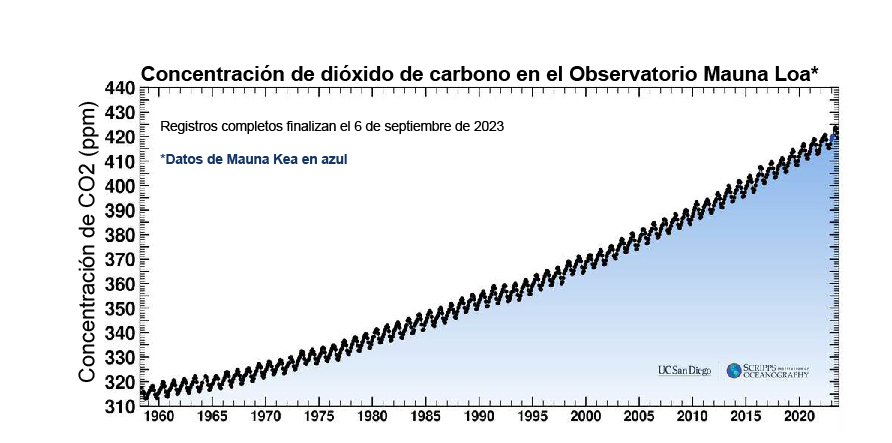
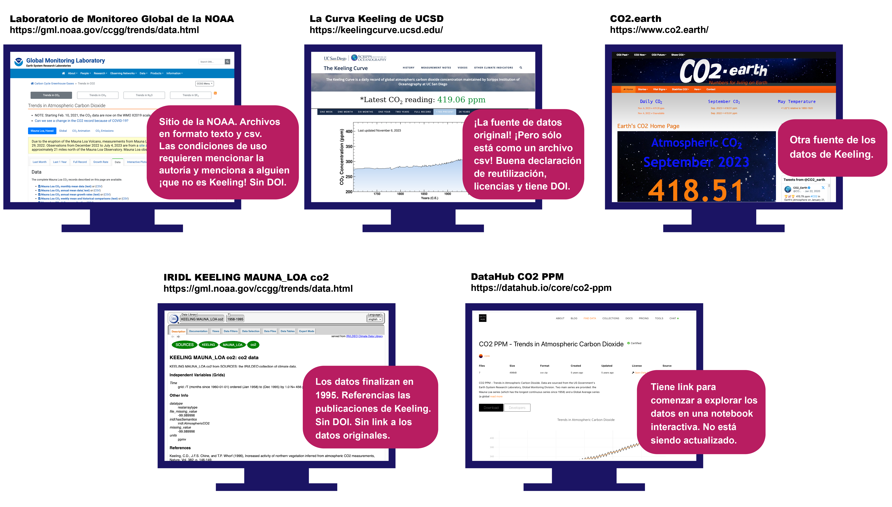
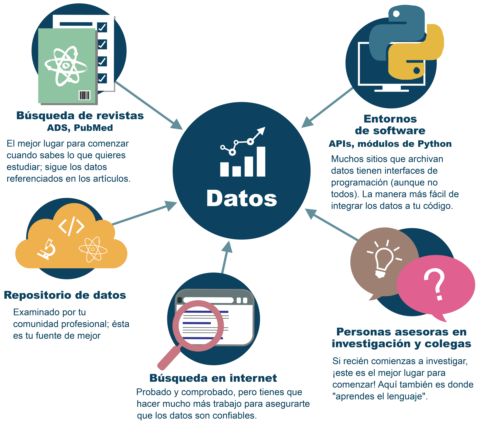
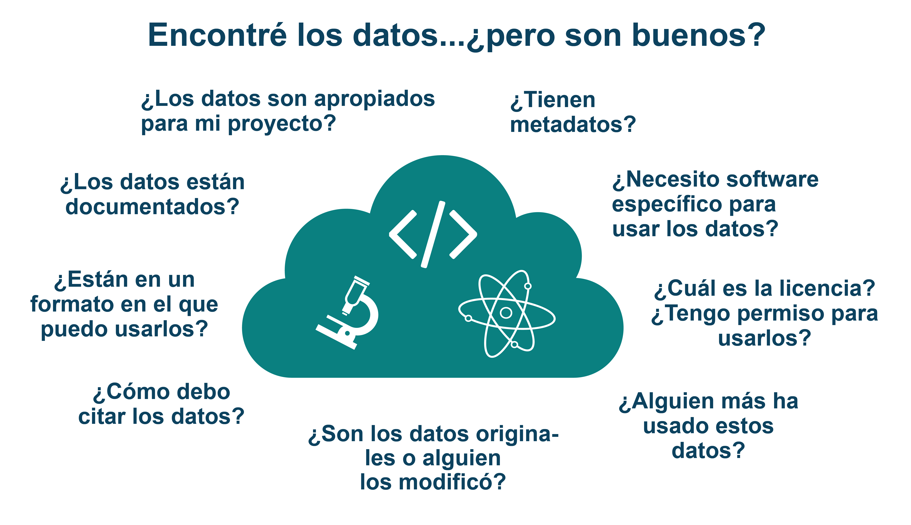
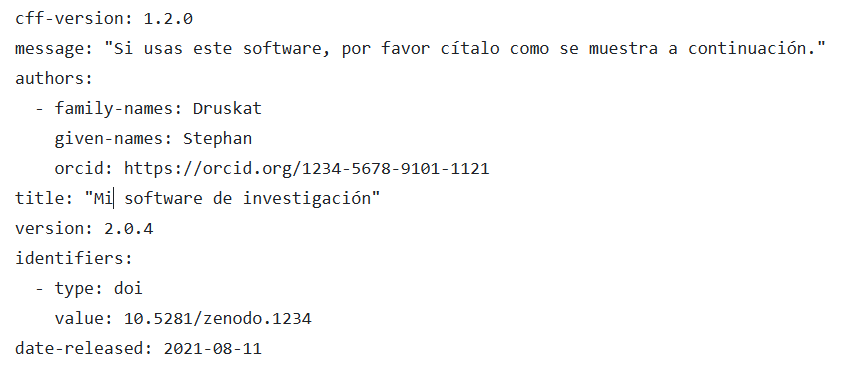

# Lección 2: Usar Datos Abiertos

## Contenidos

- [Descripción general](#resumen)
- [Objetivos de aprendizaje](#learning-objectives)
- [Introducción](#introduction)
- [Descubrir Datos Abiertos](#discovering-open-data)
- [Evaluar los Datos Abiertos](#assessing-open-data)
- [Utilizar Datos Abiertos](#using-open-data)
- [Lección 2: Resumen](#lesson-2-summary)
- [Lección 2: Evaluación](#lesson-2-knowledge-check)

## Descripción general

En esta lección aprenderás a descubrir, evaluar y citar un conjunto de Datos Abiertos. Empieza explorando los repositorios y aprendiendo sobre los problemas y consideraciones para buscar conjuntos de datos. Después, aprenderás a determinar si el conjunto de datos es adecuado para su uso y aprenderás qué revisar en la documentación, las licencias y los formatos de archivo. La lección concluye con una discusión sobre la importancia de citar los conjuntos de datos y cómo leer y seguir las instrucciones de citación.

## Objetivos de Aprendizaje

Al finalizar esta lección deberías ser capaz de:

- Seleccionar fuentes de datos y utilizar técnicas de búsqueda para descubrir Datos Abiertos.
- Evaluar si un conjunto de datos incorpora elementos de Acceso Abierto que garantizan que sean fácilmente reusados.
- Explicar la importancia de citar Datos Abiertos, y encontrar y seguir las instrucciones de citación.

## Introducción

Los Datos Abiertos no siempre son fáciles de usar en tu investigación. A veces hay varias versiones del mismo conjunto de datos, así que aprender a descubrir y evaluar y luego usar los Datos Abiertos te ayudará a ahorrar tiempo.

Como ejemplo, veamos los datos mensuales promedio de dióxido de carbono del Observatorio "Mauna Loa" en Hawaii. Se trata de un conjunto de datos fundacionales para el cambio climático. No sólo es uno de los primeros conjuntos de datos de observación que claramente mostraron impactos antropogénicos en la atmósfera de la Tierra, sino que también constituye el registro más largo de mediciones directas de dióxido de carbono en la atmósfera. Estas observaciones fueron iniciadas por el trabajo de C. David Keeling de la Institución de Oceanografía "Scripps" en marzo de 1958 en una instalación de la Administración Nacional Oceanica y Atmosférica \[Keeling, 1976\].

Si deseas hacer este gráfico tú mismo, o utilizar los datos para algún otro fin, primero deberás encontrar los datos. Si buscas este conjunto de datos, o cualquier dato, es posible que encuentres varias fuentes diferentes. ¿Cómo decides qué datos usar?

Si comienzas con Google y buscas "datos de dióxido de carbono de Mauna Loa", encontrarás muchos resultados. Aquí se presentan algunos de ellos:

¿Cómo decidirás cuál utilizar? En esta lección cubriremos cómo encontrar, evaluar la relevancia y utilizar Datos Abiertos.

---

## Descubrir Datos Abiertos

Los Datos Abiertos se pueden descubrir accediendo a los repositorios de datos, los portales de búsqueda y las publicaciones. Una gran variedad de estos recursos están disponibles. Un paso clave es identificar los términos de búsqueda adecuados para tu solicitud. Aprender la nomenclatura y los estándares específicos de la comunidad puede acelerar tu búsqueda.

### Donde comenzar tu búsqueda

Hay múltiples caminos para encontrar datos de investigación, y deberías tener práctica en todos.

### Personas que conoces (¡en línea o en persona!)

¿Cuál es la primera y mejor forma de encontrar los datos de investigación? Pregunta a tu comunidad, incluyendo a quien te asesora en la investigación, colegas, miembros del equipo y personas en línea. Conocer dónde encontrar datos fiables es tanto una habilidad y arte como cualquier técnica de laboratorio. Aprendes este juego de habilidades trabajando con profesionales de tu campo. No hay una sola fuente, ni un único método.

Fuente de la imagen: NASA, Hart Dominic 2023

---

### Publicaciones

Los conjuntos de datos a menudo se adjuntan a publicaciones especializadas en forma de material complementario. Los motores de búsqueda de publicaciones pueden permitir el descubrimiento de publicaciones relevantes que se pueden usar para encontrar datos de una publicación en particular.

### Portales de búsqueda de datos

Los datos también se pueden encontrar utilizando una amplia variedad de portales de búsqueda, incluyendo:

_Seleccione cualquier pestaña para obtener más información._

<table>
  <thead>
    <tr>
        <th>PORTALES DE DATOS GENÉRICOS ☑</th>
        <th>PORTALES DE BÚSQUEDA DE DATOS POR DISCIPLINA ESPECÍFICA</th>
        <th>PORTALES NACIONALES E INTERNACIONALES DE DATOS</th>
    </tr>
  </thead>
  <tbody>
    <tr>
        <td colspan="3">
            
Los portales de búsqueda de datos genéricos permiten el descubrimiento de una gran variedad de datos. No están construidos para disciplinas específicas, sirven a un público más amplio. Este tipo de portal de búsqueda recolecta y hace que los datos sean fáciles de encontrar. No son fuentes de información científica. Se trata de servicios de agregación que hacen hincapié en la cantidad, no necesariamente de calidad. Aquí es donde las personas que hacen ciencia ciudadana suelen acudir para encontrar datos y, para los no profesionales, es una gran manera de involucrarse en la ciencia.

            
Los ejemplos incluyen:

            <ul>
                <li><a href="https://datasetsearch.research.google.com/">Google</a></li> 
                <li><a href="https://www.kaggle.com/datasets">Kaggle</a></li>  
                <li><a href="https://www.wikidata.org/wiki/Wikidata:Main_Page">Wikidata</a></li>  
                <li><a href="https://www.opendatanetwork.com/">Red de Datos Abiertos</a></li> 
                <li><a href="https://github.com/awesomedata/awesome-public-datasets#readme">Impresionante conjunto de datos públicos</a></li>
            </ul>
        </td>
    </tr>
  </tbody>
</table>

<table>
  <thead>
    <tr>
        <th>PORTALES DE DATOS GENÉRICOS</th>
        <th>PORTALES DE DATOS ESPECÍFICOS POR DISCIPLINA ☑</th>
        <th>PORTALES NACIONALES E INTERNACIONALES DE DATOS</th>
    </tr>
  </thead>
  <tbody>
    <tr>
        <td colspan="3">
            
Los portales de búsqueda de datos específicos de una disciplina permiten el descubrimiento de tipos específicos de datos. Generalmente, están diseñados para satisfacer las necesidades de esa comunidad.

            
Los ejemplos incluyen:

            <ul>
                <li><a href="https://www.earthdata.nasa.gov/">Datos de la tierra de la NASA</a></li>
                <li><a href="https://opendata.cern.ch/">CERN</a></li>
                <li><a href="https://www.ncbi.nlm.nih.gov/">Centro Nacional de Información sobre Biotecnología NCBI</a></li>
                <li><a href="https://www.ebi.ac.uk/">Instituto Europeo de Bioinformática</a></li>
                <li><a href="https://www.icpsr.umich.edu/web/pages">ISPCR</a></li>
                <li><a href="https://www.ncdc.noaa.gov/cdo-web/datasets">NOAA Climate Data Online</a></li>
                <li><a href="https://earthexplorer.usgs.gov/">USGS EarthExplorer</a></li>
                <li><a href="https://www.opensciencedatacloud.org/">Nube de Datos de Ciencia Abierta (OSDC)</a></li>
                <li><a href="https://pds.nasa.gov/">Sistema de datos planetarios de la NASA</a></li>
            </ul>
        </td>
    </tr>
  </tbody>
</table>

<table>
  <thead>
    <tr>
        <th>PORTALES DE DATOS GENÉRICOS</th>
        <th>PORTALES DE DATOS ESPECÍFICOS POR DISCIPLINA</th>
        <th>PORTALES NACIONALES E INTERNACIONALES DE DATOS ☑</th>
    </tr>
  </thead>
  <tbody>
    <tr>
        <td colspan="3">
            
Los portales de búsqueda de datos nacionales e internacionales permiten el descubrimiento de datos producidos o financiados por organizaciones nacionales e internacionales.

            
Los ejemplos incluyen:

            <ul>
            <li><a href="https://data.gov/">Los datos federales de EE.UU</a></li>
            <li><a href="https://data.europa.eu/es">Portal de datos de la UE</a></li>
            <li><a href="https://apps.who.int/gho/data/node.home">OMS</a></li>
            <li><a href="https://data.worldbank.org/">El Banco Mundial</a></li>
            <li><a href="https://www.data.gov.uk/">data.gov.uk</a></li>
            <li><a href="https://data.unicef.org/">UNICEF</a></li>
            <li><a href="https://www.data.gouv.fr/en/">data.gouv.fr</a> - Plataforma abierta para datos públicos franceses</li>
            </ul>
        </td>
    </tr>
  </tbody>
</table>

### Repositorios

Una forma común de compartir y encontrar Datos Abiertos es a través de repositorios de datos. Muchos repositorios albergan Datos Abiertos con identificadores persistentes, licencias claras y directrices de citación, y metadatos estándar.

Ten en cuenta que algunos de nuestros portales de búsqueda de ejemplo también son repositorios, pero no siempre. Algunos de los portales de búsqueda son simplemente catálogos de información sobre los datos, en lugar de ubicaciones de almacenamiento de los datos.

_Seleccione cada pestaña para obtener más información._

<table>
  <thead>
    <tr>
        <th>REPOSITORIOS GENERALES ☑</th>
        <th>REPOSITORIOS DE DOMINIO ESPECÍFICO</th>
        <th>REPOSITORIOS INSTITUCIONALES</th>
        <th>REPOSITORIOS NACIONALES</th>
    </tr>
  </thead>
  <tbody>
    <tr>
        <td colspan="4">
            
Los repositorios generales no están diseñados para una comunidad específica y son accesibles para todos.

            
Los ejemplos incluyen:

            <ul>
            <li><a href="https://zenodo.org/">Zenodo</a></li>
            <li><a href="https://data.mendeley.com/">Datos de Mendeley</a></li>
            <li><a href="https://figshare.com/">Figshare</a></li>
            <li><a href="https://datadryad.org/stash">Dryad</a></li>
            </ul>
            
Mira el <a href="https://fairsharing.org/collection/GeneralRepositoryComparison">cuadro comparativo de repositorios generalistas</a> - una herramienta para repositorios y guías adicionales. Dataverse también ha publicado (en inglés) una <a href="https://dataverse.org/blog/comparative-review-various-data-repositories">revisión comparativa</a> de ocho repositorios de datos.

        </td>
    </tr>
  </tbody>
</table>

<table>
  <thead>
    <tr>
        <th>REPOSITORIOS GENERALES</th>
        <th>REPOSITORIOS DE DOMINIO ESPECÍFICO ☑</th>
        <th>REPOSITORIOS INSTITUCIONALES</th>
        <th>REPOSITORIOS NACIONALES</th>
    </tr>
  </thead>
  <tbody>
    <tr>
        <td colspan="4">
            
Los repositorios especializados (normalmente para datos de temas específicos) ofrecen apoyo e información sobre los estándares requeridos para metadatos y más.

            
Algunos ejemplos son:

            <ul>
                <li>Astronomía: <a href="https://archive.stsci.edu/">Datos del telescopio Hubble</a></li>
                <li>Biología del espacio: <a href="https://genelab.nasa.gov/">NASA GeneLab: Ciencia Abierta para la vida en el espacio</a></li>
                <li>Física espacial: <a href="https://heliophysicsdata.gsfc.nasa.gov/websearch/dispatcher">Portal de Datos de Heliofísica - Buscador de productos de física solar espacial (nasa.gov)</a></li>
            </ul>
        </td>
    </tr>
  </tbody>
</table>

<table>
  <thead>
    <tr>
        <th>REPOSITORIOS GENERALES</th>
        <th>REPOSITORIOS DE DOMINIO ESPECÍFICO</th>
        <th>REPOSITORIOS INSTITUCIONALES ☑</th>
        <th>REPOSITORIOS NACIONALES</th>
    </tr>
  </thead>
  <tbody>
    <tr>
        <td colspan="4">
            
Muchas universidades y organizaciones apoyan la gestión de datos y de software de investigación con repositorios, conocidos como repositorios institucionales, para ayudar a las personas investigadoras con los requisitos que deben cumplir.

        </td>
    </tr>
  </tbody>
</table>

<table>
  <thead>
    <tr>
        <th>REPOSITORIOS GENERALES</th>
        <th>REPOSITORIOS DE DOMINIO ESPECÍFICO</th>
        <th>REPOSITORIOS INSTITUCIONALES</th>
        <th>REPOSITORIOS NACIONALES ☑</th>
    </tr>
  </thead>
  <tbody>
    <tr>
        <td colspan="4">
            
Los repositorios nacionales recopilan datos y los ponen a disposición del público.

            
Los datos almacenados en estos repositorios generalmente son producidos por el gobierno.

            
Los ejemplos incluyen:

            <ul>
              <li><a href="https://data.gov/">https://dados.gov.br/</a></li>  
              <li><a href="https://data.gov/">https://data.gov/</a></li>
              <li><a href="https://data.europa.eu/en">https://data.europa.eu/en</a></li>
            </ul>
        </td>
    </tr>
  </tbody>
</table>

### Desafíos de los repositorios de datos

- Ningún repositorio, motor de búsqueda o buscador de publicaciones tendrá acceso a todos los Datos Abiertos disponibles.
- Los términos de búsqueda pueden no ser consistentes en todas las fuentes o campos de la ciencia.
- Es esencial familiarizarse con la nomenclatura estándar y con los términos de metadatos apropiados.
- No existe una receta infalible. Es posible que debas probar numerosos términos y fuentes de datos antes de encontrar datos relevantes.

### Actividad 2.1: Descubrir Datos Abiertos</strong>

Unir el tipo de repositorio con la definición correcta.

|                                     |                                                                |
| ----------------------------------- | -------------------------------------------------------------- |
| Repositorios generales              | Diseñados para todas las comunidades y de fácil acceso para todas las personas |
| Repositorios específicos de dominio | Repositorios que habitualmente se destinan a datos específicos |
| Repositorios institucionales        | Repositorios gestionados por universidades y organizaciones    |
| Repositorios nacionales             | Repositorios financiados por el gobierno                       |

## Evaluando Datos Abiertos

El uso de Datos Abiertos para un proyecto depende de una serie de factores, como la calidad de los datos, las condiciones de acceso y reutilización, la facilidad para encontrar los datos, etc. Algunos elementos esenciales para evaluar la pertinencia y utilidad de los conjuntos de datos son (adaptado del [curso GODAN Action Open Data (en inglés)](https://aims.gitbook.io/open-data-mooc/unit-3-using-open-data/lesson-2.2-quality-and-provenance)):

**Preguntas prácticas**

- ¿Están bien descritos los datos?
- ¿Es clara la razón por la que se recogen los datos? ¿Es claro el uso que hace el editor de los datos?
- ¿Existen otros usos de los datos descritos?
- ¿Son accesibles los datos?
- ¿Los datos están actualizados o tienen fecha?
- ¿Estarán disponibles los datos durante al menos un año?
- ¿Se actualizarán los datos periódicamente?
- ¿Existe un proceso de control de calidad?

**Preguntas técnicas**

- ¿Están disponibles los datos en un formato adecuado al contenido?
- ¿Se dispone de los datos desde una ubicación consistente?
- ¿Están los datos bien estructurados y pueden ser leídos de manera automatizada?
- ¿Se describen los términos y acrónimos complejos que aparecen en los datos?
- ¿Utilizan los datos un esquema o estándar de datos?
- ¿Hay alguna API disponible para acceder a los datos?
- ¿Qué herramientas o programas informáticos se necesitan para utilizar estos datos?

**Preguntas Sociales**

- ¿Existe una comunidad de usuarios de los datos?
- ¿Se trata de datos en los que ya confía un gran número de personas?
- ¿Están los datos respaldados oficialmente?
- ¿Existen acuerdos de nivel de servicio para los datos?
- ¿Está claro quién mantiene los datos y con quién se debe contactar?

Fuente: [Mooc de Datos Abiertos en agricultura y nutrición de GODAN Action (en inglés)](https://aims.gitbook.io/open-data-mooc/unit-3-using-open-data/lesson-2.2-quality-and-provenance)

Muchas de estas preguntas pueden responderse consultando la documentación y los metadatos de un conjunto de datos, así como su formato y licencia, aspectos que se tratarán con más detalle en la próxima lección "Hacer Datos Abiertos".

## Utilizar Datos Abiertos

### La importancia citar

Los agradecimientos y las citas contribuyen a fomentar una cultura de intercambio de datos sin temor a que se roben ideas o reconocimientos. Si una persona investigadora puede confiar en que su trabajo será citado y utilizado para impulsar el desarrollo de la ciencia, la idea de abrir los datos resulta más atractiva y beneficiosa para ambas partes. Se recomienda el uso de prácticas de citación estándar para garantizar el debido reconocimiento.

Citar los datos también contribuye a la transparencia del uso que se hace de ellos. Al citar los datos, las personas autoras originales y los nuevos equipos de investigación pueden seguir fácilmente cómo se utilizan los datos para responder a diferentes preguntas.

### Revisar las pautas de citación

Muchos conjuntos de datos y repositorios especifican cómo deben ser citados. La cita suele incluir:

- Los autores y sus instituciones
- Título
- ORCID
- DOI
- Versión
- URL
- Fecha de creación
- También se pueden especificar campos adicionales

Este es un sencillo ejemplo de archivo CITATION.cff. Fuente: [GitHub](https://github.com/)

---

La mayoría de los conjuntos de datos exigen (como mínimo) que al citarlos se indique la persona responsable de los datos, el nombre del archivo que los alberga, el nombre del conjunto de datos, la fecha del conjunto de datos y el DOI.

### Citar Datos Abiertos: Ejemplos

**Ejemplo de un Centro de Archivo Activo Distribuido (DAAC) de la NASA**

Matthew Rodell and Hiroko Kato Beaudoing, NASA/GSFC/HSL (08.16.2007), GLDAS CLM Land Surface Model L4 3 Hourly 1.0 x 1.0 degree Subsetted,version 001, Greenbelt, Maryland, USA:Goddard Earth Sciences Data and Information Services Center (GES DISC), Accessed on July 12th, 2018 at doi:10.5067/83NO2QDLG6M0

**Ejemplo del Sistema de Datos Planetarios (SDP)** de la NASA

Justin N. Maki. (2004). MER 1 MARS MICROSCOPIC IMAGER RADIOMETRIC

RDR OPS V1.0 [Conjunto de datos]. Sistema de datos planetarios de la NASA. [https://doi.org/10.17189/1520416](https://doi.org/10.17189/1520416)

## Lección 2: Resumen

Conclusiones principales de esta lección:

- Los datos relevantes pueden encontrarse en diversos lugares y puede ser necesario recurrir al método de ensayo y error para encontrarlos.
- Es necesario evaluar cuidadosamente los datos antes de utilizarlos.
- Citar los datos es importante cuando son usados.

## Lección 2: Evaluación

Responde las siguientes preguntas para poner a prueba lo que has aprendido hasta ahora.

_Pregunta_

**01/03**

¿Cuál de los siguientes métodos pueden utilizarse para encontrar datos?

- Uso de términos de búsqueda apropiados
- Investigar datos identificados por DOI en publicaciones
- Identificar los repositorios de datos relevantes
- Todas las anteriores

_Pregunta_

**02/03**

¿Cuál de los siguientes son puntos a considerar al evaluar si se puede utilizar un conjunto de datos?

- ¿Están bien descritos los datos?
- ¿Están los datos bien estructurados y pueden ser leídos de manera automatizada?
- ¿Existe una comunidad de personas usuarias de los datos?
- ¿Qué herramientas o programas informáticos se necesitan para utilizar estos datos?
- ¿Se actualizarán los datos periódicamente?
- ¿Es claro el uso que hace el editor de los datos?
- Todas las anteriores

_Pregunta_

**03/03**

¿Qué información se encuentra comúnmente en una cita?

- Los autores y sus instituciones
- Título
- ORCID
- DOI
- Versión
- URL
- Fecha de creación
- Todas las anteriores
