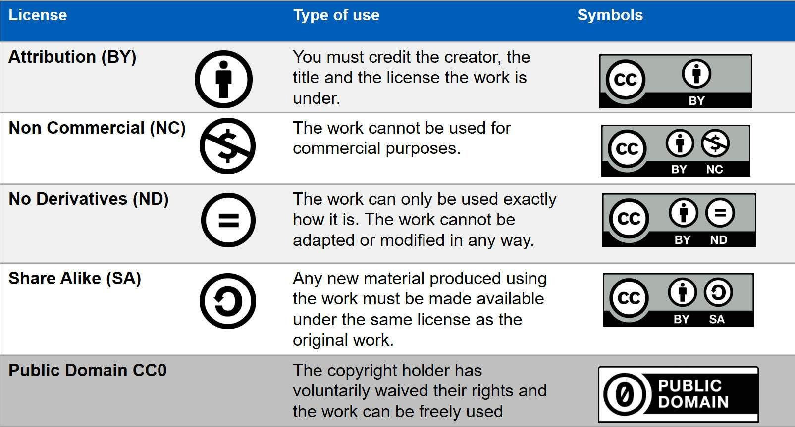
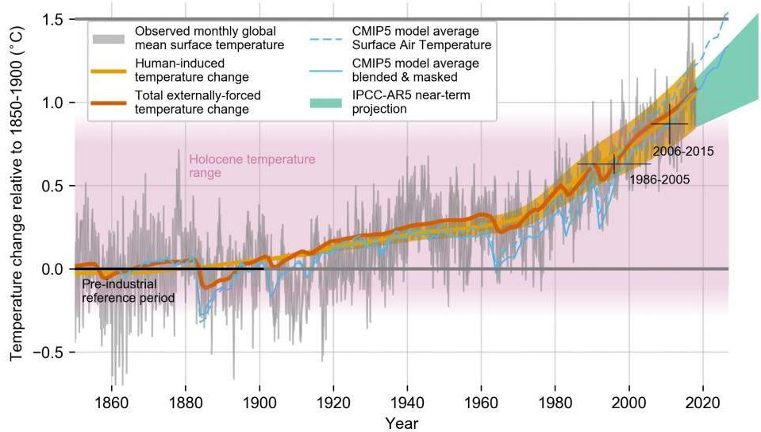

# Haciendo datos abiertos (open data)

## Índice

- [Descripción general](#resumen)
- [Objetivos de Aprendizaje](#learning-objectives)
- [Planificando para los Datos Abiertos](#planning-for-open-data)
- [Seleccionando Formatos y Herramientas de Datos para la Interoperabilidad](#selecting-data-formats-and-tools-for-interoperability)
- [Haciendo los Datos Reusables Mediante la Documentación](#making-the-data-reusable-through-documentation)
- [Haciendo los Datos Reusables Mediante Licencias](#making-the-data-reusable-through-licensing)
- [Lección 3: Resumen](#lesson-3-summary)
- [Lección 3: Revisión De Conocimientos](#lesson-3-knowledge-check)

## Descripción general

En esta lección, aprendes los criterios y las tareas necesarias para asegurar que los conjuntos de datos que creas sean abiertos y reutilizables. La lección comienza con una discusión sobre la creación de un plan de gestión de datos, continúa con temas sobre la selección de formatos de datos abiertos y cómo incluir metadatos, archivos Readme y control de versiones para sus datos. Se completa con una discusión sobre licencias abiertas para datos.

## Objetivos de aprendizaje

Después de completar este módulo, deberías poder:

- Evaluar y seleccionar formatos de datos abiertos.
- Añadir documentación que permita a otros investigadores evaluar la relevancia de los datos. Esto incluye metadatos, archivos README y control de versiones.
- Listar dos licencias abiertas comunes utilizadas para conjuntos de datos.

## Planificación de datos abiertos

La mejor práctica al comenzar su viaje de datos abiertos es crear un Plan de Gestión de Datos (PGD). Esto describe cómo administrará, preservará y publicará sus datos durante y después de un proyecto de investigación. Elementos comunes en los PGD relevantes para datos abiertos incluyen una descripción de lo siguiente:

|          |                                                                                   |
| -------- | --------------------------------------------------------------------------------- |
| ¿Qué?    | Formatos de datos y (cuando sea relevante) estándares          |
| ¿Cuándo? | Cuando y si compartir datos                                                       |
| ¿Dónde?  | Los repositorios previstos para archivar los datos                                |
| ¿Cómo?   | Cómo permite el plan la reutilización de datos                                    |
| ¿Quién?  | Roles y responsabilidades de los miembros del equipo en la implementación del PGD |

En esta lección, abordaremos algunas pasos comunes para generar datos. Específicamente, nos centraremos en el "qué" de hacer datos. Esto incluye, qué formatos de datos deben utilizarse y los estándares a seguir para que los datos sean tan abiertos y tan fáciles de usar como sea posible.

Como primer paso, compruebe si su institución o fuente de financiamiento tiene guías, estándares o plantillas para PGDs.

## Selección de Formatos de Datos y Herramientas para Interoperabilidad

### Consideraciones de Formato de Datos

Son preferibles los formatos de datos que son compatibles con los usados por la comunidad, legibles por computadora, libres, modificables y abiertos. Puede parecer que hay tantos formatos de datos como diferentes tipos de datos. Cuando piense en seleccionar un formato de datos, considere lo siguiente:

- ¿Es el formato compatible con el tipo, forma y tamaño de los datos?
- ¿El formato de datos tiene soporte adecuado para metadatos?
- ¿Hay herramientas disponibles para leer fácilmente el formato de los datos o se necesitan herramientas especializadas?
- ¿Se utiliza el formato de datos de forma rutinaria en su disciplina? Los estándares comunitarios garantizan compatibilidad, interoperabilidad y facilidad de uso al intercambiar o compartir datos entre investigadores u organizaciones de la misma comunidad.

Investiga si tu agencia de financiación, instituciones y/o repositorio de datos tiene requisitos adicionales o alguna guía sobre los formatos de datos.

### Formatos de datos no abiertos

Un formato de datos cerrado (sin soporte y o de propiedad privada) se refiere a un formato de archivo al que no se puede acceder libremente, no está estandarizado o ampliamente soportado por diferentes aplicaciones de software. Aquí hay algunos ejemplos de formatos de datos cerrados/con derechos de propiedad:

- **Adobe Photoshop (.psd):** El formato de archivo es propiedad de Adobe Photoshop, un popular software de edición de imágenes.
- **Microsoft Word (.doc/.docx):** Un formato de archivo con derechos de propiedad usado para almacenar datos de procesamiento de texto.
- **Dibujo automático (.dwg):** Un formato de datos con derechos de propiedad utilizado para el diseño asistido por ordenador (CAD).

Las aplicaciones de software que pueden leer pero no crear datos con formato DOC, PSD o DWG normalmente no soportan todas las características, capas, especificaciones y el funcionamiento interno del archivo original.

Algunos desafíos del uso de datos en formatos no abiertos incluyen:

- Problema al abrir el archivo debido a problemas de compatibilidad.
- La necesidad de instalar software o convertidores adicionales, lo que conduce a frustración y molestias.
- El contratiempo inicial atenúa el entusiasmo por usar tus datos.
- Convertir los datos a un formato universal puede llevar a un formato único o características que no se traducen bien, haciendo que los datos pierdan parte de su valor.
- Las nuevas políticas de datos abiertos pueden limitar el intercambio de datos privados, ya que a menudo no es compatible con el concepto de fácil distribución.

### Ejemplos de Formatos de Datos Abiertos

Algunos ejemplos de formatos de datos abiertos incluyen:

_Selecciona cada tarjeta para obtener más información._

|                                                                                                       |                                                                                                                                                                                                                  |
| ----------------------------------------------------------------------------------------------------- | ---------------------------------------------------------------------------------------------------------------------------------------------------------------------------------------------------------------- |
| Valores separados por comas (CSV)                                                  | Por simplicidad, legibilidad, compatibilidad, fácil intercambio de datos.                                                                                                                        |
| Formato de datos jerárquicos (HDF)                                                 | Para almacenar y recuperar datos de forma eficiente, compresión y soporte multidimensional.                                                                                                      |
| Formulario de datos comunes de red (NetCDF)                                        | Para autodescripción y portabilidad, subconjunto de datos eficiente (extracción de porciones específicas de conjuntos de datos grandes), estandarización e interoperabilidad. |
| Modelo de investigación-estudio- ensayo (ISA) para estudios de ciencias de la vida | Para la organización estructurada de datos, integración de datos e interoperabilidad entre experimentos, reproducibilidad y transparencia.                                                       |
| Sistema de transporte de imágenes flexible (FITS)                                  | Como estándar para datos astronómicos, metadatos y cabeceras de imagen flexibles y extenibles, compresión eficiente de datos y archivado de grandes conjuntos de datos.                          |
| Formato común de datos (CDF)                                                       | Para un formato auto-descriptivo legible en múltiples sistemas operativos, lenguajes de programación y entornos de software, datos multidimensionales e inclusión de metadatos.                  |

Al incorporar estándares abiertos, los autores pueden evitar barreras innecesarias y maximizar sus posibilidades de hacer que los datos sean útiles para sus comunidades.

## Hacer los datos reutilizables a través de la documentación

### Incorporación de documentación y metadatos para facilitar la reutilización

Los metadatos y la documentación de datos describen los datos para que otros y nosotros podamos usarlos y entenderlos mejor. Aunque los metadatos y la documentación están relacionados, hay una distinción importante. Los metadatos están estructurados, estandarizados y son legibles por computadora. La documentación no está estructurada y puede ser cualquier formato (a menudo un archivo de texto que acompaña los datos).

Para comprender mejor la documentación y los metadatos, tomemos un ejemplo de una receta de internet. Muchas de estas recetas comienzan con una larga descripción e historia de la receta, y tal vez consejos de cocina o repostería para el plato, antes de enumerar los ingredientes e instrucciones de cocción paso a paso.

- Los ingredientes e instrucciones son como los metadatas. Se pueden indexar y buscar a través de Google y otros motores de búsqueda.
- El texto descriptivo que incluye el fondo y el contexto de la receta son como la documentación. Son más libres, y no estandarizados.

Ya discutimos los metadatos antes en este módulo, ¡pero es lo suficientemente importante como para que nos repitamos un poco! También discutiremos otros tipos de documentación, como los archivos README.

### Metadatos: para humanos y máquinas

Los metadatos pueden facilitar la evaluación de la calidad del conjunto de datos y el intercambio de datos respondiendo a preguntas clave. También es la principal forma en que los usuarios encontrarán información sobre su conjunto de datos. Incluye información clave sobre temas, como:

- Cómo se recolectaron y procesaron los datos
- Qué variables/parámetros se incluyen en el conjunto de datos
- Qué variables están incluidas y con qué variables están relacionadas
- Quién recopiló los datos (equipo científico, organización, etc.)
- Cómo y dónde encontrar los datos (p. ej., DOI)
- Cómo citar los datos
- Qué región espacio-temporal / tiempo cubren los datos
- Toda información legal, directriz o estándar sobre los datos

### ¿Por qué añadir metadatos?

Los metadatos mejoran la búsqueda y la accesibilidad de los datos permitiendo potencialmente tanto a los humanos como a las computadoras leer e interpretar los conjuntos de datos. Los beneficios de crear metadatos sobre tus datos incluyen:

- Ayuda a los usuarios a entender los datos y si/cómo pueden ser usados/citados.
- Ayuda a los usuarios a ubicar los datos, especialmente cuando los metadatos son legibles y están estandarizados para ser interpretados por aplicaciones.
- Puede facilitar el análisis con herramientas de software que interpretan metadatos estandarizados (por ejemplo, Xarray).

Para ser legibles por las computadoras, los metadatos deben haber sido estandarizados. Un ejemplo de un estándar aceptado por la comunidad para etiquetar conjuntos de datos climáticos son las [Convenciones de CF](http://cfconventions.org/).

También hay paquetes de software que pueden leer metadatos y mejorar la experiencia del usuario de manera significativa. Por ejemplo, [Xarray](https://docs.xarray.dev/en/stable/index.html) es un paquete de software desarrollado por la comunidad de código abierto que se utiliza ampliamente en la climatología y la biomédicina, entre muchas otras disciplinas. Según su sitio web, "¡Xarray hace que trabajar con matrices multidimensionales con etiquetas en Python sea simple, eficiente y divertido!". ¡Es la parte "etiquetada" donde entran los metadatos estandarizados! Xarray puede interpretar los nombres de las variables y las dimensiones sin el aporte del usuario, haciendo el flujo de trabajo más fácil y menos propenso a cometerse errores (Ej. Los usuarios no tienen que recordar qué eje corresponde al "tiempo" - sólo tienen que llamar al eje con la etiqueta "tiempo").

Existen muchos estándares para los campos y estructuras de los metadatos para describir la información general de los datos. Utilice un estándar de su dominio cuando corresponda, o uno que sea solicitado por su repositorio de datos.

### Mejores prácticas de etiquetado de los metadatos

Metadatos útiles e informativos:

- Utiliza estándares que se usan comúnmente en tu campo.
- Cumple con los principios FAIR (Encontrable, Accesible, Interoperable y Reutilizable).
- Es lo más descriptivo posible.
- Es autodescriptivo.

Recuerda que cuantos más metadatos añadas, más fácil será para los usuarios de tus datos utilizarlos de manera eficaz. Cuando dudes:

- Busca y cumple con los estándares de repositorio/comunidad.
- Investiga recursos de ciencia abierta en línea para los metadatos, por ejemplo, [Turing Way.] (Vía Turística.)(https://the-turing-way.netlify.app/reproducible-research/rdm/rdm-metadata.html)

**NASA Metadata Tagging Addendum**

SPD-41a requires metadata fields that validate the scientific conclusions of publications. Los metadatos deben:

- Ser robustos, cumplir con los estándares y describir los datos de forma clara y explícita.
- Tener replicabilidad y/o poder combinarse en diferentes ajustes.
- Incluir información sobre cómo se recolectaron los datos (por ejemplo, qué equipo/instrumentos se utilizaron).
- Incluir información sobre qué variables/parámetros fueron incluidos en este conjunto de datos.

### Documentación de acompañamiento

Al crear sus datos, además de añadir metadatos, es una buena práctica crear un documento al que los usuarios puedan hacer referencia. El documento puede hacerse como un archivo README, una guía de usuario o incluso de inicio rápido (o bien los tres).

README and other documentation files can include information such as:

- Contact information
- Information about variables
- Information about uncertainty
- Data collection methods
- Versioning and license references
- Information about the structure and file naming of the data
- References to publications that describe the dataset and/or it's processing

The intent is to help users quickly understand how they might use the data and to answer any commonly asked questions about your data. You can read more information and view a README template along with an example (particularly relevant for the medical sciences) at [this Harvard Medical School website.](https://datamanagement.hms.harvard.edu/collect-analyze/documentation-metadata/readme-files)

### Data Versioning Guidelines

Establish a versioning schema for your data. This is a method for keeping track of iterations of data that features track changes and the ability to revert to a previous revision.

Proper versioning generates a changed copy of a data object that is uniquely labeled with a version number. This enables users to track changes and correct errors.

Proper versioning preserves data quality and provenance (the origin, history, and processing steps that lead to the dataset) by:

- Providing a record of traceability from the data's source through all aspects of its transmission, storage, and processing to its final form.
- Saving data files at key steps along the way.
- Aiming for downstream verification/validation of original findings.

## Making the Data Reusable Through Licensing

Image source: [xkcd.com](https://www.explainxkcd.com/wiki/index.php/File:copyright.jpg)

---

Data is the intellectual property of the researcher(s), or possibly of their funder(s) or supporting institution(s). Data is intellectual property, but that does not mean it cannot be used by other researchers (with appropriate attribution).

"By applying a license to your work, you make clear what others can do with the things you're sharing, and also the conditions under which you're providing them (like cite you). You can also require others who copy your work to do things in return."

**[Open Science Knowledge Base](https://www.cos.io/)**

---

If you don't license your work, others can’t/shouldn’t re-use it - even if you want them to. As mentioned previously in this module, a license is a legal document that tells users how they can use the dataset. It is important to understand the licensing conditions of a dataset before data reuse to avoid any copyright infringement or other intellectual property issues.

A dataset without a license does not mean that the data is open; using a licenseless dataset is not ethical. Contacting the data creator and getting explicit permission, while suggesting they apply a license, is the best path forward.

Understanding when and where the license applies is crucial. For example, data created using US Government public research funds is, by default, in the public domain. However, that only applies to the jurisdiction of the United States. In order for this to apply internationally, data creators need to select an open license.

There are several different types of licenses that build on each other. Creative Commons (CC) licenses are often used for datasets. CC0 (also known as "public domain") is the license that allows for the most reuse because it has the least restrictions on what users can do with it. Although the CC0 license does not explicitly require citation, you should still follow community best practices and cite the data source. CC-BY is another common license used for scientific data that requires citation. From there, you can add restrictions around commercial use, ability to adapt or modify the data, or requirements to share with the same license. These other flavors all reduce usability by adding restrictions, such that other scientists may be unable to use the data because of institutional or legal restrictions. Funding agencies may require use of a specific license. For public agencies, this is often CC-0 or CC-BY, to maximize their return on investment and ensure widest possible re-use.

### Example Data Licenses and Reuse

Here is an example of how a data license can affect reuse. Coupled Model Intercomparison Project Phase 6 (CMIP6) consists of the "runs" from around 100 distinct climate models being produced across 49 different modeling groups. This is the data that is used to understand what our future climate might look like. You have probably seen images that use this data in articles about Earth’s changing climate and how it may impact our lives. Previous versions of these data were licensed CC-BY-NC-SA (cite-noncommercial- sharealike).

Figure citation: IPCC "[Framing and Context in : In: Global warming of 1.5°C. An IPCC Special Report](https://www.researchgate.net/publication/369301788_Framing_and_Context_in_In_Global_warming_of_15C_An_IPCC_Special_Report?_tp=eyJjb250ZXh0Ijp7ImZpcnN0UGFnZSI6Il9kaXJlY3QiLCJwYWdlIjoiX2RpcmVjdCJ9fQ)" 2020

---

This meant that any commercial use was restricted. Insurance companies, global corporations, and any type of organization that wanted to use them for commercial use - were having to do their own modeling or just deciding to not develop resources related to climate projections (such as fire risk, flooding risk, and how that may affect transportation, commerce, and where we live). This directly impacted the reuse of this data and created additional work. The [latest version of CMIP data is moving to CC-BY](https://pcmdi.llnl.gov/CMIP6/TermsOfUse/TermsOfUse6-2.html) because of the negative impacts from the -NC-SA restrictions.

## Lesson 3: Summary

Following are the key takeaways from this lesson:

- It is best practice to create an open data management plan that includes open-related topics.
- A critical step to making open data is evaluating and selecting open data formats.
- Always add documentation that enables other researchers to assess the relevance and reusability of your product. This includes metadata, README files, and version control details.
- It is important to assign an open license to your data to enable reuse.

## Lesson 3: Knowledge Check

Answer the following questions to test what you have learned so far.

_Question_

**01/04**

Which of the following are steps you should take when making a Data Management Plan?

- Evaluate different data formats
- Test your metadata for compliance
- Create a small collection of test data

_Question_

**02/04**

Which of the following are considerations when choosing a file format?

- The format has adequate metadata support
- Tools are readily available to read the data format
- The data format is widely used in your community
- All of the above

_Question_

**03/04**

Read the statement below and decide whether it's true or false.

_Metadata is only useful for using data in interoperable tools and does not enhance searchability and findability of data._

- True
- False

_Question_

**04/04**

Read the statement below and decide whether it's true or false.

_When a dataset does not explicitly require citation, such as the CC0 license, it is still recommended that you cite the data source._

- True
- False
