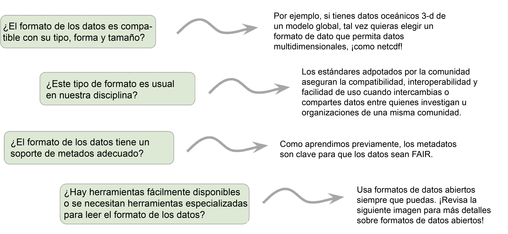

# Lección 3: Hacer Datos Abiertos

## Contenidos

- [Descripción general](#overview)
- [Objetivos de aprendizaje](#learning-objectives)
- [Planificar para Datos Abiertos](#planning-for-open-data)
- [Seleccionar formatos de datos y herramientas para la interoperabilidad](#selecting-data-formats-and-tools-for-interoperability)
- [Hacer que los datos sean reusables mediante la documentación](#making-the-data-reusable-through-documentation)
- [Hacer que los datos sean reusables mediante las licencias](#making-the-data-reusable-through-licensing)
- [Lección 3: Resumen](#lesson-3-summary)
- [Lección 3: Evaluación](#lesson-3-knowledge-check)

## Descripción general

En esta lección, aprenderás los criterios y las tareas necesarias para asegurar que los conjuntos de datos que creas sean abiertos y reusables. La lección comienza con una discusión sobre la creación de un plan de gestión de datos, continúa con temas sobre la selección de formatos de Datos Abiertos y cómo incluir metadatos, archivos README (léeme) y control de versiones para tus datos. Se completa con una discusión sobre licencias abiertas para los datos.

## Objetivos de aprendizaje

Al finalizar esta lección deberías ser capaz de:

- Evaluar y seleccionar formatos de Datos Abiertos.
- Añadir documentación que permita a otras personas investigadoras evaluar la relevancia de los datos. Esto incluye metadatos, archivos README y control de versiones.
- Listar dos licencias abiertas comunes utilizadas para conjuntos de datos.

## Planificar para Datos Abiertos

La mejor práctica al comenzar su viaje de Datos Abiertos es crear un Plan de Gestión de Datos (PGD). Un PGD describe cómo se administrarán, se preservarán y se publicarán los datos durante y después de un proyecto de investigación. Entre los elementos comunes de los PGD relevantes para los Datos Abiertos se incluye una descripción de lo siguiente:

|          |                                                                                   |
| -------- | --------------------------------------------------------------------------------- |
| ¿Qué?    | Formato y (si es relevante) estándares de datos                |
| ¿Cuándo? | Cuándo compartir los datos y si hacerlo                                   |
| ¿Dónde?  | Los repositorios destinados a datos archivados                                    |
| ¿Cómo?   | Cómo permite el plan el reuso de los datos                                        |
| ¿Quién?  | Roles y responsabilidades de los miembros del equipo en la implementación del PGD |

En esta lección, abordaremos algunos pasos comunes para generar datos. Específicamente, nos centraremos en el "qué" de hacer datos. Esto incluye, qué formatos de datos deben utilizarse y los estándares a seguir para que los datos sean tan abiertos y tan fáciles de usar como sea posible.

Como primer paso, comprueba si tu institución o organismo de financiamiento tiene guías, normas o plantillas para PGDs.

## Seleccionar formatos de datos y herramientas para interoperabilidad

### Consideraciones del formato de los datos

Son preferibles los formatos de datos que son compatibles con los usados por la comunidad, legibles por computadora, libres, modificables y abiertos. Puede parecer que hay tantos formatos de datos como diferentes tipos de datos. Cuando pienses en seleccionar un formato de datos, considera lo siguiente:

- ¿Es el formato compatible con el tipo, forma y tamaño de los datos?
- ¿Tiene el formato de datos un soporte de metadatos adecuado?
- ¿Hay herramientas disponibles, o se necesitan herramientas especializadas para leer el formato de los datos?
- ¿El formato de los datos se utiliza habitualmente en tu disciplina? Las normas comunitarias garantizan la compatibilidad, interoperabilidad y facilidad de uso a la hora de intercambiar o compartir datos entre personas investigadoras u organizaciones de la misma comunidad.

Consulta si tu organismo de financiación, institución o repositorio de datos tiene requisitos adicionales o alguna guía sobre los formatos de datos.

### Formatos de datos no abiertos

Un formato de datos no abierto (sin soporte, cerrado y/o de propiedad privada) se refiere a un formato de archivo que no es de libre acceso, no está estandarizado o ampliamente soportado por diferentes aplicaciones de software. Aquí hay algunos ejemplos de formatos de datos cerrados/con derechos de propiedad:

- **Adobe Photoshop (.psd):** El formato de archivo es propiedad de Adobe Photoshop, un popular software de edición de imágenes.
- **Microsoft Word (.doc):** Un formato de archivo con derechos de propiedad usado para almacenar datos de procesamiento de texto.
- **Dibujo automático (.dwg):** Un formato de datos con derechos de propiedad utilizado para el diseño asistido por ordenador (CAD).

Las aplicaciones de software que pueden leer pero no crear datos con formato DOC, PSD o DWG normalmente no soportan todas las características, capas, especificaciones y el funcionamiento interno del archivo original.

Algunos desafíos del uso de datos en formatos no abiertos incluyen:

- Dificultad para abrir el archivo debido a problemas de compatibilidad.
- La necesidad de instalar software o convertidores adicionales, lo que genera frustración y molestias.
- El contratiempo inicial frena el entusiasmo por utilizar tus datos.
- La conversión de los datos a un formato universal puede llevar a un formato con características únicas que no se traducen bien, y hace que los datos pierdan parte de su valor.
- Las nuevas políticas de Datos Abiertos pueden limitar el intercambio de datos privados, ya que a menudo no es compatible con el concepto de  distribución fácil.

### Ejemplos de Formatos de Datos Abiertos

Algunos ejemplos de formatos de Datos Abiertos son:

_Selecciona cada tarjeta para obtener más información._

|                                                                                                                                 |                                                                                                                                                                                                                                                                                                              |
| ------------------------------------------------------------------------------------------------------------------------------- | ------------------------------------------------------------------------------------------------------------------------------------------------------------------------------------------------------------------------------------------------------------------------------------------------------------ |
| Valores separados por comas (_Comma Separated Values_, CSV)                                                    | Por simplicidad, legibilidad, compatibilidad y facilidad para compartir datos.                                                                                                                                                                                                               |
| Formato de datos jerárquicos (_Hierarchical Data Format_, HDF)                                                  | Para almacenar y recuperar datos de forma eficiente, con compresión y soporte multidimensional.                                                                                                                                                                                              |
| Formato de datos comunes en red (_Network Common Data Form_,NetCDF)                                                                            | Permite la autodescripción y portabilidad de los datos, ofrece la posibilidad de seleccionar eficientemente subconjuntos de datos (extracción de porciones específicas de conjuntos de datos grandes), mejora la estandarización e interoperabilidad de los datos. |
| Modelo de Investigación-Estudio-Ensayo (_Investigation-Study-Assay_, ISA) para estudios de ciencias biológicas | Para la organización estructurada de datos, integración de datos e interoperabilidad entre experimentos, reproducibilidad y transparencia.                                                                                                                                                   |
| Sistema de transporte de imágenes flexible (_Flexible Image Transport System_, FITS)                           | Como un estándar para datos astronómicos, metadatos flexibles y extensibles y encabezados de imágenes, compresión de datos eficiente y archivo de grandes conjuntos de datos.                                                                                                              |
| Formato común de datos (_Common Data Format_, CDF)                                                             | Para un formato auto-descriptivo legible en múltiples sistemas operativos, lenguajes de programación y entornos de software, datos multidimensionales e inclusión de metadatos.                                                                                                              |

Al adoptar normas abiertas, las personas autoras pueden evitar barreras innecesarias y maximizar sus posibilidades de hacer que los datos sean útiles para sus comunidades.

## Hacer que los datos sean reusables mediante la documentación

### Incorporación de documentación y metadatos para la reusabilidad

Los metadatos y la documentación de datos describen los datos para que otras personas y también nosotros podamos usarlos y entenderlos mejor. Aunque los metadatos y la documentación están relacionados, hay una distinción importante. Los metadatos están estructurados, estandarizados y son legibles por computadora. La documentación no está estructurada y puede tener cualquier formato (a menudo, un archivo de texto que acompaña a los datos).

Para comprender mejor la documentación y los metadatos, tomemos un ejemplo de una receta de internet. Muchas de estas recetas incluyen, antes de enumerar los ingredientes y las instrucciones de preparación paso a paso, una larga descripción e historia de la receta, y tal vez consejos para la cocción u horneado de ese plato.

- Los ingredientes y las instrucciones son como los metadatos. Se pueden indexar y buscar a través de Google y otros motores de búsqueda.
- El texto descriptivo que incluye el fondo y el contexto de la receta equivalen a la documentación. Son más flexibles y no están estandarizados.

Ya hablamos de los metadatos antes en este módulo, pero son tan importantes que vamos a insistir un poco más. También hablaremos de otros tipos de documentación, como los archivos README.

### Metadatos: para humanos y máquinas

Los metadatos pueden ayudar en la evaluación de la calidad del conjunto de datos y al intercambio de datos respondiendo a preguntas clave. Son también la principal forma en que los usuarios van a encontrar la información sobre un conjunto de datos. Incluye información clave sobre temas, como:

- Cómo se recolectaron y procesaron los datos
- Qué variables/parámetros se incluyen en el conjunto de datos
- Qué variables están incluidas y con qué variables están relacionadas
- Quién recopiló los datos (equipo científico, organización, etc.)
- Cómo y dónde encontrar los datos (por ejemplo, DOI)
- Cómo citar los datos
- Qué región espacio-temporal / tiempo cubren los datos
- Toda información legal, directriz o estándar sobre los datos

### ¿Por qué incluir los metadatos?

Los metadatos mejoran la búsqueda y la accesibilidad de los datos permitiendo potencialmente tanto a los humanos como a las computadoras leer e interpretar los conjuntos de datos. Los beneficios de crear metadatos sobre tus datos incluyen:

- Ayuda a los usuarios a entender qué son los datos y, en caso en que puedan ser utilizados, como hacerlo y citarlos. 
- Ayuda a los usuarios a ubicar los datos, especialmente cuando los metadatos son legibles y están estandarizados para ser interpretados por aplicaciones.
- Puede facilitar el análisis con herramientas informáticas que interpreten metadatos estandarizados (por ejemplo, Xarray).

Para ser legibles por las computadoras los metadatos deben haber sido estandarizados. MIra un ejemplo de un estándar aceptado por la comunidad para etiquetar conjuntos de datos climáticos con las [Convenciones de CF](http://cfconventions.org/).

También hay paquetes de software que pueden leer metadatos y, como resultado, mejorar significativamente la experiencia de la persona usuaria. Por ejemplo, [Xarray](https://docs.xarray.dev/en/stable/index.html) es un paquete de software de Código Abierto desarrollado por la comunidad que se utiliza ampliamente en los campos climático y biomédico, entre muchos otros. Según su sitio web, "¡Xarray hace que trabajar con matrices multidimensionales con etiquetas en Python sea simple, eficiente y divertido!". ¡Es en la parte "etiquetada" donde entran los metadatos estandarizados! Xarray puede interpretar los nombres de las variables y las dimensiones sin el aporte de la persona usuaria, haciendo el flujo de trabajo más fácil y menos propenso a cometer errores. Por ejemplo, quienes lo utilizan no tienen que recordar qué eje corresponde al "tiempo", sólo tienen que llamar al eje con la etiqueta "tiempo".

Existen muchas normas sobre los campos de metadatos y la estructura para describir la información general de los datos. Utiliza un estándar de su dominio cuando corresponda, o uno que sea solicitado por tu repositorio de datos.

### Mejores prácticas de etiquetado de los metadatos

Metadatos útiles e informativos:

- Utiliza estándares que se usan comúnmente en tu campo.
- Cumple con los principios FAIR (Fácil de encontrar, Accesible, Interoperable y Reusable).
- Son lo más descriptivos posible.
- Se autodescriben.

Recuerda que cuantos más metadatos añadas, más fácil será para las personas usuarias de tus datos utilizarlos de manera eficaz. Cuando tengas dudas:

- Busca y cumple con los estándares de tu repositorio o comunidad.
- Investiga recursos de Ciencia Abierta en línea para los metadatos, por ejemplo, [The Turing Way](https://the-turing-way.netlify.app/reproducible-research/rdm/rdm-metadata.html)

**Anexo de etiquetado de metadatos de la NASA**

SPD-41a requiere campos de los metadatos que validen las conclusiones científicas de las publicaciones. Los metadatos deben:

- Ser robustos, cumplir con los estándares y describir los datos de forma clara y explícita.
- Tener replicabilidad y/o poder combinarse en diferentes entornos.
- Incluir información sobre cómo se recolectaron los datos (por ejemplo, qué equipos o instrumentos se utilizaron).
- Incluir información sobre qué variables o parámetros fueron incluidos en este conjunto de datos.

### Documentación complementaria

Al crear tus datos, además de añadir metadatos, es una buena práctica crear un documento al que las personas usuarias puedan hacer referencia. El documento puede hacerse como un archivo README, una guía de usuario o incluso una guía de inicio rápido (o bien los tres).

Los archivos README y otros archivos de documentación pueden incluir información como:

- Datos de contacto
- Información acerca de las variables
- Información sobre la incertidumbre
- Métodos de recopilación de datos
- Referencias de versiones y licencias
- Información sobre la estructura y el nombre de archivo de los datos
- Referencias a publicaciones que describen el conjunto de datos y/o su procesamiento

La intención es ayudar a las personas usuarias a entender rápidamente cómo pueden usar los datos y responder a preguntas comunes que se hagan sobre tus datos. Puedes leer más información y ver una plantilla de README junto con un ejemplo (particularmente relevante para las ciencias médicas) en [este sitio web de la Escuela Médica de Harvard.](https://datamanagement.hms.harvard.edu/collect-analyze/documentation-metadata/readme-files) (en inglés).

### Pautas para el versionado de datos

Establece un esquema de versiones para tus datos. Este es un método para mantener un seguimiento de las iteraciones de los datos que muestran el seguimiento de los cambios y la capacidad de revertirlos a una revisión anterior.

El control de versiones genera una copia modificada de un objeto de datos que está únicamente etiquetado con un número de versión. Esto permite a las personas usuarias rastrear cambios y corregir los errores.

La versión adecuada preserva la calidad y la procedencia de los datos (el origen, la historia y los pasos de procesamiento que conducen al conjunto de datos) al:

- Proporcionar un registro de trazabilidad desde la fuente de los datos a través de todos los aspectos de su transmisión, almacenamiento y procesamiento hasta su forma final.
- Guardar los archivos de datos en pasos clave a lo largo del proceso.
- Apuntar a la verificación/validación de la descarga respecto a los hallazgos originales.

## Hacer que los datos sean reusables mediante las licencias

Fuente de la imagen: [xkcd.com](https://www.explainxkcd.com/wiki/index.php/File:copyright.jpg)
El personaje de la viñeta reflexiona: "A veces simplemente no puedo indignarme por la ley de derechos de autor."

---

Los datos son propiedad intelectual de quienes investigan, o posiblemente de quien financia o de la institución que apoya. Los datos son propiedad intelectual, pero eso no significa que no puedan ser utilizados por otras personas investigadoras (con la debida atribución).

"Al aplicar una licencia a tu trabajo, dejas claro lo que otras personas pueden hacer con las cosas que estás compartiendo, y también las condiciones bajo las que los estás proporcionando (como citarte). También puedes exigir a quienes copien tu trabajo que hagan cosas a cambio."

**[Base de Conocimiento de Ciencia Abierta (_Open Science Knowledge Base)_](https://www.cos.io/)**

---

Si no licencias tu trabajo, otras personas no pueden -o no deberían- volver a usarlo aunque quisieras. Como se mencionó previamente en este módulo, una licencia es un documento legal que le dice a las personas usuarias cómo pueden utilizar el conjunto de datos. Es importante entender las condiciones de la licencia de un conjunto de datos antes de su reutilización, para evitar cualquier infracción de derechos de autoría u otras cuestiones de propiedad intelectual.

Un conjunto de datos sin licencia no significa que los datos estén abiertos; el uso de un conjunto de datos sin licencia no es algo ético. Contactar con quien haya creado los datos y obtener los permisos explícitos, suponiendo que aplican una licencia, es el mejor camino a seguir.

Es crucial entender cuándo y dónde se aplica la licencia. Por ejemplo, los datos creados con fondos públicos de investigación del Gobierno de los Estados Unidos son, por defecto, de dominio público. Sin embargo, esto solo aplica a la jurisdicción de los Estados Unidos. Para que esto se aplique internacionalmente, quienes crean datos deben seleccionar una licencia abierta.

Existen varios tipos diferentes de licencias que se construyen entre sí. Las licencias Creative Commons (CC) son utilizadas a menudo para conjuntos de datos. CC0 (también conocido como "dominio público") es la licencia que permite la mayor reutilización porque tiene las menores restricciones sobre lo que las personas usuarias pueden hacer. Aunque la licencia CC0 no requiere explícitamente de citas, debes seguir las mejores prácticas de la comunidad y citar la fuente de los datos. CC-BY es otra licencia común utilizada para datos científicos que requiere citación. A partir de ahí, puedes añadir restricciones sobre el uso comercial, la capacidad de adaptar o modificar los datos o requisitos para compartir con la misma licencia. Estas decisiones reducen la usabilidad al añadir restricciones, por lo que otras personas que hacen ciencia no podrán utilizar los datos debido a impedimentos institucionales o legales. Las agencias de financiación pueden requerir el uso de una licencia en específico. Para las agencias públicas, a menudo es CC-0 o CC-BY, para maximizar su rentabilidad de la inversión y asegurar la reutilización más amplia posible.

### Ejemplo de licencias de datos y su reuso

Aquí hay un ejemplo de cómo una licencia de datos puede afectar el reuso. La Fase 6 del Proyecto de Intercomparación de Modelo Acoplado (_Coupled Model Intercomparison Project Phase 6_ [CMIP6]) consiste en "correr" alrededor de 100  modelos climáticos distintos que se están produciendo mediante 49 grupos de modelado diferentes. Estos son los datos que son utilizados para entender cómo podría ser nuestro futuro clima. Tú probablemente hayas visto imágenes que usan estos datos en artículos sobre el cambio climático de la Tierra y cómo puede impactar en nuestras vidas. Las versiones anteriores de estos datos contaban con licencia CC-BY-NC-SA (licencia Creative Commons: atribución, no comercial, compartir igual).

Fuente: [Framing and Context in: Global warming of 1.5°C. An IPCC Special Report](https://www.researchgate.net/publication/369301788_Framing_and_Context_in_In_Global_warming_of_15C_An_IPCC_Special_Report) de 2020 (en inglés).

---

Esto significó que cualquier uso comercial estaba restringido. Empresas de seguro, corporaciones globales, y cualquier tipo de organización que quisiera utilizarlos para fines comerciales estaban teniendo que hacer su propio modelado o, simplemente, decidiendo no desarrollar recursos relacionados con proyecciones climáticas (como riesgo de incendios, riesgo de inundaciones, y cómo eso puede afectar al transporte, al comercio y al lugar donde vivimos). Esto afectó directamente a la reutilización de estos datos y creó trabajo adicional. [La última versión de los datos CMIP se está moviendo a CC-BY](https://pcmdi.llnl.gov/CMIP6/TermsOfUse/TermsOfUse6-2.html) (en inglés) debido a los impactos negativos de las restricciones: NC-SA (no comercial y compartir igual).

## Lección 3: Resumen

Conclusiones principales de esta lección:

- Es una buena práctica crear un plan abierto de gestión de datos que incluya temas relacionados con la apertura.
- Un paso crítico para hacer Datos Abiertos es la evaluación y la selección de formatos de Datos Abiertos.
- Siempre añadir documentación que permita a otras personas que investigan evaluar la relevancia y la reutilización de tu producto. Esto incluye a los metadatos, archivos README y los detalles del control de versiones.
- Es importante asignar una licencia abierta a tus datos para permitir su reutilización.

## Lección 3: Evaluación

Responde las siguientes preguntas para poner a prueba lo que has aprendido hasta ahora.

_Pregunta_

**01/04**

¿Cuáles de los siguientes son los pasos que debes tomar al crear un plan de gestión de datos?

- Evaluar diferentes formatos de datos
- Comprobar la conformidad de los metadatos
- Crear una pequeña colección de datos de prueba

_Pregunta_

**02/04**

¿Cuáles de las siguientes son aspectos a considerar al elegir un formato de archivo?

- El formato tiene soporte adecuado para los metadatos
- Las herramientas están disponibles para leer el formato de datos
- El formato de datos es ampliamente utilizado en tu comunidad
- Todas las anteriores

_Pregunta_

**03/04**

Lee la siguiente afirmación y decide si es Verdadera o Falsa.

_Los metadatos sólo son útiles para usar los datos en herramientas interoperables y no mejoran la capacidad de búsqueda y localización de los datos._

- Verdadero
- Falso

_Pregunta_

**04/04**

Lee la siguiente afirmación y decide si es Verdadera o Falsa.

_Cuando un conjunto de datos no requiere explícitamente citas, como la licencia CC0, igualmente se recomienda que cites la fuente de datos._

- Verdadero
- Falso
