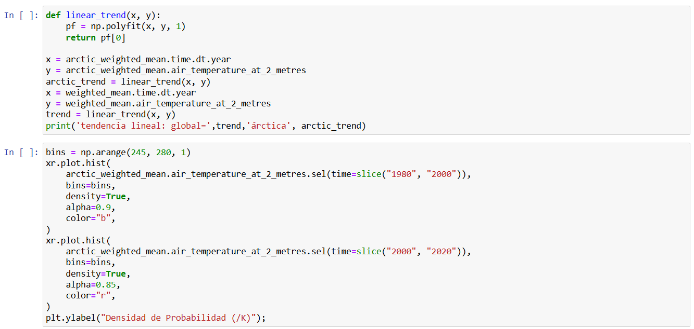
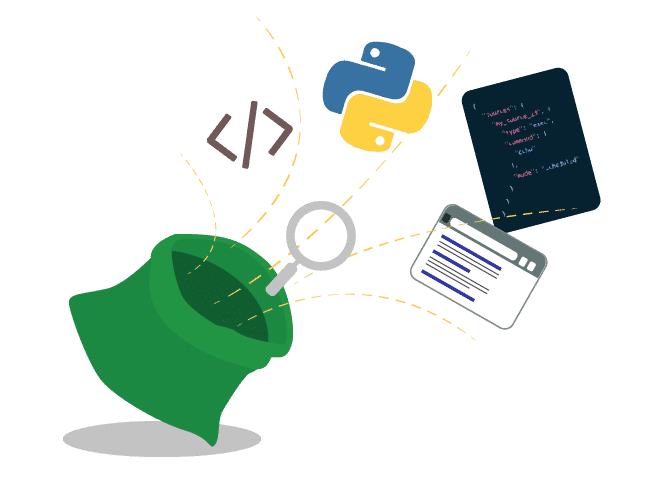
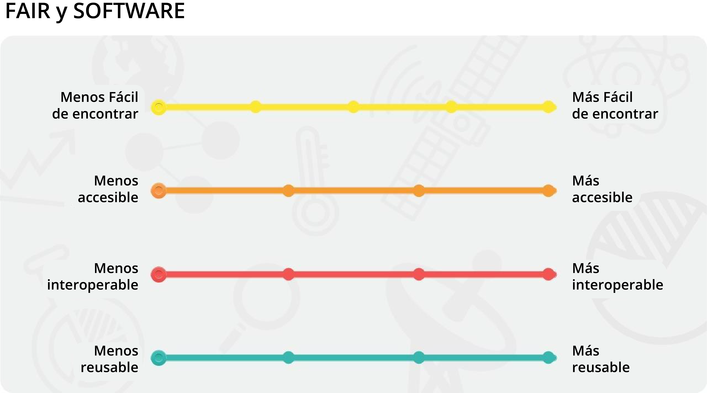

# Lección 1: Introducción al Código Abierto

## Contenidos

- [Historias de éxito](#historias-de-%C3%A9xito)
- [Definiciones y consideraciones del Código Abierto](#definici%C3%B3n-y-consideraciones-del-c%C3%B3digo-abierto)
- [Principios, beneficios y desafíos](#principios-beneficios-y-desaf%C3%ADos)
- [Cuándo no compartir](#cuando-no-compartir)
- [Plan de Gestión de Software (PGS)](#plan-de-gesti%C3%B3n-de-software-pgs)
- [Lección 1: Resumen](#lecci%C3%B3n-1-resumen)
- [Lección 1: Evaluación](#lecci%C3%B3n-1-evaluaci%C3%B3n)

## Descripción general

Esta lección define los términos clave, los principios básicos, los beneficios y los desafíos del Código Abierto. La práctica de desarrollar código y ponerlo a disposición del público se da dentro de un espectro que va de más a menos protegido. Las condiciones éticas y legales pueden limitar el grado de apertura que pueden permitirse quienes investigan. En esta lección se presentarán las preguntas críticas que hay que tener en cuenta a la hora de determinar la accesibilidad adecuada del código para personas usuarias externas, junto con las mejores prácticas para superar las limitaciones habituales y maximizar la disponibilidad. La lección finaliza con una discusión sobre el ciclo de vida del software y cómo encaja en el sistema de "Usar, Hacer, Compartir" y su relación con un Plan de Gestión.

## Objetivos de aprendizaje

Al finalizar esta lección deberías ser capaz de:

- Definir software de Código Abierto y distinguirlo del software de código cerrado.
- Enumerar los beneficios y los desafíos más comunes de la producción de Código Abierto y describir cómo quienes investigan pueden responder a algunos de los desafíos al tiempo que maximizan la apertura, cuando sea posible.
- Describir la función y el propósito de un Plan de Gestión de Software, y su uso como una guía para todos los involucrados en un proyecto científico.

## Historias de éxito

¿Por qué las buenas prácticas científicas demandan que las personas que investigan abran el acceso a su código? Compartir el código (y los datos) facilita que otras personas reproduzcan los resultados, lo que ayuda a validar los descubrimientos y a reducir los recursos necesarios para duplicar los experimentos. Como beneficio adicional, esta decisión puede dar lugar a nuevas colaboraciones que son posibles gracias a un conjunto de datos compartido y a una comprensión común del material científico.

Muchas revistas y agencias de financiación exigen compartir el código en el momento de la publicación. Sin embargo, la perspectiva de abrir el código a críticas, no recibir reconocimiento adecuado o no participar de un resultado que descubran equipos de investigación externos, puede disuadir a quienes hacen ciencia de hacer su código de Acceso Abierto. ¿Qué pasaría si alguien encuentra un error? ¿Y si critican el estilo de la codificación? ¿Y si usan el código y publican un nuevo resultado sin incluirnos? Este módulo está orientado a ayudarte a ganar confianza a la hora de compartir tu código, ya que recorreremos los detalles básicos a tener en cuenta al poner en práctica la Ciencia Abierta.

Repasemos algunos ejemplos conocidos de grupos que compartieron su código, y cuáles fueron los impactos:

Los botones pueden utilizarse para navegar entre los ejemplos.

La primera imagen de un agujero negro no habría sido posible en esta década si todo el código necesario hubiera tenido que ser escrito únicamente por las personas científicas involucradas. Éstas pudieron utilizar un software de Código Abierto bien probado y aceptado por la comunidad para realizar sus análisis y crear esta imagen ahora famosa. La Dra. Katie Bouman y su equipo elogiaron el papel fundamental que desempeñaron quienes colaboraron con el Código Abierto en el esfuerzo de su equipo por obtener imágenes del primer agujero negro. Este avance fue posible gracias a las librerías de Código Abierto, que ofrecían un código robusto y de libre acceso. El código utilizado para capturar esta imagen fue creado por 21.485 personas. Los sofisticados algoritmos y pipelines iterativos de procesamiento de datos utilizados por el equipo de la Dra. Bouman fueron desarrollados y probados por la comunidad, lo que hizo posible una ciencia robusta y reproducible sin tener que reescribir cada pieza de software necesaria.

Este es el helicóptero "Ingenuity", o como lo llaman los ingenieros, Ginny. Llegó a Marte haciendo autostop en el explorador Perseverance, que aterrizó en el cráter Jezero en 2021.

Este es un vídeo del primer vuelo de Ginny. Despegó, se elevó unos tres metros del suelo, dio una vuelta y aterrizó. Este vuelo pionero demostró que es posible volar a Marte con propulsión y abrió las puertas a una nueva era de exploración.

Pero los logros de Ginny también reflejan otra nueva era, la de una ciencia verdaderamente abierta e inclusiva.

Detrás de ese helicóptero de menos de dos kilogramos hay más de 12.000 personas que contribuyeron con código, documentación, diseño y mucho más gracias al software de Código Abierto que se utilizó para impulsarlo. Todos los que contribuyeron a las bibliotecas de software de Código Abierto que Ginny utilizó recibieron una insignia en su página de GitHub que mostraba que habían ayudado a pilotar el primer helicóptero en Marte.

Además, el software final de Ginny desarrollado en el Laboratorio de Propulsión a Chorro (_Jet Propulsion Lab_), llamado F prime, era a su vez de Código Abierto y se ha utilizado desde entonces en la investigación de vuelos, drones y nanosatélites (CubeSats). De hecho, F prime se había copiado en repositorios de otras personas más de 1.200 veces.

La mayoría de los datos de los telescopios espaciales se embargan durante 12 meses y sólo el equipo científico principal puede trabajar con ellos. En un caso único, se ofreció la liberación anticipada de una pequeña porción de los datos del nuevo telescopio espacial James Webb (JWST) de la NASA. Estos datos del JWST estuvieron disponibles inmediatamente.

¿Cuán aterrador es eso? Saber que todas las personas van a tener acceso exactamente al mismo tiempo. La ansiedad y el estrés de sentir que si no publicas primero, puede que no tengas trabajo, o que no tengas el siguiente trabajo que deseas.

En un caso, un equipo decidió trabajar totalmente en abierto y colaborar con estos datos de publicación temprana. ¿Cuál fue el resultado? Más de 20 artículos planeados y el primer descubrimiento de dióxido de carbono en otro planeta, lo que insinúa la posibilidad de descubrir nueva vida.

La Dra. Natasha Batalha, coautora del estudio, empleó principios de la Ciencia Abierta para hacer posible este rápido descubrimiento utilizando los nuevos datos del JWST. En los años anteriores al lanzamiento del JWST, el equipo de la Dra. Batalha formó un grupo colaborativo de 341 personas. Una vez que los datos del JWST se hicieron públicos, la reducción de los datos y la interpretación científica se pudieron reproducir mediante Software Abierto y luego archivarse. El primer artículo del equipo de investigación estuvo disponible en Acceso Abierto en formato preprint (previo a la publicación) y luego se publicó en Nature.

De este modo, el equipo de la Dra. Batalha publicó la primera identificación de CO2 en la atmósfera de un exoplaneta a partir de espectros tomados con JWST. Esto se llevó a cabo con los datos del Programa Científico de Liberación Temprana (_Early Release Science Program_) del JWST, los primeros datos científicos tomados por la instalación. El equipo trabajó en forma abierta desde la idea al análisis, pasando por la publicación y la comunicación.

Este ejemplo ilustra los beneficios de aplicar principios de Ciencia Abierta para producir rápidamente investigaciones significativas. El equipo trabajó en un formato abierto, desde la idea al análisis, pasando por la publicación y la comunicación.

Los nuevos conjuntos de modelos climáticos de Código Abierto incorporan características que se proponen hacer la investigación climática más colaborativa, eficiente y fiable.

Las personas que participan de la investigación han publicado un marco de modelos climáticos de Código Abierto (Isca) que contiene modelos fáciles de obtener, totalmente gratuitos, documentados y con programas informáticos que facilitan su instalación y funcionamiento. Todos los cambios están documentados y pueden revertirse. Por lo tanto, cualquiera puede utilizar fácilmente los mismos modelos.

Aunque el modelo Isca se utilizó inicialmente para examinar la atmósfera tropical superior, las personas investigadoras de otros campos de la ciencia lo han empleado para estudiar el ciclo vital de los sistemas meteorológicos, el monzón indio y el efecto de las erupciones volcánicas en el clima.

Tan sólo un año después de la primera publicación del Isca fue posible realizar nuevas investigaciones en todos estos campos. ¡Así es como nos gustaría que funcione toda la ciencia!

Crédito: [Hacer que los modelos climáticos sean de Código Abierto los hace aún más útiles (en inglés).](https://theconversation.com/making-climate-models-open-source-makes-them-even-more-useful-90929)

## Definiciones y consideraciones del Código Abierto

Toda ciencia se construye en base a lo que ya se ha logrado. El código no es la excepción. Muchas personas dedicadas a investigar utilizan código para realizar análisis de datos. Este proceso comienza con la adquisición de datos, ya sea ejecutando un experimento o modelo que genere datos o identificando datos observacionales que puedan ser útiles para probar una hipótesis. A continuación se analizan los datos. Es muy probable que el código necesario para leer o analizar un nuevo conjunto de datos ya haya sido creado por alguien. Sin embargo, el código existente puede requerir cierto grado de modificación para ajustarse a los parámetros específicos de una investigación. Incluso el desarrollo de un nuevo modelo puede incorporar elementos específicos de códigos existentes de distintas fuentes.

Entender cómo encontrar y utilizar el código de otras personas, crear el propio y compartirlo es una parte importante del avance de la Ciencia Abierta. Al igual que las buenas prácticas de gestión de datos, conocer algunos detalles sobre cómo compartirlo no sólo te ayudará a usarlo más adelante, sino también a que otras personas sepan cómo utilizarlo y citarlo para que se te reconozca el crédito.

Ejemplo de código de [https://github.com/UCB-stat-159-s23/site/blob/main/lectures/climate-data.ipynb](https://github.com/UCB-stat-159-s23/site/blob/main/lectures/climate-data.ipynb)

### ¿Qué es el código versus el software?

Cuando escribimos "software", en realidad estamos escribiendo código de texto y utilizando un intérprete o compilador para traducirlo en un programa que la máquina pueda ejecutar. El código es un lenguaje que los humanos pueden escribir y entender. El software suele ser un conjunto de programas, datos y otra información que un sistema informático utiliza para realizar tareas específicas. Un ejemplo es una biblioteca de software, que es un conjunto de datos y código de programación que se utiliza para desarrollar programas y aplicaciones de software.

A menudo, las personas que hacen ciencia escriben y publican código que ayuda a otras personas a reproducir sus resultados, en lugar de crear paquetes de software. Pero muchas de estas personas no empiezan su código desde cero. Existen grandes bibliotecas de software de Código Abierto que las personas que hacen ciencia utilizan y a las que contribuyen, como scipy, astropy, matplotlib y otras. Estas bibliotecas permiten a todo el mundo hacer ciencia más rápido y mejor porque han sido escritas, probadas y utilizadas por miles, sino cientos de miles, de personas. Estas bibliotecas han sido ampliamente adoptadas porque son de Código Abierto, lo que facilita la colaboración con cualquiera y en cualquier lugar.

### Qué es software de Código Abierto (Open Source Software)

**El software de Código Abierto (_Open-source software_)** se distribuye con su código fuente sin costo alguno, poniéndolo a disposición de las personas para que lo utilicen, modifiquen y distribuyan con sus derechos y permisos originales.

A menudo, el software de Código Abierto se comparte de forma transparente en un repositorio público y, en ocasiones, se mantiene gracias a la colaboración.

Hay una variedad de opciones de licencia que se pueden elegir para el Software Abierto, las cuales permiten al autor conservar diferentes niveles de propiedad y derechos. La elección de la licencia tiene un impacto en el reuso de parte de otras personas. Pero primero, analicemos los principales tipos de software que utiliza la comunidad científica en función de su propósito, mostrando ejemplos de cada tipo.

### Tipos de software

Las personas que investigan utilizan y producen una gran variedad de programas informáticos durante sus proyectos. Si bien muchas simplemente usan ecuaciones en una hoja de cálculo, otras pueden utilizar bibliotecas de Código Abierto para el desarrollo avanzado de modelos de aprendizaje automático y para graficar resultados; mientras que otras contribuyen a bibliotecas de Código Abierto en su campo y aumentan así su reputación e impacto. Aquí tienes algunos ejemplos de diferentes tipos de software que podrías encontrar:

**Software de propósito general** - El software de propósito general se produce para un uso amplio y no para fines científicos especializados. Esto incluye software comercial y software de Código Abierto. Muchos de los programas de productividad más utilizados son éxitos del Código Abierto. Aquí te presentamos algunos ejemplos (en inglés):

- Núcleo Linux (Linux kernel), espacio de usuario GNU, y varias distribuciones GNU/Linux y UNIX
- PostgreSQL: base de datos de Código Abierto de nivel empresarial 
- Herramientas de alojamiento web para WordPress y Apache
- Firefox y Chrome
  - El motor de Chrome es Chromium, que es una bifurcación de WebKit que, a su vez, es una bifurcación de KHTML. Esto fue posible porque tenía una licencia que permitía este tipo de reuso del código. Todos los principales navegadores actuales, excepto Firefox, se remontan a KHTML.
- Sistema operativo Android, entre otros
  - Puedes mirar el código fuente de Android, pero no puedes modificarlo e instalarlo en un dispositivo. Y, aunque pudieras, no podrías utilizar ninguno de los servicios estándar (por ejemplo, Google Store) con él. Así que es "abierto" en el mismo sentido que los números de la lotería de anoche son "abiertos".

**Software Operativo** - El software operativo es utilizado por centros de datos y grandes instalaciones de tecnología de la información para proporcionar servicios de datos. Por ejemplo:

- [Fprime](https://nasa.github.io/fprime/) – Software de vuelo para misiones espaciales

**Software de infraestructura** - Los centros de datos y las grandes instalaciones de tecnología de la información utilizan software de infraestructura para proporcionar servicios de datos. Por ejemplo: 

- [Fprime](https://nasa.github.io/fprime/) – Software de vuelo para misiones espaciales
- [PODAAC](https://github.com/podaac) – Software de archivo y procesamiento distribuido
- [UFS](https://github.com/ufs-community) – Software de modelos operativos de pronóstico del tiempo
- Verificador de Cumplimiento de Metadatos (_Metadata Compliance Checker_), APIs, Aplicaciones web, [Giovanni](https://www.earthdata.nasa.gov/technology/giovanni), [McIDAS](https://en.wikipedia.org/wiki/McIDAS)

**Bibliotecas (o librerías)** - Las bibliotecas son herramientas genéricas para implementar algoritmos conocidos, proporcionar análisis estadísticos o visualización de datos que se incorporan a otras categorías de software. Por ejemplo: 

- [NumPy](https://github.com/numpy) – Informática científica con python
- [scikit-image](https://github.com/scikit-image/) - Algoritmos de procesamiento de imágenes en python
- [deal.II](https://github.com/dealii/dealii) - Biblioteca de algoritmos para resolver ecuaciones diferenciales parciales con elementos finitos

**Software de modelización y simulación** - El software de modelización y simulación implementa soluciones a ecuaciones matemáticas a partir de datos de entrada y condiciones límite, o infiere modelos a partir de datos. A menudo usan bibliotecas.
Por ejemplo: modelos de primeros principios, herramientas de asimilación de datos, modelos empíricos, aprendizaje de máquinas, planificación de misiones y herramientas de ingeniería, entre otros.

- [OpenFOAM](https://github.com/OpenFOAM) – Software de dinámica de fluidos computacional
- [MOM6](https://github.com/MOMO6) – Modelo de circulación oceánica general
- [ASPECT](https://github.com/geodynamics/aspect) – Software de convección planetaria
- Transferencia radiativa atmosférica, evolución estelar, turbulencia oceánica superior, predicciones del viento solar, propagación orbital (por ejemplo, OpenGGCM, MESA)

**Software de análisis** - El software de análisis se desarrolla para manipular mediciones o resultados de modelos con el fin de visualizarlos o comprenderlos mejor.
Este software suele evolucionar a partir de software utilitario de un solo uso y puede incorporar bibliotecas.

- [Photutils](https://photutils.readthedocs.io/en/stable/index.html) – herramientas para detectar y realizar fotometría de fuentes astronómicas

**Software utilitario de un solo uso** - El software utilitario de un solo uso está escrito para su uso en casos únicos, como hacer un gráfico para un artículo o manipular datos de una manera específica.
Este código a menudo utiliza bibliotecas para análisis, visualización o lectura de datos. Este tipo de software es el más comúnmente incluido en los Planes de Gestión de Ciencia Abierta y Datos (en inglés _Open Science and Data Management Plans - OSDMP_), sobre los cuales hablaremos en breve. Los ejemplos incluyen:

- [Angus et al. 2019](https://ui.adsabs.harvard.edu/abs/2019AJ....158..173A/abstract) (en inglés) - [Ajuste de una relación giroscópica a Praesepe](https://github.com/RuthAngus/stardate/blob/master/paper/code/Fitting_Praesepe.ipynb)
- [El telescopio espacial Webb detecta CO2 en un exoplaneta por primera vez: qué significa para encontrar vida extraterrestre](https://www.nature.com/articles/d41586-022-02350-2) (en inglés). Todos los datos y modelos presentados en esta publicación pueden consultarse [aquí](https://doi.org/10.5281/zenodo.6959427).
- [Limitando el aumento de la frecuencia de las precipitaciones extremas en el mundo bajo el calentamiento global](https://www.nature.com/articles/s41558-022-01329-1) (en inglés).
- Código disponible en: [https://doi.org/10.5281/zenodo.6288035](https://doi.org/10.5281/zenodo.6288035) (2022)

## Principios, beneficios y desafíos

### Principios del Código Abierto

Los principios del Software Abierto se derivan de las mejores prácticas del software de Código Abierto. Establecen directrices que hacen avanzar la Ciencia Abierta y pretenden aumentar el valor y el impacto de la investigación.

|                                     |                                                                                                                                                                                                                                                                                                                                                                                                                                                                                                         |
| ----------------------------------- | ------------------------------------------------------------------------------------------------------------------------------------------------------------------------------------------------------------------------------------------------------------------------------------------------------------------------------------------------------------------------------------------------------------------------------------------------------------------------------------------------------- |
| Transparencia                       | Ya sea que estemos desarrollando software o resolviendo un problema comercial, todos tenemos acceso a la información y los materiales necesarios para hacer mejor nuestro trabajo. Cuando estos materiales son accesibles, podemos basarnos en las ideas y descubrimientos de los demás. Podemos tomar decisiones más eficaces y entender cómo nos afectan esas decisiones.                                                                           |
| Colaboración                        | Cuando tenemos la libertad de participar, podemos mejorar el trabajo de los demás de formas inesperadas. Cuando podemos modificar lo que otras personas han compartido, desbloqueamos nuevas posibilidades. Al iniciar nuevos proyectos juntos, podemos resolver problemas que nadie puede resolver solo. Y cuando aplicamos normas abiertas, permitimos que otras personas contribuyan en el futuro.                                            |
| Compartir pronto y frecuentemente | Los prototipos rápidos pueden llevar a descubrimientos rápidos. Un enfoque iterativo conduce a mejores soluciones con mayor rapidez. Cuando tienes libertad para experimentar, puedes plantearte los problemas de formas nuevas y buscar respuestas en nuevos lugares. Puedes aprender con la práctica (aprender haciendo).                                                                                                                               |
| Inclusión                           | Las buenas ideas pueden venir de cualquier parte, y las mejores deberían ganar. Sólo mediante la inclusión de perspectivas diversas en nuestras conversaciones podemos estar seguros de haber identificado las mejores ideas, y los buenos responsables de la toma de decisiones buscan continuamente esas perspectivas. Puede que no funcionemos por consenso, pero el éxito del trabajo determina qué proyectos reúnen apoyo y esfuerzo de la comunidad. |
| Comunidad                           | Las comunidades se forman cuando diferentes personas se unen alrededor de un propósito común. Los valores compartidos guían la toma de decisiones y los objetivos de la comunidad prevalecen sobre los intereses y agendas individuales.                                                                                                                                                                                                                               |

Crédito: [El camino del Código Abierto| Opensource.com](https://opensource.com/open-source-way)

Compartir código mejora la ciencia porque permite la reproducibilidad, la reutilización y la replicabilidad. La decisión de compartir el código beneficia a la comunidad científica porque aumenta la transparencia, la participación y la colaboración. Compartir código en cualquier punto del proceso de investigación puede ser valioso.

En la mayoría de los casos, el código fuente utilizado para generar resultados en documentos revisados por pares debe ser publicado, citado y estar accesible.

### Beneficios de adoptar Software Abierto

La ciencia avanza más rápido cuando las personas que investigan son capaces de trabajar juntas, ayudan a corregir errores, se basan en los resultados de los demás y comparten recursos. Compartir software es una parte clave de la Ciencia Abierta que:

- Acelera la ciencia haciendo más fácil el uso y la construcción de software desarrollado en trabajos anteriores.
- Minimiza el tiempo y el costo del desarrollo repetido de software similar y la reproducción de cálculos científicos.
- Aumenta el número potencial de personas usuarias y desarrolladoras y ayuda a mejorar la calidad y la confianza en el software.
- Aumenta la probabilidad de que quienes desarrollan obtengan visibilidad, sostenibilidad, calidad de software y mejoren su empleabilidad.

### Desafíos de adoptar Software Abierto

No es raro que los grupos de investigación pasen años desarrollando código, escribiendo artículos con los resultados y ganando influencia científica al no compartir el código. Cualquier persona nueva que quiera trabajar en un proyecto similar se encuentra en gran desventaja porque tendría que empezar de cero. Así, cualquiera que quiera trabajar en esa área se ve obligada a colaborar con el grupo. Este grupo conserva una ventaja competitiva muy real al mantener el código cerrado. Sin embargo, este enfoque sofoca la innovación y perjudica el progreso científico. Muchas agencias de financiación están exigiendo que el código se comparta en el momento de la publicación, si no antes. Sin embargo, siguen existiendo desafíos y temores:

- La apertura tiene costos: tiempo de documentación, publicación, respuesta a las personas usuarias/mantenimiento y limpieza/mejora de la calidad.
- Se requiere un esfuerzo para aprender a aprovechar las nuevas herramientas y conocimientos (hay recursos disponibles para facilitar este esfuerzo).

| Miedo                                                                                            | Discusión/Mitigación:                                                                                                                                                                                                                                                                                                                                                                                                                                                                                                                                                                                                                                                                                                                                                                                                                                 |
| ------------------------------------------------------------------------------------------------ | --------------------------------------------------------------------------------------------------------------------------------------------------------------------------------------------------------------------------------------------------------------------------------------------------------------------------------------------------------------------------------------------------------------------------------------------------------------------------------------------------------------------------------------------------------------------------------------------------------------------------------------------------------------------------------------------------------------------------------------------------------------------------------------------------------------------------------------------------------------------- |
| ¿Qué pasa si alguien reutiliza mi código para publicar un resultado en el que estaba trabajando? | Sí, esto puede ocurrir. Sin embargo, en muchos campos, si está claro que alguien está trabajando activamente en un problema, la decisión de otra persona de adelantarse puede significar una ganancia a corto plazo pero una pérdida a largo plazo. En la comunidad científica, las reputaciones funcionan como una moneda cultural y colaborar con otras personas generalmente conduce a mayores éxitos profesionales. Si estás compartiendo tu código, asegúrate de que tienes un identificador de objeto digital (en inglés, _Digital Object Identifier, DOI_) para obtener crédito. Esto no impide que nadie utilice ni amplíe tu análisis, pero sí garantiza que obtendrás crédito por tu contribución. Hay un buen artículo sobre esto aquí. |
| Error de interpretación o uso indebido                                                           | Proporciona suficiente información contextual (documentación) para permitir que otras personas entiendan plenamente tu código para reducir este riesgo.                                                                                                                                                                                                                                                                                                                                                                                                                                                                                                                                                                                                                                                                            |
| Mi código será usado, pero no citado                                                             | Aunque no es común que quienes investigan citen código, datos u otros artículos no publicados, la ética científica dicta que se debe citar si se utiliza tu trabajo. Recuerda citar adecuadamente el material de otras personas para que no agraves el problema.                                                                                                                                                                                                                                                                                                                                                                                                                                                                                                                                                             |
| El código es demasiado sensible para compartirlo                                                 | El acceso controlado por quien usa el código ayuda a mantener la sensibilidad y la seguridad.                                                                                                                                                                                                                                                                                                                                                                                                                                                                                                                                                                                                                                                                                                                                                      |
| No será útil para nadie más                                                                      | Nunca sabes cómo se podrían usar los materiales. ¡Hay personas que aportaron una amplia variedad de proyectos de software, sin relación aparente, y terminaron ayudando a la NASA a aterrizar un vehículo en Marte!                                                                                                                                                                                                                                                                                                                                                                                                                                                                                                                                                                                                                                   |

#### En última instancia, eres libre de implementar los principios y recursos del Software Abierto en tu investigación para maximizar su impacto y cumplir con las expectativas de tu espónsor y de tu comunidad mientras gestionas los costos.

### Actividad 1.1: Relacionar los principios con los beneficios y desafíos

Determina si cada afirmación es un beneficio o un desafío arrastrándola a la caja correcta.

<table>
  <thead>
    <tr>
      <th colspan="2">Beneficios</th>
    </tr>
  </thead>
  <tbody>
    <tr>
      <td>Hace más fácil el uso y la construcción de software desarrollado en trabajos anteriores.</td>
      <td>Las personas que usan Software Abierto son libres de usarlo y modificarlo, minimizando la duplicación de esfuerzos.</td>
    </tr>
    <tr>
      <td>Puede aumentar el uso del software, lo que puede ayudar a mejorar su calidad.</td>
      <td>Las personas que desarrollan Software Abierto pueden ganar visibilidad y sostenibilidad para su software.</td>
    </tr>
  </tbody>
</table>

<table>
  <thead>
    <tr>
      <th colspan="2">Desafíos</th>
    </tr>
  </thead>
  <tbody>
    <tr>
      <td>Requiere tiempo extra para actividades como documentación, publicación y mantenimiento.</td>
      <td>Se necesita esfuerzo para aprender a aprovechar las nuevas herramientas y conocimientos.</td>
    </tr>
  </tbody>
</table>

**Conclusiones principales: Relacionar los principios con los beneficios y desafíos**

- Hacer al software más abierto ys eguir sus principios tiene beneficios y desafíos, los cuales están relacionados.
- Mayores beneficios suelen venir con mayores desafíos.
- En la mayoría de los casos, las personas que se dedican a la ciencia y la sociedad entera se beneficiarán de un software más abierto.

## Cuándo no compartir

Existen razones válidas que restringen la capacidad de quien investiga para compartir su código completo o sus paquetes de software. Algunas de estas razones son:

- El código incorpora secretos militares de un país, o su difusión viola intereses nacionales o trae problemas de seguridad.
- El código posee propiedad intelectual o datos e información patentados.
- Las políticas institucionales o las regulaciones de la organización no permiten compartir el código.
- Piensa en lo que estás compartiendo y las implicaciones de compartirlo (por ejemplo, ¿tienes permiso de todas las personas involucradas?).

### Definir una licencia para el código

El [manual colaborativo de ciencia de datos de The Turing Way](https://the-turing-way.netlify.app/reproducible-research/licensing) (en inglés) dice, acerca de las restricciones para compartir Código Abierto, "Como con cualquier otra cosa en la sociedad, parte de lo que puedes hacer y de lo que no puedes hacer en el desarrollo de software (o hardware) está determinado por la ley. Por lo tanto, la definición de una licencia es un aspecto importante para compartir/publicar proyectos de Código Abierto ya que da claridad para cualquiera que busque reusar un proyecto de Código Abierto. Sin una licencia, cualquiera que quiera reusarla se encontrará con una ambigüedad jurídica en cuanto al estatus de uso de tu propiedad intelectual".

Para ser considerado de Código Abierto, el software requiere una licencia que cumpla con la definición de Código Abierto. Según la Iniciativa de Código Abierto (_Open Source Iniciative_, OSI) uno de los criterios de esta definición exige que las licencias de Código Abierto "[deben permitir que las modificaciones y sus derivadas, se distribuyan bajo los mismos términos que la licencia del software original](https://opensource.org/licenses/)" (en inglés). 

En las próximas lecciones discutiremos con más detalle las licencias. A medida que trabajas en un proyecto, es posible que quieras utilizar código desarrollado por otras personas, desarrollar tu propio código y luego compartirlo. Las licencias afectan a todos los aspectos de este proceso y es importante entender cómo diferentes licencias pueden afectar tu capacidad para compartir tu código en el momento de la publicación. También es importante que tengas en cuenta cualquier requerimiento de tu institución o de quien te financia acerca de cómo licenciar tu software.

### Planificar la apertura: Utilización del sistema «Usar, Hacer, Compartir» para el Código Abierto

Las agencias de financiación y las revistas exigen cada vez más a quienes investigan que compartan su software.

Por ejemplo, el programa ROSES de la NASA, que solicita propuestas de investigación en Ciencias de la Tierra, exige a los equipos de investigación que pongan sus programas informáticos a disposición del público:

#### «Los datos y el software desarrollados mediante el programa de financiamiento de Oportunidades de Investigación en Ciencias Espaciales y de la Tierra (en inglés, _Research Opportunities in Space and Earth Sciences_ ROSES) se pondrán a disposición del público en el momento de la publicación, en apoyo de una publicación revisada por un comité de evaluación.» 

[https://science.nasa.gov/researchers/sara/faqs/osdmp](https://science.nasa.gov/researchers/sara/faqs/osdmp)

La planificación de un proyecto de investigación requiere que las personas investigadoras determinen su modo de colaboración y el método para compartir el código. Este paso suele documentarse en un Plan de Gestión del Software o PGS (en inglés _Sosftware Management Plan_ SMP) dentro de una propuesta de investigación. Un SMP detalla el qué, cuándo, dónde, cómo y quién compartirá el código o el software.

## Plan de Gestión de Software (PGS)

Los Planes de Gestión de Software abarcan tanto el código como el software.

|          |                                                                                                                           |
| -------- | ------------------------------------------------------------------------------------------------------------------------- |
| ¿Qué?    | Descripción de la gestión, conservación y distribución de software.              |
| ¿Cuando? | El cronograma para archivar y compartir software.                             |
| ¿Dónde?  | Ubicación donde se compartirá y archivará el software a largo plazo.           |
| ¿Cómo?   | Habilitar reusar el software mediante la asignación de un DOI, licencia, normas de contribución, etc. |
| ¿Quién?  | Roles, funciones y responsabilidades de quienes forman parte del equipo.               |

A medida que tu investigación comienza a utilizar, crear y compartir código, el PGS proporciona una guía para todas las personsa que participan en el proyecto, con el fin de establecer un entendimiento común.

¿Tu proyecto comparte todo el código públicamente o sólo el que va a una publicación? ¿Contribuirá tu equipo a los proyectos de Código Abierto o se limitará a escribir código basado en ellos para obtener resultados? Considerar estas cuestiones desde el principio influirá en la cantidad de tiempo y energía que quieras dedicar a la documentación y en cómo piensas compartir el código.

### El Código Abierto es un espectro

Al igual que los datos, el código puede compartirse de muchas maneras diferentes para aumentar la reusabilidad. El código puede compartirse sin documentación alguna, simplemente como un artefacto de reproducibilidad, o puede estar bien escrito, documentado y con licencia abierta para maximizar su reuso. Ambos enfoques son valiosos y dependen del tiempo, la energía y la financiación que dispongan los equipos de investigación.

- Existe una escala de apertura en lo que respecta al Software Abierto que va desde el software de Código Abierto al software de código cerrado.
- Un ejemplo de algo “intermedio” podría ser un archivo ejecutable con documentación sobre cómo funciona el código.
- Algunos proyectos pueden abrirse desde el principio y compartir todo el código a lo largo del desarrollo. Otros pueden compartir parte del código en el momento de la publicación. Es posible que otros proyectos sólo pongan a disposición el código una vez finalizada la financiación. Existen diversas razones válidas que influyen en el enfoque de un proyecto a la hora de compartir.
- Aunque algunos factores restringen el grado de apertura que puede tener el software, cada paso hacia la apertura hace avanzar al movimiento de la Ciencia Abierta.
- Al compartir más ideas y programas informáticos, las comunidades han impulsado el avance creativo, científico y tecnológico más rápidamente que al ritmo restringido de la ciencia cerrada. La producción en equipo y la colaboración masiva crean un desarrollo de software más sostenible.

Aunque los equipos de investigación y las instituciones no puedan compartir todo su código, sí pueden esforzarse por pasar del código cerrado al código y software de Código Abierto.

_En la actividad siguiente, arrastra cada control deslizante para explorar el espectro de la apertura._

### La Práctica de lo "Abierto"

Repasa cómo se resuelven las tareas clave del ciclo de vida del desarrollo de software en el sistema «Usar, Hacer, Compartir».

Al igual que ocurre con los Datos Abiertos, los distintos aspectos del Software Abierto se describen en términos de Uso, Creación y Puesta en común del Software Abierto.

Una diferencia clave con el software es que el proceso suele ser más cíclico y repetitivo que con los datos o los resultados. Por lo general, el software evoluciona constantemente. Así, los límites entre «Usar, Hacer, Compartir» son menos rígidos y el proceso suele ser más dinámico y circular que preplanificado/fijo y secuencial.

### Actividad 1.2: ¿Cómo puedes utilizar el Software Abierto en tu trabajo para impulsar la Ciencia Abierta?.

En esta actividad te pedimos que reflexiones sobre cómo has usado y puedes usar los principios del Software Abierto para avanzar en tu trabajo.

Reflexiona sobre las siguientes preguntas:

1. ¿Has utilizado los principios de Software Abierto en tu trabajo?
2. ¿Cuáles son algunos de los éxitos y desafíos con los que te enfrentaste?
3. ¿Qué recursos te perecieron útiles para impulsar el Software Abierto en tu trabajo?

#### Aspectos clave: Cómo puedes usar el Software Abierto en tu trabajo para impulsar la Ciencia Abierta

- El Software Abierto es una actividad colaborativa.
- Todos podemos aprender y beneficiarnos mutuamente para hacer más abierto nuestro software científico.

## Lección 1: Resumen

Conclusiones principales de esta lección:

- En el software de Código Abierto, cualquiera puede ver el código fuente.
- Los principios del Código Abierto promueven la transparencia, la colaboración, el intercambio, la inclusión y las comunidades.
- El software de Código Abierto acelera la ciencia, minimiza el tiempo y el costo del desarrollo repetido de software similar y la reproducción de cálculos científicos, y puede mejorar la calidad y la confianza en la ciencia.
- Las licencias de los programas de Código Abierto establecen la posibilidad de compartirlos y reusarlos de parte de otras personas (quienes desarrollan o colaboran). Las entidades financiadoras y las instituciones afiliadas pueden imponer restricciones a la forma en que se licencia el software.
- Un plan de gestión de software (PGS) es una guía de proyecto con un acuerdo combún sobre las prácticas de gestión de datos a partir del cual puede trabajar un equipo de investigación.

## Lección 1: Evaluación

Responde las siguientes preguntas para poner a prueba lo que has aprendido hasta ahora.

Pregunta

**01/03**

Lee la siguiente afirmación y decide si es verdadera o falsa:

_Se dice que un programa informático es de Código Abierto cuando es de acceso público; cualquiera puede ver, modificar y distribuir el código como mejor le parezca._

- Verdadero
- Falso

Pregunta

02/03

¿Cuáles de las siguientes son razones válidas para que las personas que hacen ciencia mantengan cerrado su código fuente? Selecciona todas las que correspondan.

- Asuntos de seguridad nacional
- Políticas institucionales
- Privacidad de los datos
- Cuestiones de atribución
- Problemas de calidad

Pregunta

03/03

¿Cuáles son las principales secciones de un plan de gestión de software? 

- Tipos de código y software
- Calendario para compartir software
- Dónde el software será compartido y archivado
- Qué licencia será asignada
- Roles y responsabilidades de quienes forman parte del equipo
- Todas las anteriores
