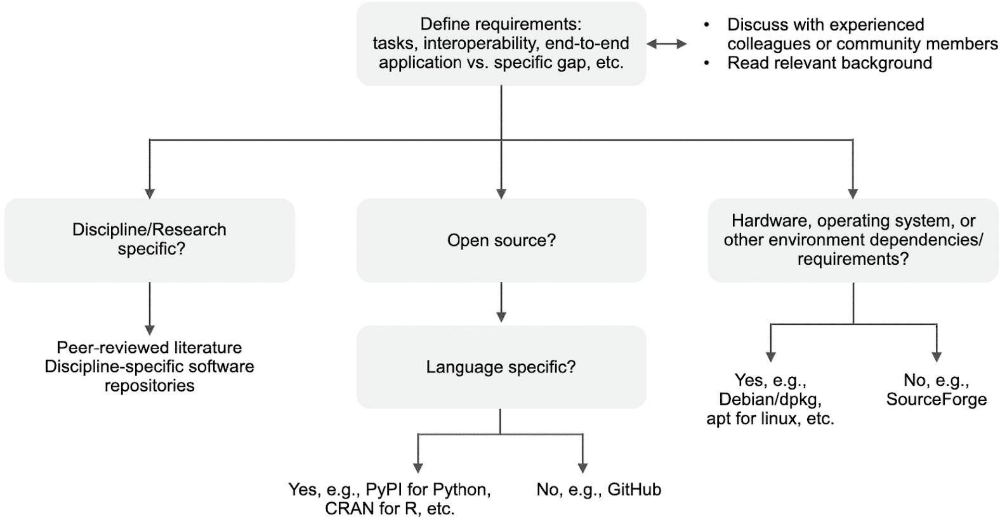

# Lección 2: Usando Código Abierto

## Índice

- [Resumen](#resumen)
- [Objetivos de Aprendizaje](#objetivos-de-aprendizaje)
- [Descubrir Código Abierto y Software](#descubrir-código-abierto-y-software)
- [Evaluar Código Abierto y Software](#evaluar-código-abierto-y-software)
- [Reutilizar Código Abierto](#reutilizar-código-abierto)
- [Citar y reconocer el uso de Código Abierto](#citando-y-reconociendo-el-uso-de-código-abierto)
- [Lección 2: Resumen](#lección-2-resumen)
- [Lección 2: Evaluación](#lección-2-evaluación)

## Descripción General

En esta lección, aprederás los pasos para utilizar código abierto en tu trabajo. Estos pasos incluyen descubrir, evaluar, reutilizar, citar y reconocer.

## Objetivos de Aprendizaje

Después de completar esta lección, deberías ser capaz de:

- Describir el proceso de uso de código abierto y enumerar algunos elementos clave para descubrir código.
- Describir las cuatro consideraciones clave al evaluar el software abierto: funcionalidad, interoperabilidad, seguridad y licencias.
- Enumerar algunos problemas comunes que surgen al reutilizar Código Abierto y las mejores prácticas para resolverlos.
- Describir cómo, dónde y bajo qué circunstancias se debe reconocer (citar) el código.

## Descubriendo Código Abierto y Software

Mucha gente descubre el código a través de conversaciones con sus colegas o leyendo artículos de revistas y asistiendo a charlas en conferencias. Esta es una excelente manera de conocer el código que podría tener aplicaciones para su problema científico.

¿De que otras maneras alguien puede buscar código abierto? Como primer paso, puede buscar código que ya exista porque es probable que otras personas hayan tenido un problema similar y publicado su código en línea. Una manera común de buscar código existente es mediante un motor de búsqueda general. Los motores de búsqueda ofrecen un indicador de la relevancia de un código, qué tan recientemente se actualizó y con qué frecuencia otros hacen referencia a él.

|            |                                                                                                                                                                                                                                                                                                                                                                                                              |
| ---------- | ------------------------------------------------------------------------------------------------------------------------------------------------------------------------------------------------------------------------------------------------------------------------------------------------------------------------------------------------------------------------------------------------------------ |
| Ejemplo    | Soy un nuevo estudiante de posgrado que comienza a trabajar en el modelado de turbulencias en el Océano Austral para comprender mejor la temperatura de la superficie del mar (o la absorción de calor del océano) y el cambio climático. ¿Existe algún software disponible para modelar cómo los remolinos en el océano afectan la temperatura de la superficie del mar? |
| Ejercicio  | Búsqueda General sobre el término "Software para modelado de turbulencias oceánicas"                                                                                                                                                                                                                                                                                                                         |
| Resultados | Modelo General de Turbulencia Oceánica (en inglés, GOTM)                                                                                                                                                                                                                                                                                                                                  |

Esta búsqueda exitosa se basa en que los desarrolladores de GOTM abran su código.

### El Descubrimiento de Software Abierto Depende de que los Desarrolladores sigan los Principios FAIR

Descubrir software abierto depende de que los desarrolladores hagan que su software sea fácil de encontrar. Los principios Encontrable, Accesible, Interoperable y Reutilizable (FAIR) para software de investigación sugieren:

- El software y sus metadatos asociados deben ser fáciles de encontrar para humanos y máquinas.
- El software debe describirse con metadatos ricos, indexables y con capacidad de búsqueda.
- El software debe poder encontrarse desde todos los puntos de búsqueda relevantes

Referencia: "The FAIR Guiding Principles for scientific data management and stewardship" Wilkinson, M. D. et al. The FAIR Guiding Principles for scientific data management and stewardship. Sci Data 3, 160018 (2016). Véase también el Módulo 1.

Sin embargo, es posible que tengas necesidades más específicas. Las siguientes secciones cubren formas adicionales para ayudar a descubrir software relevante que satisfaga demandas de investigación específicas.

### Cómo Buscar Código Abierto

Una búsqueda exitosa de código abierto exige un propósito claramente definido. Los desarrolladores primero deben determinar las tareas que esperan que realice su código. Los requisitos asociados con estas tareas pueden determinar el lenguaje de programación más adecuado.

A continuación, familiarízate con la terminología de otras personas que crearon software abierto con requisitos similares a los tuyos. Las palabras clave relacionadas con su propósito o requisitos de programación pueden servir como punto de partida al buscar código relevante. Estas palabras clave se pueden encontrar en foros comunitarios sobre programación de código abierto y en artículos de revistas científicas relacionadas. Con la adopción de principios de acceso abierto por parte de muchas revistas académicas, los futuros programadores pueden examinar artículos científicos de campos relacionados con su investigación para encontrar, y en ocasiones hacer uso, del código existente que satisfaga sus requisitos.

### Conoce Dónde Buscar

El ecosistema de software abierto es vasto, orgánico, multifacético y altamente distribuido.

Si busca software científico, los estándares comunitarios exigen cada vez más que el código se publique y se vincule a artículos científicos.

Por lo tanto, la literatura científica y sus archivos de códigos auxiliares son cada vez más un excelente lugar para buscar código abierto científico.

La mayor parte del código abierto no es desarrollado por ni para científicos. Sin embargo, el código abierto permite investigar todos los días.

### Dónde Buscar Depende de tu Necesidad

Existen varios motores de búsqueda populares para fragmentos de código. Primero, simplemente puedes buscar en Google. Otros motores de búsqueda comúnmente utilizados incluyen GitHub Code Search y Stack Overflow. Estos motores de búsqueda te permiten buscar fragmentos de código específicos por lenguaje de programación, palabra clave u otros criterios. GitHub Code Search te permite buscar en GitHub, un popular repositorio de códigos para software científico. Stack Overflow le permite buscar foros donde los usuarios discuten soluciones a problemas de codificación.

#### Examples of code repositories:

<table>
<colgroup>
    <col style="width: 33%" />
    <col style="width: 33%" />
    <col style="width: 33%" />
</colgroup>
<tbody>
    <tr>
        <td></td>
        <td></td>
        <td></td>
    </tr>
    <tr>
        <td>GitHub</td>
        <td>GitLab</td>
        <td>Bitbucket</td>
    </tr>
</tbody>
</table>

**Ejemplo: Búsqueda de Código en GitHub**

In this example, we will practice searching for open access code on GitHub. Let's work through a scenario in which you would like to search for the Lomb and Scargle method for estimating a power spectrum.

**Example background**

GitHub enables users to collaborate on a shared project and track their changes with version control. Users can create a repository and grant others access, or make it open access. GitHub involves a large community of open access users who make their code available for free.

**Example instruction**

Begin by visiting the GitHub website to search for openly available software packages. You will need to create a free account for this action. Navigate to the Search Code page to begin your search and access tutorials on the interface and capabilities of the search portal. Alternatively, you can simply input your search terms in the search bar while on your profile page. Next, input the related keywords into the search bar. Search for "Lomb Scargle" and find several repositories with relevant code in various languages, along with thousands of related snippets of code. Congratulations! You have begun your open access software journey and can now view the work of thousands of others who once were where you are now. Upwards and onwards!

Screenshot of the repositories returned from our search

Screenshot of the code snippets returned from our search

---

With open software, knowing where to search and what to search for can be a challenging problem. You can always start with a Google Search. However, it can be valuable to think through some of the questions that guide the discovery process. If the user lacks relevant experience, it can also be helpful to engage experienced colleagues at this stage.

Review the flow chart that illustrates how the search follows the definition of the need.

### Open Software is Aggregated and Searchable in Repositories

A software repository is an online collection of stand-alone application software packages. Repositories typically control access and track the deployments/downloads of packages.

Software packages are often provided as executables without code.

The collection typically includes metadata, documentation, and licensing restrictions on each package. Puede incluir diferentes versiones de paquetes de software y las plataformas o entornos en los que se puede ejecutar el paquete de software.

La mayoría de los códigos de investigación deberían ser software de código abierto, el cual se almacena en repositorios de código.

#### Son ejemplos de repositorios de software:

<table>
<colgroup>
    <col style="width: 50%" />
    <col style="width: 50%" />
</colgroup>
<tbody>
    <tr>
        <td></td>
        <td></td>
    </tr>
    <tr>
        <td>Heritage Software</td>
        <td>Open Source Development Network (OSDN)</td>
    </tr>
    <tr>
        <td></td>
        <td></td>
    </tr>
    <tr>
        <td>SourceForge</td>
        <td>Free and Open-Source Software Hub (FOSSHUB)</td>
    </tr>
    <tr>
        <td></td>
        <td></td>
    </tr>
    <tr>
        <td>Googlecode</td>
        <td>Comprehensive Perl Archive Network</td>
    </tr>
    <tr>
        <td></td>
        <td></td>
    </tr>
    <tr>
        <td>PyPl</td>
        <td>CRAN</td>
    </tr>
</tbody>
</table>

**Recursos de la NASA para descubrir Software Abierto**

Estos son algunos enlaces a repositorios específicos de la NASA que pueden ser de interés:

- [Software de código abierto de la NASA](https://code.nasa.gov/)
- [APIs abiertas de la NASA](https://api.nasa.gov/)
- [Science Discovery Engine Astrophysics Data System](https://sciencediscoveryengine.nasa.gov/app/nasa-sba-smd/)
- [Portal de Desarrollador de Earthdata](https://www.earthdata.nasa.gov/engage/open-data-services-and-software/api)
  [Centro de Modelos y Análisis de Exoplaneta](https://www.earthdata.nasa.gov/engage/open-data-services-and-software/api)

## Evaluación de código abierto y software

Así que has descubierto un código abierto emocionante que puede ayudarte a resolver tu problema científico. ¿Puedes confiar en este código que descubriste en la red? ¿Será útil? ¿Cuánto tiempo llevará aprenderlo? ¿Podría el código contener un programa maligno? ¿Podrías tener problemas legales por usarlo?

**Ejemplos:** Has encontrado el “General Ocean Turbulence Model (GOTM)” en Internet, y parece prometedor. O bien, acabas de encontrar muchos fragmentos de código y funciones relacionadas con el espectro de potencia Lomb-Scargle. Ahora te gustaría evaluar estas piezas de código para ayudarte a decidir si debes usarlas. En esta sección se tratan algunas buenas prácticas para evaluar si el código le ayudará.

### Cuatro consideraciones generales para evaluar el software abierto

Los criterios de evaluación del software son similares, para cualquier nivel de apertura:

- **Funcionalidad:** ¿Será de utilidad para tu problema científico?
- **Interoperabilidad:** ¿Cuán difícil será de usar?
- **Seguridad:** ¿Es seguro? ¿El uso del software crearía un riesgo para la seguridad?
- **Licencias/restricciones:** ¿Puedes utilizarlo? ¿Es legal utilizar el software en su proyecto?

### Funcionalidad: Evaluación de la utilidad científica

#### ¿El software satisface sus necesidades científicas?\*\*

- ¿Aborda tu pregunta científica específica?
- ¿Los estudios similares a los tuyos lo usan?
- ¿Qué documentos lo citan y cómo lo utilizan?
- Habla con tus asesores o colegas que puedan tener experiencia con él.

#### Probando la compatibilidad científica

- ¿El software contiene casos de prueba científica? Si es así, reproduzca un caso que sea aplicable a su problema; asegúrese de que los resultados son los esperados.
- Si ha hecho un análisis científico similar o modelado anteriormente, reproduzca sus resultados previos con el nuevo software. ¿Son consistentes los resultados?
- Modifica cada vez más un caso de prueba dado para abordar nuevas preguntas científicas. Alternativamente, desarrolle su propio caso, si es necesario, siguiendo ejemplos relevantes.

### Interoperabilidad: Facilidad de Uso

#### ¿Está escrito el código en un idioma con el que estás familiarizado?

Puede ser más fácil usar lenguajes de codificación con los que estás familiarizado. entonces importa el código al software existente en lugar de intentar usar un nuevo idioma. Por otro lado, el uso de paquetes y ejecutables existentes puede acelerar tu trabajo.

#### Busca buena documentación

Lee el archivo LEEME. ¿Cumple el software con sus requerimientos funcionales? ¿Están bien definidas y razonables las dependencias medioambientales?

#### Compruebe la evidencia de interoperabilidad con otros proyectos y códigos

Es una buena señal si puede encontrar evidencia de que el código ha sido utilizado con éxito por otros usuarios que tienen necesidades científicas o técnicas similares.

### Factores para evaluar la calidad del software de código abierto

Para evaluar rápidamente el uso de la comunidad y la calidad del repositorio de software, utilice las herramientas del repositorio donde lo encontró. GitHub, por ejemplo, permite un rápido escaneo de la actividad de desarrollo como lo demuestra el número de veces que el código ha sido descargado o “bifurcado” en el lenguaje de GitHub. También puedes ver la cantidad de actividad en una comunidad. GitHub también proporciona información sobre la calidad del software.

### La importancia del Archivo LEEME

- Ejemplo anterior: [Astropy](https://github.com/astropy/astropy/blob/main/README.rst)
- Siempre el punto de partida cuando se evalúa un software.
- Explica qué hace el software, cómo instalarlo y usarlo, o apunta a archivos con esa información.
- Asume conocimientos previos limitados por el lector/potencial usuario.
- Incluye una descripción de la compatibilidad, por ejemplo, dependencias.
- Incluye ejemplos de uso y/o casos de prueba.

### Seguridad: Consideraciones cuando se utiliza código abierto

Has encontrado un código abierto que te ayudará a resolver tu problema científico y parece fácil de usar. Sin embargo, es posible que tenga todavía algunas reservas. Tal vez no esté seguro de si el código plantea un riesgo para la seguridad, por ejemplo.

Los riesgos son relativamente bajos para pequeños fragmentos de código que son fáciles de entender para ti. Sin embargo, es posible que no pueda entender completamente todos los componentes de un Paquete de Software Abierto de gran tamaño.

Se considera que el software abierto tiene más riesgos para la seguridad. Esto generalmente es un problema menor para el código fuente abierto que los ejecutables porque el código puede ser auditado en búsquedas de vulnerabilidades de seguridad por la comunidad. ¿Cómo se puede evaluar la seguridad en este caso?

- Consulta con tus políticas institucionales de software abierto y personal de tecnología de la información
- Utilice fuentes confiables para minimizar los riesgos de seguridad
- Establezca reglas y estándares de seguridad estrictos al usar una dependencia
- Utilice herramientas de seguridad para comprobar si hay vulnerabilidades (por ejemplo, [Open Worldwide Application Security</u> Project®️](https://owasp.org/))
- Evite el software de código abierto sin soporte. Cambie a componentes desarrollados activamente o desarrolle sus propios
- Comprueba tus políticas institucionales más recientes sobre el uso de las herramientas de aprendizaje automático e inteligencia artificial
- Tenga cuidado cuando utilice herramientas externas con datos de acceso seguro o cerrado. Puede ser posible que la herramienta externa comparta públicamente lo que debería ser información restringida

### Licencias

Así que, quiere reutilizar algún código abierto que haya descubierto. Es esencial comprobar las restricciones legales y los requisitos impuestos a los usuarios, que generalmente se proporcionan en la licencia.

Aunque la licencia es un tema con matices sobre el que aprenderás más en la lección 3, es útil saber que generalmente hay dos clases de licencia: permisiva y no permisiva. Licencias permisivas, más comunes Apache 2., MIT o BSD, generalmente le permitirán utilizar el código para su investigación científica con poca restricción, mientras que las licencias no permisivas, como las licencias de copyleft imponen restricciones sustanciales a la forma en que se utiliza el código y requieren una consideración más cuidadosa.

## Reutilizando Código Abierto

El software se puede reutilizar de varias maneras. Un paquete de software puede ser ejecutado por sí mismo para proporcionar un análisis completo o modelos dependiendo de los parámetros de entrada. Alternativamente, el paquete podría ser importado como parte de una biblioteca más grande para proporcionar una funcionalidad específica. Además, los fragmentos de código pueden copiarse en el código existente, si se permite, o el código podría reescribirse e incorporarse a un nuevo software.

Si simplemente tiene la intención de reutilizar un fragmento de código, pruebe continuamente que su código seleccionado funciona como espera. Si está reutilizando un código más complejo, hay consideraciones adicionales.

### Seleccionando la versión aprobada para la reutilización

Considere lo siguiente cuando seleccione entre múltiples versiones del software de código abierto.

|                                                      |                                                                                                                                                                                                                                                                                                                                                                                                                                                                                                                        |
| ---------------------------------------------------- | ---------------------------------------------------------------------------------------------------------------------------------------------------------------------------------------------------------------------------------------------------------------------------------------------------------------------------------------------------------------------------------------------------------------------------------------------------------------------------------------------------------------------- |
| Utilice la última versión estable cuando sea posible | Al igual que ocurre con las actualizaciones de software del sistema operativo o las aplicaciones del teléfono o el ordenador, es importante utilizar la última versión estable. Los desarrolladores de software suelen publicar versiones aún en desarrollo que incluyen nuevas funciones o correcciones de errores que no se han probado por completo. Por este motivo, en general, no se recomienda la utilización de versiones que se encuentren aún en desarrollo. |
| Determine el origen de la versión que desea utilizar | Determine si la versión que pretende utilizar procede de un proyecto de código abierto personalizado o de su fuente original. Con esta información determine qué fuente es más apropiada para su proyecto.                                                                                                                                                                                                                                                                             |
| Comprobación de problemas y bugs                     | Comprueba si la versión que has seleccionado presenta problemas o errores de programación conocidos. Encuentra información actualizada sobre problemas o errores de programación consultando las notas adjuntas de la versión, en sistemas de seguimiento de incidentes y foros de desarrolladores.                                                                                                                                                                                    |

### Resuelve los problemas en software reutilizado

- Implementa pruebas para verificar que el software funciona como esperas en tu aplicación.
- Si tienes problemas, consulta las notas adjuntas de la versión, al sistema de seguimiento de incidentes y/o a los foros de usuarios y desarrolladores.
- No tengas miedo de pedir ayuda a tus colegas con experiencia.
- Es mejor buscar y obtener ayuda en un foro público que en medio privado (por ejemplo, por correo electrónico). Parte del propósito de la ciencia abierta consiste en trabajar abiertamente. A menudo, a través de una búsqueda, puedes descubrir que otros usuarios tienen preguntas similares. Puede que alguien ya haya ofrecido una solución. Si no es el caso, es probable que otros se beneficien de que tu pregunta se responda en público.

### Actividad 2.1: Maneras de obtener ayuda para utilizar software libre

En esta actividad se pide que selecciones de una lista las formas de resolver algunos problemas habituales que surgen al utilizar software libre.

#### Ejercicio 1

Selecciona cómo puedes resolver este problema al utilizar software libre: Dificultad para encontrar software abierto que satisfaga sus necesidades.

Seleccione todo lo que corresponda.

- Ponerse en contacto con colegas expertos
- Leer bibliografía revisada por expertos
- Realizar una búsqueda en varios repositorios populares
- Leer el archivo README
- Leer la licencia que posee el archivo

#### Ejercicio 2

Selecciona la manera en que podrías resolver un problema que se presente al utilizar software abierto sobre el caso: dificultades de instalación.

Seleccione todo lo que corresponda.

- Contactar con los desarrolladores del software en un foro público
- Leer bibliografía revisada por expertos
- Realizar una búsqueda en varios repositorios populares
- Leer el archivo README
- Leer la licencia que posee el archivo

#### Ejercicio 3

Selecciona la manera en que puedes resolver el siguiente problema, el cual se puede presentar al usar software libre: el software no funciona como se esperaba.

Seleccione todo lo que corresponda.

- Contactar con los desarrolladores del software en un foro público
- Leer bibliografía revisada por expertos
- Realizar una búsqueda en varios repositorios populares
- Leer el archivo README
- Leer la licencia que posee el archivo
- Consultar las notas sobre la versión, los sistemas de seguimiento de incidentes y los foros públicos

#### Ejercicio 4

Después de responder las preguntas anteriores, puedes pensar en algunos otros problemas en concreto y plantear cómo los resolverías por tu cuenta. Por ejemplo, navega hasta el repositorio que contiene el código de astropy en GitHub u otro repositorio de tu elección, y busca los archivos README y LICENSE. Determina cómo te pondrías en contacto con los desarrolladores del software para solicitar ayuda, etc.

## Citar y reconocer el uso de código abierto

Imagina haber usado Código Abierto encontrado en la web y que esto ha implicado ser de gran ayuda para el desarrollo de tu proyecto de investigación. ¿Cómo deberías de darle crédito?

**Ejemplo:** Has conseguido aplicar un modelo general de turbulencia oceánica (GOTM por sus siglas en inglés) para aprender algo nuevo sobre la turbulencia oceánica en el Océano Antártico, o has conseguido calcular un periodograma de Lomb-Scargle utilizando Astropy. He aquí algunas cuestiones a tener en cuenta:

### ¿Debes citar el Código Abierto?

Cita cualquier código que consideres haya contribuido a tu investigación:

- ¿Ha desempeñado el código un papel fundamental en tu investigación?
- ¿Aportaba el código algo novedoso?

En la mayoría de los casos un fragmento de código, por ejemplo, encontrado en Stack Overflow no constituye una contribución de investigación citable. Sin embargo, un autor puede decidir citarlo si lo desea.

Entre los casos en que el código compartido repercute directamente en los resultados científicos y requiere una descripción detallada figuran:

- Simulación o modelado numérico
- Análisis automatizados, como el tratamiento de imágenes o el reconocimiento óptico

Consulta una revista en la que has publicado, o en alguna sobre el tema, y busca si contiene instrucciones específicas sobre cómo citar software (por ejemplo, [AAS Software Citation Suggestions] (https://journals.aas.org/news/software-citation-suggestions/)).

En algunos casos, los términos y condiciones de la licencia de uso de un software exigen que este sea reconocido mediante su cita en las referencias o bibliografía de cualquier publicación producto de una investigación que haya hecho uso del programa.

### ¿Cómo citar?

Lo ideal es utilizar y citar código que esté archivado en un repositorio con políticas de preservación a largo plazo y que se identifique con un DOI. Sigue los lineamientos de las normas de citación que el repositorio a largo plazo proporciona y que pueden aparecer en el archivo README o CITATION.

Los DOI proporcionan un identificador o enlace persistente para resultados de investigación. Por ello, es preferible citar los códigos que se encuentren depositados en repositorios a largo plazo vinculados a un DOI. Las URL, por ejemplo, en Stack Overflow y de los repositorios activos, por ejemplo, en GitHub, son mutables, es decir, pueden cambiar con el tiempo y dejar de estar activas, aunque pueden utilizarse si no hay alternativa.

Los paquetes también pueden ofrecer una manera de citar versiones individuales. Para fines de reproducibilidad, cita tanto el paquete general como la versión que se utilizó en tu trabajo. Dado que la funcionalidad de un paquete puede evolucionar con el lanzamiento de nuevas versiones, esto puede ayudar a proporcionar el contexto específico en el que se realizó tu trabajo.

Si estás escribiendo un código de un software, también puedes realizar citas en los comentarios y en la documentación del software del cual te has apoyado.

## Lección 2: resumen

En esta lección aprendiste que:

- El código abierto existe dentro de un ecosistema vasto, orgánico y distribuido. Descubrir Código Abierto depende de definir bien tus necesidades, saber dónde buscar y que otros desarrolladores hayan utilizado los principios FAIR.
- Los artículos científicos ahora también son un buen lugar para descubrir Código Abierto, ya que muchas revistas científicas exigen que el código utilizado en el artículo se encuentre disponible y esté vinculado mediante un DOI.
- Antes de usarlo, es importante evaluar el software libre en términos de funcionalidad, calidad, interoperabilidad, seguridad y restricciones de licencia o reutilización. Tu primer paso debería ser buscar un archivo README.
- Al reutilizar software libre, utiliza la versión más reciente que cuente con soporte y pruebalo para asegurarte de que funciona como esperas. Si surgen problemas, contacta a los desarrolladores o a la comunidad de usuarios, idealmente a través de un foro público.
- Es importante citar y reconocer el software libre que contribuye significativamente a tu trabajo, así como compartir tus experiencias de uso, tanto con los desarrolladores, como con la comunidad de usuarios.

## Lección 2: comprobación de conocimientos

Responde las siguientes preguntas para evaluar lo que has aprendido hasta ahora.

_Pregunta_

**01/03**

El éxito en descubrir software libre depende de lo siguiente:

Selecciona todas opciones que apliquen.

- Requisitos bien definidos
- Saber dónde buscar
- El software abierto que aplica principios FAIR existe para satisfacer sus necesidades
- Todas las anteriores

_Pregunta_

**02/03**

Lee la afirmación y decide si es verdadera o falsa:

_Es mejor contactar a los desarrolladores de software de acceso abierto por comunicación privada si encuentras problemas._

- Verdadero
- Falso

_Pregunta_

**03/03**

Cuando se cita Código Abierto, la mejor práctica es citar:

- El repositorio principal de trabajo, por ejemplo, en GitHub. Tiene la versión más reciente del código, incluyendo cualquier actualización desde que escribiste tu artículo.
- Un repositorio de código a largo plazo vinculado a un DOI, por ejemplo, en Zenodo. Este repositorio contiene una versión persistente, es decir, una copia específica y estable del código, la cual no cambiará con el tiempo, del código que utilizaste.
