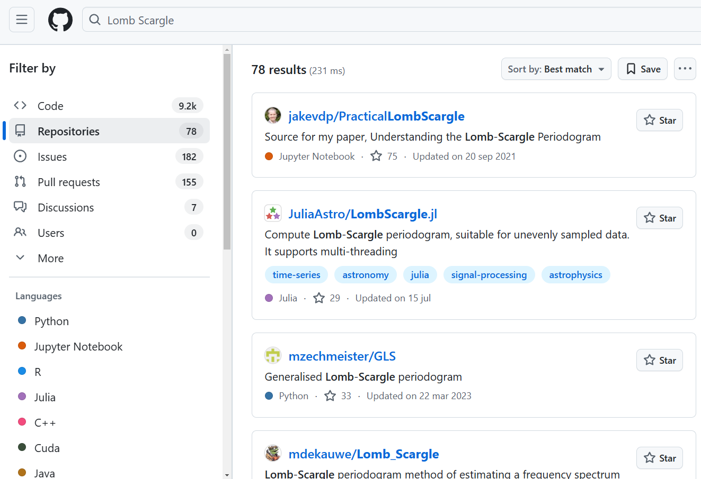
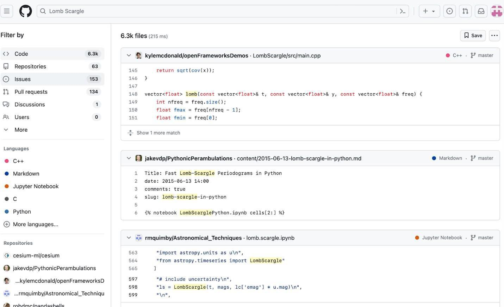
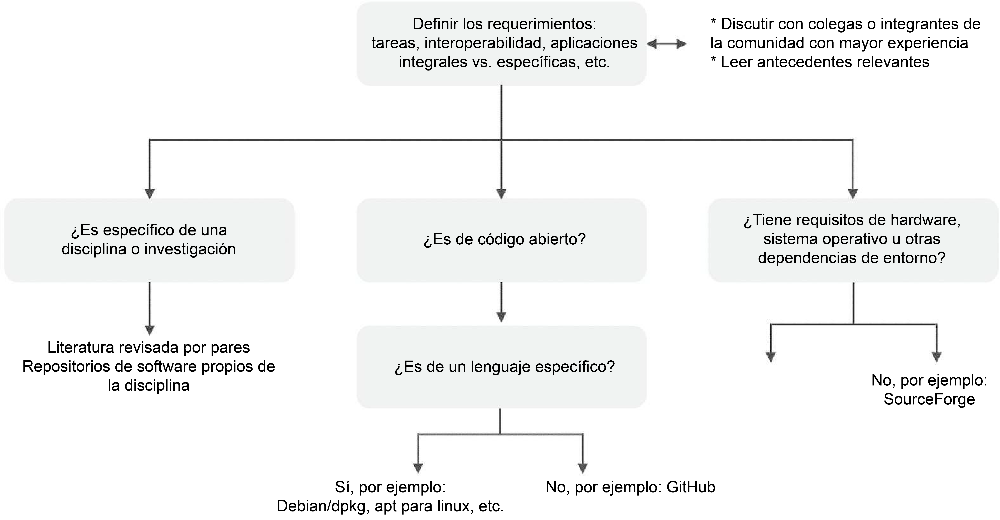

# Lección 2: Uso de Código Abierto

## Contenidos

- [Descubrir Código y Software Abiertos](#descubrir-codigo-abierto-y-software)
- [Evaluar Código y Software Abiertos](#evaluar-codigo-abierto-y-software)
- [Reutilizar Código Abierto](#reutilizar-código-abierto)
- [Citar y reconocer el uso de Código Abierto](#citar-y-reconocer-el-uso-de-código-abierto)
- [Lección 2: Resumen](#lección-2-resumen)
- [Lección 2: Evaluación](#lección-2-evaluación)

## Descripción general

En esta lección aprenderás los pasos para utilizar Código Abierto disponible en tu trabajo. Estos pasos incluyen descubrir, evaluar, reusar, citar y reconocer.

## Objetivos de aprendizaje

Al finalizar esta lección deberías ser capaz de:

- Describir el proceso de uso de Código Abierto y enumerar algunos elementos clave para encontrar código.
- Describir las cuatro consideraciones clave al evaluar el Software Abierto: funcionalidad, interoperabilidad, seguridad y licencias.
- Enumerar algunos problemas comunes que surgen al reutilizar Código Abierto y las mejores prácticas para resolverlos.
- Describir cómo, dónde y bajo qué circunstancias se debe reconocer (citar) el código.

## Descubrir Código y Software Abiertos

Mucha gente descubre el código a través de conversaciones con sus colegas o leyendo artículos de revistas y asistiendo a charlas en conferencias. Esta es una excelente forma de encontrar código que puede tener aplicaciones para tu problema científico.

¿De que otras maneras se puede buscar Código Abierto? Como primer paso, puedes buscar código que ya exista porque es probable que otras personas hayan tenido un problema similar y hayan publicado su código en línea. Una manera común de buscar código existente es mediante un motor de búsqueda general. Los motores de búsqueda ofrecen un indicador de la relevancia de un código, de sus actualizaciones y de la frecuencia en que son citados.

|            |                                                                                                                                                                                                                                                                                                                                                                                                              |
| ---------- | ------------------------------------------------------------------------------------------------------------------------------------------------------------------------------------------------------------------------------------------------------------------------------------------------------------------------------------------------------------------------------------------------------------ |
| Ejemplo    | Soy estudiante de posgrado y recién comienzo a trabajar en el modelado de turbulencias en el Océano Austral para comprender mejor la temperatura de la superficie del mar (o la absorción de calor del océano) y el cambio climático. ¿Existe algún software disponible para modelar cómo los remolinos en el océano afectan la temperatura de la superficie del mar? |
| Ejercicio  | Búsqueda general sobre el término "Software para modelado de turbulencias oceánicas"                                                                                                                                                                                                                                                                                                                         |
| Resultados | Modelo General de Turbulencia Oceánica (en inglés,_General Ocean Turbulence Model_ GOTM)                                                                                                                                                                                                                                                                                                                                  |

El éxito de esta búsqueda se debe a que quienes desarrollaron el modelo GOTM hicieron público su código.

### El acceso al Software Abierto depende de que quienes lo desarrollan sigan los principios FAIR

Descubrir Software Abierto depende de que las personas que lo desarrollen hagan que su software sea fácil de encontrar. Los principios Fácil de encontrar, Accesible, Interoperable y Reutilizable (FAIR) para software de investigación, sugieren:

- El software y sus metadatos asociados deben ser fáciles de encontrar para humanos y máquinas.
- El software debe ser descrito con metadatos enriquecidos, accesibles e indexables.
- El software debe poder encontrarse desde todos los puntos de búsqueda relevantes.

Fuente: "[Principios Rectores FAIR para la gestión y custodia de datos científicos](https://www.nature.com/articles/sdata201618)" (en inglés).
Wilkinson, M. D. et al. The FAIR Guiding Principles for scientific data management and stewardship. Sci Data 3, 160018 (2016). Véase también el Módulo 1.

Sin embargo, puedes tener necesidades más específicas. En las siguientes secciones se describen otras formas de descubrir software que satisfaga las necesidades específicas de la investigación.

### Cómo buscar Código Abierto

Una búsqueda exitosa de Código Abierto exige un propósito claramente definido. Las personas que desarrollan código primero deben determinar las tareas que esperan que éste realice. Los requisitos asociados con estas tareas pueden determinar el lenguaje de programación más adecuado.

A continuación, familiarízate con la terminología de otras personas que crearon Software Abierto con requisitos similares a los tuyos. Las palabras clave relacionadas con su propósito o requisitos de programación pueden servir como punto de partida al buscar código relevante. Estas palabras clave pueden encontrarse en foros de las comunidades sobre programación de Código Abierto y en artículos de revistas científicas relacionadas. Con la adopción de principios de Acceso Abierto por parte de muchas revistas académicas, quienes se ocuparán de programar pueden examinar artículos científicos de campos relacionados con su investigación para encontrar, y en ocasiones usar, el código existente que cumpla con sus requisitos.

### Conoce dónde buscar

El ecosistema de Software Abierto es vasto, orgánico, multifacético y altamente distribuido.

Si buscas software científico, los estándares comunitarios exigen cada vez más que el código se publique y se vincule a artículos científicos.

Por lo tanto, la literatura científica y sus archivos de códigos auxiliares son, cada vez más, un excelente lugar para buscar Código Abierto científico.

La mayor parte del Código Abierto no está desarrollado por o para científicos. Sin embargo, el Código Abierto permite investigar todos los días.

### Dónde buscar depende de tu necesidad

Hay varios buscadores populares para fragmentos de código. Primero, simplemente puedes buscar en Google. Otros motores de búsqueda comúnmente usados son GitHub Code Search y Stack Overflow. Estos motores de búsqueda te permiten buscar por fragmentos de código específicos, por lenguaje de programación, palabra clave u otros criterios. GitHub Code Search desarrolla la búsqueda en GitHub, un popular repositorio de códigos para software científico. En tanto, Stack Overflow establece la búsqueda en foros donde las personas discuten soluciones a problemas de programación.

#### Ejemplos de repositorios de código:

<table>
<colgroup>
    <col style="width: 33%" />
    <col style="width: 33%" />
    <col style="width: 33%" />
</colgroup>
<tbody>
    <tr>
        <td></td>
        <td></td>
        <td></td>
    </tr>
    <tr>
        <td>GitHub</td>
        <td>GitLab</td>
        <td>Bitbucket</td>
    </tr>
</tbody>
</table>

**Ejemplo: Búsqueda de código en GitHub**

En este ejemplo, practicaremos la búsqueda de código de Acceso Abierto en GitHub. Analicemos un escenario en el que te gustaría buscar el método de Lomb y Scargle para estimar un espectro de potencia.

**Ejemplo de contexto**

GitHub permite a las personas usuarias colaborar en un proyecto compartido y seguir sus cambios con el control de versiones. Las personas pueden crear un repositorio y otorgar acceso a otros, o darle Acceso Abierto. GitHub cuenta con una gran comunidad de personas que ponen su código disponible de forma abierta.

**Instrucciones**

Comienza visitando el sitio web de GitHub para buscar paquetes de software disponibles abiertamente. Deberás crear una cuenta gratuita para esta acción. Ahora  puedes ingresar de forma simple tus términos en la barra de búsqueda mientras estás en tu página de perfil. Luego, en la barra de búsqueda, ingresa las palabras clave relacionadas. Busca "Lomb Scargle" y aparecerán varios repositorios con código relevante en varios lenguajes de programación (Python, Julia, R entre otros), junto con miles de partes de código relacionados. ¡Felicitaciones! Has comenzado tu viaje hacia el software de Acceso Abierto y ahora puedes ver el trabajo de miles de personas que alguna vez estuvieron donde tú estás ahora. ¡Adelante!

Captura de pantalla de los repositorios devueltos por nuestra búsqueda.

Captura de pantalla (en inglés) de los fragmentos de código devueltos por nuestra búsqueda. La imagen muestra los primeros tres resultados presentados al seleccionar Código (en inglés _code_) de la columna izquierda. 

---

Con el Software Abierto, saber dónde buscar y qué buscar puede ser un problema desafiante. Siempre puedes comenzar con una búsqueda en Google. Sin embargo, puede ser valioso reflexionar sobre algunas de las preguntas que guían el proceso de búsqueda. Si la persona usuaria carece de experiencia relevante, también puede resultar útil involucrar a colegas experimentados en esta etapa.

Revisa el diagrama de flujo que ilustra cómo la búsqueda sigue la definición de la necesidad.

### El Software Abierto se agrega y se puede buscar en repositorios

Un repositorio de software es una colección en línea de paquetes de software de aplicaciones independientes. Los repositorios normalmente controlan el acceso y rastrean las implementaciones/descargas de paquetes.

Los paquetes de software suelen proporcionarse como ejecutables sin código.

La colección normalmente incluye metadatos, documentación y restricciones de licencia para cada paquete. Puede incluir diferentes versiones de paquetes de software y las plataformas o entornos en los que se puede ejecutar el paquete de software.

La mayoría de los códigos de investigación deberían ser software de Código Abierto, el cual se almacena en repositorios de código.

#### Son ejemplos de repositorios de software:

<table>
<colgroup>
    <col style="width: 50%" />
    <col style="width: 50%" />
</colgroup>
<tbody>
    <tr>
        <td></td>
        <td></td>
    </tr>
    <tr>
        <td>Heritage Software</td>
        <td>Open Source Development Network (OSDN)</td>
    </tr>
    <tr>
        <td></td>
        <td></td>
    </tr>
    <tr>
        <td>SourceForge</td>
        <td>Free and Open-Source Software Hub (FOSSHUB)</td>
    </tr>
    <tr>
        <td></td>
        <td></td>
    </tr>
    <tr>
        <td>Googlecode</td>
        <td>Comprehensive Perl Archive Network</td>
    </tr>
    <tr>
        <td></td>
        <td></td>
    </tr>
    <tr>
        <td>PyPl</td>
        <td>CRAN</td>
    </tr>
</tbody>
</table>

**Recursos de la NASA para encontrar Software Abierto**

Estos son algunos enlaces a repositorios específicos de la NASA que pueden ser de tu interés:

- [Software de Código Abierto de la NASA](https://code.nasa.gov/) (en inglés)
- [APIs abiertas de la NASA](https://api.nasa.gov/) (en inglés)
- [Science Discovery Engine - Sistema de datos astrofísicos](https://sciencediscoveryengine.nasa.gov/app/nasa-sba-smd/) (en inglés)
- [Portal para personas desarrolladoras de Earthdata](https://www.earthdata.nasa.gov/engage/open-data-services-and-software/api) 
  [Centro de Modelización y Análisis de Exoplaneta](https://www.earthdata.nasa.gov/engage/open-data-services-and-software/api) (en inglés)

## Evaluar Código y software Abiertos

Así que has descubierto un Código Abierto emocionante que puede ayudarte a resolver tu problema científico. ¿Puedes confiar en este código que descubriste en la red? ¿Será útil? ¿Cuánto tiempo llevará aprenderlo? ¿Podría el código contener un programa maligno? ¿Podrías tener problemas legales por usarlo?

**Ejemplos:** Has encontrado el  Modelo General de Turbulencia Oceánica (en inglés,_General Ocean Turbulence Model_ GOTM) en Internet, y parece prometedor. O bien, acabas de encontrar muchos fragmentos de código y funciones relacionadas con el espectro de potencia Lomb-Scargle. Ahora te gustaría evaluar estas piezas de código para ayudarte a decidir si debes usarlas. En esta sección se tratan algunas buenas prácticas para evaluar si el código te ayudará.

### Cuatro consideraciones generales para evaluar el Software Abierto

Los criterios de evaluación del software son similares, para cualquier nivel de apertura:

- **Funcionalidad:** ¿Será de utilidad para tu problema científico?
- **Interoperabilidad:** ¿Cuán difícil será de usar?
- **Seguridad:** ¿Es seguro? ¿El uso del software crearía un riesgo para la seguridad?
- **Licencias/restricciones:** ¿Puedes utilizarlo? ¿Es legal utilizar el software en tu proyecto?

### Funcionalidad: Evaluación de la utilidad científica

#### ¿El software satisface sus necesidades científicas?\*\*

- ¿Aborda tu pregunta científica específica?
- ¿Los estudios similares a los tuyos lo usan?
- ¿Qué documentos lo citan y cómo lo utilizan?
- Habla con quienes te asesoran o con colegas que puedan tener experiencia con él.

#### Probar la compatibilidad científica

- ¿El software contiene casos de prueba científicos? Si es así, reproduce un caso que sea aplicable a tu problema; asegúrate de que los resultados son los esperados.
- Si realizaste análisis científicos o demolados similares anteriormente, reproduce tus resultados previos con el nuevo software. ¿Son consistentes? 
- Modifica gradualmente un caso de prueba dado para abordar nuevas preguntas científicas. Alternativamente, desarrolla tu propio caso, si es necesario, siguiendo ejemplos relevantes.

### Interoperabilidad: Facilidad de uso

#### ¿Está escrito el código en un idioma con el que estás familiarizado?

Puede ser más fácil usar lenguajes de programación con los que estás familiarizado e importar el código a un software existente en lugar de intentar usar un nuevo lenguaje. Por otro lado, el uso de paquetes y ejecutables existentes puede acelerar tu trabajo.

#### Busca buena documentación

Lee el archivo README (o LEEME). ¿Cumple el software con tus requerimientos funcionales? ¿Están bien definidas y son razonables las dependencias del entorno o ambiente de desarrollo?

#### Comprueba la evidencia de interoperabilidad con otros proyectos y códigos

Es una buena señal si puedes encontrar evidencia de que el código ha sido utilizado con éxito por otras personas que tienen necesidades científicas o técnicas similares.

### Factores para evaluar la calidad del software de Código Abierto

Para evaluar rápidamente el uso y la calidad del repositorio de software de parte de la comunidad, utiliza las herramientas del repositorio donde lo encontraste. GitHub, por ejemplo, permite un rápido escaneo de la actividad de desarrollo como lo demuestra el número de veces que el código ha sido descargado o “bifurcado” (en la jerga de GitHub). También puedes ver la cantidad de actividad de una comunidad. GitHub, además, proporciona información sobre la calidad del software.

En esta captura puedes ver la cantidad de solicitudes de revisión (_pull requests_) que se le hicieron al proyecto, de copias del respositorio (_forks_), de versiones paralelas (_branches_), los gráficos que muestran el movimiento del proyecto (_insights_), la calificación de parte de la comunidad medida en estrellas (_stars_) y la cantidad de lanzamientos (_releases_). 

### La importancia del Archivo README (LEEME)

- Ejemplo anterior: [Astropy](https://github.com/astropy/astropy/blob/main/README.rst)
- Es siempre el punto de partida cuando se evalúa un software.
- Explica qué hace el software, cómo instalarlo y usarlo, o apunta a archivos con esa información.
- Asume conocimientos previos limitados de la personas lectora o potencial usuaria.
- Incluye una descripción de la compatibilidad, por ejemplo, dependencias.
- Incluye ejemplos de uso y/o casos de prueba.

### Seguridad: Consideraciones a tener en cuenta cuando se utiliza Código Abierto

Has encontrado un Código Abierto que te ayudará a resolver tu problema científico y parece fácil de usar. Sin embargo, es posible que tenga todavía algunas reservas. Por ejemplo, tal vez no estés seguro de si el código plantea un riesgo para la seguridad.

Los riesgos son relativamente bajos para pequeños fragmentos de código que son fáciles de entender para ti. Sin embargo, es posible que no puedas entender completamente todos los componentes de un Paquete de Software Abierto de gran tamaño.

Se considera que el Software Abierto tiene más riesgos para la seguridad. Esto generalmente es un problema menor para el código fuente abierto que los ejecutables porque el código puede ser auditado en búsquedas de vulnerabilidades de seguridad por la comunidad. ¿Cómo se puede evaluar la seguridad en este caso?

- Consulta con el personal de tecnología de la institución y ten en cuenta las políticas de software abierto.
- Utiliza fuentes confiables para minimizar los riesgos de seguridad.
- Establece reglas y estándares de seguridad estrictos al usar una dependencia.
- Usa herramientas de seguridad para comprobar si hay vulnerabilidades (por ejemplo, [Open Worldwide Application Security</u> Project®️](https://owasp.org/), en inglés).
- Evita el software de Código Abierto sin soporte. Cambia a componentes desarrollados activamente o desarrolla tus propios componentes.
- Comprueba tus políticas institucionales más recientes sobre el uso de las herramientas de aprendizaje de máquina (_machine learning_) e inteligencia artificial.
- Ten cuidado cuando utilices herramientas externas con datos de acceso seguro o cerrado. Puede ser posible que la herramienta externa comparta públicamente lo que debería ser información restringida.

### Licencias

Entonces, si quieres reutilizar algún Código Abierto que hayas descubierto, es fundamental comprobar las restricciones legales y los requisitos impuestos a las personas usuarias, cuestiones que generalmente se establecen en la licencia.

Aunque el licenciamiento es un tema con matices sobre el que aprenderás más en la lección 3 de este módulo, es útil saber que generalmente hay dos clases de licencia: permisiva y no permisiva. Licencias permisivas (como Apache 2., MIT o BSD), generalmente te permitirán utilizar el código para tu investigación científica con poca restricción, mientras que las licencias no permisivas, como las licencias de copyleft, imponen restricciones sustanciales a la forma en que se utiliza el código y requieren una consideración más cuidadosa.

## Reutilizar Código Abierto

El software se puede reutilizar de varias maneras. Un paquete de software puede ser ejecutado por sí mismo para proporcionar un análisis completo o modelos de acuerdo a los parámetros de entrada. Alternativamente, el paquete podría ser importado como parte de una biblioteca más grande para proporcionar una funcionalidad específica. Además, los fragmentos de código pueden copiarse en el código existente, si se permite, o el código podría reescribirse e incorporarse a un nuevo software.

Si simplemente tienes la intención de reutilizar un fragmento de código, prueba siempre que el código seleccionado funciona como espera. Si estás reusando un código más complejo, existen consideraciones adicionales.

### Seleccionar la versión adecuada para reutilizar

Ten en cuenta lo siguiente cuando selecciones entre múltiples versiones de un software de Código Abierto.

|                                                      |                                                                                                                                                                                                                                                                                                                                                                                                                                                                                                                        |
| ---------------------------------------------------- | ---------------------------------------------------------------------------------------------------------------------------------------------------------------------------------------------------------------------------------------------------------------------------------------------------------------------------------------------------------------------------------------------------------------------------------------------------------------------------------------------------------------------- |
| Utiliza la última versión estable cuando sea posible | Al igual que ocurre con las actualizaciones de software del sistema operativo o las aplicaciones del teléfono o del ordenador, es importante utilizar la última versión estable. Quienes programan suelen publicar versiones del desarrollo que incluyen nuevas funciones o correcciones de errores que no se han probado por completo. Por este motivo, en general, no se recomienda la utilización de versiones que se encuentren aún en desarrollo. |
| Determina el origen de la versión que deseas utilizar | Determina si la versión que quieres utilizar procede de un proyecto de Código Abierto modificado o de su fuente original. Con esta información determina qué fuente es más apropiada para tu proyecto.                                                                                                                                                                                                                                                                             |
| Comprueba problemas y errores (_bugs_)                     | Comprueba si la versión que has seleccionado presenta problemas o errores de programación conocidos. Encuentra información actualizada sobre esto consultando las notas adjuntas de la versión, el sistema de seguimiento de incidentes y los foros de comunidades de desarrollo.                                                                                                                                                                                    |

### Resolver problemas en la reutilización de software 

- Implementa pruebas para verificar que el software funciona como esperas en tu aplicación.
- Si tienes problemas, consulta las notas adjuntas de la versión, el sistema de seguimiento de incidentes y/o a los foros de personas usuarias y desarrolladoras.
- No tengas miedo de pedir ayuda a tus colegas con experiencia.
- Es mejor buscar y obtener ayuda en un foro público que en un medio privado (por ejemplo, por correo electrónico). Parte del propósito de la Ciencia Abierta consiste en trabajar abiertamente. Muchas veces, a través de una búsqueda, puedes descubrir que otras personas tienen preguntas similares. Puede que alguien ya haya ofrecido una solución. Si no es el caso, es probable que otros se beneficien de la respuesta pública a tu pregunta. 

### Actividad 2.1: Maneras de obtener ayuda al usar Software Abierto

En esta actividad te pedimos que reconozcas las formas de resolver algunos problemas habituales que surgen al utilizar Software Abierto.

#### Ejercicio 1

Selecciona cómo podrías resolver este problema que se presenta al utilizar Software Abierto: Dificultad para encontrar Software Abierto que satisfaga tus necesidades.

Selecciona todas las opciones que correspondan.

- Contacta a colegas y personas expertas
- Lee bibliografía revisada por personas expertas
- Realiza una búsqueda en varios repositorios populares
- Lee el archivo README
- Lee la licencia del archivo

#### Ejercicio 2

Selecciona cómo podrías resolver este problema que se presenta al utilizar Software Abierto: Dificultades de instalación.

Selecciona todas las opciones que correspondan.

- Contacta con quienes desarrollaron el software en un foro público
- Lee bibliografía revisada por personas expertas
- Realiza una búsqueda en varios repositorios populares
- Lee el archivo README
- Lee la licencia del archivo

#### Ejercicio 3

Selecciona cómo podrías resolver este problema que se presenta al utilizar Software Abierto: El software no funciona como se esperaba.

Selecciona todo lo que corresponda.

- Contacta con quienes desarrollaron el software en un foro público
- Lee bibliografía revisada por personas expertas
- Realiza una búsqueda en varios repositorios populares
- Lee el archivo README
- Lee la licencia del archivo
- Consulta las notas sobre la versión, los sistemas de seguimiento de incidentes y los foros públicos

#### Ejercicio 4

Después de responder las preguntas anteriores, puedes pensar en algunos otros problemas en concreto y plantear cómo los resolverías por tu cuenta. Por ejemplo, navega hasta el repositorio que contiene el código de Astropy en GitHub u otro repositorio de tu elección, y busca los archivos README y LICENSE (LICENCIA). Determina cómo te pondrías en contacto con quienes desarrollaron el software para solicitar ayuda, etc.

## Citar y reconocer el uso de Código Abierto

Imagina haber usado Código Abierto encontrado en la web y que esto significó ser de gran ayuda para el desarrollo de tu proyecto de investigación. ¿Cómo deberías de darle crédito?

**Ejemplo:** Has conseguido aplicar un Modelo General de Turbulencia Oceánica (GOTM por sus siglas en inglés) para aprender algo nuevo sobre la turbulencia oceánica en el Océano Antártico, o has conseguido calcular un periodograma de Lomb-Scargle utilizando Astropy. Aquí te dejamos algunas cuestiones a tener en cuenta:

### ¿Debes citar el Código Abierto?

Cita cualquier código que consideres que contribuyó a tu investigación:

- ¿El código desempeñó un papel fundamental en tu investigación?
- ¿El código aportó algo novedoso?

En la mayoría de los casos un fragmento de código, por ejemplo, encontrado en Stack Overflow no constituye una contribución de investigación citable. Sin embargo, la persona autora puede decidir citarlo si lo desea.

Entre los casos en que el código compartido repercute directamente en los resultados científicos y requiere una descripción detallada figuran:

- Simulación o modelado numérico
- Análisis automatizados, como el tratamiento de imágenes o el reconocimiento óptico

Consulta la revista en la que publicas, u otra sobre el tema, y busca si contiene instrucciones específicas sobre cómo citar software (por ejemplo, [AAS Software Citation Suggestions](https://journals.aas.org/news/software-citation-suggestions/), en inglés).

En algunos casos, los términos y condiciones de la licencia de uso de un software exigen que éste sea reconocido mediante su cita en las referencias o bibliografía de cualquier publicación producto de una investigación que haya hecho uso del programa.

### ¿Cómo citar?

Lo ideal es utilizar y citar código que esté archivado en un repositorio con políticas de preservación a largo plazo y que se identifique con un DOI. Sigue los lineamientos de las normas de citación que se proporcionan en el repositorio y que pueden aparecer en el archivo README (LEEME) o CITATION (CITA).

Los DOI proporcionan un identificador o enlace persistente para resultados de investigación. Por ello, es preferible citar los códigos que se encuentren depositados en repositorios a largo plazo vinculados a un DOI. Las URL, por ejemplo, en Stack Overflow y de los repositorios activos, por ejemplo, en GitHub, son mutables, es decir, pueden cambiar con el tiempo y dejar de estar activas, aunque pueden utilizarse si no hay alternativa.

Los paquetes también pueden ofrecer una manera de citar versiones individuales. Para fines de reproducibilidad, cita tanto el paquete general como la versión que se utilizó en tu trabajo. Dado que la funcionalidad de un paquete puede evolucionar con el lanzamiento de nuevas versiones, esto puede ayudar a proporcionar el contexto específico en el que se realizó tu trabajo.

Si estás escribiendo un software, también puedes citar en los comentarios y en la documentación el software que hayas usado.

## Lección 2: Resumen

Conclusiones principales de esta lección: 

- El Código Abierto existe dentro de un ecosistema vasto, orgánico y distribuido. Descubrir Código Abierto depende de definir bien tus necesidades, saber dónde buscar y que las personas que lo desarrollan hayan utilizado los principios FAIR.
- Los artículos científicos también son un buen lugar para descubrir Código Abierto, ya que ahora muchas revistas científicas exigen que el código utilizado en el artículo se encuentre disponible y esté vinculado mediante un DOI.
- Antes de usarlo, es importante evaluar el Software Abierto en términos de funcionalidad, calidad, interoperabilidad, seguridad y restricciones de licencia o reutilización. Tu primer paso debería ser buscar un archivo README.
- Al reutilizar Software Abierto, utiliza la versión más reciente que cuente con soporte y pruébalo para asegurarte de que funciona como esperas. Si surgen problemas, contacta a las personas que lo desarrollaron o a la comunidad usuaria, idealmente a través de un foro público.
- Es importante citar y reconocer el Software Abierto que contribuye significativamente a tu trabajo, así como compartir tus experiencias de uso, tanto con quienes desarrollan software, como con la comunidad usuaria.

## Lección 2: Evaluación

Responde las siguientes preguntas para poner a prueba lo que has aprendido hasta ahora.

_Pregunta_

**01/03**

El éxito en descubrir Software Abierto depende de lo siguiente:

Selecciona todas las opciones que apliquen.

- Requisitos bien definidos
- Saber dónde buscar
- El Software Abierto que aplica principios FAIR existe para satisfacer tus necesidades
- Todas las anteriores

_Pregunta_

**02/03**

Lee la afirmación y decide si es verdadera o falsa:

_Es mejor contactar a quienes desarrollan software de acceso abierto por comunicación privada si encuentras problemas._

- Verdadero
- Falso

_Pregunta_

**03/03**

Cuando se cita Código Abierto, la mejor práctica es citar:

- El repositorio principal de trabajo, por ejemplo, en GitHub. Tiene la versión más reciente del código, incluyendo cualquier actualización desde que escribiste tu artículo.
- Un repositorio de código a largo plazo vinculado a un DOI, por ejemplo, en Zenodo. Este repositorio contiene una versión persistente, es decir, una copia específica y estable del código, la cual no cambiará con el tiempo, del código que utilizaste.
