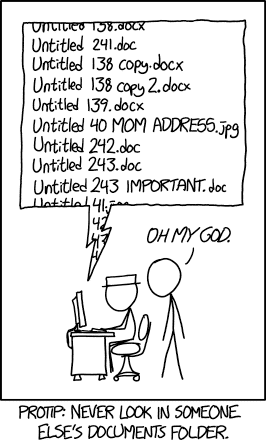

# Lección 3: Crear código abierto

## Contenidos

- [Descripción general](#overview)
- [Objetivos de aprendizaje](#learning-objectives)
- [¿Cómo planificamos para crear código?](#how-do-we-plan-for-making-code)
- [Importancia del control de versiones](#importance-of-version-control)
- [Describir nuestro código para otras personas](#describing-our-code-to-others)
- [¿Qué licencia deberíamos elegir para nuestro código?](#what-license-should-we-choose-for-our-code)
- [Buenas prácticas de programación](#programming-best-practices)
- [Lección 3: Resumen](#lesson-3-summary)
- [Lección 3: Evaluación](#lesson-3-knowledge-check)

## Descripción general

En esta lección aprenderás sobre los pasos prácticos para hacer que el código esté accesible de forma abierta. Los software bien establecidos y de gran volumen tienen necesidades diferentes a las de un proyecto incipiente. Por ejemplo, un programa escrito para crear un gráfico simple tiene requisitos diferentes a los de un paquete de software que modela el clima de la Tierra. El tamaño del equipo de investigación también puede determinar los pasos necesarios para que el código sea de acceso abierto. Esta lección cubre: el proceso para hacer que el código sea utilizable para otras personas que investigan mediante la documentación, consideraciones sobre licencias, y buenas prácticas en el desarrollo de software.

## Objetivos de aprendizaje

Al completar la lección, deberías ser capaz de:

- Describir las consideraciones clave al planificar un nuevo proyecto de software abierto.
- Enumerar tres razones por las que los proyectos deberían usar control de versiones.
- Explicar el propósito y recordar información general típicamente incluida en un archivo LEEME.
- Ser capaz de seleccionar una licencia para tu código y listar las diferencias entre licencias de software de código abierto permisivas y protectoras.
- Explicar las buenas prácticas en el desarrollo de software que apoyan la transparencia, la inclusión y la reproducibilidad.

## ¿Cómo planificamos la creación de código?

El código se escribe para resolver un desafío. Esto puede abarcar desde la producción de un gráfico, hasta procesar datos de observaciones de la Tierra, o incluso modelar el Universo. Los desafíos asociados con la escritura de código pueden variar en dificultad, desde tareas más simples como el uso de hojas de cálculo hasta actividades más complejas como la creación de extensas bibliotecas y el uso de computación de alto rendimiento o en la nube. El código puede ser desarrollado de manera individual, en equipo o en comunidad. Una vez escrito, el código puede ser utilizado durante décadas o nunca más.

When starting a research project, it is useful to answer the following questions:

1. What problem am I trying to solve, and are others in my community facing it as well?
2. Are there existing solutions? (In Lesson 2, we explored how to look for existing solutions.)
3. Did you find code that was close to what you want but didn’t quite meet your needs?

You could potentially contribute to it instead of writing something new.

Even if a solution already exists, there might be good reasons to develop your own code. Instances include:

- The code is written in a different programming language than you are familiar with.
- The license is not open enough to adopt it.
- To try new techniques or to develop a deeper understanding of the problem.

It might take more time to start a new project, or it might take more time to integrate someone else’s code than writing your own. You will have to make that call.

We looked for existing code, and though we found a few things that were close we decided in the end our needs were unique enough - we’re starting a new project!

### Starting a New Project

When starting a new project, the key things to consider are:

1. Define the project scope, its primary features and any limitations, and the intended audience.
2. Consider resources required for the software to run. Will it be on a personal computer, a high-performance computing server, or on the cloud?
3. How will it be managed?

This lesson focuses predominantly on the question of how to manage open access code.

Who will be working on the project? What are some of the development best practices? How will you share it openly? How will it be licensed?

### Organizing a Project

Source: https://xkcd.com/1459/

---

Software projects can be organized in a variety ways, each that involve unique considerations about how to begin. Many projects start out as a single script that was only intended for a single use. However, a script can grow into a much larger project with unforeseen applications in its original or new field of research. Other projects can start with formal requirements and standards.

Making code public has many advantages:

- It enables open collaboration.
- It invites constructive feedback that contributes to a code’s accuracy and robustness.
- People with less experience with the subject matter will learn more.
- Those with less programming experience can learn from those with more programming experience as they improve the code.
- It provides an intermediate product that can still be cited.

When naming a project, conduct a quick search of the envisioned name to see what shows up. Avoid names with many other uses as this will make it difficult for others to discover the code. Also, do not choose embarrassing or trademarked names.

Hosting the product on a version control platform ensures the permanence of your project. If code only exists on your computer, it may disappear if the computer is damaged or is lost.

Documenting the production and management of your code benefits both you and those that might use your code in the future. You are your own best collaborator. Documentation can save you from a headache should you reuse the code in six months or attempt to recall meticulous details about your process later on.

Questions to consider when choosing a programming language:

- Will potential collaborators be able to contribute in the chosen language?
- Which languages are you most experienced with?
- Are there any limitations from your computing environment that would impede your ability to write or manage this code?
- Languages have strengths and weaknesses; which are most important for your project?

Before someone else can use your code, they're going to ask some questions:

- Where can I find your code?
- Is your code documented?
- In what ways am I allowed to use your code?
- Will you accept changes to your code? If I find a bug, what do I do?
- How do I trust your code works?
- How do I know if the code will be supported long term?

## Importance of Version Control

Your code will change significantly over the lifetime of your project. Del mismo modo que apreciamos la capacidad de rastrear versiones anteriores de documentos o versiones creadas por diferentes personas, inevitablemente alguien querrá ser capaz de revertir, comparar y sintetizar cambios en el código.

La herramienta más popular de control de versiones es git. Git es un sistema que rastrea los cambios en los archivos del equipo, similar a Google Docs o SharePoint, pero más aplicable a código. Git se utiliza generalmente junto con una plataforma de control de versiones como GitHub, Gitlab, o Bitbucket. Estas herramientas fueron cubiertas en el Módulo 2.2.

El control de versiones permite lo siguiente:

- Ayuda a los desarrolladores a realizar un seguimiento de los cambios en el código de un proyecto (además de archivos suplementarios y documentación) durante todo el curso de la evolución del proyecto.
- Las revisiones a los archivos de un proyecto pueden ser rastreadas, incluyendo las contribuciones realizadas por diferentes personas.
- Los cambios no deseados (como equivocaciones o errores de programación) pueden ser revertidos en cualquier momento.

El control de versiones es una buena práctica para programar, incluso si no se comparte el código inmediatamente. El mismo puede ser usado en un código personal de forma privada en su computadora, o alternativamente se puede usar el modo privado en los servicios de alojamiento (por ejemplo, GitHub y GitLab). Al configurar el control de versiones pronto, se prepara el código para un uso futuro esperado e inolvidable.

**Recursos adicionales en el control de versión**

- [Control de versión de carpintería de software con Git](https://swcarpentry.github.io/git-novice/)
- [The Turing Way, Versión Control](https://the-turing-way.netlify.app/reproducible-research/vcs.html)
- [Usar un repositorio accesible públicamente con control de versiones: guía para el software FAIR](https://f.Usoftware.eu/recommendations/repository/)

## Describiendo nuestro código a otros

### Archivo LEEME

La primera parada para un usuario cuando se acerque a un nuevo proyecto debería ser el archivo LEEME. Acertadamente llamado así, este archivo contiene información orientativa que ayudará al usuario a comprender el propósito de un proyecto, ofrece ejemplos de cómo puede utilizarse y enumera otra información importante que el creador considere pertinente.

Como mínimo, un archivo LEEME debería contener el nombre del proyecto y un párrafo muy corto de lo que es el software. Dos o tres frases en un estilo sencillo que no presuponga quién lo lee. Es el discurso de ascenso para el proyecto.

|                                         |                                                                                                                                                                                                                                                                                                                |
| --------------------------------------- | -------------------------------------------------------------------------------------------------------------------------------------------------------------------------------------------------------------------------------------------------------------------------------------------------------------- |
| **Incorrecto** Ejemplo de archivo LEEME | "Este código recalcula el factor de permutación fundamental del flujo descendente (para J < 10, obviamente)."                                                                                                                                                               |
| **Correcto** Ejemplo de archivo LEEME   | "LeapKitten. Este paquete de Python toma cualquier foto de un gatito (JPEG, PNG) y utiliza inteligencia artificial para mostrar cómo se vería saltando en el aire. Además, el código tiene en cuenta los años bisiestos en la marca de tiempo de la imagen" |

Además, la siguiente información es útil para añadir al archivo LEEME especialmente si no están listados en otro lugar:

- Una lista de las dependencias de código que tiene el software, por ejemplo, "Numpy, kitten-rng y human- readable deben estar instalados para ejecutar este software"
- Cómo instalar y una breve descripción de cómo ejecutar el software.
- Descripción detallada del software, especialmente si no hay documentación externa.
- Ejemplos de cómo utilizar el software.
- Reconocimiento de miembros del equipo o fuentes de apoyo.

Como se vio en estos ejemplos, los archivos LEEME pueden ser útiles para una [colección de scripts de apoyo a una publicación](https://github.com/granttremblay/Tremblay2018_Code) o un [paquete de software ampliamente desarrollado](https://github.com/MillionConcepts/lhorizon).

### Pautas para los colaboradores

El archivo _CONTRIBUYENDO.md_ proporciona información sobre cómo contribuir al proyecto. En él se explica cómo funciona el proceso de contribución y qué tipo de contribuciones son necesarias. Si bien no todos los proyectos tienen un archivo _CONTRIBUTING.md_, la existencia de uno es un claro indicador de que las contribuciones son bienvenidas.

Será necesario decidir personalmente cuando tu proyecto ha progresado lo suficiente como para invitar contribuidores. Cuando lo haya hecho, un documento llamado CONTRIBUYENDO deberá ser creado en el nivel superior del informe.

Las [pautas de contribución de Astropy](https://github.com/astropy/astropy/blob/main/CONTRIBUTING.md) y las [pautas de contribución numérica](https://numpy.org/devdocs/dev/index.html) proporcionan dos ejemplos.

**Consejo extra: Aunque desarrolles tu código públicamente, esto no significa que tengas que aceptar contribuciones de otros o mantener tu código para siempre. Las pautas de contribución o el archivo LEEME son buenos lugares para indicar cuáles son las expectativas para el código. El mismo puede aclarar que el código no está siendo mantenido o que no acepta contribuciones.**

### Código de conducta

El código de conducta establece normas básicas para el comportamiento de los participantes y ayuda a facilitar un ambiente agradable y acogedor. Si bien no todos los proyectos tienen un archivo CODIGO_DE_CONDUCTA, su presencia indica que este es un proyecto agradable al que contribuir.

### Documentación de código

**Documentación sobre el código para el desarrollador**

Su software debe estar documentado dentro del código fuente. Cada función debe tener comentarios al principio que brevemente expliquen, en lenguaje sencillo, para qué sirve la función. Esto no es sólo para otros desarrolladores, sino para el desarrolador original que una semana más tarde, puede olvidar que escribio.

> **Ejemplo**
>
> \# Esta función toma la matriz de imagen y la recorta desde el centro al 50% del tamaño original.
>
> Sin entrar en detalles sobre el tipo de datos, los parámetros de llamada, etc., esta descripción sitúa inmediatamente a la persona que mira el código en el contexto de lo que la función pretende conseguir; entonces puede explorar los detalles.
>
> Si bien se debería considerar colocar una descripción al comienzo de una función, hay que utilizar la discreción sobre dónde poner descripciones de código similares. Al comienzo de un ciclo o análisis complejo serían buenas ideas. No te olvides - cosas como esta no son útiles:
>
> \# fijar x a 17
>
> x = 17
>
> Los nombres de variables, clases y funciones descriptivos pueden hacer que tu código sea legible. . A veces, incluso los grandes programadores trabajan rápido y nombran las variables 'a', 'temp', u otros nombres que probablemente no tendrán mucho sentido en una semana o dos cuando vuelvan a algo en lo que estaban trabajando. Nombres como 'tiempo_de_coccion' o 'velocidad' son más claros. Los nombres variables deberían ser fáciles de entender y representar claramente lo que son.
>
> Lo ideal es que alguien que no escriba en el lenguaje del código pueda leer los comentarios del archivo y hacerse una idea aproximada de lo que ocurre.
>
> Utilize los comentarios para poner URLs que hagan referencia a dónde se encontró el algoritmo utilizado (por ejemplo, Stack Overflow) o el artículo de revista donde se encuentran la fórmula que se implementa.

### Documentación sobre el código para el usuario

Si estás desarrollando código que esperas que otros usen, escribe un manual sobre cómo utilizar el código. Como el código se desarrolla constantemente, es mucho más fácil documentarlo mientras o incluso antes de escribir cualquier código.

Si escribe su documentación dentro del propio código. hay piezas de software que pueden extraerla, formatearla y presentarla como un manual pulido. Ejemplos de documentación generada a partir del código se pueden ver para [Astropy](https://docs.astropy.org/en/latest/) o [NumPy](https://numpy.org/doc/stable/).

Se ven maravillosos, pero también muy similares. Estos sitios fueron generados por completo a partir de comentarios y documentos escritos en el código fuente. Diferente de los comentarios escritos para las personas que desarrollan el código anterior estos comentarios fueron escritos específicamente para el público de usuarios externos del código: el manual.

Aunque hay varios paquetes de software para la generación automática de documentación, los más utilizados son [Sphinx](https://www.sphinx-doc. rg/es/master/) para Python y [D](https://www.doxygen.nl/index.html)[oxygen](https://www.doxygen.nl/index.html) para casi todo lo demás. [M](https://www.markdownguide.org/)[arkdown](https://www.markdownguide.org/) también es una opción popular para el lenguaje de formato para la documentación.

### Programación y documentación

**Establecer un entorno de desarrollo** - Establecer un entorno de desarrollo apropiado te ayudará a escribir un código bueno, limpio y te ayudará a mantener el proyecto a medida que evoluciona.

- Configure cualquier herramienta necesaria para escribir el código. Tal vez un EDI (Entorno de Desarrollo Integrado) o editor de texto. Algunos ejemplos populares incluyen el código VS, Pycharm, R Studio, Xcode.
- Configure un gestor de paquetes. Por ejemplo, para Python, se podría usar 'anaconda' o 'poetry'.
- Cree un entorno virtual específico a tu proyecto para aislar sus dependencias (y sus versiones) de las utilizadas para otros proyectos

**Estructuración de archivos y carpetas** - Cómo estructurar los archivos en tu proyecto desde el principio contribuirá al éxito de los resultados finales.

Diferentes lenguajes de programación tienen diferentes estructuras de carpetas estándar. Familiarizarse con los estándares antes de empezar, ya que ayudará a otros a colaborar y probablemente le salvará de dificultades más adelante.

Hay una variedad de estructuras de código de ejemplo que se pueden utilizar para empezar. Por ejemplo, para Python hay Cookiecutter y una plantilla de paquete Astropy.

## ¿Qué licencia deberíamos elegir para nuestro código?

### Consideraciones de licencia cuando se usa software abierto

Las licencias de software de código abierto son la base para cómo los científicos usan, elaboran y comparten código y software. Entender algunos de los matices de estas licencias es importante porque afectará a cómo tu proyecto puede licenciar y compartir código.

Una licencia de software es un documento legal que establece los derechos de las personas que desarrollan y usan una pieza de software.

Una licencia de código abierto es un tipo de licencia de software, aprobada por la Open Source Initiative (OSI), en español, Iniciativa de Código Abierto, conforme a la Definición de Código Abierto. Una licencia de código abierto otorga permisos a cualquier persona para inspeccionar, usar, modificar y distribuir el código fuente del software para cualquier propósito.

Las licencias aseguran que las personas que desarrollan el software reciben crédito y control sobre cómo se utiliza su trabajo. Sin licencia, se asume que el software tiene derechos de autor y sin permisos. Las personas que programan incluyen licencias para permitir reutilizaciones.

Las licencias toman varias formas para describir:

- Obligaciones contractuales (si existen) entre las personas que desarrollan y las que los usan.
- Lo que las personas que usan el software pueden hacer con él.
- A quiénes las personas que usan el software pueden distribuirlo (si existe tal derecho).
- Período de tiempo que las personas que usan el software tienen derecho a utilizarlo.

### Algunos tipos comunes de licencia de software

_Haz clic en '+' para ver más información._

**Dominio Público**

Cualquier persona puede usarlo libremente.

**"Licencia Pública General Reducida**

Puede vincularse a bibliotecas de código abierto, y el código puede ser licenciado bajo cualquier tipo de licencia.

**Permisivo**

Ofrece a las personas que usan el software una libertad amplia, pero no completa, para reutilizar o volver a otorgar licencias.

**No permisiva**

Permite al conjunto de usuarios reutilizar, pero también otorga la responsabilidad a las personas que lo utilizan de compartir sus cambios con la comunidad.

Copyleft

Puede ser distribuido o modificado si todo el código involucrado está bajo la misma licencia.

**Propietario**

No se puede copiar, modificar ni distribuir.

---

Antes de elegir una licencia, consulte primero con su organización o empleador. Pueden tener pautas específicas acerca de qué licencia de software se le permite usar. Tu subsidio de investigación también puede estipular los tipos de licencia permitidos. El plan de gestión de software debe especificar qué licencia planea usar.

Si una licencia no es compartida con un código, se asume por defecto que está protegido por derechos de autor en los Estados Unidos (https://www.copyright.gov/help/faq/faq-general.html). No necesita estar registrado, y se asume que está protegido automáticamente por los derechos de autor en el momento en que se crea.

Para el software, la licencia se comparte en un archivo llamado LICENCIA en la parte superior del repositorio. Es una ubicación estándar que la gente sabrá mirar. No es mala práctica poner también una línea con la versión de la licencia en la parte superior de cada archivo de código, con un puntero hacia donde se podría encontrar la licencia completa.

### Tipos de licencias de software de código abierto

Hay dos tipos principales de licencias de código abierto. Permisiva y protectora (a veces denominada copy-left). La diferencia en este tipo de licencias se relaciona principalmente con el tipo de licencia que el conjunto de usuarios del código pueden aplicar a sus trabajos derivados.

<table>
  <thead>
    <tr>
        <th>LICENCIA PERMISIVA ☑</th>
        <th>LICENCIA PROTECTORA</th>
    </tr>
  </thead>
  <tbody>
    <tr>
        <td colspan="2">
            
La Iniciativa de Código Abierto define una licencia de software permisiva como una licencia que garantiza la libertad de usar, modificar, redistribuir y crear obras derivadas. Un ejemplo de este tipo de licencia es la licencia Apache 2.0 de la Apache Software Foundation (en español, Fundación de Software Apache). Es la licencia permisiva más popular y ampliamente utilizada.

            
El conjunto de usuarios tienen una amplia libertad de reutilización bajo esta licencia. Generalmente son libres de incorporar el código en su proyecto o de usarlo como deseen. Las personas que utilizan un código abierto con licencia permisiva en un producto podrían volver a implementar el software de código abierto con una amplia gama de licencias, incluyendo el software patentado de código cerrado.

        </td>
    </tr>
  </tbody>
</table>

<table>
  <thead>
    <tr>
        <th>LICENCIA PERMISIVA</th>
        <th>LICENCIA PROTECTORA ☑</th>
    </tr>
  </thead>
  <tbody>
    <tr>
        <td colspan="2">
            
Las licencias protectoras (copyleft) son una técnica legal para conceder ciertas libertades sobre copias de obras protegidas por derechos de autor con el requisito de que se preserven los mismos derechos en las obras derivadas. Esto permite a los usuarios reutilizar, pero también requiere que compartan sus cambios con la comunidad utilizando la misma licencia. Un ejemplo de licencia protectora es la Licencia Pública General (en inglés, GPL) que garantiza que los usuarios tengan la libertad y responsabilidad de compartir sus cambios con la comunidad. Es la licencia de protección más utilizada. Estos tipos de licencias pueden dar como resultado una menor reutilización por parte de los usuarios que prefieren o se les exige que utilicen únicamente licencias permisivas.

        </td>
    </tr>
  </tbody>
</table>

### Licencias Comunes para Software Abierto

Algunas de las licencias más populares utilizadas en software abierto son:

<table>
  <thead>
    <tr>
        <th>PERMISIVA (PUEDE APLICAR CUALQUIER LICENCIA A OBRAS DERIVADAS) ☑</th>
        <th>PROTEGIDA/ COPYLEFT (TODAS LAS OBRAS DERIVADAS DEBEN DISTRIBUIR TODO SU CÓDIGO FUENTE BAJO LA MISMA LICENCIA)</th>
    </tr>
  </thead>
  <tbody>
    <tr>
        <td colspan="2">
            <ul>
              <li><a href="https://opensource.org/license/apache-2-0/">Licencia Apache</a></li>
              <li><a href="https://opensource.org/license/mit/">Licencia MIT</a></li>
              <li><a href="https://opensource.org/license/bsd-3-clause/">Licencia BSD</a></li>
            </ul>
        </td>
    </tr>
  </tbody>
</table>

<table>
  <thead>
    <tr>
        <th>PERMISIVA (PUEDE APLICAR CUALQUIER LICENCIA A OBRAS DERIVADAS)</th>
        <th>PROTEGIDA/ COPYLEFT (TODAS LAS OBRAS DERIVADAS DEBEN DISTRIBUIR TODO SU CÓDIGO FUENTE BAJO LA MISMA LICENCIA) ☑</th>
    </tr>
  </thead>
  <tbody>
    <tr>
        <td colspan="2">
            <ul>
              <li>Liencia Pública General GNU (<a href="https://opensource.org/license/gpl-2-0/">GPL</a>)</li>
              <li><a href="https://opensource.org/license/mpl-2-0/">Licencia Pública de Mozilla</a> </li>
              <li>Licencia Común de Desarrollo y Distribución (<a href="https://opensource.org/license/cddl-1-0/">CDDL</a>)</li>
            </ul>
        </td>
    </tr>
  </tbody>
</table>

Para obtener más información sobre los diferentes tipos de licencias, consulte la [Iniciativa de Código Abierto OSI](https://opensource.org/licenses/category).

### Actividad 3.1: Licencias

En esta actividad, se le pedirá que responda si las siguientes afirmaciones son verdaderas o falsas.

**Afirmación 1:**

Una licencia de software establece los derechos del desarrollador y del usuario sobre un software.

- Verdadero
- Falso

**Afirmación 2:**

Sin licencia, se supone que el software tiene derechos de autor y no tiene permisos.

- Verdadero
- Falso

**Afirmación 3:**

Cualquiera es libre de utilizar software con una licencia "permisiva" sin restricciones.

- Verdadero
- Falso

**Afirmación 4:**

Los usuarios no pueden copiar ni modificar ningún software con licencia copyleft.

- Verdadero
- Falso

## Las Mejores Prácticas de Programación

En esta sección, se proporcionan algunas prácticas recomendadas en desarrollo, incluidas la revisión de código, pruebas, seguridad y accesibilidad. Estas prácticas mejorarán la calidad del código, la reproducibilidad de los resultados y la seguridad de un proyecto. Combinadas, estas acciones ayudan a mejorar la solidez del código de acceso abierto y ayudan a enfrentar los desafíos únicos que pueden surgir con múltiples contribuyentes y revisiones que ocurren durante un período prolongado de tiempo.

### Revisión de Código

El código se beneficia de la revisión por pares de la misma manera que la ciencia. Hacer que otra persona lea su código y lo pruebe es una de las mejores formas de mejorar la calidad del código.

Muchas plataformas de control de versiones tienen herramientas integradas que permiten a los desarrolladores revisar, comentar e iterar el código de otros. Estos se pueden hacer de forma abierta y permitir que cualquiera pueda comentar.

Aquí hay un gran ejemplo de la discusión que puede ocurrir cuando el creador original de un algoritmo [comenta sobre una implementación de Python realizada por un colaborador primerizo del proyecto Astropy.](https://github.com/astropy/astropy/pull/4301). La discusión abierta y constructiva condujo a una mejor implementación del algoritmo junto con posibles mejoras futuras.

Los paquetes de software también se pueden revisar como productos propios. Muchas publicaciones científicas ahora aceptan artículos centrados en software. Hay entidades como [PyOpenSci](https://www.pyopensci.org/) y el [Journal of Open Source Software](https://joss.theoj.org/) que ofrecen revisión abierta por pares de paquetes científicos. Vea más detalles sobre JOSS en la próxima lección sobre cómo compartir su código.

### Pruebas

Un método probado para evaluar la reproducibilidad de tu software es mediante pruebas. Hay muchos tipos de pruebas que van desde probar las partes comprobables más pequeñas de un código hasta verificar si un código funciona en su totalidad en diferentes escenarios. Las pruebas de código pueden incluir una amplia gama de técnicas diferentes. La siguiente sección de la lección proporciona sólo una breve introducción al tema.

El principal objetivo de las pruebas de código es evaluar si un código hace lo que sus autores pretendían que hiciera. Probar el código de manera integral puede ser muy difícil, ya que implica probar el código para generar los resultados esperados y para fallar cuando debería.

<table>
  <thead>
    <tr>
        <th>VALIDACIÓN CIENTÍFICA ☑</th>
        <th>PRUEBAS DE REPRODUCIBILIDAD</th>
        <th>PRUEBAS INTEGRADAS</th>
        <th>PRUEBAS AUTOMATIZADAS</th>
    </tr>
  </thead>
  <tbody>
    <tr>
        <td colspan="4">
            
Ya sea que se produzca un guión o un proceso completo de procesamiento de datos, la validación del software es fundamental para garantizar la calidad y confiabilidad de los resultados científicos. Esto podría significar calcular manualmente los resultados para verificar el resultado del código o compararlos con resultados producidos anteriormente o hacer que otro miembro del equipo lo pruebe.

        </td>
    </tr>
  </tbody>
</table>

<table>
  <thead>
    <tr>
        <th>VALIDACIÓN CIENTÍFICA</th>
        <th>PRUEBAS DE REPRODUCIBILIDAD ☑</th>
        <th>PRUEBAS INTEGRADAS</th>
        <th>PRUEBAS AUTOMATIZADAS</th>
    </tr>
  </thead>
  <tbody>
    <tr>
        <td colspan="4">
            
Dados los mismos insumos y parámetros, ¿se pueden producir los mismos resultados? Hacer que los archivos de configuración, los datos de entrada, etc. estén disponibles abiertamente para que los usuarios puedan ejecutarlos fácilmente y producir los mismos resultados publicados es una forma fundamental de aumentar la confianza en su código.

        </td>
    </tr>
  </tbody>
</table>

<table>
  <thead>
    <tr>
        <th>VALIDACIÓN CIENTÍFICA</th>
        <th>PRUEBAS DE REPRODUCIBILIDAD</th>
        <th>PRUEBAS INTEGRADAS ☑</th>
        <th>PRUEBAS AUTOMATIZADAS</th>
    </tr>
  </thead>
  <tbody>
    <tr>
        <td colspan="4">
            
Las pruebas unitarias permiten a los desarrolladores de software reforzar su confianza en la capacidad de su código para funcionar según lo esperado. Las pruebas unitarias son pequeñas funciones que se encuentran fuera de la base del código y que prueban una función específica o ejecutan una prueba específica. Por ejemplo, si una función toma una imagen y la voltea horizontalmente, una prueba podría verificar que la imagen resultante tenga el mismo tamaño. Otro compara la salida utilizando una imagen conocida con el resultado esperado. Otro comprueba que se devuelva una nueva imagen.

        </td>
    </tr>
  </tbody>
</table>

<table>
  <thead>
    <tr>
        <th>VALIDACIÓN CIENTÍFICA</th>
        <th>PRUEBAS DE REPRODUCIBILIDAD</th>
        <th>PRUEBAS INTEGRADAS</th>
        <th>PRUEBAS AUTOMÁTICAS ☑</th>
    </tr>
  </thead>
  <tbody>
    <tr>
        <td colspan="4">
            
Las pruebas integradas generalmente se pueden ejecutar tanto de forma manual como automática. La mayoría de las plataformas de control de versiones ofrecen servicios para ejecutar pruebas automáticamente. Cuando se ejecuta de esta manera, se puede verificar el código para ver si los cambios generan algún problema. Este proceso de verificar el código automáticamente a medida que se desarrolla se llama desarrollo continuo o integración continua (CI/CD). Si un pequeño cambio realizado en una parte del código da como resultado un cambio inesperado en otra parte, la ejecución de las pruebas lo descubrirá inmediatamente.

        </td>
    </tr>
  </tbody>
</table>

### Minimizar el Riesgo de Vulnerabilidades de Seguridad

Ya sea que se utilice software de código abierto, de código cerrado o comercial, es importante considerar los riesgos de seguridad inherentes al desarrollo de software.

- Asegúrese de que haya un código mínimo DRY (no lo repita) (más fácil de mantener y reparar).
- Utilice variables globales o administradores de claves para las credenciales. Nunca incluya credenciales en su código.
- Utilice dependencias bien probadas y mantenidas. En los paquetes que mantiene, mantenga actualizada la lista de dependencias.
- Cree software con herramientas que proporcionen escaneo y auditoría automatizados.
- Si hay dependencias no compatibles en las que confías, evalúalas para determinar cómo podrían introducir riesgos de seguridad y si sería apropiado cambiar a un paquete diferente.

<table>
  <thead>
    <tr>
        <th>HERRAMIENTAS Y VULNERABILIDADES DE SEGURIDAD ☑</th>
        <th>COMPONENTES DE PRUEBA Y DEPENDENCIAS</th>
    </tr>
  </thead>
  <tbody>
    <tr>
        <td colspan="2">
            
Se han desarrollado herramientas comerciales y de código abierto para abordar el desafío de identificar las vulnerabilidades de seguridad en distintos componentes de la fuente. Si no dispones de ninguna tecnología para asegurar el uso de código abierto, puedes considerar utilizar las herramientas de verificación de dependencias Dependabot o <a href="https://owasp.org/">OWASP</a>.

            
El Proyecto de Seguridad de Aplicaciones Web Abiertas (Open Web Application Security Project, OWASP) es una comunidad en línea que produce herramientas y tecnologías gratuitas en el campo de la seguridad de aplicaciones web. La verificación de dependencias de OWASP es una herramienta creada por desarrolladores, que identifica las dependencias de un proyecto y verifica si contineen alguna vulnerabilidad conocida de código abierto que haya sido públicamente divulgada.

        </td>
    </tr>
  </tbody>
</table>

<table>
  <thead>
    <tr>
        <th>HERRAMIENTAS Y VULNERABILIDADES DE SEGURIDAD</th>
        <th>COMPONENTES DE PRUEBA Y DEPENDENCIAS ☑</th>
    </tr>
  </thead>
  <tbody>
    <tr>
        <td colspan="2">
            
Probar la seguridad de los componentes de código abierto que estás utilizando es la mejor manera de garantizar la seguridad de tus aplicaciones y de tu organización. Tu compromiso con el análisis oportuno y frecuente de los componentes de código abierto debería ser el mismo que con tu propio código.

            
Esto es especialmente cierto dado que el componente en cuestión puede tener vulnerabilidades de seguridad desconocidas o dependencias que difieren en cada caso de uso. Es posible que un componente sea seguro en una aplicación concreta, pero vulnerable en otra.

        </td>
    </tr>
  </tbody>
</table>

### Creación de Software FAIR

<table>
  <thead>
    <tr>
        <th>LOCALIZABLE ☑</th>
        <th>ACCESIBLE</th>
        <th>INTEROPERABLE</th>
        <th>REUTILIZABLE</th>
    </tr>
  </thead>
  <tbody>
    <tr>
        <td colspan="4">
            
El software incluye un identificador persistente y único, así como metadatos completos, lo que facilita su ubicación tanto para humanos como para máquinas.

        </td>
    </tr>
  </tbody>
</table>

<table>
  <thead>
    <tr>
        <th>LOCALIZABLE</th>
        <th>ACCESIBLE ☑</th>
        <th>INTEROPERABLE</th>
        <th>REUTILIZABLE</th>
    </tr>
  </thead>
  <tbody>
    <tr>
        <td colspan="4">
            
El software se puede recuperar a partir de su identificador mediante protocolos de comunicación estándar.

        </td>
    </tr>
  </tbody>
</table>

<table>
  <thead>
    <tr>
        <th>LOCALIZABLE</th>
        <th>ACCESIBLE</th>
        <th>INTEROPERABLE ☑</th>
        <th>REUTILIZABLE</th>
    </tr>
  </thead>
  <tbody>
    <tr>
        <td colspan="4">
            
El software es interoperable con otros programas; intercambia datos y/o metadatos utilizando estándares compartidos.

        </td>
    </tr>
  </tbody>
</table>

<table>
  <thead>
    <tr>
        <th>LOCALIZABLE</th>
        <th>ACCESIBLE</th>
        <th>INTEROPERABLE</th>
        <th>LOCALIZABLE ☑</th>
    </tr>
  </thead>
  <tbody>
    <tr>
        <td colspan="4">
            
Metadatos completamente descritos con su procedencia, cumpliendo con las normas de la comunidad. La licencia permite su reutilización.

        </td>
    </tr>
  </tbody>
</table>

### Consejos adicionales útiles

Aquí hay algunas sugerencias adicionales sobre cómo hacer que tu código sea más accesible, reproducible y transparente:

|                                  |                                                                                                                                                                                                                                                                                                                                                                                                                                                                                                                                                                                                                              |
| -------------------------------- | ---------------------------------------------------------------------------------------------------------------------------------------------------------------------------------------------------------------------------------------------------------------------------------------------------------------------------------------------------------------------------------------------------------------------------------------------------------------------------------------------------------------------------------------------------------------------------------------------------------------------------- |
| **Nombres descriptivos**         | Las variables, funciones y entidades similares deben recibir nombres descriptivos en lugar de nombres vagos. Los nombres descriptivos dan de inmediato a otros programadores una idea de lo que representa la variable o la función. Por ejemplo, el nombre de variable **ColorDeGato** es un buen nombre porque describe lo que pretende hacer, que es abarcar el color de gatos.                                                                                                                                                                                           |
| **Archivo de metadatos**         | Considera incluir un archivo de metadatos para tu software para facilitar su búsqueda. Puedes crear un archivo 'codemeta.json' empleando [Code Meta generator](https://codemeta.github.io/codemeta-generator/) para incluirlo con tu paquete.                                                                                                                                                                                                                                                                                                                                |
| **Documentación de Operaciones** | Comparte detalles sobre cómo estás ejecutando el código. Por ejemplo, documenta la versión de la biblioteca de software que estás utilizando o la versión del compilador. Suelen compartirse en un archivo 'environment.yml'.                                                                                                                                                                                                                                                                                                                                |
| **Automation**                   | Consider the following scenario:  You are getting ready to publish your paper that includes 17 plots that all depend on a data set released by a mission. Right before you are about to submit, the mission releases an updated version of the data set.   How easy will it be to recreate those plots?   Software allows you to automate the running of scripts and alert programmers when written so that input files are not hardcoding. This allows programmers to easily re-run code if an initial parameter changes. |
| **Using Standards**              | Most languages have their own coding style adopted by their respective communities. Following those conventions makes it easier for others to contribute to your code and makes your project more inclusive.                                                                                                                                                                                                                                                                                                                                                                                 |
| **Portability**                  | Share details about how you are running the code, for example the version of a software library you are using, or the version of the compiler. These are often shared in an 'environment.yml' file.                                                                                                                                                                                                                                                                                                                                                                          |
| **Naming**                       | Many historical terms used in software have negative connotations depending on the context. When considering different terms or naming, consider how different audiences may react to those terms.                                                                                                                                                                                                                                                                                                                                                                                           |

## Lesson 3: Summary

In this lesson, you learned:

- Planning a new project requires programmers to have a clearly defined purpose, recognize any resource limitations, and envision a data management plan.
- Using a repository with version control allows developers to track changes across time and from multiple contributors, which can help with troubleshooting for errors and with managing a team of programers.
- A README file should include the name of a project and short but clear description of the software.
- Licenses ensure that developers receive credit and control over how their work is used. Without a license, software is assumed copyrighted and without permissions
- Testing, labeling, and implementing security measures are examples of programming best practices that support Open Science.

In addition to learning how to Share your Code in the next lesson, you will also have some opportunities to put this lesson into practice.

## Lesson 3: Knowledge Check

Answer the following questions to test what you have learned so far.

_Question_

**01/05**

Which of the following should be considered when planning an open software project? Select all that apply.

- The intended user audience.
- What protocol will be used to sync changes between individual contributors and the central repository.
- The programming language to be used.
- Who will financially benefit from sales of the software.

_Question_

**02/05**

Which of the following is a benefit of using a version control system in your software?

- New changes are automatically tracked.
- Different contributors can add or edit code at the same time.
- Undesirable changes can be quickly reverted.
- All of the above.

_Question_

**03/05**

Select two items that are good to include in a README file from the list below:

- Installation/compilation instructions
- Code development history
- The most important portions of the code
- Usage instructions and example output

_Question_

**04/05**

Which of the following licenses allows users to reuse, but also require users to share their changes with the community using the same license?

- Public Domain
- Lesser general domain
- Permissive
- Protective License
- Commercial

_Question_

**05/05**

Which of the following practices makes your project more inclusive?

- Including a Code of Conduct.
- Referencing historical events in the name of your project.
- Following standards for the programming language being used.
- Developing the project privately.
- Including a Guideline for Contributors.
