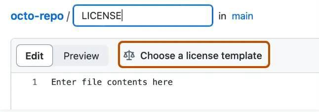

# Lección 4: Compartiendo Código abierto

## Índice

- [Resumen](#resumen)
- [Objetivos de Aprendizaje](#objetivos-de-aprendizaje)
- [Planeando compartir tu código](#planning-to-share-your-code)
- [Preocupaciones legales y de seguridad](./Lesson_4#legal-and-security-concerns)
- [Cuando: El Cronograma para Archivar y Compartir Código.](./Lesson_4#when-the-schedule-for-code-archiving-and-sharing)
- [Dónde: Dónde Compartir Código Abierto](./Lesson_4#where-to-share-open-code)
- [Cómo: Cómo habilitar la reutilización del código](./Lesson_4#how-to-enable-reuse-of-code)
- [Quién: Roles y Responsibilidades de los Miembros del Equipo en la Implementación del SMP](./Lesson_4#who-roles-and-responsibilities-of-the-team-members-in-implementing-the-smp)
- [Lección 4: Resumen](#lesson-4-summary)
- [Lección 4: Revisión De Conocimientos](#lección-4-revisión-de-conocimientos)

## Resumen

En esta lección aprenderás los pasos para compartir el software que desarrollaste. Estos pasos incluyen determinar si el software debe compartirse, cuándo y dónde, qué funciones son necesarias y cómo permitir que otros utilicen el código.

## Objetivos de Aprendizaje del Módulo

Después de completar este módulo, deberías ser capaz de:

- Describir lo que significa compartir código: para archivar o para desarrollar código.
- Evaluar si debe compartir su código y listar consideraciones de seguridad importantes.
- Describir las mejores prácticas para cuándo y dónde compartir código.
- Recordar las prácticas más habituales para ayudar a otros a reutilizar tu código.
- Listar los roles y responsabilidades para compartir y mantener código compartido.

## Planificar para compartir tu código

He estado trabajando en un código y ahora un nuevo colaborador quiere utilizarlo. ¡Genial! ¿Cuál es la mejor manera de compartir el código? ¿Por correo electrónico? ¿Cuándo debo compartir el código y qué debo incluir para asegurar que esta persona pueda utilizarlo fácilmente?"

### ¿Qué significa "Compartir" tu código?

Hay dos categorías principales de compartir: compartir el desarrollo y el suministro de un registro a largo plazo.

### Desarrollo de código abierto

Escribir código científico suele ser un proceso dinámico y colaborativo en el que contribuyen varias personas y el código evoluciona con el tiempo. En este tipo de proyectos, es beneficioso desarrollar código abierto en una plataforma de alojamiento de repositorios públicos como Github, Bitbucket, GitLab, etc. desde el principio del proyecto. Esto garantiza que todas las actualizaciones se compartan abiertamente en la web y puedan llegar a colaboradores y usuarios potencialmente interesados casi en tiempo real.

### Compartir Código Abierto

El archivado garantiza que su código científico sea accesible a largo plazo y puede satisfacer los requisitos de archivado de organismos y organizaciones de financiación. La accesibilidad a largo plazo ayuda a otras personas a reproducir sus resultados mucho después de la publicación. Archivar por sí solo no promueve el desarrollo continuo ni la colaboración. El archivado es una conservación estática y a largo plazo de su software, no una evolución del mismo.

### ¿Debe compartir su software?

Existen varias preocupaciones legales y de seguridad a tener en cuenta a la hora de crear o usar software abierto.

- Cualquier software que crees suele considerarse propiedad intelectual y puede estar controlado por las políticas de tu organización.
- Tales políticas pueden influir en cuán abiertamente se puede compartir el software y, por lo tanto, su licencia.
- La descarga y contribución a proyectos de software libre puede estar regulada por las políticas de seguridad informática de su organización.

En cambio, si el software se creó con financiación externa (gubernamental), algunos organismos de financiación pueden exigir que el software se comparta abiertamente.

### Plan de gestión de software (SMP)

¿Recuerdas las partes del Plan de Gestión de Software? ¿Qué debemos tener en cuenta cuando se trata de compartir?

- **Qué:** Descripción de la gestión, conservación y distribución de software.
- **Cuándo:** El cronograma para archivar y compartir software.
- **Dónde:** Ubicación donde se compartirá y archivará el software a largo plazo.
- **Cómo:** Habilitar la reutilización del software mediante la asignación de un DOI, licencia, directrices de contribución, etc.
- **Quién:** Roles, funciones y responsabilidades de los miembros del equipo.

## Cuestiones jurídicas y de seguridad

<table>
  <thead>
    <tr>
        <th>CONCIONES LEGALES ☑</th>
        <th>CUESTIONES DE SEGURIDAD</th>
    </tr>
  </thead>
  <tbody>
    <tr>
        <td colspan="2">
            
Cualquiera que escriba código de investigación y software debe familiarizarse con las políticas de su organización sobre compartir y publicar software. Las agencias de financiación, gubernamentales o privadas, pueden tener estrictos requisitos de apertura del software. En otros casos, compartir software puede no estar permitido por la organización.

            
Las cuestiones jurídicas pueden incluir preguntas como:

            <ul>
                <li>¿Es un desarrollador o una institución el propietario del software?</li>
                <li>¿El compartir (o no compartir) el software viola las políticas de la agencia de financiación?</li>
                <li>¿Existen leyes o normativas locales que regulen el intercambio de propiedad intelectual?</li>
                <li>¿Qué licencia de software se necesita?</li>
            </ul>
            
<strong>Una vez que decida participar o iniciar un nuevo proyecto de software abierto, familiarícese con las políticas y prácticas de su organización.</strong>

            
Más información sobre los aspectos legales <a href="https://opensource.guide/legal/">aquí</a>.

        </td>
    </tr>
  </tbody>
</table>

<table>
  <thead>
    <tr>
        <th>CONCIONES LEGALES</th>
        <th>CUESTIONES DE SEGURIDAD ☑</th>
    </tr>
  </thead>
  <tbody>
    <tr>
        <td colspan="2">
            
La seguridad es una preocupación a la hora de compartir software. Los malhechores pueden adjuntar códigos maliciosos a los programas informáticos en un intento de infiltrarse en los sistemas informáticos a través de las vulnerabilidades de seguridad, exponiendo potencialmente información sensible y privada que puede acarrear grandes pérdidas económicas a los usuarios. La seguridad es una preocupación a la hora de compartir software.

            
Las cuestiones de seguridad pueden incluir:

            <ul>
                <li>¿Permite la política de Tecnologías de la Información (TI) de tu organización que compruebes el código que quieres utilizar en tu máquina?</li>
                <li>¿Tiene buena reputación el repositorio al que desea contribuir?</li>
                <li>¿Hay algún problema abierto relacionado con la seguridad del código?</li>
            </ul>
            
<strong>Una vez que decida participar o iniciar un nuevo proyecto de software abierto, familiarícese con las políticas y prácticas de su organización.</strong>

            
Más información sobre los aspectos legales <a href="https://opensource.guide/legal/">aquí</a>.

        </td>
    </tr>
  </tbody>
</table>

### Compartir programas informáticos creados con fondos de agencias estadounidenses

Muchos organismos federales ya permiten (si no exigen) compartir el código creado en el marco de sus programas de subsidios. Por ejemplo:

- [NASA](https://www.nasa.gov/open/open-source-development.html) "...estamos llegando activamente a proyectos dentro de la NASA para hacer uso de ...recursos para publicar código abierto."
- [Departamento de Comercio de EE.UU.](https://www.commerce.gov/about/policies/source-code) «...requiere que las agencias desarrollen planes para liberar al menos el 20 por ciento del nuevo código fuente desarrollado a medida como Software de Código Abierto (OSS) al encargar nuevo software a medida».
- [USGS](https://www.usgs.gov/survey-manual/im-osqi-2019-01-review-and-approval-scientific-software-release) «...las versiones de software se consideran bienes de dominio público y, por lo general, están disponibles sin restricciones».

¿Está financiado por un subsidio? Lea la convocatoria original de la subvención para ver si se permite/requiere la publicación de su código y compruebe si contiene algún texto sobre la gestión del software y alguna condición para publicar su código. En caso de duda, póngase en contacto con su organización para obtener información adicional.

### Actividad 4.1: Encuentra las políticas de lanzamiento de software de tu organización

Supongamos que desea iniciar un nuevo proyecto de código abierto:

- Conozca las políticas de su organización en materia de publicación de software.
- ¿Cuál es el proceso para liberar su software?
- Does anybody in your organization have to approve this release?
- Are there any policies regarding external contributors?
- Does your organization require a specific attribution or credit?

#### Key Takeaways: Find Your Organization’s Software Release Policies

Software release policies differ by organization and each piece of software is different. Therefore, it is important that we do not make assumptions about the software release policies based on previous experience.

## Cuándo:\*\* El cronograma para archivar y compartir software

Planear para compartir tu código al comienzo de tu proyecto hace que compartir sea más fácil cuando estés listo. Exactamente cuando en tu flujo de trabajo decides compartir públicamente tu código depende de tu trabajo y de los requisitos de la agencia de financiación, organización, o publicador.

Como ejemplo, ¿qué dice la NASA?

Si está escribiendo software científico para un proyecto financiado por el Directorio de Misión de Ciencia de la NASA (NASA Science Mission Directorate) entonces:

El software científico necesario para validar las conclusiones científicas de los manuscritos revisados por pares resultantes de las actividades científicas financiadas por el SMD se pondrá a disposición del público a más tardar en la fecha de publicación del correspondiente artículo revisado por pares. This includes software required to derive the findings communicated in figures, maps, and tables, as well as scientifically useful software from models and simulations."

\- [**Open-Source Science Guidance**](https://smd-cms.nasa.gov/wp-content/uploads/2023/07/smd-open-source-science-guidance-v2-20230407.pdf)

Other organizations may have different guidance, so it is always best to check what the funding agency or organization requires.

## Where: Where To Share Open Code

### General Considerations

Like data, code can be shared in many ways, for example over email or on a personal website, but these methods are not recommended. So, where should you share your Open Code?

First, consider your institutional or funding agency policies that may dictate where you must share and where you can share. For example, some funding agencies specify long-term repositories where your code must be archived, and they may restrict you from sharing in other forms of repositories. Your scientific discipline may have a specific repository for open code.

#### What are some good options and best practices for archiving your code?

- Archive open code with an open access journal article.
- If the open code is in an active online development repository such as Github, then create a version and archive the code at a long-term repository with a DOI such as Zenodo, which can be integrated with Github (more details on this process later).
- Archive the code in other long-term public repositories, such as Software Heritage.

#### Is your code a substantial software package and of interest to a significant number of users from various disciplines? Where else can your open code be shared?

- Develop your software on a public repository such as GitHub.
- Publish to a software repository used by common package managers to make the software easy for users to install (ex. Anaconda, CRAN, PyPI).
- Present the software at conferences.
- Publish the software in a Journal dedicated to open software (ex. JOSS).
- Get your software peer reviewed through communities like PyOpenSci.

#### To share my code, I can just add it to github, right?

No necesariamente. Se alienta a compartir en un repositorio, pero la organización de financiamiento de la persona que investiga puede requerir un DOI de un repositorio de archivo, como Zenodo, para la preservación a largo plazo de su código en el momento de la publicación o lanzamiento de versiones.

## ¿Cómo habilitar la reutilización del código?

Ahora que has compartido tu código de la forma adecuada, es importante considerar si has facilitado a otros participantes (o a tu yo del futuro) la reutilización de tu código.

### Asignando una Licencia

Como recordarás de la lección anterior, asignar una licencia adecuada es necesario para que otras personas sepan cómo utilizar tu código.

Por ejemplo, aquí te mostramos cómo asignar una licencia a un repositorio de GitHub:

Elige la licencia de uso compartido de software adecuada que cumpla con los requisitos de tu organización. Para crear una plantilla de licencia en GitHub, añade un nuevo archivo y escribe "LICENCIA" (en inglés, _LICENCE_) en el campo de nombre, entonces aparecerá la opción "Elegir una plantilla de licencia".

Asegúrate de que tu repositorio de GitHub sea público, para que cualquiera pueda realizar búsquedas en él.

### Haciendo el código citable

No todo el código tiene que ser citable. Cuando se publica de forma independiente, sin embargo, existen algunas prácticas recomendadas sobre cómo hacer que tu código sea citable.

Añadir el código a un repositorio de GitHub no es suficiente para archivar código. Para archivar, debemos asignar un identificador persistente.

Producir un identificador persistente para tu código es la mejor manera de hacerlo citable. Esto podría hacerse mediante una publicación revisada por pares que describa el software o archivando el software en un repositorio a largo plazo que produzca un DOI o un identificador similar. Para el código compartido en GitHub, un [DOI se puede producir fácilmente para cada versión del software de Zenodo.](https://docs.github.com/en/repositories/archiving-a-github-repository/referencing-and-citing-content#issuing-a-persistent-identifier-for-your-repository-with-zenodo)

### Actividad 4.2: Crear un DOI para un Archivo de Código de Prueba

Puedes crear Identificadores de Objetos Digitales (en inglés, _Digital Object Identifiers, DOIs_) para tu código que lo hacen citable. Para hacer esto, archiva un repositorio de código GitHub en Zenodo y emite un DOI para el registro.

Pasos para esta actividad:

**Parte 1: Crear un repositorio GitHub público de prueba.**

1. Ve a la página de inicio de sesión para [GitHub](https://github.com/) e inicia sesión. Si aún no lo has hecho, crea una cuenta de usuario gratuita.
2. Crea un nuevo repositorio con este [enlace](https://github.com/new).
3. Escribe un nombre breve y recordable para tu repositorio. Por ejemplo, "os-test".
4. Establece como 'Pública' la visibilidad del repositorio seleccionando esta opción debajo de la descripción del repositorio.
5. En la siguiente sección 'Inicializar este repositorio con:' selecciona 'Añadir un archivo README'.
6. Selecciona cualquier licencia.
7. Haz clic en 'Crear repositorio'.
8. Serás redirigido automáticamente a tu nueva página web del repositorio.
9. Ahora obtendremos un DOI de la aplicación Zenodo. Ten en cuenta que vamos a usar [https://sandbox.zenodo.org/](https://sandbox.zenodo.org/) para hacer esto. ¡Esto ofrece todas las mismas posibilidades que [https://zenodo.org](https://zenodo.org/) pero es un sitio de pruebas! Crea una cuenta gratuita si aún no lo has hecho.

**Parte 2: Crear un repositorio archivado y DOI afiliados.**

1. Ve a la [página de Zenodo GitHub](https://sandbox.zenodo.org/account/settings/github/). Haz clic en el botón 'Conectar' para permitir que Zenodo acceda a sus repositorios de GitHub.

2. Revisa la información sobre los permisos de acceso y haz clic en 'Autorizar Zenodo'.
3. Sincroniza tu GitHub con Zenodo haciendo clic en 'Sincronizar ahora' en la esquina superior derecha.

4. A la derecha del nombre del repositorio que desea archivar ('os-test'), cambia el botón a Encendido (en inglés, _On_).
5. Haz clic en el nombre del repositorio.
6. Haz clic en el botón verde grande que tiene 'username/os-test'

7. Añade una etiqueta 'test'. Es posible que tengas que crear una nueva etiqueta para 'test' si se te solicita.
8. Desplázate hacia abajo y haz clic en el botón verde 'publicar publicación' (en inglés, _publish release_)

9. Navega a la [Zenodo GitHub page](https://sandbox.zenodo.org/account/settings/github/) y ve el DOI para 'os-test'.
10. A continuación, comparte tu DOI.

Zenodo archiva tu repositorio y emite un nuevo DOI cada vez que creas un nuevo GitHub [versión](https://docs.github.com/en/repositories/releasing-projects-on-github/about-releases). Sigue los pasos en "[Administrar versiones en un repositorio](https://docs.github.com/en/repositories/releasing-projects-on-github/managing-releases-in-a-repository)" para crear una nueva.

### Haciendo Fácil Citar tu Código

La información sobre cómo citar el software puede ser añadida a su LÉEME (en inglés, _README_) u otra documentación en tu repositorio. Otro paso útil para hacer accesible la información de citas de tu repositorio es añadir un archivo CITACIÓN (en inglés _CITATION_) al repositorio.

### ¿Por qué usar archivos CITACIÓN?

Los archivos CITACIÓN son un medio para hacer que la información de citas sea fácilmente accesible en repositorios de software de código abierto. Un [formato de archivo de citas (en inglés, _Citation File Format, CFF_)](https://citation-file-format.github.io/) es un formato estándar legible por humanos y máquinas que se ha desarrollado para los archivos CITACIÓN.

### Pautas para Colaborar

Si espera que la comunidad contribuya a su software, es una buena práctica incluir archivos COLABORAR (en inglés, _CONTRIBUTING_) y CÓDIGO DE CONDUCTA (en inglés, _CODE_OF_CONDUCT_) en su repositorio que describan las expectativas para las interacciones de los participantes.

No entraremos en detalles aquí, pero puedes consultar el [repositorio github del paquete Xarray](https://github.com/pydata/xarray/tree/main) para ver un buen ejemplo.

## ¿Cuáles son los roles y las responsabilidades de quienes participan del equipo en la implementación del PGS?

Cuando se escribe un Plan de Gestión de Software (PGS) (en inglés, _Software Management Plan, SMP_), es importante incluir un plan para los roles y responsabilidades necesarios para compartir y (si corresponde) mantener tu código. Tu comunidad estará formada por personas con diferentes roles: algunos participarán activamente, otras sólo tendrán un interés pasajero. A veces, varios roles pueden ser hechos fácilmente por una persona (por ejemplo, si sólo estás archivando una pieza de código).

Algunos roles podrían incluir:

**¿Quién añadirá el código a un repositorio público?**

- Subiendo el código
- Asignando una licencia

**¿Quién se encargará de la documentación del código?**

- Escribiendo un archivo LÉEME
- Añadiendo comentarios explicativos al código

**¿Quién ayudará con la reutilización del código?**

Añadiendo archivos CITACIÓN, COLABORAR, y CÓDIGO DE CONDUCTA

**¿Quién mantendrá el software (si corresponde)?**

- ¿Quién responderá a la retroalimentación de la comunidad (por ejemplo, a través de problemas en GitHub)?
- ¿Quién será responsable de decidir qué código añadir/actualizar de otras personas colaboradoras? (por ejemplo, mediante solicitudes de extracción de GitHub)

---

Todos estos roles pueden o no ser necesarios, dependiendo del tamaño de tu proyecto. Es necesario tener un proceso transparente para asignar cualquier rol a los miembros de la comunidad.

### Responsibilidades después de Compartir

Si el software está pensado para que otras personas lo usen, entonces quien desarrolla debería mantener el software.

- Es cortés por parte de quien desarrolla informar a las personas que hagan uso si tienen la intención de mantener el software/código o no.
- Haz esto en la documentación donde se discuta el estado de desarrollo del proyecto.
- Esto ayudará a quienes lo utilicen a saber si seguirán recibiendo apoyo en el futuro, y les permitirá tomar decisiones sobre la posibilidad de basar el trabajo en curso en tu proyecto.
- En caso de que quien desarrolle/investigue no disponga del tiempo o la financiación necesaria para seguir adelante con su proyecto, pero otras personas estén interesadas en mantenerlo, considera la posibilidad de ceder la propiedad del software a quienes investiguen/desarrollen/participen, o entidad interesada en su uso continuado.
- Quienes utilicen software que ya no está siendo mantenido pueden considerar contactar a la persona dueña/desarrolladora y ofrecerse voluntariamente para mantenerlo, o para asumir la propiedad del proyecto.
- Si decides mantener tu software, deberías responder a las solicitudes de características y correcciones en la medida de tus posibilidades.

## Lección 4: Resumen

En esta lección, aprendiste los pasos clave para compartir software abierto:

- ¿Deberías compartir? Al compartir software, se deben seguir las políticas de tu institución y agencia de financiamiento. Éstas pueden limitar la apertura del software. Las políticas de intercambio de software también varían según la organización.
- ¿Cuándo compartir? Sigue las indicaciones de tu organización, agencia de financiamiento o editorial.
- ¿Dónde compartir? Depende de si se trata de archivar o de compartir para que la comunidad opine. Utiliza repositorios específicos de dominio cuando sea apropiado.
- ¿Cómo permitir la reutilización? Habilita la reutilización mediante la asignación de un DOI e incluye una licencia, información de citas y pautas para colaboradores.
- ¿Quién ayuda a compartir? Planifica los roles y responsabilidades cuando se comparta y (si es aplicable) para mantener el software.

## Lección 4: Evaluación

Responde las siguientes preguntas para poner a prueba lo que ha aprendido hasta ahora.

_Pregunta_

**01/06**

Lee la siguiente afirmación e indica si es Verdadera o Falsa:

_No necesito compartir mi código si no tengo intención de seguir desarrollándolo._

- Verdadero
- Falso

Pregunta

**02/06**

Lee la siguiente afirmación e indica si es Verdadera o Falsa:

_Añadir el código a un repositorio de GitHub no es suficiente para archivar mi código._

- Verdadero
- Falso

Pregunta

**03/06**

Lee la siguiente afirmación e indica si es Verdadera o Falsa:

_Las políticas de uso compartido de software de organizaciones y gobiernos siguen una práctica estándar._

- Verdadero
- Falso

_Pregunta_

**04/06**

Lee la siguiente afirmación e indica si es Verdadera o Falsa:

_Publicar tu software en un repositorio de software utilizado por los gestores de paquetes habituales facilita a las personas usuarias la instalación de su software._

- Verdadero
- Falso

_Pregunta_

**05/06**

¿Cuáles de las siguientes, si las hay, son formas en las que puedes ayudar a otras personas a reutilizar tu código? Selecciona todos los que correspondan.

- Asignar una licencia adecuada
- Añadir un archivo llamado "CONTRIBUTING" con pautas de colaboradores
- Añadir un archivo "CITATION" con información de citas

_Pregunta_

**06/06**

¿Cuáles de los siguientes son roles que deberías planificar al escribir un PGS? Selecciona todos los que correspondan.

- Quién ayudará a mantener el software
- Quién creará el repositorio y añadirá los archivos necesarios
- Quién contribuirá al software después de que se comparta
- Quién agregará documentación al software
