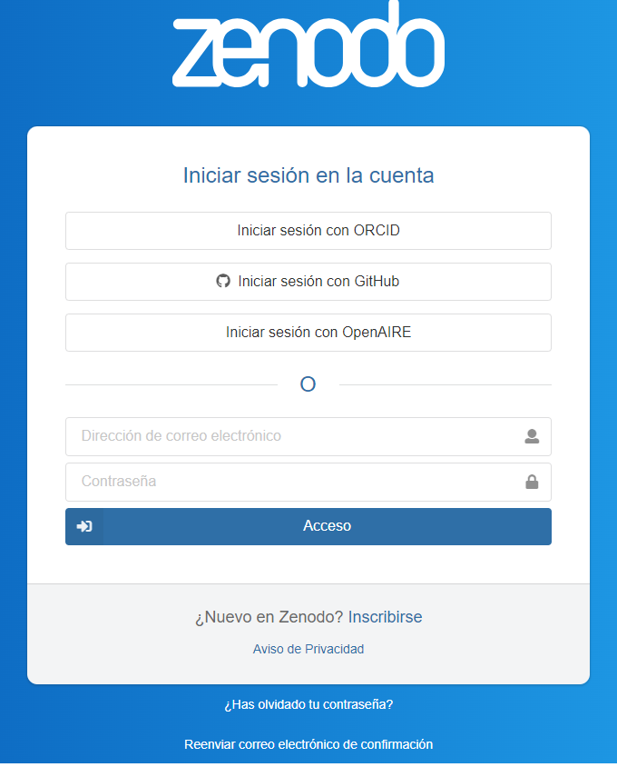

# Lección 4: Compartir Código Abierto

## Contenidos

- [Planificar para compartir tu código](#planificar-para-compartir-tu-c%C3%B3digo)
- [Cuestiones legales y de seguridad](#cuestiones-legales-y-de-seguridad)
- [Cuándo: El cronograma para archivar y compartir código](#cu%C3%A1ndo-el-cronograma-para-archivar-y-compartir-c%C3%B3digo)
- [Dónde: Dónde compartir Código Abierto](#d%C3%B3nde-d%C3%B3nde-compartir-c%C3%B3digo-abierto)
- [Cómo: Cómo habilitar la reusabilidad del código](#c%C3%B3mo-c%C3%B3mo-habilitar-la-reusabilidad-del-c%C3%B3digo)
- [Quién: Roles y responsabilidades de las personas del equipo en la implementación del PGS](#qui%C3%A9n-roles-y-responsabilidades-de-las-personas-del-equipo-en-la-implementaci%C3%B3n-del-pgs)
- [Lección 4: Resumen](#lecci%C3%B3n-4-resumen)
- [Lección 4: Evaluación](#lecci%C3%B3n-4-evaluaci%C3%B3n)

## Descripción general

En esta lección aprenderás los pasos para compartir el software que desarrollaste. Estos pasos incluyen determinar si el software debe compartirse, cuándo y dónde, qué roles son necesarios para gestionarlo y cómo permitir que otras personas usen el código.

## Objetivos de aprendizaje

Al finalizar esta lección deberías ser capaz de:

- Describir lo que significa compartir código: para archivar o para desarrollar código.
- Evaluar si se debe compartir el código y enumerar las consideraciones importantes en materia de seguridad.
- Describir las mejores prácticas sobre cuándo y dónde compartir código.
- Recordar las prácticas más habituales para ayudar a otras personas a reusar tu código.
- Enumerar los roles y las responsabilidades para compartir y mantener el código compartido.

## Planificar para compartir tu código

"Estuve trabajando en el código y ahora un nuevo colaborador quiere usarlo. ¡Genial! ¿Cuál es la mejor manera de compartir el código? ¿Por correo electrónico? ¿Cuándo debo compartir el código y qué debo incluir para asegurar que esta persona pueda usarlo fácilmente?"

### ¿Qué significa "compartir" tu código?

Para compartir, existen dos categorías principales: compartir para el desarrollo y proporcionar un registro a largo plazo (archivado).

### Desarrollo de Código Abierto

Escribir código científico suele ser un proceso dinámico y colaborativo en el que contribuyen varias personas y el código evoluciona con el tiempo. En este tipo de proyectos, es beneficioso desarrollar Código Abierto en una plataforma pública de alojamiento de repositorios como GitHub, Bitbucket, GitLab, etc. desde el principio del proyecto. Esto garantiza que todas las actualizaciones se compartan abiertamente en la web y puedan llegar a quienes buscan colaborar y a potenciales personas usuarias casi en tiempo real.

### Archivado de Código Abierto

Archivar el código garantiza que sea accesible a largo plazo y pueda cumplir con los requisitos de archivo de organismos de financiación e instituciones. La accesibilidad a largo plazo ayuda a otras personas a reproducir tus resultados mucho tiempo después de tu publicación. El archivado por sí solo no fomenta el desarrollo continuo ni la colaboración. Se trata de preservar el software de forma estática y a largo plazo, no de hacerlo evolucionar.

### ¿Deberías compartir tu software?

Hay varias cuestiones legales y de seguridad que hay que tener en cuenta a la hora de crear o usar Software Abierto.

- Por lo general, cualquier software que crees se considera propiedad intelectual y puede estar controlado por las políticas de tu institución u organización.
- Tales políticas pueden influir en cuán abiertamente se puede compartir el software y, por lo tanto, en su licencia.
- La descarga y contribución a proyectos de Software Abierto pueden estar reguladas por las políticas de seguridad informática de tu institución.

En cambio, si el software se desarrolló con financiación externa (por ej. gubernamental), algunos organismos de financiamiento pueden exigir que el software se comparta abiertamente.

### Plan de Gestión de Software (PGS)

¿Recuerdas las partes del Plan de Gestión de Software? ¿Qué debemos tener en cuenta a la hora de compartir?

- **Qué:** Descripción de la gestión, conservación y distribución del software.
- **Cuándo:** El cronograma para archivar y compartir software.
- **Dónde:** Ubicación donde se compartirá y archivará el software a largo plazo.
- **Cómo:** Habilitar la reusabilidad del software mediante la asignación de un DOI, licencia, pautas de contribución, etc.
- **Quién:** Roles, funciones y responsabilidades de las personas que participan del equipo.

## Cuestiones legales y de seguridad

<table>
  <thead>
    <tr>
        <th>CUESTIONES LEGALES ☑</th>
        <th>CUESTIONES DE SEGURIDAD</th>
    </tr>
  </thead>
  <tbody>
    <tr>
        <td colspan="2">
            
Todo aquel que escriba código y software de investigación debe familiarizarse con las políticas de su institución en materia de compartir y publicar software. Los organismos de financiamiento, gubernamentales o privados, pueden tener requisitos estrictos en cuanto a Software Abierto. En otras ocasiones, la institución puede no permitir que se comparta el software.

            
Las cuestiones legales pueden incluir preguntas como:

            <ul>
                <li>¿El propietario del software es la persona que desarrolla o una institución?</li>
                <li>Compartir (o no compartir) el software ¿viola las políticas del organismo de financiamiento?</li>
                <li>¿Existen leyes o normas locales que regulen el acto de compartir propiedad intelectual?</li>
                <li>¿Qué licencia de software se necesita?</li>
            </ul>
            
<strong>Cuando decidas participar o iniciar un nuevo proyecto de Software Abierto, familiarízate con las políticas tecnológicas y prácticas de tu institución.</strong>

            
Más información sobre los aspectos legales <a href="https://opensource.guide/legal/">aquí</a>, (en inglés).

        </td>
    </tr>
  </tbody>
</table>

<table>
  <thead>
    <tr>
        <th>CUESTIONES LEGALES</th>
        <th>CUESTIONES DE SEGURIDAD ☑</th>
    </tr>
  </thead>
  <tbody>
    <tr>
        <td colspan="2">
            
La seguridad es una preocupación a la hora de compartir software. Las personas malintencionadas pueden adjuntar código malicioso a los programas en un intento de infiltrarse en los sistemas informáticos a través de vulnerabilidades de seguridad, exponiendo potencialmente información sensible y privada que puede acarrear grandes pérdidas económicas a los usuarios. Los riesgos de seguridad deben tenerse en cuenta a la hora de compartir software.

            
Las cuestiones de seguridad pueden incluir:

            <ul>
                <li>¿La políticas tecnológicas de tu institución permite que pongas a prueba el código que quieres usar en tu máquina?</li>
                <li>¿El repositorio al que quieres contribuir es confiable?</li>
                <li>¿Hay algún problema de seguridad del código reportado?</li>
            </ul>
            
<strong>Cuando decidas participar o iniciar un nuevo proyecto de Software Abierto, familiarízate con las políticas informáticas de tu institución.</strong>

            
Más información sobre los aspectos de seguridad <a href="https://opensciency.github.io/sprint-content/open-software/lesson2-pros-cons.html#security-concerns">aquí</a>, (en inglés).

        </td>
    </tr>
  </tbody>
</table>

### Compartir software creado con fondos públicos de los Estados Unidos

Muchas agencias federales ya permiten (si no exigen) compartir el código creado en el marco de sus programas de subsidios. Por ejemplo:

- [NASA](https://www.nasa.gov/open/open-source-development.html) (en inglés) "...estamos llegando activamente a proyectos dentro de la NASA para hacer uso de ...recursos para publicar Código Abierto."
- [Departamento de Comercio de los EE.UU.](https://www.commerce.gov/about/policies/source-code) (en inglés) "...exige que los organismos desarrollen planes para publicar al menos el 20 por ciento del nuevo código fuente desarrollado a medida como software de Código Abierto (en inglés _Open Source Software_ OSS) al encargar un nuevo software hecho a medida."
- [USGS](https://www.usgs.gov/survey-manual/im-osqi-2019-01-review-and-approval-scientific-software-release) (en inglés) "...las versiones de software se consideran bienes de dominio público y, por lo general, están disponibles sin restricciones."

¿Recibes dinero de un subsidio? Lee la convocatoria original del subsidio para ver si permite o requiere la publicación del código y comprueba si contiene algún texto sobre la gestión del software y alguna condición para publicar el código. En caso de duda, ponte en contacto con tu institución para obtener información adicional.

### Actividad 4.1: Encuentra las políticas de publicación de software de tu institución

Supongamos que deseas iniciar un nuevo proyecto de Código Abierto:

- Conoce las políticas de tu institución u organización en materia de publicación de software.
- ¿Cuál es el proceso para publicar un software?
- ¿Alguien de la organización tiene que aprobar este lanzamiento?
- ¿Existen políticas con respecto a las contribuciones externas?
- ¿Tu organización requiere una atribución o crédito específico?

#### Conclusiones clave: Conoce las políticas de publicación de software de tu organización

Las políticas de publicación de software difieren según la organización y cada pieza de software es diferente. Por lo tanto, es importante que no hagamos suposiciones basadas en experiencias anteriores para pensar estas políticas.

## Cuándo: El cronograma para archivar y compartir código

Planificar compartir tu código al comienzo de tu proyecto hace que compartirlo sea más fácil cuando esté listo. El momento exacto de tu flujo de trabajo en el que decidas compartir públicamente tu código depende de los requisitos de la agencia de financiación, la organización, o la editorial.

Por ejemplo, ¿qué dice la NASA?

Si estás escribiendo software científico para un proyecto financiado por el Directorio de Misiones Científicas de la NASA (SMD en inglés, _NASA Science Mission Directorate_) entonces:

"El software científico necesario para validar las conclusiones científicas de los artículos revisados por pares resultantes de las actividades científicas financiadas por el SMD se pondrá a disposición del público a más tardar en la fecha de publicación del artículo. Esto incluye software necesario para derivar los hallazgos comunicados en figuras, mapas y tablas, así como software científicamente útil de modelos y simulaciones".

**[Guía científica de Código Abierto (_NASA SMD's Open-Source Science Guidance_)](https://smd-cms.nasa.gov/wp-content/uploads/2023/07/smd-open-source-science-guidance-v2-20230407.pdf)** (en inglés).

Otras organizaciones pueden tener orientaciones diferentes, por lo que siempre es mejor comprobar lo que exige la agencia u organización financiadora.

## Dónde: Dónde compartir Código Abierto

### Consideraciones generales

Al igual que los datos, el código puede compartirse de muchas maneras; por ejemplo, por correo electrónico o en un sitio web personal, aunque estos métodos no son recomendables. Entonces, ¿dónde deberías compartir tu Código Abierto?

En primer lugar, considera las políticas de tu institución o agencia de financiación, que pueden dictar dónde debes y puedes compartir. Por ejemplo, algunas agencias de financiación especifican los depósitos a largo plazo donde debes archivar el código, y pueden restringir la posibilidad de compartirlo en otras formas de repositorios. Tu disciplina científica, también puede tener un repositorio específico para Código Abierto.

#### ¿Cuáles son las mejores opciones y prácticas para archivar el código?

- Archiva Código Abierto con un artículo de revista de Acceso Abierto.
- Si el Código Abierto está en un repositorio de desarrollo en línea activo como GitHub, crea una versión y archiva el código en un repositorio a largo plazo con un DOI como Zenodo, que puede integrarse con GitHub (más detalles sobre este proceso más adelante).
- Archiva el código en otros repositorios públicos a largo plazo, como Software Heritage.

#### ¿Tu código es un paquete de software importante y de interés para un número significativo de personas de diversas disciplinas? ¿Dónde más puedes compartir tu Código Abierto?

- Desarrolla tu software en un repositorio público como GitHub.
- Publica en un repositorio de software usado por los gestores de paquetes comunes para facilitar la instalación del software (por ej. Anaconda, CRAN, PyPI).
- Presenta el software en conferencias.
- Publica el software en una revista dedicada al Software Abierto (por ej. JOSS).
- Consigue que tu software sea revisado por personas expertas a través de comunidades como PyOpenSci.

#### Para compartir mi código, sólo tengo que añadirlo a GitHub ¿verdad?

No necesariamente. Se alienta a compartir en un repositorio, pero la organización que financia la investigación puede requerir un DOI de un repositorio de archivo, como Zenodo, para la preservación a largo plazo de su código en el momento de la publicación o lanzamiento de versiones.

## Cómo: Cómo habilitar la reusabilidad del código

Ahora que has compartido tu código de la forma adecuada, es importante considerar si has facilitado a otras personas (o a tu yo del futuro) la reusabilidad de tu código.

### Asignar una licencia

Como recordarás de la lección anterior, para que otras personas sepan cómo usar tu código es necesario asignar una licencia adecuada.

A modo de ejemplo, aquí te mostramos cómo asignar una licencia a un repositorio de GitHub:

Elige la licencia adecuada para compartir software de manera que cumpla con los requisitos de tu organización. Para crear una plantilla de licencia en GitHub, añade un nuevo archivo y escribe "LICENSE" (LICENCIA) en el campo de nombre, entonces aparecerá la opción "Elegir una plantilla de licencia" (en inglés _choose a license template_).

Asegúrate de que tu repositorio de GitHub sea público, para que cualquiera pueda realizar búsquedas en él.

### Hacer el código citable

No todo el código tiene que ser citable. Sin embargo, cuando se publica de forma independiente, existen algunas prácticas recomendadas para hacer que tu código sea citable.

Añadir el código a un repositorio de GitHub no es suficiente para archivar código. Para archivar, se debe asignar un identificador persistente.

Generar un identificador persistente para tu código es la mejor manera de hacerlo citable. Esto podría hacerse mediante una publicación revisada por pares que describa el software, o archivando el software en un repositorio a largo plazo que proporcione un DOI o un identificador similar. Para el código compartido en GitHub, un [DOI se puede generar fácilmente para cada versión del software de Zenodo.](https://docs.github.com/en/repositories/archiving-a-github-repository/referencing-and-citing-content#issuing-a-persistent-identifier-for-your-repository-with-zenodo) (en innglés).

### Actividad 4.2: Crear un DOI para un archivo de código de prueba

Puedes crear Identificadores de Objetos Digitales (en inglés, _Digital Object Identifiers, DOIs_) para hacer citable tu código. Para esto, archiva un repositorio de código GitHub en Zenodo y emite un DOI para el registro.

Pasos para esta actividad:

**Parte 1: Crear un repositorio GitHub público de prueba.**

1. Inicia sesión en [GitHub](https://github.com/). Si aún no lo has hecho, crea una cuenta de usuario gratuita.
2. Crea un nuevo repositorio con este [enlace](https://github.com/new).
3. Escribe un nombre breve y que puedas recordar para tu repositorio. Por ejemplo, "os-test".
4. Establece como 'Pública' la visibilidad del repositorio seleccionando esta opción durante su creación.
5. En 'Inicializar este repositorio con:' (_Initialize this repository with:_ en inglés) selecciona 'Añadir un archivo README' (_Add a README file_ en inglés).
6. Selecciona cualquier licencia con el botón (_Choose a license_ en inglés).
7. Haz clic en 'Crear repositorio' (_Create repository_ en inglés).
8. Se te redirigirá automáticamente a la página de tu nuevo repositorio.
9. Ahora obtendremos un DOI de la aplicación Zenodo. Ten en cuenta que vamos a usar [https://sandbox.zenodo.org/](https://sandbox.zenodo.org/) para hacer esto. ¡Esto ofrece todas las mismas posibilidades que [https://zenodo.org](https://zenodo.org/) pero es un sitio de pruebas! Crea una cuenta gratuita si aún no lo has hecho.

**Parte 2: Crear un repositorio archivado y DOI afiliados.**

1. Ve a la [página de Zenodo GitHub](https://sandbox.zenodo.org/account/settings/github/). Selecciona el botón 'Conectar' para permitir que Zenodo acceda a sus repositorios de GitHub.

2. Revisa la información sobre los permisos de acceso y selecciona 'Autorizar Zenodo'.
3. Sincroniza tu GitHub con Zenodo seleccionando la opción 'Sincronizar ahora'.

4. Localiza el interruptor (en inglés, _switch_) del repositorio que deseas archivar ('os-test'), cambia el estado a 'Encendido' (en inglés, _On_) para activar la conservación automática del software.
5. Selecciona el nombre del repositorio.
6. Localiza y selecciona el botón que contiene 'usuario/os-test'

7. Añade una etiqueta 'test'. Es posible que tengas que crear una nueva etiqueta para 'test' si se te solicita.
8. Localiza y selecciona el botón 'publicar lanzamiento' (en inglés, _publish release_).

9. Navega la página [Zenodo GitHub](https://sandbox.zenodo.org/account/settings/github/) y verifica el DOI para 'os-test'.
10. A continuación, comparte tu DOI.

Zenodo archiva tu repositorio y emite un nuevo DOI cada vez que creas un nuevo [lanzamiento](https://docs.github.com/en/repositories/releasing-projects-on-github/about-releases) GitHub. Sigue los pasos en "[Administrar lanzamientos en un repositorio](https://docs.github.com/en/repositories/releasing-projects-on-github/managing-releases-in-a-repository)" (en inglés _Managing releases in a repository_) para crear uno nuevo.

### Hacer tu código fácil de citar

La información sobre cómo citar el software puede ser añadida a el README (LEEME) u otra documentación en tu repositorio. Otro paso útil para hacer accesible la información de citas de tu repositorio es añadir un archivo CITATION (CITACIÓN) al repositorio.

### ¿Por qué usar archivos CITATION?

Los archivos CITATION son un medio para hacer que la información de citas sea fácilmente accesible en repositorios de software de Código Abierto. Un [formato de archivo de citas (en inglés, _Citation File Format, CFF_)](https://citation-file-format.github.io/) es un formato estándar legible por humanos y máquinas que se ha desarrollado para los archivos CITATION.

### Pautas para colaborar

Si esperas que la comunidad contribuya con tu software, es una buena práctica incluir archivos CONTRIBUTING (CONTRIBUIR) y CODE_OF_CONDUCT (CÓDIGO DE CONDUCTA) en tu repositorio que describan las expectativas para las interacciones de las personas participantes.

No entraremos en detalles aquí, pero puedes consultar el [repositorio GitHub del paquete Xarray](https://github.com/pydata/xarray/tree/main) (en inglés) para ver un buen ejemplo.

## Quién: Roles y responsabilidades de las personas del equipo en la implementación del PGS

Cuando se escribe un Plan de Gestión de Software (PGS) (en inglés, _Software Management Plan, SMP_), es importante incluir un plan para los roles y responsabilidades necesarios para compartir y (si corresponde) mantener tu código. Tu comunidad estará formada por personas con diferentes roles: algunas participarán activamente, otras sólo tendrán un interés pasajero. A veces, una sola persona puede desempeñar fácilmente varias funciones (por ejemplo, si sólo estás archivando una pieza de código).

Algunos roles podrían incluir:

**¿Quién añadirá el código a un repositorio público?**

- Subir el código
- Asignar una licencia

**¿Quién se encargará de la documentación del código?**

- Escribir un archivo README (LEEME)
- Añadir comentarios explicativos al código

**¿Quién ayudará con la reusabilidad del código?**

Añadir archivos CITATION (CITACIÓN), CONTRIBUTING (CONTRIBUIR), y CODE_OF_CONDUCT (CÓDIGO DE CONDUCTA).

**¿Quién mantendrá el software (si corresponde)?**

- ¿Quién responderá a la retroalimentación de la comunidad (por ejemplo, a través de problemas en GitHub)?
- ¿Quién será responsable de decidir qué código añadir/actualizar de otras personas colaboradoras? (por ejemplo, mediante solicitudes de GitHub)

---

Todos estos roles pueden o no ser necesarios, según sea el tamaño de tu proyecto. Es necesario contar con un proceso transparente para asignar cualquiera de los roles a quienes participan de la comunidad.

### Responsabilidades después de compartir

Si el software está pensado para que otras personas lo usen, entonces quien desarrolla debería mantener el software.

- Es cortés por parte de quien desarrolla informar a las personas que lo usan si tienen la intención de mantener el software/código o no.
- Menciona esto en la documentación donde se discuta el estado de desarrollo del proyecto.
- Esto ayudará a quienes lo usen a saber si seguirán recibiendo apoyo en el futuro, y les permitirá tomar decisiones sobre la posibilidad de basar su trabajo en curso en tu proyecto.
- En caso de que quien desarrolle/investigue no disponga del tiempo o el financiamiento necesaria para seguir adelante con su proyecto, pero otras personas estén interesadas en mantenerlo, considera la posibilidad de ceder la propiedad del software a quienes investiguen/desarrollen/participen, o la entidad interesada en su uso continuo.
- Quienes usen software que ya no está siendo mantenido pueden considerar contactar a la persona dueña/desarrolladora y ofrecerse voluntariamente para mantenerlo, o para asumir la propiedad del proyecto.
- Si decides mantener tu software, deberías responder a las solicitudes de características y correcciones en la medida de tus posibilidades.

## Lección 4: Resumen

En esta lección aprendiste los pasos clave para compartir Software Abierto:

- ¿Deberías compartir? Al compartir software, se deben seguir las políticas de tu institución y agencia de financiamiento. Éstas pueden limitar la apertura del software. Las políticas de publicación de software también varían según la organización.
- ¿Cuándo compartir? Sigue las pautas de tu organización, agencia de financiamiento o editorial.
- ¿Dónde compartir? Depende de si estás archivando o compartiendo para recibir comentarios de la comunidad. Usa repositorios específicos de dominio cuando corresponda.
- ¿Cómo permitir la reusabilidad? Habilita la reusabilidad mediante la asignación de un DOI e incluye una licencia, información de citas y pautas para las personas que colaboran.
- ¿Quién ayuda a compartir? Planifica los roles y responsabilidades cuando se comparta y (si es aplicable) para mantener el software.

## Lección 4: Evaluación

Responde las siguientes preguntas para poner a prueba lo que has aprendido hasta ahora.

_Pregunta_

**01/06**

Lee la siguiente afirmación y decide si es verdadera o falsa:

_No necesito compartir mi código si no tengo intención de seguir desarrollándolo._

- Verdadero
- Falso

_Pregunta_

**02/06**

Lee la siguiente afirmación y decide si es verdadera o falsa:

_Añadir el código a un repositorio de GitHub es suficiente para archivar mi código._

- Verdadero
- Falso

_Pregunta_

**03/06**

Lee la siguiente afirmación y decide si es verdadera o falsa:

_Las políticas de uso compartido de software de organizaciones y gobiernos siguen una práctica estándar._

- Verdadero
- Falso

_Pregunta_

**04/06**

Lee la siguiente afirmación y decide si es verdadera o falsa:

_Publicar tu software en un repositorio de software usado por los gestores de paquetes habituales facilita a las personas usuarias la instalación de tu software._

- Verdadero
- Falso

_Pregunta_

**05/06**

¿Cuáles de las siguientes, si las hay, son formas en las que puedes ayudar a otras personas a reusar tu código? Selecciona todas las que correspondan.

- Asignar una licencia adecuada
- Añadir un archivo llamado "CONTRIBUTION" (CONTRIBUIR) con pautas para las personas que colaboran
- Añadir un archivo llamado "CITATION" (CITACIÓN) con información de citas

_Pregunta_

**06/06**

¿Cuáles de los siguientes son roles que deberías planificar al escribir un PGS? Selecciona todos los que correspondan.

- Quién ayudará a mantener el software
- Quién creará el repositorio y añadirá los archivos necesarios
- Quién contribuirá al software después de que se comparta
- Quién agregará documentación al software
