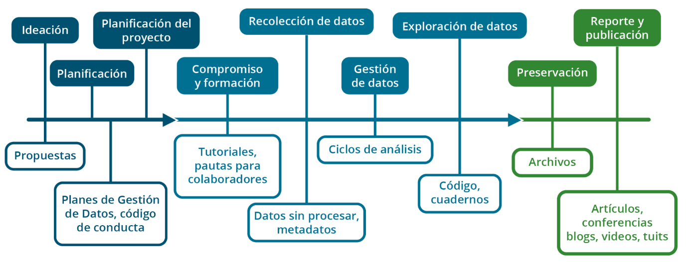
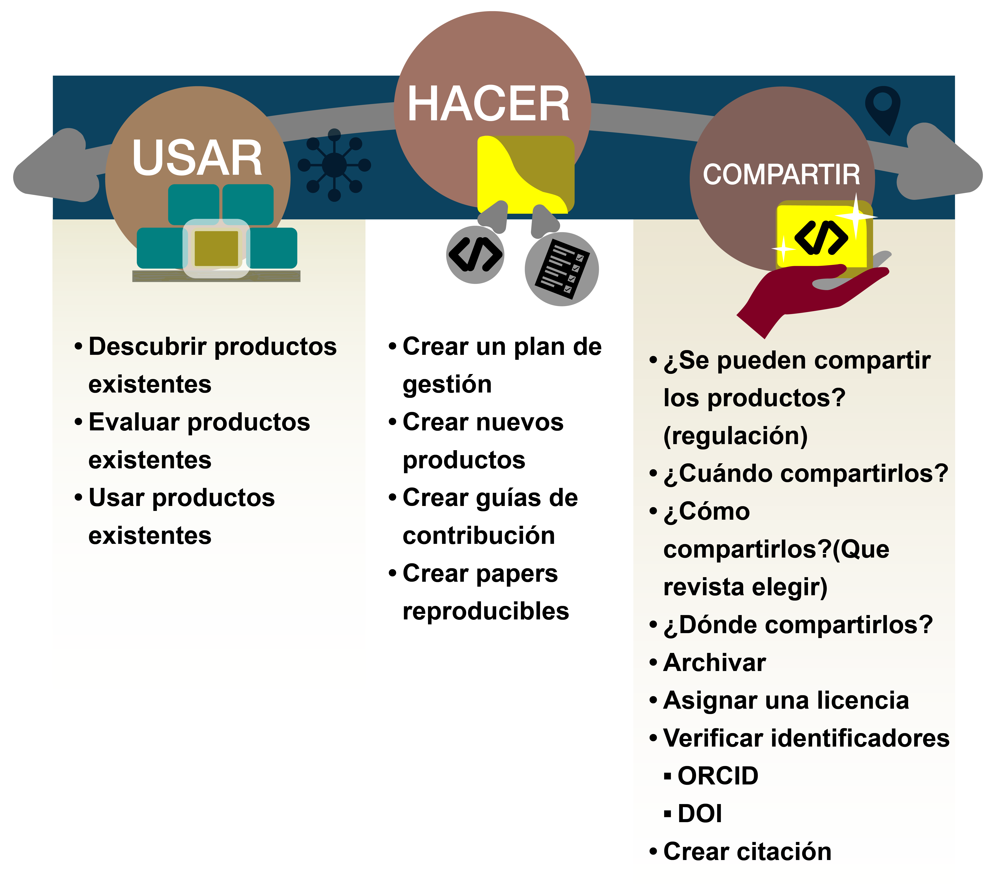
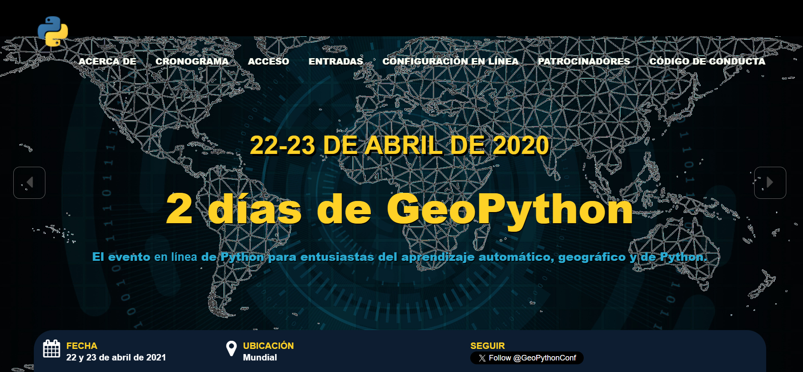
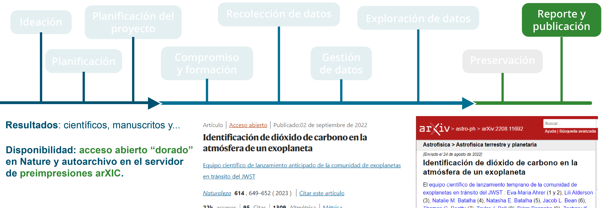
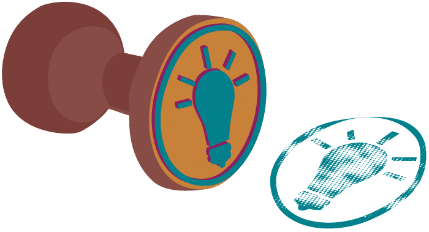
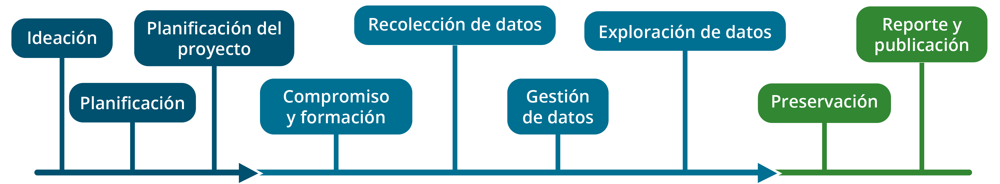

# Lección 1: Introducción a Resultados Abiertos

## Contenidos

- [¿Qué objetos de investigación se crean a lo largo del ciclo de investigación?](#what-research-objects-are-created-throughout-the-research-cycle)
- [Ejemplos de Resultados Abiertos](#examples-of-open-results)
- [¿Qué es la crisis de reproducibilidad?](#what-is-the-reproducibility-crisis)
- [Lección 1: Resumen](#lesson-1-summary)
- [Lección 1: Evaluación](#lesson-1-knowledge-check)

## Descripción general

Esta lección tiene como objetivo ampliar tu perspectiva sobre los resultados de investigación que pueden compartirse a lo largo del ciclo de vida de una investigación. Primero consideraremos qué es un Resultado Abierto. Para hacerlo, veremos un ejemplo de un proyecto de investigación de vanguardia que utiliza las mejores prácticas de Resultados Abiertos. Las perspectivas obtenidas con este ejemplo nos harán reflexionar sobre cómo podemos trabajar para crear investigación reproducible.

## Objetivos de aprendizaje

Al finalizar esta lección deberías ser capaz de:

- Describir en que consisten los Resultados Abiertos y enumerar los objetos de investigación que pueden ser creados a lo largo de un ciclo de investigación.
- Describir cómo compartir Resultados Abiertos puede hacer progresar la ciencia y tu carrera.
- Explicar qué es la crisis de reproducibilidad y cómo la Ciencia Abierta puede ayudar a combatirla.

## ¿Qué objetos de investigación se crean a lo largo del ciclo de investigación?

### La representación tradicional de un "resultado científico" ha cambiado con el tiempo

Cuando pensamos en resultados, la mayoría de las personas piensa sólo en la publicación final.

**1665**

Esta publicación se remonta a 1665, cuando se estableció la primera revista científica _Philosophical Transactions_ para publicar cartas sobre observaciones y experimentaciones científicas.

**1940s**

Más tarde, en la década de 1940, el trabajo editorial comenzó a comercializarse y se convirtió en el mecanismo para publicar revistas, actas de conferencias y libros. Este nuevo modelo de negocio normalizó las barreras de pago para la publicación.

**Siglo XXI**

Recién en el siglo XXI la comunidad científica amplió el significado de Resultados Abiertos. La evolución de esta definición fue impulsada por avances tecnológicos, como Internet y mejoras en los modos de compartir información. El movimiento de Acceso Abierto fue establecido por la Iniciaativa de Acceso Abierto de Budapest [_Budapest Open Access Initiative_](https://www.budapestopenaccessinitiative.org/)(en inglés) en 2002 y la Declaración de Berlín sobre Acceso Abierto [_Berlin Declaration on Open Access_](https://openaccess.mpg.de/Berlin-Declaration) (en inglés) en 2003, ambas formalizaron la idea de que, con respecto a los nuevos conocimientos, debería haber "disponibilidad gratuita en la Internet pública, permitir a cualquier persona leer, descargar, copiar, distribuir, imprimir, buscar o enlazar el texto completo de estos artículos" (_Budapest Open Access Initiative_).

### Pero los resultados siempre han sido mucho más que sólo la publicación

Es posible que conozcas como es el ciclo de vida de una investigación, pero tal vez no hayas considerado qué resultados podrían compartirse abiertamente a lo largo de este proceso. Esta lección adopta una definición del ciclo de vida de la investigación basada en [_The Turing Way_](https://the-turing-way.netlify.app/index.html) (en inglés) y lo desglosa en nueve fases, como se muestra en la figura a continuación.

Aunque las fases se presentan de forma lineal, ¡reconocemos que el ciclo de vida de la investigación rara vez es lineal! A lo largo del proceso científico se crean productos que son necesarios para permitir que otras personas reproduzcan los hallazgos. Los productos de la investigación incluyen datos, códigos, secuencias de análisis, artículos, ¡y más!

Siguiendo a [Garcia-Silva et al. 2019](https://www.sciencedirect.com/science/article/abs/pii/S0167739X18314638) (en inglés), definimos un objeto de investigación (OI) como un método para la identificación, agregación e intercambio de información académica en la Web. Los objetos de investigación pueden estar compuestos tanto por datos de investigación como por objetos de investigación digitales, tal como sugiere la Organización para la Cooperación y el Desarrollo Económico, OCDE, ([Instrumentos OECD](https://legalinstruments.oecd.org/en/instruments/OECD-LEGAL-0347) en inglés).

El término "Resultados Abiertos" incluye de manera integral todos estos productos de investigación y más.

Los Resultados Abiertos pueden incluir tanto datos como código. Dado que los datos y el código fueron cubiertos en módulos anteriores, en esta lección nos enfocamos en compartir los resultados científicos como Resultados Abiertos. Ejemplos que pueden incluirse como Resultados Abiertos:

- Artículos con revisión de pares de Acceso Abierto.
- Informes técnicos.
- Cuadernos computacionales.
- Códigos de conducta, instrucciones para colaborar, políticas de publicación.
- Publicaciones de blog.
- Vídeos cortos y _podcasts_.
- Publicaciones en redes sociales.
- Resúmenes y presentaciones en conferencias.
- Discusiones en foros.

Los artículos revisados por pares y de Acceso Abierto se archivan para su conservación a largo plazo y representan un debate más formal de ideas científicas, interpretaciones y conclusiones. Estos debates informan el método que los investigadores utilizan para compartir resultados. En la siguiente sección de esta lección, discutiremos diferentes tipos de intercambio y métodos para construirlos y adaptarlos para usar en tu investigación.

Las personas científicas pueden compartir su progreso incremental a lo largo del proceso de investigación e invitar a la comunidad a dejar sus comentarios. Compartir más partes del proceso de investigación crea más interacciones entre quienes investigan y puede mejorar el resultado final (que puede ser un artículo revisado por pares).

A lo largo de este módulo te mostraremos cómo usar, crear y compartir Resultados Abiertos.

### La práctica de lo 'Abierto'

Específicamente, el sistema "Usar, Hacer, Compartir" ha sido naturalmente integrado a lo largo de este plan de estudios y debería resultarte un formato familiar en este momento. La Lección 2 cubrirá "Usar". La Lección 3, "Hacer". Y la Lección 4, "Compartir". A lo largo de este módulo, prestaremos especial atención a los manuscritos y otros productos de investigación como ejemplos porque los módulos anteriores cubrieron el sistema "Usar, Hacer, Compartir" sobre datos y software abiertos.

## Ejemplos de Resultados Abiertos

Ampliemos nuestras perspectivas sobre los tipos de **objetos de investigación** que se producen a lo largo del proceso de investigación. Veamos algunos ejemplos de diferentes proyectos.

### Llegar a nuevas audiencias

El profesor Qiusheng Wu, asociado en la Universidad de Tennesee, creó un [canal de YouTube](https://youtube.com/%40giswqs) (en inglés) en abril de 2020 con el propósito de compartir tutoriales de vídeo sobre el [paquete geemap de Python](https://geemap.org/) que estaba desarrollando. Desde entonces, Wu ha publicado más de 690 tutoriales en vídeo sobre temas geoespaciales de Código Abierto. El canal ha ganado más de 35.000 suscriptores, cuenta con casi 1.6 millones de visitas y 80.000 horas de reloj en total (hasta agosto de 2024). 

El canal de YouTube le ha permitido a Wu llegar a una audiencia mucho más amplia, más allá de los límites de un aula tradicional. Ha hecho que la investigación geoespacial de vanguardia sea más accesible para el público en general y ha logrado colaboraciones con personas de todo el mundo. Esto ha sido particularmente beneficioso para la promoción de Wu, ya que resultó en mayores oportunidades de financiamiento, publicaciones y participación pública a través del canal de YouTube, redes sociales y GitHub.

En general, el canal de YouTube sirve como una herramienta importante para que Wu difunda investigaciones, inspire a otras personas y contribuya al avance de la ciencia. También desempeña un papel importante en el avance de la carrera profesional de Wu.

### Nuevos medios para productos científicos

"Un nuevo método redujo el tiempo de cálculo de esta imagen de aproximadamente 30 minutos a menos de 1 minuto". En 2021, Lucas Sterzinger pasó un verano de su doctorado en una pasantía. Durante ese verano, escribió una publicación en un blog para explicar y demostrar una tecnología innovadora llamada Kerchunk, una biblioteca que hace que el acceso a datos científicos en la nube sea mucho más rápido.

Fuente: [https://medium.com/pangeo/fake-it-until-you-make-it-reading-goes-netcdf4-data-on-aws-s3-as-zarr-for-rapid-data-access-61e33f8fe685](https://medium.com/pangeo/fake-it-until-you-make-it-reading-goes-netcdf4-data-on-aws-s3-as-zarr-for-rapid-data-access-61e33f8fe685) (en inglés)

---

Además de la publicación del blog, también creó un tutorial en forma de Jupyter Notebook (cuaderno commputacional): tanto estos recursos como el código asociado son de libre acceso para el público, lo que permite una adopción e iteración rápidas por parte de otras personas desarrolladoras y científicas. Publicó el blog en Medium y lo compartió en Twitter. El blog atrajo mucha atención sobre una tecnología reciente, ¡a medida que se desarrollaba! Esto es marcadamente diferente al lento y complicado mundo de las publicaciones académicas, donde este resultado no se habría compartido durante aproximadamente un año (por el proceso de redacción, revisión, y publicación). Dijo: "Trabajar en Kerchunk y compartirlo ampliamente utilizando los principios de la Ciencia Abierta expandió mis conexiones profesionales y me introdujo en el campo de la ingeniería de software de investigación. Las conexiones que hice a partir de esto me llevaron directamente a mi cargo actual como desarrollador de software científico en NASA".

### Nuevos productos para aumentar el impacto

Créditos de la imagen: OpenStreetMap 2011, Ken Vermette. CC BY-SA 3.0

---

Desde '2003: vamos a mapear el Reino Unido hasta 2023: más de 1,5 millones de colaboradores, más de 100 millones de ediciones, utilizando los datos para mapear el mundo con aplicaciones que van desde Uber hasta el mapeo de los Objetivos de Desarrollo Sostenible de la ONU" [OpenStreetMaps está siendo usado para análisis GIS](https://welcome.openstreetmap.org/about-osm-community/consumers/), tales como planificación o logística para grupos humanitarios, servicios públicos, gobiernos y más. Esto sólo fue posible porque fue creado, compartido abiertamente, y construido por una comunidad dedicada a mejorarlo. ¡Nunca se sabe hasta dónde podría llegar tu proyecto personal o quién podría estar interesado en colaborar!

### Nuevas visualizaciones para compartir resultados

Matplotlib fue desarrollado alrededor de 2002 por el postdoctorado John Hunter para visualizar algunos datos de neurobiología en los que estaba trabajando. El no era desarrollador de software, ¡era neurobiólogo! Podría haberse limitado a publicar el artículo en una revista revisada por pares, y tal vez haber compartido su código para crear las figuras, pero en lugar de eso inició un proyecto abierto en GitHub y pensó: «bueno, si esto es útil para mí, tal vez lo sea para otras personas...».

Fuente: [https://medium.com/dataseries/mastering-matplotlib-part-1-a480109171e3](https://medium.com/dataseries/mastering-matplotlib-part-1-a480109171e3) (en inglés)

---

Matplotlib es actualmente la librería o biblioteca de gráficas más utilizada en el lenguaje de programación Python y un componente principal del conjunto de librerías o bibliotecas científicas de Python, junto con NumPy, SciPy e IPython. Matplotlib se utilizó para la visualización de datos durante el aterrizaje de la nave Phoenix en Marte en 2008 y para la creación de la primera imagen de un agujero negro.

### Estudio del caso/proyecto JWST: Informes y publicación

Y por último, pero no por ello menos importante, tenemos el ejemplo del equipo científico del JWST del Módulo 1 sobre cómo informaron sus resultados. Esto se produjo de varias formas, desde la publicación de un artículo de revisión por pares, preimpresiones (_preprints_), publicaciones en blogs y redes sociales. Su publicación revisada por pares se publicó en formato de libre acceso en Nature junto con una preimpresión (_preprint_) a través de arXiv.

Las plataformas de comunicación abiertas ampliaron el alcance y la audiencia de los resultados.

Fuente: https://arxiv.org/abs/2208.11692

---

El público está interesado en lo que estás haciendo, y llegar a él, implica comunicación a través de plataformas tradicionales y nuevas. La publicación de resultados en plataformas como Twitter/X, Youtube, TikTok, blogs, sitios web y otras plataformas de medios sociales es cada vez más habitual. La difusión a través de las redes sociales aumenta drásticamente el alcance y la audiencia de tu trabajo. Se han realizado estudios sobre el impacto que esto tiene, en los índices de citas. Por ejemplo, The Journal of Medical Internet Research (JMIR) realizó por tres años un [estudio](https://www.jmir.org/) sobre el éxito relativo de los artículos de JMIR tanto en Twitter como en el mundo académico. Descubrieron que los artículos muy tuiteados tenían 11 veces más probabilidades de ser más citados que los artículos menos tuiteados.

Las plataformas de divulgación abiertas ampliaron notablemente el alcance y la audiencia de los resultados.

Twitter, ahora X \#1: https://twitter.com/cornerof_thesky/status/1595086671275589632?s=20 (en inglés)

Twitter, ahora X \#2: https://twitter.com/V_Parmentier/status/1595127493199302656?s=20 (en inglés)

TikTok: https://www.tiktok.com/@astrojaket/video/7168878696906886405

YouTube: https://www.youtube.com/watch?v=cI-kM_wPbbQ

---

## ¿Qué es la crisis de la reproductibilidad?

En 2016 una [encuesta Nature](https://www.nature.com/articles/533452a) (en inglés) sobre reproducibilidad, encontró que, de 1.576 investigadores, «Más del 70% de las personas que investigan han intentado y fracasado en reproducir los experimentos de otro equipo científico, y más de la mitad, han fracasado en reproducir sus propios experimentos». La “crisis de la reproducibilidad” en la ciencia es una preocupación creciente por varios estudios de reproducibilidad en los que no se reprodujeron los resultados positivos anteriores.

Si queremos resolver la crisis de reproducibilidad, debemos tener en cuenta todo el flujo de trabajo de la investigación. El hecho, que el 70% de las personas que investigan no pudieran reproducir los resultados de otros equipos científicos, resulta alarmante, sobre todo si se tiene en cuenta que la reproducibilidad de la ciencia, es la piedra angular del método científico.

A estas alturas, ya debería ser obvio que existan muchos incentivos personales, para aplicar los principios de la Ciencia Abierta, a lo largo de todas las etapas del proceso de investigación. Al hacer que los resultados sean abiertos en todo momento, aumenta la posibilidad de reproducir sus propios resultados.

Aunque la reproducibilidad de los propios resultados pueda parecer un logro trivial, un [estudio de Nature de 2016](https://www.nature.com/articles/533452a) (en inglés) descubrió que el 50% de las personas que investigan son incapaces de reproducir sus propios experimentos. Esto pone de relieve el aspecto crítico de la crisis de reproducibilidad. Esto también tiene implicaciones para la investigación, más allá de la capacidad de mejorar su investigación.

### ¿Cuál es la causa de esta crisis de reproducibilidad?

Las tres causas principales de la crisis de reproducibilidad son:

1. Los métodos intermedios de investigación suelen describirse de manera poco formal o no se describen en absoluto.
2. A menudo se omiten por completo los datos intermedios.
3. A menudo sólo se piensa en los resultados, en el momento de la publicación.

Debemos pensar en todo el proceso de investigación, como un resultado. Por ejemplo, los artículos científicos describen de manera poco precisa los métodos computacionales, lo que requiere un gran esfuerzo por parte de los demás para entenderlos y reusarlos.

Los artículos a menudo no contienen la información suficiente para que otros investigadores reproduzcan los resultados, incluso cuando se publican conjuntos de datos, según dos estudios publicados en [Genética en Nature](https://www.nature.com/articles/ng.295) (en inglés) y [Métodos en Nature](https://www.nature.com/articles/nmeth.1333) (en inglés). A menudo, los resultados de los datos sin procesar o datos intermedios y los programas informáticos correspondientes, no se facilitan junto con el artículo final, lo que limita la capacidad del lector para intentar reproducirlos.

Según otros dos estudios publicados en [Sesiones Informáticas en Bioinformatics](https://academic.oup.com/bib/article/12/3/288/258098) (en inglés) y [Física en Nature](https://www.nature.com/articles/nphys3313) (en inglés), sin acceso a los códigos fuente de los artículos, la reproducibilidad resulta complicada.

### Lucha contra la crisis de reproducibilidad

Si su flujo de trabajo de investigación utiliza los principios de los Resultados Abiertos, como se muestra en el ejemplo, esto le ayudará a superar la crisis de la reproducibilidad.

Podemos crear procesos de trabajo reproducibles y combatir esta crisis, teniendo en cuenta los Resultados Abiertos en cada etapa del ciclo de vida de la investigación. Un Plan de Ciencia Abierta y Gestión de Datos (OSDMP, por sus siglas en inglés) ayuda al equipo investigador a pensar y planificar todos los aspectos de la distribución al determinar cómo harán que el software y los datos estén disponibles. Este plan puede compartirse públicamente desde el principio mediante una práctica denominada prerregistro, donde las personas que investigan determinan su plan de análisis y el procedimiento de recolección de datos antes de iniciar un estudio (analizado anteriormente en la Lección 2 del Módulo 2).

### Actividad 1.1: ¿Qué podrías hacer?

Repensemos su flujo de trabajo de investigación. Identifique los objetos de investigación que podrían (o podrían haber sido) compartidos como Resultados Abiertos de un proyecto en el que está o estuvo involucrado. ¿Cuáles son los puntos de mayor prioridad para superar la crisis de reproducibilidad en cada área del proceso del trabajo de investigación?

- Ideación
- Planificación
- Diseño del proyecto
- Compromiso y capacitación
- Recolección de datos
- Gestión de datos
- Exploración de los datos
- Almacenamiento
- Informes y publicación

**La aplicación de los principios de la Ciencia Abierta en todas las etapas del proceso de investigación tiene muchas ventajas personales**

#### Puntos clave: ¿Qué debiéras hacer?

El equipo de OpenSciency creó una gran tabla que describe, todos los diferentes tipos de objetos de investigación que se pueden compartir y que son posibles de crear, a lo largo del ciclo de vida de la investigación.

**La tabla completa está disponible aquí**

[CLICK PARA MAS INFORMACION](https://opensciency.github.io/sprint-content/open-results/lesson1-research-process-and-results.html#research-stages-and-open-result-table)

Pensar en compartir todo de forma inmediata, puede resultar agotador cuando se está empezando. Para avanzar, concéntrese en cómo puede elegir el elemento más importante. Aquí se ha reducido la lista a un par de artículos por categoría. Además, puede pensar en acortar aún más la lista cuando esté empezando. Por ejemplo, puede que, para trabajar, compartir el código utilizado para procesar los datos sea el elemento más importante para la reproducibilidad. Por lo tanto, compartir código sería un buen punto de partida para iniciar el trabajo ó experiencia en Ciencia Abierta. Los pequeños pasos que damos son los que nos hacen avanzar hacia una Ciencia Abierta sostenible.

- **Propuesta:** Las propuestas pueden compartirse en Zenodo y en plataformas de subvención abiertas como [ogrants.org](https://www.ogrants.org/).
- **Planificación:** Los proyectos pueden prerregistrarse antes de comenzar.
- **Diseño del proyecto:** Se pueden publicar las pautas de las personas que colaboran o un código de conducta en Zenodo, GitHub o en las páginas web del equipo.
- **Compromiso y capacitación:** Las guías de los procesos de desarrollo del trabajo de investigación, pueden compartirse con el equipo a través de GitHub y publicarse en Zenodo.
- **Recopilación de datos:** Los datos sin procesar pueden compartirse a través de repositorios de datos.
- **Gestión de Datos:** El código puede compartirse a través de repositorios de software.
- **Exploración de datos:** Las guías de los procesos (notebooks), pueden ser compartidas a través de GitHub y publicadas en Zenodo.
- **Almacenamiento:** Los planes de gestión de datos para almacenamiento de la información pueden publicarse en Zenodo.
- **Informes y publicación:**
  - Libre acceso a artículos revisados por pares
  - Cuadernos computacionales
  - Código de conducta, pautas para las personas que colaboran, políticas de publicación
  - Publicaciones en Blogs
  - Vídeos de corta duración y podcasts
  - Publicaciones en redes sociales
  - Resúmenes de conferencias, posters y presentaciones (cuando estén disponibles públicamente)
  - Foros de discusión

## Lección 1: Resumen

En esta lección, aprendiste que:

- El flujo de trabajo científico contemporáneo implica ser abierto en cuanto a procesos y productos. Los productos de la investigación (resultados) incluyen mucho más que el informe final, lo que supone un cambio drástico respecto a la noción histórica de resultado científico.
- En cada etapa del proceso de desarrollo de la investigación se producen objetos de investigación que podemos considerar resultados.
- Podemos combatir la crisis de reproducibilidad compartiendo estos objetos de investigación en cada etapa de nuestro flujo de trabajo en investigación.
- ¡Existen ejemplos asombrosos de grupos de investigación que comparten distintos tipos de resultados de Acceso Abierto!

Empecemos a pensar en lo que podemos hacer inmediatamente, para avanzar hacia los procesos de desarrollo de investigación abierta.

## Lección 1: Evaluación

Responde a las siguientes preguntas para comprobar lo que has aprendido hasta ahora.

_Pregunta_

**01/02**

De las siguientes opciones, ¿Cuál se ajusta a la definición de "objeto de investigación"?

- Datos sin procesar
- Blog / Publicación
- Propuesta
- Código de conducta
- Todas las anteriores

_Pregunta_

**02/02**

¿Cuáles son algunas de las principales causas de la crisis de reproducibilidad?

- Los métodos intermedios de investigación suelen describirse de manera poco formal o no se describen en absoluto.
- A menudo se omiten por completo los datos intermedios.
- A menudo sólo pensamos en los resultados en el momento de la publicación.
- Todas las anteriores
