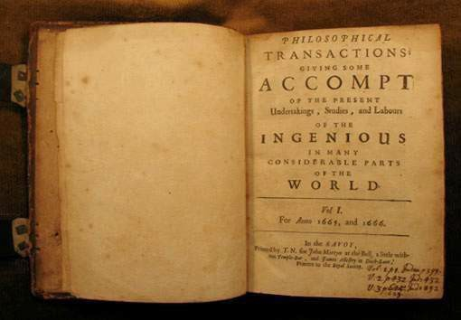

# Lección 1: Introducción a Resultados Abiertos

## Temas a desarrollar

- [¿Qué objetos de investigación se crean a lo largo del ciclo de investigación?](#what-research-objects-are-created-throughout-the-research-cycle)
- [Ejemplos de resultados abiertos](#examples-of-open-results)
- [¿Qué es la crisis de reproducibilidad?](#what-is-the-reproducibility-crisis)
- [Lección 1: Resumen](#lesson-1-summary)
- [Lección 1: Evaluación](#lesson-1-knowledge-check)

## Descripción general

Esta lección tiene como objetivo ampliar tu perspectiva sobre los resultados de investigación compartibles que se producen a lo largo del ciclo de vida de la investigación. Primero consideraremos qué es un resultado abierto. Para hacerlo, leeremos un ejemplo de un proyecto de investigación de vanguardia que utiliza las mejores prácticas de resultados abiertos. Las perspectivas obtenidas con este ejemplo nos harán reflexionar sobre cómo podemos trabajar para crear investigación reproducible.

## Objetivos de aprendizaje

Después de completar esta lección, deberías ser capaz de:

- Describir qué constituye resultados abiertos y enumerar los objetos de investigación que pueden ser creados a lo largo de un ciclo de investigación.
- Describir cómo compartir resultados abiertos puede hacer progresar la ciencia y tu carrera.
- Explicar qué es la crisis de reproducibilidad y cómo la ciencia abierta puede ayudar a combatirla.

## ¿Qué objetos de investigación se crean a lo largo del ciclo de investigación?

### La representación tradicional de un "resultado científico" ha cambiado con el tiempo

Cuando pensamos en resultados, la mayoría de la gente piensa sólo en la publicación final.

**1665**

Esta publicación se remonta a 1665, cuando se estableció la primera revista científica _Philosophical Transactions_ para publicar cartas sobre observaciones científicas y experimentos.

**1940s**

Más tarde, en la década de 1940, la publicación se comenzó a comercializar y se convirtió en el mecanismo para lanzar revistas, actas de conferencias y libros. Este nuevo modelo de negocio normalizó las barreras de pago para la publicación.

**Siglo XXI**

Solo en el siglo XXI la comunidad científica amplió el significado de resultados abiertos. The evolution of this definition was driven by technological advances, such as the internet, and advances in modes to share information. The open access movement was established by the [Budapest Open Access Initiative](https://www.budapestopenaccessinitiative.org/) in 2002 and the [Berlin Declaration on Open Access](https://openaccess.mpg.de/Berlin-Declaration) in 2003, both of which formalized the idea that, with regards to new knowledge, there should be "free availability on the public internet, permitting any users to read, download, copy, distribute, print, search, or link to the full texts of these articles" (Budapest Open Access Initiative).

### But Results Have Always Been Far More Than Just the Publication

You might be familiar with the research life cycle, but may not have considered what results could be shared openly throughout its process. This lesson adopts a definition of the research life cycle based on [The Turing Way](https://the-turing-way.netlify.app/index.html) and breaks it down into nine phases based, pictured in the figure below.

Although the phases are presented in a linear fashion, we acknowledge that the research lifecycle is rarely ever linear! Products are created throughout the scientific process that are needed to enable others to reproduce the findings. The products of research include data, code, analysis pipelines, papers, and more!

Following [Garcia-Silva et al. 2019](https://www.sciencedirect.com/science/article/abs/pii/S0167739X18314638), we define a Research object (RO) as a method for the identification, aggregation and exchange of scholarly information on the Web. Research objects can be composed of both research data and digital research objects that are defined as follows by the Organization for Economic Co-Operation and Development ([OECD Legal Instruments](https://legalinstruments.oecd.org/en/instruments/OECD-LEGAL-0347)).

The term 'Open Results' comprehensively includes all these research products and more.

Open results can include both data and code. Since data and code were covered in previous modules, in this lesson, we focus on sharing science outcomes as open results. Examples of open results can include:

- Open access peer-reviewed articles
- Technical reports
- Computational notebooks
- Code of conduct, contributor guidelines, publication policies
- Blog posts
- Short form videos and podcasts
- Social media posts
- Conference abstracts and presentations
- Forum discussions

Open access peer-reviewed articles are archived for long-term preservation and represent a more formal discussion of scientific ideas, interpretations, and conclusions. These discussions inform the method that researchers share results. In the following lesson section, we will discuss different types of sharing and methods to build and adapt them for use in your research.

Scientists can share their incremental progress throughout the research process and invite community feedback. Sharing more parts of the research process creates more interactions between researchers and can improve the end result (which may be a peer-reviewed article).

Throughout this module we will show you how to use, make, and share open results.

### The Practice of 'Open'

Specifically, the "Use, Make, Share" format has been naturally embedded throughout the curriculum and should be a familiar format by now. Lesson 2 will cover "Using". Lesson 3 will cover "Making". Lesson 4 will cover "Sharing". Throughout this module, we will pay particular attention to manuscripts and other research products as examples because the previous modules covered "Use, Make, Share" in the context of components with data and software.

## Examples of Open Results

Let's broaden our perspectives on the types of **research objects** that are produced throughout the research process. Let’s take a look at some examples from different projects.

### Reaching New Audiences

Qiusheng Wu is an associate professor at University of Tennessee. He has published 500+ video tutorials on [YouTube](https://www.youtube.com/%40giswqs), which have gained 25K+ subscribers, and 1.1M+ views (as of 8/2023).

Professor Qiusheng Wu created a [YouTube channel](https://youtube.com/%40giswqs) in April 2020 for the purpose of sharing video tutorials on the [geemap Python package](https://geemap.org/) that he was developing. Since then, Wu has published over 500 video tutorials on open-source geospatial topics. The channel has gained over 25K subscribers, with more than 1 million views and 60K watch hours in total. On average, it receives 70 watch hours per day.

The YouTube channel has allowed Wu to reach a much larger audience beyond the confines of a traditional classroom. It has made cutting-edge geospatial research more accessible to the general public and has led to collaborations with individuals from around the world. This has been particularly beneficial for Wu’s tenure promotion as it has resulted in increased funding opportunities, publications, and public engagement through the YouTube channel, social media, and GitHub.

Overall, the YouTube channel serves as an important tool for Wu to disseminate research, inspire others, and contribute to the advancement of science. It has also played a significant role in advancing Wu’s professional career.

### New Media for Science Products

"A new method reduced the compute time for this image from ~30 minutes to \<1 minute". In 2021, Lucas Sterzinger spent one summer of his PhD on an internship. During that summer, he wrote a blog post to explain and demonstrate a game-changing technology called Kerchunk – a software package that makes accessing scientific data in the cloud much faster.

Source: [https://medium.com/pangeo/fake-it-until-you-make-it-reading-goes-netcdf4-data-on-aws-s3-as-zarr-for-rapid-data-access-61e33f8fe685](https://medium.com/pangeo/fake-it-until-you-make-it-reading-goes-netcdf4-data-on-aws-s3-as-zarr-for-rapid-data-access-61e33f8fe685)

---

Alongside the blog post, he also created a tutorial as a Jupyter Notebook – both of these resources and associated code are freely accessible to the public, allowing for rapid adoption and iteration by other developers and scientists. He posted the blog on Medium and posted about it to Twitter. The blog got a lot of attention on a newly developed technology as it was being developed! This is starkly different from the slow and complicated world of academic publishing where this result would not have been shared for about a year (writing it up, the review process, publication process). He said, "Working on Kerchunk and sharing it widely using open science principles greatly expanded my professional connections and introduced me to the field of research software engineering. The connections I made from this led me directly to my current role as a Scientific Software Developer at NASA."

### New Products for Increasing Impact

Image credit: OpenStreetMap 2011, Ken Vermette. CC BY-SA 3.0

---

From '2003: let's map the UK to 2023:\>1.5M contributors, 100M+ edits, using the data to map the world with applications ranging from Uber to mapping UN Sustainable Development Goals." [OpenStreetMaps is being used for GIS analysis](https://welcome.openstreetmap.org/about-osm-community/consumers/), such as planning or logistics for humanitarian groups, utilities, governments and more. This was only possible because it was set up and shared openly and built by a community devoted to improving it. You never know where your personal project might go or who might be interested in collaborating!

### New Visualizations to Share Results

Matplotlib was developed around 2002 by post-doc John Hunter to visualize some neurobiology data he was working on. El no era desarrollador de software, ¡era neurobiólogo! Podría haberse limitado a publicar el artículo en una revista revisada por pares, y tal vez haber compartido su código para crear las figuras, pero en lugar de eso inició un proyecto abierto en GitHub y pensó: «bueno, si esto es útil para mí, tal vez lo sea para otros...».

Fuente: [https://medium.com/dataseries/mastering-matplotlib-part-1-a480109171e3](https://medium.com/dataseries/mastering-matplotlib-part-1-a480109171e3)

---

Matplotlib es actualmente la biblioteca de gráficos más utilizada del lenguaje de programación Python y un componente básico de la plataforma científica Python, junto con NumPy, SciPy e IPython. Matplotlib se utilizó para la visualización de datos durante el aterrizaje de la nave Phoenix en Marte en 2008 y para la creación de la primera imagen de un agujero negro.

### Estudio del caso/proyecto JWST: Informes y publicaciones

Y por último, pero no por ello menos importante, tenemos el ejemplo del equipo científico del JWST del Módulo 1 sobre cómo informaron sus resultados. Esto se produjo de varias formas, desde la publicación de un artículo de revisión por pares, preprints, publicaciones en blogs y redes sociales. Su publicación revisada por pares se publicó en formato de libre acceso en Nature junto con una preimpresión a través de arXiv.

Las plataformas de comunicación abiertas ampliaron el alcance y la audiencia de los resultados.

Fuente: https://arxiv.org/abs/2208.11692

---

El público está interesado en lo que estás haciendo, y llegar a él, implica comunicación a través de plataformas tradicionales y nuevas. La publicación de resultados en plataformas como Twitter/X, Youtube, TikTok, blogs, sitios web y otras plataformas de medios sociales es cada vez más habitual. La difusión a través de las redes sociales aumenta drásticamente el alcance y la audiencia de tu trabajo. Se han realizado estudios sobre el impacto que esto tiene, en los índices de citas. Por ejemplo, The Journal of Medical Internet Research (JMIR) realizó por tres años un [estudio](https://www.jmir.org/) sobre el éxito relativo de los artículos de JMIR tanto en Twitter como en el mundo académico. Descubrieron que los artículos con mayor número de tweets tenían 11 veces mayor probabilidad de ser citados que los artículos con menos tweets.

Las plataformas de divulgación abiertas ampliaron notablemente el alcance y la audiencia de los resultados.

Twitter, ahora X \#1: https://twitter.com/cornerof_thesky/status/1595086671275589632?s=20

Twitter, ahora X \#2: https://twitter.com/V_Parmentier/status/1595127493199302656?s=20

TikTok: https://www.tiktok.com/@astrojaket/video/7168878696906886405

YouTube: https://www.youtube.com/watch?v=cI-kM_wPbbQ

---

## ¿Qué es la crisis de la reproductibilidad?

En 2016 una [encuesta Nature](https://www.nature.com/articles/533452a) sobre reproducibilidad, encontró que, de 1576 investigadores, «Más del 70% de los investigadores han intentado y fracasado en reproducir los experimentos de otro científico, y más de la mitad, han fracasado en reproducir sus propios experimentos». «La “crisis de la reproducibilidad” en la ciencia es una preocupación creciente por varios estudios de reproducibilidad en los que no se reprodujeron resultados positivos anteriores.

Si queremos resolver la crisis de reproducibilidad, debemos tener en cuenta todo el flujo de trabajo de la investigación. El hecho, que el 70% de los investigadores no pudieran reproducir los resultados de otros científicos, resulta alarmante, sobre todo si se tiene en cuenta que la reproducibilidad de la ciencia, es la piedra angular del método científico.

A estas alturas, ya debería ser obvio que existan muchos incentivos personales, para aplicar los principios de la ciencia abierta, a lo largo de todas las etapas del proceso de investigación. Al hacer que los resultados sean abiertos en todo momento, aumenta la posibilidad de reproducir sus propios resultados.

Aunque la reproducibilidad de los propios resultados pueda parecer un logro trivial, un [estudio de Nature de 2016](https://www.nature.com/articles/533452a) descubrió que el 50% de los investigadores son incapaces de reproducir sus propios experimentos. Esto pone de relieve el aspecto crítico de la crisis de reproducibilidad. Esto también tiene implicaciones para la investigación, más allá de la capacidad de mejorar su investigación.

### ¿Cuál es la causa de esta crisis de reproducibilidad?

Las tres causas principales de la crisis de reproducibilidad son:

1. Los métodos intermedios de investigación suelen describirse de manera poco formal o no se describen en absoluto.
2. A menudo se omiten por completo los datos intermedios.
3. A menudo sólo se piensa en los resultados, en el momento de la publicación.

Debemos pensar en todo el procedimiento de investigación, como un resultado. Por ejemplo, los artículos científicos describen de manera poco precisa los métodos computacionales, lo que requiere un gran esfuerzo por parte de los demás para entenderlos y reutilizarlos.

Los artículos a menudo no contienen la información suficiente para que otros investigadores reproduzcan los resultados, incluso cuando se publican conjuntos de datos, según dos estudios publicados en [Nature Genetics](https://www.nature.com/articles/ng.295) y [Nature Methods](https://www.nature.com/articles/nmeth.1333). A menudo, los resultados de los datos sin procesar o datos intermedios y los programas informáticos correspondientes, no se facilitan junto con el artículo final, lo que limita la capacidad del lector para intentar reproducirlos.

Según otros dos estudios publicados en [Briefings in Bioinformatics](https://academic.oup.com/bib/article/12/3/288/258098) y [Nature Physics](https://www.nature.com/articles/nphys3313), sin acceso a los códigos fuente de los artículos, la reproducibilidad resulta complicada.

### Lucha contra la crisis de reproducibilidad

Si su procedimiento de investigación utiliza los principios de los resultados abiertos, como se muestra en el ejemplo, le ayudará a superar la crisis de la reproducibilidad.

Podemos crear procesos de trabajo reproducibles y combatir esta crisis, teniendo en cuenta los resultados abiertos en cada etapa del ciclo de vida de la investigación. Un Plan de Ciencia Abierta y Gestión de Datos (OSDMP, por sus siglas en inglés) ayuda a los investigadores en la planificación de todos los aspectos de la publicación abierta, determinando cómo pondrán a disposición el software y los datos. Este plan puede ser compartido públicamente desde el principio a través de una práctica llamada pre-registro, donde los investigadores determinan su plan de análisis y el procedimiento de recopilación de datos antes de que comience un proyecto (discutido previamente en la Lección 2 del Módulo 2).

### Actividad 1.1: ¿Qué debieras hacer?

Repensemos su proceso de investigación. Identifique los objetos de investigación que podrían compartirse (o podrían haberse compartido) como resultados abiertos de un proyecto en el que participe o haya participado. ¿Cuáles son los puntos de mayor prioridad para superar la crisis de reproducibilidad en cada área del proceso del trabajo de investigación?

- Ideas
- Planificación
- Diseño del proyecto
- Participación y formación
- Recopilación de datos
- Manipulación de datos
- Exploración de los datos
- Protección / Almacenamiento
- Informes y publicación

**La aplicación de los principios de la ciencia abierta en todas las etapas del proceso de investigación tiene muchas ventajas personales**

#### Puntos clave: ¿Qué debiéras hacer?

El equipo de OpenSciency creó una gran tabla que describe, todos los diferentes tipos de objetos de investigación que se pueden compartir y que son posibles de crear, a lo largo del ciclo de vida de la investigación.

\*\*La tabla completa está disponible aquí

[CLICK PARA MAS INFORMACION](https://opensciency.github.io/sprint-content/open-results/lesson1-research-process-and-results.html#research-stages-and-open-result-table)

Pensar en compartir todo de forma inmediata, puede resultar agotador cuando se está empezando. Para avanzar, concéntrese en cómo puede elegir el elemento más importante. Aquí se ha reducido la lista a un par de artículos por categoría. Además, puede pensar en acortar aún más la lista cuando esté empezando. Por ejemplo, puede que, para trabajar, compartir el código utilizado para procesar los datos sea el elemento más importante para la reproducibilidad. Por lo tanto, compartir código sería un buen punto de partida para iniciar el trabajo ó experiencia en ciencia abierta. Los pequeños pasos que damos son los que nos hacen avanzar hacia una ciencia abierta sostenible.

- **Propuesta:** Las propuestas pueden compartirse en Zenodo y en plataformas de subvención abiertas como [ogrants.org](https://www.ogrants.org/).
- **Planificación:** Los proyectos pueden preinscribirse antes de comenzar.
- **Diseño del proyecto:** Se pueden publicar las pautas de los colaboradores o un código de conducta en Zenodo, GitHub o en las páginas web del equipo.
- **Interacción y formación:** Las guias de los procesos de desarrollo del trabajo de investigación, pueden compartirse con el equipo a través de GitHub y publicarse en Zenodo.
- **Recopilación de datos:** Los datos sin procesar pueden compartirse a través de repositorios de datos.
- **Gestión de Datos:** El código puede compartirse a través de repositorios de software.
- **Exploración de datos:** Las guias de los procesos (notebooks), pueden ser compartidas a través de GitHub y publicadas en Zenodo.
- **Almacenamiento:** Los planes de gestión de datos para almacenamiento de la información pueden publicarse en Zenodo.
- \*\*Informes y publicación
  - Libre acceso a artículos revisados para publicaciones
  - Guias de Procedimientos (Jupyter Notebooks..???)
  - Código de conducta, instrucciones para colaboradores, políticas de publicación
  - Publicaciones en Blogs
  - Vídeos de corta duración y podcasts
  - Publicaciones en redes sociales
  - Resúmenes de conferencias, pósters y presentaciones (cuando estén disponibles públicamente)
  - Foros de discusión

## Lección 1: Resumen

En esta lección, aprendiste que:

- El proceso de desarrollo de la investigación científica contemporánea implica ser abierto en cuanto a procesos y productos. Los productos (resultados) de la investigación incluyen mucho más que el informe final, lo que supone un cambio drástico respecto a la noción histórica de resultado científico.
- En cada etapa del proceso de desarrollo de la investigación se producen resultados que podemos considerar objetos de investigación.
- Podemos combatir la crisis de reproducibilidad compartiendo estos objetos de investigación en cada etapa de nuestro proceso de desarrollo de la investigación.
- Existen ejemplos asombrosos de grupos de investigación, que comparten distintos tipos de resultados de acceso abierto!

Empecemos a pensar en lo que podemos hacer inmediatamente, para avanzar hacia los procesos de desarrollo de investigación abierta.

## Lección 1: Validación / Verificación de conocimientos

Responde a las siguientes preguntas para comprobar lo que has aprendido hasta ahora.

_Pregunta_

**01/02**

De las siguientes opciones, ¿Cuál se ajusta a la definición de «objeto de investigación»?

- Datos sin procesar
- Blog / Publicación
- Propuesta
- Código de conducta
- Todo lo anterior

_Pregunta_

**02/02**

¿Cuáles son algunas de las principales causas de la crisis de reproducibilidad?

- Los métodos intermedios de investigación suelen describirse de manera poco formal o no se describen en absoluto.
- A menudo se omiten por completo los datos intermedios.
- A menudo sólo pensamos en los resultados en el momento de la publicación.
- Todo lo anterior
