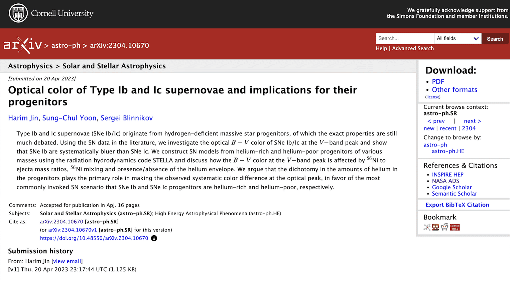

# Lección 2: Uso de datos abiertos

## Contenidos

- [Cómo Descubrir Resultados Abiertos](#cómo-descubrir-resultados-abiertos)
- [Cómo Evaluar Resultados Abiertos](#cómo-evaluar-resultados-abiertos)
- [Cómo Utilizar Resultados Abiertos](#cómo-utilizar-resultados-abiertos)
- [Cómo Citar Resultados Abiertos](#cómo-citar-resultados-abiertos)
- [Lección 2: Resumen](#lección-2-resumen)
- [Lección 2: Evaluación](#lección-2-evaluación)

## Visión general

Al final de esta lección, estará familiarizado con los recursos para la utilización de resultados abiertos, cómo y cuándo citar las fuentes de los resultados abiertos que utilice, cómo proporcionar retroalimentación a los proveedores de resultados abiertos y cómo determinar cuándo es apropiado invitar a los autores de los materiales de resultados abiertos a ser colaboradores formales en lugar de simplemente citar esos recursos en su trabajo.

Los artículos publicados, las entradas de blog y los foros pueden aportarle nuevas ideas para su propia investigación. Una técnica aprendida de las redes sociales puede aplicarse a un caso de uso que está tratando de resolver. Hay muchas formas diferentes de descubrir resultados.

## Objetivos de Aprendizaje del Módulo

Después de completar este módulo, deberías ser capaz de:

- Identificar una variedad de fuentes de resultados abiertos, incluyendo investigaciones científicas publicadas y fuentes no tradicionales.
- Evaluar la fiabilidad y la calidad de las fuentes de resultados abiertos basándose en características clave.
- Enumerar las responsabilidades de personas que usan resultados abiertos, incluido el envío de comentarios a los desarrolladores de resultados abiertos.
- Listar las formas de citar resultados abiertos en su propio proceso de investigación.

## Cómo descubrir resultados abiertos

¿Cómo puedo conocer el estado de la investigación en un campo concreto? ¿Cómo participar en la conversación actual? Los investigadores a menudo comienzan con una búsqueda de artículos revisados por pares. Esta revisión le indica cuánta investigación se ha realizado en un campo y qué conclusiones se han alcanzado recientemente. En la mayoría de los campos, el proceso de revisión por pares puede tardar hasta un año. La posibilidad de encontrar preprints puede ayudar a reducir este retraso, ya que ofrecen los últimos hallazgos antes de una fecha de publicación. Sin embargo, los investigadores que deciden compartir sus resultados antes de la publicación suelen hacerlo de las formas indicadas anteriormente como mejores prácticas. Al empezar a investigar sobre un tema, ¿cómo encontrar todos estos tipos diferentes de resultados y dedicarse a la investigación más pertinente?

### Ejemplo: Exoplanetas

Las distintas etapas de la investigación, desde la conceptualización hasta la difusión de los resultados, generan productos que pueden ponerse en el dominio público como «resultados abiertos». Dónde se archivan estos resultados, y en qué grado, depende del autor de la disciplina.  No obstante, algunas directrices generales sobre dónde empezar una búsqueda de resultados abiertos incluyen:

1. Portales de búsqueda académica
2. Búsquedas en Internet

**Portales de búsqueda académica**

Los motores de búsqueda como Google y Bing han cambiado radicalmente la forma en que buscamos información. Para los resultados de la investigación, los buscadores y portales académicos especializados recopilan los resultados científicos de los investigadores por temas y campos. Estos motores son útiles para encontrar artículos revisados por pares.

<table>
  <thead>
    <tr>
        <th>GENÉRICO ☑</th>
        <th>DISCIPLINA ESPECÍFICA</th>
    </tr>
  </thead>
  <tbody>
    <tr>
        <td colspan="2">
            <ul>
                <li><a href="https://scholar.google.com/">Google Académico</a></li>
                <li><a href="https://ui.adsabs.harvard.edu/">ADS</a></li>
                <li><a href="https://www.scopus.com/">Scopus</a></li>
                <li>Red de conocimiento (Web of Knowledge)</li>
                <li><a href="https://openknowledgemaps.org/">Mapa abierto de conocimientos (Open knowledge map)</a> - facilita la exploración de temas interconectados</li>
                <li><a href="https://www.jstor.org/">JSTOR</a> - una amplia gama de contenido científico</li>
                <li><a href="https://www.researchgate.net/search">ResearchGate</a></li>
                <li><a href="https://sciencecast.org/">ScienceCast</a></li>
            </ul>
        </td>
    </tr>
  </tbody>
</table>

<table>
  <thead>
    <tr>
        <th>GENÉRICO</th>
        <th>DISCIPLINA ESPECÍFICA ☑</th>
    </tr>
  </thead>
  <tbody>
    <tr>
        <td colspan="2">
            <ul>
                <li><a href="https://europepmc.org/">EuropePMC ciencias de la vida (EuropePMC Life sciences)</a></li>
                <li><a href="https://pubmed.ncbi.nlm.nih.gov/">Literatura biomédica Pubmed (Pubmed biomedical literature) </a></li>
                <li><a href="https://arxiv.org/">arXiv</a> - para preprints académicos en los campos de STEM, economía e informática.</li> 
                <li><a href="https://www.biorxiv.org/">Biorxiv Preprint</a> - servidor para biología</li>
                <li><a href="https://eartharxiv.org/">EarthArXiv</a> y <a href="https://essoar.org/">Archivo Abierto de Ciencias de la Tierra y Espacio</a></li>
                <li><a href="https://asapbio.org/preprint-servers">ASAPbio</a> - catálogos de servidores de preprint</li>
                <li>y otros...</li>
            </ul>
        </td>
    </tr>
  </tbody>
</table>

Las publicaciones que proporcionan algunos niveles de acceso abierto se rastrean en el [Directorio de Revistas de Acceso Abierto (DOAJ).](https://doaj.org/)

**Búsquedas en Internet**

Los resultados abiertos incluyen mucho más que publicaciones revisadas por pares de acceso abierto. ¿Cómo se encuentran estos tipos alternativos de objetos de investigación?

Las comunidades abiertas y los foros ofrecen la mejor manera de encontrar objetos de investigación que no sean publicaciones completas. ¿Cómo averiguar si existen y dónde están?

Una vez que haya encontrado algunos artículos revisados por pares que son muy relevantes, para encontrar objetos de investigación adicionales, usted puede seguir a los autores de las redes sociales para enlaces a sus mensajes, blogs y actividades. Hay comunidades abiertas en casi todas las áreas de investigación - ¡encuentra la tuya! Aquí están diferentes plataformas para localizar estas conversaciones y recursos:

- GitHub
- LinkedIn
- YouTube
- Google/Bing
- Sitios web de las conferencias (Conference websites)
- X, conocido formalmente como Twitter
- Facebook
- Medium
- Substack
- Stack Overflow
- Reddit
- Mastodon

Los diversos objetos de investigación, incluidos los conjuntos de datos y el software, se adjuntan con frecuencia a publicaciones científicas en forma de material suplementario. En otras ocasiones, se hace referencia a la fuente en el documento, que podría ser un repositorio de GitHub, un sitio web personal/institucional u otro sitio de almacenamiento. Este puede ser otro punto de partida, entablando discusiones en el repositorio de GitHub.

**Ejemplo de Kerchunk:** En la lección 1, se presentó una entrada de blog sobre una biblioteca de software «kerchunk». Veamos un [post](https://discourse.pangeo.io/t/trick-for-improving-kerchunk-performance-for-large-numbers-of-chunks-files/3090) en el [Pangeo Discourse Forum](https://discourse.pangeo.io/) de Kerchunk con un gran número de visitas. La ciencia abierta [proyecto Pangeo](https://pangeo.io/) funcionaba completamente abierta. El [sitio web del proyecto](https://pangeo.io/) (gestionado desde GitHub) tiene enlaces a entradas de blog, un foro de debate y un calendario de todas sus reuniones, a las que cualquiera puede unirse. Esto ha dado lugar a una comunidad comprometida y dinámica. Un ejemplo de ello es el post enlazado más arriba, en el que una persona pide ayuda, otras responden y la conversación se documenta abiertamente. Las 636 visitas del post indican que esta pregunta, o una parecida, se les ha ocurrido a otras personas. Imagínese si esto se hubiera hecho por correo electrónico privado? Al trabajar de forma abierta, están mejorando la ciencia y ayudando a todos a ser más rápidos y precisos.

## Cómo evaluar resultados abiertos

«Basura dentro, basura fuera»: sus propios productos de investigación sólo son tan buenos como los datos utilizados en su investigación.

Si utiliza datos de mala calidad o materiales procedentes de fuentes poco fiables y no verificadas como componentes fundamentales de su investigación, corre el riesgo de producir ciencia defectuosa o de baja calidad que puede dañar su reputación como científico. Por lo tanto, es fundamental evaluar la calidad y fiabilidad de las fuentes de resultados abiertos antes de incluirlas en su propio trabajo.

¿Cuáles son las mejores prácticas para evaluar la calidad de fuentes de datos alternativas a los artículos de investigación, como entradas de blog, vídeos de youtube y otros objetos de investigación?

### Atributos de un material reputado

Echemos un vistazo a las preguntas que deberías plantearte a la hora de determinar la fiabilidad de cualquier tipo de fuente de resultados abierta.

Here, we list questions under two categories: the open results material themselves, and the server they are downloaded from. Cuantas más preguntas puedan responderse afirmativamente, menor será el riesgo de utilizar los materiales de resultados abiertos para su propia investigación.

<table>
  <thead>
    <tr>
        <th>EL PROPIO MATERIAL ☑</th>
        <th>EL WEBSITE / SERVIDOR ASOCIADO</th>
        <th>INDICADORES DE FIABILIDAD DE LAS FUENTES</th>
    </tr>
  </thead>
  <tbody>
    <tr>
        <td colspan="3">
            <ul>
                <li>¿El material está asociado con una publicación revisada por pares?</li>
                <li>¿Los datos primarios asociados a los resultados también son de código abierto?</li>
                <li>¿El código utilizado para generar los materiales de Open Results también es de código abierto?</li>
                <li>¿Están definidos claramente todos los campos y parámetros?</li>
                <li>¿Está claramente descrita la estimación de las incertidumbres de medición?</li>
                <li>¿Se excluyó algún dato o resultado? En caso afirmativo, ¿se facilitaron los criterios de exclusión?</li>
                <li>¿Los equipos de autores son también miembros del campo?</li>
            </ul>
        </td>
    </tr>
  </tbody>
</table>

<table>
  <thead>
    <tr>
        <th>EL PROPIO MATERIAL </th>
        <th>EL WEBSITE / SERVIDOR ASOCIADO</th>
        <th>INDICADORES DE FIABILIDAD DE LAS FUENTES</th>
    </tr>
  </thead>
  <tbody>
    <tr>
        <td colspan="3">
            <ul>
                <li>¿La URL del sitio web anfitrión termina en .edu, .gov o (si lo gestiona una organización sin ánimo de lucro) en .org?</li>
                <li>¿Proporciona el sitio web anfitrión información de contacto del autor y/o la organización?</li>
                <li>¿Se actualiza con frecuencia el sitio web del anfitrión?</li>
                <li>¿Está el sitio web anfitrión libre de publicidad y/o contenidos patrocinados, cuya presencia podría indicar parcialidad?</li>
            </ul>
        </td>
    </tr>
  </tbody>
</table>

<table>
  <thead>
    <tr>
        <th>EL PROPIO MATERIAL </th>
        <th>EL WEBSITE / SERVIDOR ASOCIADO</th>
        <th>INDICADORES DE FIABILIDAD DE LAS FUENTES</th>
    </tr>
  </thead>
  <tbody>
    <tr>
        <td colspan="3">
            <ul>
                <li>¿El resultado es reproducible? ¿Puedes interactuar con los datos y los resultados? ¿Han informado otras personas de que pueden reproducir los resultados?</li>
                <li>¿Es el autor fiable? ¿Ha visto que publiquen o compartan resultados en otros foros?</li>
                <li>¿Es el resultado de un solo autor/voz o incluye contribuciones de una comunidad más amplia?</li>
                <li>¿Tiene el post una cantidad significativa de me gusta/opiniones y comentarios públicos? El valor de una entrada de blog sin comentarios ni respuestas puede ser difícil de evaluar. Por el contrario, un foro de discusión de github exhaustivo con múltiples opiniones compartidas indica una publicación sólida.</li>
                <li>¿Es el resultado parte de una conversación activa? (¿Es la información todavía relevante y actual?)</li>
            </ul>
        </td>
    </tr>
  </tbody>
</table>

Adaptado de [https://www.scribbr.com/working-with-sources/credible-sources/](https://www.scribbr.com/working-with-sources/credible-sources/)

Tenga en cuenta que el hecho de no cumplir uno o varios de los criterios no significa automáticamente que los resultados abiertos sean de mala calidad, sino más bien que se debe tener más precaución si se incorporan a su propia investigación. También significa que tendrá que invertir más en el examen personal del material para asegurarse de que su calidad es suficiente para sus fines.

Ejemplo fiable: Los vídeos de YouTube de Qiusheng Wu (mencionados en la lección anterior). El Profesor Wu es un experto en su campo. Presenta los resultados junto con cuadernos que demuestran la reproducibilidad. Los comentarios en sus vídeos tutoriales de YouTube representan interacciones significativas entre los usuarios que reproducen los resultados y el autor.

## Cómo utilizar resultados abiertos

Aunque los resultados abiertos benefician a la ciencia y ya han aportado valiosos beneficios a la sociedad, el uso indebido y el intercambio incauto de materiales abiertos pueden tener efectos perjudiciales de gran alcance. El usuario final de los resultados abiertos tiene la responsabilidad de garantizar que los datos a los que hace referencia se utilizan de forma responsable y que se siguen las directrices pertinentes para el uso de los datos.

### Cómo contribuir y proporcionar comentarios constructivos

Contribuir y aportar comentarios constructivos son componentes vitales para un ecosistema de acceso abierto saludable, que garantice la sostenibilidad a largo plazo de los recursos abiertos al proporcionar mejoras continuas y ampliaciones de capacidad.

En nuestro sistema actual, hay personas creadoras y consumidoras de resultados. Este escenario presenta una vía de sentido único sin bucles de respuestas o de devolución, sin comunicación de datos a quienes editan y sin intercambio entre personas intermediarias.

La práctica de producir resultados abiertos pretende fomentar un sistema en el que existan circuitos de comunicación entre quienes usan y crean. Las personas usuarias comparten su trabajo depurado, integrado o mejorado con quien lo creó. Esta comunicación crea un proceso simbiótico y sostenible del que todos y todas se benefician.

### Tus responsabilidades como persona usuaria de resultados abiertos

- Las personas usuarias deben familiarizarse con las pautas para colaborar publicadas en los repositorios de resultados abiertos, y seguir las políticas asociadas. ¿Y si no hay pautas para colaborar? ¡Contacta a las personas creadoras!
- Proporciona siempre comentarios de forma respetuosa y comprensiva.
- Si descubres un error en los materiales de Resultados Abiertos, la acción ética a tomar es contactar al autor o autora (o al repositorio, dependiendo de la naturaleza del problema) y darles la oportunidad de corregir el problema, en lugar de ignorar el problema o (¡peor aún!) aprovechar un problema reparable para elevar tu propia investigación.

### Diferentes Maneras de Comentar

#### Usar Problemas de GitHub

<table>
<colgroup>
    <col style="width: 50%" />
    <col style="width: 50%" />
</colgroup>
<tbody>
    <tr>
        <td>
            
        </td>
        <td>Ventaja: La interacción es abierta y otras personas de la comunidad pueden ver los problemas en curso que se están abordando.</td>
    </tr>
    <tr>
        <td>
            
        </td>
        <td>La contribución se archiva y registra en GitHub.</td>
    </tr>
</tbody>
</table>

**Trabajar con Problemas de GitHub**

Consulta este blog para conocer la etiqueta general de problemas

[ABRIR](https://www.w3.org/International/i18n-activity/guidelines/issues.html)

#### Enviar un correo electrónico al autor o autora

<table>
<colgroup>
    <col style="width: 50%" />
    <col style="width: 50%" />
</colgroup>
<tbody>
    <tr>
        <td>
            
        </td>
        <td>Contras: la comunicación es privada. La información generalmente no se comparte con la comunidad a menos que quien la creó desarrolle una nueva versión.</td>
    </tr>
    <tr>
        <td>
            
        </td>
        <td>Contras: no hay forma de hacer un seguimiento de los créditos.</td>
    </tr>
</tbody>
</table>

### Obtener crédito por las aportaciones

Si tus aportes resultan en una contribución intelectual sustancial al trabajo, es razonable esperar la oportunidad de coautoría en una futura versión del resultado abierto. Las pautas de contribución asociadas deberían contemplar esta posibilidad y gestionar las expectativas antes de que se realicen aportaciones.

Lamentablemente, muchas veces no existen pautas de contribución y no está claro qué es "sustancial".

### Responsabilidades de quienes utilizan Resultados Abiertos

- **Cumplimiento de la Seguridad Institucional:** Descarga siempre el código de una fuente autorizada y conoce/sigue las políticas de seguridad informática de tu institución.
- **Políticas de Licencia:** Comprende y respeta la(s) licencia(s) asociada(s) con los materiales de resultados abiertos que estás utilizando.
- **Atribución y contribución:** Proporciona una atribución adecuada para los resultados abiertos utilizados y contribuye a la comunidad de resultados abiertos.

Además, da crédito a los repositorios que proporcionan materiales de código abierto en la sección de agradecimientos de tu artículo. Si el repositorio proporciona un modelo de agradecimientos en su enlace "Acerca de", sigue esa sugerencia. De lo contrario, una frase genérica como "Este trabajo ha hecho uso de <inserte el nombre del repositorio>." será suficiente.

### Evitar el Plagio al Utilizar Resultados Abiertos

Las pautas habituales que ha estado utilizando en su investigación todo el tiempo para proporcionar la atribución y las citas apropiadas de las publicaciones de acceso cerrado también se aplican a los trabajos publicados en acceso abierto.

Algunos ejemplos de plagio son:

- Copiar palabra por palabra sin permiso y sin reconocimiento de la fuente.
- Copiar componentes (tablas, procesos, equipos) sin citar la fuente.
- Parafrasear una idea sin citar correctamente la fuente.
- Reciclar el propio trabajo anterior y presentarlo como un nuevo documento.

#### HOJA INFORMATIVA: Plagio

**Aquí hay una guía útil sobre las diferentes formas de plagio**

[HAZ CLIC PARA APRENDER MÁS](https://www.elsevier.com/editor/perk/plagiarism-complaints#0-introduction) (en inglés)

## Cómo citar resultados abiertos

Brindar una atribución adecuada a los resultados abiertos es una responsabilidad importante y ética al utilizar materiales de código abierto. El proceso de citación depende de la naturaleza del material.

### Pautas de citación para resultados publicados y no publicados

Si un artículo se ha publicado formalmente en una revista, la cita debe remitir a la versión publicada en lugar de un servidor de borradores o artículos aún no publicados.

Tómate el tiempo necesario para localizar la revista de origen y proporcionar una cita más precisa.

Servidor de borradores o de manuscritos aún no publicados (Citar solo si no está disponible la publicación en una revista)

---

Fuente de la publicación (Citar siempre)

---

Si un artículo que desea citar aún no ha sido aceptado para su publicación, debe seguir las pautas de la revista al cual está enviando tu artículo. Una cita de referencia de un manuscrito que aún no está publicado o de un borrador típicamente incluye el nombre de la o las persona(s) autora(s), la fecha de la versión más reciente publicada, el título del artículo, el nombre del servidor en donde se encuentra el borrador del artículo, el tipo de objeto ("manuscrito no publicado") y el DOI.

Al momento de la preparación de la presente sección, el siguiente artículo aún no había sido publicado en una revista.

Jin, H., et al. 2023, "El color óptico de las supernovas de tipo Ib y Ic y sus implicaciones para sus progenitores," ApJ, manuscrito no publicado, arXiv:2304.10670.

---

<table>
  <thead>
    <tr>
        <th>PARA UN MATERIAL CON UN DOI ☑</th>
        <th>PARA UN MATERIAL QUE NO TIENE UN DOI</th>
        <th>PARA OTROS MATERIALES O INTERACCIONES QUE FUERON ÚTILES PARA LA INVESTIGACIÓN</th>
    </tr>
  </thead>
  <tbody>
    <tr>
        <td colspan="3">
            
Para citar todo lo que sigue, sigue las pautas existentes y las mejores prácticas habituales de la comunidad:

            <ul>
                <li>Cita publicaciones</li>
                <li>Cita datos</li>
                <li>Cita software</li>
                <li>Cita cualquier otro objeto con un DOI. Teniendo en cuenta que muchas revistas sólo permiten a las personas autoras citar material que tenga un DOI, ¿qué hacer con otros tipos de resultados abiertos?</li>
            </ul>
        </td>
    </tr>
  </tbody>
</table>

<table>
  <thead>
    <tr>
        <th>PARA UN MATERIAL CON UN DOI</th>
        <th>PARA UN MATERIAL QUE NO TIENE UN DOI ☑</th>
        <th>PARA OTROS MATERIALES O INTERACCIONES QUE FUERON ÚTILES PARA LA INVESTIGACIÓN</th>
    </tr>
  </thead>
  <tbody>
    <tr>
        <td colspan="3">
            
Algunos ejemplos son publicaciones en blogs, vídeos y cuadernos.

            <ul>
                <li>También podrías ponerte en contacto con lo creó y pedirle que obtenga un DOI.</li>
                <li>Deja un comentario en la sección de comentarios o en el foro comunicando la persona autora tu publicación.</li>
            </ul>
        </td>
    </tr>
  </tbody>
</table>

<table>
  <thead>
    <tr>
        <th>PARA UN MATERIAL CON UN DOI</th>
        <th>PARA UN MATERIAL QUE NO TIENE UN DOI</th>
        <th>PARA OTROS MATERIALES O INTERACCIONES QUE FUERON ÚTILES PARA LA INVESTIGACIÓN ☑</th>
    </tr>
  </thead>
  <tbody>
    <tr>
        <td colspan="3">
            <ul>
                <li>Reconoce a las comunidades y a los foros que te han ayudado a avanzar en tu investigación en la sección de agradecimientos. Esto no sólo les da un reconocimiento, sino que ayuda a otras personas a encontrar a estas comunidades.</li>
                <li>Citar los resultados de investigaciones abiertas hace que avance la ciencia al dar el reconocimiento adecuado a todas las partes del proceso de investigación. Esto es algo fundamental para lograr un cambio cultural en favor de la ciencia abierta; hay que reconocer el mérito de todo tipo de contribuciones y esperar reciprocidad. La ciencia colaborativa permite que más personas, de más lugares, con voces y experiencias diferentes participen en ciencia.</li>
                <li>Contribuir y colaborar de este modo disminuye las barreras (como el costo de un congreso) para participar en ciencia y amplía el número de personas que pueden involucrarse.</li>
            </ul>
        </td>
    </tr>
  </tbody>
</table>

### Ejemplos de Agradecimiento

En el ejemplo del blog de la Lección 1 [example](https://medium.com/pangeo/fake-it-until-you-make-it-reading-goes-netcdf4-data-on-aws-s3-as-zarr-for-rapid-data-access-61e33f8fe685), quienes investigan agradecieron a las personas con las que trabajaron en un artículo que escribieron y que les resultó de ayuda, y a dos comunidades diferentes, así como al entorno computacional en el que trabajaron. Este es un buen ejemplo de cómo agradecer: "Me gustaría agradecer a Rich Signell (USGS) y Martin Durant (Anaconda) por su ayuda en el estudio de este proceso. Si te interesa ver con más detalle cómo funciona, te recomiendo el artículo de Rich del 2020 sobre el tema. También me gustaría reconocer [Pangeo](https://pangeo.io/) y [Pangeo-forge](https://pangeo-forge.org/) quienes trabajan con mucho esfuerzo para facilitar el trabajo con grandes conjuntos de datos en geociencia. El trabajo en este proyecto se realizó en la implementación de AWS de Pangeo

En la Lección 1, se presentó el caso de JWST. El [artículo]revisado por pares (https://www.nature.com/articles/s41586-022-05269-w#Ack1) que informaba del primer descubrimiento de CO2 en otro planeta ha sido consultada más de 18.000 veces. Cabe señalar que la autoría se atribuye a todo el equipo. La sección de Agradecimientos detalla debidamente las contribuciones de quienes colaboraron, "Los resultados informados aquí se beneficiaron durante la fase de diseño de colaboraciones e intercambios dentro de la red de coordinación de investigación Nexus for Exoplanet System Science (NExSS) de la NASA, patrocinada por la Dirección de Misiones Científicas de la NASA". Todos los datos y modelos presentados en esta publicación pueden consultarse en [https://doi.org/10.5281/zenodo.6959427](https://doi.org/10.5281/zenodo.6959427). Y por último, ¡citan todo el software! "Los códigos utilizados en esta publicación para extraer, reducir y analizar los datos son los siguientes.."

## Lección 2: Resumen

En esta lección, has aprendido:

- Los resultados abiertos se pueden encontrar tanto utilizando Portales Académicos de Búsqueda como mediante búsquedas en internet.
- La confiabilidad de una publicación generalmente puede evaluarse por la confiabilidad del sitio web del que proviene, la participación de la comunidad y el rigor científico de su contenido.
- Quienes utilizan resultados abiertos, en tanto son las personas que inherentemente administran la comunidad de código abierto, tienen informalmente la responsabilidad de contribuir a la sostenibilidad de la comunidad. Esta participación incluye la comunicación de opiniones a quienes proporcionan y desarrollan resultados abiertos.
- Dar una adecuada referencia a los resultados abiertos es una responsabilidad importante y ética a la hora de utilizar materiales de código abierto. La forma de citar los resultados depende de la especificidad del material.

## Lección 2: Evaluación

Responde las siguientes preguntas para poner a prueba lo que has aprendido hasta ahora.

_Pregunta_

**01/02**

¿Cuál de las siguientes opciones podría ser una fuente de resultados abiertos? Selecciona todos los que correspondan.

- Búsquedas en Internet
- Artículos a los que se accedió a través de una suscripción pagada
- Materiales hechos públicos después de un período exclusivo de 1 año de uso/suscripción pagado
- Repositorios
- Publicaciones de acceso abierto

_Pregunta_

**02/02**

¿Cuál de las siguientes características hace suponer que un determinado artículo o conjunto de datos tiene más probabilidades de ser un resultado abierto creíble? Seleccione todas las opciones que correspondan.

- El sitio de internet menciona su fuente de financiación
- Los resultados se describen en un artículo revisado por pares
- El artículo se acompaña de datos, incluyendo campos definidos y parámetros
- Se proporciona la información de contacto de la organización
- La página de internet fue actualizada por última vez en 2015
- La página de internet anuncia posiciones de trabajo abiertas con quien financia
- La persona autora es experta en el campo
- La URL de la página de internet termina en '.com'
- La documentación acompañante afirma que "al inspeccionar las distribuciones de los datos, se excluyeron del análisis los datos que eran valores atípicos"
