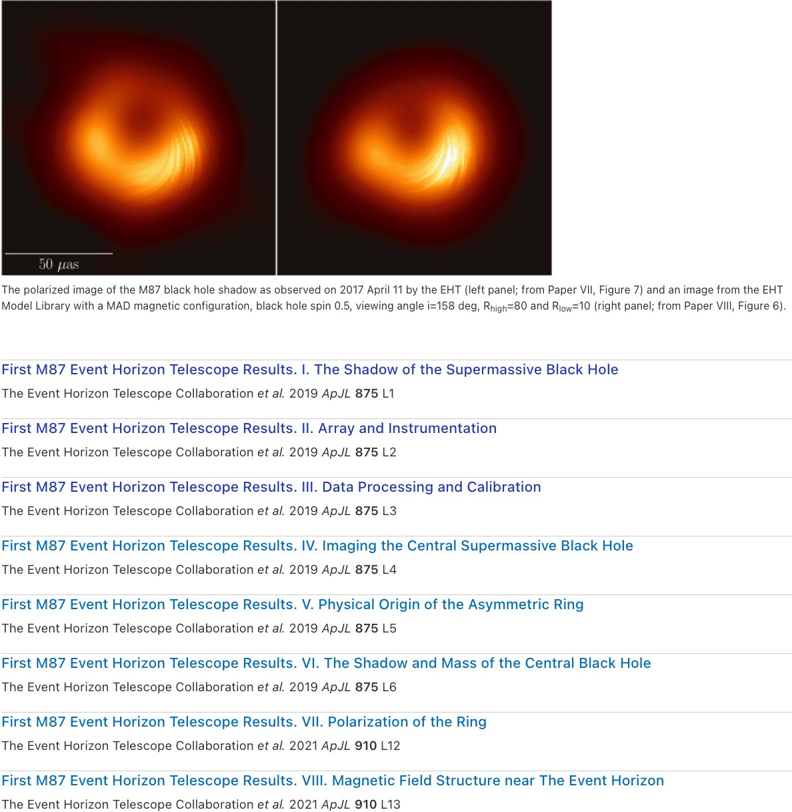

# Lección 3: Haciendo Los Resultados Abiertos

## Contenidos

- [Cómo hacer los resultados abiertos](#how-to-make-open-results)
- [Rol de contribuidores en ciencia abierta](#role-of-contributors-in-open-science)
- [Cómo dar reconocimiento abierto](#how-to-give-open-recognition)
- [Combinar Resultados Abiertos para Informes Científicos y Publicaciones](#combining-open-results-for-scientific-reporting-and-publications)
- [Lección 3: Resumen](#lesson-3-summary)
- [Lección 3: Validar conocimientos](#lesson-3-knowledge-check)

## Resumen

En la lección 2 aprendió a usar los resultados de otros. En esta lección, nos centraremos en lograr resultados abiertos. Empezaremos por debatir qué significa conseguir resultados reproducibles. Habiendo comentado anteriormente en el curso las prácticas de reproducibilidad computacional en software abierto, en esta lección, enfatizamos específicamente la importancia de las colaboraciones para que estos resultados sean abiertos y reproducibles. Empezando por reconocer que los resultados científicos no son obtenidos por individuos. Entonces enseñaremos cómo asegurar colaboraciones equitativas, justas y exitosas al hacer sus resultados abiertos que reconozcan todas las contribuciones. Una vez que has planeado las reglas de compromiso, le proporcionaremos formas de asegurar que su reporte y publicación cumplan con los principios de resultados abiertos y combatan la crisis de reproducibilidad.

## Objetivos de aprendizaje

Después de completar este módulo, deberías poder:

- Identificar enfoques para hacer diferentes tipos de resultados abiertos.
- Reconocer la importancia de la colaboración en la obtención de resultados.
- Desarrollar directrices de contribución para permitir el reconocimiento de los contribuyentes que obtienen resultados.
- Combinar diferentes resultados abiertos para crear informes científicos y resultados reproducibles.

## Cómo hacer los resultados abiertos

### Capturando el proceso de investigación con precisión en la elaboración de resultados

> Explicaremos qué es la crisis de reproducibilidad y cómo la ciencia abierta puede ayudarte a combatirla. ¿Qué formas prácticas puedo aplicar a mis resultados de investigación para obtener resultados abiertos? ¿Cómo puedo asegurarme de que los resultados que comparto puedan ser reproducidos por otros? ¿Cómo puedo publicar publicaciones científicas que no añaden, sino que combatan la crisis de reproducibilidad?

En la Ethos of Open Science, usted aprendió sobre la ética y los principios subyacentes a prácticas científicas abiertas responsables. En Open Software, usted exploró e identificó las herramientas y métodos correctos que aseguran la usabilidad y reproducibilidad de su análisis. En Open Data, ha desarrollado un plan de gestión de datos que puede garantizar la accesibilidad, accesibilidad, Interoperabilidad y reutilización (FAIR) de sus datos a lo largo del proceso de investigación, y no sólo al final cuando se publica el informe final del proyecto. Estos enfoques científicos abiertos abordan directamente las causas profundas de la crisis de reproducibilidad, que son la falta de apertura durante todo el proceso científico. falta de documentación, descripción deficiente de métodos intermedios o datos faltantes que se utilizaron en etapas intermedias del proceso de investigación. En esta lección, aprenderá a juntar todos estos elementos para asegurar que esté preparado para hacer que sus resultados abiertos sean fáciles de reproducir por otros.

En la Lección 1, identificamos diferentes componentes de investigación que pueden considerarse resultados abiertos en varias etapas de la investigación. En esta lección, queremos explicar específicamente qué procesos están involucrados en su elaboración.

### Estudio de Caso: Resultados Abiertos de Colaboración del Telescopio de Eventos Distribuidos por Multi-Equipo (EHTC)

**Ejemplo:** Capturando resultados de actividades que van desde la colaboración hasta las observaciones, generación de imágenes hasta interpretación.

En 2017, el telescopio Horizon de Eventos apuntó a agujeros negros supermasivos con los horizontes de eventos aparentes más grandes: M87, y Sgr A\* en el Centro Galáctico en cuatro días separados. Esta colaboración distribuida condujo al rendimiento multipetabyte de los datos que permitieron a los astronómeros revelar la primera imagen de un agujero negro proporcionando la más fuerte evidencia visual de su existencia. El [sitio web de EHTC](https://eventhorizontelescope.org/) proporciona información sobre proyectos de investigación, métodos científicos, instrumentos, medios de prensa y medios (como publicaciones del blog, artículos de noticias y vídeos de YouTube), así como eventos, datos, propuestas y publicaciones. Este proyecto muestra un trabajo a gran escala y de alto impacto que aplica prácticas abiertas para lograr sus resultados. Diferentes tipos de resultados compartidos bajo este proyecto pueden ser mapeados a diferentes etapas del proceso de investigación y a los equipos involucrados en su creación.

### Obteniendo resultados y acreditando a los contribuyentes de manera justa en diferentes etapas de la investigación

Los estudios de caso mencionados anteriormente destacan que los resultados asociados con un proyecto son más que una publicación. Entendiendo cómo se crean los resultados abiertos en diferentes proyectos, podemos obtener información profunda sobre los procesos para realizarlos. Con ese objetivo, el resto de esta lección describe el proceso de hacer resultados en tres partes: 1) hacer todo tipo de resultados de investigación; 2) reconocer a todos los colaboradores; y 3) combinar los resultados para la elaboración de informes científicos y publicaciones.

### Haciendo todos los tipos de resultados de investigación

Las nuevas formas de trabajar con enfoques creativos para la colaboración y la comunicación en investigación han abierto oportunidades para comprometerse con las comunidades de investigación más amplias compartiendo los resultados científicos a medida que se desarrollan, en vez de al final a través de artículos resumidos. Se crean una serie de componentes de investigación a lo largo del ciclo de vida de la investigación que pueden compartirse abiertamente. Por ejemplo, los recursos creados en un proyecto científico incluyen, pero no se limitan a lo siguiente:

<table>
  <thead>
    <tr>
        <th>IDEACIÓN Y PLANIFICACIÓN ☑</th>
        <th>COLECCIÓN Y EXPLORACIÓN DE DATOS</th>
        <th>PARTICIPACIÓN COMUNITARIA Y REPRODUCIBILIDAD</th>
        <th>PRESERVACIÓN Y PUBLICACIÓN</th>
    </tr>
  </thead>
  <tbody>
    <tr>
        <td colspan="4">
            
Ideación y planificación – tal vez antes de que el proyecto de investigación sea financiado o iniciado:

            <ul>
                <li>Propuestas de investigación</li>
                <li>Personas y organizaciones involucradas</li>
                <li>Directrices de ética de investigación</li>
                <li>Plan de gestión de datos</li>
            </ul>
        </td>
    </tr>
  </tbody>
</table>

<table>
  <thead>
    <tr>
        <th>IDEACIÓN Y PLANIFICACIÓN</th>
        <th>RECOPILACIÓN Y EXPLORACIÓN DE DATOS ☑</th>
        <th>PARTICIPACIÓN COMUNITARIA Y REPRODUCIBILIDAD</th>
        <th>PRESERVACIÓN Y PUBLICACIÓN</th>
    </tr>
  </thead>
  <tbody>
    <tr>
        <td colspan="4">
            
Recopilación y exploración de datos - artefactos de investigación creados durante el proceso de investigación activo:

            <ul>
                <li>Repositorio del proyecto</li>
                <li>Hoja de ruta e hitos del proyecto</li>
                <li>Requisitos de recursos</li>
                <li>Recursos de gestión del proyecto (sin información sensible)</li>
                <li>Procesos de colaboración como Código de Conducta y pautas de colaboradores</li>
                <li>Entorno de investigación virtual</li>
                <li>Información de datos y metadatos</li>
            </ul>
        </td>
    </tr>
  </tbody>
</table>

<table>
  <thead>
    <tr>
        <th>IDEACIÓN Y PLANIFICACIÓN</th>
        <th>COLECCIÓN Y EXPLORACIÓN DE DATOS</th>
        <th>PARTICIPACIÓN COMUNITARIA Y REPRODUCIBILIDAD ☑</th>
        <th>PRESERVACIÓN Y PUBLICACIÓN</th>
    </tr>
  </thead>
  <tbody>
    <tr>
        <td colspan="4">
            
Compromiso de la comunidad y reproducibilidad – más valioso durante el período del proyecto:

            <ul>
                <li>Materiales de formación y educación</li>
                <li>Cuadernos computacionales</li>
                <li>Flujo de trabajo computacional</li>
                <li>Repositorio de código (versión controlada)</li>
                <li>Publicaciones en Blogs</li>
                <li>Vídeos de corta duración y podcasts</li>
                <li>Publicaciones en redes sociales</li>
                <li>Discusiones del foro (por ejemplo cuando se solicita comentarios o solución de problemas)</li>
            </ul>
        </td>
    </tr>
  </tbody>
</table>

<table>
  <thead>
    <tr>
        <th>IDEACIÓN Y PLANIFICACIÓN</th>
        <th>COLECCIÓN Y EXPLORACIÓN DE DATOS</th>
        <th>PARTICIPACIÓN COMUNITARIA Y REPRODUCIBILIDAD</th>
        <th>PRESERVACIÓN Y PUBLICACIÓN ☑</th>
    </tr>
  </thead>
  <tbody>
    <tr>
        <td colspan="4">
            
Preservación y publicación: se espera que persista a largo plazo:

            <ul>
                <li>Directrices de publicación y autor</li>
                <li>Libre acceso a artículos revisados para publicaciones</li>
                <li>Abstractos y presentaciones de la conferencia</li>
                <li>Fin del informe del proyecto</li>
                <li>Manual de usuario o documentación</li>
                <li>Eventos y actividades públicas</li>
            </ul>
        </td>
    </tr>
  </tbody>
</table>

Crédito de la imagen: Ilustración del proyecto Turing Way de Scriberia. Zenodo.

---

Ya se ha encontrado con algunos de estos en las lecciones anteriores y, con suerte, ya podrá identificar cuáles de estos u otros resultados está generando en su trabajo. Para hacerlos parte de sus resultados abiertos, es importante que sean compartidos abiertamente con la licencia y la documentación apropiadas para que otros puedan leer, investigar y cuando sea posible, reutilizar o construir sobre ellos.

### Haciendo resultados abiertos y reproducibles

La ciencia abierta, en última instancia, informa de nuestras decisiones como personas dedicadas a la ciencia y guía la selección de enfoques que contribuyen a que nuestros resultados se abran en diferentes etapas. Uno de los objetivos principales de los resultados abiertos es asegurar la reproducibilidad de la investigación, a menudo explicada a través de definiciones como las siguientes por [Stodden (2015)](https://www.annualreviews.org/doi/10.1146/annurev-estadísticas-010814-020127):

"La reproducibilidad es la capacidad que posee una persona que realiza una investigación para obtener los mismos resultados de un trabajo publicado utilizando los datos sin procesar y el código empleados en el estudio original."

**Stodden (2015)**

---

Utilizando esta definición, los resultados que pueden ser reproducidos computacionalmente por otras personas se denominarían Resultados Reproducibles. Los casos prácticos del EHTC presentan resultados abiertos como colecciones de objetos de investigación creados en distintas fases del proceso de investigación. Los casos prácticos del Ehtc presentan resultados abiertos como colecciones de objetos de investigación creados en distintas fases del proceso de investigación.

Lo ideal es que cualquier persona, en cualquier lugar, pueda leer una publicación y comprender los resultados, identificar fácilmente los métodos aplicados, así como seguir adecuadamente los procedimientos para lograr los mismos resultados que los compartidos en esese estudio. Sin embargo, como ya se sabe, el problema de la reproducibilidad es frecuente en todos los campos científicos (véase este [informe] de Nature (https://www.nature.com/articles/533452a)). Una persona que hace un trabajo científico y es bienintencionada puede compartir todos los objetos de investigación y describir todos los pasos aplicados en su investigación, pero si no facilita el entorno de investigación u otra configuración técnica que haya utilizado para analizar sus datos, puede impedir que otras personas reproduzcan sus resultados. Este problema está aún más agravado por [errores y prejuicios humanos](https://www.ncbi.nlm.nih.gov/pmc/articles/PMC4776714/). Por ejemplo, las personas no siempre son capaces de identificar cómo sus intereses y experiencias influyen en las decisiones que toman y en las conclusiones de sus investigaciones. Esto hace que la necesidad de combatir la crisis de reproducibilidad sea aún mayor.

Los enfoques para hacer resultados abiertos deben integrar herramientas y métodos reproducibles, como el control de versiones, la integración continua, la revisión de código, la prueba de código y la documentación. Además, para ampliar la reproducibilidad más allá de los aspectos computacionales de la investigación, los informes y la documentación de los distintos tipos de resultados y decisiones también deben facilitarse de forma transparente.

### Cómo crear diferentes tipos de resultados abiertos

Compartir diferentes tipos de resultados lo antes posible no sólo ayuda a encontrar soluciones más rápidamente, sino que también contribuye a que la ciencia sea más reproducible, ya que esa apertura ayuda a entender cómo comunicar las metodologías y los hallazgos con mayor claridad a las demás personas. Aquí les proponemos algunos lugares fáciles para empezar a crear sus resultados de forma abierta.

<table>
  <thead>
    <tr>
        <th>Escribiendo un POST DE FORO ☑</th>
        <th>ESCRIBIENDO UNA BUENA ENTRADA DE BLOG</th>
        <th>HACIENDO UN BUEN VIDEO</th>
        <th>ESCRIBIENDO UN POSTEO EN UNA RED SOCIAL</th>
    </tr>
  </thead>
  <tbody>
    <tr>
        <td colspan="4">
            
A menudo, al comenzar la investigación, los foros públicos son un gran lugar para comenzar a entender y colaborar con las comunidades. La mayoría de los foros de discusión tienen un código de conducta y directrices sobre las mejores prácticas para la participación. Algunas pautas comunes que pueden ser útiles son las directrices de <a href="https://stackoverflow.com/help/discussions-guidelines">StackOverflow</a>, y <a href="https://github.com/pydata/xarray/discussions/5404">Xarray</a>, pero la mayoría de los foros tienen alguna guía específica. En los foros, se incrementa la confianza interactuando con la comunidad, por lo que cuanto más interactúes, más gente responderá! A menudo, las mejores prácticas incluyen asegurarse que estáamos publicando en el área correcta, usando etiquetas (cuando esté disponible), e incluyendo ejemplos que documentan la pregunta o problema que presentamos. Si revisas el <a href="https://discourse.pangeo.io/t/trick-for-improving-kerchunk-performance-for-large-numbers-of-chunks-files/3090">post</a> en el <a href="https://discourse.pangeo.io/">Foro del Discurso de Pangeo</a> con un gran número de revisiones puedes ver que exponen claramente el problema que intentan resolver, hacen referencia a otros posts sobre temas similares, enlazan a un cuaderno informático que tiene un ejemplo de su código, y dan un ejemplo del código que están intentando ejecutar.

        </td>
    </tr>
  </tbody>
</table>

<table>
  <thead>
    <tr>
        <th>Escribiendo un POST DE FORO</th>
        <th>ESCRIBIENDO UNA BUENA ENTRADA DE BLOG☑</th>
        <th>HACIENDO UN BUEN VIDEO</th>
        <th>ESCRIBIENDO UN POSTEO EN UNA RED SOCIAL</th>
    </tr>
  </thead>
  <tbody>
    <tr>
        <td colspan="4">
            
Los blogs son artículos largos que no se revisan por pares. Los blogs pueden ser una excelente forma de compartir el proceso de investigación y los hallazgos antes de su publicación, pero también después, para ofrecer otra presentación más accesible del material. Por ejemplo, podemos escribir un artículo científico sobre nuestra investigación que sea muy técnico, pero luego, desglosarlo en un lenguaje más accesible en una entrada de blog. Muchas personas que realizan una investigación utilizan los blogs para desarrollar y poner a prueba ideas y enfoques, dado que son más interactivos. Hay blogs científicos en todo el Internet. Algunos de los más populares son <a href="https://medium.com/tag/science">Media</a>, <a href="https://sciencebites.org/sciencebites-sites-galaxy/">Science Bites</a>y <a href="https://blogs.scientificamerican.com/">Scientific American</a>. Una buena forma de empezar es buscar una entrada de blog que nos haya gustado o inspirado y utilizarla como guía para escribir nuestra propia entrada.

        </td>
    </tr>
  </tbody>
</table>

<table>
  <thead>
    <tr>
        <th>Escribiendo un POST DE FORO</th>
        <th>ESCRIBIENDO UNA BUENA ENTRADA DE BLOG</th>
        <th>HACIENDO UN BUEN VIDEO☑</th>
        <th>ESCRIBIENDO UN POSTEO EN UNA RED SOCIAL</th>
    </tr>
  </thead>
  <tbody>
    <tr>
        <td colspan="4">
            
¡Comienza a pequeña escala! Graba un breve vídeo en el que muestres cómo hacer algo que te ha costado mucho trabajo o una nueva habilidad o herramienta que hayas aprendido a utilizar y publícalo en YouTube u otras plataformas de vídeo populares. Los grandes vídeos suelen explicar conceptos, ideas o experimentos científicos a un público determinado. Los videos pueden inspirar a otras personas a trabajar en la ciencia, así que puedes contar cómo entraste en la ciencia y mostrar algunas de tus investigaciones. Hay muchos recursos en línea para ayudarte aquí también!

        </td>
    </tr>
  </tbody>
</table>

<table>
  <thead>
    <tr>
        <th>Escribiendo un POST DE FORO</th>
        <th>ESCRIBIENDO UNA BUENA ENTRADA DE BLOG</th>
        <th>HACIENDO UN BUEN VIDEO</th>
        <th>ESCRIBIENDO UN POSTEO EN UNA RED SOCIAL☑</th>
    </tr>
  </thead>
  <tbody>
    <tr>
        <td colspan="4">
            
Las redes sociales también son un buen lugar para hacer preguntas cuando se está empezando en un tema de investigación y también como lugar para compartir todo tipo de resultados. Proporcionar un enlace a un vídeo, una entrada de blog o un cuaderno computacional y/o compartir una imagen de un resultado científico es una buena forma de iniciar interacciones. Puedes llamar la atención sobre tu publicación usando hashtags y etiquetando a otros colaboradores. Hay un montón de guías en Internet para aprender cómo escribir posts en redes sociales y siempre es bueno mirar lo que hacen otros en tu área. Responder a los comentarios y comprometerse con otras personas puede ayudarte a mejorar tu investigación y aprender sobre nuevas herramientas o métodos.

        </td>
    </tr>
  </tbody>
</table>

Todas estas diferentes formas de compartir información ayudarán a mejorar nuestro informe o artículo publicado. Y a medida que empiezas a trabajar más abiertamente con otras personas, piensa en cómo funcionarán las colaboraciones y cómo darás crédito. Todos los recursos pueden centralizarse mediante informes y documentación en un repositorio o sitio web para que cualquiera, incluido "tu yo a futuro", pueda encontrarlos en el día de mañana.

Puedes encontrar más formas de comunicar tu trabajo en [guía de comunicación](https://the-turing-way.netlify.app/communication/communication/communication) en The Turing Way.

### Manteniendo Estándares Éticos

La ciencia abierta, como vimos en el módulo Ethos de las Ciencias Abiertas, debe mantener los estándares éticos más estrictos. Esto puede lograrse mediante la participación de diversas personas que colaboradoren en el desarrollo de los resultados científicos. Los enfoques participativos permiten integrar múltiples perspectivas y conocimientos en la investigación desde el inicio y garantizan que la revisión por pares se realice para todos los productos de forma iterativa, y no sólo para los artículos finales.

En la elaboración y la planificación para compartir los resultados de manera abierta, se puede aplicar el principio de "tan abierto como sea posible, tan cerrado como sea necesario". Esto significa proteger la información confidencial, gestionar las prácticas de protección de datos cuando sea necesario y no compartir datos sensibles o información privada de las personas que pueda ser utilizada indebidamente. Repositorios en línea, como GitHub y GitLab, permiten la interacción en línea además de servir de manera tecnica a tener control de versiones y alojar contenido. Por ejemplo, puedes usar [issues](https://docs.github.com/en/issues/tracking-your-work-with-issues/about-issues) y [un tablero de proyecto](https://docs.github.com/en/github-ae%40latest/issues/organizing-your-work-with-project-boards/managing-project-boards/creating-a-project-board) para comunicar lo que está ocurriendo en un proyecto en cualquier punto dado. El uso de [Pull Requests](https://docs.github.com/en/pull-requests/collaborating-with-pull-requests/proposing-changes-to-your-work-with-pull-requests/about-pull-requests) indica una invitación para que los pares revisen el nuevo desarrollo de código u otro contenido. Gracias a una serie de plantillas reutilizables, no es necesario configurar los repositorios desde cero. Por ejemplo, se puede utilizar directamente una [plantilla para proyectos de investigación reproducibles](https://github.com/the-turing-way/reproducible-project-template).

## Función de los colaboradores en Ciencia Abierta

La colaboración es fundamental para todas las investigaciones científicas. El impacto positivo de la colaboración se logra cuando se apoya la diversidad para combinar una gama de habilidades, perspectivas y recursos y trabajar hacia un objetivo compartido. Los proyectos que aplican enfoques abiertos y reproducibles facilitan la participación de diversos colaboradores y el reconocimiento de sus aportes, al mismo tiempo que apoyan el desarrollo de soluciones de las que todos puedan beneficiarse.

Hacer participes y reconocer el papel de todos los colaboradores en la obtención de resultados abiertos es una parte importante de la ciencia abierta, que debatiremos a continuación.

### Estudio del caso EHTC: Reconociendo a todos los contribuidores

Un mapa de la EHT. Las estaciones activas en 2017 y 2018 se muestran con líneas de conexión y etiquetadas en amarillo, los sitios en comisión se encuentran etiquetados en verde y los sitios heredados etiquetados en rojo. Del articulo II (Figura 1). IOPscience. https://iopscience.iop.org/journal/2041-8205/page/Focus_on_EHT

---

El equipo del Event Horizon Telescope (EHT, en español Telescopio Horizonte de Sucesos) involucró a 200 miembros de 59 institutos en 20 países, desde estudiantes de grado hasta altos miembros del campo. Utilizaron una matriz que incluía ocho radiotelescopios en seis lugares geográficos de los Estados Unidos, América Latina, Europa y el Polo Sur. Todos los colaboradores se ubicaron en diferentes puntos geográficos, tuvieron acceso a diferentes instrumentos, recopilaron datos generados a partir de telescopios en diferentes lugares y aplicaron habilidades de diferentes equipos para crear resultados innovadores. Cada colaborador fue reconocido a través de diferentes canales de comunicación y por medio de autorias en las publicaciones. EHTC también apoya el "análisis e interpretación críticos" de sus resultados publicados para facilitar la transparencia, el rigor y la reproducibilidad ([sitio web de EHTC](https://eventhorizontelescope.org/blog/imaging-reanalyses-eht-data)).

### ¡Generar resultados abiertos comienza con los colaboradores!

Crear diferentes componentes de investigación y prepararse para compartirlos como resultados abiertos implica una serie de actividades. Detrás de estas actividades se encuentran los contribuidores que asumen variadas responsabilidades que incluyen pero no se limitan a:

- Conceptualizar la idea
- Diseñar el proyecto
- Participar como asesor o mentor
- Realizar experimentos como estudiante, investigador o asistente de investigación
- Crear herramientas esenciales para llevar a cabo la investigación
- Proveer experiencia en datos
- Desarrollar software
- Proveer conocimientos especializados y soporte
- Gestionar requerimientos de la comunidad y del proyecto
- Proporcionar comentarios a los resultados
- Diseñar experimentos e interpretar resultados
- Escribir y revisar manuscritos
- ¡Y [mas](https://the-turing-way.netlify.app/collaboration/shared-ownership/shared-ownership-projects.html)!

Frecuentemente las conversaciones sobre la contribución y la autoría tienen lugar hacia el final de un proyecto o cuando se prepara el borrador de una publicación científica. Sin embargo, como se ha aprendido en las lecciones anteriores, los resultados de la investigación se generan a lo largo de toda la vida de un proyecto de investigación. Por lo tanto, es importante construir un acuerdo al principio del proyecto sobre cómo se gestionarán las contribuciones en el mismo.

Desarrollar pautas de contribución y acuerdos entre colaboradores requiere definir de manera colaborativa qué se considera contribuciones en el proyecto, quiénes entre los colaboradores actuales obtendrán autoría, quiénes serán reconocidos como colaboradores, cuál es la importancia del orden en el que se enumeran los autores en una publicación científica y quién toma estas decisiones. Garantizar que todos los colaboradores entiendan y acepten estas pautas antes de comenzar el proyecto también es importante.

### Colaboradores y Autoría

En primer lugar y sobre todo, se debe asegurar que se reconozcan sus contribuciones a cualquier persona que haya contribuido al proyecto de investigación. Con esta idea en mente, en esta lección, se explorará cómo se representarán esos reconocimientos a los colaboradores o autores de tu proyecto de investigación.

Primero definamos los roles de autores y colaboradores.

<table>
  <thead>
    <tr>
        <th>"COLABORADORES" ☑</th>
        <th>PERSONA "AUTORA"</th>
    </tr>
  </thead>
  <tbody>
    <tr>
        <td colspan="2">
            
Una persona colaboradora es cualquiera que haya realizado alguna actividad que haya hecho posible que la investigación se lleve a cabo y que se generen resultados, se publiquen o se compartan.

        </td>
    </tr>
  </tbody>
</table>

<table>
  <thead>
    <tr>
        <th>PERSONA "COLABORADORA"</th>
        <th>PERSONA "AUTORA" ☑</th>
    </tr>
  </thead>
  <tbody>
    <tr>
        <td colspan="2">
            
Una persona autora de un resultado abierto es una persona colaboradora que ha contribuido sustancialmente en la concepción o diseño del trabajo, o en la adquisición, análisis o interpretación de los datos para la publicación.

        </td>
    </tr>
  </tbody>
</table>

### ¿Todas las personas autoras son colaboradoras y viceversa?

Una autoría corresponde a una persona que realiza activamente una o varias de las tareas mencionadas anteriormente ([National Institute of Health - NIH](https://oir.nih.gov/sourcebook/ethical-conduct/authorship-guidelines-resources/authorship-resources) y [ICMJE](https://www.icmje.org/recommendations/browse/roles-and-responsibilities/defining-the-role-of-authors-and-contributors.html)). Todas las personas autoras son colaboradoras, pero es posible que no todas las personas colaboradoras sean autoras, por ejemplo, alguien que contribuye mediante mentoría, capacitación o mantenimiento de infraestructura. Idealmente, todas las personas colaboradoras tienen la oportunidad de tener autoría sobre los resultados de la investigación.

Dada la importancia que tradicionalmente se le atribuye a la autoría en la publicación científica y la ambigüedad de las definiciones (que a menudo contienen términos relativos, como "sustancial" o "extensivo", que dejan demasiado margen para interpretaciones subjetivas), no es de extrañar que determinar quién merece una autoría pueda conducir a decisiones sesgadas o injustas, disputas entre personas colaboradoras, o como mínimo, dejar a alguna persona resentida y con el sentimiento de ser menospreciada.

No hay un único enfoque para reconocer a las personas contribuyentes como autoras, pero esto es lo que se debería considerar:

<table>
  <thead>
    <tr>
        <th>DINAMICAS DE PODER EN GRUPO &amp; EQUIDAD (Por ejemplo, jerarquía, sistemas de opresión) ☑</th>
        <th>EL TIPO DE CONTRIBUCIÓN</th>
    </tr>
  </thead>
  <tbody>
    <tr>
        <td colspan="2">
            
Considera este escenario hipotético: Eres estudiante postdoctoral y autor principal de un proyecto de investigación. Un estudiante rotativo pasa 4 meses en el laboratorio ayudando a establecer y perfeccionar el protocolo experimental que se utilizará para realizar los experimentos necesarios para responder a la pregunta de la investigación. Incluso pueden ayudar en la obtención de datos preliminares, pero luego se van y deciden unirse a otro laboratorio. ¿Proporcionarías la autoría a el estudiante?

            
Sería poco ético no dar a la autoría o crédito a alguna persona que ha prestado una ayuda significativa y ha contribuido al éxito de una investigación incluso cuando ya no esté implicada. Un camino justo en este escenario podría ser ponerse en contacto con el colaborador anterior e implicarlos en la escritura de una sección relevante del manuscrito.

        </td>
    </tr>
  </tbody>
</table>

<table>
  <thead>
    <tr>
        <th>DINAMICAS DE PODER EN GRUPO &amp; EQUIDAD (Por ejemplo, SENIORIDAD, SISTEMAS DE OPRESIÓN)</th>
        <th>EL TIPO DE CONTRIBUCIÓN ☑</th>
    </tr>
  </thead>
  <tbody>
    <tr>
        <td colspan="2">
            
Las pautas del NIH para la autoría describen qué tipo de contribución justifica o no una autoría. Cada contribución se representa en una escala móvil y no tiene límites rígidos. Algunas contribuciones tienen más peso que otras. Por ejemplo, para "diseño e interpretación de resultados", casi todos los tipos de "ideas originales, planificaciones y aportes" resultan en autoría. Mientras que la simple supervisión del primer autor generalmente no resulta en autoría (a menos que también estén contribuyendo al artículo, por supuesto). Este es solo un ejemplo. ¡Necesitarás pensar en cómo se aplica esto en tu propio trabajo!

        </td>
    </tr>
  </tbody>
</table>

Una comunicación clara sobre roles y responsabilidades al inicio del proyecto, y pautas sobre cómo se determinarán las autorías, puede ayudar a mitigar algunos de estos problemas.

### Roles diversos entre colaboradores

Es importante establecer una referencia para cada equipo de investigación/proyecto sobre los diferentes tipos de responsabilidades y oportunidades disponibles para los colaboradores, así como el reconocimiento que recibirá cada uno de ellos. [CRediT Taxonomy](https://credit.niso.org/) representa los roles típicamente desempeñados por los colaboradores de una investigación en la creación de una producción científica. A continuación, proporcionamos una tabla con roles de investigación que amplían la taxonomía de CRediT para incluir otras contribuciónes ([Sharan, 2022](https://zenodo.org/record/8403386)). Utilizando esto como punto de partida, se puede facilitar la discusión mediante un diálogo abierto entre los miembros del equipo para establecer un entendimiento compartido y un acuerdo sobre los diversos roles de los colaboradores, incluida la autoría de publicaciones. La distinción entre los tipos de contribución puede ayudar a establecer expectativas claras sobre las responsabilidades y cómo pueden ser reconocidas en un proyecto.

<table>
<colgroup>
    <col style="width: 33%" />
    <col style="width: 66%" />
</colgroup>
<thead>
    <tr>
        <th>Roles de investigación</th>
        <th>Definición</th>
    </tr>
</thead>
<tbody>
    <tr>
        <td>Administración del proyecto</td>
        <td>Responsabilidad de gestión y coordinación de la planificación y ejecución de las actividades de investigación</td>
    </tr>
    <tr>
        <td>Adquisición de fondos</td>
        <td>La adquisición del respaldo financiero para el proyecto que conduzca a generar la investigación y las publicaciones</td>
    </tr>
    <tr>
        <td>Participación en comunidades</td>
        <td>Conectar con los interesados en el proyecto, habilitar la colaboración, identificar recursos y administrar las interacciones de los colaboradores</td>
    </tr>
    <tr>
        <td>Equidad, Diversidad, Inclusión y Accesibilidad (EDIA)</td>
        <td>Enfoques inclusivos para la colaboración e investigación, involucrar a contribuyentes diversos, accesibilidad de recursos, consideración de discapacidades, neurodiversidades y otras consideraciones para una participación equitativa</td>
    </tr>
    <tr>
        <td>Revisión ética</td>
        <td>Asegúrate que el proyecto de investigación se someta a un proceso de revisión ética si es necesario</td>
    </tr>
    <tr>
        <td>Comunicaciones y compromiso</td>
        <td>Comunicaciones sobre el proyecto y compromisos con las partes interesadas más allá del proyecto y la institución</td>
    </tr>
    <tr>
        <td>Interacción con expertos y responsables de las políticas de la organización</td>
        <td>Revisión previa a la publicación, reuniones con consejos asesores externos, reportes regulares, reportes posteriores a la publicación y contactar activamente a los responsables de políticas pertinentes</td>
    </tr>
    <tr>
        <td>Reconocimiento y autoría</td>
        <td>Evaluando incentivos, estableciendo un sistema de valor justo y reconociendo equitativamente a todos los colaboradores</td>
    </tr>
    <tr>
        <td>Diseño del proyecto</td>
        <td>Planificación técnica, recomendaciones de expertos, supervisión u orientación, desarrollo de hojas de ruta e hitos del proyecto, desarrollo de herramientas y plantillas</td>
    </tr>
    <tr>
        <td>Conceptualización</td>
        <td>Ideas; formulación o evolución de objetivos y metas globales de investigación</td>
    </tr>
    <tr>
        <td>Metodología</td>
        <td>Desarrollo o diseño de la metodología; creación de modelos</td>
    </tr>
    <tr>
        <td>Software</td>
        <td>Programación, desarrollo de software; diseño de programas informáticos; implementación del código informático y soporte de algoritmos; prueba de componentes de código existentes</td>
    </tr>
    <tr>
        <td>Validación</td>
        <td>La verificación generalizable de la replicación/reproducibilidad general de resultados/experimentos y otros productos de investigación, ya sea como parte de la actividad o de forma independiente</td>
    </tr>
    <tr>
        <td>Investigación</td>
        <td>Realizar un proceso de investigación e indagación, específicamente llevando a cabo los experimentos, o la recolección de datos/evidencia</td>
    </tr>
    <tr>
        <td>Recursos</td>
        <td>Provisión de materiales de estudio, reactivos, materiales, pacientes, muestras de laboratorio, animales, instrumentación, recursos informáticos u otras herramientas de análisis</td>
    </tr>
    <tr>
        <td>Curaduría de datos</td>
        <td>Actividades de gestión para anotar (producir metadatos), depurar datos y mantener los datos de investigación (incluido el código de software, cuando sea necesario para interpretar los datos mismos) para su uso inicial y reutilización posterior (incluida la licencia)</td>
    </tr>
    <tr>
        <td>Escritura - Borrador Original</td>
        <td>Preparación, creación y/o presentación del trabajo publicado, específicamente la redacción del primer borrador (incluidas traducciones sustanciales)</td>
    </tr>
    <tr>
        <td>Escritura - Revisión y Edición</td>
        <td>La preparación, creación y/o presentación del trabajo por parte del grupo de investigación, abarcando las revisiones críticas, comentarios o correcciones e incluyendo las etapas pre y post publicación</td>
    </tr>
    <tr>
        <td>Visualización</td>
        <td>Preparación, creación y/o presentación de la obra publicada, específicamente visualización / presentación de datos</td>
    </tr>
    <tr>
        <td>Supervisión</td>
        <td>Supervisión y responsabilidad de liderazgo para la planificación y ejecución de la actividad de investigación, incluida la tutoría externa al equipo principal</td>
    </tr>
</tbody>
</table>

## Cómo dar reconocimiento abierto

Para reconocer abierta y justamente a todos los colaboradores, se deben listar en la documentación del proyecto sus nombres junto con los tipos de contribuciones que realizaron. En los manuscritos, es una práctica común mencionar los roles de los colaboradores en la sección de 'agradecimientos', utilizando el sistema CRedIT u otro similar, como se proporciona en la tabla anterior. Todos los colaboradores deben ser alentados a proporcionar ORCiDs asociados con sus nombres para que sean identificables.

Las declaraciones de contribución en la documentación y manuscritos pueden especificar qué hizo cada integrante en los resultados oficiales. Esto es excelente para la transparencia. También es una gran manera de protegerse contra dinámicas injustas del poder. Los detalles sobre el tipo de contribución muestran explícitamente quién trabajó en cada parte de los resultados, y facilitan otorgar una autoría justa. \*"Pierro Asara: revisión y edición (par). Kerys Jones: Conceptualización (líder); escritura – borrador original (líder); análisis formal (líder); escritura – revisión y edición (par). Elisha Roberto: Software (líder); escritura – revisión y edición (par). Hebei Wang: Metodología (líder); escritura – revisión y edición (par). Jinnie Wu: Conceptualización (apoyo); Escritura – borrador original (apoyo); Escritura – revisión y edición (par)

Si existe un repositorio y un sitio web de GitHub, debe crearse una página dedicada para listar y reconocer a todos los colaboradores. Si alguien contribuyó de manera minoritaria al manuscrito, código o datos, podrías agregarlo como autor o colaborador en las versiones de GitHub y Zenodo, respectivamente. Las personas que colaboran y participan, que no estén directamente involucradas en la creación de resultados de investigación, deberían tener la oportunidad de contribuir a otros resultados abiertos tales como presentaciones, pósters, charlas, blogs, podcasts, datos, software, así como también artículos.

### Actividad 3.1: Redacta una guía de pautas

Debería crearse una guía de pautas independiente para cada proyecto abierto, incluso si eso significa reutilizar un borrador existente que el equipo de investigación ya haya utilizado.

Ten en cuenta que esto es diferente de las pautas de "contribuir" que describen "cómo" contribuir (por ejemplo, en los catálogos de código). Las pautas de contribución deben describir los tipos de contribuciones y las formas de reconocerlas como se discutió anteriormente.

Las pautas de contribución no están escritas en piedra, sino más bien:

- Dependen de la disciplina
- Se puede adaptar a situaciones únicas

Puedes comenzar revisando las pautas del [NIH](https://oir.nih.gov/sourcebook/ethical-conduct/authorship-guidelines-resources/authorship-resources) y de [ICMJEs](https://www.icmje.org/recommendations/browse/roles-and-responsibilities/defining-the-role-of-authors-and-contributors.html) para las contribuciones de autorías.

Ten en cuenta que muchas categorías y criterios para las autorías, como las representadas en la escala de la guía del NIH, pueden ser decididas de manera diferente. Por ejemplo, en algunas disciplinas, proporcionar recursos financieros para un proyecto de investigación siempre justifica la autoría. En otros campos, este no es el caso.

Algunos proyectos pueden no generar manuscritos tradicionales como resultado. Por ejemplo, si el software es el resultado principal de un proyecto, puede ser necesario establecer roles específicos para las contribuciones al código. Puedes trabajar con tu equipo de investigación para crear una versión de la Taxonomía de funciones de los colaboradores (Taxonomía CRediT) (en inglés, _CRediT Taxonomy_) para tu proyecto, tal como se muestra en la versión ampliada de la tabla anterior.

Una vez que se hayan identificado diferentes tipos de contribuciones, aclara cómo estarán involucradas y serán reconocidas los diferentes personas colaboradoras. Esto puede incluir procesos de comunicación y colaboración recomendados para las personas que formen parte del equipo, así como reconocimiento y crédito por los distintos tipos de contribuciones que hagan.

**Información Adicional**

Para obtener consejos adicionales sobre cómo dar reconocimiento a diferentes tipos de personas que contribuyen en el desarrollo de un recurso incluyendo la autoría, consulta [Dando Reconocimiento a Quienes Contribuyen en The Turing Way](https://the-turing-way.netlify.app/community-handbook/acknowledgement.html).

Si trabajas con repositorios en línea como GitHub, una aplicación como el bot de '[all-contributors](https://allcontributors.org/)' es una excelente manera de automatizar el registro de todo tipo de contribuciones, desde la solución de errores hasta la organización de eventos o mejora de la accesibilidad del proyecto.

Se está llevando a cabo un trabajo más sistemático por [hideen REF](https://hidden-ref.org/) que construyó un amplio conjunto de [categorías](https://hidden-ref.org/categories) que se pueden usar para dar reconocimiento a todas las personas que contribuyen a la investigación.

Hay varios [roles de infraestructura](https://the-turing-way.netlify.app/collaboration/research-infrastructure-roles.html), como personas a cargo de la administración de comunidades, de la gestión de datos o productos, de la ética o comunicación científica, que también están siendo reconocidas como participantes valiosos en proyectos de investigación con la intención de proporcionar caminos de liderazgo para personas expertas, incluso cuando sus contribuciones no siempre pueden ser evaluadas en resultados tangibles o tradicionales \[[Mazumdar et al. 2015](https://journals.lww.com/academicmedicine/fulltext/2015/10000/evaluating_academic_scientists_collaborating_in.14.aspx), [Bennett et al., 2023](https://journal.trialanderror.org/pub/manifesto-rewarding-recognizing/release/1)\].

[La Declaración sobre Evaluación de la Investigación](https://sfdora.org/) (DORA por sus siglas en inglés) es también un buen recurso para entender lo que las personas que investigan, instituciones, quienes financian y quienes editan pueden hacer para mejorar la forma en que se evalúa a quienes investigan y a los resultados de las investigaciones académicas.

## Combinar Resultados Abiertos para Informes Científicos y Publicaciones

Las publicaciones científicas se han mantenido, históricamente, como uno de los medios más populares para reportar y publicar. Durante la última década, enviar manuscritos previos a la revisión por pares a servidores de pre-impresión (como [arXiv](https://arxiv.org/)) se ha convertido en una práctica estándar para acelerar el acceso a la investigación antes de que se publiquen los artículos en una revista con revisión por pares (discutidas en la lección 2). El sistema de publicación también ha evolucionado enormemente. Los artículos de las revistas ya no se tratan sobre escribir un resumen general de investigación, sino que pueden ser utilizados para compartir artículos sobre software, datos, materiales educativos y más.

### Caso de Estudio EHTC: Registrando Resultados sobre Actividades desde Colaboración a Observación, Generación de Imágenes a Interpretación

La imagen polarizada de la sombra del agujero negro M87 observada el 11 de abril de 2017 por el EHT (Telescopio Event Horizon) (panel izquierdo) y una imagen de la Biblioteca del Modelo EHT con una configuración magnética MAD (panel derecho), con una lista de publicaciones que describen diferentes conjuntos de resultados.

---

A través de [varias preimpresiones](https://arxiv.org/search/astro-ph?searchtype=author\&query=Event%2BHorizon%2BTelescope%2BCollaboration) y [ocho cartas revisadas por pares](https://iopscience.iop.org/journal/2041-8205/page/Focus_on_EHT), la EHTC (por su nombre en inglés, Colaboración del Telescopio Event Horizon) presentó resultados abiertos publicados por diferentes equipos sobre instrumentación, observación, algoritmos, software, modelado y gestión de datos, proporcionando el alcance completo del proyecto y las conclusiones obtenidas hasta la fecha.

Resultados abiertos como informes, publicaciones, código, reportes técnicos, comunicados de prensa, publicaciones en blogs, videos, charlas TED y publicaciones en redes sociales añaden al impacto global de los resultados abiertos de la EHTC. Los recursos están centralizados en el [sitio web de la EHTC](https://eventhorizontelescope.org/), [organización de GitHub](https://github.com/eventhorizontelescope) y [canal de YouTube](https://www.youtube.com/%40ehtelescope) entre otros para facilitar el acceso a todos los resultados abiertos.

Es importante destacar que sus esfuerzos han llevado a un reanálisis independiente y a la regeneración de las imágenes del agujero negro. Específicamente, [Patel et. al. (2022)](https://arxiv.org/abs/2205.10267) no sólo reprodujo el descubrimiento original, sino que también contribuyó con documentación adicional, código, y un entorno computacional como paquete de software libre en un contenedor para asegurar pruebas futuras. Algunos de los autores originales revisaron este trabajo y [también hicieron disponibles sus comentarios en línea](https://quarxiv.authorea.com/users/557984/articles/607408-review-reproducibility-of-the-first-image-of-a-black-hole-in-the-galaxy-m87-from-the-event-horizon-telescope-eht-collaboration) (Authorea).

### Cómo Puedo Conectar Resultados Abiertos para Hacer Publicaciones Reproducibles

Si no se lo considera desde el principio, puede ser difícil asegurar la reproducibilidad de los resultados en la etapa de publicación. Suponiendo que has mantenido los resultados abiertos considerando su reproducibilidad, puedes empezar a ensamblarlos para conectarse con el informe final y la publicación con las referencias apropiadas a estudios anteriores.

- Antes de escribir tu manuscrito, evalúa cada resultado para asegurarte de que has adjuntado la licencia apropiada para su reutilización, de que se ha proporcionado la documentación y los colaboradores están listados claramente. Puedes decidir crear una versión del registro y vincularlo a un identificador permanente a través de Zenodo para que el enlace no se rompa al compartirlo en un repositorio público (como GitLab/GitHub) o manuscritos con una lista visible de personas colaboradoras.
- Tus publicaciones pueden crearse individualmente (como las del caso de estudio de la EHTC) o combinando varios resultados o fuentes de información en manuscritos. Estos incluirán requerimientos de recursos, dependencias, software, datos, repositorio donde el código se comparte con la documentación y la información de las personas que colaboraron, entre otros artefactos de investigación.
- El manuscrito en sí mismo describirá preguntas de investigación, métodos, figuras y tablas que expliquen los resultados. Al escribir un manuscrito, puedes comenzar con figuras que representen los datos empaquetados, el código y los parámetros usados, asegurándote de que la información representada pueda reproducirse. Puedes encontrar una lista detallada en la publicación de [Gil et al.](https://agupubs.onlinelibrary.wiley.com/doi/full/10.1002/2015EA000136) (2016).

Como se ha demostrado en el caso de estudio de la EHTC, un último paso para generar resultados abiertos podría ser crear un meta-artículo y/o página web/git simple que centralice todos tus resultados de investigación. Se puede acceder de forma centralizada a distintas partes de la investigación (resultados individuales abiertos) con detalles, incluyendo el reconocimiento abierto para todas las personas que colaboraron.

Si estás buscando acciones concretas que puedas tomar para generar resultados abiertos, elige uno de estos cuatro elementos:

- Mejora la forma en la que defines las contribuciónes en tu proyecto y cómo se asigna la autoría.
- Asegúrate de que los datos o software de tu publicación se encuentren en Zenodo con licencia y documentación, incluyendo metadatos y que el DOI esté publicado en tu informe científico y publicación.
- Asegúrate de que el proceso que utilizas para recopilar y analizar datos, incluyendo todas las dependencias y métodos utilizados en tu pipeline de análisis de datos, se encuentren claramente descritos para permitir que otras personas reproduzcan tus resultados.
- Cree un repositorio centralizado o una página simple de git para centralizar todas las salidas de investigación con la lista de personas que han colaborado.

## Lección 3: Resumen

Los pasos que destacamos para lograr resultados abiertos no son particularmente complicados. De hecho, los pasos que hemos enumerado son cosas que podemos hacer regularmente para garantizar que todos los artefactos de investigación puedan ser compartidos más adelante como resultados abiertos y reproducibles. En esta lección aprendimos:

- Métodos para generar resultados abiertos.
- La importancia de la colaboración al crear resultados.
- Cómo reconocer y dar crédito a todas las personas que han contribuido en la creación de los resultados.
- Cómo combinar distintos resultados abiertos para crear reportes científicos simples y resultados reproducibles.

## Lección 3: Evaluación

Responde las siguientes preguntas para poner a prueba lo que ha aprendido hasta ahora.

_Pregunta_

**01/02**

1. ¿A cuál de las siguientes funciones se le atribuiría más apropiadamente la condición de colaborador? Selecciona todos los que correspondan.

- Idea original, planificación y aportes
- Supervisión del proyecto
- Trabajo experimental original
- Análisis de datos
- Redacción del borrador del manuscrito

**Pregunta**

**02/02**

¿Cuál de estos no es un ejemplo de resultados abiertos de investigación?

- Publicaciones de acceso abierto
- Presentación en una conferencia
- Notas internas de una reunión de equipo
- Reportes regulares compartidos en internet
- Póster en un taller
- Publicación en un blog
- Notebook computacional en GitHub
- Figura con un DOI (por ejemplo, Zenodo o Figshare)
- Pre-impresión de una publicación
