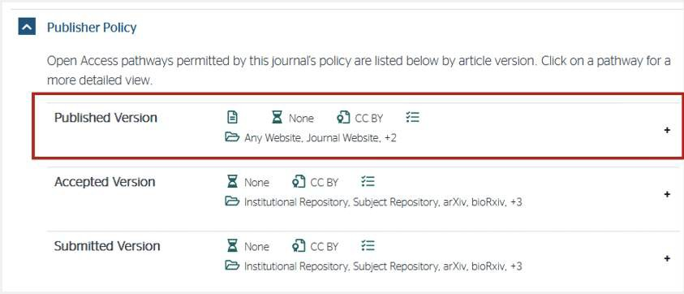

# Lección 4: compartiendo resultados abiertos

## Navegación

- [¿Cuándo compartir?](#cuándo-compartir)
- [¿Cómo compartir?](#cómo-compartir)
- [Otras consideraciones al compartir](#otras-consideraciones-al-compartir)
- [Lección 4: resumen](#lección-4-resumen)
- [Lección 4: evaluación de conocimientos](#lección-4-evaluación-de-conocimientos)

## Panorama general

En la lección 3 aprendiste cómo lograr que tus resultados fueran reproducibles. Ahora, finalmente podemos pensar en cómo vamos a compartir esos resultados de la mejor manera. En esta lección, pondremos énfasis en la publicación de manuscritos en acceso abierto. Aprenderás qué sutilezas considerar al determinar en qué revista publicar, incluyendo cómo entender sus políticas de autoarchivo. Finalmente, discutiremos algunas preocupaciones que se presentan comúnmente sobre el compartir publicaciones en acceso abierto y cómo superarlas. En última instancia, queremos asegurarnos de que tengas confianza en tu decisión de publicar en acceso abierto.

## Objetivos de aprendizaje

Después de completar esta lección, deberías ser capaz de:

- Enumerar maneras en las que puedes compartir resultados abiertos para convertirte en un científico más colaborativo y efectivo.
- Enumerar diferentes tipos de publicaciones en acceso abierto y las consideraciones que hay que tener en cuenta al momento de compartirlas, tal como las licencias que estas poseerán.
- Enumerar algunas de las preocupaciones en torno a la publicación en acceso abierto, incluyendo responsabilidades de los autores, la amenaza de revistas o editoriales depredadoras y/o el temor a equivocarse.

## ¿Cuándo compartir?

Parte de llevar a cabo prácticas con el esquema de ciencia abierta es la posibilidad de ofrecer resultados colaborativos e interactivos. Compartir los diferentes tipos de objetos de investigación de manera temprana durante el proceso de investigación ayudará a aumentar la visibilidad de tu trabajo, al mismo tiempo en que podrá acelerarlo al aprovechar el conocimiento colectivo de la comunidad. Internet ha cambiado de manera sustancial el momento y la manera en que los científicos comunican los resultados.

Planificar el compartir tus resultados provisionales al inicio de tu proyecto puede simplificar notablemente el proceso de su divulgación en la fase final. La figura anterior ilustra muchos de los diferentes objetos que pueden ser compartidos antes de la versión 'final' de tu informe o publicación. Compartir y hablar sobre tu investigación mientras la realizas, así como interactuar con otros científicos, fortalecerá la calidad de tu trabajo.

Haz preguntas. Comparte en qué estás trabajando. Descubrirás que muchos involucrados en la comunidad científica están dispuestos a ayudar. Cuanto más te involucres, mayor será la audiencia y mayor impacto tendrás cuando se publique la versión 'final' de tu trabajo.

En décadas pasadas, los científicos establecían nuevas conexiones al buscar colaboradores a través de cartas y en conferencias. Sin embargo, esta manera de hacer ciencia tendía a restringir quién podía participar. Hoy, la mayoría de estas discusiones tienen lugar en internet, lo que ha habilitado nuevas vías de comunicación para la ciencia colaborativa en la que todos pueden participar.

Las plataformas en las que compartes tu investigación dependen de lo que quieras compartir. Revisa la figura anterior y piensa en dónde podrías compartir los diferentes objetos o tipos de información ahí presentados. ¿Cómo es que esto influirá en la forma en la que interactúes con alguien?

Puedes comenzar compartiendo tus resultados en grupos pequeños, como talleres y conferencias, para luego avanzar hacia audiencias más grandes. A continuación, exploraremos las diversas razones que influyen en la elección del tamaño de los grupos para la comunicación de tus resultados.

### En talleres y conferencias

Muchos de nosotros asistimos a conferencias científicas, talleres y otros encuentros para discutir temas de nuestra disciplina con colegas. Los costos asociados con la asistencia y el viaje a estos eventos pueden limitar el acceso a los materiales y exposiciones que se presentan allí. En estos eventos, los científicos a menudo dan charlas o presentan pósteres que aún no han sido revisados por pares, en donde aprovechan la oportunidad para invitar a la comunidad a emitir observaciones y potencialmente reclutar colaboradores. Estas interacciones son importantes para mejorar los proyectos de investigación y suelen realizarse cuando un proyecto aún está en curso para que los investigadores puedan recopilar comentarios temprano en su proceso científico.

Es importante tener en mente el tipo de audiencia a la que potencialmente se le puede impactar en dichos eventos. Las conferencias tienen diferentes políticas sobre el acceso abierto a los materiales presentados en un evento. Considera qué estás ofreciendo y con quién quieres compartirlo. Por ejemplo, no todos los eventos ofrecen acceso abierto a largo plazo a los materiales del taller después del evento. Si deseas llegar a una audiencia más amplia o preservar los materiales a largo plazo, como científico, tienes opciones para licenciar y publicar abiertamente tú mismo los materiales que has presentado (por ejemplo, usando Zenodo con un DOI) en caso de que los organizadores del evento no lo hagan.

### Otras formas de obtener retroalimentación de manera interactiva

Existen diferentes formas en las que se puede cumplir una función similar para compartir y documentar tus resultados y/o paquetes de software, ¡y también permitir una flexibilidad y nivel de apertura adicionales! Estas opciones pueden ser:

- Publicar en blogs y/o artículos de difusión en línea
- Elaborar videos cortos y podcasts
- Utilizar cuadernos computacionales o 'interfaz notebook'
- Publicar en redes sociales
- Realizar discusiones en foros

Estos diferentes medios permiten la diseminación de resultados no positivos, actualizaciones provicionales de la ciencia y/o mejoras de software. Estas formas alternativas de compartir tu trabajo pueden beneficiar tu investigación facilitando un diálogo extendido entre tú y tus colaboradores, e incluso con el público general. Además, es habitual que estas opciones de difusión sean de más fácil acceso que a las conferencias.

Aquí hay algunos ejemplos específicos de cómo se llevan a cambo estas interacciones a través de plataformas científicas colaborativas:

- Publicaciones en blogs, como en [Pangeo](https://medium.com/pangeo): ¡puedes observar ejemplos de cómo usar diferentes herramientas de software para distintas preguntas científicas!
- Cuadernos computacionales como una forma de demostrar técnicas de programación (por ejemplo, la [Galería del Libro de Cocina del Proyecto Pythia](https://cookbooks.projectpythia.org/) mostrando flujos de trabajo de ciencias computacionales en las ciencias de la tierra).
- Publicaciones que aún no están revisadas por pares, como las [Notas de Investigación de la AAS](https://journals.aas.org/research-notes/).
- Páginas de equipos y/o misiones científicas, como la [página del equipo LUVOIR](https://asd.gsfc.nasa.gov/luvoir/) o la página de la [misión Juno](https://www.missionjuno.swri.edu/).
- Actas de conferencias, como las de la [Sociedad de Ingenieros de Instrumentación Óptica y Fotónica](https://spie.org/publications/conference-proceedings).
- Publicaciones en redes sociales: [Tweet del @MartianColonist](https://twitter.com/MartianColonist/status/1706824699349488036)

 **En el transcurso de un estudio de 3 años, el Journal of Medical Internet Research descubrió que los artículos más tuiteados tenían 11 veces más probabilidades de ser altamente citados que los artículos menos tuiteados.**

### Publicando investigaciones e informes reproducibles

Un informe y un artículo de acceso abierto pueden considerarse como reproducibles cuando sus datos, software y contenido subyacente se encuentran disponibles para los lectores siguiendo algunas prácticas recomendadas. Existe una lista creciente de recursos que documentan cómo hacer que los resultados abiertos sean reproducibles (como [The Turing Way](https://the-turing-way.netlify.app/reproducible-research/reproducible-research) y [FORRT](https://forrt.org/)).

Existen varios ejemplos (discutidos en estas lecciones) que demuestran cómo podemos integrar soluciones técnicas y colaborativas para habilitar esta reproducibilidad. Por ejemplo, los cuadernos computacionales permiten la interactividad y realización de pruebas, los talleres de capacitación invitan a la retroalimentación para la mejora y GitHub/GitLab habilitan la revisión abierta por la comunidad.

**Revistas Académicas**

Publicar trabajos en una revista revisada por pares constituye un fundamento básico de cómo se comparte la ciencia. Al mismo tiempo, se considera una vía importante para comunicar resultados que cuenten con rigor científico entre colegas. Las revistas académicas también actúan como un archivo de preservación a largo plazo de artículos de investigación científica. Para muchos científicos, publicar en revistas revisadas por pares y ser citados son factores clave para ser evaluados en el avance de su carrera, para recibir nombramientos, obtener reconocimiento o aspirar a formar parte de comités.

En este sentido, de manera recurrente los autores pueden llegar a pagar un Cargo por Procesamiento de Artículos (APC, por sus siglas en inglés) que puede variar entre $200 y $12,000 USD. Las revistas de mayor prestigio a menudo son las que cobran las tarifas más altas. El acceso a los artículos ha estado tradicionalmente restringido por muros de pago que requieren una suscripción o un cargo de consulta por artículo. Las revistas pueden contar con diferentes opciones para hacer que tu trabajo publicado sea accesible para todos.

**¿Quién tiene acceso a las suscripciones de revistas?**

Los muros de pago limitan quién puede acceder a cierta investigación científica. Generalmente, esto puede generar una barrera en la participación y discución científica, lo que puede ocasionar una erosión en la confianza pública de sus resultados. Y parte de lo que pretende corregir la ciencia abierta es garantizar el acceso mundial a la investigación.

**Revistas de acceso abierto**

Las revistas de acceso abierto son revistas revisadas por pares que son más accesibles porque no requieren que los lectores tengan una suscripción o paguen para acceder al contenido. Sin embargo, las revistas de acceso abierto, en algunos casos, pueden requerir tarifas para el autor. Los artículos revisados por pares de acceso abierto están archivados por una discusión más formal de ideas científicas, interpretaciones y conclusiones. Forman la base de cómo los investigadores comparten resultados.

### Actividad 4.1: lee las políticas de acceso abierto de los servicios editoriales o revistas que utilizas

En esta actividad aprenderás cómo acceder a la información sobre las políticas de archivo de datos de una revista. El Directorio de Revistas de Acceso Abierto (DOAJ, por sus siglas en inglés) proporciona un índice extenso de revistas de acceso abierto de todo el mundo. El DOAJ se puede usar para buscar información, incluidas las políticas de archivo de datos para las revistas que publican investigaciones. Vamos a explorar su sitio web y buscar las políticas específicas de las revistas que más utilizas.

1. Primero, navega al sitio [web del DOAJ](https://doaj.org/).
2. Escribe el nombre de una de las siguientes revistas en el cuadro de búsqueda y, a continuación, pulsa el botón amarillo «BUSCAR».

- Cartas de Ciencias Atmosféricas y Oceánicas
- Revista Suiza de Geociencias
- Historia de las ciencias geológicas y espaciales   Nota: Puedes introducir cualquier revista que desees, pero para este ejercicio utiliza una de las listadas para ver el enlace Sherpa/Romeo que aparece en el Paso 5.

3. Los resultados de la búsqueda pueden mostrar más de una coincidencia. Selecciona la revista deseada dentro de los resultados de la búsqueda haciendo clic en el nombre de la misma.  Aparecerá un panel de control con información relativa a las tarifas de publicación, las políticas de exención, el tipo de licencia abierta utilizada y otra información sobre los múltiples títulos mostrados.
4. Haz clic en el enlace «política de archivo» que aparece en una de las casillas desplegadas, como se ve aquí. Este proporcionará los enlaces a una gran cantidad de información sobre las políticas de acceso abierto de la revista para el propio manuscrito:   Se presentará mucha información, incluyendo detalles sobre las políticas de publicación específicas de la revista seleccionada.
5. Alternativamente, para obtener una visión más condensada de las políticas de la revista, vuelve al tablero de DOAJ en la página "Acerca de" con los múltiples cuadros desplegados, y haz clic en el enlace «Sherpa/Romeo» como se muestra aquí. 
6. En la página Sherpa Romeo, cliquea en el nombre de la revista que aparece en la lista (la única revista que aparece). 
7. Cuando veas la página, verás que resume y consolida las políticas de acceso abierto para esa revista y los materiales asociados. Es probable que la versión publicada sea la más relevante (véase el recuadro rojo de la figura). 
8. Revisa la página para determinar qué licencia ha definido la revista seleccionada para la reutilización de manuscritos.

#### Actividades clave: Lee las políticas de acceso abierto de las editoriales que utilizas

Este es un ejemplo de un sitio que puedes utilizar para saber si la política de una revista es coherente con la forma en que deseas publicar tus resultados de acceso abierto. Las políticas de las revistas siempre deben revisarse y tenerse en cuenta durante la fase inicial de planificación del proyecto y mucho antes de enviar el manuscrito para su publicación.

## Cómo compartir

Quizás el paso más importante para que tus resultados sean abiertos sea asignarles un identificador global único y persistente. Esto te brindará un código único, URL o número que podrás utilizar para referirte de forma exclusiva a un objeto de investigación. Cualquier objeto de investigación derivado puede utilizar este identificador para enlazar con él y crear un historial rastreable de uso y desarrollo. Además, el identificador puede ser utilizado por otros para citar y acreditar tu trabajo ([fuente](https://opensciency.github.io/sprint-content/open-results/lesson3-apply-open-results.html)).

El identificador también debe ser persistente. Esto garantiza que conduzca al mismo objeto de investigación durante un largo periodo de tiempo. Lo que cuenta como «persistente» es, por supuesto, una apreciación, ya que incluso el identificador más estable probablemente no sobrevivirá a que el Sol engulla la Tierra dentro de unos miles de millones de años. En este contexto, «persistente» implica que está registrado en una base de datos gestionada por una organización o sistema que se compromete a mantenerlo estable y compatible con versiones anteriores en un futuro previsible.

Por ejemplo, las URL (un sitio web personal, un repositorio de GitHub o un almacenamiento en la nube) son notoriamente poco persistentes, ya que pueden cambiar su contenido con frecuencia o dejar de ser válidas si no reciben mantenimiento. Por su parte, las publicaciones de revistas científicas tienen un Identificador de Objeto Digital (DOI) cuya persistencia está garantizada por la Fundación Internacional del DOI.

Además de identificar unívocamente cada objeto de investigación, es importante poder identificar y citar unívocamente a todos los autores y colaboradores. Para ello, se recomienda obtener el identificador digital permanente de cada uno de ellos. [ORCID](https://orcid.org/) (Open Researcher and Contributor ID) es un servicio en línea que permite obtener un identificador digital permanente.

Existen ejemplos de identificadores globalmente únicos y persistentes:

<table style="width:100%;">
  <thead>
    <tr>
        <th>IDENTIFICADOR DE OBJETO DIGITAL (DOI)  10.1371/JOURNAL.PONE.0230416 ☑</th>
        <th>ISBN-13: 978-0735619678</th>
        <th>THE INTERNET ARCHIVE</th>
    </tr>
  </thead>
  <tbody>
    <tr>
        <td colspan="3">
            
El identificador de objeto digital lo proporciona la Fundación Internacional DOI, que garantiza que cada identificador es único y asegura que un enlace DOI siempre enlaza con el objeto correcto.

        </td>
    </tr>
  </tbody>
</table>

<table style="width:100%;">
  <thead>
    <tr>
        <th>IDENTIFICADOR DE OBJETO DIGITAL 10.1371/JOURNAL.PONE.0230416</th>
        <th>ISBN-13: 978-0735619678 ☑</th>
        <th>EL ARCHIVO DE INTERNET</th>
    </tr>
  </thead>
  <tbody>
    <tr>
        <td colspan="3">
            
Se trata de un número internacional normalizado para libros, que los editores deben adquirir a través de la Agencia Internacional del ISBN.

        </td>
    </tr>
  </tbody>
</table>

<table style="width:100%;">
  <thead>
    <tr>
        <th>IDENTIFICADOR DE OBJETO DIGITAL 10.1371/JOURNAL.PONE.0230416</th>
        <th>ISBN-13: 978-0735619678</th>
        <th>EL ARCHIVO DE INTERNET ☑</th>
    </tr>
  </thead>
  <tbody>
    <tr>
        <td colspan="3">
            
<a href="https://web.archive.org/web/20220121051903/https://www.go-fair.org/">El Archivo de Internet</a> (*Internet Archive*) captura instantáneas de sitios web y sus enlaces son realmente estables. Aunque no sea ideal, es una herramienta práctica para crear identificadores de sitios web fácilmente.

        </td>
    </tr>
  </tbody>
</table>

### Licencias

Al aplicar una licencia a tu trabajo, dejas claro qué pueden hacer los demás con las cosas que compartes, así como las condiciones en las que las proporcionas (como el requisito de citarte). Otro elemento muy importante que debes incluir con tus objetos de investigación son normas claras para su reutilización (tal cual y para la creación de obras derivadas), que a menudo se codifican más fácilmente mediante el uso de una licencia.

Sin licencia, todos los derechos corresponden al autor del resultado de la investigación. Eso significa que nadie más puede utilizar, copiar, distribuir o modificar la obra sin consentimiento. Una licencia otorga este consentimiento. Si no dispone de una licencia para cada uno de los objetos de investigación que constituyen el resultado de su investigación, ésta no podrá ser utilizada por toda la comunidad de investigación.

Las licencias Creative Commons suelen utilizarse para contenidos escritos (véase la Lección 3 para una descripción completa). La ventaja de una licencia, a diferencia del dominio público, es que la mayoría exige la atribución a las personas creadoras originales. La Licencia de Atribución de Creative Commons, [CC-BY](https://wellcome.org/grant-funding/guidance/open-access-guidance/creative-commons-attribution-licence-cc), es la licencia de acceso abierto más común para compartir publicaciones, ya que requiere atribución. Existen otras licencias Creative Commons utilizadas que pueden tener diferentes limitaciones en cuanto a si pueden o no utilizarse comercialmente, si pueden o no modificarse y copiarse, y si las licencias pueden o no modificarse en posteriores adaptaciones del código.

Las instituciones, agencias de financiación o propuestas de investigación pueden requerir el uso de una licencia específica en función del tipo de material que se produzca a partir de la investigación. En el caso de los organismos públicos, se suele recomendar (o exigir) CC-0 o CC-BY para maximizar el rendimiento de la inversión y garantizar la reutilización más amplia posible. Elegir una licencia CC que tenga restricciones adicionales (por ejemplo, -ND, -SA, -NC) puede dar lugar a una menor reutilización de los datos. Cuando compartas resultados en distintas plataformas, fíjate bien cuál es la licencia que se está aplicando!

### Vías para publicar en acceso abierto

Vías para publicar en abierto. Ilustración del proyecto Turing Way por Scriberia. Utilizado bajo licencia CC-BY 4.0. Versión original en Zenodo. [http://doi.org/10.5281/zenodo.5706310](http://doi.org/10.5281/zenodo.5706310)

---

Los tipos más comunes de publicación en acceso abierto son Verde (_green route_), Dorado (_gold route_) y Diamante (_diamond route_).

<table style="width:100%;">
  <thead>
    <tr>
        <th>ACCESO ABIERTO DORADO ☑</th>
        <th>ACCESO ABIERTO VERDE</th>
        <th>ACCESO ABIERTO DIAMANTE</th>
    </tr>
  </thead>
  <tbody>
    <tr>
        <td colspan="3">
            
En el Acceso Abierto Dorado, las personas autoras pagan una tasa de procesamiento de artículos, APC (*Article Processing Charge*), a una revista para que ésta publique la versión final de su artículo bajo una licencia de acceso abierto, que luego queda disponible en línea de forma permanente y gratuita para cualquiera. Las personas autoras conservarán los derechos de autoría, normalmente a través de una licencia Creative Commons de su elección, que dicta lo que otros pueden hacer con el artículo. Una crítica en torno a la publicación dorada en Acceso Abierto es el costo.

            
Por lo general, los APC pueden rondar los 2000 USD o, en algunos casos, más, lo que puede resultar prohibitivo para las personas que hacen ciencia en muchas partes del mundo. Algunas editoriales ofrecen descuentos o exenciones a los autores de países clasificados por el Banco Mundial como economías de renta baja, o es posible que su financiador cubra las APC como parte de su subvención.

        </td>
    </tr>
  </tbody>
</table>

<table style="width:100%;">
  <thead>
    <tr>
        <th>ACCESO ABIERTO DORADO</th>
        <th>ACCESO ABIERTO VERDE ☑</th>
        <th>ACCESO ABIERTO DIAMANTE</th>
    </tr>
  </thead>
  <tbody>
    <tr>
        <td colspan="3">
            
El Acceso Abierto Verde es el proceso de autoarchivo. El movimiento de autoarchivo tiene como objetivo proporcionar herramientas y asistencia a los académicos para depositar y difundir sus artículos de revistas arbitradas en repositorios abiertos institucionales o temáticos. You may choose to self-archive your work to make it more discoverable and/or after you’ve published it in a subscription journal to ensure there is an open version of your paper.

            
The Registry of Open Access Repositories contains a list of repositories that are available for researchers to self-archive. A principios de 2019 había más de 4000 repositorios. ¡Es importante encontrar una comunidad de autoarchivos!

        </td>
    </tr>
  </tbody>
</table>

<table style="width:100%;">
  <thead>
    <tr>
        <th>PUBLICACIÓN EN ACCESO ABIERTO ORO</th>
        <th>PUBLICACIÓN EN ACCESO ABIERTO VERDE</th>
        <th>PUBLICACIÓN EN ACCESO ABIERTO DIAMANTE</th>
    </tr>
  </thead>
  <tbody>
    <tr>
        <td colspan="3">
            
Acceso abierto Diamante, son publicaciones en las que no hay costo alguno para leer o publicar un artículo. Las revistas de acceso abierto Diamante, o bien tienen costos muy bajos debido a que aprovechan la infraestructura existente y los esfuerzos de voluntarios, o bien cuentan con el apoyo directo de fundaciones o instituciones. Para los autores, las publicaciones de acceso abierto Diamante suelen permitir que el autor conserve los derechos de autor (copyrigh) y la versión final de su artículo, ya que se publica bajo una licencia de acceso abierto.

        </td>
    </tr>
  </tbody>
</table>

### Ventajas y desventajas de las preimpresiones (preprints)

Al publicar en una revista revisada por pares, puedes decidir compartir una preimpresión. Una preimpresión es una versión de un artículo antes de su publicación en una revista\*. Puede tratarse de la versión del manuscrito aceptada por quien la escribe tras la revisión por pares o de una versión anterior a su presentación a una revista.

 **El manuscrito admitido es la versión final, revisada por pares, del artículo que ha sido aceptado para su publicación por un editor.<0/>. El manuscrito aceptado incluye todos los cambios realizados durante el proceso de revisión por pares y tiene el mismo contenido que el artículo final publicado, pero no incluye las correcciones de edición, estilo o de formato de edición que aparecerán en la publicación final de la revista (es decir, la versión registrada)**

Fuente: https://science.nasa.gov/researchers/sara/faqs/osdmp

Muchas revistas ofrecen servicios de preimpresión. Si no lo hacen, hay muchos servidores públicos de preimpresión disponibles. A menudo, la agencia de financiación tiene un servidor público de preimpresiones preferido.

Las preimpresiones presentan muchas ventajas, así como desventajas percibidas o potenciales.

<table style="width:100%;">
  <thead>
    <tr>
        <th>VENTAJAS DE PUBLICAR UN TRABAJO COMO PREPRINT☑</th>
        <th>POSIBLES DESVENTAJAS</th>
    </tr>
  </thead>
  <tbody>
    <tr>
        <td colspan="2">
            <ul>
            <li>Difundir rápidamente los hallazgos a las comunidades en el plazo debido.</li>
            <li>Muchos servidores de preimpresos de campos específicos (p. ej., arxiv.org, biorxiv.org, essoar.org) se pueden cargar y leer de forma gratuita.</li>
            <li>Comentarios de la comunidad sobre tu trabajo a medida que se realiza.</li>
            </ul>
        </td>
    </tr>
  </tbody>
</table>

<table style="width:100%;">
  <thead>
    <tr>
        <th>VENTAJAS DE PUBLICAR UN TRABAJO COMO PREPRINT</th>
        <th>POSIBLES DESVENTAJAS ☑</th>
    </tr>
  </thead>
  <tbody>
    <tr>
        <td colspan="2">
            <ul>
            <li>El trabajo puede compartirse con errores críticos que pueden haberse detectado en la revisión por pares.</li>
            <li>En algunos campos, existe la percepción de una menor fiabilidad o calidad de la investigación publicada como impresión por pares.</li>
            <li>Algunas revistas no permiten o no aceptan artículos si han sido enviados a un servidor de preimpresiones.</li>
            </ul>
        </td>
    </tr>
  </tbody>
</table>

### Qué tener en cuenta al hacer preimpresiones

Cuando decidas preimprimir tu trabajo, deberás comprobar:

1. La política de derechos de autor (Copyright) de la revista en la que deseas publicar.
2. La versión del trabajo que puede depositarse.
3. Cuándo se permite poner el trabajo a disposición del público.

#### Lecturas adicionales:

Lee la [historia](https://pubs.aip.org/physicstoday/Online/29310/Joanne-Cohn-and-the-email-list-that-led-to-arXiv) sobre cómo la lista de correo electrónico de Joanne Cohn para preimpresiones llevó a Paul Ginsparg al desarrollo de [arXiv](https://arxiv.org/).

## Otras consideraciones a la hora de compartir

### ¿Quién está compartiendo?

Cuando se escribe un Plan de ciencia abierta y gestión de datos (OSDMP, por las siglas en inglés de Open Science and Data Management Plan), es importante incluir un plan sobre las funciones y responsabilidades necesarias para compartir los resultados. Como se explica en la lección 3, tu comunidad estará formada por miembros con diferentes funciones: algunos participarán activamente y otros sólo tendrán un interés pasajero. Contar con un plan claro para compartir los resultados abiertos y la forma en que se otorgará el crédito ayudará a que todos comprendan sus contribuciones y funciones y minimizará los conflictos.

En la Lección 3 se describen detalladamente las diferentes funciones que pueden desempeñar las personas en la puesta en común de resultados. Esto debe describirse claramente en el Plan de ciencia abierta y gestión de datos.

### Editoriales depredadoras

Las editoriales depredadoras suelen ser editoriales con ánimo de lucro que cobran una tasa de publicación pero proporcionan pocos controles de calidad de la publicación que cabría esperar de las publicaciones académicas. A veces utilizan la ventaja del acceso abierto para atraer a los autores a publicar con ellos. Si no está seguro de si una editorial puede ser depredadora, un buen punto de partida es consultar al personal de su biblioteca.

Hay muchas señales de alarma en estas solicitudes de editoriales depredadoras:

- Hay urgencia y se pide un plazo de entrega extremadamente rápido. Un plazo de publicación muy rápido podría indicar un proceso de revisión por pares menos riguroso.
- El inglés escrito de la correspondencia suele ser de mala calidad, con muchos errores gramaticales. (Aunque es importante recordar que esto por sí solo no indica un comportamiento depredador, ya que los errores gramaticales pueden cometerse por razones inocentes, como ser un hablante no nativo).
- El tema de la revista no es específico.
- La solicitud es imprecisa o genérica.
- El correo electrónico a menudo no es solicitado, incluso si afirman que se están refiriendo a un documento anterior suyo. Puede empezar con una solicitud imprecisa o genérica, como "profesor".
- Hacen hincapié en la indexación del ISSN (International Standard Serial Number en inglés. Número Internacional Normalizado de Publicaciones Seriadas) y/o en los factores de impacto, aunque esta revista en concreto no los tenga. Considera el indicador de citas de revistas (JCI por las siglas en inglés de Journal Citation Indicator) además del factor de impacto de la revista (JIF por las siglas en inglés de Journal Impact Factor).
- La editorial/revista envía múltiples correos electrónicos solicitando manuscritos, números especiales y funciones editoriales.
- Tienen un elevado número de ediciones especiales, de modo que la mayoría de los artículos publicados aparecen en números especiales.
- Su nombre se parece al de una revista prestigiosa.
- Tienen un alto índice de autocitación, superior al 20%.
- Tienen una tasa muy alta de aceptación de los trabajos enviados.
- Envían con frecuencia solicitudes para presentar trabajos o ejercer de editor.

A continuación encontráis algunas reflexiones finales sobre lo que debéis o no debéis tener en cuenta a la hora de decidir dónde publicar. Como ocurre con muchas de las consideraciones que se plantean en el mundo académico, a veces la decisión sobre el mejor lugar para publicar vendrá determinada por las conversaciones de boca a boca con los pares. Lee más sobre la guía de NOA sobre la publicación depredadora (https://libguides.library.noaa.gov/predatorypublishing).

### Preguntas frecuentes sobre la divulgación de resultados

Compartir de diferentes maneras, especialmente sin revisión por pares, puede ser intimidante. Tal vez te hayan preocupado las siguientes preguntas:

- **¿Qué pasa si un resultado abierto es erróneo?** Un tuit, un post o un vídeo no es más que una instantánea en el tiempo de un resultado de investigación. Quienes hacemos ciencia de manera profesional sabemos que estamos constantemente aprendiendo y descubriendo cosas nuevas. La elaboración de resultados reproducibles incluirá necesariamente diferentes versiones y revisiones de una idea a medida que se desarrolla.

- **Ya he publicado mis resultados científicos de forma abierta, ¿tengo que responder siempre a los comentarios de la comunidad?** Mientras hayas hecho todo lo posible para que tu trabajo sea reproducible, no tiene por qué preocuparse. La ciencia abierta no puede ser llevada a cabo únicamente por una persona. Las comunidades de ciencia abierta pueden seguir actualizando, perfeccionando y desarrollando sus resultados si tu trabajo ha sido compartido y con licencia abierta.  
  Si eres capaz de responder a una pregunta o a una inquietud sobre tu investigación anterior, eso es estupendo. También es una respuesta ética reconocer que se trata de una investigación en la que usted ya no participa activamente, pero permite que otros continúen el trabajo que comenzaste.

- **¿Y si no puedo hacerlo todo? ¿Soy un mal científico abierto?** ¡La respuesta es no! Sólo tienes una cantidad de tiempo limitada. Incluso con colaboradores no puedes hacer todo.   

Compartir resultados abiertos mejora la ciencia: es más rápido, más accesible y más colaborativo. En esta lección has aprendido todas las formas de compartir resultados abiertos. ¡Piensa cómo podrías compartir algo en lo que esté trabajando ahora!

## Lección 4: Resumen

En esta lección, has aprendido:

- Cuándo compartir resultados abiertos y las diferentes formas en que se pueden compartir. Esto incluye: publicaciones revisadas por pares, resúmenes de congresos, entradas de blog, vídeos, anotaciones y redes sociales.
- Cómo compartir resultados abiertos, incluyendo consideraciones sobre la licencia de la publicación, rutas para publicaciones de acceso abierto (Verde, Oro, Diamante) y preimpresiones como parte del proceso de publicación.
- Consideraciones en torno al uso compartido, incluyendo consideraciones en torno a los editores depredadores y preocupaciones comunes en torno al intercambio abierto de resultados.

## Lección 4: Evaluación

Responde a las siguientes preguntas para comprobar lo que has aprendido hasta ahora.

Pregunta

**01/03**

¿Cuál de las siguientes licencias Creative Commons es la más utilizada para las publicaciones de acceso abierto?

- CC BY-NC-SA
- Derechos de autor (Copyrights)
- CC-BY
- Apache 2.0

Pregunta

**02/03**

Lee la siguiente afirmación y decide si es verdadera o falsa.

El acceso abierto de Diamante es gratuito tanto para publicar como para leer artículos científicos

- Verdadero
- Falso

Pregunta

03/03

Fíjate bien en la siguiente solicitud de envío a una revista. ¿Te parece fiable esta solicitud?

- Sí
- No
