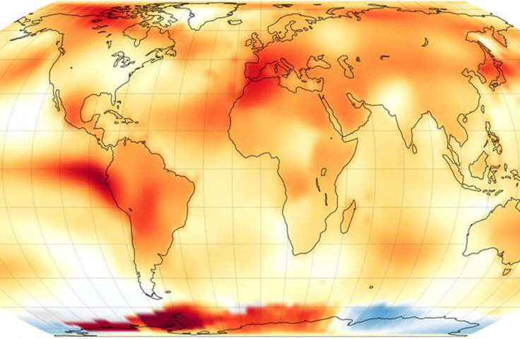

# Lección 5: De la teoría a la práctica

## Contenidos

- [Escribir un Plan de Ciencia Abierta y Gestión de Datos: Qué incluir para compartir Resultados Abiertos](#escribir-un-plan-de-ciencia-abierta-y-gesti%C3%B3n-de-datos:-qu%C3%A9-incluir-para-compartir-resultados-abiertos)
- [Ejemplos de pasos hacia resultados más abiertos](#ejemplos-de-pasos-hacia-resultados-m%C3%ADs-abiertos)
- [Cómo una tecnología emergente como la IA está cambiando nuestra forma de hacer ciencia](#c%C3%B3mo-una-tecnolog%C3%ADa-emergente-como-la-ia-est%C3%A1-cambiando-nuestra-forma-de-hacer-ciencia)
- [Lección 5: Resumen](#lecci%C3%B3n-5-resumen)
- [Lección 5: Evaluación](#lecci%C3%B3n-5-evaluaci%C3%B3n)
- [Resumen del Módulo 5: Resultados Abiertos](#resumen-del-m%C3%B3dulo-5-resultados-abiertos)
- [Resumen de Introducción a la Ciencia Abierta](#resumen-de-introducci%C3%B3n-a-la-ciencia-abierta)

## Descripción general

En las lecciones anteriores hemos aprendido varias formas de compartir nuestra ciencia y los pasos que debemos tener en cuenta a la hora de hacerlo. En esta lección, unimos los conceptos de las lecciones anteriores con algunas orientaciones específicas para redactar la sección Compartir Resultados de un Plan de Ciencia Abierta y Gestión de Datos, PCAGD (en inglés, _Open Science Data Management Plan, OSDMP_). También reflexionaremos sobre cómo nuestra sociedad y la tecnología evolucionan constantemente, al igual que nuestra forma de hacer ciencia. Una nueva tecnología con el potencial de alterar radicalmente la forma en que hacemos y compartimos la ciencia es la inteligencia artificial (IA), sobre todo cuando se trata de modelos de aprendizaje de idiomas. Estas herramientas de IA ya están cambiando la forma en que interactuamos con el texto escrito. En esta lección analizaremos algunas de las formas en que la IA afecta y afectará a la forma en que hacemos y compartimos nuestra ciencia.

## Objetivos de Aprendizaje

Al finalizar esta lección deberías ser capaz de:

- Listar lo que debe incluirse en un PCAGD para compartir resultados abiertamente.
- Listar algunos pasos concretos para compartir resultados abiertamente.
- Describir cómo la tecnología emergente, como la IA, está influyendo actualmente en la forma en que utilizamos, hacemos y compartimos nuestra ciencia.

## Escribir un Plan de de Ciencia Abierta y Gestión de Datos: Qué incluir para compartir Resultados Abiertos

El proceso para compartir datos y software en el marco de un Plan de Ciencia Abierta y Gestión de Datos (PCAGD) se trató en otros módulos, por lo que aquí hablaremos de cómo compartir el otro tipo de resultados de la investigación. La mayoría de las propuestas exigen que se incluyan planes para publicaciones como manuscritos revisados por pares, informes técnicos, libros y material de conferencias.

Aunque no es obligatorio, puede ser una buena idea incluir planes para hacer que tus resultados sean públicamente accesibles de formas distintas a la publicación tradicional, por ejemplo, entradas de blog en línea, tutoriales u otros materiales. Después de todo, la redacción de un PCAGD es a menudo un requisito para las solicitudes de financiación, y puede ser una forma de mostrar a quienes revisan las propuestas que estás pensando en la mejor manera de compartir tu ciencia.

### Actividad 5.1: Lápiz y papel

Escribe una sección de resultados de muestra de un PCAGD que detalle cómo planearías hacer públicos tus resultados. Piensa en un ejemplo de tu investigación y qué detalles necesitarás incluir para convencer a quienes revisan las propuestas que compartirás los resultados de Acceso Abierto.

**Ejemplo 1:** Esta actividad dará lugar a 2 publicaciones revisadas por pares que se publicarán en Acceso Abierto verde. Las preimpresiones se archivarán en PubSpace.

**Ejemplo 2:** Esta actividad dará lugar a la creación de cuadernos computacionales, 4 resúmenes y pósteres para congresos, 2 manuscritos revisados por pares y 2 artículos en línea en lenguaje sencillo, que resumirán nuestros resultados. Las publicaciones revisadas por pares se publicarán en Acceso Abierto y las preimpresiones se archivarán en PubSpace o en el servidor de preimpresión de las revistas de Acceso Abierto. Todos los demás materiales se archivarán en Zenodo, se les asignará un DOI y se les asignará una licencia CC-BY o una licencia de software permisiva.

Para estos ejemplos, ¿Qué otra información o detalles podrían añadirse? Si estuvieras planeando escribir un tutorial sobre tu ciencia, ¿Qué incluirías?

## Ejemplos de pasos hacia resultados más abiertos

[**La NASA anuncia que el verano de 2023 será el más caluroso jamás registrado**](https://www.nasa.gov/news-release/nasa-announces-summer-2023-hottest-on-record/)

Crédito de la imagen: NASA Earth Observatory/Lauren Dauphin.

---

Cuando los resultados y los objetivos de investigación se publican abiertamente, cualquiera puede reproducir el resultado científico. Para temas como el cambio climático, la transparencia de los resultados ayuda a reducir la desinformación y aumenta la confianza del público en los resultados.

Aquí hay un [repositorio](https://github.com/jmunroe/OpenScienceExample_GISTEMPv4/tree/main) GitHub con un ejemplo de un [resultado](https://gist.github.com/jmunroe/74a1eda18d1473040ed91f2a1f02b1b5) disponible como Acceso Abierto. Esta visualización no es perfecta, pero ofrece una instantánea de un trabajo en curso que puede compartirse con la comunidad para recabar opiniones y perfeccionarlo. Esto podría perfeccionarse aún más, o quizá servir como inicio de un nuevo esfuerzo que amplíe los resultados iniciales. Los resultados son más accesibles, inclusivos y reproducibles al publicarse abiertamente.

Hay muchas maneras en que la Ciencia Abierta puede ampliar la duración o el alcance de los proyectos. Estos son algunos pasos que puedes tomar para compartir tus Resultados Abiertos de forma que tu trabajo sea más utilizable, reproducible e inclusivo:

- Añade un Código de Conducta a través del archivo CODIGO_DE_CONDUCTA (_CODE_OF_CONDUCT_, en inglés) y enlaza a otras políticas que se aplican a tu trabajo.
- Añade guías de personas colaboradoras y autoría a través de un archivo CONTRIBUCION (_CCONTRIBUTING_, en inglés).
- Añade, con su permiso, a tu equipo y a las personas colaboradoras.
- Añade tu propuesta pero elimina cualquier información sensible.
- Elabora una hoja de ruta preliminar y determina qué objetivos pretendes alcanzar con el proyecto.
- Crea una carpeta de gestión del proyecto, otra de código y otra de datos, en las que podrás cargar la información adecuada a medida que se desarrolle el proyecto.
- Elabora una lista de los recursos necesarios para tu proyecto.
- Proporciona enlaces a materiales de capacitación de los que puedan beneficiarse las personas que colaboren.
- Utiliza tableros de proyecto e incidencias (_issues_) para comunicar lo que está ocurriendo en el proyecto.
- Utiliza _Pull Request_ para invitar a revisiones a nuevos desarrollos de código y contenido (en Git).
- Añade manuales de usuario y cuadernos ejecutables para permitir pruebas de código.
- Crea y comparte cuadernos computacionales que documenten cómo se procesan los datos y el resultado obtenido.
- Crea tutoriales o videos cortos que demuestren cómo se realizó un paso en el flujo de trabajo de tu investigación.
- Escribe una entrada de blog sobre tu experiencia luchando con un reto de investigación concreto y cómo lo resolviste.
- Contribuye a la documentación para mejorar las herramientas de Código Abierto basándote en tu propia experiencia.
- Conecta tu repositorio a Binder para permitir pruebas en línea de tu código y cuadernos ejecutables.
- Enlaza todas las salidas generadas fuera de este repositorio (como blogs, videos, publicaciones en foros y podcasts, entre otros, como se discutió anteriormente).
- Algunos pasos avanzados que deberían aplicarse a medida que se desarrolla el proyecto son la integración continua, el uso de contenedores (_containers_ en inglés), el archivo CITACION (_CITATION CFF_, en inglés) y la creación de una página web sencilla para enlazar toda la información.

## Cómo una tecnología emergente como la IA está cambiando nuestra forma de hacer ciencia

A lo largo de estos módulos, Internet ha sido identificada como una tecnología disruptiva fundamental que cambió la forma en que se realiza casi toda la ciencia. La comunidad científica rara vez va a las bibliotecas para leer los últimos artículos de una revista. Los datos ya no se envían por correo a todo el mundo en unidades de cinta. El software ya no se comparte a través de disquetes flexibles. Internet ayudó a crear el flujo de trabajo científico moderno y ha hecho a la ciencia más interactiva y accesible. Ahora las herramientas de IA están empezando a alterar la ciencia de una manera similar. La IA no sólo está revolucionando muchos aspectos de nuestras vidas, sino que también está cambiando nuestra forma de hacer ciencia. A medida que las empresas compiten por crear e integrar nuevas herramientas de IA generativa en cada aspecto de nuestras vidas, muchas personas que investigan y editan revistas, instituciones, y agencias buscan cómo usar estas herramientas de forma eficaz, comprender su fiabilidad, precisión y sesgos, y cómo utilizarlas de forma ética. Otro motivo de preocupación es cómo la información compartida con las herramientas de IA puede utilizarse para revelar datos confidenciales de forma intencionada o no, lo que plantea problemas de privacidad.

La IA puede ayudarnos a usar y compartir la investigación. Puede actuar como un acelerador, ocupándose de las tareas tediosas y dejando libres a las personas que investigan para pensamientos más creativos. Estas herramientas son mejores que los humanos para procesar grandes cantidades de datos, pero los seres humanos son mejores para el pensamiento creativo y matizado. Es importante tener esto en cuenta a la hora de determinar si usar o no la IA. Por ejemplo, muchas personas ya utilizan herramientas de IA para ayudarles a gestionar su bandeja de entrada y a redactar correos electrónicos con contenido sugerido generado por IA. En el ámbito científico, hay muchas tareas que podrían agilizarse usando la IA, según tres estudios publicados en Nature:

- [Los motores de búsqueda de ciencias de la IA están creciendo en número — ¿son buenos?](https://www.nature.com/articles/d41586-023-01273-w) (en inglés).
- [Cómo la tecnología de IA puede dominar la literatura científica](https://www.nature.com/articles/d41586-018-06617-5) (en inglés).
- [IA y ciencia: que piensan 1.600 personas que investigan](https://www.nature.com/articles/d41586-023-02980-0) (en inglés).

### Usando IA:

<table>
  <thead>
    <tr>
        <th>REVISIONES DE LITERATURA ☑</th>
        <th>BÚSQUEDA DE CONJUNTOS DE DATOS Y HERRAMIENTAS DE SOFTWARE RELEVANTES</th>
        <th>BARRERAS LINGÜÍSTICAS</th>
    </tr>
  </thead>
  <tbody>
    <tr>
        <td colspan="3">
            
El volumen cada vez mayor de literatura científica ha dificultado que quienes investigan se mantengan al día de los artículos más recientes y encuentren los más antiguos. Las herramientas de IA se pueden usar para crear recomendaciones personalizadas para artículos relevantes, así como para crear resúmenes de los mismos en diversos formatos. Algunos ejemplos de estas herramientas incluyen <a href="https://scisummary.com/dashboard">SciSummary</a>, <a href="https://www.summarizebot.com/">SummarizeBot</a>, <a href="https://www.scholarcy.com/">Académica</a>, <a href="https://www.paperdigest.org/">Paper Digest</a>, <a href="https://www.scilynk.com/">Lynx AI</a>, <a href="https://www.tldrthis.com/">TLDR This.</a>

            
Los posibles inconvenientes al usar estas herramientas incluyen:

            <ul>
                <li>Introducción potencial de sesgos</li>
                <li>Insuficiente comprensión o interpretación contextual</li>
                <li>Posible incapacidad para manejar el lenguaje técnico complejo</li>
                <li>Identificación incorrecta de puntos clave</li>
            </ul>
        </td>
    </tr>
  </tbody>
</table>

<table>
  <thead>
    <tr>
        <th>REVISIONES DE LITERATURA</th>
        <th>BÚSQUEDA DE CONJUNTOS DE DATOS Y HERRAMIENTAS DE SOFTWARE RELEVANTES ☑</th>
        <th>BARRERAS LINGÜÍSTICAS</th>
    </tr>
  </thead>
  <tbody>
    <tr>
        <td colspan="3">
            
Las herramientas de IA pueden utilizarse para descubrir diferentes conjuntos de datos que pueden ser relevantes para una consulta científica y recomendar bibliotecas de software relevantes.

        </td>
    </tr>
  </tbody>
</table>

<table>
  <thead>
    <tr>
        <th>REVISIONES DE LITERATURA</th>
        <th>BÚSQUEDA DE CONJUNTOS DE DATOS Y HERRAMIENTAS DE SOFTWARE RELEVANTES</th>
        <th>BARRERAS LINGÜÍSTICAS ☑</th>
    </tr>
  </thead>
  <tbody>
    <tr>
        <td colspan="3">
            
Las herramientas de IA pueden utilizarse para crear traducciones automáticas a diferentes idiomas. Varias de las herramientas mencionadas también ofrecen traducción.

        </td>
    </tr>
  </tbody>
</table>

### Haciendo con IA:

<table>
  <thead>
    <tr>
        <th>CÓDIGO ☑</th>
        <th>RESULTADOS</th>
    </tr>
  </thead>
  <tbody>
    <tr>
        <td colspan="2">
            
Las herramientas de IA pueden utilizarse para generar código para realizar tareas de análisis y traducir entre lenguajes de programación. Algunos ejemplos de estas herramientas incluyen <a href="https://github.com/features/copilot">Co-Pilot</a>, <a href="https://openai.com/blog/openai-codex">Codex</a>, <a href="https://chat.openai.com/auth/login">ChatGPT</a>y <a href="https://alphacode.deepmind.com/">AlphaCode</a>.

            
<strong>Consejo de uso:</strong> Modelos grandes de lenguaje populares pueden ser usados para generar código, pero muchas personas han notado que la fragmentación de tareas y el uso de indicaciones cuidadosas ayudan a generar mejores resultados.

        </td>
    </tr>
  </tbody>
</table>

<table>
  <thead>
    <tr>
        <th>CÓDIGO</th>
        <th>RESULTADOS ☑</th>
    </tr>
  </thead>
  <tbody>
    <tr>
        <td colspan="2">
            
Las herramientas de IA se pueden usar para generar texto, resumir materiales de fondo, desarrollar puntos clave, desarrollar imágenes y figuras, y conclusiones. Usar estas herramientas puede ayudar a las personas no nativas a comunicar ciencia en diferentes idiomas de manera más clara. Además, podrían ser útiles para desarrollar resúmenes en lenguaje sencillo, publicaciones en blogs y publicaciones en redes sociales.

            
Los posibles inconvenientes al usar estas herramientas incluyen:

            <ul>
            <li>Consulta la lista anterior para una revisión de la literatura.</li>
            <li>Los errores de razonamiento fáctico y de sentido común porque no tienen (en este momento) el tipo de reconocimiento o percepción necesaria para entender el lenguaje y su relación con el mundo físico externo, biológico y social (fuente: <a href="https://www.tandfonline.com/doi/full/10.1080/08989621.2023.2168535">https://www.tandfonline.com/doi/full/10.1080/08989621.2023.2168535</a>).</li>
            </ul>
        </td>
    </tr>
  </tbody>
</table>

### Compartiendo con IA:

- Resultados: Los modelos IA/AA (aprendizaje automático) se utilizan cada vez más en investigación. Al compartir resultados, sigue las mejores prácticas descritas en el artículo [Uso ético y responsable de IA/AA en la Tierra, el Espacio y las Ciencias Ambientales](https://essopenarchive.org/users/536571/articles/635008-ethical-and-responsible-use-of-ai-ml-in-the-earth-space-and-environmental-sciences) (en inglés).
- Las indicaciones incrementales pueden ayudar a crear un esquema para tu artículo de investigación. Se puede encontrar un ejemplo en [Twitter](https://twitter.com/MushtaqBilalPhD/status/1640243808851075072?ref_src=twsrc%5Etfw%7Ctwcamp%5Etweetembed%7Ctwterm%5E1640243808851075072%7Ctwgr%5E86f4269a3a6f05f7927bdb57e4f45654f827dc44%7Ctwcon%5Es1_\&ref_url=https%3A%2F%2Fwww.euronews.com%2Fnext%2F2023%2F08%2F07%2Fbest-ai-tools-academic-research-chatgpt-consensus-chatpdf-elicit-research-rabbit-scite) (en inglés).
- Las herramientas de IA pueden ayudar a identificar dónde compartir resultados y ayudar a escribir publicaciones breves en las redes sociales u otras publicaciones basadas en tu artículo.

### Precauciones sobre el uso de herramientas de IA

Las revistas están implementando cada vez más pautas y requisitos relacionados al uso de herramientas de IA durante el proceso de escritura. Muchas exigen que se divulgue el uso de herramientas de IA para escribir, crear imágenes u otros elementos y se identifique su método de uso. Como sucede con todo otro material dentro de un artículo, las personas responsables de la autoría deben garantizar que el contenido sea correcto. Ejemplos de esta política pueden ser leídos en las pautas de IA de [Nature](https://www.nature.com/nature-portfolio/editorial-policies/ai) y [NCBI](https://www.ncbi.nlm.nih.gov/pmc/articles/PMC10318315/) (ambas en inglés).

Además, existen numerosos ejemplos de IA generativa (tanto para código como para contenido) que proporciona información plagiada en violación de las licencias, así como también falsificación de material, incluidas las citas. El uso de estas herramientas de IA puede dar lugar a hallazgos de mala conducta académica y de investigación en caso de que los materiales generados por IA contengan falsificación o plagio. Así que ten cuidado. Obtén más información sobre posibles problemas con la IA en un [ejemplo de Nature](https://www.nature.com/nature-index/news/artificial-intelligence-writing-tools-promise-faster-manuscripts-for-researchers) (en inglés).

En este momento, y por estas razones, las herramientas de IA generalmente no están permitidas en las solicitudes de subvenciones o en la revisión por pares y actividades de revisión de propuestas.

El Instituto Nacional de Salud (NIH, por sus siglas en inglés) ha prohibido "a los revisores científicos por pares usar procesadores de lenguaje natural, grandes modelos de lenguaje, u otras tecnologías generativas de Inteligencia Artificial (IA) para analizar y formular críticas de revisión por pares para solicitudes de subvenciones y propuestas de contratos de Investigación y Desarrollo." Utilizar IA en el proceso de revisión por pares es una violación de la confidencialidad porque estas herramientas "no tienen garantía de dónde se enviarán, guardarán, verán o utilizarán los datos en el futuro." El uso de herramientas de IA para ayudar a redactar una crítica, o para ayudar a mejorar la gramática y la sintaxis de un borrador crítico, se consideran violaciones de la confidencialidad. Lee [política de IA de NIH](https://grants.nih.gov/grants/guide/notice-files/NOT-OD-23-149.html) (en inglés).

Las herramientas de IA para la ciencia se están desarrollando rápidamente. La comprensión de la comunidad científica de cómo usar IA de forma ética y segura está avanzando a medida que su uso en la investigación se expande rápidamente. Las pautas anteriores ofrecen una instantánea en el tiempo y probablemente seguirán evolucionando. Si eliges usar estas herramientas para la investigación científica, considera cuidadosamente cuánto confiar en ellas y cómo sus sesgos pueden impactar los resultados, como se advierte en [este artículo de la revista Nature](https://www.nature.com/articles/d41586-023-02980-0) (en inglés). Internet ha transformado el mundo y es probable que las herramientas de IA hagan lo mismo. Como con cualquier herramienta, es importante que se usen con el fin apropiado y de forma ética.

## Lección 5: Resumen

Los pasos que destacamos para hacer que tu investigación sea más reproducible y abierta impulsarán la ciencia y el impacto de tu investigación. De hecho, los pasos que hemos destacado son cosas que podemos hacer de inmediato para asegurarnos de obtener Resultados Abiertos y reproducibles.

En esta lección has aprendido:

- Cómo incluir Resultados Abiertos en el Plan de Ciencia Abierta y Gestión de Datos (PCAGD).
- Un ejemplo de cómo se pueden compartir los resultados abiertamente.
- Que las herramientas de IA en desarrollo se están usando en todas las partes del flujo de trabajo científico, están cambiando rápidamente, y todavía quedan muchas preguntas abiertas sobre cómo y cuándo utilizarlas.

## Lección 5: Evaluación

Responde las siguientes preguntas para poner a prueba lo que has aprendido hasta ahora.

_Pregunta_

**01/03**

Lee la siguiente afirmación y decide si es verdadera o falsa.

_Es una buena idea incluir planes en tu Plan de Ciencia Abierta y Gestión de Datos para que tus resultados estén disponibles de formas distintas a la de  publicación tradicional, por ejemplo publicaciones de blogs o tutoriales en línea._

- Verdadero
- Falso

_Pregunta_

**02/03**

¿Cuál de los siguientes aspectos de IA se consideran como beneficios? Selecciona todos los que correspondan.

- Recomendaciones personalizadas de artículos de revistas basadas en tu disciplina e intereses
- Recomendaciones de datos y software relevantes para tu proyecto científico
- Introducción potencial de sesgos
- Errores factuales
- Traducción entre idiomas

_Pregunta_

**03/03**

¿Cuáles de los siguientes son los pasos que puedes tomar para compartir tus Resultados Abiertos en línea? Supongamos que, al igual que la actividad, estás compartiendo una visualización interactiva.

- Organizar tu proyecto en un repositorio público de GitHub
- Asignar una licencia abierta
- Añadir un código de conducta al repositorio de GitHub
- Añadir un manual de usuario
- Publicar tu proyecto en los repositorios públicos que asignan DOIs
- Todas las anteriores

## Resumen del Módulo 5: Resultados Abiertos 

### Avanzar hacia un futuro científico, abierto, colaborativo e inclusivo

La ciencia tiene como objetivo beneficiar a la sociedad. Compartir nuestra ciencia ayuda a garantizar que beneficie a la sociedad y brinde información para  las decisiones del público y de los responsables de la formulación de políticas, especialmente cuando está financiada por agencias públicas o gobiernos. Volviendo al Módulo 1 'El Ethos de la Ciencia Abierta':

"La Ciencia Abierta es el principio y la práctica de lograr que los productos y procesos de investigación estén disponibles para todas las personas, mientras se respeta las diversas culturas, manteniendo la seguridad, privacidad, fomentando la colaboración, la reproducibilidad y la equidad."

**https://open.science.gov/**

---

A lo largo de este plan de estudios, nos hemos centrado en las habilidades necesarias para hacer que los productos y procesos de investigación estén a disposición de todas las personas. La práctica tradicional de compartir únicamente los resultados limita la visión de cómo se hace la ciencia y puede limitar quién puede participar en la ciencia. Al compartir tu proceso científico y trabajar abiertamente, avanza toda la ciencia de una manera más rápida e inclusiva. ¡Este plan de estudios continuará evolucionando a medida que evolucione la ciencia y agradecemos tus contribuciones!

**Aprende más sobre la iniciativa TOPS (Transfórmate a la Ciencia Abierta) de la NASA y únete a las conversaciones siguiendo el enlace.**

[CLICK PARA MAS INFORMACIÓN](https://nasa.github.io/Transform-to-Open-Science/) (en inglés)

## Resumen de Introducción a la Ciencia Abierta

¡Felicitaciones! ¡Has completado con éxito el programa Introducción a la Ciencia Abierta! Gracias por tomarte el tiempo para aprender sobre la Ciencia Abierta ¡tú eres parte de un movimiento más amplio para mejorar la ciencia y hacer nuestro mundo mejor!

¿Quieres aprender más? Aquí hay algunos excelentes próximos pasos:

### ¡Aprende más sobre TOPS y participa!

**Sitio web TOPS**

[CLICK PARA MAS INFORMACIÓN](https://nasa.github.io/Transform-to-Open-Science/) (en inglés)

**Foro de discusión de GitHub TOPS**

[CLICK PARA MAS INFORMACIÓN](https://github.com/nasa/Transform-to-Open-Science/discussions) (en inglés)

### Aprende más a través de cursos en línea:

**OpenSciency**

[CLICK PARA MAS INFORMACIÓN](https://opensciency.github.io/sprint-content/) (en inglés)

**Curso online, masivo y abierto (MOOC, por sus siglas en inglés) de Ciencia Abierta**

[CLICK PARA MAS INFORMACIÓN](https://opensciencemooc.eu/) (en inglés)

### ¡Lleva tus habilidades en programación y ciencias de datos al siguiente nivel!

**Carpentries**

[CLICK PARA MAS INFORMACIÓN](https://carpentries.org/) (en inglés)

### Lee guías en línea y aprende sobre las iniciativas en curso de la comunidad científica abierta:

**The Turing Way**

[CLICK PARA MAS INFORMACIÓN](https://the-turing-way.netlify.app/index.html) (en inglés)

**Centro de Ciencia Abierta**

[CLICK PARA MAS INFORMACIÓN](https://www.cos.io/) (en inglés)

**Open Science NL**

[CLICK PARA MAS INFORMACIÓN](https://www.openscience.nl/en) (en inglés)

Estos sitios son solo un comienzo: ¡hay muchos más recursos fantásticos de Ciencia Abierta en línea! ¡Sigue de cerca el contenido de aprendizaje de disciplinas específicas que están desarrollando actualmente los beneficiarios de la subvención ScienceCore de la NASA, y que aparecerá aquí una vez que esté disponible!
