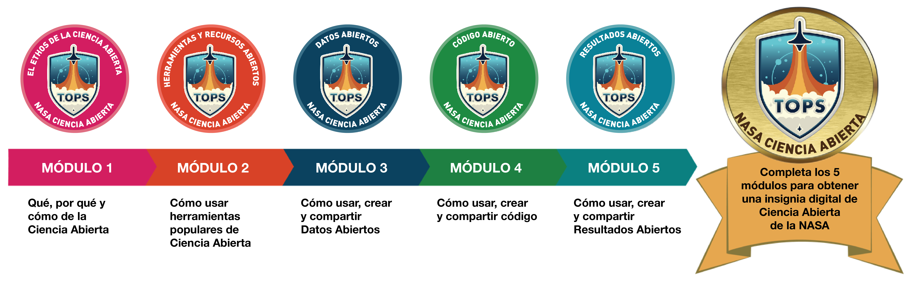

# Plan de estudios de Introducción a la Ciencia Abierta

## Descripción del plan de estudios

Transform to Open Science (TOPS) es una iniciativa de la NASA diseñada para transformar rápidamente agencias, organizaciones y comunidades a una cultura inclusiva de la Ciencia Abierta. Desarrollado por la iniciativa TOPS la guía proporcionada por el plan de estudios de Introducción a la Ciencia Abierta promoverá la transformación del panorama de investigación y el avance concomitante del descubrimiento científico. El plan de estudios de Introducción a la Ciencia Abierta tiene como objetivo introducir una comprensión matizada de la Ciencia Abierta, que permita a las personas participantes comprender mejor el flujo de trabajo de Ciencia Abierta de principio a fin. El enfoque será proporcionar una comprensión básica de la Ciencia Abierta, su espíritu y beneficios, y cómo participar activamente en comunidades relacionadas a la Ciencia Abierta. El plan de estudios de TOPS también se utilizará para apoyar a quienes investigan y buscan comprometerse con la NASA a medida que ésta adopta requisitos científicos de Ciencia Abierta. Quienes investigan deberán adquirir las nuevas habilidades destacadas en el plan de estudios para participar eficazmente en la Ciencia Abierta y demostrar esas habilidades al aplicar a oportunidades de financiación de la NASA.

## Plan de estudios de Ciencia Abierta: Introducción a la Ciencia Abierta

### 5 módulos organizados como flujo de trabajo científico

Completando los cinco módulos y aprobando la evaluación al final de cada uno de ellos se obtiene una insignia digital de "NASA Open Science".

## Contenidos

### [Módulo 1 - El Ethos de la Ciencia Abierta](./Module_1)

- [Lección 1: ¿Qué es la Ciencia Abierta?](./Module_1/Lesson_1)
- [Lección 2: ¿Por qué es importante la Ciencia Abierta?](./Module_1/Lesson_2)
- [Lección 3: Cómo hacer Ciencia Abierta](./Module_1/Lesson_3)
- [Lección 4: Cuando no se debe abrir](./Module_1/Lesson_4)
- [Lección 5: Planificar para la Ciencia Abierta: De la teoría a la práctica](./Module_1/Lesson_5)

### [Módulo 2 - Herramientas y Recursos Abiertos](./Module_2)

- [Lección 1: Introducción al proceso de la Ciencia Abierta](./Module_2/Lesson_1)
- [Lección 2: Herramientas generales para la Ciencia Abierta](./Module_2/Lesson_2)
- [Lección 3: Herramientas para Datos Abiertos](./Module_2/Lesson_3)
- [Lección 4: Herramientas para Código Abierto](./Module_2/Lesson_4)
- [Lección 5: Herramientas para Resultados Abiertos](./Module_2/Lesson_5)

### [Módulo 3 - Datos Abiertos](./Module_3)

- [Lección 1: Introducción a los Datos Abiertos](./Module_3/Lesson_1)
- [Lección 2: Usar Datos Abiertos](./Module_3/Lesson_2)
- [Lección 3: Hacer Datos Abiertos](./Module_3/Lesson_3)
- [Lección 4: Compartir Datos Abiertos](./Module_3/Lesson_4)
- [Lección 5: De la teoría a la práctica](./Module_3/Lesson_5)

### [Módulo 4 - Código Abierto](./Module_4)

- [Lección 1: Introducción al Código Abierto](./Module_4/Lesson_1)
- [Lección 2: Usar Código Abierto](./Module_4/Lesson_2)
- [Lección 3: Hacer Código Abierto](./Module_4/Lesson_3)
- [Lección 4: Compartir Código Abierto](./Module_4/Lesson_4)
- [Lección 5: De la teoría a la práctica](./Module_4/Lesson_5)

### [Módulo 5 - Resultados Abiertos](./Module_5)

- [Lección 1: Introducción a Resultados Abiertos](./Module_5/Lesson_1)
- [Lección 2: Usar Resultados Abiertos](./Module_5/Lesson_2)
- [Lección 3: Hacer Resultados Abiertos](./Module_5/Lesson_3)
- [Lección 4: Compartir Resultados Abiertos](./Module_5/Lesson_4)
- [Lección 5: De la teoría a la práctica](./Module_5/Lesson_5)

## Sobre esta versión 

Como parte de nuestro trabajo para que la producción, la comunicación y la aplicación de saberes científicos y técnicos sean globalmente equitativas, en MetaDocencia reconocemos que es fundamental poder compartir recursos accesibles para comunidades hispanohablantes. Por ello, y gracias al financiamiento de la NASA, en MetaDocencia trabajamos colaborativamente durante abril, mayo y junio de 2024 en el desarrollo de versiones contextualizadas y más accesibles de los contenidos de los 5 módulos de NASA-TOPS Open Science 101. 
Este trabajo de contextualización busca desarrollar recursos de calidad en español a partir de material originalmente en otro idioma, donde calidad no implica sólo una correcta traducción del contenido sino también su adaptación al contexto regional de manera que resulte accesible y significativo.

Este trabajo es fruto del esfuerzo colectivo y colaborativo de la comunidad de MetaDocencia y en particular de las siguientes personas:

- Alejandra Daniela Calero (traducción y revisión)
- Ariel Silvio Norberto	Ramos (traducción y revisión)
- Gastón Klocker (traducción y revisión)
- Jeremías Fabiano (traducción y revisión)
- Jose Luis Villca Villegas (traducción y revisión)
- Juan Pablo Barreyro (traducción y revisión)
- Julieta	Millan (traducción y revisión)
- Julio Zetter Patiño (traducción y revisión)
- Julián Buede (traducción e imágenes)
- Karina	Formoso (traducción y revisión)
- Irene Vazano (traducción y coordinación)
- Laura Ación (coordinación)
- Laura Dillon (contribución)
- María Belén Allasia (traducción y revisión)
- María Nanton (imágenes)
- María Jimena Vera (traducción y revisión)
- Nicolás Palopoli (traducción y coordinación)
- Pablo Vázquez (traducción y revisión)
- Paola Lefer (traducción y revisión)
- Rogelio Dillon (contribución)
- Romina Pendino (traducción y revisión)
- Sabrina López (traducción, revisión, edición y coordinación)
- Vanesa Ruiz (traducción y revisión)
- Vanina	Varni (traducción y revisión)
- Verónica Xhardez (edición)
